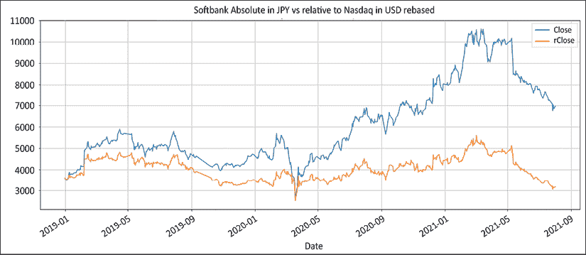
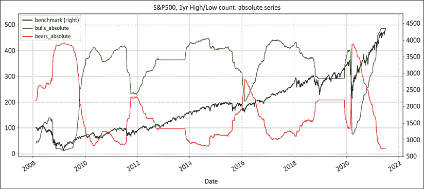
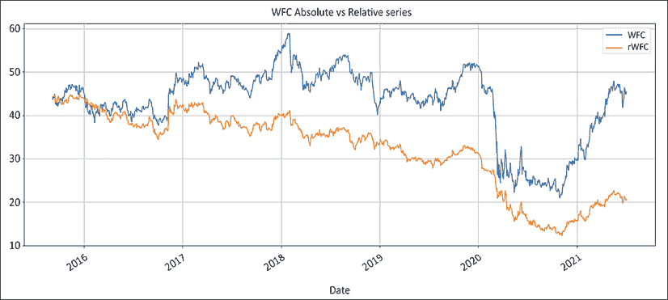

# 四、多头/空头方法：绝对和相对

在这一章中，我们将比较方法，特别关注绝对序列和相对序列。绝对系列是你在任何网站或平台上看到的**高开低走** ( **OHLC** )价格。它们通常经过股息、股票分割和其他公司行为的调整。相对序列是上述绝对序列除以基准收盘价格，并根据汇率进行调整。

我们希望展示绝对方法的缺点和相对缺点方法的优点，这将为本书的其余部分定义我们的方法论。我们将在途中讨论以下主题:

*   导入库
*   多头/空头 1.0:绝对方法
*   Long/Short 2.0: The relative weakness method

    您可以通过以下链接访问本章所有图片的彩色版本:[https://static . packt-cdn . com/downloads/9781801815192 _ color images . pdf](https://static.packt-cdn.com/downloads/9781801815192_ColorImages.pdf)。你也可以通过这本书的 GitHub 资源库获得本章的源代码:[https://GitHub . com/Packt publishing/algorithm-Short-Selling-with-Python-Published-by-Packt](https://github.com/PacktPublishing/Algorithmic-Short-Selling-with-Python-Published-by-Packt)。

# 导入库

下面的代码，实际上也是本书中的大多数代码，首先需要安装`yfinance`包:

```
pip install yfinance 
```

`yfinance`然后可以导入:

```
import yfinance as yf 
```

对于本章和本书的其余部分，我们也将与`pandas`、`numpy`和`matplotlib`一起工作。因此，请记住首先导入它们:

```
# Import Libraries
import pandas as pd
import numpy as np
%matplotlib inline
import matplotlib.pyplot as plt 
```

# 多头/空头 1.0:绝对方法

> “‘可是皇帝什么也没穿啊！’一个小孩说。
> 
> “听听天真的声音！”，他的父亲喊道。"
> 
> 亚瑟·安德森

绝对法有直观意义:买上涨的股票，做空下跌的股票。来自不同提供商的数据、屏幕上的价格图表以及投资组合中的内容之间存在一一对应的关系。每个人都说同样的语言。投资者、市场评论员和各种其他市场参与者谈论相同的价格和一般的估值水平。做空绝对值下降的股票会产生现金，可用于买入更多做多股票，并提高杠杆率。

只有一个小问题:产品并不总是像罐头上说的那样。让我们保持文明:绝对方法从一开始就是一个彻头彻尾的失败，接下来的部分将考虑原因。

## 在降低与基准的相关性方面无效

投资者明确地为不相关的回报支付溢价。在 execution trader English 中，投资者希望他们的钱增值，而不管市场先生的情绪波动。让我们看看为什么绝对方法不能实现这个承诺。

在牛市中，水涨船高。很少有股票下跌，但一旦下跌，就会吸引很多关注。长期持有人退出股票，而卖空者大举买入。这些股票变成了拥挤的空头。众所周知，流行的空头很难交易——它们流动性差，波动大。进出这些股票有一些不利的市场影响，借贷费用昂贵，而且它们也容易出现空头挤压，即熊市下跌结束时的剧烈反弹。因为没有人想在短时间的挤压中被逼得走投无路，这就给下注额设置了一个自然的上限，导致了空头支票的萎缩。

另一方面，长账簿在牛市中被过度开发了。这导致高结构性正净敞口，这是对市场向上方向的明确押注。在金融克里奥尔语中，这些被称为“定向对冲基金”这些基金经理高谈阔论灵活多变的管理，但一旦市场变得悲观，他们就会躲在自己舒适的办公桌下寻求庇护。相反，在熊市中，很少有股票会上涨。空头想法比比皆是，但在实践中，风险敞口很少进入负值区域。这意味着投资者缓冲了冲击，但仍会亏损。

下图显示了标准普尔 500 指数和使用绝对价格序列的牛市或熊市中所有成分的计数。


图 4.1:看涨或看跌区域的股票数量随着市场波动而大幅波动

前面的图表，以及另一个将这种方法与相对弱势方法进行比较的图表(我们将在*双方一致提供新想法*一节中回来)，可以通过执行以下源代码来生成:

```
# S&P500 dataframe: list of tickers
sp_df = pd.read_html('https://en.wikipedia.org/wiki/List_of_S%26P_500_companies')[0]
sp_df['Symbol'] = sp_df['Symbol'].str.replace('.', '-')
bm_ticker = '^GSPC'
tickers_list = [bm_ticker] + list(sp_df['Symbol'])[:]

# Variables instantiation
window = 252
df_abs = pd.DataFrame()
batch_size = 20
loop_size = int(len(tickers_list) // batch_size) + 2

for t in range(1,loop_size): # Batch download
    m = (t - 1) * batch_size
    n = t * batch_size
    batch_list = tickers_list[m:n]
    print(batch_list,m,n)
    batch_download = yf.download(tickers= batch_list,
                                 start= '2007-01-01', end = None, 
                                 interval = "1d",group_by = 'column',
                                 auto_adjust = True, 
                                 prepost = True, treads = True, 
                                 proxy = None)['Close']
    df_abs = df_abs.join(batch_download, how='outer')

### removed for brevity: check GitHub repo for full code ###
bullbear['bulls_absolute'] = df_abs[df_abs > 0].count(axis=1) 
bullbear['bears_absolute'] = df_abs[df_abs < 0].count(axis=1) 
bullbear['bulls_relative'] = df_rel[df_rel > 0].count(axis=1) 
bullbear['bears_relative'] = df_rel[df_rel < 0].count(axis=1) 

bullbear[280:][['benchmark','bulls_absolute', 'bears_absolute', 
               ]].plot(figsize=(20,8),
                style=['k', 'g', 'r'],grid=True,secondary_y=['benchmark'],
                title = 'S&P500, 1yr High/Low count: absolute series' )

bullbear[280:][['benchmark','bulls_absolute', 'bears_absolute', 'bulls_relative', 'bears_relative']].plot(figsize=(20,8),
                style=['k', 'g', 'r','g:', 'r:'],grid=True,secondary_y=['benchmark'],
                title = 'S&P500, 1yr High/Low count: absolute & relative series') 
```

前面代码的结构相当简洁明了:

1.  导入`yfinance`模块，从雅虎财经下载。
2.  使用`pandas.read_html`方法下载最新的标准普尔 500 成分。提取股票列表，将`.`替换为`-`，以确保与雅虎财经的兼容性。
3.  实例化数据帧和变量以处理数据和汇总结果。使用模数`//`函数计算批量。
4.  给批量下载收盘价添加一个循环。使用`join`方法添加到`df_abs`。
5.  通过将`df_abs`除以`bm_ticker`列(用`axis=0`指定)来创建`df_rel`，然后用索引的第一个值对其进行重新排序:
    1.  使用`np.where`方法定义看涨/看跌机制:如果收盘是 252 个周期中最高的，分配`1`，如果收盘是 252 个周期中最低的，分配`–1`；否则，分配`np.nan`。
    2.  将`1`和`-1`传播到`np.nan`缺失值。
6.  汇总`bullbear`数据帧的结果，加上绝对和相对数据帧的水平计数(`axis=1`)。
7.  绘制基准指数、看涨指数和看跌指数。

当市场上涨时，看涨股票的数量就会增加。当市场转为横盘或熊市时，处于熊市的股票数量会上升。这表明绝对方法根据定义与市场相关。看一看多头/空头基金的跟踪记录就足以得出结论，绝对方法未能带来不相关的诱人回报。

接下来的几节将考虑绝对方法的一些缺点。

## 在降低波动性方面无效

由于短边的想法比另一边少，平衡曝光的方法是加大更集中的书的尺寸。这转化为稀释的、波动性相对较低的多头投资组合和一些集中的“结构性空头”押注。正如我们在*第 3 章*、*中看到的，在野生空头一侧散步*，拥挤的空头流动性差，因此更容易出现波动峰值。卖家不缺，有勇气的买家少。

短期波动推动整个投资组合。平淡无奇的业绩除以高剩余波动性，只会产生不具吸引力的波动调整回报率。

## 历史下跌保护很少，如果有的话

绝对方法可能会在牛市期间带来正回报。但每次市场下跌，业绩都会遭遇“软肋”。

在**大金融危机**(**【GFC】**)期间，人们原本预计净敞口会降至零以下。毕竟，每个人都在谈论金融末日。如果多头/空头玩家像他们声称的那样乐于做空，净敞口应该会降至 0 以下。这些数字讲述了一个不同的故事。净贝塔值为+0.5，市场参与者剩余看涨。

绝对方法从业者减少净敞口的方法是减少长期敞口，并囤积现金。当扣动短边的扳机时，他们在裤子上施肥。多年的牛市交易已经削弱了他们的卖空能力。如果你想打败迈克·泰森，你需要去健身房，把你的笑容矫正几次。

## 较低投资工具

绝对方法已经赢得了它的生存危机。多头/空头 1.0 既不是复杂的，也不是安全的投资工具。无论从哪方面来看，它都是一种次等的交通工具。在牛市中，它比共同基金和指数基金赚得少。它在熊市中损失的钱只比指数少。扣除费用后，投资者用绝对方法计算的复利比用低技术含量的普通指数基金要少。与传统的共同基金相比，这里的透明度和流动性更低。因此，这些基金未能吸引和留住寻求稳定、无关联回报的养老基金就不足为奇了。绝对多头/空头基金的业务是为自己赚钱，偶尔也为投资者赚钱。

## 落后指标

> "重力是傻瓜的盾牌"
> 
> 法国哲学家孟德斯鸠

股票不是洲际弹道导弹。它们不会因为无法获得足够的船用柴油来装满整个油箱而从天上掉下来:

1.  首先，他们落后于直接竞争对手。
2.  第二，他们落后于同行业的其他股票。
3.  第三，他们落后于他们的部门。
4.  第四，它们的表现逊于大盘指数。
5.  第五，它们的绝对值最终会下降。

底线是，当这些股票出现在人们的雷达屏幕上时，它们已经跌了很多。在一个创造性的丰富多彩的侮辱是一种职业消遣的行业中，很少有比被称为落后者指标更令人恼火的了。然而，这似乎是做多/做空业务中的主导商业模式。

多头/空头市场参与者肯定不是傻瓜。他们受过高等教育，富有奉献精神，工作努力。“做多强势”和“做空弱势”是正确的想法——绝对数据系列只是错误的数据集。作为替代，下一节将讨论使用相对系列相对于绝对价格的好处。

# 多空 2.0:相对弱势法

> “真理本质上是不言自明的。一旦你去除了包围着它的无知的蜘蛛网，它就会闪闪发光。”
> 
> 圣雄甘地

标准普尔 500、纳斯达克 100、富时 100 和东证指数等指数是其成份股的市值加权平均值。在任何时间段内，大约有一半的股票表现会比指数好，其余的会比指数差。从大量相对表现不佳的股票中挑选的股票要比那些绝对值下跌的股票多得多。

下面是计算相对系列的源代码:

```
def relative(df,_o,_h,_l,_c, bm_df, bm_col, ccy_df, ccy_col, dgt, start, end,rebase=True):
    '''
    df: df
    bm_df, bm_col: df benchmark dataframe & column name
    ccy_df,ccy_col: currency dataframe & column name
    dgt: rounding decimal
    start/end: string or offset
    rebase: boolean rebase to beginning or continuous series
    '''
    # Slice df dataframe from start to end period: either offset or datetime
    df = df[start:end] 

    # inner join of benchmark & currency: only common values are preserved
    df = df.join(bm_df[[bm_col]],how='inner') 
    df = df.join(ccy_df[[ccy_col]],how='inner')

    # rename benchmark name as bm and currency as ccy
    df.rename(columns={bm_col:'bm', ccy_col:'ccy'},inplace=True)

    # Adjustment factor: calculate the scalar product of benchmark and currency
    df['bmfx'] = round(df['bm'].mul(df['ccy']),dgt).fillna(method='ffill')
    if rebase == True:
        df['bmfx'] = df['bmfx'].div(df['bmfx'][0])

    # Divide absolute price by fxcy adjustment factor and rebase to first value
    df['r' + str(_o)] = round(df[_o].div(df['bmfx']),dgt)
    df['r' + str(_h)] = round(df[_h].div(df['bmfx']),dgt)
    df['r'+ str(_l)] = round(df[_l].div(df['bmfx']),dgt)
    df['r'+ str(_c)] = round(df[_c].div(df['bmfx']),dgt)
    df = df.drop(['bm','ccy','bmfx'],axis=1)

    return (df) 
```

接下来，我们将带着这个函数旋转一下。软银(9984。t)是一家在**东京证券交易所** ( **TSE** )上市的公司。它用日元交易。近三十年来，该公司一直是美国科技行业的主要参与者。因此，软银将以纳斯达克为基准，以美元计价:

```
ticker = '9984.T' # Softbank
ohlc = ['Open','High','Low','Close']
_o,_h,_l,_c = [ohlc[h] for h in range(len(ohlc))]
start= '2018-12-30'
end = None
df =  round(yf.download(tickers= ticker,start= start, end = end, 
                        interval = "1d",group_by = 'column',                        auto_adjust= True, prepost= True,                         treads = True, proxy = None),2)
bm_df = pd.DataFrame()
bm_ticker = '^IXIC' #Nasdaq 
bm_col = 'nasdaq'
ccy_df = pd.DataFrame()
ccy_ticker = 'USDJPY=X'
ccy_col = 'JPY'
dgt = 5

bm_df[bm_col] =  yf.download(tickers= bm_ticker,start= start, end = end,
                             interval = "1d",group_by = 'column',                             auto_adjust = True, prepost = True,                              treads = True, proxy = None)['Close']
ccy_df[ccy_col] =  yf.download(tickers= ccy_ticker,start= start,                                end = end, interval= "1d",                               group_by = 'column',auto_adjust = True, 
                               prepost = True, treads = True,                                proxy = None)['Close']

df = relative(df,_o,_h,_l,_c, bm_df, bm_col, ccy_df, ccy_col, dgt, start, end,rebase=True)

df[['Close','rClose']].plot(figsize=(20,8),grid=True,
            title= 'Softbank Absolute in JPY vs relative to Nasdaq in USD rebased' ) 
```

此代码以软银为例，计算了以数据帧开头为基础的相对序列与绝对序列的比较。首先，我们用 OHLC 当地货币下载软银。然后我们下载基准纳斯达克和美元的收盘价格。

我们通过保留布尔标志`rebase=True`来运行基于数据帧开头的相关系列函数。



图 4.2:软银的绝对日元与相对于纳斯达克的美元

当电话的软线断了，人们就带着它们到处走，并逐渐把自己锁起来。自从电话束缚了人类以来，软银一直是东京证交所的发电站。然而，软银以纳斯达克指数为基准，以美元计价，表现平平。在本书的其余部分，我们将使用软银系列的绝对值和日元只是为了演示的目的。这个概念很简单:买入表现好的股票，卖空表现差的股票，从差价中赚钱。关注指数超额收益的想法并不新鲜。共同基金经理的业绩是根据他们的表现来评估的。当只关注长期时，我们的任务是高估表现优异者，低估表现不佳者。权重超过基准的差额称为**活跃资金**

相对弱势法采取了类似的方法。多头/空头投资组合是两个相关账簿的净和。长边是一个典型的共同基金类型的长书。空头由以指数倒数为基准的表现不佳者组成。共同基金的唯一区别是，经理们不是远离表现不佳者，而是积极做空。业绩来源于长期表现好于短期表现差的价差。下面是一个简单的例子。通用电气、通用汽车和高盛属于三个不同的行业。然而，他们有两个共同点。首先，它们是同一个标准普尔 500 指数的成分。其次，当组合在一起时，它们的代码有一个可爱的缩写:GEMS。

下面的代码显示价格序列的绝对值，然后返回相对于基准的相对值。

```
tickers_list = ['GE','GM','GS']

# Dataframes instantiation
gems = pd.DataFrame() 
start = '2020-03-31'
benchmark = yf.download(tickers= '^GSPC',start= start, end = None, 
                        interval = "1d",group_by = 'column',                        auto_adjust = True, prepost = True,                         treads = True, proxy = None)['Close']
failed = [] 
rel_ticker_list = []
for n,ticker in enumerate(tickers_list):
    try: #7 Download & process data
        gems[ticker] = yf.download(tickers= ticker,start= start,                                    end = None, interval = "1d",                                   group_by = 'column',                                   auto_adjust = True, prepost = True,                                    treads = True, proxy = None)['Close']
        gems['rel_'+ticker] = gems[ticker].div(benchmark * gems[ticker][0]) * benchmark[0]
        rel_ticker_list.append('rel_'+ticker)
    except:
        failed.append(ticker)
gems = gems[tickers_list+rel_ticker_list]
gems.plot(figsize= (20,8),secondary_y= rel_ticker_list,style=['r','b','g','r:','b:','g:'], 
          title= 'GEMS Absolute Prices vs Relative Series' ) 
```

该代码采取以下步骤:

1.  `gems`数据帧被实例化。`start`可以是一个日期，例如`2019-12-31`，也可以是一个偏移期，例如`–254`。列表被实例化。
2.  运行一个循环，从雅虎财经下载价格信息。将绝对系列添加到`gems`数据帧。
3.  对于相对系列，除以基准，并在系列开始时重定基数。
4.  追加`rel_list_ticker`以获得前缀为`el`的报价机列表。这将用于以后对列进行排序。
5.  重新排列各列并打印。

结果显示了**通用电气** ( **葛**)、**通用汽车** ( **通用**)和**高盛** ( **GS** )的绝对价格和相对系列虚线:


图 4.3:通用电气(GE)、通用汽车(GM)和高盛(GS)的绝对价格和相对价格

图表显示，相对系列更能表明股票相对于市场的相对实力。在期初，价格相对于基准重新启动，但它们提供了跨部门的统一系列。起初，在上涨的股票上做空似乎不太自然。输钱不是绝对回报玩家的天性。为了理解这个概念，让我们想象一下在熊市中会发生什么。当大熊冲击市场时，没有东西上涨。这意味着，你将寻求购买长期防御型股票，这些股票保持不变，或者下跌速度慢于大盘指数。从长期来看，你的损失将少于市场。通常你会购买非周期性的公用事业、铁路或食品类股。

相反，你将会做空下跌速度超过基准的股票。这些往往是周期性股票，其表现随着经济周期而起伏，如航空公司。顺便说一句，你可以把之前牛市的宠儿留在你的投资组合里，但要记得换边。牛市的领导者倾向于吸引周期后期的动量玩家。这些都是最弱的市场参与者，游戏的后期，没有真正的游戏计划。一旦情况变得艰难，他们就会退出，这导致了突然的业绩吐出。与经典的绝对方法相比，相对系列开启了一个全新的可能性世界。下面是 10 个理由来证明相对弱势法的优越性。

## 双方不断提供新的想法

指数通常是其所有成分的市值加权平均值。这意味着，大约一半的发行将优于市场，而另一半落后于市场。起初，这种过多的想法似乎让一贯关注绝对表现的市场参与者感到不安。市场参与者可能会被诱惑继续使用绝对方法做多，使用相对方法做空。这个糟糕的想法经常导致买入和做空表现不佳的股票。长边必须是短边上部署的策略和系列类型的镜像。

让我们重温一下我们在*中写的脚本，它在降低与基准*部分的相关性方面无效，该部分是关于看涨和看跌区域中的股票数量。正如我们在那里提到的，代码产生两个图表。我们最初发布了使用绝对系列的横向计数，也显示在这里:



图 4.4:标准普尔 500 的股票使用绝对序列看涨或看跌

它表明，标准普尔 500 在过去 12 年里一直处于牛市，其间也有一些小插曲。总体而言，看涨的股票比看跌的股票多得多。矮个子候选人少之又少。俗话说，水涨船高。

不过，我们还是把这个和相对系列比较一下吧。这是一个简单的日线横向计数。相比之下，下面的图表同时使用绝对和相对序列显示了看涨和看跌区域的股票数量，价格除以指数收盘价:


图 4.5:相对于指数，使用绝对系列比较标准普尔 500 看涨或看跌区域的股票数量

虚线代表相对于指数看涨或看跌的股票数量。不出所料，在任何时间点，都有大约一半的股票处于牛市，其他股票处于熊市。这为双方提供了过多的选择。

成分列表不包括历史上的包含/删除。表现不佳、破产或被吸收的股票从指数中删除。这就产生了一种人为的向上漂移，称为生存偏差。生存偏差不影响卖空策略，因为它们的有效性只针对最强的股票。

不管指数如何，新鲜想法总是源源不断。绝对系列根据市场不断变化的情绪有巨大的波动。与此同时，使用相对序列，看涨或看跌区域的股票数量保持相当稳定。这意味着在任何给定的时间里，书的两面都有大量的观点。

随着幅度缩小，表现不佳者的数量甚至可能超过表现优异者。这与人们普遍认为的短期想法少之又少的观点直接矛盾。事实上，表现不佳者多于表现优异者的情况并不少见。

该指数是其成份股的市值加权平均值。它被最大的 100 个大写字母所支配。在横盘或动荡时期，较小的大写字母往往让人想起牛顿物理学。重力对流动性差的股票打击很大。

## 关注行业轮动

在绝对方法中，目标是确定市场顶部和底部的时间。每一个经验丰富的市场参与者都会告诉你，只有两种人能始终把握住顶部和底部的时间。他们要么是健忘症患者，要么是骗子，更常见的是两者兼而有之。当在相对系列中重述一切时，目标是集中于部门轮换。正如我们在上图中看到的，这两个地区的股票数量不会随着时间的推移而大幅波动。这并不意味着同样的股票会永远表现不佳。市场可能会上涨数年，但随着时间的推移，它会回报不同的行业、部门，甚至市值。使用相对弱势法，这意味着买入初期表现优异者，做空早期表现不佳者。想象一下，当你在一场成功的熊市运动后告诉客户，现在是时候转换立场，在世界末日的阴霾中做多早期周期股和小盘股了，这会对客户产生什么影响。

## 提供低相关性产品

将一切除以基准可以去除潜在指数的影响。这机械地去除了与指数的相关性。现在的焦点是超过基准的超额回报。它可能看起来重复，但它把重点放在了家里。根据市场状况，绝对系列在两种机制中的名字数量都有很大的波动。

相反，相对系列在两边有相当一致的名字数。市场波动不会对候选人的规模产生很大影响，正如*双方持续提供新想法*部分所展示的那样。这也是基本的算术。将绝对序列除以指数会去除基准对整个人口的影响。剩下的两个因素是汇率影响和股票表现。

## 提供低挥发性产品

这是表现不佳者大量存在的直接后果。当有过多的空头候选人可供选择时，市场参与者的投资组合会更加多样化。它们的浓度也较低。这降低了波动性。

## 降低借款费用

众所周知，拥挤的短裤借起来很贵。机构股东很少遵守古老的海事荣誉准则。它们不会随船下沉。当表现持续不佳时，他们倾向于平仓。随着时间的推移，这使得借款更加难以定位。

另一方面，表现不佳者仍受益于某种惯性。借款接近一般抵押品，换句话说，便宜且充足。当坏消息传来，绝对玩家潜伏在周围时，相对卖空者可以将接力棒传给不那么老练的对手。前者可以转向便宜易借的短裤，而后者则被留下来咀嚼昂贵、干燥、难借的名字。

## 提供可扩展性

绝对方法的一个问题是缺乏可伸缩性。绝对值下降的股票通常很受欢迎。拥挤的短裤不稳定，流动性差。很难建立大的盈利头寸。

2007 年，通常被称为量化基金的量化基金艰难地认识到，卖空拥挤的股票是有限度的。当双方都有充足的想法时，随着管理的资产(**)继续增长，集中度可以保持在较低水平。**

 **## 非对抗性的

相对的方法是非对抗性的。相对卖空者不需要把事情个人化。防御性公司的管理层明白，它们的股票在牛市中必然表现不佳。在这个前提下，当他们的股票被卖空或买进时，他们不会生气。相反，雄心勃勃的科技企业家知道，熊市并不是 IPO 旺季。

## 货币调整成为优势

拥有地区或全球授权的基金经理会同时操作多种货币和指数。将一切都转换成相对于全球或地区基准的基金货币，将所有股票置于同一个竞技场上。

不需要额外的宏观视角、货币对冲和风险管理。一切都以相同的货币和基准调整单位重新计算。例如，日本市场因其货币贬值 40%而飙升。以日元计价的基金经理以本币计价表现良好；他们以美元计价的同行表现不佳，尽管他们的投资组合中有完全相同的股票。日元贬值抵消了所有收益。

但管理经汇率调整的相对投资组合并不直观。从选股到投资组合管理，一切都必须根据基准和基金货币进行调整。诸如进场、出场和仓位调整等决策需要以货币调整后的相对价格来做出。大多数数据供应商提供的绝对货币和当地货币图表回答了相对市场参与者永远不应该问自己的问题。比较股票和货币的绝对值就像比较苹果和橘子。将整个投资领域转换成相对序列在一开始会更复杂一点，但之后就更容易操作了。

## 其他市场参与者无法猜测你的水平

市场参与者经常抱怨“他们”触发了他们的止损，或者“他们”执行了他们的订单。市场参与者倾向于在支撑位/阻力位设置止损，整数。一些算法是专门为游戏休息顺序设计的。当所有价格水平都是相对于指数计算的，并根据汇率进行调整时，那些狙击算法就无效了。相对参与者反应的系列不同于绝对水平。

另一方面，止损必须得到积极管理。在 execution trader English 中，与来自交易所的价格不符的订单不能被执行。

## 你会看起来像一个投资天才

正如我们之前看到的，股票的绝对值不会突然下降。表现不佳始于他们的竞争对手，并延伸到行业、部门和更广泛的市场，然后绝对值暴跌。在相对基础上做空可能会有一段时间的痛苦。然而，对于那些专注于绝对价格的人来说，这似乎是有先见之明的。

一张图胜过千言万语。下图描绘了**富国银行** ( **WFC** )的相对和绝对业绩:

```
ticker = 'WFC'
benchmark = '^GSPC'
tickers_list = [benchmark] + [ticker]

data = round(yf.download(tickers= tickers_list,start= '2015-09-07', end = None,
            interval = "1d",group_by = 'column',auto_adjust = True, 
            prepost = True, treads = True, proxy = None)['Close'],2)

data['r'+str(ticker)] = round(data[ticker].div(data[benchmark])*data[benchmark][0] ,2)
data[[ticker,'r'+str(ticker)]].plot(figsize=(20,8),grid=True,
title= str.upper(ticker)+ ' Absolute vs Relative series') 
```

这会产生以下图表:



图 4.6:丑闻发生前一年(至今)富国银行的绝对和相对数据

图表开始于丑闻爆发前的一年零一天。表现不佳早在绝对股价计入即将发生的事情之前就开始了。相对绩效提前几个月对绝对绩效进行贴现。

现在，假设你在丑闻发生前 6 个月就开始做空富国银行。对于那些如此渴望找到一个好的卖空者的投资者来说，还有更好的卖点吗？没有比根据相对于指数的变化绘制绝对值图表更好的营销手段了。想象一下，在这个世界上所有的恩龙、莱曼、GMs 和 Kodaks 成为新闻之前很久，你就锚定了他们的空头头寸。

抢在所有人的前面会有一定的安全系数。头寸不太容易受到熊市反弹的影响。然而，这只是等式的一半。从短边出去会很乱。随着短裤越来越受欢迎，成交量逐渐减少。这就是相对方法提供决定性优势的地方。到了某个时候，卖压就做了。相对卖空者有充足的时间来回补他们的空头，而绝对卖空者则加倍努力进行尖刻的讨伐。股票开始跑赢大盘，开始时不易察觉，后来变得顽固，之后开始顽强上涨。这总是抓住那些寄希望于永远不会到来的二次探底的绝对基本面卖空者。

# 摘要

在这一章中，我们概述了从绝对 OHLC 价格转换到相对系列的好处。绝对参与者是落后的指标，而相对参与者领先。采用本章概述的方法的市场参与者将拥有独特的优势。他们将能够在众人之前建立和清算头寸。他们将看起来像有先见之明的投资天才。他们会有更多的想法可供选择。他们的投资组合与市场的相关性会更低，波动性也会更低。这些都是投资者寻找的特征。

一旦所有股票都相对于基金货币基准进行了重新估值，下一步就是根据它们的状态对投资领域进行重新分类:看涨、看跌、横盘。我们将在下一章讨论这个问题。**