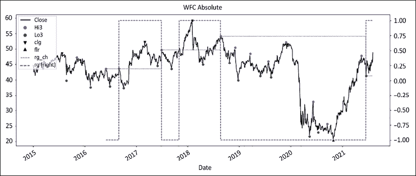
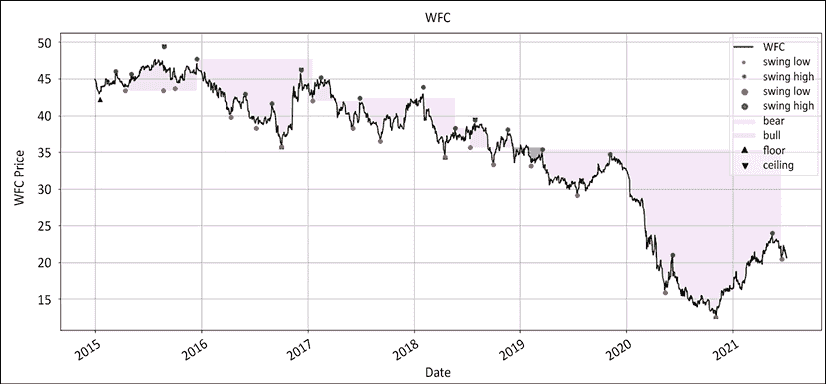

# 十二、信号和执行

> “我们有两只耳朵和一张嘴，所以我们听的是说的两倍，”
> 
> 爱比克泰德

这一章将告诉你你应该如何安排订单的优先次序，以及这背后的原因。我们将着眼于用相对序列管理投资组合，但以绝对序列执行。我们将深入研究退出，从无利可图和有利可图的开始。我们会考虑出口的心理卫生。然后，我们将继续讨论一个热门话题:参赛和重返赛场。我们会想出违反直觉但有效的低风险高回报的进场技术。整本书已经引出了这一章和下一章，所以我们将重温这本书的部分内容，给出一些代码来综合我们目前所看到的一切，并可视化结果。

在此过程中，我们将讨论以下主题:

*   导入库
*   时机就是金钱:把握订单时机的重要性
*   订单优先级
*   出口
*   进入

您可以通过以下链接访问本章所有图片的彩色版本:[https://static . packt-cdn . com/downloads/9781801815192 _ color images . pdf](https://static.packt-cdn.com/downloads/9781801815192_ColorImages.pdf)。你也可以通过这本书的 GitHub 资源库获得本章的源代码:[https://GitHub . com/Packt publishing/algorithm-Short-Selling-with-Python-Published-by-Packt](https://github.com/PacktPublishing/Algorithmic-Short-Selling-with-Python-Published-by-Packt)。

# 导入库

对于这一章和本书的其余部分，我们将使用`pandas`、`numpy`、`yfinance`和`matplotlib`库。我们还将与来自 ScientificPython 库的`find_peaks`合作。因此，请记住首先导入它们:

```py
# Import Libraries
import pandas as pd
import numpy as np
import yfinance as yf
%matplotlib inline
import matplotlib.pyplot as plt
from scipy.signal import find_peaks 
```

# 时机就是金钱:把握订单时机的重要性

2005 年，日本市场经历了指数式增长。僵尸股又活跃起来了！2006 年 1 月下旬，警方突袭了这个派对。他们逮捕了这种新日本模式的典型代表。突然间，感觉像是夜总会要关门了。粗糙的霓虹灯突然打开了。憔悴的醉鬼们在舞池里面面相觑，困惑不解，不知所措。现实带着复仇回来了。漂浮的僵尸重新发现了牛顿物理学。不幸的是，任何单一发行的借贷的可获得性和成本都令人望而却步，所以我和我在美林证券借贷柜台的伙伴们一起，想出了一个**信用评级资产价格** ( **废话**)篮子互换的主意。我们把能找到的僵尸都扔了进去。借贷成本是可以承受的 2%。价格将是当天收盘价格。容量实际上是无限的。在综合贝塔系数为 2.3 时，它的扭矩远远大于指数期货。我们在做生意。

但是当扣动扳机的时候，校长犹豫了。他抱怨说这太不稳定，太冒险，太不正统。所以，我们结束了对它的“监控”，这是一个创造垄断利润的时髦词:-2%，-4%，-5%，日复一日。尽管如此，他对这种交易并不满意。三周后，我得出结论，异国情调是一个度假目的地，而不是十亿美元投资组合中四分之三的空头头寸。然后，有一天，互换交易开始了。上面也有我的名字。那天晚上我睡不着。第二天，它又下跌了 2%。第二天，它又下跌了-0.5%，但随后，它开始稳定下来。上涨了+0.5%、+3%、+6%。我们完美地计算出了底部的时间。但现在，所有卖空交易之母给卖空者带来了民主。最终，我们平仓，在不到两个月的时间里，一个空头工具下跌了 63%，损失巨大。

这个故事的寓意是:时间就是金钱。有正确的想法是一回事。执行得好是另一回事。熊市反弹是有规律的。人生中有三件事是必然的:税收、死亡，以及介于两者之间的熊市反弹。一些市场参与者声称，市场不能被计时。从长期来看，市场更加宽容。想法的产生和执行是可以融合的。拯救多头参与者的上涨趋势也惩罚了卖空者。许多基本面卖空者经常哀叹他们为时过早，有时又为时过晚。

# 订单优先级

进入是一种选择，退出是一种必然。你可以在你认为合适的时候进入，但是你很少有机会按照自己的方式退出。在执行交易英语中，进场是限价单，而出场是止损单或市价单。只做多的经理经常为现金余额而苦恼。他们需要知道每天能买多少。一个多头/空头投资组合比一个经典的只做多头的书有更多的移动部分。事情很快就会变得一团糟。因此，为进出设置“通行权”是谨慎的。在执行交易英语中，退出总是第一位的。现金耗尽的订单有“通行权”。这可以总结如下:

1.  买入返售是最高优先级。它的功能类似于购买订单。它耗尽现金。空头回补对多头购买力和总敞口有影响。买入返仓可能在极少数情况下触发保证金追缴。
2.  做多是第二重要的事情。它释放了固定的现金。
3.  卖空:做空可以产生现金。这些多余的现金可以用来购买更多的股票。一些司法管辖区强制卖空者在发出卖空指令前借入股票。否则将导致**裸卖空**。这种做法指的是在没有事先确定借入方的情况下卖空。这本身并不违法，但却非常令人不快。交易通常被重新归类为“未能交付”并被平仓。如果你想被认真对待，就不要…
4.  买多:同样，最有声望的交易排在最后。只有当所有的交易都已排队时，买入长期订单才应该发生。如果空头没有平仓，但输入了多头，这将减少现金余额。如果需要匆忙补仓，这可能会带来一些风险。

让我们回顾一下。降低风险的交易是第一位的。这些是买入返仓和长期卖出。然后，接下来是旨在增加现金余额的交易:卖空，买入做多。

重返信号是应该给屡犯者一个前排座位的一种情况。任何重新入场的信号都是对长期趋势仍然有效的确认。除此之外，已经有来自先前位置的嵌入式 P&L。因此，综合敞口风险低于任何新条目。然而，这有其局限性。在现有仓位上加仓叫做**加仓**。像生活中的一切一样，趋势成熟了。每一个新的仓位都更接近趋势的成熟——以及最终的衰竭。这增加了集中风险和波动性。因此，谨慎的做法是降低风险，例如每次重新进入时采取较小的头寸。位置大小最终会太小并被拒绝。

接下来，我们将更详细地看看在相对系列上运行系统时会发生什么。

## 相对价格和绝对执行

虽然你的系统运行在经汇率调整的基准相对价格上，但发送以美元相对于摩根士丹利资本国际世界(MSCI World)的日本股票订单肯定会在交易台上引发一些滑稽的面部表情。这可能对你来说一清二楚，但我要声明，交易者不擅长读心术。在现实世界中交流时，必须以当地货币下订单。

由于系统运行在货币调整价格和相对基准价格上，止损不需要转换。其实止损和当地绝对价格没有关系。在前面的章节中，止损是基于相对价格而不是绝对价格。这是因为你的系统应该运行在相对系列。这意味着止损单不需要放在你经纪人的服务器上。没有休息的止损单的一个好处是，他们不能被掠夺性的聪明钱博弈:**高频交易** ( **HFT** )玩家。

## 订单类型

HFT 的出现极大地丰富了交易指令的种类。希望超越交易量加权平均价格的市场参与者非常欢迎探索订购前景。

就本书而言，让我们坚持一个简单的原则:进入是一种选择，退出是一种需要。这意味着退出交易要么是市价单，要么是止损单，要么是限价止损单。挂单要么是成交，要么是止损，要么是限价单。当我们扣动扳机时，我们想要被填满。我们内心的白痴喜欢追逐，但我们的记录讨厌糟糕的执行。在进场和出场时缺乏纪律性会影响你的记录，所以要坚持计划。一点点克制是有回报的。系统建议的从相对序列到绝对序列的转换会有一些小的偏差，但这些最终都会凑在一起。

接下来，让我们回顾一下出口和入口——我们按照这个顺序讨论它们，因为正如我们已经提到的，出口应该优先于入口。

# 出口

退出分为无利可图和有利可图。前者是为了生存，而后者是为了繁荣。我们在*第二部分*、*外围游戏中详细讨论了退出:发展强大的交易优势*。下面是一个循序渐进的简短概括，涵盖了出口的实际方面和心理卫生。

## 止损

止损对交易优势公式中的四个变量中的三个有直接可测量的影响:胜率、损失率和平均损失。仅仅因为这个原因，它总是位于优先级列表的顶部。记住，专业卖空者和游客的区别在于他们有能力设置止损并兑现止损。请将下面的内容视为一份必要的清单。我们在整本书中讨论了所有这些话题，特别强调了第 7 章*，*提高你的交易优势*。*

 *1.  在论点无效的逻辑关节处设置止损
2.  设置一个减轻损失的跟踪止损点:这有两个积极的影响:
    *   它减少了损失，并使收益预期向盈亏平衡倾斜
    *   心理上会更容易处理和停止一个较小的位置
3.  头寸规模:在进行交易之前，运行风险管理来计算你的风险敞口
    *   保守的固定止损
    *   在跟踪止损时咄咄逼人

接下来是心理准备。接受小损失会对你的情感资本造成损害。不要忽视你的精神卫生。提醒一下，所有伟大的交易者都关注心理资本，而平庸的交易者担心均线持续时间或其他无意义的琐事。

## Pre-mortem

想象自己亏本平仓，并接受相关的负面情绪。重复这个过程，调整大小，直到你觉得可以接受亏损。预先包装了你的悲伤。点击“发送”,向您的钱说再见，请考虑以下事项:

1.  **时间停止**:切割或缩小位置尺寸。时间停止在心理上很难实现:“如果我再给它一天，一周，一个月……”一个技巧是想出一个现实生活中的浪费时间的事情，然后把图片固定在这个位置上。
2.  **减轻损失**:冥想，正念。这个防止急切或恐惧。失败是游戏的一部分。
3.  **止损**:这是最坏的情况。如果你在死前做了功课，这应该是一种形式。首先，原谅你自己。

死前检查可以追溯到斯多葛派哲学家和罗马皇帝马可·奥勒留。这是在压力下保持坚忍的最有力的可视化练习之一。

## 蔡加尼克效应

提醒自己以下几点:

1.  一旦位置消失，你将在 2 周内几乎不记得那个位置。你的资本比一单糟糕的交易造成的脑雾更重要。
2.  接受小的损失将确保你能活到下一天交易。带着统治者(前额叶皮层)和战士心态去执行交易。

当你定期查看交易日志时，要特别注意止损。注意你的感受。这不像以前那样充满感情了。你看，这并不难。如果你微笑，很好。储存那种感觉。你正在建立一个聪明的交易战士的新的神经通路。

## 有利可图的退出

下面是获利退出的分步方法:

*   提前决定降低风险的方法:目标价、跟踪出场、期权。不要偏离。
*   不要等待熊市反弹。当人们继续抛售时，平仓你的空头，以避免市场冲击。
*   这是交易中达到盈亏平衡的最小数量:


*   跟随熊市反弹。让它过去吧。如果你已经提前降低了风险，这应该不会影响你的精神状态。当熊市反转时，重新设置你的止损。
*   如果反弹的峰值比前一个低，那就再装；否则，什么都不做。

让我们用一些 Python 代码来总结一下。首先，我们将使用三个变量设置目标退出价格:`price`、`stop_loss`和`r_multiplier`。我们将`r`计算为从`price`到`stop_loss`的距离。然后我们应用一个乘数，恰当地命名为`r_multiplier`。这个数字被加回成本，以计算目标价格。然后，我们将使用相同的`r_multiplier`来计算退出的数量。在*第 7 章*、*提高你的交易优势*中，我们看到了目标价格和退出数量之间的反比关系。

```py
def target_price(price, stop_loss, r_multiplier):
    r = price - stop_loss
    return price + r * r_multiplier

def partial_exit(qty, r_multiplier):
    if (qty * r_multiplier)!= 0:
        fraction = qty / r_multiplier
    else:
        fraction = 0
    return fraction

price = 100 
stop_loss = 110 
qty = 2000 
r_multiplier = 2 

pt = target_price(price, stop_loss, r_multiplier) 
exit_qty = partial_exit(qty, r_multiplier) 
print('target price', pt,'exit_quantity',exit_qty) 
```

输出如下所示:

```py
target price 80 exit_quantity 1000.0 
```

仓位的一半会在 80 的时候退出。这将风险降低了 100%。接下来，让我们考虑如何为你的作品计时。

# 进入

> “把市场波动看做你的朋友而不是敌人；从愚蠢中获利，而不是参与其中。”
> 
> 沃伦·巴菲特

优秀的扑克玩家不会玩自己的牌。他们玩其他玩家的牌。要想成功，你需要系统地让概率向有利于你的方向倾斜。市场恰好是一个概率游戏。实现伟大的方法不仅是玩你的手，也是市场的看不见的手。

第一种玩法是我们在*第五章*、*政体定义*中看到的。让市场来决定股票应该站在哪一边。让我们坦诚一会儿。做空泡沫股票的市场参与者是受压抑的报复交易者。在内心深处，他们对影子自我没有站在多头一边感到愤怒。也许他们关门太早了。也许他们完全拒绝了那艘船。不管是哪种方式，他们都通过将他人的宝贵资金放在短期内造成直接伤害的方式来发泄他们的沮丧。在成年人呼吁回归“公平”估价的背后，隐藏着一个 6 岁孩子受伤的自我“需要正确”的阴影。

没有比 TSLA 更能说明这一现象的了。这是一家汽车制造商，处于一个众所周知的困难脆弱的行业，被视为科技股，其债券被定价为垃圾。有些东西必须放弃。这让卖空者有充足的理由疯狂抛售股票。疫情冠状病毒爆发后，股价跌至 400 美元。这给了卖空者加倍努力的弹药，却在接下来的 6 个月里遭遇了三倍的大幅上涨。

如果卖空者将下跌视为一个机会主义的买入机会，他们还会攻城略地吗？当然不是，他们会笑着跳着去银行。这个星球上的每个人，从瑙鲁到波波-迪乌拉索，都会知道他们选择这只股票有多聪明。现在，他们悲惨地沦落到为这一粗鲁的价格要求正义。不管怎样，别人的钱都不是有效的智商测试。再一次，他们让他们的自我在市场永恒的舞蹈中踩了他们的脚趾。小心那些在伊卡洛斯股票上扮演上帝的预言家，因为他们可能会把你拖进表现不佳的世界。听从他们的建议，把最后一枚硬币留给冥河摆渡人。如果卖空游戏是关于玩市场的看不见的手，那么让市场为你做重担。卖空被市场贬低的债券，买入有需求的债券。

玩市场的第二个方法是选择进场的时间。多年来，我常常抱怨短暂的挤压。我会进入一个位置，感觉良好，然后在下一次熊市反弹时被毫不客气地止损出局。金融资本受到伤害，而情感资本又受到另一种侮辱。更重要的是，这一课似乎被遗忘了。后来有一天，短暂挤压的能量在我的智力密度上显现出来。因为价格似乎反弹超过了我的“沙线”止损，我所要做的就是等待下一次熊市反弹，看看新的海岸线，并获得更好的执行。

我开始将熊市反弹视为礼物。他们把他们的宝藏带到岸上挑选。一旦熊市反弹开始消退，价格就会像职业政客一样摇摆不定。卖空者搁浅在岸上。乐观的长期持有人还没有被拖到新的深度。分界线是清楚的。在 execution trader English 中，这是一个低风险高回报的进场价格，在顶部附近有明确的止损，未来可能下跌。等待市场翻转，然后沿着看跌趋势打印一个新的较低的波动高点，以进入做空。顺便说一下，这是多头“逢低买入”技术的镜像入口。

第三种玩法是执行。卖空者面临不成比例的不利概率。如果你在跌停时做空，记住 90%以上的市场参与者只会做多，有人会把当前的疲软视为折价买入的机会。如果你在看跌的股票反弹时做空，你可能会被做空或牛市的开始所套牢。作为卖空者，概率对你有利的时间非常有限。为此，你需要密切关注价格走势。

一个很好的比喻是美洲豹，非洲四大豹中最小的一只。尽管智胜、跑得快、武器多，豹子从不追逐猎物。他们藏在树上，等待猎物来找他们。卖空者需要以同样的方式行事。这是一个分三步走的过程。

1.  首先，你的机制分析(从第五章第一章第一章第三章 T2 机制定义)应该已经确定股票可能处于横盘或熊市模式。认同市场通常会使可能性向你有利的方向倾斜。
2.  第二，宇宙已经缩小到一个可投资候选人的短名单。
3.  第三，熊市反弹传递出一个明确的信号，即多头不再掌权。

市场决定了两个步骤:设置和执行。分析产生了一个步骤:可投资候选人的短名单。我们已经在*第二部分*、*外层游戏:发展强大的交易优势*中讨论了如何提升你的交易优势，但我们将再次讨论一些关键的观点:

*   第一，用相对数列。
*   第二，在体制内对表现不佳者和表现优异者进行分类。
*   第三，在高点后做空，在低点后做多。
*   第四，在逻辑关节处设置止损。
*   第五，计划部分退出以降低风险。

让我们回到豹子身上。一旦它猛扑过去，它不会在半空中停下来思考生命的意义、虐待动物或在细胞水平上素食的相对好处。反省的时间已经过去了。现在，是执行的时候了。游客们一旦断定这是一艘合适的船，就会跟着它跳起来游泳。专业人士会耐心等待市场反弹，吸引游客。当汽车拉力赛靠岸并翻车时，他们会跳袖手旁观舞，只有那时他们才会在渡船上坐下。关于卖空的最好消息是熊市反弹的节奏规律。

## 展期:熊市反弹的合气道

每一个已经练习了足够长时间的卖空者都在熊市反弹中受到了伤害。一个简单的角度变化就能把这种能量从毁灭转化为驾驭的力量。

目标是以合理的成功概率尽可能早地进入。短暂的挤压可能会很棘手。它们总是比预期走得更远，持续的时间更长。

卖空者走向精通的标志是，在下一次大的下跌中是正确的，但仍然低估了熊市反弹的能量。尊重市场，因为他们肯定不尊重你。市场不知道你的名字，也不应该在乎。接受你将不得不为确认付费。等待当地高峰过去，翻车开始。我们将在后面用一些图表来说明这一点，但是现在，让我们看看这种方法的优点。

这种翻转或潮汐滚动方法有几个优点:

*   **风险管理**:当前高点低于峰值。多头不再掌权了。如果峰值超过，这是政权可能已经改变的早期迹象。趋势是你的朋友。
*   **入口接近顶部**。熊市一片混乱。多头乐观。你投机取巧。概率现在在你的角落里。
*   借款的可获得性:熊市通常会赶走游客。又可以借了。即使是最直言不讳的卖空者也不敢涉足。
*   **更大的头寸规模**:接近顶部保证了比分解水平更大的规模。你离逻辑止损更近了。如果价格反弹超过目前的顶部，你已经为自己制定了退出计划
*   **清晰的分界线**:顶部是多头和空头的落脚点。有关于供给、需求和波动的信息。

下面是我们之前讨论过的其他一些经典的输入方法。

## 移动平均线

均线是简单、有效且足够稳健的信号。虽然没有完美的策略，但通常最好使用短期移动平均线，比如收盘低于 5 日移动平均线。请参考*第 5 章*、*机制定义*，了解移动平均线交叉的更多信息。

## 回撤

回撤信号距离最高点的距离。这可以是从最高价到最低价的距离，用平均真实范围表示。把它想象成一种跟踪止损。提醒一下，请看一下我们在第五章、*机制定义*中概述的回撤摆动函数:

```py
def retracement_swing(df, _sign, _swg, _c, hh_ll_dt, hh_ll, vlty, retrace_vol, retrace_pct):
    if _sign == 1: # swing high
        retracement = df.loc[hh_ll_dt:, _c].min() - hh_ll

        if (vlty > 0) & (retrace_vol > 0) & ((abs(retracement / vlty) - retrace_vol) > 0):
            df.at[hh_ll_dt, _swg] = hh_ll
        elif (retrace_pct > 0) & ((abs(retracement / hh_ll) - retrace_pct) > 0):
            df.at[hh_ll_dt, _swg] = hh_ll

    elif _sign == -1: # swing low
        retracement = df.loc[hh_ll_dt:, _c].max() - hh_ll
        if (vlty > 0) & (retrace_vol > 0) & ((round(retracement / vlty ,1) - retrace_vol) > 0):
            df.at[hh_ll_dt, _swg] = hh_ll
        elif (retrace_pct > 0) & ((round(retracement / hh_ll , 4) - retrace_pct) > 0):
            df.at[hh_ll_dt, _swg] = hh_ll
    else:
        retracement = 0
    return df 
```

接下来，我们来提醒一下自己关于`retest_swing` 函数的事情。

## 重新检测

第五章*、*机制定义*中提供的挥杆检测代码基于复测。价格印出高点，然后是低点。价格试图攀升到新高，但失败了，跌破了前一个低点。距离前一次挥杆越远，重复测试的噪音就越小。提醒一下，请看源代码:*

```py
def retest_swing(df, _sign, _rt, hh_ll_dt, hh_ll, _c, _swg):
    rt_sgmt = df.loc[hh_ll_dt:, _rt] 

    if (rt_sgmt.count() > 0) & (_sign != 0): # Retests exist and distance test met    
        if _sign == 1: # swing high
            rt_list = [rt_sgmt.idxmax(), rt_sgmt.max(), df.loc[rt_sgmt.idxmax():, _c].cummin()]

        elif _sign == -1: # swing low
            rt_list = [rt_sgmt.idxmin(), rt_sgmt.min(), df.loc[rt_sgmt.idxmin():, _c].cummax()]
        rt_dt,rt_hurdle, rt_px = [rt_list[h] for h in range(len(rt_list))]

        if str(_c)[0] == 'r':
            df.loc[rt_dt,'rrt'] = rt_hurdle
        elif str(_c)[0] != 'r':
            df.loc[rt_dt,'rt'] = rt_hurdle    

        if (np.sign(rt_px - rt_hurdle) == - np.sign(_sign)).any():
            df.at[hh_ll_dt, _swg] = hh_ll 
    return df 
```

接下来，我们将考虑富国银行的例子，其中重新测试和回撤摆动都是活跃的。如果一种方法失败了，另一种方法可以弥补。

## 把所有的放在一起

现在是时候将这些想法整合在一起，并在一个代码块中综合这种方法了。在*第 5 章*、*政权定义*中，我们展示了富国银行与标准普尔 500 指数在绝对和相对序列中的对比图:


图 12.1:2015 年 9 月以来富国银行相对于 S&P500 的绝对价格

我们已经涵盖了几乎所有的内容，所以除了两件事之外，没有必要对代码进行评论:

1.  我们从基准的初始化开始，下载下面这只股票的数据。如果您想对一系列报价器重复该过程，请在`df`下载行上方插入一个循环。
2.  其次，我们通过列表理解重新初始化了`_o`、`_h`、`_l`和`_c`属性。这将在代码的下一部分有意义。

接下来，我们使用摆动检测函数来计算绝对和相对序列的摆动和状态。更有效的方法是运行相同的函数两次，但分配绝对或相对序列。这就是为什么我们重新初始化之前的`_o`、`_h`、`_l`和`_c`以及下面的摆幅值。

```py
### STEP 1: ### Graph Regimes Combo ###
def graph_regime_combo(ticker,df,_c,rg,lo,hi,slo,shi,clg,flr,rg_ch,
                       ma_st,ma_mt,ma_lt,lt_lo,lt_hi,st_lo,st_hi):

#### removed for brevity: check GitHub repo for full code ####
### Graph Regimes Combo ###

### STEP 2: ### RELATIVE
def relative(df,_o,_h,_l,_c, bm_df, bm_col, ccy_df, ccy_col, dgt, start, end,rebase=True):
#### removed for brevity: check GitHub repo for full code ####
### RELATIVE ###

### STEP 3: import library
from scipy.signal import *
### STEP 4: #### hilo_alternation(hilo, dist= None, hurdle= None) ####
def hilo_alternation(hilo, dist= None, hurdle= None):
#### removed for brevity: check GitHub repo for full code ####
#### hilo_alternation(hilo, dist= None, hurdle= None) ####

#### historical_swings(df,_o,_h,_l,_c, dist= None, hurdle= None) #### 
def historical_swings(df,_o,_h,_l,_c, dist= None, hurdle= None):

#### removed for brevity: check GitHub repo for full code ####
#### historical_swings(df,_o,_h,_l,_c, dist= None, hurdle= None) ####
### STEP 5: #### cleanup_latest_swing(df, shi, slo, rt_hi, rt_lo) ####
def cleanup_latest_swing(df, shi, slo, rt_hi, rt_lo): 
#### removed for brevity: check GitHub repo for full code ####
#### cleanup_latest_swing(df, shi, slo, rt_hi, rt_lo) ####
### STEP 6: #### latest_swings(df, shi, slo, rt_hi, rt_lo, _h, _l, _c, _vol) ####
def latest_swing_variables(df, shi, slo, rt_hi, rt_lo, _h, _l, _c):
#### removed for brevity: check GitHub repo for full code ####
#### latest_swings(df, shi, slo, rt_hi, rt_lo, _h, _l, _c, _vol) ####
### STEP 7: #### test_distance(ud, bs, hh_ll, vlty, dist_vol, dist_pct) ####
def test_distance(ud,bs, hh_ll, dist_vol, dist_pct): 
#### removed for brevity: check GitHub repo for full code ####
#### test_distance(ud, bs, hh_ll, vlty, dist_vol, dist_pct) ####

#### ATR ####
def average_true_range(df, _h, _l, _c, n):
#### removed for brevity: check GitHub repo for full code ####
#### ATR ####
### STEP 8: #### retest_swing(df, _sign, _rt, hh_ll_dt, hh_ll, _c, _swg) ####
def retest_swing(df, _sign, _rt, hh_ll_dt, hh_ll, _c, _swg):
    rt_sgmt = df.loc[hh_ll_dt:, _rt] 
#### removed for brevity: check GitHub repo for full code ####
#### retest_swing(df, _sign, _rt, hh_ll_dt, hh_ll, _c, _swg) ####
### STEP 9: #### retracement_swing(df, _sign, _swg, _c, hh_ll_dt, hh_ll, vlty, retrace_vol, retrace_pct) ####
def retracement_swing(df, _sign, _swg, _c, hh_ll_dt, hh_ll, vlty, retrace_vol, retrace_pct):
#### removed for brevity: check GitHub repo for full code ####
#### retracement_swing(df, _sign, _swg, _c, hh_ll_dt, hh_ll, vlty, retrace_vol, retrace_pct) ####
### STEP 10: #### regime_floor_ceiling(df, hi,lo,cl, slo, shi,flr,clg,rg,rg_ch,stdev,threshold) ####
def regime_floor_ceiling(df, _h,_l,_c,slo, shi,flr,clg,rg,rg_ch,stdev,threshold):
#### removed for brevity: check GitHub repo for full code ####
#### regime_floor_ceiling(df, hi,lo,cl, slo, shi,flr,clg,rg,rg_ch,stdev,threshold) #### 
```

下面是实际的重要代码，它将打印出如图*图 12.1* 所示的图形:

```py
params = ['2014-12-31', None, 63, 0.05, 0.05, 1.5, 2]
start, end, vlty_n,dist_pct,retrace_pct,threshold,dgt= [params[h] for h in range(len(params))]

rel_var = ['^GSPC','SP500', 'USD']
bm_ticker, bm_col, ccy_col = [rel_var[h] for h in range(len(rel_var))]
bm_df = pd.DataFrame()
bm_df[bm_col] = round(yf.download(tickers= bm_ticker,start= start, end = end,interval = "1d",
                 group_by = 'column',auto_adjust = True, prepost = True, 
                 treads = True, proxy = None)['Close'],dgt)
bm_df[ccy_col] = 1

ticker = 'WFC'
df = round(yf.download(tickers= ticker,start= start, end = end,interval = "1d",
                 group_by = 'column',auto_adjust = True, prepost = True, 
                 treads = True, proxy = None),2)
#### removed for brevity: check GitHub repo for full code ####

    rohlc = ['rOpen','rHigh','rLow','rClose']
    _o,_h,_l,_c = [rohlc[h] for h in range(len(rohlc)) ]
    rswing_val = ['rrg','rL1','rH1','rL3','rH3','rclg','rflr','rrg_ch']
    rg,rt_lo,rt_hi,slo,shi,clg,flr,rg_ch = [rswing_val[s] for s in range(len(rswing_val))] 
```

我们首先在绝对级数上运行一个循环。我们使用下限法计算波动和状态。在第一个循环结束时，我们使用相对序列重新初始化`_o`、`_h`、`_l`、`_c`和 swing 变量。我们现在已经计算了富国银行相对于标准普尔 500 指数的绝对和相对波动幅度。让我们来看看结果:

```py
plot_abs_cols = ['Close','Hi3', 'Lo3','clg','flr','rg_ch','rg']
plot_abs_style = ['k', 'ro', 'go', 'kv', 'k^','b:','b--']
y2_abs = ['rg']
plot_rel_cols = ['rClose','rH3', 'rL3','rclg','rflr','rrg_ch','rrg']
plot_rel_style = ['grey', 'ro', 'go', 'yv', 'y^','m:','m--']
y2_rel = ['rrg']
df[plot_abs_cols].plot(secondary_y= y2_abs,figsize=(20,8),
            title = str.upper(ticker)+ ' Absolute',# grid=True,
            style=plot_abs_style)

df[plot_rel_cols].plot(secondary_y=y2_rel,figsize=(20,8),
            title = str.upper(ticker)+ ' Relative',# grid=True,
            style=plot_rel_style)

df[plot_rel_cols + plot_abs_cols].plot(secondary_y=y2_rel + y2_abs,figsize=(20,8),
            title = str.upper(ticker)+ ' Relative & Absolute',# grid=True,
            style=plot_rel_style + plot_abs_style) 
```

我们将绘制三种不同的图表:绝对图表、相对图表和组合图表。因此，我们将在列表中存储绝对和相对参数。事不宜迟，下面是三张图表:



图 12.2:富国银行波动和绝对下限/上限机制

政体是行为的一个相当好的预测因素，尤其是在这个时期的后期。2020 年的反弹并没有导致政权的改变，直到 2021 年出现了一个低点。接下来，我们将绘制相关系列:


图 12.3:富国银行相对于标准普尔 500 的波动和下限/上限机制

正如我们在前面一章中看到的，丑闻爆发时，富国银行很难接受，直到 2021 年才恢复。该政权表面上看起来更加紧张。一路上有不少看涨的假阳性。它们的范围和持续时间都很短。注意价格线上的红点是如何构成好的进场和/或移动止损点的。当然，在印出一个高点和他们的发现之间有一个小的时间差。最后，我们将两者结合在一个图表中:


图 12.4:富国银行的波动和下限/上限机制(绝对和相对于标准普尔 500)

这张最后的图表看起来比前两张要嘈杂得多。请注意下限/上限方法如何抓住了 2016 年 9 月的丑闻。相对序列在整个持续时间内始终领先于该机制。

让我们再一次使用图形状态功能来可视化绝对和相对图表:

```py
ma_st = ma_mt = ma_lt = lt_lo = lt_hi = st_lo = st_hi = 0
rg_combo = ['Close','rg','Lo3','Hi3','Lo3','Hi3','clg','flr','rg_ch']
_c,rg,lo,hi,slo,shi,clg,flr,rg_ch=[rg_combo[r] for r in range(len(rg_combo))]
graph_regime_combo(ticker,df,_c,rg,lo,hi,slo,shi,clg,flr,rg_ch,ma_st,ma_mt,ma_lt,lt_lo,lt_hi,st_lo,st_hi)

rrg_combo = ['rClose','rrg','rL3','rH3','rL3','rH3','rclg','rflr','rrg_ch']
_c,rg,lo,hi,slo,shi,clg,flr,rg_ch=[rrg_combo[r] for r in range(len(rrg_combo))]
graph_regime_combo(ticker,df,_c,rg,lo,hi,slo,shi,clg,flr,rg_ch,ma_st,ma_mt,ma_lt,lt_lo,lt_hi,st_lo,st_hi) 
```

以下是绝对状态图:深色表示亏损期:


图 12.5:富国银行绝对彩色地板/天花板机制

接下来，我们来看看相对系列:



图 12.6:富国银行相对于标准普尔 500 的彩色地板/天花板机制

最后这张图表真实地显示了过去几年中表现不佳的程度。有很多方法可以识别趋势衰竭，如随机指数，RSI，MACD，丹麦指标，以及后者的祖先，斐波那契回撤。这些技术中的大多数都可以归结为化混乱为有序。不幸的是，受欢迎并不一定表明统计稳健。如果你仍然相信使用预测技术分析，你可以将你的订单一分为二，第一部分使用预测分析，第二部分在确认预测准确后追加。当它起作用时，你的平均执行力会稍微好一点，当它不起作用时，你不会破产。

最重要的是，记住一个人的崩溃是另一个人的“弱点买入”这是短边；市场不合作。利用熊市反弹和空头挤压来选择进场时机。当其他人呕吐的时候掩护。尽可能通过调整头寸和/或重置止损来降低风险。

# 摘要

整本书引出了这一章和下一章。总之，为了把我们在前面章节中所涉及的内容放在一起，我们转向相对系列，并对市场机制进行分类。在高点后做空，在低点后做多。设置高于或低于波动的止损和目标价以降低风险。用你的成本、止损和风险预算来计算你的头寸规模。

为每个策略的每一个多头/空头都保留一个单独的风险预算。尊重你的止损，尊重你的策略。保持一个干净的交易日志。一路完善你的任务。

在下一章，我们将关注你的武器库中最被低估的工具之一:你的投资组合管理系统。选股人和投资组合经理是两种不同的工作，需要不同的技能。从你选择管理投资组合的那一刻起，你就不再是股票骑师了。你已经成为一个稳定的主人。你的工作不是骑马冲过终点线。你的工作是培育(或丢弃)在可预见的未来能够跨越(或无法跨越)终点线的马。

相对多头/空头投资组合不同于传统的多头投资组合，甚至不同于绝对多头/空头投资组合。无论你目前使用的工具是什么，都急需彻底升级。如果你想在市场上有所作为，你需要一套钢铁侠套装。*