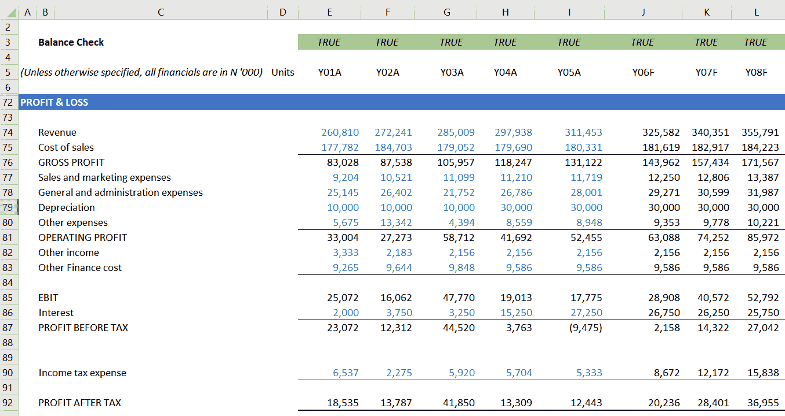
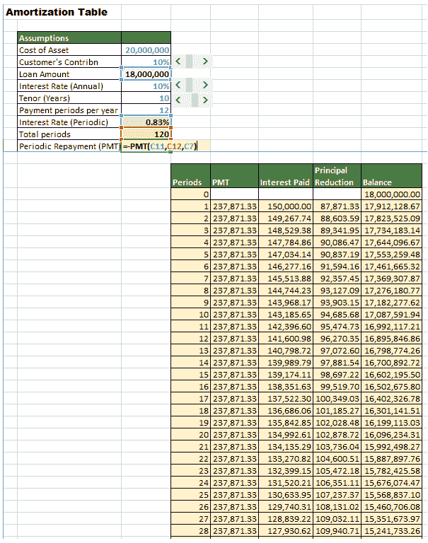

# 一、财务建模和 Excel 简介

如果你问五位专业人士金融建模的意义，你可能会得到五种不同的答案。事实是，它们在自己的上下文中都是正确的。这是不可避免的，因为财务建模的使用范围几乎每天都在扩大，新用户希望从他们自己的角度来定义这个学科。在这一章中，你将学习金融模型的基本成分以及我最喜欢的定义。您还将了解行业中目前存在的不同财务建模工具，以及 Excel 的一些功能，这些功能使其成为处理财务模型各种需求的理想工具。

在本章中，我们将讨论以下主题:

*   财务模型的主要成分
*   理解数学模型
*   金融模型的定义
*   金融模型的类型
*   金融建模的替代工具
*   excel—理想的工具

# 财务模型的主要成分

首先，需要有一个情况或问题需要你做出财务决策。你的决定将取决于两个或更多选项的结果。让我们看看财务模型的各个方面:

**财务决策**:财务决策可以分为三种主要类型:

*   投资
*   融资
*   分配或股息

# 投资

我们现在来看看投资决策的一些原因:

1.  **购买新设备**:你可能已经有能力并且知道如何在内部制造或建造。也可能已经有类似的设备。因此，要考虑的是是制造还是购买、销售、保留还是以旧换新现有设备。
2.  业务扩张决策:这可能意味着开发新产品、开设新的分支机构或扩大现有分支机构。需要考虑的是比较以下内容:

*   **投资成本**:隔离投资的所有特定成本，例如，建筑、额外的人力、增加的运行成本、对现有业务的不利影响、营销成本等等。
*   投资收益:我们可以获得额外的销售额。新投资将推动其他销售，并带来其他可量化的好处。为了获得投资的**回报** ( **ROI** )，一个正的 ROI 将表明这项投资是好的。

融资决策主要围绕是否从个人资金或外部来源获得融资。

例如，如果你决定贷款买车，你需要决定你要付多少钱，这样银行会补足差额。考虑因素如下:

*   **利率**:利率越高，你寻求外部融资的金额就越低
*   贷款期限:期限越长，每月还款额越低，但是你欠银行的时间越长
*   **你能负担的出资额**:这将使一个平台达到你向银行要求的最低金额，不管他们提供的利率是多少
*   **月还款额**:由于上述输入，您每月需要支付多少

# 融资

公司需要决定是从内部来源(向股东寻求额外的股权)还是外部来源(获得银行贷款)寻求融资。我们可以在下面的列表中看到注意事项:

*   **融资成本**:银行融资的成本很容易以利息和相关费用的形式获得。无论公司是否盈利，这些财务费用都必须支付。股权融资更便宜，因为公司不必每年支付股息，支付的金额也由董事决定。
*   融资的可获得性:通常很难从股东身上榨取更多的钱，除非可能出现了一系列良好的业绩和可观的股息。所以，公司可能除了外部融资别无选择。
*   **来源固有的风险**:对于外部融资，总是存在公司可能发现自己无法偿还到期债务的风险。
*   **理想的债务或权益比率**:公司管理层希望维持一个与其风险偏好相称的债务与权益比率。风险承担者会对超过 1:1 的比率感到满意，而风险厌恶型管理人员更喜欢 1:1 或更低的比率。

# 红利

**当有剩余资金时，进行分配或分红决策**。决定是分配全部盈余、部分盈余，还是一分都不分配。我们可以在下面的列表中看到注意事项:

*   **股东的期望**:股东提供了廉价的融资选择，并且通常很有耐心。然而，他们希望确信他们的投资是值得的。这通常表现为利润、增长，特别是股息，这对他们的财务有直接影响。
*   **为未来增长保留盈余的需要**:董事们有责任缓和为满足宣布尽可能多的股息的压力而采取的措施，必须保留至少部分盈余用于未来增长和应急。
*   **维持良好股利政策的愿望**:良好的股利政策对于保持现有股东的信心和吸引潜在的未来投资者是必要的。

# 理解数学模型

在事物的计划中，最好的或最优的解决方案通常是用金钱来衡量的。这可能是产生最高回报的选项、成本最低的选项、风险可接受的选项以及最环保的选项，但通常是所有这些特征的混合。不可避免的是，情况存在固有的不确定性，这使得有必要根据过去的结果做出假设。捕捉情况或问题中所有固有变量的最合适的方法是创建一个数学模型。该模型将建立变量和假设之间的关系，作为模型的输入。该模型将包括一系列计算，以评估输入信息，并阐明和展示各种备选方案及其后果。正是这种模式被称为金融模式。

# 金融模型的定义

维基百科认为金融模型是一种数学模型，以抽象的形式表示金融资产、项目或其他投资的表现。

公司金融研究所认为，通过利用某些变量来估计具体财务决策的结果，财务模型有助于预测未来的财务绩效。

《商业词典》认同数学模型的概念，因为它由一组方程式组成。该模型分析了一个实体将如何对不同的经济形势作出反应，重点是财务决策的结果。它接着列出了一些你会在财务模型中看到的报表和时间表。此外，该出版物认为，一个模型可以估计投资者和贷款人实施的公司政策和限制的财务影响。它接着给出了现金预算作为一个简单的财务模型的例子。

财务管理认为财务模型是一种工具，财务分析师试图用它来预测未来几年的收益和业绩。它认为完整的模型是商业交易的数学表示。该出版物将 Excel 命名为建模的主要工具。

以下是我个人的定义:

“财务决策制定情况促使创建一个数学模型来促进决策制定。首选行动方案及其后果基于模型的计算结果。”

# 金融模型的类型

有几种不同类型的金融模型。模型类型取决于模型的目的和受众。一般来说，当你想评估或预测某样东西，或者两者兼而有之时，你可以创建一个财务模型。

以下模型是寻求计算值的示例。

# 3 语句模型

在下面的屏幕截图中，我们看到了大多数估价模型的起点及其包含的内容:

1.  **资产负债表** ( **或财务状况表**):这是一份资产(公司拥有的具有经济价值的资源，通常用于为公司创造收入，如厂房、机器和存货)、负债(公司的义务，如应付账款和银行贷款)和所有者权益(衡量所有者对公司的投资)的报表:

2.  **利润表** ( **或综合收益表**):这是一份通过比较一个公司在一定时期内产生的收入与同期发生的费用来总结该公司业绩的报表；

3.  **现金流量表:**这是一份说明在审查期间现金流入和流出各种来源、经营和交易的报表。净现金流入应等于审查期间资产负债表中显示的现金和现金等价物的变动。

这个模型的数学从历史数据开始。换句话说，前 3 至 5 年的损益表、资产负债表和现金流量表将输入 Excel。在未来 3 到 5 年内，将做出一系列假设，并用于推动三份报表中显示的财务结果。这将在本书后面更详细地说明，并且会变得更清楚。以下屏幕截图显示了现金流量表的示例:

# 贴现现金流模型

大多数专家认为现金流量折现法是评估一家公司最准确的方法。从本质上讲，该方法认为公司的价值是公司能够产生的所有未来现金流的总和。实际上，现金会根据各种债务进行调整，以得出自由现金流。该方法还考虑了货币的时间价值，这个概念我们将在后面的章节中更加熟悉。DCF 法将估价模型应用于*第*节提到的三陈述模型。稍后，我们将遇到并充分解释这个估价模型中包含的技术参数。

# 比较公司模型

这种方法依赖的理论是，相似的公司会有相似的倍数。例如，倍数是将公司或企业的价值(**企业价值**或 **EV** )与其收益进行比较。有不同级别的收入，如下所示:

*   **息前收益**、**税**、**折旧**、**和摊销** ( **EBITDA** )
*   **息税前收益** ( **EBIT** )
*   **税前利润** ( **PBT** )
*   **税后利润** ( **拍拍**)

对于它们中的每一个，可以生成多个倍数，并用于得出公司的一系列 ev。比较法过于简单，主观性很强，尤其是在选择可比公司时；然而，它受到分析师的青睐，因为它提供了一种快速获得公司价值的方法。

同样，这种方法依赖于 3 语句模型作为起点。然后，您找出三到五家具有报价电动汽车的类似公司。在选择类似公司(**同行集团**)时，要考虑的标准将包括业务性质、资产和/或营业额规模、地理位置等。为此，我们采用以下步骤:

1.  我们需要计算每个公司的倍数(如 *EV/EBITDA* 、*EV/销售额*、 *P/E* 比率)。
2.  然后计算所有类似公司的倍数的平均值和中值。

中位数通常比平均值更可取，因为它可以校正异常值的影响。异常值是样本中明显大于或小于其他项目的个别项目，因此倾向于以某种方式扭曲平均值。

3.  然后采用你的目标公司的乘数中值，并将收益(例如，EBITDA)代入等式，该等式在 3 语句模型中计算:

4.  当您重新排列公式时，您会得到目标公司的 EV:

# 并购模式

当两家公司寻求合并，或者一家寻求收购另一家时，投资分析师会构建一个**并购** ( **M & A** )模型。首先分别为单个公司建立估价模型，然后为合并后的实体建立模型，并计算其每股收益。每股收益**e****(**EPS**)是一个公司盈利能力的指标。它的计算方法是净收入除以股票数量。该模型的目的是确定合并对收购公司每股收益的影响。如果并购后的每股收益有所增加，那么该并购就是增生性的，否则就是稀释性的。**

# 杠杆收购模式

在杠杆收购的情况下，A 公司以现金(股权)和贷款(债务)的组合收购 B 公司。债务部分往往很重要。然后 A 公司经营 B 公司，还本付息，3 到 5 年后再卖掉 B 公司。**杠杆收购模型** ( **杠杆收购**)模型将计算 B 公司的价值以及最终出售该公司的可能回报。

我们现在来看看投射一些东西的模型。

# 贷款偿还时间表

当你向银行申请汽车贷款时，你的账户主管会带你了解贷款的结构，包括贷款金额、利率、每月还款额，有时还包括你能负担的汽车费用。让我们在下面的截图中看看贷款的各种特性:

前面的截图为我们提供了一个示例，展示了如何为贷款偿还计划模型设置假设。使用 Excel 的`PMT`函数计算每月还款额。租期 10 年，但按月还款(每年 12 个还款期)，给出总期数 *(nper)()为 12 × 10 = 120* 。请注意，年利率必须转换为每期利率，即`10%` / `12`(利率/周期)，在我们的示例中为每月`0.83%`。`pv` 是贷款金额。我们还需要记住，实际贷款金额是资产成本减去客户贡献。

选择滚动条已添加到模型中，因此客户的供款(10%-25%)、利率(18%-21%)和期限(5-10 年)可以很容易地改变，结果可以立即观察到，因为参数将立即重新计算。

前面的截图显示了他们使用的摊销表的种类，以便迅速扭转你的选择。

# 预算模型

**预算模型**是一个公司现金流入和流出的财务计划。它为营业额、采购、资产、债务等建立了所需或标准结果的场景。然后，它可以将实际值与预算或预测值进行比较，并根据结果做出决策。预算模型通常是每月或每季度一次，主要关注损益表。其他类型的财务模型包括:

*   首次公开发行模式
*   零件模型的总和
*   整合模型
*   期权定价模型

# 金融建模的替代工具

Excel 一直被认为是财务建模的首选软件。然而，Excel 中存在的严重缺陷使得严肃的建模者寻找替代方案，尤其是在复杂模型的情况下。以下是财务建模软件试图纠正的 Excel 的一些缺点:

*   **大型数据集** : Excel 难以处理非常大的数据。在大多数操作之后，Excel 会重新计算模型中包含的所有公式。对于大多数用户来说，这发生得如此之快，以至于你甚至没有注意到。然而，对于大量的数据和复杂的公式，重新计算的延迟变得非常明显，并且可能非常令人沮丧。替代软件可以处理包含复杂公式的巨大多维数据集。
*   **数据提取**:在你建模的过程中，你需要从互联网和其他来源提取数据。例如，公司网站的财务报表、多个来源的汇率等等。这些数据以不同的格式出现，具有不同程度的结构。Excel 在从这些来源中提取数据方面做得相对较好。然而，它必须手动完成，因此它是乏味的并且受到用户的技能集的限制。Oracle BI、Tableau 和 SAS 旨在自动提取和分析数据。
*   **风险管理**:财务分析很重要的一部分是**风险管理**。让我们来看一些风险管理的例子:
*   **人为错误**:在这里，我们讨论与人为错误后果相关的风险。使用 Excel 时，暴露在人为错误面前是重大且不可避免的。大多数可选的建模软件都是以防止错误为首要考虑因素的。由于许多程序是自动化的，这将人为错误的可能性降低到最低限度。
*   假设中的错误:当建立你的模型时，你需要做一些假设，因为你是在对未来可能发生的事情做一个有根据的猜测。尽管这些假设很重要，但它们必然是主观的。面对相同环境的不同建模者可能会提出不同的假设，从而导致截然不同的结果。这就是为什么总是有必要通过用一系列替代值替代关键假设来测试模型的准确性，并观察这如何影响模型。这个过程被称为敏感性和情景分析，是建模的重要部分。这些分析可以在 Excel 中完成，但它们总是在范围上受到限制，并且是手动完成的。替代软件可以很容易地利用不同变量或变量组的蒙特卡罗模拟来提供一系列可能的结果以及它们发生的概率。蒙特卡洛模拟是一种数学技术，它用一系列数值替代各种假设，然后反复进行计算。这个过程可能涉及成千上万次计算，直到最终产生一个可能结果的分布。分布表明个别结果发生的机会或概率。

# Excel 的优势

尽管 Excel 有这些缺点，并且替代建模软件的结果令人印象深刻，但 Excel 仍然是金融建模的首选工具。

让我们在下一节中更深入地了解 Excel 的优势:

*   **已经在你的电脑上**:**T3】你的电脑上可能已经安装了 Excel。替代建模软件往往是专有的，必须手动安装在您的计算机上。**
*   **熟悉的软件**:大约 80%的用户已经具备了 Excel 的工作知识。为了适应不熟悉的程序，替代的建模软件通常会有一个显著的学习曲线。
*   **无需额外费用** : 你很可能已经订阅了包括 Excel 在内的 Microsoft Office。安装新的专门软件和教潜在用户如何使用软件的成本往往很高而且持续不断。每一批新用户都必须接受额外费用的替代软件培训。
*   **灵活性**:替代建模软件通常是为处理某些特定的条件集而构建的，因此，虽然它们在那些特定的环境下是结构化的和准确的，但它们是严格的，不能被修改来处理与默认条件显著不同的情况。Excel 很灵活，可以适应不同的目的。
*   **可移植性** : 用替代软件准备的模型不容易与其他用户或组织外的人共享，因为其他人必须有相同的软件才能理解模型。Excel 对于不同地理位置的用户都是一样的。
*   **兼容性** : Excel 与其他软件通讯非常好。几乎所有的软件都能以某种形式输出 Excel 能理解的内容。同样，Excel 可以生成许多不同软件都可以阅读的输出格式。换句话说，无论您希望导入还是导出数据，都存在兼容性问题。
*   **卓越的学习体验** : 用 Excel 从零开始构建模型给用户带来了很棒的学习体验。您可以更好地理解项目和被建模的实体。您还将了解模型不同部分之间的联系和关系。

# excel–理想的工具

下列功能使 Excel 成为处理任何数据的理想工具:

*   **理解数据** : 没有其他软件像 Excel 那样模仿人类理解数据。Excel 理解一分钟有 60 秒，一小时有 60 分钟，一天有 24 小时，以此类推到周、月、年。Excel 知道一周中的日期、一年中的月份及其缩写，例如，Wed 代表星期三，Aug 代表八月，03 代表三月！Excel 甚至知道哪些月份有 30 天，哪些月份有 31 天，哪些年份的二月有 28 天，哪些是闰年有 29 天。它可以区分数字和文本，它还知道你可以加、减、乘、除数字，我们可以按字母顺序排列文本。基于对这些参数的这种类似人类的理解，Excel 构建了一系列令人惊叹的特性和函数，允许用户从一系列数据中提取几乎难以想象的细节。
*   **导航**:模型可以非常迅速地变得非常大，而凭借 Excel 的能力，大多数模型将只受你的想象力和胃口的限制。这可能会使您的模型难以驾驭，难以导航。Excel 有丰富的导航工具和快捷方式，它使这个过程不那么紧张，甚至愉快。以下是一些导航工具的示例:
*   Ctrl + PgUp/PgDn :这些键允许你从一个工作表快速移动到下一个工作表。 *Ctrl + PgDn* 跳转到下一张工作表， *Ctrl + PgUp* 跳转到上一张工作表。
*   *Ctrl +箭头键*(→↓↓↑):如果当前单元格(您所在的单元格)是空白的，那么按下 *Ctrl +箭头键* *键*将使光标跳转到光标所在方向的第一个填充的单元格。如果当前单元格被填充，则按下 *Ctrl +箭头*和*键*将使光标跳到空白单元格之前的最后一个被填充的单元格。

# 摘要

在这一章中，我们看了构成财务模型的主要成分。我们研究了各种类型的财务模型以及它们在 Excel 中的工作方式。我们还研究了财务建模的替代工具以及 Excel 的各种优势。最后，我们看到了为什么 Excel 是创建财务模型的理想工具的各种原因。

在下一章，我们将看到创建模型的各个步骤。