# 六、资产和债务明细表

在这一阶段，除了**资本支出** ( **资本支出**)——购买、处置和折旧、长期债务、新发行、偿还和利息费用的影响之外，预计的资产负债表和损益表是完整的。固定资产、折旧和债务表对我们的模型非常重要，因为它们往往在财务报表中显示为非常重要的金额。这些都是长期的平衡，并不包含在增长驱动因素中。你将依靠客户给你关于他们未来五年资本支出和债务计划的信息。如果您没有这方面的信息，您通常会假设现有余额将在预测年份的持续时间内继续使用，或者直到它们被完全减记或注销——以先发生者为准。

本章涵盖以下主题:

*   理解底座和开瓶器的概念
*   资产建模方法
*   资产明细表
*   债务明细表
*   创建贷款分期偿还计划

# 理解底座和开瓶器的概念

这些是在对我们的资产负债表项目建模时要遵循的通用标准。 **BASE** 是首字母缩略词，代表**开始加减等于结束**。螺旋概念指的是基础设置从一个时期连接到下一个时期的方式。在下面的屏幕截图中，我们将看到一年的期末余额结转为下一年的期初余额:

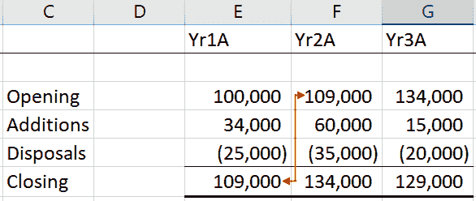

我们注意到这种变化是从期初余额开始的，沿着第一年的行向下到期末余额，然后回到第二年的期初余额，然后沿着第二年的行向下，依此类推。这创建了一个螺旋效果，如下图所示:

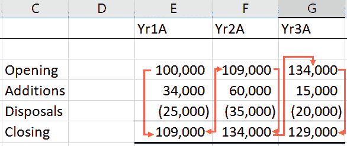

# 资产明细表

我们的议程简要概述如下:

*   记录历史损益账户和资产负债表
*   计算历史增长驱动因素
*   预测损益表和资产负债表的增长动力
*   建立预计损益账户和资产负债表
*   **准备资产和折旧明细表**
*   准备债务清单
*   准备现金流量表
*   比率分析
*   DCF 估价
*   其他估价
*   情况分析

我们的标的物是指长期资产，固定资产，以及财产厂房和设备。一项资产是一项长期资产，公司将通过在一年以上的时间里使用它来获取经济价值。这个时期称为资产的**使用寿命**。在获得该资产的期间收取该资产的全部成本是不公平的；相反，成本应该分摊到资产的使用寿命中。

这种年度成本分配是对固定资产因使用或时间流逝而价值减少的一种度量。这叫做**折旧**。它通常以百分比表示，并计入每年的损益表。固定资产价值的减少反映在资产负债表中，在资产负债表中，总的**累计折旧**从原始成本中扣除并计入到目前为止。这被称为**账面净值**。

# 直线法

如果管理层决定可以在 10 年内从固定资产中提取有用的服务，那么该资产的成本将在 10 年内分摊。最简单的方法是在 10 年内平均分配资产成本，以达到 10%的固定年费用或折旧率。这被称为折旧的**直线法** ( **SLM** )。

使用 SLM 的折旧计算如下:


或者


# 减量平衡法

另一种计算折旧的方法叫做**余额递减法**。这种方法是基于这样一种假设，即一项资产在早期会更快地贬值。因此，在资产使用寿命的早期分配更多的折旧，在后期分配更少的折旧。在折旧的第一年，折旧率应用于资产成本。在随后的年份中，折旧率适用于从上一年结转的净账面价值。

由于资产的净账面价值逐年减少，折旧也将减少，因为折旧率适用于一个逐渐降低的数字。下面的截图显示了直线和
减少平衡方法的区别:

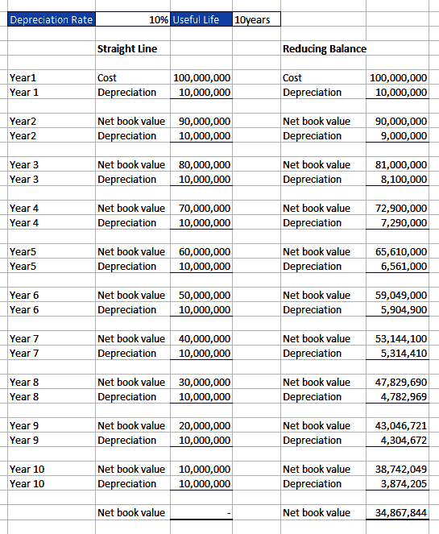

从前面的屏幕截图中，我们可以观察到以下内容:

*   两种方法都以相同的折旧费用开始— `10,000,000` (100，000，000 x 10%)
*   从第二年开始，使用余额递减法的年度折旧开始从第二年的`10,000,000`下降到第二年的`9,000,000`，到第三年的`8,100,000`，以此类推
*   到第十年，折旧费已经下降到`3,874,205`
*   对于 SLM，该年的年折旧费保持不变，为`10,000,000`，直到第十年
*   与采用余额递减法的`34,867,844`相比，采用可持续土地管理的第十年末账面净值为零

下面是两种折旧方法对折旧和帐面净值的影响的图示:


你应该认识到，无论一项资产变得多旧或被利用，它总会有剩余价值。残值是对该资产作为废品出售的估计值。考虑到这一点，您应该确保不将任何资产的折旧降至零，而是降至其残值，这样，在折旧的最后一年，折旧费用将是账面净值减去残值。下面的屏幕截图显示了`Residual value`为`1,000`的资产的年折旧:


除了更现实之外，一项资产的净账面价值为剩余价值，比剩余价值为零的资产更不容易消失。虽然 SLM 和余额递减法是两种最常见的折旧方法，但还有其他方法，如年数总和法和生产单位法。

# 资产建模方法

有两种固定资产建模方法，如下所示:

*   详细的方法
*   简单的方法

# 详细的方法

详细法是首选的，它是一种更精确的方法，着眼于固定资产的组成部分——资产成本、增加、处置、折旧和累计折旧。您与管理层的讨论将让您了解他们未来五年的资本支出计划。在处置或出售的情况下，固定资产必须从账簿中删除。该资产的账面净值(累计折旧)将作为借方转入处置账户，出售所得将作为贷方转入同一账户。两者之间的差额要么是资产处置的利润，即 **s** **ale 的收益**超过净账面价值，要么是损失，即净账面价值大于出售收益，并将在期末从该处置账户转入损益账户。下图显示了与此相关的不同场景。

第一张图显示了当你从资产处置中获利时会发生什么:

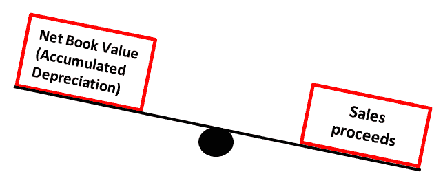

这意味着你出售资产的价格高于账面价值。

第二张图显示了当你在资产处置上发生损失时会发生什么:

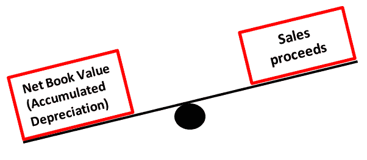

在这种情况下，你以低于帐面价值的价格出售了资产，导致了资产处置的损失。所有这些最好都记录在资产和折旧表中，应该为每一类固定资产准备一份资产和折旧表，然后合并成一份总的固定资产表。

# 资产和折旧明细表

我们现在将准备我们在上一节中讨论过的时间表，如下所示:

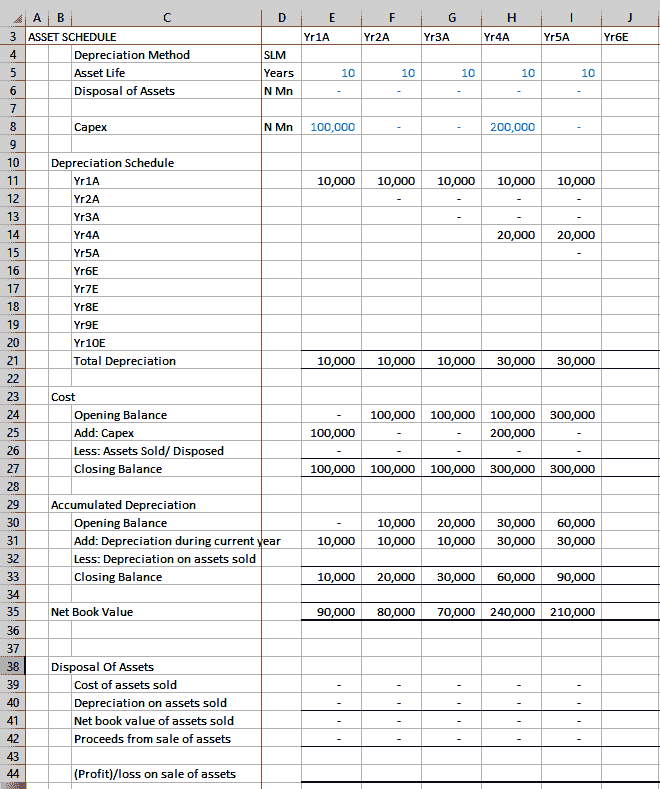

这是应为每个资产类别准备的完整的资产和折旧时间表。我们现在将对时间表进行分解，并对其进行详细分析。

第一部分包含以下信息:

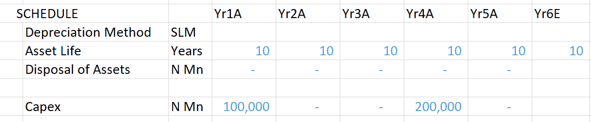

这里我们有几个关键词，比如`Depreciation Method`和`Asset Life`。我们将看看它们在这个特定的时间表中是什么:

*   `Depreciation Method`:在我们的例子中，它是`SLM`
*   这用于表示资产的使用寿命，在我们的例子中是 10 年
*   `Disposal of Assets`:本部分是出售固定资产的收益，如果有的话
*   `Capex`:这一行显示了每年在固定资产上的花费和预计花费

下一节是`Depreciation Schedule`:

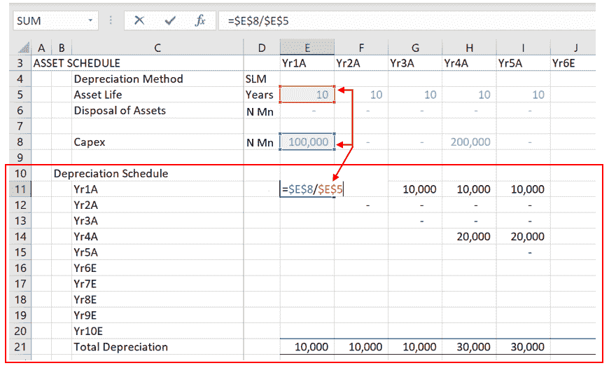

固定资产折旧在第 **11** - **20** 行，跨 **E** - **N** 列。固定资产增加的年折旧费是当年的资本支出除以资产寿命。对于`Yr1A`，这是 **E8** 除以 **E5** ，也就是`10,000`，如前面截图所示。`Yr1A`附加物的折旧费用从**E**T18】11 开始，每年在`10,000`沿 **11** 行继续，持续 9 年，如下图所示:


`Yr2A`中新增折旧的计算方法为 **F8** 除以 **F5** ，从**F**T10】12 开始，沿第 **12 行—下一行**每年计提 10 年。同理，`Yr3A`附加物的折旧从**G**T14】13 开始，沿 **13** 行计提 10 年。

每年的总折旧费是该年该列第 **11** - **20** 行所有折旧的总和。对于`Yr1A`，这将是第 **E** 列的第**11**-**20**行的所有折旧的总和；对于`Yr2A`，这将是第 **F** 列 **11** - **20** 中所有折旧的总和。在我们的示例中，年内只有`Yr1A`和`Yr4A`增加了`Capex`，如下图所示:

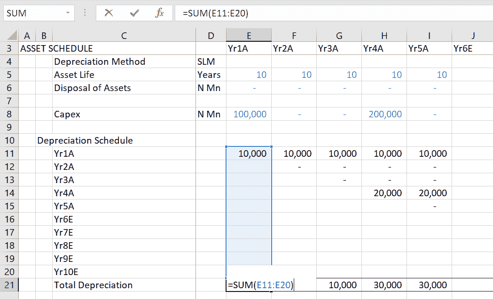

接下来的两个部分是固定资产的成本和累计折旧的汇总，以基本布局和螺旋布局显示。每年的期末成本余额代表企业在每年年末的固定资产的原始或历史总成本。下面的截图显示了`Cost`、`Accumulated Depreciation`和`Net Book Value`:

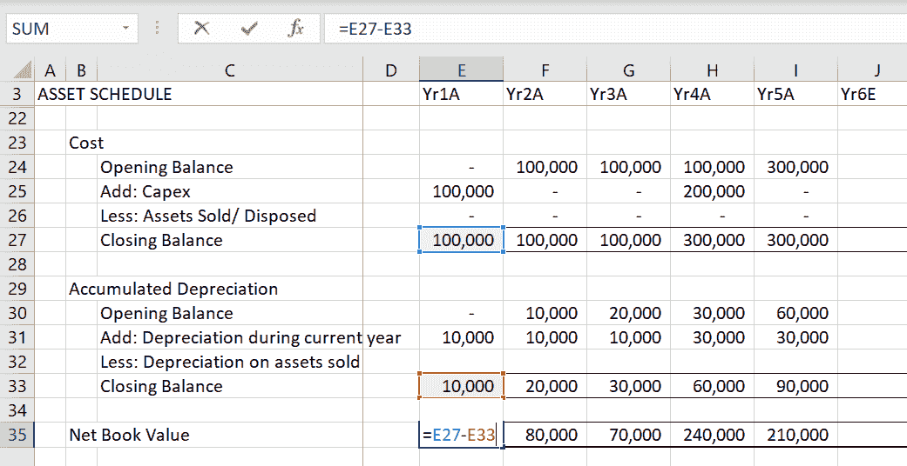

累计折旧是迄今为止固定资产的折旧总额。固定资产在资产负债表中以其账面净值(即成本减去累计折旧)入账。

# 简单的方法

预测固定资产的简单方法是使用固定资产周转率进行建模，如下式所示:

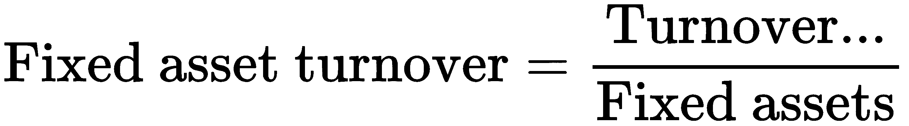

和前面的例子一样，我们从历史数据开始，计算每个历史年份的固定资产和周转率。下面的屏幕截图显示了对`Fixed asset turnover ratio`字段的计算:


我们将计算`Yr1A` - `Yr5A`的历史固定资产周转率的平均值，然后使用该平均值作为未来五年的预计驱动因素。以下屏幕截图说明了历史固定资产周转率平均值的计算方法:


折旧可以通过以下方式得出:

1.  将每年固定资产的历史成本除以该年的折旧费用，得出该年资产的平均使用寿命:

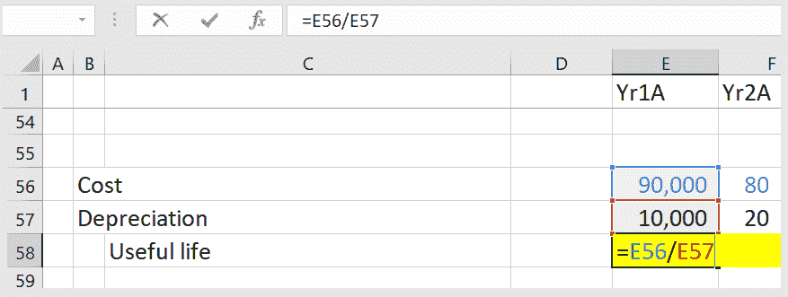

2.  然后计算过去五个历史年份的平均使用寿命值:

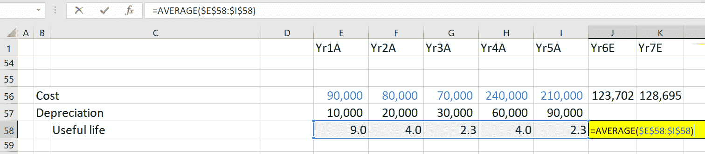

3.  现在，将`Useful life`值输入到下面的等式中，以得出本年度的`Depreciation`费用:


前面的步骤将产生以下值:

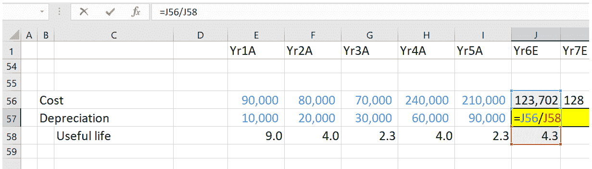

4.  现在，为每个预测年份扩展公式:


# 债务明细表

公司的资本由债务和股权组成，大多数企业都试图保持债务和股权之间的稳定比率(杠杆率)。债务表是我们对资本结构预测的一部分。

以下列表显示了我们当前的议程:

*   记录历史损益账户和资产负债表
*   计算历史增长驱动因素
*   预测损益表和资产负债表的增长动力
*   建立预计的损益账户和资产负债表
*   准备资产和折旧清单
*   **编制债务明细表**
*   准备现金流量表
*   比率分析
*   DCF 估价
*   其他估价
*   情况分析

和固定资产一样，预测债务可以用两种方法之一；详细复杂的方法或快速简单的方法。

此外，还需要考虑利益的处理。问题是，我们是对债务的期初或期末余额计息，还是将利率应用于一年的平均债务？

# 复杂的方法

如果你的模型需要很高的精确度，你可以从公开的历史记录和管理讨论中获取尽可能多的信息。你会寻找获得额外融资和清算现有贷款的计划，以及增加需要融资的固定资产。

此外，公司通常会公布即将到期的贷款信息。你可以用它来预测每年的还款，并确保一旦相应的贷款还清，这些还款就会停止。下面的截图展示了一个债务表:

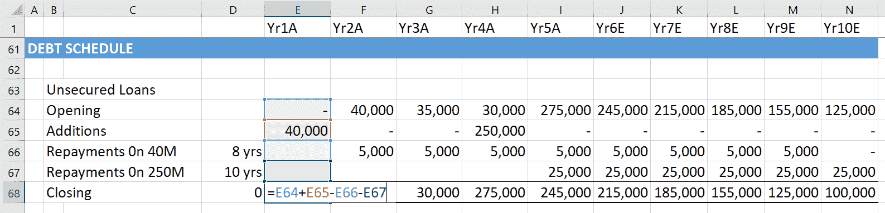

我们准备了一份债务表，使用基本布局和螺旋布局。

在我们的例子中，在`Yr1A`获得了 4000 万纳米比亚元的贷款，利率为 10%，应在 8 年内偿还；以及在`Yr4A`获得的 25000 万奈拉贷款，也是 10%的利息，10 年内偿还。4000 万元贷款分 8 年偿还，从`Yr2A`到`Yr9E`。2.5 亿奈拉的贷款要到`Yr5A`才开始偿还，并将再持续 9 年。

在这个复杂的模型中，您将计算平均未偿贷款的利息。平均未偿贷款等于期初未偿贷款加上期末债务除以 2。下面的屏幕截图显示了一个债务表，其中利息是根据平均未偿债务计算的:


利息计算如下:

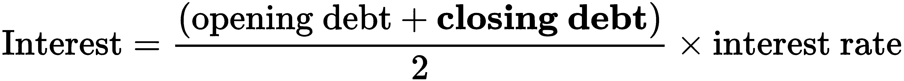

期末债务计算如下:


为了便于理解，让我们假设没有还款。期末债务将是期初债务加上应计利息。以下屏幕截图显示了期末余额的债务明细表，包括应计利息:


以下屏幕截图显示了通过包括期初和期末债务余额来计算利息的公式:

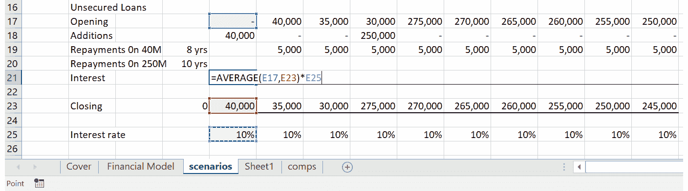

在前两个截图中，我们可以看到计算期末余额的公式如何包含利息，以及计算利息的公式如何包含期末债务余额。这会创建一个循环引用，Excel 会将其标记为错误。

下面的屏幕截图显示了 Excel 如何标记循环引用:

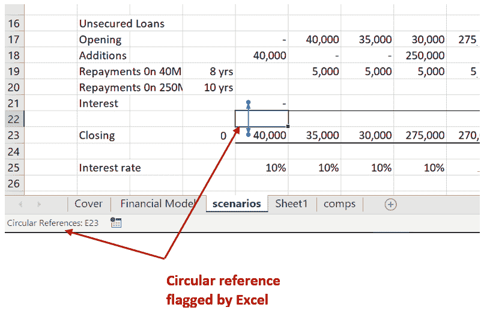

为了停止这种公式的迭代或连续计算，Excel 将该公式标记为循环引用。有时，您会故意创建一个循环引用来获得想要的结果。在我们的例子中，我们希望使用最准确的方法来预测利息——利用平均利息而不是期初或期末债务。

期末债务用于计算利息，然后利息用于计算期末债务。这代表一次迭代。后一项期末债务将产生一个与利息计算中使用的原始期末债务略有不同的值。在第二次迭代之后，差异减小，并且随着每次连续的迭代而继续减小，直到它变得可以忽略，并且两个期末债务的值实际上相等。

为了允许这种情况发生而不被 Excel 认为是错误，您需要在 Excel 选项>公式下启用迭代计算。下面的屏幕截图演示了如何启用迭代:

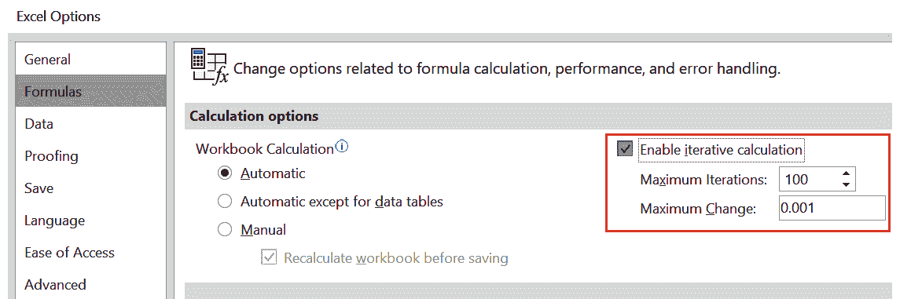

在 Excel 2016 中，单击文件>选项。这将启动 Excel 选项对话框。然后，单击公式并选中启用迭代计算框。接受默认的最大迭代次数 100。这意味着 Excel 认为经过 100 次迭代后，每次迭代产生的差异变得可以忽略或不重要。

您应该始终记得返回并取消选中“启用迭代计算”框。否则，意外的循环引用可能无法被检测到，并可能导致 Excel 崩溃，从而导致信息丢失。

# 简单的方法

如果不需要这种精确度，您可以采用一种更简单的方法，使用杠杆比率:


一般来说，公司不会频繁改变他们的股本。因此，合理的假设是，股本将保持不变，权益仅受留存收益的影响。因此，杠杆率乘以股本将得出我们的债务。对于利息，您只需将利率应用于期初债务余额。这将避免任何循环引用。

一个更简单的方法是认为，随着公司偿还旧债，它们通常会承担新债。因此，你可以假设债务余额保持不变。您将通过将利率应用于长期债务的期初余额来预测本年度的利息费用。

一旦我们用我们的计算更新了我们的资产负债表和损益账户，完成 3 报表模型所需的唯一未结算项目将是现金。

现在我们已经了解了历史数据的所有内容，让我们应用它来创建一个贷款分期偿还计划，如下一节所示。

# 创建贷款分期偿还计划

让我们假设你在一家银行工作，一位客户申请了住房贷款。然而，客户并不想要任何现成的套餐，而是想要一个特定期限和金额的定制贷款。在这种情况下，计算详细的时间表可能会花费大量的时间，这对于处理客户来说是很有价值的。如果有一个适合您需求的独特模型，可以轻松计算各种贷款的价值，那将非常有用。我们现在将学习如何创建一个这样的时间表，实现我们在本章中学到的大部分内容。

# 创建模板

我们的第一步是创建一个可以用于所有目的的通用模板。为此，我们将采取以下步骤:

1.  首先要做的是创建一个计算贷款的模板。我们将首先创建一个 2×4 的表来输入贷款中的变量，如下所示:


2.  我们现在将向“每年付款”字段添加数据验证，以便我们可以在四种付款选项中进行选择——半月、月、季和年。为此，我们将首先创建一个包含 4 个值的表— `24`、`12`、`4`和`1`，如下所示:

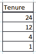

3.  现在，我们需要将这个表转换成一个列表。我们将通过转到**公式**选项卡并选择**定义名称**选项来完成，如下所示:

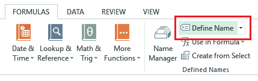

4.  在接下来的弹出窗口中，我们将定义列表的名称，我已经输入为`Tenure`。在【T2 引用:】输入框中，我们将输入表格所在的单元格数组，在本例中为`$J$2:$J$5`:


5.  输入所有内容后，点击 **OK** 。我们的列表现在已经定义好了。
6.  我们的下一步是将这个列表添加到`Payments per year`字段中。为此，导航到**数据**选项卡，并在那里选择**数据验证**选项:


7.  在弹出的窗口中，打开**允许:**下拉菜单，选择**列表**，如下图:


8.  现在，在**源:**输入字段，按下键盘上的 *F3* 打开**粘贴名称**弹出窗口。您可以在这里找到列表的名称，如下所示:


9.  选择您的列表名称后点击 **OK** ，它将出现在 **Source:** 输入框中。现在，点击**数据验证**窗口中的 **OK** ，你瞧，下拉列表已经在`Payments per year`字段中创建，如下面的截图所示:

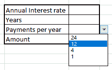

10.  我们的最后一步是创建实际的贷款时间表，它应该类似于下面的屏幕截图:


因此，我们现在已经创建了一个模板，可以在其中实现我们的贷款计划，如下面的屏幕截图所示:


现在是困难的部分——创建计算贷款时间表中每个元素所需的公式。

# 创建公式

现在我们已经准备好了模板，是时候用 Excel 施展我们的魔法，创建公式来计算属于贷款一部分的不同变量，如本金金额、利息金额、要支付的总付款以及付款后的余额。如果我们试图输入我们用来计算每个值的实际公式，这些公式对我们来说会变得太复杂。令人欣慰的是，Excel 借助`PMT`、`PPMT`、`IPMT`等内置函数，让我们很容易计算出这样的值。我们将在这里使用这些函数来计算我们的贷款，使用以下步骤:

1.  在创建模板之后，从我们停止的地方继续，我们将开始把我们需要的公式输入到我们先前创建的贷款计划表中。我们的第一个公式利用了`PMT`函数，该函数可用于轻松计算特定时期内要支付的总金额。`PMT`公式采用以下参数:

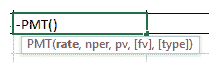

这里，`rate`是每期利率，计算方法是将年利率除以贷款有效年数。`nper`变量是贷款期限内的总还款额，用年数乘以每年的还款额来计算。`pv`变量是贷款的本金。`fv`和`type`变量是可选的，我们不会在这里使用它们。

2.  在我们的例子中，`PMT`公式应该如下:

```py
=PMT(Annual Interest rate/Payments per year, Years*Payments per year, Amount)
```

我们将在单元格引用的帮助下，用实际值替换这些变量，这样我们的最终公式如下:

```py
=PMT($C$2/$C$4,$C$3*$C$4,$C$5)
```

3.  现在第一个公式已经就绪，我们将使用`PPMT`函数计算本金金额，该函数采用以下参数:


这个公式类似于我们之前看到的`PMT`公式；唯一不同的是，我们考虑的是当前的付款号，这是一个`per`变量。因此，我们的本金金额公式如下:

```py
=PPMT($C$2/$C$4,$A8,$C$3*$C$4,$C$5)
```

4.  我们需要添加的下一个公式是计算利息金额的公式。我们将使用`IPMT`函数来实现这一点，它采用以下参数:

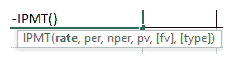

这个公式是`PPMT`公式的精确复制，除了我们使用的是`IPMT`函数而不是`PPMT`:

```py
=IPMT($C$2/$C$4,$A8,$C$3*$C$4,$C$5)
```

5.  我们需要输入的最后一个公式是计算每次付款后的余额。这是一个非常简单的单元格引用，因为我们只需要从之前的余额中减去本金。对于第一次付款，以前的余额将是贷款总额，如下所示:


现在我们已经准备好了所有的附表公式，让我们开始计算贷款！

# 使用时间表

假设一个客户找到你，要求贷款 10，000 美元，期限为 2 年。根据公司政策，你必须向他们收取 5%的年利率。此外，客户希望选择每月付款。让我们使用以下步骤为他们计算贷款:

1.  我们将输入客户要求的所有变量，如下图所示:


2.  我们可以看到，第一笔付款的价值已经计算出来:


红色值表示扣除额，将从原始金额中扣除。

3.  现在，我们将选择**A8**–**E8**范围，并将填充柄向下拖动一行，以便填充第二列。这会产生以下输出:


在这里，我们会注意到付款、本金和利率已经正常更新，但余额只减少了 1 美元。那不可能是对的，是吗？发生这种情况是因为，正如我们在上一节中提到的，我们需要从先前的余额中扣除本金，余额在第一列中是贷款总额。从第二次分期付款开始，余额必须根据前一期的余额进行计算。

4.  我们需要修改**余额**列中的公式，以便引用的第一个单元格是`E8`，其中显示了初始余额。执行此操作时，请确保不要锁定该列。我们第二个余额字段的公式如下:

```py
=$E8+$C9
```

这将导致正确的输出，如下所示:


5.  现在，我们可以简单地选择第二个范围，即**A9**–**E9**，并将填充柄向下拖动 22 行，这样我们就可以看到所有的付款期，如下面的截图所示:


我们可以看到最后显示的余额是`$0.00`。这意味着我们的贷款已经全部还清了！

因此，我们在 Excel 中创建了一个贷款分期偿还计划。你现在可以玩它，也许可以用它来计算你自己的贷款，或者任何你可能计划在不久的将来要借的贷款！

# 摘要

在本章中，我们已经看到了固定资产和负债明细表的重要性。我们已经阐明了它们如何影响资产负债表、损益表和现金流量表。我们已经学习了基础法和螺旋法，以及准备固定资产、折旧和债务表的复杂和简单的方法。

在下一章中，我们将执行我们的最终计算并准备现金流，以便得出准确的报表，这将使我们的资产负债表平衡并得出三报表模型。