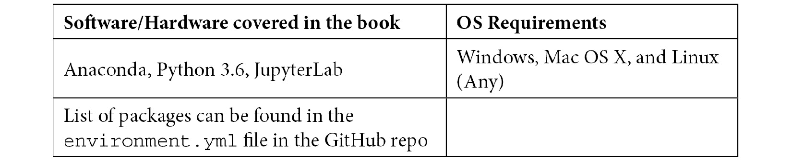

# 零、前言

算法交易通过设计定量分析策略来获利和止损，帮助你保持领先。这本书将帮助你理解金融理论并自信地执行一系列算法交易策略。

这本书首先向你介绍算法交易、pyfinance 生态系统和 Quantopian。然后，您将学习使用 Python 进行算法交易和定量分析，并学习如何在 Quantopian 上构建算法交易策略。随着学习的深入，您将深入了解用于分析金融数据集的 Python 库，如 NumPy 和 pandas，并探索用于高级分析的 matplotlib、statsmodels 和 scikit-learn 库。继续，你将探索有用的金融概念和理论，如金融统计，杠杆和对冲，卖空，这将有助于你了解金融市场如何运作。最后，你将发现分析和理解金融时间序列数据的数学模型和方法。

在本交易书结束时，你将能够建立预测交易信号，采用基本和高级算法交易策略，并在 Quantopian 平台上执行投资组合优化。

# 这本书是给谁的

这本书是为想要使用 Python 核心库探索算法交易的数据分析师和金融交易员而写的。如果你正在寻找执行各种算法交易策略的实用指南，那么这本书就是给你的。Python 编程和统计的基本工作知识将会有所帮助。

# 这本书涵盖了什么

[*第一章*](01.html#_idTextAnchor014) 、*算法交易和 Python 的介绍*，介绍了关键的金融交易概念，并解释了为什么 Python 最适合算法交易。

[*第二章*](02.html#_idTextAnchor026) ，*Python 中的探索性数据分析*，概述了处理任何数据集的第一步，探索性数据分析。

[*第 3 章*](03.html#_idTextAnchor034) ，*使用 NumPy 的高速科学计算*，详细介绍了 NumPy，一个用于快速和可伸缩的结构化数组和矢量化计算的库。

[*第 4 章*](04.html#_idTextAnchor078) ，*用 pandas 进行数据操作和分析*，介绍了构建在 NumPy 之上的 pandas 库，它提供了对结构化数据帧的数据操作和分析方法。

[*第五章*](05.html#_idTextAnchor102)*数据可视化使用 Matplotlib* ，重点介绍 Python 中的一个主要可视化库，Matplotlib。

[*第六章*](06.html#_idTextAnchor118) 、*统计估计、推断和预测*，讨论了 statsmodels 和 scikit-learn 库，用于高级统计分析技术、时间序列分析技术，以及训练和验证机器学习模型。

[*第 7 章*](07.html#_idTextAnchor140) 、*Python 中的金融市场数据访问*，描述了用 Python 检索市场数据的替代方法。

[*第八章*](08.html#_idTextAnchor154) ，*Zipline 和 PyFolio 简介*，涵盖了 zip line 和 PyFolio，它们是 Python 库，抽象出了算法交易策略的实际回溯测试和性能/风险分析的复杂性。它们让你完全专注于交易逻辑。

[*第九章*](09.html#_idTextAnchor177) 、*基本算法交易策略*，介绍了算法策略的概念，以及代表最常用算法的八种不同的交易算法。

# 为了充分利用这本书

按照*附录*一节中的说明，使用存储在 GitHub 知识库中的`environment.yml`文件重新创建`conda`虚拟环境。一个命令就可以恢复整个环境。



如果你使用的是这本书的数字版本，我们建议你自己输入代码或者通过 GitHub 库获取代码(链接见下一节)。这样做将帮助您避免任何与复制和粘贴代码相关的潜在错误。

# 下载示例代码文件

您可以从 GitHub 下载本书的示例代码文件，网址为[https://GitHub . com/packt publishing/Hands-On-Financial-Trading-with-Python](https://github.com/PacktPublishing/Hands-On-Financial-Trading-with-Python)。如果代码有更新，它将在现有的 GitHub 库中更新。

我们在[https://github.com/PacktPublishing/](https://github.com/PacktPublishing/)也有丰富的书籍和视频目录中的其他代码包。看看他们！

# 下载彩色图片

我们还提供了一个 PDF 文件，其中有本书中使用的截图/图表的彩色图像。可以在这里下载:[https://static . packt-cdn . com/downloads/9781838982881 _ color images . pdf](https://static.packt-cdn.com/downloads/9781838982881_ColorImages.pdf)。

# 使用的惯例

本书通篇使用了许多文本约定。

`Code in text`:表示文本中的码字、数据库表名、文件夹名、文件名、文件扩展名、路径名、伪 URL、用户输入和 Twitter 句柄。下面是一个例子:“让我们用 Python 3.6 创建一个`zipline_env`虚拟环境。”

代码块设置如下:

```py
from zipline import run_algorithm 
from zipline.api import order_target_percent, symbol 
from datetime import datetime 
import pytz 
```

当我们希望将您的注意力吸引到代码块的特定部分时，相关的行或项目以粗体显示:

```py
from . import quandl  # noqa
from . import csvdir  # noqa
from . import quandl_eod  # noqa
```

**Bold** :表示一个新术语、一个重要单词或您在屏幕上看到的单词。例如，菜单或对话框中的单词出现在文本中，如下所示。下面是一个例子:“然后，在**环境变量中指定变量...**对话框。”

提示或重要注意事项

像这样出现。

# 取得联系

我们随时欢迎读者的反馈。

**总体反馈**:如果您对本书的任何方面有疑问，请在邮件主题中提及书名，并发邮件至 customercare@packtpub.com 联系我们。

**勘误表**:虽然我们已经尽力确保内容的准确性，但错误还是会发生。如果你在这本书里发现了一个错误，请告诉我们，我们将不胜感激。请访问 www.packtpub.com/support/errata，选择您的图书，点击勘误表提交表格链接，并输入详细信息。

**盗版**:如果您在互联网上遇到我们作品的任何形式的非法拷贝，如果您能提供我们的地址或网站名称，我们将不胜感激。请通过 copyright@packt.com 的[联系我们，并提供材料链接。](mailto:copyright@packt.com)

**如果你有兴趣成为一名作家**:如果有你擅长的主题，并且你有兴趣写书或投稿，请访问 authors.packtpub.com。

# 评论

请留下评论。一旦你阅读并使用了这本书，为什么不在你购买它的网站上留下评论呢？潜在的读者可以看到并使用您不带偏见的意见来做出购买决定，我们 Packt 可以了解您对我们产品的看法，我们的作者可以看到您对他们的书的反馈。谢谢大家！

更多关于 Packt 的信息，请访问[packt.com](http://packt.com)。