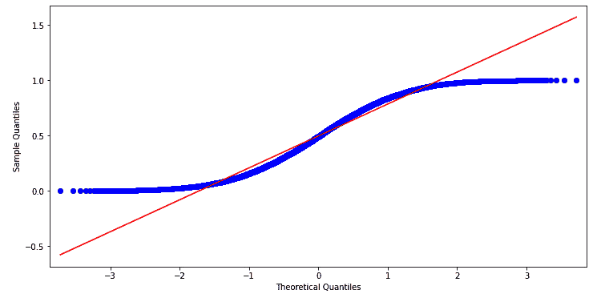
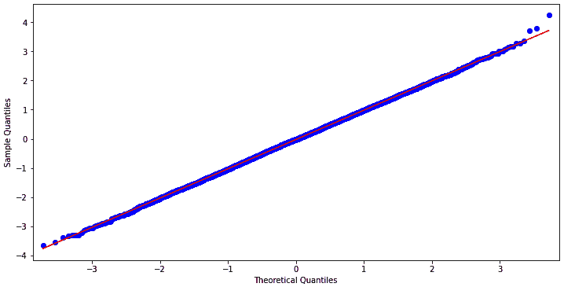
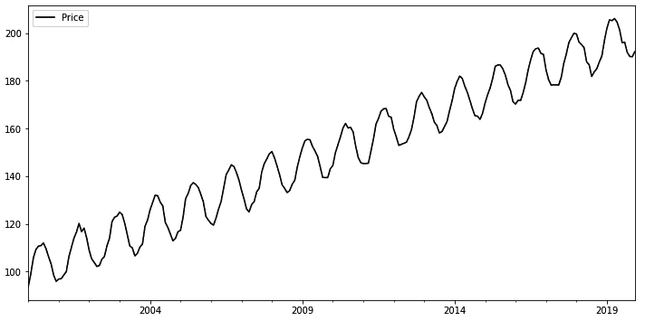
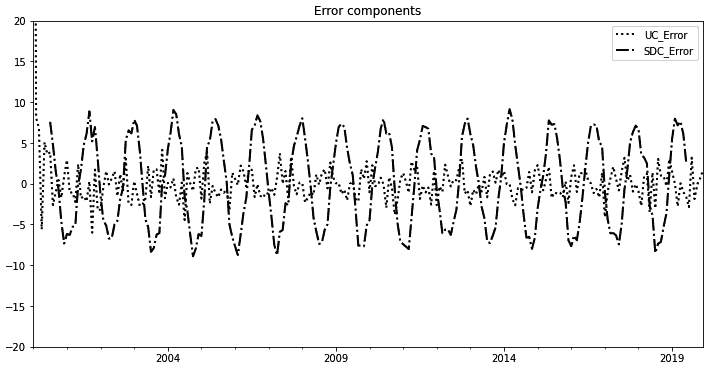
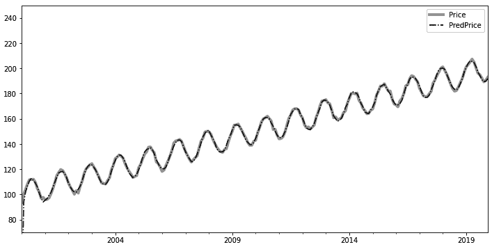
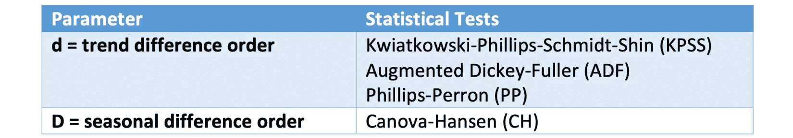
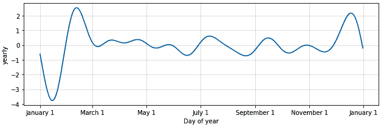
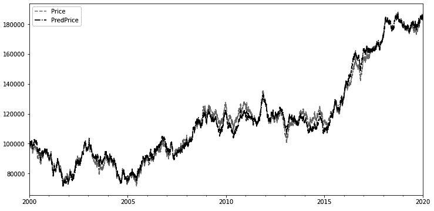
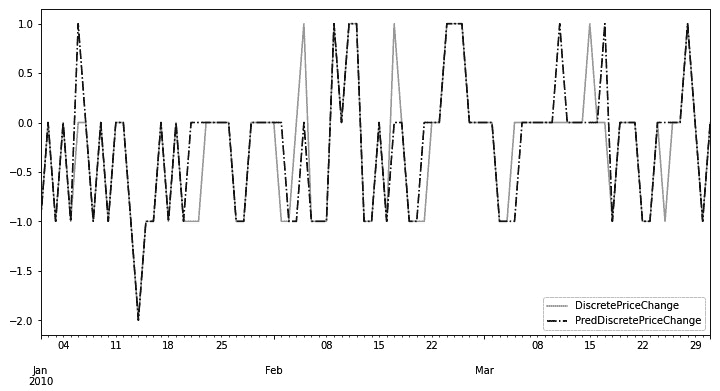
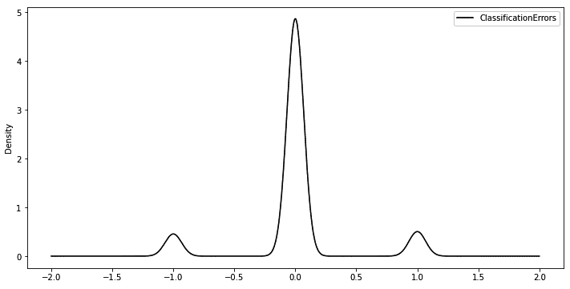

# 六、统计估计、推断和预测

在这一章中，我们通过概述关键的例子来介绍 Python 中的四个关键统计库— `statsmodels`、`pmdarima`、`fbprophet`和`scikitlearn`。这些库用于建模时间序列，并提供它们的预测值以及置信区间。此外，我们演示了如何使用分类模型来预测时间序列的百分比变化。

为此，我们将涵盖以下使用案例:

*   stats 模型简介
*   使用带有外生因素的**季节性自回归综合移动平均** ( **SARIMAX** )带有 pmdarima 的时间序列模型
*   利用脸书先知库进行时间序列预测
*   scikit 简介-学习回归和分类

# 技术要求

本章使用的 Python 代码可以在本书的代码库中的`Chapter06 folder`中找到。

# 统计模型简介

statsmodels 是一个 Python 库，它允许我们探索数据、执行统计测试和估计统计模型。

本章重点介绍 statsmodels 对时间序列的建模、分析和预测。

## Q-Q 图正态分布检验

许多统计学习技术的一个潜在假设是观测值/场是正态分布的。

虽然正态分布有许多稳健的统计测试，但一种直观的视觉方法被称为**分位数-分位数图** ( **Q-Q 图**)。如果一个样本是正态分布的，它的 Q-Q 图是一条直线。

在下面的代码块中，`statsmodels.graphics.api.qqplot(...)`方法用于检查`numpy.random.uniform(...)`分布是否正态分布:

```py
from statsmodels.graphics.api import qqplot
import numpy as np
fig = qqplot(np.random.uniform(size=10000), line='s')
fig.set_size_inches(12, 6)
```

以下屏幕截图中描绘的结果图显示了两种分布之间的非线性关系，这是我们使用均匀分布时所预期的:



图 6.1-从均匀分布生成的数据集的 Q-Q 图

在下面的代码块中，我们重复了测试，但是这次用一个`numpy.random.exponential(...)`分布作为我们的样本分布:

```py
fig = qqplot(np.random.exponential(size=10000), line='s')
fig.set_size_inches(12, 6)
```

产生的 Q-Q 图再次证实了两个分布之间的非正态关系，如下面的屏幕截图所示:


图 6.2–从指数分布生成的数据集的 Q-Q 图

最后，我们将使用`numpy.random.normal(...)`方法从正态分布中挑选出 10，000 个样本，并使用`qqplot(...)`来观察它们，如下面的代码片段所示:

```py
fig = qqplot(np.random.normal(size=10000), line='s')
fig.set_size_inches(12, 6)
```

结果是一个具有预期线性关系的图，如下面的屏幕截图所示:



图 6.3–从标准正态分布中抽取 10，000 个样本的 Q-Q 图

Q-Q 图用于比较两个概率分布——其中一个通常是正态分布——通过绘制它们的分位数来进行比较。前面的例子演示了直观测试正态分布是多么容易。

## 用 statsmodels 进行时间序列建模

时间序列是按时间顺序排列的一系列数字数据点。

处理时间序列数据的一个关键部分是处理日期和时间。

`statsmodels.api.tsa.datetools`模型提供了一些生成和解析日期和日期范围的基本方法，比如`dates_from_range(...)`。

在下面的代码片段中，我们使用一个`length=12`参数从`2010`开始以每年一次的频率生成 12 个`datetime.datetime`对象:

```py
import statsmodels.api as sm
sm.tsa.datetools.dates_from_range('2010', length=12)
```

这产生了下面的`datetime`对象列表:

```py
 [datetime.datetime(2010, 12, 31, 0, 0),
  datetime.datetime(2011, 12, 31, 0, 0),
 ...
  datetime.datetime(2020, 12, 31, 0, 0),
  datetime.datetime(2021, 12, 31, 0, 0)]
```

`dates_from_range(...)`方法中日期的频率可以由开始日期和特殊格式指定，其中`m1`后缀表示第一个月和每月的频率，`q1`表示第一个季度和每季度的频率，如下面的代码片段所示:

```py
sm.tsa.datetools.dates_from_range('2010m1', length=120)
```

这产生了以下每月一次的`datetime`对象列表:

```py
 [datetime.datetime(2010, 1, 31, 0, 0),
  datetime.datetime(2010, 2, 28, 0, 0),
 ...
  datetime.datetime(2019, 11, 30, 0, 0),
  datetime.datetime(2019, 12, 31, 0, 0)]
```

现在让我们对一个时间序列进行**误差、趋势、季节性** ( **ETS** )分析。

## ETS 对时间序列的分析

ETS 对时间序列的分析将数据分为三个不同的部分，如下所示:

*   **趋势**组件捕获时间序列的总体趋势。
*   **季节性**成分捕捉周期性/季节性变化。
*   **错误**组件捕获数据中的噪声，这是其他两个组件无法捕获的。

让我们使用`datetools.dates_from_range(...)`方法生成 20 年的每月日期作为 Pandas DataFrame 数据集的索引，如下所示:

```py
import pandas as pd
n_obs = 12 * 20
linear_trend = np.linspace(100, 200, num=n_obs)
cycle = np.sin(linear_trend) * 10
error_noise = np.random.randn(n_obs)
dataset = \
pd.DataFrame(
    linear_trend + cycle + error_noise, 
    index=sm.tsa.datetools.dates_from_range('2000m1', 
                                            length=n_obs), 
    columns=['Price'])
dataset
```

结果是以下带有由 ETS 组件组成的`Price`字段的数据帧:

```py
                   Price
2000-01-31     96.392059
2000-02-29     99.659426
       ...           ...
2019-11-30    190.067039
2019-12-31    190.676568
240 rows × 1 columns
```

让我们将生成的时间序列数据集可视化，如下所示:

```py
import matplotlib.pyplot as plt
dataset.plot(figsize=(12, 6), color='black')
```

生成的时间序列数据集具有明显的线性增长趋势，其中混合了季节性成分，如以下屏幕截图所示:



图 6.4-显示含 ETS 成分的综合价格的图表

在前面的截图中，我们确实非常清楚地看到了季节性因素——从中间值上下波动。我们还会看到误差噪声，因为振荡并不完美。最后，我们看到值在增加，这是趋势部分。

### 霍德里克-普雷斯科特滤波器

**Hodrick-Prescott**(**HP**)滤波器用于从时间序列数据中分离趋势和周期成分，从长期趋势中去除短期波动。在`statsmodels`中，这被实现为`statsmodels.api.tsa.filters.hpfilter(...)`。

让我们使用它和一个`lamb=129600`平滑参数来执行分解(值`129600`是月数据的推荐值)。我们使用一对返回的系列值来生成一个 DataFrame，其中有`Price`、`hp_cycle`和`hp_trend`字段来表示价格、季节成分和趋势成分，如下面的代码片段所示:

```py
hp_cycle, hp_trend = \
sm.tsa.filters.hpfilter(dataset['Price'], lamb=129600)
decomp = dataset[['Price']]
decomp['HP_Cycle'] = hp_cycle
decomp['HP_Trend'] = hp_trend
decomp
```

`decomp`数据帧包含以下数据:

```py
                   Price     HP_Cycle      HP_Trend
2000-01-31     96.392059    -4.731153    101.123212
2000-02-29     99.659426    -1.839262    101.498688
       ...           ...          ...           ...
2019-11-30    190.067039    -8.350371    198.417410
2019-12-31    190.676568    -8.107701    198.784269
240 rows × 3 columns
```

在下一节中，我们将看看`UnobservedComponents`模型。

### 不可观测组件模型

将时间序列分解成 ETS 组件的另一种方式是使用一个`statsmodels.api.tsa.UnobservedComponents`对象。

`UnobservedComponentsResults.summary(...)`方法为模型生成统计数据，如下所示:

```py
uc = sm.tsa.UnobservedComponents(dataset['Price'], 
                                 level='lltrend', 
                                 cycle=True, 
                                 stochastic_cycle=True)
res_uc = uc.fit(method='powell', disp=True)
res_uc.summary()
```

输出包含模型的详细信息，如下面的代码块中的所示:

```py
Optimization terminated successfully.
         Current function value: 2.014160
         Iterations: 6
         Function evaluations: 491
Unobserved Components Results
Dep. Variable:              Price No. Observations:    240
        Model: local linear trend  Log Likelihood  -483.399
               + stochastic cycle             AIC   976.797
         Date:   Fri, 12 Jun 2020             BIC   994.116
         Time:           08:09:46            HQIC  983.779
       Sample:         01-31-2000        
                     - 12-31-2019        
Covariance Type:              opg        
                   coef std err      z  P>|z| [0.025 0.975]
sigma2.irregular  0.4962  0.214  2.315  0.021  0.076  0.916
sigma2.level  6.954e-17  0.123  5.63e-16 1.000 -0.242 0.242
sigma2.trend  2.009e-22 4.03e-05 4.98e-18 1.000 -7.91e-05  7.91e-05
sigma2.cycle     1.5485  0.503   3.077  0.002  0.562  2.535
frequency.cycle  0.3491  0.013  27.768  0.000  0.324  0.374
Ljung-Box (Q):         347.56    Jarque-Bera (JB):    0.42
Prob(Q):                 0.00            Prob(JB):    0.81
Heteroskedasticity (H):  0.93                Skew:   -0.09
Prob(H) (two-sided):     0.73            Kurtosis:    2.91
```

我们可以使用`resid`、`cycle.smoothed`和`level.smoothed`属性访问 ETS/循环组件，并将它们添加到`decomp`数据帧，如下所示:

```py
decomp['UC_Cycle'] = res_uc.cycle.smoothed
decomp['UC_Trend'] = res_uc.level.smoothed
decomp['UC_Error'] = res_uc.resid
decomp
```

`decomp`数据帧有以下新的列，包含来自`UnobservedComponents`模型的`Cycle`、`Trend`和`Error`术语:

```py
              ...        UC_Cycle    UC_Trend    UC_Error
2000-01-31    ...       -3.358954   99.743814   96.392059
2000-02-29    ...       -0.389834  100.163434    6.173967
       ...    ...             ...         ...         ...
2019-11-30    ...       -9.725420  199.613395    1.461497
2019-12-31    ...       -9.403885  200.033015    0.306881
240 rows × 6 columns
```

接下来，我们将看看`statsmodel.tsa.seasonal.seasonal_decompose(…)`方法。

### stats models . TSA . seasonal . season _ decompose(...)方法

执行 ETS 分解的另一种方法是使用`statsmodels.tsa.seasonal.seasonal_decompose(...)`方法。

下面的代码块通过指定一个`model='additive'`参数使用一个加法模型，并通过访问`DecomposeResult`对象中的`season`、`trend`和`resid`属性将`SDC_Cycle`、`SDC_Trend`和`SDC_Error`列添加到`decomp`数据帧中:

```py
from statsmodels.tsa.seasonal import seasonal_decompose
s_dc = seasonal_decompose(dataset['Price'], 
                          model='additive')
decomp['SDC_Cycle'] = s_dc.seasonal
decomp['SDC_Trend'] = s_dc.trend
decomp['SDC_Error'] = s_dc.resid
decomp[118:122]
```

`decomp` DataFrame 现在有三个带值的附加字段，如下面的代码块所示:

```py
              ...    SDC_Cycle     SDC_Trend    SDC_Error
2009-11-30    ...     0.438633    146.387392    -8.620342
2009-12-31    ...     0.315642    147.240112    -6.298764
2010-01-31    ...     0.228229    148.384061    -3.538544
2010-02-28    ...     0.005062    149.912202    -0.902362
```

接下来，我们将绘制从前面部分得到的各种结果。

### 绘制 HP 滤波器、不可观测成分模型和季节分解法的结果

让我们绘制从`HP`过滤器、`UnobservedComponents`模型和`seasonal_decompose`方法中提取的趋势分量，如下:

```py
plt.title('Trend components')
decomp['Price'].plot(figsize=(12, 6), color='black', 
                     linestyle='-', legend='Price')
decomp['HP_Trend'].plot(figsize=(12, 6), color='darkgray', 
                        linestyle='--', lw=2, 
                        legend='HP_Trend')
decomp['UC_Trend'].plot(figsize=(12, 6), color='black', 
                        linestyle=':', lw=2, 
                        legend='UC_Trend')
decomp['SDC_Trend'].plot(figsize=(12, 6), color='black', 
                         linestyle='-.', lw=2, 
                         legend='SDC_Trend')
```

这给了我们下面的图，趋势部分被绘制在原始价格的旁边。所有三个模型在识别总体增长趋势方面都做得很好，除了总体线性增长趋势之外，`seasonal_decompose(...)`方法还捕捉了一些非线性/周期性趋势成分:


图 6.5-显示从不同 ETS 分解方法中提取的趋势成分的图表

随后的代码块绘制了从三个模型中获得的周期/季节分量:

```py
plt.title('Cycle/Seasonal components')
decomp['HP_Cycle'].plot(figsize=(12, 6), color='darkgray', 
                        linestyle='--', lw=2, 
                        legend='HP_Cycle')
decomp['UC_Cycle'].plot(figsize=(12, 6), color='black', 
                        linestyle=':', lw=2, 
                        legend='UC_Cycle')
decomp['SDC_Cycle'].plot(figsize=(12, 6), color='black', 
                        linestyle='-.', lw=2, 
                        legend='SDC_Cycle')
```

以下结果表明,`seasonal_decompose(...)`方法生成的季节性成分波动非常小，这是因为季节性成分的某些部分被构建到我们之前看到的趋势图中:


图 6.6-显示通过不同 ETS 分解方法提取的周期性/季节性成分的曲线图

最后，我们将在`UnobservedComponents`和`seasonal_decompose`方法中可视化错误项，如下所示:

```py
plt.title('Error components')
plt.ylim((-20, 20))
decomp['UC_Error'].plot(figsize=(12, 6), color='black', 
                        linestyle=':', lw=2, 
                        legend='UC_Error')
decomp['SDC_Error'].plot(figsize=(12, 6), color='black',
                         linestyle='-.', lw=2, 
                         legend='SDC_Error')
```

输出如下面的屏幕截图所示:



图 6.7-显示不同 ETS 分解模型误差项的图表

前面截图中显示的曲线表明，误差项围绕`0`振荡，并且没有明确的趋势。

## 时间序列平稳性的扩展 Dickey-Fuller 检验

平稳时间序列是其统计属性(如均值、方差和自相关)随时间保持不变的时间序列。许多统计预测模型假设时间序列数据集可以通过一些数学运算(如差分)转换成平稳数据集。

一个**增强的 Dickey-Fuller** ( **ADF** )测试被用于检查一个数据集是否稳定——它计算一个数据集不稳定的可能性，当这个概率( *p 值*)非常低时，我们可以得出数据集是稳定的结论。我们将在接下来的小节中查看详细的步骤。

### 步骤 1–ADF 价格测试

让我们检查一下的平稳性，并通过使用差分方法将我们的数据集转换成静态数据集。我们从`statsmodels.tsa.stattools.adfuller(...)`方法开始，如下面的代码片段所示:

```py
from statsmodels.tsa.stattools import adfuller
result = adfuller(dataset['Price'])
print('Test Stat: {}\np value: {}\nLags: {}\nNum \
       observations: {}'.format(result[0], result[1], 
                                result[2], result[3]))
```

当应用于`Price`字段时，输出以下值。`Test`统计值为正值，p 值为 98%，这意味着有强有力的证据表明`Price`场不是静止的。我们知道这是意料之中的事，因为`Price`字段具有很强的趋势和季节性成分:

```py
Test Stat: 0.47882793726850786
p value: 0.9842151821849324
Lags: 14
Num observations: 225
```

### 第 2 步–第一个价格差异

接下来，我们应用**一阶差分**变换；这发现了一个观察与下一个观察之间的第一个差异。如果我们再次对差分数据集进行差分，就会产生一个**秒差**，以此类推。

我们将第一个差分的`pandas.Series`数据集存储在`price_diff`变量中，如下面的代码块所示:

```py
price_diff = \
(dataset['Price'].shift(-1) - dataset['Price']).fillna(0)
price_diff
```

该数据集包含以下值:

```py
2000-01-31    4.951062
2000-02-29    5.686832
                 ...
2019-11-30    3.350694
2019-12-31    0.000000
Name: Price, Length: 240, dtype: float64
```

### 步骤 3–差价 ADF 测试

现在，我们对这个转换后的数据集重新运行 ADF 测试，以检查稳定性，如下所示:

```py
result = adfuller(price_diff)
print('Test Stat: {}\np value: {}\nLags: {}\nNum \
      observations: {}'.format(result[0], result[1], 
                               result[2], result[3]))
```

测试统计现在有一个很大的负值(小于-4 的值很可能是稳定的)。不稳定的概率现在降到了一个极低的值，这表明转换后的数据集是稳定的，如以下代码片段所示:

```py
Test Stat: -7.295184662866956
p value: 1.3839111942229784e-10
Lags: 15
Num observations: 224
```

## 时间序列的自相关和偏自相关

自相关或序列相关是观察值的相关性—本身的延迟副本——作为延迟的函数。它测量当前观察到的值是否与未来/过去的值有任何关系。

在我们的具有明显线性趋势和一些季节性成分的数据集中，自相关随着滞后数量的增加而缓慢降低，但是对于较小的滞后值，由于较大的总体线性趋势，数据集具有较高的自相关值。`statsmodels.graphics.tsaplots.plot_acf(...)` 方法用从`0`到`100`范围内的滞后值绘制`Price`字段的自相关，如以下代码片段所示:

```py
from statsmodels.graphics.tsaplots import plot_acf, plot_pacf
fig = plot_acf(dataset['Price'], lags=100)
fig.set_size_inches(12, 6)
```

结果表明，自相关保持相对较强，直到滞后值约为 36，此时下降到 0.5 以下。下面的截图说明了这一点:


图 6.8-显示不同滞后值的自相关的自相关图

`statsmodels.graphics.tsaplots.plot_pacf(…)`方法让我们绘制相对于不同滞后值的部分自相关值。自相关和偏自相关的区别在于，在偏自相关的情况下，仅使用滞后周期的那个观测值和前一个观测值之间的相关性，并且来自较低滞后值项的相关效应被去除。此方法如以下代码片段所示:

```py
fig = plot_pacf(dataset['Price'], lags=100)
fig.set_size_inches(12, 6)
```

输出可以在下面的截图中看到:


图 6.9–偏自相关图，显示相对于滞后值的偏自相关

在前两个滞后项之后，前面截图中显示的图自相关急剧下降，然后每隔 10 个滞后项从正值到负值季节性变化。

## ARIMA 时间序列模型

**自回归综合移动平均**(**【ARIMA】**)模型是现有最著名的时间序列建模和预测模型之一。它用于预测具有相关数据点的时序的时序数据。

ARIMA 模式由三个部分组成，概述如下:

*   **自回归** ( **AR** ):这个模型使用了我们在上一节中探索的自相关关系。它接受一个`p`参数，指定要使用的滞后数。对于我们基于自相关图的例子，当用 ARIMA 对`Price`序列建模时，我们将指定`p=36`。
*   **综合** ( **I** ):这是模型的差分转换，用于将时间序列转换为静态数据集。它接受一个`d`参数，指定执行差分的顺序，在我们的例子中是`d=1`。正如我们在*时间序列平稳性的增强 Dickey-Fuller 测试*一节中看到的，一阶差分产生了一个稳定的数据集。
*   **移动平均线** ( **移动平均线**):这是将移动平均线模型应用于滞后观察值的组件。它接受一个参数`q`，即移动授权窗口的大小。在我们的例子中，我们将根据偏自相关图设置该参数，并使用值`q=2`，因为超过滞后值`1`后，偏自相关会急剧下降。

在 statsmodels 中，`statsmodels.tsa.arima.model.ARIMA`模型将时间序列构建为 ARIMA 模型。使用一个`order=(36, 1, 2)`参数，我们指定了`p=36`、`d=1`和`q=2`。然后，我们调用`ARIMA.fit(...)`方法将模型拟合到我们的`Price`系列，并调用`ARIMA.summary(...)`方法输出关于拟合的 ARIMA 模型的信息。

其他一些包——例如`pmdarima`——提供了`auto_arima`方法来自己查找 ARIMA 模型，如下面的代码片段所示:

```py
from statsmodels.tsa.arima.model import ARIMA
arima = ARIMA(dataset['Price'], order=(36,1,2))
res_ar = arima.fit()
res_ar.summary()
```

以下输出描述了拟合参数:

```py
SARIMAX Results
Dep. Variable:           Price  No. Observations:       240
        Model:  ARIMA(36, 1, 2)    Log Likelihood  -360.195
         Date: Sat, 13 Jun 2020               AIC   798.391
         Time:       09:18:46                 BIC   933.973
       Sample:     01-31-2000                HQIC   853.027
                 - 12-31-2019        
Covariance Type:          opg        
          coef  std err      z   P>|z|   [0.025    0.975]
ar.L1  -0.8184    0.821  -0.997  0.319   -2.428     0.791
ar.L2  -0.6716    0.495  -1.358  0.175   -1.641     0.298
...
ar.L35  0.3125    0.206   1.514  0.130   -0.092     0.717
ar.L36  0.1370    0.161   0.851  0.395   -0.178     0.452
ma.L1  -0.0244    0.819  -0.030  0.976   -1.630     1.581
ma.L2   0.1694    0.454   0.373  0.709   -0.721     1.060
sigma2  1.0911    0.144   7.586  0.000    0.809     1.373
           Ljung-Box (Q):  13.99  Jarque-Bera (JB):  1.31
                 Prob(Q):  1.00           Prob(JB):  0.52
  Heteroskedasticity (H):  1.15               Skew:  0.09
     Prob(H) (two-sided):  0.54           Kurtosis:  2.69
```

使用`statsmodels.tsa.arima.ARIMAResults.predict(...)`方法，我们可以使用拟合的模型来预测指定开始和结束日期时间索引的值(在本例中，是整个数据集)。我们将把预测价格保存在`PredPrice`字段中，以便以后进行比较。代码可以在下面的代码片段中看到:

```py
dataset['PredPrice'] = res_ar.predict(dataset.index[0], 
                                      dataset.index[-1])
dataset
```

结果将添加具有预测价格的新列，如下所示:

```py
                  Price        PredPrice
2000-01-31    95.317833         0.000000
2000-02-29    100.268895       95.317901
       ...           ...             ...
2019-11-30    188.524009      188.944216
2019-12-31    191.874704      190.614641
240 rows × 2 columns
```

现在，我们将在下面的代码块中绘制原始字段`Price`和`PredPrice`字段，以便直观地比较两者:

```py
plt.ylim(70, 250)
dataset['Price'].plot(figsize=(12, 6), color='darkgray',
                      linestyle='-', lw=4, legend='Price')
dataset['PredPrice'].plot(figsize=(12, 6), color='black', 
                          linestyle='-.', 
                          legend='PredPrice')
```

预测的价格相当准确，那是因为指定的参数(`p`、`d`、`q`)是精确的。结果可以在下面的截图中看到:



图 6.10-原始价格和 ARIMA (36，1，2)模型预测价格的比较图

让我们使用这个适合的模型来预测未来日期的值。首先，我们使用`datetools.dates_from_range(...)`方法和`pandas.DataFrame.append(...)`方法，用另外 4 年的日期时间索引和无数据(将用`NaN`值填充)构建一个`extended_dataset`数据框架，如下所示:

```py
extended_dataset = pd.DataFrame(index=sm.tsa.datetools.dates_from_range('2020m1', length=48))
extended_dataset = dataset.append(extended_dataset)
extended_dataset
                  Price        PredPrice
2000-01-31    95.317833         0.000000
2000-02-29    100.268895       95.317901
       ...           ...             ...
2023-11-30           NaN             NaN
2023-12-31           NaN             NaN
288 rows × 2 columns
```

然后，我们可以再次调用`ARIMAResults.predict(...)`方法来生成整个时间序列的预测价格，从而预测我们添加的新日期，如下所示:

```py
extended_dataset['PredPrice'] = \
res_ar.predict(extended_dataset.index[0], 
               extended_dataset.index[-1])
extended_dataset
                  Price        PredPrice
2000-01-31     95.317833        0.000000
2000-02-29    100.268895       95.317901
       ...           ...             ...
2023-11-30           NaN      215.441777
2023-12-31           NaN      220.337355
288 rows × 2 columns
```

下面的代码块绘制了来自`extended_dataset`数据帧的最后 100 个观察值:

```py
extended_dataset['Price'].iloc[-100:].plot(figsize=(12, 6), 
                                          color='darkgray', 
                                          linestyle='-', 
                                          lw=4, 
                                          legend='Price')
extended_dataset['PredPrice'].iloc[-100:].plot(figsize=(12, 6), 
                                        color='black', 
                                        linestyle='-.', 
                                        legend='PredPrice')
```

这就产生了一个带有预测的`PredPrice`值的图，如下面的屏幕截图所示:


图 6.11-ARIMA 模型预测的历史和预测价格

在前面截图中显示的图中，预测价格明显遵循过去价格的趋势。

# 使用 SARIMAX 时间序列模型和 pmdarima

**萨里玛**是对带有季节性成分的单变量时间序列的 ARIMA 模型的扩展。

**SARIMAX** 是模型的名称，它也支持**外生**变量。

这是三个 ARIMA 参数:

*   `p` =趋势自回归顺序
*   `d` =趋势差序
*   `q` =趋势移动订单

除了上述参数之外，SARIMA 还引入了以下四个参数:

*   `P` =季节性自回归订单
*   `D` =季节差异订单
*   `Q` =季节性 MA 订单
*   `m` =时间步数中单个季节周期的长度

手动查找这些参数可能很耗时，使用自动 ARIMA 模型可能会更有利。

在 Python 中，自动 ARIMA 建模由`pmdarima`库提供。其文档可在 http://alkaline-ml.com/pmdarima/index.html[获得](http://alkaline-ml.com/pmdarima/index.html)。

的安装很简单，正如这里可以看到的:

```py
pip install pmdarima
```

自动 ARIMA 模型试图通过进行各种统计测试来自动发现 SARIMAX 参数，如下所示:



图 6.12–各种统计测试表

一旦我们找到最佳的`d`值，自动 ARIMA 模型将在`start_p`、`max_p`、`start_q`和`max_q`定义的范围内搜索最佳拟合模型。如果`seasonal`参数被启用，一旦我们确定了最佳的`D`值，我们就使用类似的程序来找到`P`和`Q`。

最佳模型是通过最小化信息准则值确定的(**阿凯克信息准则** ( **AIC** )、**修正 AIC** 、**贝叶斯信息准则** ( **BIC** )、**汉南-奎因信息准则** ( **HQC** )或**出袋**(**OOB**

如果没有找到合适的型号，自动 ARIMA 返回一个`ValueError`输出。

让我们对之前的数据集使用自动 ARIMA。该时间序列具有明显的季节性成分，周期为 12。

注意在后面的代码块中，我们为预测值生成了 95%的置信区间，这对交易规则非常有用——例如，如果价格高于置信区间的上限值，就卖出:

```py
import pmdarima as pm
model = pm.auto_arima(dataset['Price'], seasonal=True, 
                      stepwise=True, m=12)
print(model.summary())
extended_dataset = \
pd.DataFrame(
    index=sm.tsa.datetools.dates_from_range('2020m1', 
    length=48))
extended_dataset['PredPrice'], conf_int = \
model.predict(48, return_conf_int=True, alpha=0.05)
plt.plot(dataset['Price'], c='blue')
plt.plot(extended_dataset['PredPrice'], c='green')
plt.show()
print(extended_dataset)
print(conf_int)
```

输出如下所示:


图 6.13–自动 ARIMA 的 SARIMAX 结果统计

剧情如以下截图所示:


图 6.14-自动 ARIMA 模型预测的历史和预测价格

输出还包括预测的价格，如下所示:

```py
             PredPrice
2020-01-31  194.939195
       ...         ...
2023-12-31  222.660698
[48 rows x 1 columns]
```

此外，输出还提供了每个预测价格的置信区间，如下所示:

```py
[[192.39868933 197.4797007 ]
 [196.80033117 202.32443987]
 [201.6275806  207.60042584]
...
 [212.45091331 225.44676173]
 [216.11548707 229.20590827]]
```

下面我们就来看看的预言家李图书馆的时间序列预测。

# 用脸书先知库进行时间序列预测

脸书 Prophet 是一个 Python 库，用于预测单变量时间序列，对季节性和假日效应有很强的支持。它特别适用于趋势变化频繁的时间序列，并且足够稳健以处理异常值。

更具体地说，`Prophet`模型是一个加法回归模型，具有以下属性:

*   分段线性或逻辑增长趋势
*   用傅立叶级数模拟的年度季节分量
*   用虚拟变量建模的每周季节性成分
*   用户提供的假期列表

安装`Prophet`更复杂，因为它需要一个编译器。最简单的安装方法是使用 Anaconda，如下所示:

```py
conda install -c conda-forge fbprophet
```

附带的 Git 存储库包含用`Prophet`设置的`conda`环境。

`Prophet`库要求输入数据帧包含两列——`ds`表示日期,`y`表示值。

让我们将`Prophet`模型拟合到之前的数据集中。请注意，在下面的代码片段中，我们明确告诉`Prophet`我们希望接收的月度预测(`freq='M'`):

```py
from fbprophet import Prophet
prophet_dataset = \
dataset.rename(columns={'Price' : 'y'}).rename_axis('ds')\
.drop('PredPrice', 1).reset_index()
print(prophet_dataset)
model = Prophet()
model.fit(prophet_dataset)
df_forecast = model.make_future_dataframe(periods=48, 
                                          freq='M')
df_forecast = model.predict(df_forecast)
print(df_forecast[['ds', 'yhat', 'yhat_lower', 
                   'yhat_upper']].tail())
model.plot(df_forecast, xlabel='Date', ylabel='Value')
model.plot_components(df_forecast)
```

预测值与 SARIMAX 模型非常相似，如下所示:


图 6.15-Prophet 库的输出包括预测值，以及模型组件的值

预测值存储在`yhat`栏的中，具有`yhat_lower`和`yhat_upper`置信区间。

`Prophet`确实生成了 Prophet 组件的图表，这有助于理解模型的预测能力。这里可以看到一个趋势组件图:


图 6.16-Prophet 模型的趋势组件图

下面的屏幕截图显示了每年的季节性输出:



图 6.17-Prophet 模型的年度季节性成分图

这里是预测图的输出:


图 6.18-预言者模型的预测图以及置信区间

每一个时间系列模型稍微不同，最适合不同类别的时间序列。然而，总的来说，`Prophet`模型非常健壮，并且在大多数情况下最容易使用。

# sci kit 简介-学习回归和分类

scikit-learn 是一个建立在`numpy`和`scipy`库之上的 Python *监督*和*非监督*机器学习库。

让我们演示如何使用 scikit-learn 通过`RidgeCV`回归和分类来预测数据集的价格变化。

## 生成数据集

让我们从为以下示例生成数据集开始——一个包含 20 年每日数据的 Pandas 数据帧，其中的`BookPressure`、`TradePressure`、`RelativeValue`和`Microstructure`字段代表了建立在这个数据集上的一些合成交易信号(也称为**特征**或**预测值**)。`PriceChange`字段代表我们试图预测的每日价格变化(也称为**响应**或**目标变量**)。为了简单起见，我们使`PriceChange`字段成为我们的预测器的线性函数，具有随机权重和一些随机噪声。`Price`字段代表使用`pandas.Series.cumsum(...)`方法生成的工具的实际价格。代码可以在下面的代码片段中看到:

```py
import numpy as np
import pandas as pd
df = pd.DataFrame(index=pd.date_range('2000', '2020'))
df['BookPressure'] = np.random.randn(len(df)) * 2
df['TradePressure'] = np.random.randn(len(df)) * 100
df['RelativeValue'] = np.random.randn(len(df)) * 50
df['Microstructure'] = np.random.randn(len(df)) * 10
true_coefficients = np.random.randint(low=-100, high=101,
                                      size=4) / 10
df['PriceChange'] = ((df['BookPressure'] * true_coefficients[0])
+ (df['TradePressure'] * true_coefficients[1])
+ (df['RelativeValue'] * true_coefficients[2])
+ (df['Microstructure'] * true_coefficients[3])
+ (np.random.randn(len(df)) * 200))
df['Price'] = df['PriceChange'].cumsum(0) + 100000
```

让我们快速地检查分配给我们四个特征的真实权重，如下所示:

```py
true_coefficients
array([10\. ,  6.2, -0.9,  5\. ])
```

让我们也检查包含所有数据的数据帧，如下所示:

```py
Df
            BookPressure  TradePressure  RelativeValue  Microstructure  PriceChange  Price
2000-01-01  4.545869  -2.335894  5.953205  -15.025576  -263.749500  99736.250500
2000-01-02  -0.302344  -186.764283  9.150213  13.795346  -758.298833  98977.951667
...    ...      ...      ...      ...      ...      ...
2019-12-31  -1.890265  -113.704752  60.258456  12.229772  -295.295108  182827.332185
2020-01-01  1.657811  -77.354049  -39.090108  -3.294086  -204.576735  182622.755450
7306 rows × 6 columns
```

让我们目视检查`Price`字段，如下所示:

```py
df['Price'].plot(figsize=(12, 6), color='black',
                 legend='Price')
```

该图显示了 20 年来看似真实的价格变化:


图 6.19-合成生成的数据集的价格图

让我们显示除了`Price`列以外的所有列的散点图，如下所示:

```py
pd.plotting.scatter_matrix(df.drop('Price', axis=1), 
                           color='black', alpha=0.2, 
                           grid=True, diagonal='kde', 
                           figsize=(10, 10))
```

输出在这里显示为:


图 6.20–合成生成的数据集的散布矩阵

散点图表明`PriceChange`和`TradePressure`之间有很强的关系。

## 对数据集运行 RidgeCV 回归

让我们使用一个 scikit-learn 回归方法来将一个线性回归模型拟合到我们的数据集。我们将使用这四个特征来尝试拟合和预测`PriceChange`字段。

首先，我们将特征和目标收集到一个数据框架和一个系列中，如下所示:

```py
features = df[['BookPressure', 'TradePressure', 
               'RelativeValue', 'Microstructure']]
target = df['PriceChange']
```

我们将使用`sklearn.linear_model.RidgeCV`，一个带有 L2 正则化的线性回归模型(一个 L2 范数惩罚因子，以避免过度拟合)，它使用交叉验证来学习最佳系数。我们将使用`sklearn.linear_model.RidgeCV.fit(...)`方法来拟合使用特征的目标值。代码如下面的代码片段所示:

```py
from sklearn.linear_model import RidgeCV
ridge = RidgeCV()
ridge.fit(features, target)
```

结果是一个`RidgeCV`对象，如下所示:

```py
RidgeCV(alphas=array([ 0.1,  1\. , 10\. ]), cv=None,
                     fit_intercept=True, gcv_mode=None, 
                     normalize=False, scoring=None, 
                     store_cv_values=False)
```

我们可以使用`RidgeCV.coef_`属性访问由`Ridge`模型学习的权重/系数，并将其与实际系数进行比较，如下所示:

```py
true_coefficients, ridge.coef_
```

模型学习的系数似乎非常接近真实权重，每个系数都有一些误差，如以下代码片段所示:

```py
(array([10\. ,  6.2, -0.9,  5\. ]),
 array([11.21856334, 6.20641632, -0.93444009, 4.94581522]))
```

`RidgeCV.score(...)`方法返回代表拟合模型精度的 R2 分数，如下所示:

```py
ridge.score(features, target)
```

这将返回以下最大值为 1 的 R2 分数，因此该模型非常符合数据:

```py
0.9076861352499385
```

`RidgeCV.predict(...)`方法输出预测的价格变化值，我们结合`pandas.Series.cumsum(...)`方法生成预测的价格序列，然后保存在`PredPrice`字段中，如下所示:

```py
df['PredPrice'] = \
ridge.predict(features).cumsum(0) + 100000; df
```

那个向我们的数据帧添加了一个新列，如下图所示的:

```py
            ...         Price       PredPrice
2000-01-01  ...  99736.250500    99961.011495
2000-01-02  ...  98977.951667    98862.549185
    ...     ...           ...             ...
2019-12-31  ...  182827.332185  183059.625653
2020-01-01  ...  182622.755450  182622.755450
7306 rows × 7 columns
```

在下面的代码块中，真实的`Price`字段绘制在预测的`PredPrice`字段旁边:

```py
df['Price'].plot(figsize=(12, 6), color='gray', 
                 linestyle='--', legend='Price')
df['PredPrice'].plot(figsize=(12, 6), color='black', 
                     linestyle='-.', legend='PredPrice')
```

如下面的截图所示，生成的图显示`PredPrice`主要跟踪`Price`，在某些时间段有一些预测误差:



图 6.21-原始价格和岭回归模型预测价格的比较图

我们可以放大到 2010 年第一季度，以便检查预测误差，如下所示:

```py
df['Price'].loc['2010-01-01':'2010-03-31']\
.plot(figsize=(12, 6), color='darkgray', linestyle='-', 
      legend='Price')
df['PredPrice'].loc['2010-01-01':'2010-03-31']\
.plot(figsize=(12, 6), color='black', linestyle='-.', 
      legend='PredPrice')
```

这产生了下面的图，显示了该时间段内`Price`和`PredPrice`之间的差异:


图 6.22-2010 年 Q1 岭回归模型的原始价格和预测价格对比图

我们可以计算预测误差，并使用密度图绘制,如以下代码片段所示:

```py
df['Errors'] = df['Price'] - df['PredPrice']
df['Errors'].plot(figsize=(12, 6), kind='kde', 
                  color='black', legend='Errors')
```

这将生成如下图所示的图，显示错误的分布:


图 6.23–显示岭回归模型预测误差分布的图

前面截图中显示的误差图显示误差中没有很大的偏差。

## 在数据集上运行分类方法

L et 的演示 scikit-learn 的分类方法。

首先，我们需要为要预测的分类模型创建离散的分类目标标签。我们分别给这些条件分配`-2`、`-1`、`0`、`1`和`2`数字标签，并将离散的目标标签保存在`target_discrete pandas.Series`对象中，如下所示:

```py
target_discrete = pd.cut(target, bins=5, 
                         labels = \
                         [-2, -1, 0, 1, 2]).astype(int);
target_discrete
```

结果如下所示:

```py
2000-01-01    0
2000-01-02   -1
            ...
2019-12-28   -1
2019-12-29    0
2019-12-30    0
2019-12-31    0
2020-01-01    0
Freq: D, Name: PriceChange, Length: 7306, dtype: int64
```

我们可以通过使用以下代码来可视化五个标签的分布:

```py
target_discrete.plot(figsize=(12, 6), kind='hist', 
                     color='black')
```

结果是五个标签出现频率的曲线图，如下面的屏幕截图所示:

![Figure 6.24 – Frequency distribution of our discrete target-price change-label values [-2, -1, 0, 1, 2]](img/Figure_6.24_B15029.jpg)

图 6.24–我们的离散目标价格变化标签值[-2，-1，0，1，2]的频率分布

对于分类，我们使用由`sklearn.ensemble.RandomForestClassifier`提供的决策树分类器的集合。随机森林是一个分类器，它使用 bagging ensemble 方法，并通过使用原始数据集的替换在随机采样生成的数据集上训练每棵树来构建决策树森林。使用一个`max_depth=5`参数，我们限制每棵树的高度以减少过度拟合，然后调用`RandomForestClassifier.fit(...)`方法来拟合模型，如下所示:

```py
from sklearn.ensemble import RandomForestClassifier
rf = RandomForestClassifier(max_depth=5)
rf.fit(features, target_discrete)
```

这建立了以下`RandomForestClassifier`拟合模型:

```py
RandomForestClassifier(
        bootstrap=True, ccp_alpha=0.0, class_weight=None,
        criterion='gini', max_depth=5, max_features='auto',
        max_leaf_nodes=None, max_samples=None,
        min_impurity_decrease=0.0, min_impurity_split=None,
        min_samples_leaf=1, min_samples_split=2,
        min_weight_fraction_leaf=0.0, n_estimators=100,
        n_jobs=None, oob_score=False, random_state=None,
        verbose=0, warm_start=False)
```

与`True`标签相比，`RandomForestClassifier.score(...)`方法返回预测的平均准确度，如下所示:

```py
rf.score(features, target_discrete)
```

正如我们在这里看到的，准确率为 83.5%，非常好:

```py
0.835340815767862
```

我们将`DiscretePriceChange`和`PredDiscretePriceChange`字段添加到数据帧中，以使用`RandomForestClassifier.predict(...)`方法保存真实标签和预测标签，如下所示:

```py
df['DiscretePriceChange'] = target_discrete
df['PredDiscretePriceChange'] = rf.predict(features)
df
```

结果是以下带有两个附加字段的数据帧:

```py
            ... DiscretePriceChange PredDiscretePriceChange
2000-01-01  ...                   0                       0
2000-01-02  ...                  -1                      -1
       ...  ...                 ...                     ...
2019-12-31  ...                   0                      -1
2020-01-01  ...                   0                      -1
7306 rows × 10 columns
```

在下面的代码块中，我们为 2010 年第一季度绘制了两个字段:

```py
df['DiscretePriceChange'].loc['2010-01-01':'2010-03-31'].plot(figsize=(12, 6), color='darkgray', linestyle='-', legend='DiscretePriceChange')
df['PredDiscretePriceChange'].loc['2010-01-01':'2010-03-31'].plot(figsize=(12, 6), color='black', linestyle='-.', legend='PredDiscretePriceChange')
```

这产生了一个图，如下面的截图中的所示，在`True`和预测的标签之间有一些错位:



图 6.25-2010 年 Q1 随机森林分类模型的原始和预测离散价格变化标签的比较

我们可以使用以下代码计算并绘制`ClassificationErrors`数据帧的分布:

```py
df['ClassificationErrors'] = \
df['DiscretePriceChange'] - df['PredDiscretePriceChange']
df['ClassificationErrors'].plot(figsize=(12, 6), 
                             kind='kde', color='black', 
                             legend='ClassificationErrors')
```

这会产生以下误差分布:



图 6.26–随机森林分类器模型的分类误差分布图

分类 e 误差再次成为误差，可以忽略不计。

# 总结

所有先进的交易算法都使用统计模型，无论是直接交易规则还是决定何时交易。在这一章中，我们已经介绍了 Python 的四个关键统计库— `statsmodels`、`pmdarima`、`fbprophet`和`scikitlearn`。

在下一章，我们将讨论如何将关键的金融和经济数据导入 Python。