# 九、基本算法交易策略

这一章概述了在给定的时间窗口和某些参数下，对给定的股票有利可图的几种算法，目的是帮助你形成如何发展自己的交易策略的想法。

在本章中，我们将讨论以下主题:

*   什么是算法交易策略？
*   学习基于势头/趋势跟踪的策略
*   学习均值回复策略
*   学习基于数学模型的策略
*   学习基于时间序列预测的策略

# 技术要求

本章使用的 Python 代码可以在本书的代码库中的`Chapter09/signals_and_strategies.ipynb`笔记本中找到。

# 什么是算法交易策略？

任何算法交易策略都应该包含以下内容:

*   它应该是一个基于潜在市场理论的模型，因为只有这样你才能发现它的预测能力。将模型与具有大量回测结果的数据进行拟合很简单，但通常不能提供合理的预测。
*   它应该尽可能简单——策略越复杂，长期表现良好的可能性就越小(过度拟合)。
*   It should restrict the strategy for a well-defined set of financial assets (trading universe) based on the following:

    a)他们的回报概况。

    b)他们的回报不相关。

    c)他们的交易模式——你不想交易流动性差的资产；你把自己限制在大量交易的资产上。

*   It should define the relevant financial data:

    a)频率:每天、每月、当天等等

    b)数据来源

*   它应该定义模型的参数。
*   它应该定义他们的时机、进场、出场规则和头寸规模策略——例如，我们不能交易超过日均交易量的 10%;通常，进入/退出的决定是由几个指标组合而成的。
*   它应该定义风险水平——一项资产可以承受多大的风险。
*   它应该定义用来比较性能的基准。
*   它应该定义其再平衡政策——随着市场的发展，头寸规模和风险水平将偏离其目标水平，然后有必要调整投资组合。

通常，你有一个庞大的算法交易策略库，回溯测试会提示这些策略中的哪些策略，在哪些资产上，以及在什么时间点它们可能产生利润。你应该写一个回溯测试日志来记录什么策略有效或者无效，在什么股票上，在什么时间段。

你如何着手寻找一个股票投资组合来考虑交易？选项如下:

*   使用交易所交易基金/指数成分，例如道琼斯工业平均指数的成员。
*   Use all listed stocks and then restrict the list to the following:

    a)交易最频繁的股票

    b)只是不相关的股票

    c)使用收益模型，如 **Fama-French 三因素模型**，表现不佳或表现超出的股票

*   You should classify each stock into as many categories as possible:

    a)价值/成长型股票

    b)按行业分类

每种交易策略都取决于一些参数。你如何为它们中的每一个找到最佳价值？可能的方法如下:

*   通过尝试每个参数的可能值范围内的每个可能值来进行参数扫描，但是这将需要大量的计算资源。
*   通常，从可能值的范围内测试许多随机样本而不是所有值的参数扫描提供了一个合理的近似值。

要建立一个大型的算法交易策略库，你应该做以下事情:

*   订阅金融交易博客。
*   看金融交易书籍。

关键的算法交易策略可以分类如下:

*   基于势头/趋势跟踪策略
*   均值回归策略
*   基于数学模型的策略
*   套利策略
*   做市策略
*   指数基金再平衡策略
*   交易时机优化策略(VWAP、TWAP、POV 等)

此外，你自己应该根据交易策略最有效的环境对所有交易策略进行分类——一些策略在趋势强劲的波动市场中有效，而另一些则无效。

以下算法使用可自由访问的 Quandl 数据束；因此，最后一个交易日是 2018 年 1 月 1 日。

你应该积累许多不同的交易算法，列出可能的参数数量，并在股票宇宙上对一些参数进行回测(例如，那些平均交易量至少为 *X* 的)，看看哪些可能是盈利的。回测应该在一个时间窗口内进行，例如现在和不久的将来，例如波动性机制。

阅读以下策略的最佳方式如下:

*   确定策略的信号公式，并将其作为你自己的策略或与其他策略组合的进/出规则——一些最有利可图的策略是现有策略的组合。
*   考虑交易的频率——由于交易成本，每日交易可能不适合所有的策略。
*   每种策略适用于不同类型的股票及其市场——有些只适用于趋势股，有些只适用于高波动性股票，等等。

# 学习基于势头/趋势跟踪的策略

基于动量/趋势跟踪策略是技术分析策略的一种。他们假设近期的未来价格会跟随上升或下降的趋势。

## 滚动窗口均值策略

这种策略是，如果一项金融资产的最新股价高于过去 *X* 天的平均价格，就持有该资产。

在下面的例子中，它适用于苹果股票和 90 天的期限:

```
%matplotlib inline
from zipline import run_algorithm 
from zipline.api import order_target_percent, symbol, set_commission
from zipline.finance.commission import PerTrade
import pandas as pd
import pyfolio as pf
import warnings
warnings.filterwarnings('ignore')
def initialize(context): 
    context.stock = symbol('AAPL')
    context.rolling_window = 90
    set_commission(PerTrade(cost=5)) 
def handle_data(context, data): 
    price_hist = data.history(context.stock, "close", 
                              context.rolling_window, "1d")
    order_target_percent(context.stock, 1.0 if price_hist[-1] > price_hist.mean() else 0.0) 
def analyze(context, perf): 
    returns, positions, transactions = \
    pf.utils.extract_rets_pos_txn_from_zipline(perf) 
    pf.create_returns_tear_sheet(returns, 
                                 benchmark_rets = None)

start_date = pd.to_datetime('2000-1-1', utc=True)
end_date = pd.to_datetime('2018-1-1', utc=True)

results = run_algorithm(start = start_date, end = end_date, 
                        initialize = initialize, 
                        analyze = analyze, 
                        handle_data = handle_data, 
                        capital_base = 10000, 
                        data_frequency = 'daily', 
                        bundle ='quandl')
```

输出如下:


图 9.1–滚动窗口均值策略；回报和风险统计摘要

当评估一个交易策略时，前面的统计是第一步。每种方法都提供了不同的策略绩效视图:

*   **夏普比率**:这是一个衡量超额收益与超额收益标准差的指标。比率越高，在风险调整的基础上，算法的表现越好。
*   **Calmar ratio** :这是一个衡量平均复合年回报率与其最大提取额的指标。比率越高，在风险调整的基础上，算法的表现越好。
*   **稳定性**:这被定义为累积对数收益线性拟合的 R 平方值。数字越大，累积回报的趋势越高。
*   **ω比率**:这被定义为收益与损失的概率加权比率。它是夏普比率的推广，考虑了分布的所有矩。比率越高，在风险调整的基础上，算法的表现越好。
*   **Sortino ratio** :这是夏普比率的一个变种——它只使用负投资组合回报(下行风险)的标准差。比率越高，在风险调整的基础上，算法的表现越好。
*   **尾比**:定义为右尾 95%和左尾 5%之间的比。例如，1/3 的比率意味着亏损是利润的三倍。数字越高越好。

在这个示例中，我们看到该策略在交易窗口内具有非常高的稳定性(. 92)，这在一定程度上抵消了较高的最大下降值(-59.4%)。尾部比是最有利的:


图 9.2–滚动窗口均值策略；最差的五个提款期

虽然 59.37%的最大提取率肯定不好，但如果我们调整了进入/退出策略规则，我们很可能会避免它。注意提款期的持续时间——最大提款期超过 3 年。


图 9.3–滚动窗口均值策略；投资期限内的累计回报

正如稳定性指标所证实的，我们看到了交易期内累积回报的积极趋势。

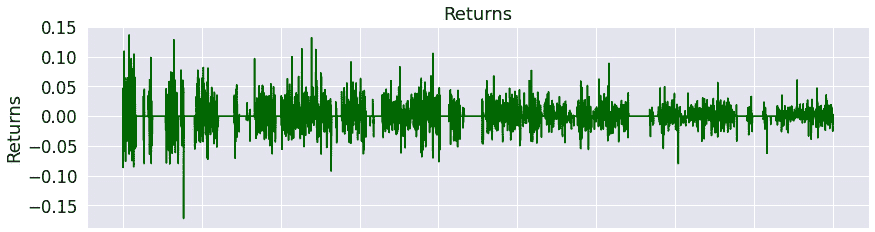

图 9.4–滚动窗口均值策略；投资期限内的回报

图表证实，回报率在零附近大幅波动。


图 9.5–滚动窗口均值策略；投资期限内 6 个月的滚动波动

该图说明了该策略的回报波动性在时间范围内是递减的。

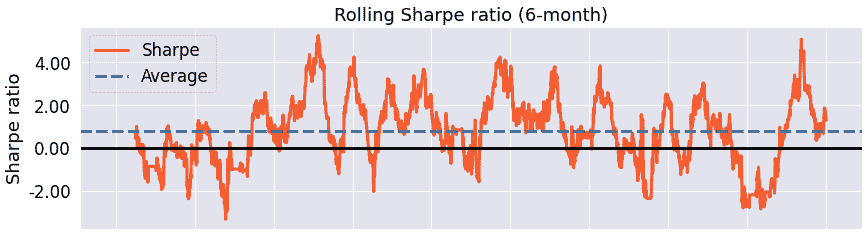

图 9.6–滚动窗口均值策略；投资期限内 6 个月的滚动夏普比率

我们看到策略的最大夏普比率大于 4，最小值小于-2。如果我们回顾了进入/退出规则，我们应该能够提高策略的性能。

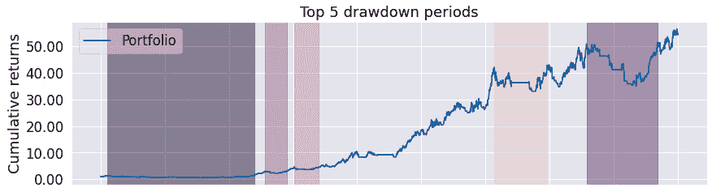

图 9.7–滚动窗口均值策略；投资期限内的前五个提款期

最大水位下降的图示表明，最大水位下降的时间过长。

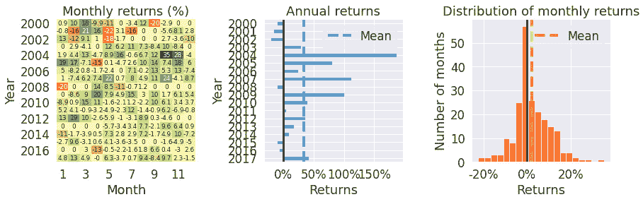

图 9.8–滚动窗口均值策略；月回报、年回报，以及月回报在投资期限内的分布

**月收益图**显示我们在大多数月份都有交易。**年回报率**条形图显示回报率绝对为正，而**月回报率分布图**显示向右倾斜为正。

滚动窗口均值策略是最简单的策略之一，对于某些股票和时间框架的组合仍然非常有利可图。请注意，这种策略的最大提款是很大的，如果我们添加更高级的进/出规则，可能会有所改善。

## 简单移动平均线策略

这个策略遵循一个简单的规则:如果短期移动平均线高于长期移动平均线，就买入股票:

```
%matplotlib inline
from zipline import run_algorithm 
from zipline.api import order_target_percent, symbol, set_commission
from zipline.finance.commission import PerTrade
import pandas as pd
import pyfolio as pf
import warnings
warnings.filterwarnings('ignore')
def initialize(context): 
    context.stock = symbol('AAPL')
    context.rolling_window = 90 
    set_commission(PerTrade(cost=5))     
def handle_data(context, data): 
    price_hist = data.history(context.stock, "close", 
                              context.rolling_window, "1d")

    rolling_mean_short_term = \
    price_hist.rolling(window=45, center=False).mean()
    rolling_mean_long_term = \
    price_hist.rolling(window=90, center=False).mean()

    if rolling_mean_short_term[-1] > rolling_mean_long_term[-1]:
        order_target_percent(context.stock, 1.0)     
    elif rolling_mean_short_term[-1] < rolling_mean_long_term[-1]:
        order_target_percent(context.stock, 0.0)     
def analyze(context, perf): 
    returns, positions, transactions = \
    pf.utils.extract_rets_pos_txn_from_zipline(perf) 
    pf.create_returns_tear_sheet(returns, 
                                 benchmark_rets = None)

start_date = pd.to_datetime('2000-1-1', utc=True)
end_date = pd.to_datetime('2018-1-1', utc=True)

results = run_algorithm(start = start_date, end = end_date, 
                        initialize = initialize, 
                        analyze = analyze, 
                        handle_data = handle_data, 
                        capital_base = 10000, 
                        data_frequency = 'daily', 
                        bundle ='quandl')
```

输出如下:


图 9.9-简单移动平均线策略；回报和风险统计摘要

统计数据显示，从长期来看，该策略绝对有利可图(高稳定性和尾部比率)，而最大降额可能相当可观。


图 9.10-简单移动平均线策略；最差的五个提款期

最糟糕的提款期相当长——超过 335 天，在最糟糕的情况下，有些人甚至需要超过 3 年。


图 9.11-简单移动平均线策略；投资期限内的累计回报

然而，这张图表确实证实了这种长期策略是有利可图的——我们看到，在第一次提款后，累积回报持续增长。


图 9.12-简单移动平均线策略；投资期限内的回报

图表显示，在交易窗口的最开始有一个重大负回报事件，然后回报在零附近振荡。

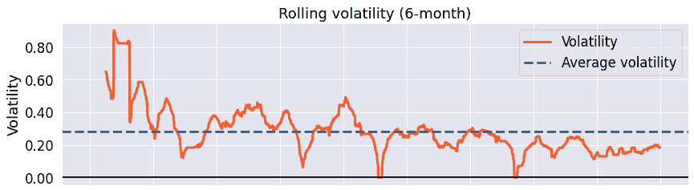

图 9.13-简单移动平均线策略；投资期限内 6 个月的滚动波动

滚动波动率图显示，滚动波动率是随时间递减的。

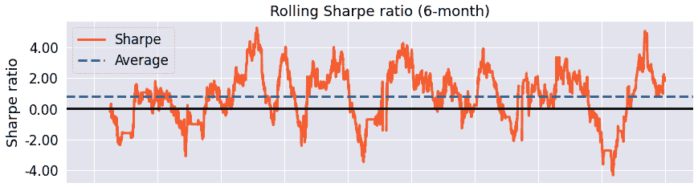

图 9.14-简单移动平均线策略；投资期限内 6 个月的滚动夏普比率

当最大夏普比率为超过 4，最小当量低于-4 时，平均夏普比率为 0.68。

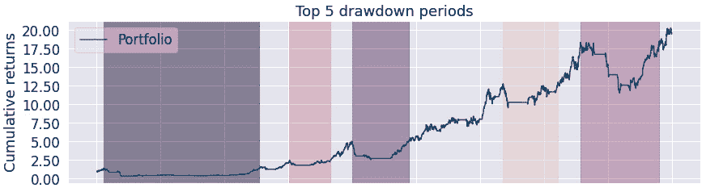

图 9.15-简单移动平均线策略；投资期限内的前五个提款期

该图证实了最大水位下降期非常长。


图 9.16-简单移动平均线策略；月回报、年回报，以及月回报在投资期限内的分布

月收益表显示，很多月份都没有交易。年度回报大多是正的。月回报率的分布图证实了偏斜是负的。

简单的移动平均线策略比滚动窗口平均线策略的利润更少，最大亏损也更大。一个原因可能是移动平均线的滚动窗口太大。

## 指数加权移动平均策略

这个策略与上一个类似，除了使用不同的滚动窗口和指数加权移动平均线。结果略好于在先前策略下获得的结果。

其他一些移动平均算法在决策规则中同时使用简单移动平均和指数加权移动平均；例如，如果简单移动平均线大于指数加权移动平均线，则采取行动:

```
%matplotlib inline
from zipline import run_algorithm 
from zipline.api import order_target_percent, symbol, set_commission
from zipline.finance.commission import PerTrade
import pandas as pd
import pyfolio as pf
import warnings
warnings.filterwarnings('ignore')
def initialize(context): 
    context.stock = symbol('AAPL')
    context.rolling_window = 90
    set_commission(PerTrade(cost=5))     
def handle_data(context, data): 
    price_hist = data.history(context.stock, "close", 
                              context.rolling_window, "1d")

    rolling_mean_short_term = \
    price_hist.ewm(span=5, adjust=True,
                   ignore_na=True).mean()
    rolling_mean_long_term = \
    price_hist.ewm(span=30, adjust=True, 
                   ignore_na=True).mean()

    if rolling_mean_short_term[-1] > rolling_mean_long_term[-1]:
        order_target_percent(context.stock, 1.0)     
    elif rolling_mean_short_term[-1] < rolling_mean_long_term[-1]:
        order_target_percent(context.stock, 0.0)     
def analyze(context, perf): 
    returns, positions, transactions = \
    pf.utils.extract_rets_pos_txn_from_zipline(perf) 
    pf.create_returns_tear_sheet(returns, 
                                 benchmark_rets = None)

start_date = pd.to_datetime('2000-1-1', utc=True)
end_date = pd.to_datetime('2018-1-1', utc=True)

results = run_algorithm(start = start_date, end = end_date,
                        initialize = initialize, 
                        analyze = analyze, 
                        handle_data = handle_data, 
                        capital_base = 10000, 
                        data_frequency = 'daily', 
                        bundle ='quandl')
```

输出如下:


图 9.17–指数加权移动平均策略；回报和风险统计摘要

结果显示，最大下降水平已经从之前的策略下降，同时仍然保持非常强的稳定性和尾部比率。

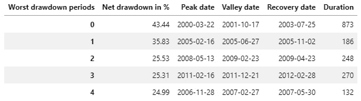

图 9.18–指数加权移动平均策略；最差的五个提款期

最糟糕的下降幅度以及最长持续时间(以天计)远远好于前两种策略。


图 9.19–指数加权移动平均策略；投资期限内的累计回报

正如稳定性指标所示，我们看到了持续的正累积回报。

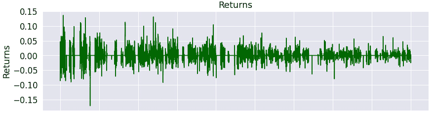

图 9.20–指数加权移动平均策略；投资期限内的回报

回报率在零附近振荡，正回报率大于负回报率。

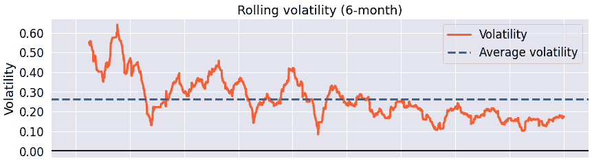

图 9.21–指数加权移动平均策略；投资期限内 6 个月的滚动波动

滚动波动率随时间下降。

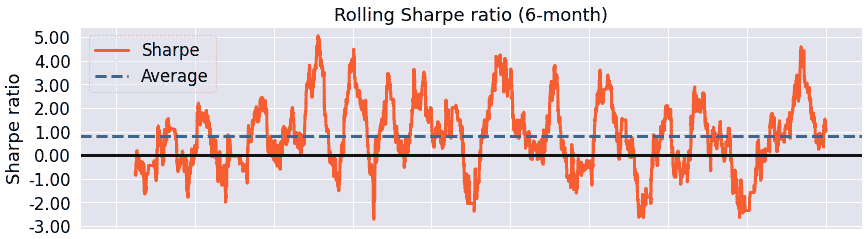

图 9.22–指数加权移动平均策略；投资期限内 6 个月的滚动夏普比率

我们看到,的最大夏普比率几乎达到 5，而最小的略低于-2，这也比之前的两个算法要好。


图 9.23–指数加权移动平均策略；投资期限内的前五个提款期

请注意，对于最后三种算法，最差压降的周期并不相同。

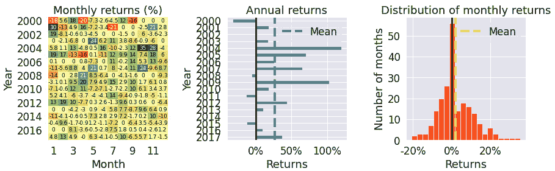

图 9.24–指数加权移动平均策略；月回报、年回报，以及月回报在投资期限内的分布

**月收益**表显示我们在大多数月份都有交易。**年度回报图**证实了大多数回报是正的。月度回报的**分布图**是正偏态的，这是一个好迹象。

在给定的时间框架内，指数加权移动平均策略对苹果的股票表现更好。然而，一般来说，最合适的均线策略取决于股票和时间框架。

## RSI 策略

这个策略依赖于`stockstats`包。在[https://github . com/intrad/stock stats/blob/master/stock stats . py](https://github.com/intrad/stockstats/blob/master/stockstats.py)看源代码很有启发。

要安装它，请使用以下命令:

```
pip install stockstats
```

RSI 指标衡量价格变动的速度和幅度，并在金融资产超卖或超买时提供指标。这是一个领先指标。

该指数从 0 到 100，数值超过 70 表示超买，数值低于 30 表示超卖:

```
%matplotlib inline
from zipline import run_algorithm 
from zipline.api import order_target_percent, symbol, set_commission
from zipline.finance.commission import PerTrade
import pandas as pd
import pyfolio as pf
from stockstats import StockDataFrame as sdf
import warnings
warnings.filterwarnings('ignore')
def initialize(context): 
    context.stock = symbol('AAPL')
    context.rolling_window = 20
    set_commission(PerTrade(cost=5))     
def handle_data(context, data): 
    price_hist = data.history(context.stock, 
                              ["open", "high", 
                               "low","close"], 
                              context.rolling_window, "1d")

    stock=sdf.retype(price_hist)   
    rsi = stock.get('rsi_12')

    if rsi[-1] > 90:
        order_target_percent(context.stock, 0.0)     
    elif rsi[-1] < 10:
        order_target_percent(context.stock, 1.0)   

def analyze(context, perf): 
    returns, positions, transactions = \
    pf.utils.extract_rets_pos_txn_from_zipline(perf) 
    pf.create_returns_tear_sheet(returns, 
                                 benchmark_rets = None)

start_date = pd.to_datetime('2015-1-1', utc=True)
end_date = pd.to_datetime('2018-1-1', utc=True)

results = run_algorithm(start = start_date, end = end_date,
                        initialize = initialize, 
                        analyze = analyze, 
                        handle_data = handle_data, 
                        capital_base = 10000, 
                        data_frequency = 'daily', 
                        bundle ='quandl')
```

输出如下:

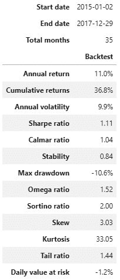

图 9.25–RSI 策略；回报和风险统计摘要

对策略的第一次观察显示极佳的夏普比率，具有非常低的最大压降和有利的尾部比率。

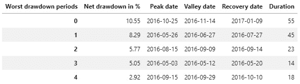

图 9.26–RSI 策略；最差的五个提款期

最差的提款期非常短,不到 2 个月，也不是很长，最大提款只有-10.55%。

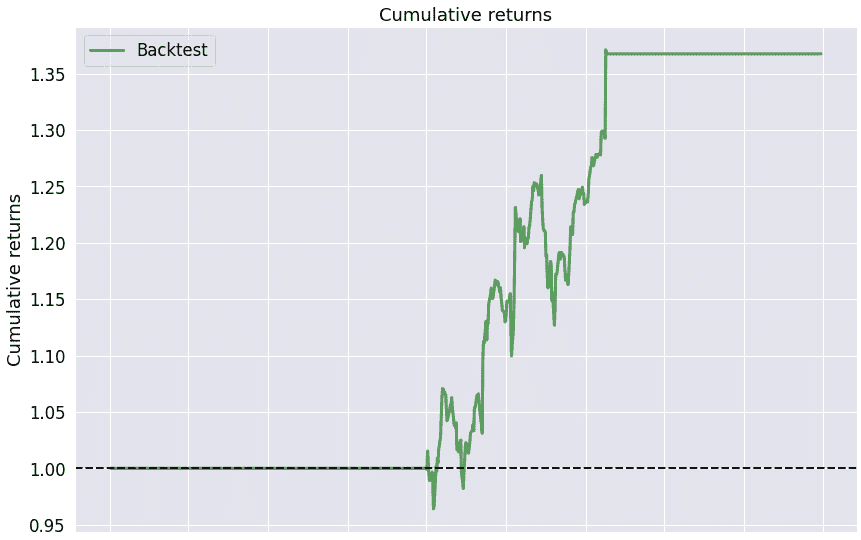

图 9.27–RSI 策略；投资期限内的累计回报

**累积回报**图显示，我们没有在大部分交易时段进行交易，当我们进行交易时，累积回报呈正趋势。


图 9.28–RSI 策略；投资期限内的回报

我们可以看到,交易时,回报更可能是正的而不是负的。


图 9.29–RSI 策略；投资期限内 6 个月的滚动波动

请注意，0.2 的最大滚动波动率远低于之前的策略。

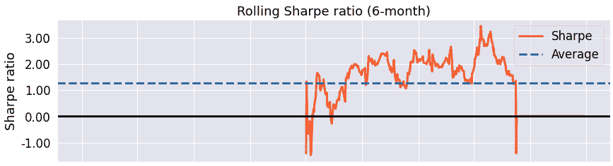

图 9.30–RSI 策略；投资期限内 6 个月的滚动夏普比率

我们可以看到夏普比率一直大于 1，最大值大于 3，最小值小于-1。


图 9.31–RSI 策略；投资期限内的前五个提款期

图表显示了短暂且不重要的提款期。


图 9.32–RSI 策略；月回报、年回报，以及月回报在投资期限内的分布

**月回报**表表明我们在大多数月份都没有交易。然而，根据**年度回报图**，当我们交易时，我们获得了巨大的利润。月度回报的**分布图**证实了偏斜度非常正，峰度很大。

在给定时间框架内，苹果股票的案例中，RSI 策略表现非常出色，夏普比率为 1.11。但是，请注意，策略的成功很大程度上取决于非常严格的进场/出场规则，这意味着我们在某些月份根本不交易。

## MACD 的跨界策略

**移动平均线收敛背离** ( **MACD** )是一个滞后、趋势跟踪动量指标，反映股价两条移动平均线之间的关系。

该策略取决于两个统计数据，即 MACD 和 MACD 信号线:

*   MACD 被定义为 12 天指数移动平均线和 26 天指数移动平均线之间的差异。
*   MACD 信号线被定义为 MACD 的 9 天指数移动平均线。

MACD 交叉策略定义如下:

*   当 MACD 线向上转，穿过 MACD 信号线时，就是牛市交叉。
*   当 MACD 线向下转，穿过 MACD 信号线时，就发生了熊市交叉。

因此，这种策略最适合波动大、交易频繁的市场:

```
%matplotlib inline
from zipline import run_algorithm 
from zipline.api import order_target_percent, symbol, set_commission
from zipline.finance.commission import PerTrade
import pandas as pd
import pyfolio as pf
from stockstats import StockDataFrame as sdf
import warnings
warnings.filterwarnings('ignore')
def initialize(context): 
    context.stock = symbol('AAPL')
    context.rolling_window = 20
    set_commission(PerTrade(cost=5))     
def handle_data(context, data): 
    price_hist = data.history(context.stock, 
                              ["open","high", 
                               "low","close"], 
                              context.rolling_window, "1d")

    stock=sdf.retype(price_hist)   
    signal = stock['macds']
    macd   = stock['macd'] 

    if macd[-1] > signal[-1] and macd[-2] <= signal[-2]:
        order_target_percent(context.stock, 1.0)     
    elif macd[-1] < signal[-1] and macd[-2] >= signal[-2]:
        order_target_percent(context.stock, 0.0)   

def analyze(context, perf): 
    returns, positions, transactions = \
    pf.utils.extract_rets_pos_txn_from_zipline(perf) 
    pf.create_returns_tear_sheet(returns, 
                                 benchmark_rets = None)

start_date = pd.to_datetime('2015-1-1', utc=True)
end_date = pd.to_datetime('2018-1-1', utc=True)

results = run_algorithm(start = start_date, end = end_date, 
                        initialize = initialize, 
                        analyze = analyze, 
                        handle_data = handle_data, 
                        capital_base = 10000, 
                        data_frequency = 'daily', 
                        bundle ='quandl')
```

输出如下:


图 9.33-MACD 交叉策略；回报和风险统计摘要

尾部比率说明顶部的收益和损失大致相同。非常低的稳定性表明累积回报没有强劲的趋势。


图 9.34-MACD 交叉策略；最差的五个提款期

除了最差的提款期，其他时间都短于 6 个月，净提款率低于 10%。


图 9.35-MACD 交叉策略；投资期限内的累计回报

**累积收益**图确认低稳定性指标值。

下面是**回报**图:


图 9.36-MACD 交叉策略；投资期限内的回报

**回报率**图显示回报率在零附近大幅波动，有一些异常值。

以下是**滚动波动率**图:


图 9.37-MACD 交叉策略；投资期限内 6 个月的滚动波动

滚动波动率一直在 0.15 左右震荡。

以下是滚动夏普比率图:

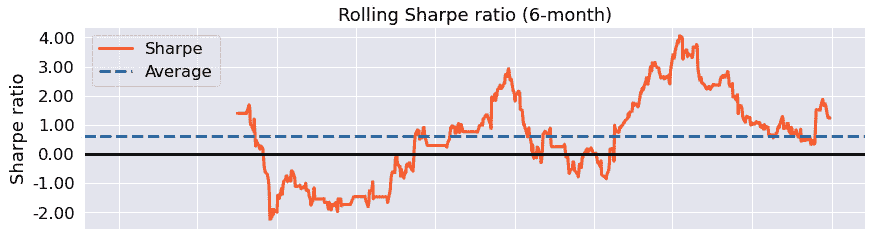

图 9.38-MACD 交叉策略；投资期限内 6 个月的滚动夏普比率

最大滚动夏普比率约为 4，最小比率为-2，这在很大程度上是有利的。

以下是五大提款期图表:


图 9.39-MACD 交叉策略；投资期限内的前五个提款期

我们看到，最糟糕的两个下降期相当长。


图 9.40-MACD 交叉策略；月回报、年回报，以及月回报在投资期限内的分布

**月度** **回报**表证实了我们在大多数月份都有交易。**年度回报**图表明最赚钱的一年是 2017 年。**月度回报分布图**显示了轻微的负偏斜和较大的峰度。

MACD 交叉策略是趋势市场的有效策略，可以通过提高进场/出场规则来显著提高。

## RSI 和 MACD 策略

在这个策略中，我们结合了 RSI 和 MACD 策略，如果 RSI 和 MACD 标准都提供了买入信号，我们就持有该股。

使用多个标准可以提供更完整的市场视图(请注意，我们将 RSI 阈值概括为 50):

```
%matplotlib inline
from zipline import run_algorithm 
from zipline.api import order_target_percent, symbol, set_commission
from zipline.finance.commission import PerTrade
import pandas as pd
import pyfolio as pf
from stockstats import StockDataFrame as sdf
import warnings
warnings.filterwarnings('ignore')
def initialize(context): 
    context.stock = symbol('MSFT')
    context.rolling_window = 20
    set_commission(PerTrade(cost=5))     
def handle_data(context, data): 
    price_hist = data.history(context.stock, 
                              ["open", "high", 
                               "low","close"], 
                              context.rolling_window, "1d")

    stock=sdf.retype(price_hist)   
    rsi = stock.get('rsi_12')

    signal = stock['macds']
    macd   = stock['macd'] 

    if rsi[-1] < 50 and macd[-1] > signal[-1] and macd[-2] <= signal[-2]:
        order_target_percent(context.stock, 1.0)     
    elif rsi[-1] > 50 and macd[-1] < signal[-1] and macd[-2] >= signal[-2]:
        order_target_percent(context.stock, 0.0)   

def analyze(context, perf): 
    returns, positions, transactions = \
    pf.utils.extract_rets_pos_txn_from_zipline(perf) 
    pf.create_returns_tear_sheet(returns, 
                                 benchmark_rets = None)

start_date = pd.to_datetime('2015-1-1', utc=True)
end_date = pd.to_datetime('2018-1-1', utc=True)

results = run_algorithm(start = start_date, end = end_date, 
                        initialize = initialize, 
                        analyze = analyze, 
                        handle_data = handle_data, 
                        capital_base = 10000, 
                        data_frequency = 'daily', 
                        bundle ='quandl')
```

输出如下:

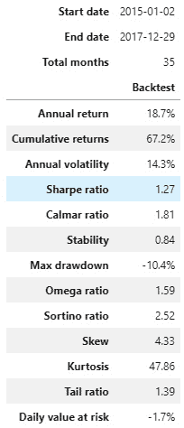

图 9.41–RSI 和 MACD 策略；回报和风险统计摘要

高稳定性值、高尾部比和出色的夏普比，以及低的最大压降，表明该策略非常出色。

下面是最差的五个提款期图表:


图 9.42–RSI 和 MACD 策略；最差的五个提款期

我们看到最差的提款期很短——不到 4 个月——最差的净提款为-10.36%。

以下是**累计收益**图:

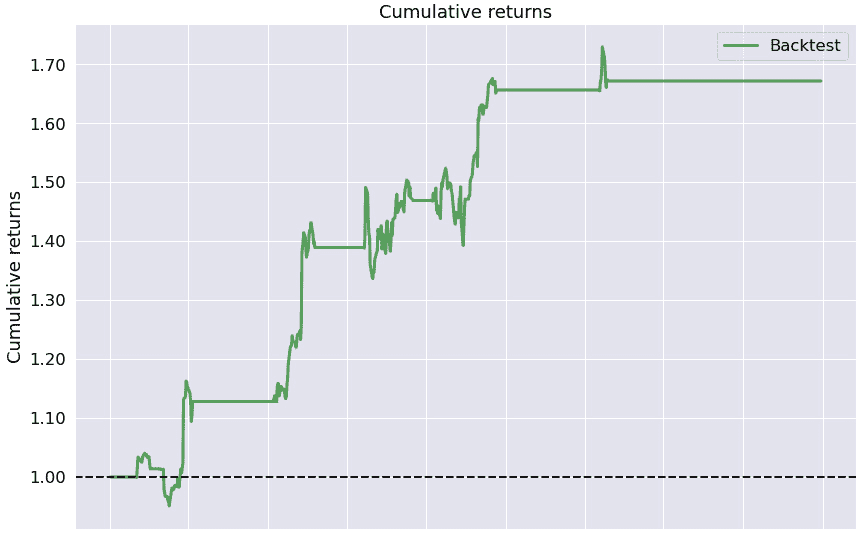

图 9.43–RSI 和 MACD 策略；投资期限内的累计回报

高稳定性值是有利的。注意图表中的水平线；这些表明我们没有交易。

下面是**回报**图:


图 9.44–RSI 和 MACD 策略；投资期限内的回报

**回报**图显示，当我们交易时，正回报大于负回报。

以下是**滚动波动率**图:


图 9.45–RSI 和 MACD 策略；投资期限内 6 个月的滚动波动

滚动波动率随着时间的推移一直在下降，并且相对较低。

以下是**滚动夏普比率**图:


图 9.46–RSI 和 MACD 策略；投资期限内 6 个月的滚动夏普比率

最大滚动夏普比率超过 3，最小值低于-2，平均值高于 1.0，表明结果非常好。

以下是**前五大提款期**图:

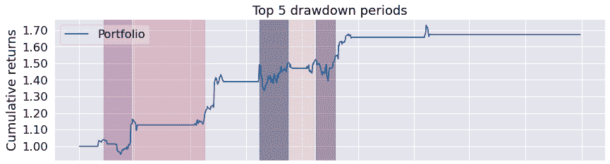

图 9.47–RSI 和 MACD 策略；投资期限内的前五个提款期

我们看到下降期很短且不显著。

以下是**月收益率**、**年收益率**和**月收益率分布**图:


图 9.48–RSI 和 MACD 策略；月回报、年回报，以及月回报在投资期限内的分布

**月回报**表证实我们在大多数月份都没有交易。然而，根据**年度回报图**，当我们交易时，利润丰厚。月收益率的**分布**图为正，峰度较高。

RSI 和 MACD 策略作为两种策略的组合，表现优异，夏普比率为 1.27，最大下降幅度为-10.4%。请注意，在某些月份，它不会触发任何交易。

## 三重指数平均策略

**三重指数平均线** ( **TRIX** )指标是一个围绕零线振荡的振荡器。正值表示市场超买，而负值表示市场超卖:

```
%matplotlib inline
from zipline import run_algorithm 
from zipline.api import order_target_percent, symbol, set_commission
from zipline.finance.commission import PerTrade
import pandas as pd
import pyfolio as pf
from stockstats import StockDataFrame as sdf
import warnings
warnings.filterwarnings('ignore')
def initialize(context): 
    context.stock = symbol('MSFT')
    context.rolling_window = 20
    set_commission(PerTrade(cost=5))     
def handle_data(context, data): 
    price_hist = data.history(context.stock, 
                              ["open","high", 
                               "low","close"], 
                              context.rolling_window, "1d")

    stock=sdf.retype(price_hist)   
    trix = stock.get('trix')

    if trix[-1] > 0 and trix[-2] < 0:
        order_target_percent(context.stock, 0.0)     
    elif trix[-1] < 0 and trix[-2] > 0:
        order_target_percent(context.stock, 1.0)   

def analyze(context, perf): 
    returns, positions, transactions = \
    pf.utils.extract_rets_pos_txn_from_zipline(perf) 
    pf.create_returns_tear_sheet(returns, 
                                 benchmark_rets = None)

start_date = pd.to_datetime('2015-1-1', utc=True)
end_date = pd.to_datetime('2018-1-1', utc=True)

results = run_algorithm(start = start_date, end = end_date, 
                        initialize = initialize, 
                        analyze = analyze, 
                        handle_data = handle_data, 
                        capital_base = 10000, 
                        data_frequency = 'daily', 
                        bundle ='quandl')
```

输出如下:

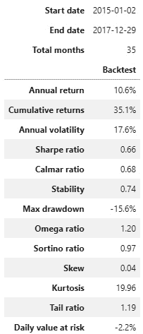

图 9.49-TRIX 策略；回报和风险统计摘要

一般来说，具有高于平均水平稳定性的高尾部比率表明这是一个有利可图的策略。

以下是最差的五个提款期图表:

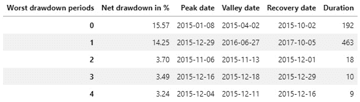

图 9.50-TRIX 策略；最差的五个提款期

第二个最糟糕的提款期是超过一年的。最差的净跌幅为-15.57%。

以下是**累计收益**图:


图 9.51-TRIX 策略；投资期限内的累计回报

**累积回报**图表明我们已经好几个月没有交易了(水平线)，并且有一个长期的积极趋势，高稳定性值证实了这一点。

下面是**回报**图:

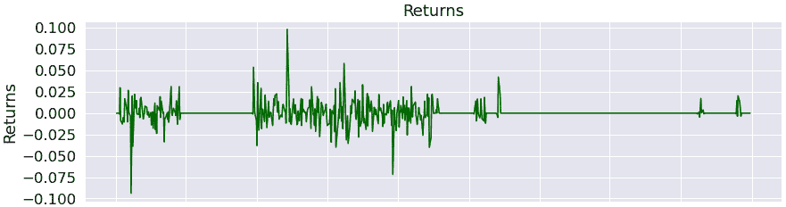

图 9.52-TRIX 策略；投资期限内的回报

这张图表表明，当我们交易时，我们更有可能获得正回报。

以下是**滚动波动率**图:


图 9.53-TRIX 策略；投资期限内 6 个月的滚动波动

**滚动波动率**图显示滚动波动率一直在随时间下降，尽管最大波动率一直相当高。

以下是**滚动夏普比率**图:

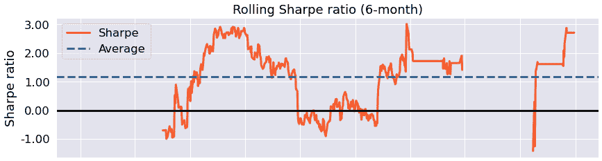

图 9.54-TRIX 策略；投资期限内 6 个月的滚动夏普比率

滚动夏普比率更可能是正的而不是负的，其最大值在区域为 3，最小值略低于-1。

以下是五大提款期图表:

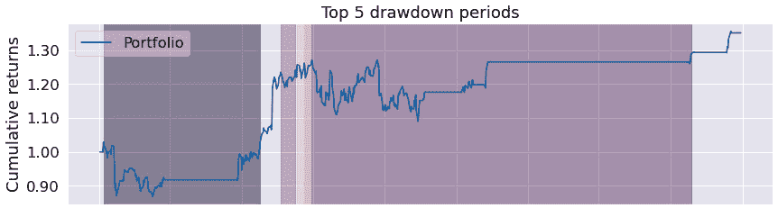

图 9.55-TRIX 策略；投资期限内的前五个提款期

前五个缩减期证实了最糟糕的缩减期很长。

以下是**月收益率**、**年收益率**和**月收益率分布**图:


图 9.56-TRIX 策略；月回报、年回报，以及月回报在投资期限内的分布

**月回报**表证实我们已经好几个月没有交易了。**年回报率**图显示 2015 年回报率最高。月度回报的**分布图**显示了一个非常轻微的正偏态，峰度有点大。

TRIX 策略对一些股票的表现，比如苹果，在给定的时间框架内非常糟糕。对于其他股票，如微软，包括在前面的报告中，表现是优秀的某些年份。

## 威廉姆斯 R%策略

这个策略是由拉里·威廉姆斯开发的，威廉 R%在 0 到-100 之间波动。`stockstats`库已经实现了从 0 到+100 的值。

高于-20 的值表明该证券已经超买，而低于-80 的值表明该证券已经超卖。

这一策略对微软的股票来说非常成功，但对苹果的股票来说就不那么成功了:

```
%matplotlib inline
from zipline import run_algorithm 
from zipline.api import order_target_percent, symbol, set_commission
from zipline.finance.commission import PerTrade
import pandas as pd
import pyfolio as pf
from stockstats import StockDataFrame as sdf
import warnings
warnings.filterwarnings('ignore')
def initialize(context): 
    context.stock = symbol('MSFT')
    context.rolling_window = 20
    set_commission(PerTrade(cost=5))     
def handle_data(context, data): 
    price_hist = data.history(context.stock, 
                              ["open", "high",
                               "low","close"], 
                              context.rolling_window, "1d")

    stock=sdf.retype(price_hist)   
    wr = stock.get('wr_6')

    if wr[-1] < 10:
        order_target_percent(context.stock, 0.0)     
    elif wr[-1] > 90:
        order_target_percent(context.stock, 1.0)   

def analyze(context, perf): 
    returns, positions, transactions = \
    pf.utils.extract_rets_pos_txn_from_zipline(perf) 
    pf.create_returns_tear_sheet(returns, 
                                 benchmark_rets = None)

start_date = pd.to_datetime('2015-1-1', utc=True)
end_date = pd.to_datetime('2018-1-1', utc=True)

results = run_algorithm(start = start_date, end = end_date, 
                        initialize = initialize, 
                        analyze = analyze, 
                        handle_data = handle_data, 
                        capital_base = 10000, 
                        data_frequency = 'daily', 
                        bundle ='quandl')
```

输出如下:


图 9.57–威廉姆斯 R%策略；回报和风险统计摘要

摘要统计数据显示了一个优秀的策略——高稳定性确保了回报的一致性，具有大的尾部比率、非常低的最大下降和稳定的夏普比率。

以下是最差的五个提款期图表:

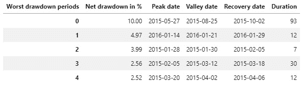

图 9.58–威廉姆斯 R%策略；最差的五个提款期

除了最糟糕的下降期持续约 3 个月，净下降-10%，其他时期在持续时间和幅度上都不显著。

以下是**累计收益**图:


图 9.59–威廉姆斯 R%策略；投资期限内的累计回报

这张图表证实了该策略的高稳定性价值——累积回报正以稳定的速度增长。

下面是**回报**图:


图 9.60-威廉姆斯 R%策略；投资期限内的回报

**回报**图显示，无论何时我们交易，都比不交易更有利可图。

以下是**滚动波动率**图:


图 9.61–威廉姆斯 R%策略；投资期限内 6 个月的滚动波动

**滚动波动率**图显示了滚动波动率随时间的递减值。

以下是**滚动夏普比率**图:

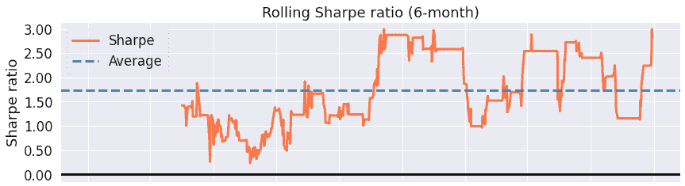

图 9.62–威廉姆斯 R%策略；投资期限内 6 个月的滚动夏普比率

**滚动夏普比率**图证实了夏普比率在交易期间一直为正，最大值为 3.0。

以下是五大提款期图表:


图 9.63–威廉姆斯 R%策略；投资期限内的前五个提款期

**前 5 个下降期**图表显示，除了一个时期，其他最差下降期并不显著。

以下是**月收益率**、**年收益率**和**月收益率分布**图:

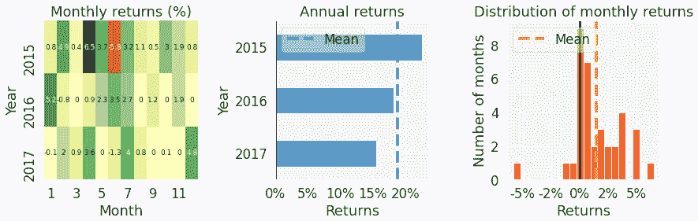

图 9.64–威廉姆斯 R%策略；月回报、年回报，以及月回报在投资期限内的分布

**月回报**表显示，虽然我们不是每个月都交易，但无论何时交易，都是盈利的。**年度回报图**证实了这一点。月度回报的**分布**图证实了一个具有大峰态的正偏斜。

威廉姆斯 R% 策略是一种针对微软股票的高性能策略，夏普比率为 1.53，在给定的时间框架内最大跌幅仅为-10%。

# 学习均值回复策略

均值回归策略基于这样的假设，即一些统计数据将回归到它们的长期均值。

## 布林线策略

布林线波段策略基于识别短期波动周期。

这取决于三条线:

*   *中间的波段线*是简单均线，一般是 20-50 天。
*   *上带*是中间基线以上的 2 个标准差。
*   *下带*是中间基线以下的 2 个标准差。

从布林线创建交易信号的一种方法是定义超买和超卖的市场状态:

*   当金融资产的价格超过上限时，市场就超买了，因此应该回调。
*   当金融资产价格跌破较低区间时，市场就会超卖，因此会反弹。

这是一个均值回归策略，意味着长期来看，价格应该保持在上下区间。它最适合低波动性的股票:

```
%matplotlib inline
from zipline import run_algorithm 
from zipline.api import order_target_percent, symbol, set_commission
from zipline.finance.commission import PerTrade
import pandas as pd
import pyfolio as pf
import warnings
warnings.filterwarnings('ignore')
def initialize(context): 
    context.stock = symbol('DG')
    context.rolling_window = 20 
    set_commission(PerTrade(cost=5))     
def handle_data(context, data): 
    price_hist = data.history(context.stock, "close", 
                              context.rolling_window, "1d")

    middle_base_line = price_hist.mean()
    std_line =  price_hist.std()
    lower_band = middle_base_line - 2 * std_line
    upper_band = middle_base_line + 2 * std_line

    if price_hist[-1] < lower_band:
        order_target_percent(context.stock, 1.0)     
    elif price_hist[-1] > upper_band:
        order_target_percent(context.stock, 0.0)     
def analyze(context, perf): 
    returns, positions, transactions = \
    pf.utils.extract_rets_pos_txn_from_zipline(perf) 
    pf.create_returns_tear_sheet(returns, 
                                 benchmark_rets = None)

start_date = pd.to_datetime('2000-1-1', utc=True)
end_date = pd.to_datetime('2018-1-1', utc=True)

results = run_algorithm(start = start_date, end = end_date, 
                        initialize = initialize, 
                        analyze = analyze, 
                        handle_data = handle_data, 
                        capital_base = 10000, 
                        data_frequency = 'daily', 
                        bundle ='quandl')
```

输出如下:


图 9.65–布林线策略；回报和风险统计摘要

汇总统计数据显示，稳定性是可靠的，尾部比率是有利的。然而，最大下降幅度高达 27.3%。

以下是最差的五个提款期图表:


图 9.66–布林线策略；最差的五个提款期

最差下降期的持续时间很长。也许我们应该调整进场/出场规则，以避免在这些时期进场交易。

以下是**累计收益**图:

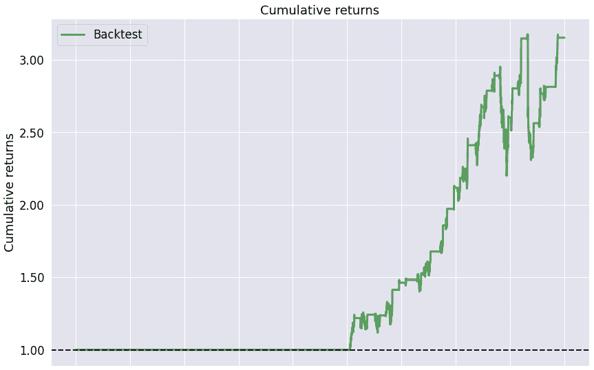

图 9.67–布林线策略；投资期限内的累计回报

**累积回报**图显示我们已经有 10 年没有交易了，然后我们经历了累积回报持续的正趋势。

下面是**回报**图:

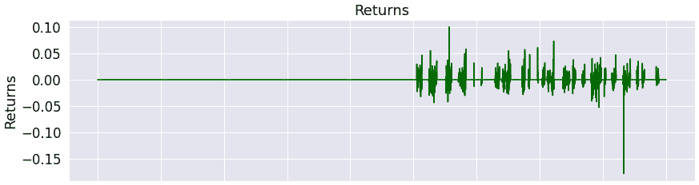

图 9.68–布林线策略；投资期限内的回报

**回报**图显示正回报已经超过了负回报。

以下是**滚动波动率**图:


图 9.69–布林线策略；投资期限内 6 个月的滚动波动

**滚动波动**图表明策略有大幅波动。

以下是**滚动夏普比率**图:

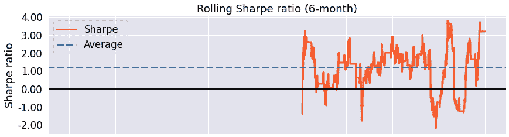

图 9.70–布林线策略；投资期限内 6 个月的滚动夏普比率

**滚动夏普比率**图显示滚动夏普比率波动较大，最大值接近 4，最小值低于-2，但平均为正。

以下是**前五大提款期**图:


图 9.71–布林线策略；投资期限内的前五个提款期

**前 5 个提款期**图表证实了提款期持续时间已经相当可观。

以下是**月收益率**、**年收益率**和**月收益率分布**图:


图 9.72–布林线策略；月回报、年回报，以及月回报在投资期限内的分布

**月收益**表显示，由于我们的进/出规则，从 2000 年到 2010 年没有交易。然而,**年度回报图显示，无论何时交易发生，都是有利可图的。月度回报的**分布**图显示了轻微的负偏斜和巨大的峰度。**

布林带策略是适合振荡股的策略。在这里，我们把它应用到了美元将军公司的股票上

## 结对交易策略

这种策略很早以前就变得非常流行，从那以后就被过度使用，所以现在几乎没有利润。

这种策略包括寻找走势接近或高度整合的股票对。然后，与此同时，我们为一只股票下了一个`BUY`订单，为另一只股票下了一个`SELL`订单，假设它们的关系会恢复。在如何实现这个算法方面，有各种各样的调整——价格是日志价格吗？我们是否只在关系非常牢固的情况下交易？

为简单起见，我们选择了**百事可乐** ( **PEP** )和**可口可乐** ( **KO** )股票。另一个选择可能是**花旗银行** ( **C** )和**高盛** ( **GS** )。我们有两个条件:首先，协整的 p 值必须非常强，然后 z 值必须非常强:

```
%matplotlib inline
from zipline import run_algorithm 
from zipline.api import order_target_percent, symbol, set_commission
from zipline.finance.commission import PerTrade
import pandas as pd
import pyfolio as pf
import numpy as np
import statsmodels.api as sm
from statsmodels.tsa.stattools import coint
import warnings
warnings.filterwarnings('ignore')
def initialize(context): 
    context.stock_x = symbol('PEP')
    context.stock_y = symbol('KO')
    context.rolling_window = 500
    set_commission(PerTrade(cost=5))       
    context.i = 0

def handle_data(context, data):   
    context.i += 1
    if context.i < context.rolling_window:
        return

    try:
        x_price = data.history(context.stock_x, "close", 
                               context.rolling_window,"1d")
        x = np.log(x_price)

        y_price = data.history(context.stock_y, "close", 
                               context.rolling_window,"1d")
        y = np.log(y_price)
        _, p_value, _  = coint(x, y)
        if p_value < .9:
            return

        slope, intercept = sm.OLS(y, sm.add_constant(x, prepend=True)).fit().params

        spread = y - (slope * x + intercept)
        zscore = (\
        spread[-1] - spread.mean()) / spread.std()    

        if -1 < zscore < 1:
            return
        side = np.copysign(0.5, zscore)
        order_target_percent(context.stock_y, 
                             -side * 100 / y_price[-1])
        order_target_percent(context.stock_x,  
                             side * slope*100/x_price[-1])
    except:
        pass
def analyze(context, perf): 
    returns, positions, transactions = \
    pf.utils.extract_rets_pos_txn_from_zipline(perf) 
    pf.create_returns_tear_sheet(returns, 
                                 benchmark_rets = None)

start_date = pd.to_datetime('2015-1-1', utc=True)
end_date = pd.to_datetime('2018-01-01', utc=True)

results = run_algorithm(start = start_date, end = end_date, 
                        initialize = initialize, 
                        analyze = analyze, 
                        handle_data = handle_data, 
                        capital_base = 10000, 
                        data_frequency = 'daily', 
                        bundle ='quandl')
```

输出如下:

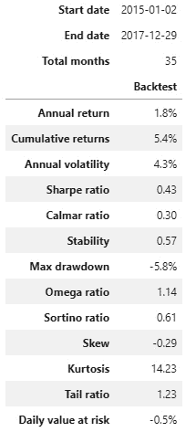

图 9.73-配对交易策略；回报和风险统计摘要

虽然夏普比率非常低，但最大压降也非常低。稳定性一般。

以下是最差的五个提款期图表:

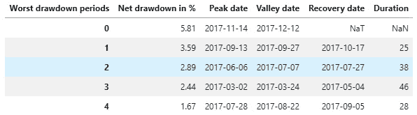

图 9.74-配对交易策略；最差的五个提款期

最差的五个压降周期表显示最大压降可以忽略不计且非常短。

以下是**累计收益**图:

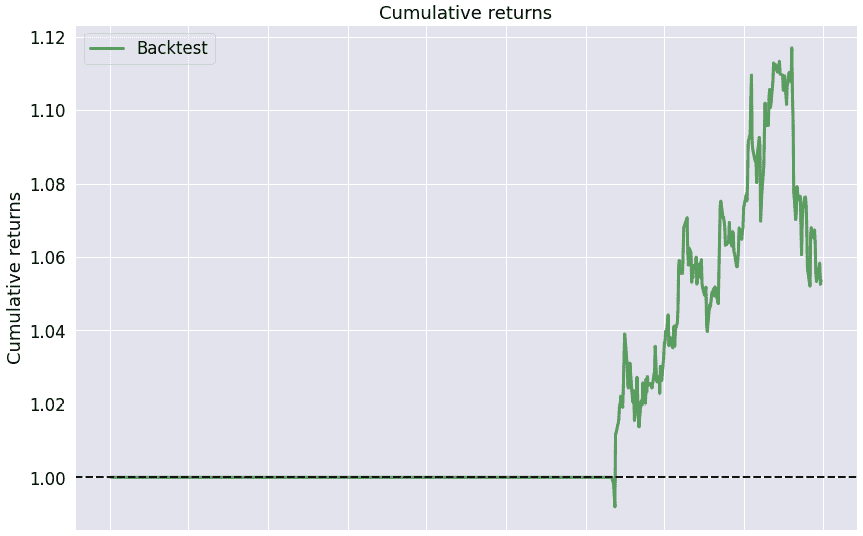

图 9.75-配对交易策略；投资期限内的累计回报

**累积回报**图显示我们已经两年没有交易了，直到最后一段时间还非常盈利。

下面是**回报**图:

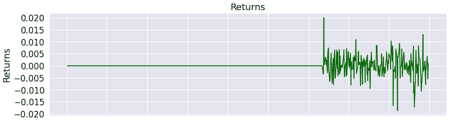

图 9.76-配对交易策略；投资期限内的回报

**回报**图显示，除了上一个交易期之外，其他交易期的回报都是正值大于负值。

以下是**滚动波动率**图:


图 9.77-配对交易策略；投资期限内 6 个月的滚动波动

**滚动波动率**图显示波动率不断增加，尽管波动率幅度不大。

以下是**滚动夏普比率**图:


图 9.78-配对交易策略；投资期限内 6 个月的滚动夏普比率

**滚动夏普比率**图显示，如果我们改进我们的退出规则，早点退出，我们的夏普比率会高于 1。

以下是**前五大提款期**图:

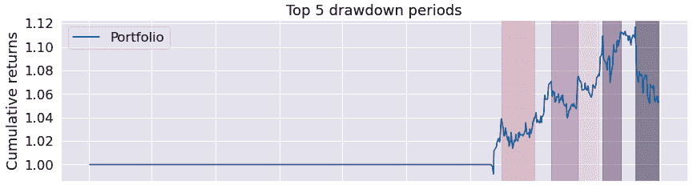

图 9.79-配对交易策略；投资期限内的前五个提款期

**前 5 个提款期**图表告诉我们同样的故事——最后一个时期是这次回溯测试结果不如预期成功的原因。

以下是**月收益率**、**年收益率**和**月收益率分布**图:


图 9.80-配对交易策略；月回报、年回报，以及月回报在投资期限内的分布

**月度回报**表证实了我们直到 2017 年都没有交易。**年度回报**图显示 2017 年的交易是成功的，而**月度回报分布**图显示一个略微负偏的图，峰度较小。

在过去的十年里，配对交易策略被过度使用，因此利润也越来越少。识别这两者的一个简单方法是寻找竞争对手——在这个例子中，是百事公司和可口可乐公司。

# 学习基于数学模型的策略

我们现在将在接下来的章节中看看各种基于数学模型的策略。

## 每月交易的投资组合波动策略最小化

该策略的目标是最小化投资组合的波动性。受到了[https://github . com/letianzj/quant research/tree/master/back test](https://github.com/letianzj/QuantResearch/tree/master/backtest)的启发。

在下面的例子中，投资组合由道琼斯工业平均指数的所有股票组成。

该策略的关键成功因素如下:

*   股票领域——或许全球指数 ETF 的投资组合会表现得更好。
*   滚动窗口——我们回到 200 天前。
*   交易频率——下面的算法使用月度交易——注意这个结构。

代码如下:

```
%matplotlib inline
from zipline import run_algorithm 
from zipline.api import order_target_percent, symbol, set_commission, schedule_function, date_rules, time_rules
from zipline.finance.commission import PerTrade
import pandas as pd
import pyfolio as pf
from scipy.optimize import minimize
import numpy as np
import warnings
warnings.filterwarnings('ignore')
def initialize(context): 
    context.stocks = [symbol('DIS'), symbol('WMT'), 
                      symbol('DOW'), symbol('CRM'), 
                      symbol('NKE'), symbol('HD'), 
                      symbol('V'), symbol('MSFT'),
                      symbol('MMM'), symbol('CSCO'),
                      symbol('KO'), symbol('AAPL'),
                      symbol('HON'), symbol('JNJ'),
                      symbol('TRV'), symbol('PG'),
                      symbol('CVX'), symbol('VZ'),
                      symbol('CAT'), symbol('BA'),
                      symbol('AMGN'), symbol('IBM'),
                      symbol('AXP'), symbol('JPM'),
                      symbol('WBA'), symbol('MCD'),
                      symbol('MRK'), symbol('GS'),
                      symbol('UNH'), symbol('INTC')]
    context.rolling_window = 200
    set_commission(PerTrade(cost=5))
    schedule_function(handle_data, 
                      date_rules.month_end(), 
                      time_rules.market_open(hours=1))

def minimum_vol_obj(wo, cov):
    w = wo.reshape(-1, 1)
    sig_p = np.sqrt(np.matmul(w.T, 
                              np.matmul(cov, w)))[0, 0]
    return sig_p
def handle_data(context, data): 
    n_stocks = len(context.stocks)
    prices = None

    for i in range(n_stocks):
        price_history = \
        data.history(context.stocks[i], "close", 
                     context.rolling_window, "1d")

        price = np.array(price_history)
        if prices is None:
            prices = price
        else:
            prices = np.c_[prices, price]

    rets = prices[1:,:]/prices[0:-1, :]-1.0
    mu = np.mean(rets, axis=0)
    cov = np.cov(rets.T)    

    w0 = np.ones(n_stocks) / n_stocks

    cons = ({'type': 'eq', 
             'fun': lambda w: np.sum(w) - 1.0}, 
            {'type': 'ineq', 'fun': lambda w: w})
    TOL = 1e-12    
    res = minimize(minimum_vol_obj, w0, args=cov, 
                   method='SLSQP', constraints=cons, 
                   tol=TOL, options={'disp': False})

    if not res.success:
        return;

    w = res.x

    for i in range(n_stocks):
        order_target_percent(context.stocks[i], w[i])    
def analyze(context, perf): 
    returns, positions, transactions = \
    pf.utils.extract_rets_pos_txn_from_zipline(perf) 
    pf.create_returns_tear_sheet(returns, 
                                 benchmark_rets = None)

start_date = pd.to_datetime('2010-1-1', utc=True)
end_date = pd.to_datetime('2018-1-1', utc=True)

results = run_algorithm(start = start_date, end = end_date, 
                        initialize = initialize, 
                        analyze = analyze, 
                        capital_base = 10000, 
                        data_frequency = 'daily'
                        bundle ='quandl')
```

输出如下:


图 9.81–最小化投资组合波动策略；回报和风险统计摘要

的结果是正的——参见`0.91`的强稳定性，而尾部比率刚好超过 1。

请注意，结果包括交易成本，如果我们每天交易，结果会更糟。总是尝试最佳的交易频率。

下面的是最差的五个下降周期图:


图 9.82–最小化投资组合波动策略；最差的五个提款期

最糟糕的提款期超过一年，净提款为-18.22%。其他最差时期的净下降幅度低于-10%。

以下是**累计收益**图:

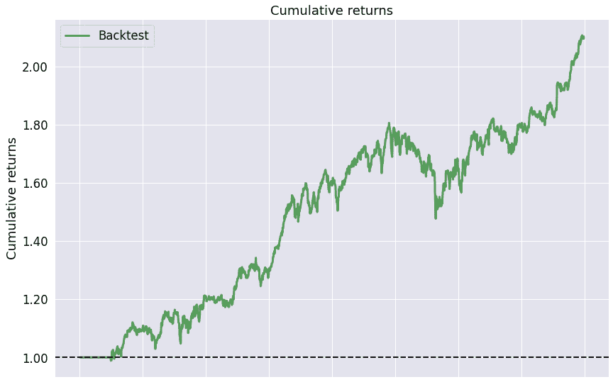

图 9.83–最小化投资组合波动策略；投资期限内的累计回报

我们看到累积收益持续增长，这是给定 0.91 稳定性的预期。

下面是**回报**图:


图 9.84–最小化投资组合波动策略；投资期限内的回报

**回报**图显示了在`-0.3`到`0.04`的区间内，回报围绕零点的波动。

以下是**滚动波动率**图:


图 9.85–最小化投资组合波动策略；投资期限内 6 个月的滚动波动

**滚动波动率**图说明最大滚动波动率为`0.18`，滚动波动率围绕`0.1`循环。

以下是**滚动夏普比率**图:


图 9.86–最小化投资组合波动策略；投资期限内 6 个月的滚动夏普比率

**滚动夏普比率**图显示`5.0`的最大滚动夏普比率，最小略高于`-3.0`。

以下是**前五大提款期**图:

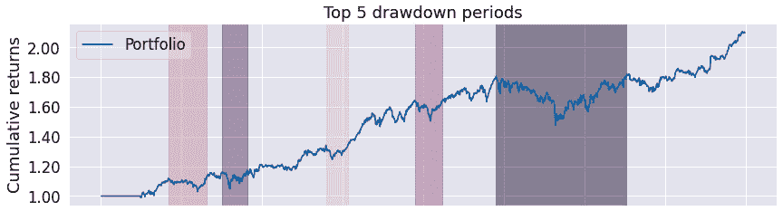

图 9.87–最小化投资组合波动策略；投资期限内的前五个提款期

**前 5 个提款期**图表证实，如果我们通过更明智地选择进入/退出规则来避免最糟糕的提款期，我们将显著改善策略的绩效。

以下是**月收益率**、**年收益率**和**月收益率分布**图:

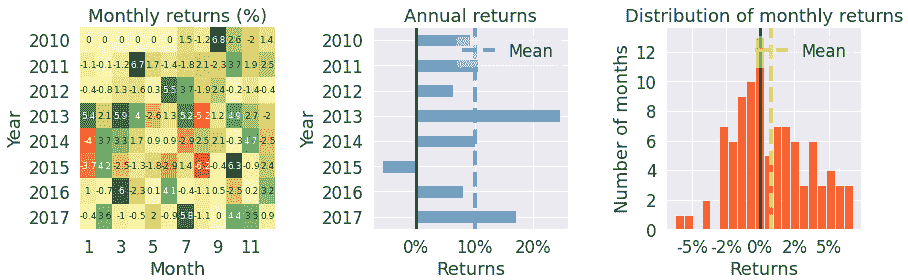

图 9.88–最小化投资组合波动策略；月回报、年回报，以及月回报在投资期限内的分布

**月收益**表说明我们在 2010 年的前几个月没有交易。**年回报率**图表显示，该策略一直年年盈利，但 2015 年。**月度回报分布图**绘制了一个略微负偏的策略，峰度较小。

最小化投资组合波动策略通常只对非日常交易有利可图。在这个例子中，我们使用月度交易，夏普比率为 0.93，最大亏损为-18.2%。

## 月度交易的最大夏普比率策略

这个策略是基于哈里·马科维茨 1952 年的论文*投资组合选择*中的观点。简而言之，最好的投资组合位于*有效边界*——一组对每个风险水平都有最高预期投资组合回报的投资组合。

在这种策略中，对于给定的股票，我们选择它们的权重，使它们最大化投资组合的预期夏普比率——这样的投资组合位于有效边界。

我们使用`PyPortfolioOpt` Python 库。要安装它，要么使用本书的`conda`环境，要么使用下面的命令:

```
pip install PyPortfolioOpt
%matplotlib inline
from zipline import run_algorithm 
from zipline.api import order_target_percent, symbols, set_commission, schedule_function, date_rules, time_rules
from zipline.finance.commission import PerTrade
import pandas as pd
import pyfolio as pf
import numpy as np
from pypfopt.efficient_frontier import EfficientFrontier
from pypfopt import risk_models
from pypfopt import expected_returns
import warnings
warnings.filterwarnings('ignore')
def initialize(context): 
    context.stocks = \
    symbols('DIS','WMT','DOW','CRM','NKE','HD','V','MSFT',
            'MMM','CSCO','KO','AAPL','HON','JNJ','TRV',
            'PG','CVX','VZ','CAT','BA','AMGN','IBM','AXP',
            'JPM','WBA','MCD','MRK','GS','UNH','INTC')
    context.rolling_window = 252
    set_commission(PerTrade(cost=5))
    schedule_function(handle_data, date_rules.month_end(), 
                      time_rules.market_open(hours=1))

def handle_data(context, data): 
    prices_history = data.history(context.stocks, "close", 
                                  context.rolling_window, 
                                  "1d")
    avg_returns = \
    expected_returns.mean_historical_return(prices_history)
    cov_mat = risk_models.sample_cov(prices_history)
    efficient_frontier = EfficientFrontier(avg_returns, 
                                           cov_mat)
    weights = efficient_frontier.max_sharpe()
    cleaned_weights = efficient_frontier.clean_weights()

    for stock in context.stocks:
        order_target_percent(stock, cleaned_weights[stock])
def analyze(context, perf): 
    returns, positions, transactions = \
    pf.utils.extract_rets_pos_txn_from_zipline(perf) 
    pf.create_returns_tear_sheet(returns, 
                                 benchmark_rets = None)

start_date = pd.to_datetime('2010-1-1', utc=True)
end_date = pd.to_datetime('2018-1-1', utc=True)

results = run_algorithm(start = start_date, end = end_date, 
                        initialize = initialize, 
                        analyze = analyze, 
                        capital_base = 10000, 
                        data_frequency = 'daily', 
                        bundle ='quandl')
```

输出如下:


图 9.89–最大夏普比率策略；回报和风险统计摘要

策略显示了`0.76`的稳固的稳定性，其尾部比率接近于 1 ( `1.01`)。然而，这种策略的年度波动性非常高(`17.0%`)。

以下是最差的五个提款期图表:

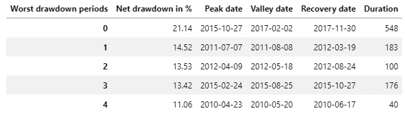

图 9.90–最大夏普比率策略；最差的五个提款期

最糟糕的下降期持续了两年多，净下降幅度为-21.14%。如果我们调整进入/退出规则来避免这个提款期，结果会好得多。

以下是**累计收益**图:


图 9.91–最大夏普比率策略；投资期限内的累计回报

**累积回报**图显示正稳定性。

下面是**回报**图:


图 9.92–最大夏普比率策略；投资期限内的回报

**回报**图显示，该策略在投资期的一开始就非常成功。

以下是**滚动波动率**图:


图 9.93–最大夏普比率策略；投资期限内 6 个月的滚动波动

**滚动波动**图显示滚动波动随着时间补贴。

以下是**滚动夏普比率**图:


图 9.94–最大夏普比率策略；投资期限内 6 个月的滚动夏普比率

**滚动夏普比率**图显示滚动夏普比率随时间增加至最大值`5.0`，而其最小值高于`-3.0`。

下面的是**前 5 大提款期**图:

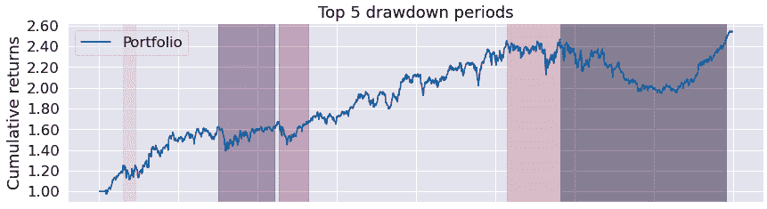

图 9.95–最大夏普比率策略；投资期限内的前五个提款期

**前 5 个下降期**图表显示最大下降期很长。

以下是**月收益率**、**年收益率**和**月收益率分布**图:


图 9.96–最大夏普比率策略；月回报、年回报，以及月回报在投资期限内的分布

**月收益**表证明了我们几乎每个月都在交易。**年回报率**图显示，除了 2016 年，每年的年回报率都为正。**月度回报分布图**呈正偏态，峰度较小。

最大夏普比率策略通常只对非日常交易有利可图。

# 学习基于时间序列预测的策略

基于时间序列预测的策略依赖于对未来某个时间股票价格的精确估计，以及相应的置信区间。估算的计算通常非常耗时。

然后，简单的交易规则结合了最后已知价格和未来价格之间的关系，或者它的下/上置信区间值。

更复杂的交易规则包含了基于趋势和季节性的决策。

## SARIMAX 策略

这个策略基于最基本的规则:如果当前价格低于 7 天后的预测价格，就持有该股票；

```
%matplotlib inline
from zipline import run_algorithm 
from zipline.api import order_target_percent, symbol, set_commission
from zipline.finance.commission import PerTrade
import pandas as pd
import pyfolio as pf
import pmdarima as pm
import warnings
warnings.filterwarnings('ignore')
def initialize(context): 
    context.stock = symbol('AAPL')
    context.rolling_window = 90
    set_commission(PerTrade(cost=5)) 
def handle_data(context, data): 
    price_hist = data.history(context.stock, "close", 
                              context.rolling_window, "1d")
    try:
        model = pm.auto_arima(price_hist, seasonal=True)
        forecasts = model.predict(7)      
        order_target_percent(context.stock, 1.0 if price_hist[-1] < forecasts[-1] else 0.0) 
    except:
        pass
def analyze(context, perf): 
    returns, positions, transactions = \
    pf.utils.extract_rets_pos_txn_from_zipline(perf) 
    pf.create_returns_tear_sheet(returns, 
                                 benchmark_rets = None)

start_date = pd.to_datetime('2017-1-1', utc=True)
end_date = pd.to_datetime('2018-1-1', utc=True)

results = run_algorithm(start = start_date, end = end_date, 
                        initialize = initialize, 
                        analyze = analyze, 
                        handle_data = handle_data, 
                        capital_base = 10000, 
                        data_frequency = 'daily', 
                        bundle ='quandl')
```

输出如下:

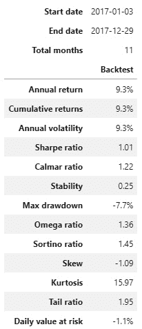

图 9.97–sari max 策略；回报和风险统计摘要

在交易期间，策略表现出`1.95`的高尾部比率和`0.25`的极低稳定性。`-7.7%`的最大落差非常棒。

以下是最差的五个提款期图表:


图 9.98–sari max 策略；最差的五个提款期

最差的下降期显示净下降幅度低于-10%。

以下是**累计收益**图:


图 9.99–sari max 策略；投资期限内的累计回报

**累积回报**图证明我们只在交易期限的前半段交易。

下面是**回报**图:


图 9.100–sari max 策略；投资期限内的回报

**回报**图显示回报波动幅度比其他策略大。

以下是**滚动波动率**图:

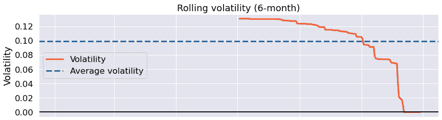

图 9.101–sari max 策略；投资期限内 6 个月的滚动波动

**滚动波动率**图显示滚动波动率随时间下降。

以下是**滚动夏普比率**图:


图 9.102–sari max 策略；投资期限内 6 个月的滚动夏普比率

**滚动夏普比率**图向显示，夏普比率在交易时段的前半段表现出色，然后开始下降。

以下是**前五大提款期**图:

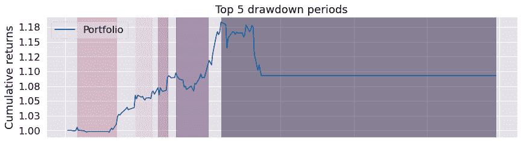

图 9.103–sari max 策略；投资期限内的前五个提款期

**前 5 个提款期**图表显示，最糟糕的提款期是交易窗口的整个后半段。

以下是**月收益率**、**年收益率**和**月收益率分布**图:


图 9.104-月回报、年回报以及月回报在投资期限内的分布

**月度回报**表证实我们在 2017 年下半年没有交易。**年度回报**图显示 2017 年的正回报，月度回报图的**分布为负偏态，峰度较大。**

在测试的时间范围内，SARIMAX 策略进入规则未被频繁触发。尽管如此，它产生了 1.01 的夏普比率，最大降幅为-7.7%。

## 先知策略

该策略基于预测置信区间，因此比之前的策略更加稳健。此外，与 SARIMAX 相比，Prophet 预测对频繁变化的鲁棒性更强。回溯测试结果都是相同的，但是预测算法明显更好。

我们只在最后价格低于置信区间的下限值时买入股票(我们预计股价会上涨)，在最后价格高于预测置信区间的上限值时卖出股票(我们预计股价会下跌):

```
%matplotlib inline
from zipline import run_algorithm 
from zipline.api import order_target_percent, symbol, set_commission
from zipline.finance.commission import PerTrade
import pandas as pd
import pyfolio as pf
from fbprophet import Prophet
import logging
logging.getLogger('fbprophet').setLevel(logging.WARNING)
import warnings
warnings.filterwarnings('ignore')
def initialize(context): 
    context.stock = symbol('AAPL')
    context.rolling_window = 90
    set_commission(PerTrade(cost=5)) 
def handle_data(context, data): 
    price_hist = data.history(context.stock, "close", 
                              context.rolling_window, "1d")

    price_df = pd.DataFrame({'y' : price_hist}).rename_axis('ds').reset_index()
    price_df['ds'] = price_df['ds'].dt.tz_convert(None)

    model = Prophet()
    model.fit(price_df)
    df_forecast = model.make_future_dataframe(periods=7, 
                                              freq='D')
    df_forecast = model.predict(df_forecast)

    last_price=price_hist[-1]
    forecast_lower=df_forecast['yhat_lower'].iloc[-1]
    forecast_upper=df_forecast['yhat_upper'].iloc[-1]

    if last_price < forecast_lower:
        order_target_percent(context.stock, 1.0) 
    elif last_price > forecast_upper:
        order_target_percent(context.stock, 0.0) 
def analyze(context, perf): 
    returns, positions, transactions = \
    pf.utils.extract_rets_pos_txn_from_zipline(perf) 
    pf.create_returns_tear_sheet(returns, 
                                 benchmark_rets = None)

start_date = pd.to_datetime('2017-1-1', utc=True)
end_date = pd.to_datetime('2018-1-1', utc=True)

results = run_algorithm(start = start_date, end = end_date, 
                        initialize = initialize, 
                        analyze = analyze, 
                        handle_data = handle_data, 
                        capital_base = 10000, 
                        data_frequency = 'daily', 
                        bundle ='quandl')
```

输出如下:


图 9.105-先知策略；回报和风险统计摘要

在与 SARIMAX 策略的比较中， Prophet 策略显示出好得多的结果——`1.37`的尾部比率、`1.22`的夏普比率和`-8.7%`的最大压降。

以下是最差的五个提款期图表:

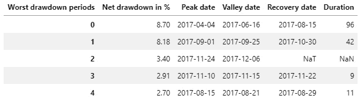

图 9.106-先知策略；最差的五个提款期

最差的五个下降期证实了最差净下降的幅度低于 10%。

以下是**累计收益**图:


图 9.107-先知策略；投资期限内的累计回报

**累积回报**图显示，虽然我们在一定时间内没有交易，但进场/出场规则比 SARIMAX 策略更加稳健——比较两个**累积回报**图。

下面是**回报**图:

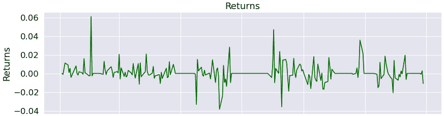

图 9.108-先知策略；投资期限内的回报

**回报**图表明正回报超过了负回报。

以下是**滚动波动率**图:

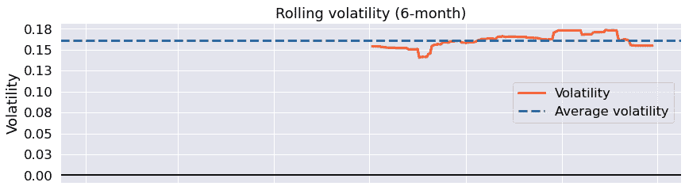

图 9.109-先知策略；投资期限内 6 个月的滚动波动

**滚动波动率**图显示了几乎不变的滚动波动率——这是先知策略的标志。

以下是**滚动夏普比率**图:


图 9.110-先知策略；投资期限内 6 个月的滚动夏普比率

**轧制夏普比率**图显示最大轧制夏普比率在`-.50`和`1.5`之间。

以下是**前五大提款期**图:

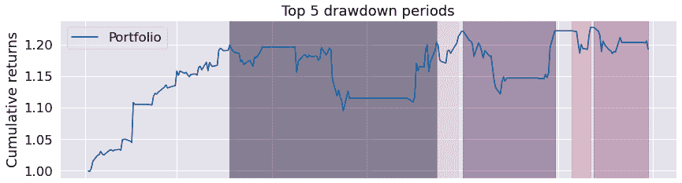

图 9.111-先知策略；投资期限内的前五个提款期

**前 5 个提取期**图表显示，即使提取期很长，算法也能够很好地处理它们。

以下是**月收益率**、**年收益率**和**月收益率分布**图:

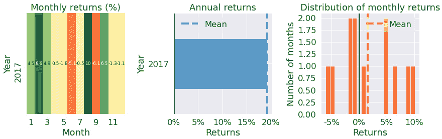

图 9.112-先知策略；月回报、年回报，以及月回报在投资期限内的分布

**月度回报**表证实了我们每个月都在交易，年度回报也很好，这一点从**年度回报**图中可以看出。**月度回报分布图**呈正偏态，峰度较小。

先知策略是最稳健的策略之一，能快速适应市场变化。在给定的时间段内，其夏普比率为 1.22，，最大压降为-8.7。

# 总结

在这一章中，我们了解到算法交易策略是由模型、进场/离场规则、持仓限额和其他关键属性定义的。我们已经展示了在 Zipline 和 PyFolio 中建立一个完整的回溯测试和风险分析/头寸分析系统是多么容易，这样您就可以专注于策略的开发，而不是将时间浪费在基础设施上。

即使前面的策略已经广为人知，你也可以通过明智地组合它们，以及明智地选择进场和出场规则，来构建高利润的策略。

旅途愉快！