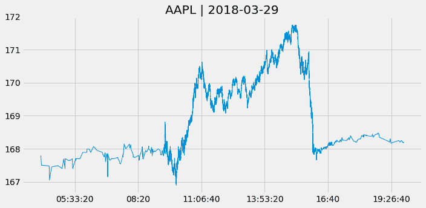
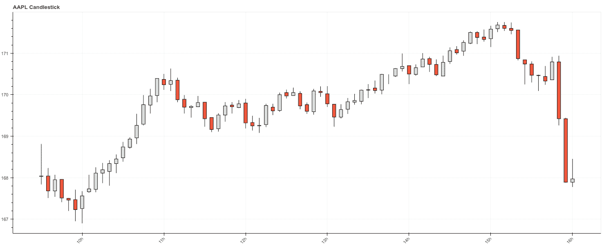
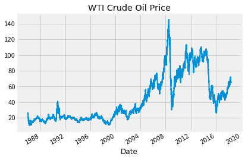

# 二、市场和基本数据

数据一直是交易的基本驱动力，交易者长期以来一直努力通过获取高级信息来获得优势。这些努力至少可以追溯到这样的传言，即罗斯柴尔德家族从债券购买中获得了丰厚的收益，因为鸽子提前将英国在滑铁卢获胜的消息传到了海峡对岸。

今天，对更快的数据访问的投资采取了由领先的高频交易公司组成的 Go West 财团的形式，该财团将 T4 芝加哥商品交易所与东京联系起来。随着交易员竞相利用套利机会，芝加哥商品交易所和纽约 BATS 交易所之间的往返延迟已降至接近 8 毫秒的理论上限。

传统上，投资策略主要依赖于公开可用的数据，而创建或获取私有数据集的努力有限。就股票而言，基本面策略使用的是建立在财务报告基础上的金融模型，可能还结合了行业或宏观数据。由技术分析驱动的策略从市场数据中提取信号，如价格和交易量。

**机器学习** ( **ML** )算法可以更有效地利用市场和基本面数据，特别是当与替代数据结合时，这是下一章的主题。我们将在后面的章节中介绍几种专注于市场和基本面数据的技术，如经典和现代时间序列技术，包括**递归神经网络** ( **RNNs** )。

本章介绍了市场和基本数据来源以及创建它们的环境。熟悉各种类型的订单和交易基础设施很重要，因为它们会影响交易策略的回溯测试模拟。我们还演示了如何使用 Python 来访问和处理交易和财务报表数据。

特别是，本章将涵盖以下主题:

*   市场微观结构如何塑造市场数据
*   如何使用 Nasdaq ITCH 从分笔成交点数据重建订单簿
*   如何使用各种类型的棒线汇总分笔成交点数据
*   如何使用可扩展商业报告语言编码的电子文件
*   如何分析和组合市场和基本面数据以创建 P/E 系列
*   如何使用 Python 访问各种市场和基础数据源

# 如何处理市场数据

市场数据来自在许多市场上的金融工具交易过程中的购买和销售订单的放置和处理。这些数据反映了交易场所的机制环境，包括管理订单、交易执行和价格形成的规则和条例。

算法交易者使用 ML 算法来分析买卖订单流以及由此产生的成交量和价格统计数据，以提取交易信号或特征，这些信号或特征捕捉对例如供求动态或某些市场参与者的行为的洞察。

我们将首先回顾在回溯测试中影响交易策略模拟的机制特征。然后，我们将看看如何从订单簿源中重建分笔成交点数据。接下来，我们将重点介绍几种正则化分笔成交点数据并旨在最大化信息内容的方法。最后，我们将说明如何访问各种市场数据提供者接口，并重点介绍几个提供者。

# 市场微观结构

市场微观结构是金融经济学的一个分支，研究交易过程和相关市场的组织。跨资产类别及其衍生品、交易场所和地理区域的机构细节相当复杂多样。在我们深入研究交易产生的数据之前，我们将只给出关键概念的简要概述。GitHub 上的参考资料链接到几个详细讨论这个主题的资源。

# 市场

金融工具的交易发生在有组织的，主要是电子的交易所，并且是在柜台上进行的。交易所是一个中央市场，买方和卖方在这里会面，买方互相竞争最高的出价，而卖方竞争最低的出价。

美国国内外有许多交易所和替代交易场所。下表列出了一些较大的全球交易所以及截至 2018 年 3 月的 12 个月各种资产类别(包括衍生品)的交易量。通常，少数金融工具占大多数交易:

|  | **股票** |
| **交换** | **市值(百万美元)** | **#上市公司** | **数量/天(美元/百万)** | **#股/日(' 000)** | **#期权/日(' 000)** |
| 纽约证券交易所 | Twenty-three million one hundred and thirty-eight thousand six hundred and twenty-six | Two thousand two hundred and ninety-four | Seventy-eight thousand four hundred and ten | Six thousand one hundred and twenty-two | One thousand five hundred and forty-six |  |
| 纳斯达克-美国 | Ten million three hundred and seventy-five thousand seven hundred and eighteen | Two thousand nine hundred and sixty-eight | Sixty-five thousand and twenty-six | Seven thousand one hundred and thirty-one | Two thousand six hundred and nine |  |
| 日本交易所集团公司。 | Six million two hundred and eighty-seven thousand seven hundred and thirty-nine | Three thousand six hundred and eighteen | Twenty-eight thousand three hundred and ninety-seven | Three thousand three hundred and sixty-one | one |  |
| 上海证券交易所 | Five million twenty-two thousand six hundred and ninety-one | One thousand four hundred and twenty-one | Thirty-four thousand seven hundred and thirty-six | Nine thousand eight hundred and one |  |  |
| 欧洲证券交易所 | Four million six hundred and forty-nine thousand and seventy-three | One thousand two hundred and forty | Nine thousand four hundred and ten | Eight hundred and thirty-six | Three hundred and four |  |
| 香港交易及结算所 | Four million four hundred and forty-three thousand and eighty-two | Two thousand one hundred and eighty-six | Twelve thousand and thirty-one | One thousand one hundred and seventy-four | Five hundred and sixteen |  |
| 伦敦证券交易所集团 | Three million nine hundred and eighty-six thousand four hundred and thirteen | Two thousand six hundred and twenty-two | Ten thousand three hundred and ninety-eight | One thousand and eleven |  |  |
| 深圳证券交易所 | Three million five hundred and forty-seven thousand three hundred and twelve | Two thousand one hundred and ten | Forty thousand two hundred and forty-four | Fourteen thousand four hundred and forty-three |  |  |
| 德国证券交易所股份公司 | Two million three hundred and thirty-nine thousand and ninety-two | Five hundred and six | Seven thousand eight hundred and twenty-five | Four hundred and seventy-five |  |  |
| BSE 印度有限公司 | Two million two hundred and ninety-eight thousand one hundred and seventy-nine | Five thousand four hundred and thirty-nine | Six hundred and two | One thousand one hundred and five |  |  |
| 印度国家证券交易所有限公司 | Two million two hundred and seventy-three thousand two hundred and eighty-six | One thousand nine hundred and fifty-two | Five thousand and ninety-two | Ten thousand three hundred and fifty-five |  |  |
| BATS 全球市场–美国 |  |  |  |  | One thousand two hundred and forty-three |  |
| 芝加哥期权交易所 |  |  |  |  | One thousand eight hundred and eleven |  |
| 国际证券交易所 |  |  |  |  | One thousand two hundred and four |  |

交易所可能依赖双边交易或订单驱动系统，在这种系统中，买卖订单根据特定规则进行匹配。价格的形成可能通过拍卖来实现，例如在纽约证券交易所，最高出价和最低出价相匹配，或者通过交易商从卖方购买再卖给买方。

许多交易所使用中介机构，通过做市某些证券来提供流动性，即交易能力。例如，纽约证券交易所通常有一个指定的做市商来确保每种证券的有序交易，而全国证券交易商自动报价协会有几个。中介可以充当代表自己作为委托人进行交易的交易商，也可以充当代表他人作为代理人进行交易的经纪人。

交易所过去是会员制的，但随着市场改革增加了竞争，交易所往往转变为公司制。纽约证券交易所的历史可以追溯到 1792 年，而纳斯达克于 1971 年开始成为世界上第一个电子股票市场，并接管了大部分在场外进行的股票交易。仅在美国股票市场，交易分散在 13 个交易所和 40 多个替代交易场所，每个交易所都向整合磁带报告交易，但延迟不同。

# 订单类型

交易者可以下各种类型的买入或卖出订单。一些订单保证立即执行，而其他订单可能会规定价格阈值或其他触发执行的条件。除非另有规定，否则订单通常在同一个交易日有效。

市价订单保证订单在到达交易场所后立即按照当时的价格执行。相反，限价单只有在市价高于(低于)卖出(买入)限价单时才会执行。反过来，止损单只有在市场价格高于(低于)买入(卖出)止损单的指定价格时才会生效。止损单可以用来限制卖空的损失。止损单也可能有限制。

许多其他条件可以附加到订单——全部或无订单防止部分执行，并且仅在指定数量的股票可用时才被执行，并且可以在一天或更长时间内有效。它们需要特殊处理，对市场参与者来说是不可见的。填充或杀死订单也防止部分执行，但如果不立即执行则取消。立即或取消订单立即买入或卖出一定数量的股票，取消剩余的股票。未持有订单允许经纪人决定执行的时间和价格。最后，开盘价/收盘价订单在开盘价或收盘价附近执行。允许部分执行。

# 使用订单簿数据

市场数据的主要来源是订单簿，订单簿全天持续实时更新，以反映所有交易活动。交易所通常将这些数据作为实时服务提供，也可能免费提供一些历史数据。

交易活动反映在市场参与者发送的大量交易指令信息中。这些消息通常符合用于证券交易和市场数据实时交换的电子**金融信息交换** ( **FIX** )通信协议或本地交换协议。

# 固定协议

正如 SWIFT 是后台(例如交易结算)报文传送的报文协议一样，FIX 协议是交易所、银行、经纪人、清算公司和其他市场参与者之间在交易执行之前和期间进行通信的事实上的报文传送标准。富达投资公司和所罗门兄弟公司在 1992 年引入了 FIX，以促进经纪自营商和机构客户之间的电子通信，当时他们通过电话交换信息。

在扩展到外汇、固定收益和衍生品市场，并进一步扩展到交易后支持直通式处理之前，它在全球股票市场变得流行起来。交易所提供对 FIX 消息的访问，这些消息作为实时数据馈送，由算法交易员进行分析，以跟踪市场活动，例如，识别市场参与者的足迹并预测他们的下一步行动。

消息的顺序允许订单簿的重建。跨众多交易所的交易规模产生了大量(~10 TB)非结构化数据，这些数据难以处理，因此可能成为竞争优势的来源。

FIX 协议目前的版本是 5.0，是一个免费的开放标准，拥有一个庞大的附属行业专业人士社区。它像最近的 XML 一样是自描述的，并且底层的**传输控制协议** ( **TCP** )层支持 FIX 会话。社区不断增加新的功能。

该协议支持管道分隔的键值对，以及基于标记的 FIXML 语法。请求服务器登录的示例消息如下所示:

```
8=FIX.5.0|9=127|35=A|59=theBroker.123456|56=CSERVER|34=1|32=20180117- 08:03:04|57=TRADE|50=any_string|98=2|108=34|141=Y|553=12345|554=passw0rd!|10=131|
```

python 中有几个开源的 FIX 实现，可用于制定和解析 FIX 消息。交互式经纪人为自动交易提供了一个基于 FIX 的**计算机对计算机接口** ( **CTCI** )(参见 GitHub repo 中本章的参考资料部分)。

# 纳斯达克 TotalView-ITCH 订单簿数据

虽然 FIX 占据了很大的市场份额，但交易所也提供本地协议。纳斯达克提供 TotalView ITCH 直接数据馈送协议，允许订户跟踪股票工具的单个订单，从下单到执行或取消。

因此，它允许重建订单簿，该订单簿跟踪特定证券或金融工具的活动限制买入和卖出订单列表。订单簿通过列出每个价位的出价或出价数量来揭示全天的市场深度。它还可以识别负责特定买卖订单的市场参与者，除非是匿名下单。市场深度是流动性和大规模市场订单潜在价格影响的关键指标。

除了匹配市场订单和限价订单，纳斯达克还经营拍卖或交叉交易，在市场开盘和收盘时执行大量交易。交叉越来越重要，因为被动投资持续增长，交易者寻找机会卖出更多股票。TotalView 还发布纳斯达克开盘和收盘交叉盘以及纳斯达克 IPO/Halt 交叉盘的**净订单失衡指标** ( **NOII** )。

# 解析二进制 ITCH 消息

ITCH v5.0 规范声明了 20 多种与系统事件、股票特征、限价单的设置和修改以及交易执行相关的消息类型。它还包含有关开盘和收盘交叉前净订单不平衡的信息。

纳斯达克提供了几个月来每日二进制文件的样本。本章的 GitHub 存储库包含一个笔记本，`build_order_book.ipynb`演示了如何解析 ITCH 消息的样本文件，以及如何为任何给定的 tick 重建已执行的交易和订单簿。

下表显示了样本文件日期为 2018 年 3 月 29 日的最常见消息类型的频率:

| **消息类型** | **订单簿影响** | **消息数量** |
| `A` | 新的无属性限价单 | One hundred and thirty-six million five hundred and twenty-two thousand seven hundred and sixty-one |
| `D` | 订单取消 | One hundred and thirty-three million eight hundred and eleven thousand and seven |
| `U` | 订单已取消并被替换 | Twenty-one million nine hundred and forty-one thousand and fifteen |
| `E` | 全部或部分执行；同一原始订单可能有多条消息 | Six million six hundred and eighty-seven thousand three hundred and seventy-nine |
| `X` | 部分取消后修改 | Five million eighty-eight thousand nine hundred and fifty-nine |
| `F` | 添加属性订单 | Two million seven hundred and eighteen thousand six hundred and two |
| `P` | 交易信息(非交叉) | One million one hundred and twenty thousand eight hundred and sixty-one |
| `C` | 全部或部分以不同于初始显示价格的价格执行 | One hundred and fifty-seven thousand four hundred and forty-two |
| `Q` | 跨行业信息 | Seventeen thousand two hundred and thirty-three |

对于每条消息，规范都列出了组成部分及其各自的长度和数据类型:

| **名称** | **偏移** | **长度** | **值** | **注释** |
| 消息类型 | Zero | one | F | 添加订单 MPID 归属消息 |
| 股票定位 | one | Two | 整数 | 找到识别证券的代码 |
| 跟踪号码 | three | Two | 整数 | 纳斯达克内部跟踪号码 |
| 时间戳 | five | six | 整数 | 从午夜开始的纳秒 |
| 订单参考号 | Eleven | eight | 整数 | 新订单的唯一参考编号 |
| 买入/卖出指示器 | Nineteen | one | 希腊字母的第一个字母 | 订单的类型:B =买入订单，S =卖出订单 |
| 分享 | Twenty | four | 整数 | 添加到帐簿中的订单的股份数量 |
| 股票 | Twenty-four | eight | 希腊字母的第一个字母 | 股票代码，右边用空格填充 |
| 价格 | Thirty-two | four | 价格(4) | 新订单的显示价格 |
| 属性 | Thirty-six | four | 希腊字母的第一个字母 | 与订单关联的纳斯达克市场参与者标识符 |

Python 提供了`struct`模块来解析使用格式字符串的二进制数据，格式字符串通过指示规范中规定的字节字符串各种成分的长度和类型来标识消息元素。

让我们看一下解析交易信息和重建订单簿的关键步骤:

1.  ITCH 解析器依赖于作为`.csv`文件(由`create_message_spec.py`创建)提供的消息规范，并根据`formats`字典组装格式字符串:

```
formats = {
    ('integer', 2): 'H',  # int of length 2 => format string 'H'
    ('integer', 4): 'I',
    ('integer', 6): '6s', # int of length 6 => parse as string, 
      convert later
    ('integer', 8): 'Q',
    ('alpha', 1)  : 's',
    ('alpha', 2)  : '2s',
    ('alpha', 4)  : '4s',
    ('alpha', 8)  : '8s',
    ('price_4', 4): 'I',
    ('price_8', 8): 'Q',
}
```

2.  解析器将消息规范翻译成格式字符串和捕获消息内容的`namedtuples`:

```
# Get ITCH specs and create formatting (type, length) tuples
specs = pd.read_csv('message_types.csv')
specs['formats'] = specs[['value', 'length']].apply(tuple, 
                           axis=1).map(formats)

# Formatting for alpha fields
alpha_fields = specs[specs.value == 'alpha'].set_index('name')
alpha_msgs = alpha_fields.groupby('message_type')
alpha_formats = {k: v.to_dict() for k, v in alpha_msgs.formats}
alpha_length = {k: v.add(5).to_dict() for k, v in alpha_msgs.length}

# Generate message classes as named tuples and format strings
message_fields, fstring = {}, {}
for t, message in specs.groupby('message_type'):
    message_fields[t] = namedtuple(typename=t, field_names=message.name.tolist())
    fstring[t] = '>' + ''.join(message.formats.tolist())
```

3.  `alpha`类型的字段需要在`format_alpha`功能中定义的后处理:

```
def format_alpha(mtype, data):
    for col in alpha_formats.get(mtype).keys():
        if mtype != 'R' and col == 'stock': # stock name only in 
                                              summary message 'R'
            data = data.drop(col, axis=1)
            continue
        data.loc[:, col] = data.loc[:, col].str.decode("utf-
                                    8").str.strip()
        if encoding.get(col):
            data.loc[:, col] = data.loc[:, 
                     col].map(encoding.get(col)) # int encoding
    return data
```

4.  一天的二进制文件包含超过 300，000，000 条消息，价值超过 9 GB。该脚本将解析后的结果迭代地附加到一个 fast `HDF5`格式的文件中，以避免内存限制(有关该格式的更多信息，请参见本章最后一节)。以下(简化的)代码处理二进制文件，并生成按消息类型存储的解析顺序:

```
with (data_path / file_name).open('rb') as data:
    while True:
        message_size = int.from_bytes(data.read(2), byteorder='big', 
                       signed=False)
        message_type = data.read(1).decode('ascii')
        message_type_counter.update([message_type])
        record = data.read(message_size - 1)
        message = message_fields[message_type]._make(unpack(fstring[message_type],  
                                   record))
        messages[message_type].append(message)

        # deal with system events like market open/close
        if message_type == 'S':
            timestamp = int.from_bytes(message.timestamp, 
                                       byteorder='big')
            if message.event_code.decode('ascii') == 'C': # close
                store_messages(messages)
                break
```

5.  不出所料，这一天交易的 8500 多只股票中有一小部分占了大部分交易:

```
with pd.HDFStore(hdf_store) as store:
    stocks = store['R'].loc[:, ['stock_locate', 'stock']]
    trades = store['P'].append(store['Q'].rename(columns=
                        {'cross_price': 'price'}).merge(stocks)
trades['value'] = trades.shares.mul(trades.price)
trades['value_share'] = trades.value.div(trades.value.sum())
trade_summary = 
    trades.groupby('stock').value_share.sum().sort_values
                            (ascending=False)
trade_summary.iloc[:50].plot.bar(figsize=(14, 6), color='darkblue', 
                                 title='% of Traded Value')
plt.gca().yaxis.set_major_formatter(FuncFormatter(lambda y, _: 
                                    '{:.0%}'.format(y)))
```

我们得到了下面的曲线图:


# 重建交易和订单簿

经过解析的消息允许我们为给定的一天重建订单流。`'R'`消息类型包含给定一天内交易的所有股票的列表，包括关于**首次公开募股** ( **首次公开募股**)和交易限制的信息。

全天都会添加新订单，而已执行和已取消的订单会从订单簿中删除。对引用在之前日期下的订单的消息的正确处理需要跟踪多天的订单簿，但是我们在这里忽略了这一点。

`get_messages()`函数说明了如何收集影响交易的单个股票的订单(有关每个消息的详细信息，请参考 ITCH 规范，略加简化，参见笔记本):

```
def get_messages(date, stock=stock):
    """Collect trading messages for given stock"""
    with pd.HDFStore(itch_store) as store:
        stock_locate = store.select('R', where='stock = 
                                     stock').stock_locate.iloc[0]
        target = 'stock_locate = stock_locate'

        data = {}
        # relevant message types
        messages = ['A', 'F', 'E', 'C', 'X', 'D', 'U', 'P', 'Q']
        for m in messages:
            data[m] = store.select(m,  
              where=target).drop('stock_locate', axis=1).assign(type=m)

    order_cols = ['order_reference_number', 'buy_sell_indicator', 
                  'shares', 'price']
    orders = pd.concat([data['A'], data['F']], sort=False,  
                        ignore_index=True).loc[:, order_cols]

    for m in messages[2: -3]:
        data[m] = data[m].merge(orders, how='left')

    data['U'] = data['U'].merge(orders, how='left',
                                right_on='order_reference_number',
                                left_on='original_order_reference_number',
                                suffixes=['', '_replaced'])

    data['Q'].rename(columns={'cross_price': 'price'}, inplace=True)
    data['X']['shares'] = data['X']['cancelled_shares']
    data['X'] = data['X'].dropna(subset=['price'])

    data = pd.concat([data[m] for m in messages], ignore_index=True, 
                      sort=False)
```

重建成功的交易，即相对于从交易相关消息类型`C`、`E`、`P`和`Q`中取消的订单而言，执行的订单相对简单:

```
def get_trades(m):
    """Combine C, E, P and Q messages into trading records"""
    trade_dict = {'executed_shares': 'shares', 'execution_price': 
                  'price'}
    cols = ['timestamp', 'executed_shares']
    trades = pd.concat([m.loc[m.type == 'E', cols + 
             ['price']].rename(columns=trade_dict),
             m.loc[m.type == 'C', cols + 
             ['execution_price']].rename(columns=trade_dict),
             m.loc[m.type == 'P', ['timestamp', 'price', 'shares']],
             m.loc[m.type == 'Q', ['timestamp', 'price', 
             'shares']].assign(cross=1),
             ], sort=False).dropna(subset=['price']).fillna(0)
    return trades.set_index('timestamp').sort_index().astype(int)
```

订单簿跟踪限价订单，买卖订单的各种价格水平构成了订单簿的深度。要重建给定深度级别的订单簿，需要执行以下步骤:

1.  对于给定的时间戳，函数以升序累积卖出订单，以降序累积买入订单，直到所需的深度级别:

```
def add_orders(orders, buysell, nlevels):
    new_order = []
    items = sorted(orders.copy().items())
    if buysell == -1:
        items = reversed(items)  
    for i, (p, s) in enumerate(items, 1):
        new_order.append((p, s))
        if i == nlevels:
            break
    return orders, new_order
```

2.  我们迭代所有 ITCH 消息和流程订单，并按照规范的要求替换它们:

```
for message in messages.itertuples():
    i = message[0]
    if np.isnan(message.buy_sell_indicator):
        continue
    message_counter.update(message.type)

    buysell = message.buy_sell_indicator
    price, shares = None, None

    if message.type in ['A', 'F', 'U']:
        price, shares = int(message.price), int(message.shares)

        current_orders[buysell].update({price: shares})
        current_orders[buysell], new_order = 
          add_orders(current_orders[buysell], buysell, nlevels)
        order_book[buysell][message.timestamp] = new_order

    if message.type in ['E', 'C', 'X', 'D', 'U']:
        if message.type == 'U':
            if not np.isnan(message.shares_replaced):
                price = int(message.price_replaced)
                shares = -int(message.shares_replaced)
        else:
            if not np.isnan(message.price):
                price = int(message.price)
                shares = -int(message.shares)

        if price is not None:
            current_orders[buysell].update({price: shares})
            if current_orders[buysell][price] <= 0:
                current_orders[buysell].pop(price)
            current_orders[buysell], new_order = 
              add_orders(current_orders[buysell], buysell, nlevels)
            order_book[buysell][message.timestamp] = new_order

```

不同价位的订单数量，在下面的截图中使用不同强度的买入和卖出订单突出显示，可视化了任何给定时间点的流动性深度。左图显示了限价订单价格的分布是如何向更高价格的购买订单加权的。右侧面板绘制了整个交易日限价单和价格的变化:黑线跟踪市场时间内已执行交易的价格，而红点和蓝点表示每分钟的单个限价单(详情请参见笔记本):


# 正则化分笔成交点数据

贸易数据以纳秒为索引，非常嘈杂。例如，当交易启动在买卖市场订单之间交替时，买卖反弹导致价格在买价和卖价之间振荡。为了提高信噪比和改善统计特性，我们需要通过聚合交易活动来重新采样和调整分笔成交点数据。

我们通常收集汇总期间的开盘价(第一)、最低价、最高价和收盘价(最后一个)，以及**成交量加权平均价** ( **VWAP** )、交易的股票数量和与数据相关的时间戳。

有关更多详细信息，请参见 GitHub 本章文件夹中的`normalize_tick_data.ipynb`笔记本。

# 刻度条

`AAPL`的原始分笔成交点价格和交易量数据如下图所示:

```
stock, date = 'AAPL', '20180329'
title = '{} | {}'.format(stock, pd.to_datetime(date).date()

with pd.HDFStore(itch_store) as store:
    s = store['S'].set_index('event_code') # system events
    s.timestamp = s.timestamp.add(pd.to_datetime(date)).dt.time
    market_open = s.loc['Q', 'timestamp'] 
    market_close = s.loc['M', 'timestamp']

with pd.HDFStore(stock_store) as store:
    trades = store['{}/trades'.format(stock)].reset_index()
trades = trades[trades.cross == 0] # excluding data from open/close crossings
trades.price = trades.price.mul(1e-4)

trades.price = trades.price.mul(1e-4) # format price
trades = trades[trades.cross == 0]    # exclude crossing trades
trades = trades.between_time(market_open, market_close) # market hours only

tick_bars = trades.set_index('timestamp')
tick_bars.index = tick_bars.index.time
tick_bars.price.plot(figsize=(10, 5), title=title), lw=1)
```

对于前面的代码，我们得到了下面的图:



从`scipy.stats.normaltest`的低 p 值可以看出，分笔成交点回报远非正态分布:

```
from scipy.stats import normaltest
normaltest(tick_bars.price.pct_change().dropna())

NormaltestResult(statistic=62408.76562431228, pvalue=0.0)
```

# 时间条

时间条涉及按时段的交易汇总:

```
def get_bar_stats(agg_trades):
    vwap = agg_trades.apply(lambda x: np.average(x.price, 
           weights=x.shares)).to_frame('vwap')
    ohlc = agg_trades.price.ohlc()
    vol = agg_trades.shares.sum().to_frame('vol')
    txn = agg_trades.shares.size().to_frame('txn')
    return pd.concat([ohlc, vwap, vol, txn], axis=1)

resampled = trades.resample('1Min')
time_bars = get_bar_stats(resampled)
```

我们可以将结果显示为价格-交易量图表:

```
def price_volume(df, price='vwap', vol='vol', suptitle=title):
    fig, axes = plt.subplots(nrows=2, sharex=True, figsize=(15, 8))
    axes[0].plot(df.index, df[price])
    axes[1].bar(df.index, df[vol], width=1 / (len(df.index)), 
                color='r')

    xfmt = mpl.dates.DateFormatter('%H:%M')
    axes[1].xaxis.set_major_locator(mpl.dates.HourLocator(interval=3))
    axes[1].xaxis.set_major_formatter(xfmt)
    axes[1].get_xaxis().set_tick_params(which='major', pad=25)
    axes[0].set_title('Price', fontsize=14)
    axes[1].set_title('Volume', fontsize=14)
    fig.autofmt_xdate()
    fig.suptitle(suptitle)
    fig.tight_layout()
    plt.subplots_adjust(top=0.9)

price_volume(time_bars)
```

对于前面的代码，我们得到了下面的图:


或者使用`bokeh`绘图库绘制成蜡烛图:

```
resampled = trades.resample('5Min') # 5 Min bars for better print
df = get_bar_stats(resampled)

increase = df.close > df.open
decrease = df.open > df.close
w = 2.5 * 60 * 1000 # 2.5 min in ms

WIDGETS = "pan, wheel_zoom, box_zoom, reset, save"

p = figure(x_axis_type='datetime', tools=WIDGETS, plot_width=1500, title = "AAPL Candlestick")
p.xaxis.major_label_orientation = pi/4
p.grid.grid_line_alpha=0.4

p.segment(df.index, df.high, df.index, df.low, color="black")
p.vbar(df.index[increase], w, df.open[increase], df.close[increase], fill_color="#D5E1DD", line_color="black")
p.vbar(df.index[decrease], w, df.open[decrease], df.close[decrease], fill_color="#F2583E", line_color="black")
show(p)

```

看一下下面的截图:



策划 AAPL 烛台

# 音量条

时间条消除了原始分笔成交点数据中的一些噪音，但可能无法解释订单的碎片。专注于执行的算法交易可能旨在匹配给定时期内的**成交量加权平均价格** ( **VWAP** )，并将一个订单分成多个交易，并根据历史模式下单。即使市场上没有新的信息，时间线也会对相同的订单进行不同的处理。

成交量棒线提供了一种替代方法，它根据成交量汇总交易数据。我们可以通过以下方式实现这一点:

```
trades_per_min = trades.shares.sum()/(60*7.5) # min per trading day
trades['cumul_vol'] = trades.shares.cumsum()
df = trades.reset_index()
by_vol = 
   df.groupby(df.cumul_vol.div(trades_per_min).round().astype(int))
vol_bars = pd.concat([by_vol.timestamp.last().to_frame('timestamp'), 
                      get_bar_stats(by_vol)], axis=1)
price_volume(vol_bars.set_index('timestamp'))
```

对于前面的代码，我们得到了下面的图:


# 美元吧

当资产价格发生重大变化或股票分割后，一定数量股票的价值会发生变化。量柱不能正确反映这一点，会妨碍反映这种变化的不同时期的交易行为的比较。在这些情况下，应调整量柱法，以利用股票和价格的乘积来生成美元柱。

# API 访问市场数据

使用 Python 通过 API 访问市场数据有几种选择。我们首先展示一些内置于`pandas`库中的源代码。然后我们简单介绍一下交易平台 Quantopian，数据提供商 Quandl 和我们将在本书后面使用的回溯测试库，并列举了几个访问各种类型市场数据的附加选项。GitHub 上的文件夹目录`data_providers`包含几个笔记本，演示了这些选项的用法。

# 使用 pandas 进行远程数据访问

`pandas`库支持使用 **`read_html`** 功能访问网站上显示的数据，并通过相关的`pandas-datareader`库访问各种数据提供商的 API 端点。

# 读取 html 表格

一个或多个`html`表的内容下载工作如下，例如，对于来自维基百科的`S&P500`索引的成分:

```
sp_url = 'https://en.wikipedia.org/wiki/List_of_S%26P_500_companies'
sp = pd.read_html(sp_url, header=0)[0] # returns a list for each table
sp.info()

RangeIndex: 505 entries, 0 to 504
Data columns (total 9 columns):
Ticker symbol             505 non-null object
Security                  505 non-null object
SEC filings               505 non-null object
GICS Sector               505 non-null object
GICS Sub Industry         505 non-null object
Location                  505 non-null object
Date first added[3][4]    398 non-null object
CIK                       505 non-null int64
Founded                   139 non-null object
```

# Pandas-市场数据阅读器

pandas 曾经方便直接访问数据提供商的 API，但是这个功能已经转移到相关的`pandas-datareader`库中。API 的稳定性因提供商策略而异，截至 2018 年 6 月 20 日的 0.7 版，以下资源可用:

| **来源** | **范围** | **评论** |
| 雅虎！金融 | 股票和外汇对的 EOD 价格、股息、分割数据 | 易变的 |
| twingo | 股票、共同基金和交易所交易基金的 EOD 价格 | 需要免费注册 |
| **投资者交易所** ( **IEX** ) | 历史股票价格、订单数据 | 限五年 |
| 罗宾汉 | EOD 股票价格 | 限一年 |
| Quandl | 各种资产价格的市场 | 高级数据需要订阅 |
| 纳斯达克 | 纳斯达克交易的最新股票代码和一些附加信息 |  |
| Stooq | 一些股票市场指数数据 |  |
| MOEX | 莫斯科证券交易所数据 |  |
| 阿尔法优势 | EOD 股票价格和外汇对 |  |
| 法玛语/法语 | 来自 FF 数据库的因子回报和研究投资组合 |  |

所有数据源的数据访问和检索都遵循类似的 API，如 Yahoo！金融:

```
import pandas_datareader.data as web
from datetime import datetime

start = '2014'              # accepts strings
end = datetime(2017, 5, 24) # or datetime objects

yahoo= web.DataReader('FB', 'yahoo', start=start, end=end)
yahoo.info()

DatetimeIndex: 856 entries, 2014-01-02 to 2017-05-25
Data columns (total 6 columns):
High         856 non-null float64
Low          856 non-null float64
Open         856 non-null float64
Close        856 non-null float64
Volume       856 non-null int64
Adj Close    856 non-null float64

dtypes: float64(5), int64(1)
```

# 投资者交易所

IEX 是作为对 HFT 争议的回应而开始的另类交流，在迈克尔·刘易斯有争议的《闪光男孩》中有所描绘。它旨在放缓交易速度，以创造一个更公平的竞争环境，自 2016 年推出以来一直在快速增长，尽管在 2018 年 6 月的市场份额仍很小，约为 2.5%。

除了历史 EOD 价格和数量数据，IEX 还提供实时深度图书报价，按价格和方面提供订单的总规模。该服务还包括最新交易价格和尺寸信息:

```
book = web.get_iex_book('AAPL')
orders = pd.concat([pd.DataFrame(book[side]).assign(side=side) for side in ['bids', 'asks']])
orders.sort_values('timestamp').head()

  price  size timestamp      side
4 140.00  100  1528983003604 bids
3 175.30  100  1528983900163 bids
3 205.80  100  1528983900163 asks
1 187.00  200  1528996876005 bids
2 186.29  100  1528997296755 bids
```

参见`datareader.ipynb`笔记本中的其他示例。

# 量子乌托邦

Quantopian 是一家投资公司，为众包交易算法提供研究平台。免费注册后，会员可以使用各种数据源研究交易想法。它还提供了一个针对历史数据对算法进行回溯测试的环境，以及使用实时数据对算法进行样本外前向测试的环境。它为表现最佳的算法提供投资分配，这些算法的作者有权获得 10%的利润分成(在撰写本文时)。

Quantopian 研究平台由一个 Jupyter 笔记本环境组成，用于阿尔法因子研究和性能分析的研发。还有一个**交互式开发环境** ( **IDE** )，用于编码算法策略，并使用 2002 年以来的历史数据以分钟棒频率对结果进行回溯测试。

用户还可以用实时数据模拟算法，这就是所谓的纸上交易。Quantopian 提供各种市场数据集，包括一分钟频率的美国股票和期货价格和交易量数据，以及美国股票公司基本面，并集成了众多替代数据集。

我们将在[第 4 章](04.html)、*阿尔法因子研究*中更详细地探讨量子平台，并在整本书中依赖它的功能，因此可以放心地立即开立账户(有关更多详细信息，请参见 GitHub repo)。

# 滑索

Zipline 是算法交易库，支持 Quantopian 回溯测试和实时交易平台。它还可以离线使用有限数量的免费数据束来开发策略，这些数据束可以被摄取并用于测试交易想法的性能，然后将结果移植到在线 Quantopian 平台进行书面和现场交易。

下面的代码说明了`zipline`如何允许我们访问一系列公司的每日股票数据。你可以在 Jupyter 笔记本中使用同名的神奇功能运行`zipline`脚本。

首先，您需要用所需的安全符号初始化上下文。我们还将使用一个计数器变量。然后`zipline`调用`handle_data`，在这里我们使用`data.history()`方法回顾单个周期，并将最后一天的数据追加到一个`.csv`文件中:

```
%load_ext zipline
%%zipline --start 2010-1-1 --end 2018-1-1 --data-frequency daily
from zipline.api import order_target, record, symbol

def initialize(context):
 context.i = 0
 context.assets = [symbol('FB'), symbol('GOOG'), symbol('AMZN')]

def handle_data(context, data):
 df = data.history(context.assets, fields=['price', 'volume'], 
                   bar_count=1, frequency="1d")
 df = df.to_frame().reset_index()

 if context.i == 0:
 df.columns = ['date', 'asset', 'price', 'volumne']
 df.to_csv('stock_data.csv', index=False)
 else:
     df.to_csv('stock_data.csv', index=False, mode='a', header=None)
                context.i += 1

df = pd.read_csv('stock_data.csv')
df.date = pd.to_datetime(df.date)
df.set_index('date').groupby('asset').price.plot(lw=2, legend=True, 
       figsize=(14, 6));
```

对于前面的代码，我们得到了下面的图:


我们将在接下来的章节中更详细地探讨`zipline`的功能，尤其是在线量子平台。

# Quandl

Quandl 使用 Python API 提供了广泛的数据源，既有免费的，也有订阅的。注册并获得一个免费的 API 密钥，以便每天拨打 50 个以上的电话。Quandl 数据涵盖股票以外的多种资产类别，包括外汇、固定收益、指数、期货和期权以及大宗商品。

API 的使用简单明了，有良好的文档记录，并且非常灵活，除了单个系列的下载之外，还有许多方法，例如，包括批量下载或元数据搜索。以下调用获取了美国能源部自 1986 年以来的石油价格:

```
import quandl
oil = quandl.get('EIA/PET_RWTC_D').squeeze()
oil.plot(lw=2, title='WTI Crude Oil Price')
```

我们得到了前面代码的曲线图:



# 其他市场数据提供商

各种各样的提供商提供各种资产类别的市场数据。相关类别的例子包括:

*   交易所从越来越广泛的数据服务中获得的收入份额越来越大，通常是通过订阅服务。
*   彭博和汤森路透长期以来一直是领先的数据整合商，在 285 亿美元的金融数据市场中占据超过 55%的份额。较小的竞争对手，如 FactSet，正在增长或出现，如 money.net 和 Quandl 以及 Trading Economics 或 Barchart [。](https://www.barchart.com/)
*   专业数据提供商比比皆是。龙虾就是一个例子，它实时汇总纳斯达克的订单数据。
*   免费数据提供商包括 Alpha Vantage，它为实时股票、外汇和加密货币市场数据以及技术指标提供 Python APIs。
*   除了 Quantopian 之外，为研究平台提供数据访问的众包投资公司还包括 2018 年 3 月推出的 Alpha Trading Labs，该公司提供 HFT 基础设施和数据。

# 如何使用基础数据

基本面数据与决定证券价值的经济驱动因素有关。数据的性质取决于资产类别:

*   对于股票和企业信贷，它包括企业财务以及行业和整体经济数据。
*   对于国债，包括国际宏观数据和外汇。
*   对于大宗商品，它包括特定资产的供求决定因素，如农作物的天气数据。

我们将关注美国的股票基本面，因为数据更容易获取。全球大约有 13，000 多家上市公司产生了 200 万页的年度报告和 30，000 多个小时的收益电话会议。在算法交易中，基础数据和从该数据设计的特征可以用于直接导出交易信号，例如作为价值指标，并且是预测模型(包括机器学习模型)的必要输入。

# 财务报表数据

**证券交易委员会** ( **SEC** )要求美国发行人，即上市公司和证券，包括共同基金，提交三份季度财务报表(表格 10-Q)和一份年度报告(表格 10-K)，以及各种其他监管备案要求。

自 20 世纪 90 年代初以来，SEC 通过其**电子数据收集、分析和检索** ( **EDGAR** )系统提供这些文件。它们是股票和其他证券(如公司信贷)基本面分析的主要数据来源，其价值取决于发行者的业务前景和财务健康状况。

# 自动化处理–XBRL

自从 SEC 引入 XBRL(一种免费、开放、全球性的商业报告电子表示和交换标准)以来，监管文件的自动化分析变得更加容易。XBRL 基于 XML 它依赖于**分类法**,分类法定义了报告元素的含义，并映射到突出显示电子版报告中相应信息的标签。其中一个分类代表了美国**公认会计准则** ( **GAAP** )。

SEC 在 2005 年引入了自愿 XBRL 申报，以应对会计丑闻，之后从 2009 年开始要求所有申报人采用这种格式，并继续将强制覆盖范围扩大到其他监管申报。美国证券交易委员会维护着一个网站，其中列出了当前形成不同文件内容的分类法，可用于提取特定项目。

以下数据集提供了从以扁平数据格式提交给委员会的 EX-101 附件中提取的信息，以帮助用户使用数据进行分析。数据反映了从 XBRL 标记的财务报表中选择的信息。它目前包括来自季度和年度财务报表的数字数据，以及某些附加字段(例如，**标准产业分类法** ( **原文**))。

有几种方法可以跟踪和访问向 SEC 报告的基本数据:

*   作为 EDGAR **Public** **传播服务** ( **PDS** )的一部分，被接受的文件的电子馈送是可以付费获得的。
*   证券交易委员会每 10 分钟更新一次 RSS 订阅源，其中列出了结构化的披露文件。
*   有公共索引文件，可通过 FTP 检索所有文件，实现自动化处理。
*   财务报表(和附注)数据集包含来自所有财务报表和随附附注的已解析 XBRL 数据。

美国证券交易委员会还公布了日志文件，其中包含 EDGAR 通过 SEC.gov 提交的文件的互联网搜索流量，尽管会有 6 个月的延迟。

# 构建基本数据时间序列

财务报表和附注数据集中的数据范围包括从主要财务报表(资产负债表、损益表、现金流量表、权益变动表和综合收益表)和这些报表的脚注中提取的数字数据。数据早在 2009 年就有了。

# 提取财务报表和附注数据集

以下代码下载并提取给定季度范围内**财务报表和附注** ( **FSN** )数据集中包含的所有历史文件(更多详情请参见`edgar_xbrl.ipynb`):

```
SEC_URL = 'https://www.sec.gov/files/dera/data/financial-statement-and-notes-data-sets/'

first_year, this_year, this_quarter = 2014, 2018, 3
past_years = range(2014, this_year)
filing_periods = [(y, q) for y in past_years for q in range(1, 5)]
filing_periods.extend([(this_year, q) for q in range(1, this_quarter + 
                                                     1)])
for i, (yr, qtr) in enumerate(filing_periods, 1):
    filing = f'{yr}q{qtr}_notes.zip'
    path = data_path / f'{yr}_{qtr}' / 'source'
    response = requests.get(SEC_URL + filing).content
    with ZipFile(BytesIO(response)) as zip_file:
        for file in zip_file.namelist():
            local_file = path / file
            with local_file.open('wb') as output:
                for line in zip_file.open(file).readlines():
                    output.write(line)
```

数据相当大，为了实现比原始文本文件允许的更快的访问，最好将文本文件转换为二进制、分栏拼花格式(参见本章中的*使用 pandas* 进行高效数据存储一节，了解与 pandas `DataFrames`兼容的各种数据存储选项的性能比较):

```
for f in data_path.glob('**/*.tsv'):
    file_name = f.stem  + '.parquet'
    path = Path(f.parents[1]) / 'parquet'
    df = pd.read_csv(f, sep='\t', encoding='latin1', low_memory=False)
    df.to_parquet(path / file_name)
```

对于每个季度，FSN 数据被组织成八个文件集，包含关于提交、数字、分类标签、演示等信息。每个数据集由行和字段组成，并作为制表符分隔的文本文件提供:

| **文件** | **数据集** | **描述** |
| `SUB` | 提交 | 按公司、表单、日期等标识每个 XBRL 提交 |
| `TAG` | 标签 | 定义并解释每个分类标签 |
| `DIM` | 尺寸 | 向数字和纯文本数据添加细节 |
| `NUM` | 数字的 | 归档中每个不同的数据点占一行 |
| `TXT` | 纯文本 | 包含所有非数字 XBRL 字段 |
| `REN` | 翻译 | SEC 网站上的渲染信息 |
| `PRE` | 介绍会；展示会 | 主要语句中标签和数字表示的详细信息 |
| `CAL` | 计算 | 显示标签之间的算术关系 |

# 检索所有苹果季度文件

提交数据集包含检索申请所需的唯一标识符:中央索引键**(**)和登录号(`adsh`)。以下是苹果公司 2018 年第一季度 10-Q 申报文件的部分信息:****

 ****```
apple = sub[sub.name == 'APPLE INC'].T.dropna().squeeze()
key_cols = ['name', 'adsh', 'cik', 'name', 'sic', 'countryba',  
            'stprba', 'cityba', 'zipba', 'bas1', 'form', 'period', 
            'fy', 'fp', 'filed']
apple.loc[key_cols]

name                    APPLE INC
adsh                    0000320193-18-000070
cik                     320193
name                    APPLE INC
sic                     3571
countryba               US
stprba                  CA
cityba                  CUPERTINO
zipba                   95014
bas1                    ONE APPLE PARK WAY
form                    10-Q
period                  20180331
fy                      2018
fp                      Q2
filed                   20180502
```

使用中央索引键，我们可以识别所有可用于`Apple`的历史季度档案，并组合这些信息以获得 26 个表格`10-Q`和 9 个年度表格`10-K`:

```
aapl_subs = pd.DataFrame()
for sub in data_path.glob('**/sub.parquet'):
    sub = pd.read_parquet(sub)
    aapl_sub = sub[(sub.cik.astype(int) == apple.cik) & (sub.form.isin(['10-Q', '10-K']))]
    aapl_subs = pd.concat([aapl_subs, aapl_sub])

aapl_subs.form.value_counts()
10-Q    15
10-K     4
```

有了每个申请的登录号，我们现在可以依靠分类法从`NUM`和`TXT`文件中选择适当的 XBRL 标签(列在`TAG`文件中)来获得感兴趣的数字或文本/脚注数据点。

首先，让我们从 19 份苹果申请中提取所有可用的数字数据:

```
aapl_nums = pd.DataFrame()
for num in data_path.glob('**/num.parquet'):
    num = pd.read_parquet(num)
    aapl_num = num[num.adsh.isin(aapl_subs.adsh)]
    aapl_nums = pd.concat([aapl_nums, aapl_num])

aapl_nums.ddate = pd.to_datetime(aapl_nums.ddate, format='%Y%m%d')    
aapl_nums.shape
(28281, 16)
```

# 构建价格/收益时间序列

总之，九年的归档历史为我们提供了超过 28，000 个数值。我们可以选择一个有用的领域，比如**每股摊薄收益** ( **EPS** ，我们可以结合市场数据计算出流行的**市盈率** ( **P/E** )估值比。

然而，我们确实需要考虑到，苹果公司在 2014 年 6 月 4 日以 7:1 的比例分割了其股票，并在分割前调整了每股收益以使收益具有可比性，如以下代码块所示:

```
field = 'EarningsPerShareDiluted'
stock_split = 7
split_date = pd.to_datetime('20140604')

# Filter by tag; keep only values measuring 1 quarter
eps = aapl_nums[(aapl_nums.tag == 'EarningsPerShareDiluted')
                & (aapl_nums.qtrs == 1)].drop('tag', axis=1)

# Keep only most recent data point from each filing
eps = eps.groupby('adsh').apply(lambda x: x.nlargest(n=1, columns=['ddate']))

# Adjust earnings prior to stock split downward
eps.loc[eps.ddate < split_date,'value'] = eps.loc[eps.ddate < 
        split_date, 'value'].div(7)
eps = eps[['ddate', 'value']].set_index('ddate').squeeze()
eps = eps.rolling(4, min_periods=4).sum().dropna() # create trailing 
                  12-months eps from quarterly data
```

我们可以使用 Quandl 获得 2009 年以来的苹果股价数据:

```
import pandas_datareader.data as web
symbol = 'AAPL.US'
aapl_stock = web.DataReader(symbol, 'quandl', start=eps.index.min())
aapl_stock = aapl_stock.resample('D').last() # ensure dates align with 
                                               eps data
```

现在我们有数据来计算整个时期的 12 个月市盈率:

```
pe = aapl_stock.AdjClose.to_frame('price').join(eps.to_frame('eps'))
pe = pe.fillna(method='ffill').dropna()
pe['P/E Ratio'] = pe.price.div(pe.eps)
axes = pe.plot(subplots=True, figsize=(16,8), legend=False, lw=2);
```

对于前面的代码，我们得到了下面的图:


# 其他基本数据来源

基本面数据还有许多其他来源。许多都可以使用前面介绍的`pandas_datareader`模块来访问。其他数据可直接从某些组织获得，如国际货币基金组织、世界银行或世界各地的主要国家统计机构(见 GitHub 上的参考资料)。

# pandas _ datareader–宏观和行业数据

`pandas_datareader`库根据上一节市场数据末尾介绍的惯例方便访问。它涵盖了众多全球基础宏观和行业数据源的 API，包括:

*   肯尼斯·弗伦奇的数据库:投资组合的市场数据，捕捉规模、价值和动力因素，细分行业
*   圣路易斯联邦储备银行(FRED) :美国经济和金融市场的美联储数据
*   **世界银行**:长期、低频率经济和社会发展及人口统计全球数据库
*   经合组织:经合组织国家类似
*   **谜**:各种数据集，包括替代来源
*   欧盟统计局(Eurostat):EU-关注经济、社会和人口数据

# Pandas 的高效数据存储

我们将在本书中使用许多不同的数据集，比较主要格式的效率和性能是值得的。特别是，我们比较了以下内容:

*   **CSV** :逗号分隔的标准平面文本文件格式。
*   **HDF5** :最初由国家超级计算中心开发的分层数据格式是一种快速、可扩展的数字数据存储格式，可通过使用`PyTables`库在 pandas 中获得。
*   **Parquet** :二进制、柱状存储格式，Apache Hadoop 生态系统的一部分，提供高效的数据压缩和编码，由 Cloudera 和 Twitter 开发。Pandas 可以通过《Pandas》的原作者韦斯·麦金尼领导的`pyarrow`图书馆获得该书。

`storage_benchmark.ipynb`笔记本使用一个测试`DataFrame`来比较前面库的性能，这个测试可以被配置为包含数字或文本数据，或者两者都包含。对于`HDF5`库，我们测试了`fixed`和`table`格式。`table`格式允许查询，并且可以附加到。

下面的图表说明了 100，000 行的读写性能，这些行包含 1，000 列随机浮点和 1，000 列随机 10 字符字符串，或者只有 2，000 个浮点列:

*   对于纯数字数据，HDF5 格式的性能最佳，表格格式也与 CSV 共享最小的内存空间，仅为 1.6 GB。固定格式使用两倍的空间，拼花格式使用 2 GB。
*   对于数字和文本数据的混合，`parquet`的速度明显更快，HDF5 利用了其相对于 CSV 的读取优势(CSV 在两种情况下的写入性能都很低):


该笔记本演示了如何使用`%%timeit` cell magic 配置、测试和收集时序，同时演示了使用这些存储格式所需的相关 pandas 命令的用法。

# 摘要

本章介绍了市场和基本数据来源，它们是大多数交易策略的基础。您了解了访问这些数据的多种方法，以及如何预处理原始信息，这样您就可以开始使用机器学习技术提取交易信号，我们将很快介绍这些技术。

在我们进入交易策略的设计和评估以及 ML 模型的使用之前，我们需要涵盖近年来出现的替代数据集，这些数据集是算法交易中 ML 流行的重要驱动因素。****