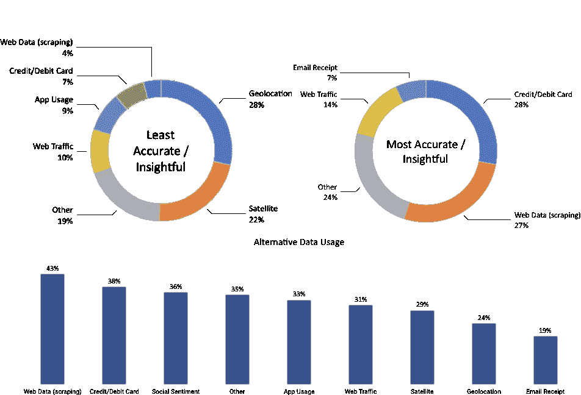

# 三、金融的替代数据

在互联网和移动网络爆炸式增长的推动下，随着处理、存储和分析新数据源技术的进步，数字数据继续呈指数级增长。反过来，管理更加多样化的数字数据的可用性和能力的指数级增长，一直是推动包括投资行业在内的各行业创新的**机器学习** ( **ML** )的显著性能改善背后的关键力量。

数据革命的规模非同寻常:仅过去两年就见证了当今世界所有数据的 90%的创建，到 2020 年，预计全球 77 亿人口中的每一个人每天每秒都会产生 1.7 MB 的新信息。另一方面，在 2012 年，只有 0.5%的数据被分析和使用，而到 2020 年，33%的数据被认为有价值。数据可用性和使用之间的差距可能会迅速缩小，因为到 2020 年，全球对分析的投资将超过 2，100 亿美元，而价值创造潜力则高出数倍。

本章解释了个人、业务流程和传感器如何产生替代数据。它还提供了一个框架来导航和评估用于投资目的的替代数据的激增供应。它演示了使用 Python 对通过 web 抓取获得的数据进行从获取到预处理和存储的工作流程，从而为 ML 的应用奠定了基础。最后，它提供了源代码、提供者和应用程序的例子。

本章将涵盖以下主题:

*   另类数据革命如何释放新的信息来源
*   个人、业务流程和传感器如何生成替代数据
*   如何评价用于算法交易的替代数据的激增
*   如何使用 Python 中的替代数据，例如通过搜索互联网
*   替代数据的重要类别和提供者

# 另类数据革命

由数字化、网络化和存储成本直线下降所驱动的数据洪流导致了可用于预测分析的信息性质发生了深刻的质的变化，通常被总结为五个 Vs:

*   **数据量**:随着在线和离线活动、交易、记录和其他来源的副产品以及数据量随着分析和存储能力的不断增长，生成、收集和存储的数据量大幅增加。
*   **速度**:数据以接近或实时的速度生成、传输和处理。
*   **多样性**:数据不再局限于结构化的表格形式，如 CSV 文件或关系数据库表。相反，新的来源产生半结构化格式，如 JSON 或 HTML，以及非结构化内容，包括原始文本、图像和音频或视频数据，这为呈现适合 ML 算法的数据增加了新的挑战。
*   **准确性**:来源和格式的多样性使得验证数据信息内容的可靠性变得更加困难。
*   **Value** :确定新数据集的价值可能比以前更加耗时耗力，也更加不确定。

对于算法交易来说，如果新的数据源提供了从传统来源得不到的信息，或者提供了更快的访问，那么新的数据源就提供了信息优势。随着全球趋势的发展，投资行业正迅速从市场和基本面数据扩展到其他来源，通过信息优势获取阿尔法。预计到 2020 年，数据、技术能力和相关人才的年度支出将从目前的 30 亿美元每年增长 12.8%。

如今，投资者可以实时访问宏观或特定公司的数据，而这在历史上只能以低得多的频率获得。新数据源的用例包括:

*   一组有代表性的商品和服务的网上价格数据可以用来衡量通货膨胀
*   商店访问或购买的数量允许实时估计公司或行业特定的销售或经济活动
*   在其他地方获得这些信息之前，卫星图像可以揭示农业产量，或者矿井或石油钻塔的活动

随着大数据集的标准化和采用的提升，传统数据中包含的信息可能会失去大部分预测价值。

此外，处理和集成不同数据集并应用 ML 的能力允许复杂的洞察力。在过去，定量方法依赖于简单的启发式方法，使用历史数据对公司进行排名，如市净率等指标，而 ML 算法则综合新的指标，并根据不断变化的市场数据学习和调整这些规则。这些见解创造了捕捉价值、动力、质量或情绪等经典投资主题的新机会:

*   **动量** : ML 可以识别市场价格变动、行业情绪或经济因素对资产的影响
*   **价值**:算法可以分析财务报表之外的大量经济和特定行业的结构化和非结构化数据，以预测公司的内在价值
*   **质量**:集成数据的复杂分析允许评估客户或员工评论、电子商务或应用流量，以确定市场份额的增加或其他潜在的收益质量驱动因素

然而，在实践中，有用的数据通常不是免费提供的，替代数据集需要彻底的评估、昂贵的获取、仔细的管理和复杂的分析来提取可交易的信号。

# 替代数据的来源

替代数据集由许多来源生成，但可以在较高层次上分类为主要由以下来源生成:

*   **在社交媒体上发帖、评论产品或使用搜索引擎的个人**

*   记录商业交易，特别是信用卡支付，或作为中介捕捉供应链活动的企业

*   传感器通过卫星或安全摄像头等图像，或手机信号塔等移动模式，捕捉经济活动

随着新数据源的出现，替代数据的性质继续快速发展，而以前标记为替代的数据源成为主流的一部分。例如，**波罗的海干散货指数** ( **BDI** )汇集了数百家航运公司的数据，以估算干散货船的供需，现在可以在彭博终端上获得。

替代数据包括原始数据以及经过聚合或以某种形式处理以增加价值的数据。例如，一些提供商旨在提取可交易的信号，如情绪得分。我们将在第 4 章、*阿尔法因子研究*中讨论各种类型的提供者。

替代数据源在决定其价值或算法交易策略的信号内容的关键方面有所不同。我们将在下一节*评估备选数据集*中讨论这些方面。

# 个人

个人通过在线活动和离线活动自动创建电子数据，因为离线活动是以电子方式捕获的，并且经常与在线身份联系在一起。个人生成的数据通常是非结构化的文本、图像或视频格式，通过多种平台传播，包括:

*   社交媒体帖子，如 Twitter、脸书或 LinkedIn 等通用网站或 Glassdoor 或 Yelp 等商业评论网站上的意见或反应
*   反映对亚马逊或 Wayfair 等网站上的产品的兴趣或看法的电子商务活动
*   使用 Google 或 Bing 等平台的搜索引擎活动
*   移动应用使用、下载和评论
*   个人数据，如消息流量

社交媒体情绪的分析已经变得非常流行，因为它可以应用于个股、行业篮子或市场指数。最常见的来源是 Twitter，其次是各种新闻供应商和博客网站。供应是有竞争力的，价格更低，因为它往往是通过日益商品化的网络抓取获得的。考虑到消费者最近才大规模采用这些工具，包括博客、推文或视频在内的可靠社交媒体数据集通常只有不到五年的历史。相比之下，搜索历史是从 2004 年开始的。

# 业务流程

企业和公共实体产生并收集许多有价值的替代数据来源。业务流程产生的数据通常比个人产生的数据更具结构性。这是一个非常有效的活动领先指标，否则可以在一个低得多的频率。

业务流程生成的数据包括:

*   由处理器和金融机构提供的支付卡交易数据
*   普通数字化活动或记录保存产生的公司耗尽数据，如银行记录、收银员扫描仪数据或供应链订单
*   交易流量和市场微观结构数据(如 L-2 和 L-3 订单簿数据，在[第二章](02.html)、*市场和基础数据*中说明)
*   由信用评级机构或金融机构监控的公司付款，以评估流动性和信誉

信用卡交易和公司尾气数据，如销售点数据，是最可靠和最具预测性的数据集。信用卡数据已有大约 10 年的历史，在不同的滞后期，几乎是实时的，而企业收益报告的季度滞后期为 2.5 周。公司废气数据的时间范围和报告延迟因来源不同而有很大差异。市场微观结构数据集有超过 15 年的历史，而卖方流量数据通常只有不到 5 年的一致历史。

# 传感器

在智能手机普及和卫星技术成本降低的推动下，广泛设备中嵌入的网络传感器生成的数据是增长最快的数据源之一。

这类替代数据通常是非结构化的，其数据量通常比个人或业务流程生成的数据量大得多，处理难度也高得多。此类别中的主要替代数据源包括:

*   监视经济活动的卫星成像，如建筑、航运或商品供应
*   地理定位数据，用于跟踪零售店的交通状况，如使用自愿提供的智能手机数据，或运输路线上的交通状况，如船只或卡车
*   放置在感兴趣位置的摄像机
*   天气和污染传感器

**物联网** ( **物联网**)将通过将联网微处理器嵌入家用电器、公共场所和工业生产过程等个人和商业电子设备，进一步加速这种类型的替代数据的大规模收集。

基于传感器的替代数据包含卫星图像、移动应用使用或手机定位跟踪，通常有三到四年的历史。

# 卫星

发射地理空间成像卫星所需的资源和时间大幅减少；将一颗小型卫星作为次要有效载荷送入近地轨道的成本已经下降到 10 万美元左右，而不是数千万美元和数年的准备。因此，公司可以使用整个卫星舰队获得特定位置的更高频率覆盖(目前大约每天一次)。

使用案例包括监控可通过空中覆盖捕捉的经济和商业活动，如农业和矿产生产和运输、房地产或船舶建设、工业事故(如火灾或汽车)以及感兴趣地点的步行交通。相关的传感器数据是由无人机提供的，这些无人机在农业中使用红外线来监控作物。

在 ML 模型中可靠地使用卫星图像数据之前，可能需要解决几个挑战。这些包括考虑天气条件，特别是假期前后的云层和季节影响，以及可能影响预测信号质量的特定位置的不规则覆盖。

# 地理位置数据

地理定位数据是传感器生成的另一种快速增长的替代数据。一个常见的来源是智能手机，人们可以通过应用程序或 GPS、CDMA 或 WiFi 等无线信号自愿分享他们的地理位置，测量商店、餐馆或活动场地等名胜周围的人流量。

此外，越来越多的机场、购物中心和零售店安装了跟踪顾客数量和活动的传感器。虽然部署这些传感器的最初动机通常是为了测量营销活动的影响，但由此产生的数据也可以用于估计客流量或销售额。捕捉地理位置的传感器包括 3D 立体视频和热成像，这降低了隐私问题，但对移动物体也很有效。还有贴在天花板上的传感器和压力感应垫。一些提供商结合使用多种传感器，包括视觉、音频和手机定位，以全面了解购物者的旅程，其中不仅包括访问次数和持续时间，还包括重复访问的转换和测量。

# 评估备选数据集

替代数据的最终目的是在寻找产生 alpha(即正的、不相关的投资回报)的交易信号的竞争中提供信息优势。在实践中，从备选数据集提取的信号可以单独使用，或者与其他信号结合作为定量策略的一部分。如果基于单个数据集的策略生成的夏普比率足够高，则独立使用是可行的，但在实践中很少见(有关信号测量和评估的详细信息，参见[第 4 章](04.html)、*阿尔法因子研究*)。

量化公司正在建立阿尔法因子库，这些因子单独来看可能是微弱的信号，但结合起来可以产生诱人的回报。正如[第一章](01.html)、*交易的机器学习*中所强调的，投资因素应该基于基本面和经济学原理，否则，它们更有可能是对历史数据过度拟合的结果，而不是坚持并在新数据上产生阿尔法。

由于竞争导致的信号衰减是一个严重的问题，随着替代数据生态系统的发展，许多数据集不太可能保留有意义的夏普比率信号。延长替代数据集信号内容半衰期的有效策略包括排他性协议或关注对处理构成挑战的数据集，以提高进入壁垒。

# 评定标准

可以基于其信号内容的质量、数据的定性方面和各种技术方面来评估替代数据集。

# 信号内容的质量

信号内容可以根据目标资产类别、投资风格、与传统风险溢价的关系以及最重要的 alpha 内容进行评估。

# 资产类别

大多数替代数据集包含与股票和商品直接相关的信息。自 Zillow 在 2006 年成功开创价格估算以来，针对房地产投资的有趣数据集也成倍增加。

随着监控企业支付(包括小型企业支付)的替代来源的开发，企业信用的替代数据正在增加。有关固定收益和利率预测的数据是最近才出现的现象，但随着越来越多的产品销售和价格信息被大规模收集，这种现象将继续增加。

# 投资风格

大多数数据集专注于特定的行业和股票，因此自然会吸引多空股票投资者。随着替代数据收集的规模和范围不断扩大，替代数据也可能与宏观主题的投资者相关，如消费信贷、新兴市场的活动和商品趋势。

一些替代数据集可以用作传统市场风险衡量指标的代理，而其他信号则更适合在短期内使用定量策略的高频交易者。

# 风险酬金

一些替代数据集，如信用卡支付或社交媒体情绪，已被证明可以产生与股票市场传统风险溢价(如价值、动量和波动质量)相关性较低(低于 5%)的信号。因此，将来自这种替代数据的信号与基于传统风险因素的算法交易策略相结合，可以成为更加多样化的风险溢价组合的重要组成部分。

# 阿尔法含量和质量

证明投资替代数据集的合理性所需的信号强度自然取决于其成本，而替代数据的价格差异很大。可以花几千美元或更少的钱获得对社会情绪进行评分的数据，而全面和及时的信用卡支付数据集的成本每年可能高达几百万美元。

我们将详细探讨如何使用历史数据评估由替代数据驱动的交易策略，即所谓的**回溯测试**，以估计数据集中包含的 alpha 值。在个别情况下，一个数据集可能包含足够的阿尔法信号来驱动一个独立的策略，但更典型的是各种替代和其他数据源的组合使用。在这些情况下，数据集允许提取产生小的正夏普比率的弱信号，这些信号本身不会获得资本分配，但当与类似的其他信号整合时，可以提供投资组合级别的策略。然而，这并不能保证，因为还有许多不包含任何 alpha 内容的备选数据集。

除了评估数据集的 alpha 内容之外，评估信号在多大程度上是增量的或正交的也很重要，即对于数据集是唯一的，或者已经被其他数据捕获，在后一种情况下，比较这种类型信号的成本。

最后，有必要评估依赖于给定的策略的潜在能力，即在不破坏其成功的情况下可以分配的资本量，因为能力限制将使收回数据成本更加困难。

# 数据质量

数据集的质量是另一个重要的标准，因为它影响分析和货币化数据集所需的工作，以及数据集包含的预测信号的可靠性。质量方面包括数据频率及其可用历史的长度、其包含的信息的可靠性或准确性、其符合当前或潜在未来法规的程度以及其使用的排他性。

# 法律和声誉风险

使用替代数据集可能会带来法律或声誉风险，尤其是当它们包含以下项目时:

*   **重大非公开信息** ( **MNPI** )，因为它暗示违反内幕交易法规
*   **个人身份信息** ( **PII** )，主要是因为欧盟颁布了**通用数据保护条例** ( **GDPR** )

因此，法律和合规要求需要彻底审查。当数据提供者也是基于数据集积极交易的市场参与者时，也可能存在利益冲突。

# 排他性

一个替代数据集包含一个信号的可能性与其可用性和处理的容易程度成反比，该信号具有足够的预测性，可以在独立的基础上以高夏普比率驱动一个有意义的时期的策略。换句话说，数据越独家，越难处理，具有 alpha 内容的数据集就越有可能在不遭受快速信号衰减的情况下驱动策略。

提供标准财务比率的公开基本面数据几乎不含 alpha 值，对独立策略没有吸引力，但可能有助于分散风险因素组合。大型、复杂的数据集需要更多时间才能被市场吸收，新的数据集也在不断涌现。因此，有必要评估其他投资者对数据集的熟悉程度，以及提供商是否是这类信息的最佳来源。

当一个企业刚刚开始出售它为其他目的生成的废气数据时，排他性或成为新数据集的早期采用者的额外好处可能会出现，因为它可能会影响数据的收集或管理方式，或者谈判限制竞争对手至少在特定时间段内访问的条件。

# 时间范围

为了测试数据集在不同场景下的预测能力，更广泛的历史记录是非常可取的。可用性在几个月到几十年之间变化很大，并对基于数据建立和测试的交易策略的范围有重要影响。在介绍主要的数据源类型时，我们提到了不同数据集的时间范围。

# 频率

数据的频率决定了新信息变得可用的频率以及预测信号在给定时间段内的区分程度。它还影响投资策略的时间范围，范围从一天内，到每天，每周，甚至更低的频率。

# 可靠性

自然，数据在多大程度上准确地反映了它打算测量的内容，或者这一点在多大程度上可以得到验证，是一个非常重要的问题，应该通过彻底的审计来验证。这适用于原始数据和经过处理的数据，其中需要分析用于提取或汇总信息的方法，并考虑拟议采购的成本效益比。

# 技术方面

技术方面涉及报告的等待时间或延迟，以及提供数据的格式。

# 潜伏

数据提供商通常批量提供资源，数据收集方式、后续处理和传输以及监管或法律约束都可能导致延迟。

# 格式

根据来源的不同，数据可以以多种格式提供。处理后的数据将采用用户友好的格式，并通过强大的 API 轻松集成到现有系统或查询中。另一方面是海量数据源，如视频、音频、图像数据或专有格式，这需要更多技能来准备分析，但也为潜在竞争对手提供了更高的准入门槛。

# 替代数据市场

投资行业预计在 2018 年将在数据服务上花费 20 亿至 30 亿美元，预计这一数字将与其他行业一样以每年两位数的速度增长。这项支出包括替代数据的获取、相关技术的投资以及合格人才的聘用。

安永(Ernst and Young)的一项调查显示，2017 年替代数据的采用率很高；例如，43%的基金在使用抓取的网络数据，几乎 30%的基金在试验卫星数据。根据迄今为止的经验，基金经理认为抓取的网络数据和信用卡数据最有洞察力，相比之下，约 25%的人认为地理定位和卫星数据信息量较少:



替代数据提供商的市场相当分散，这反映了这一新兴行业的快速增长。摩根大通列出了 500 多家专业数据公司，而 AlternativeData.org 列出了 300 多家。提供商扮演许多角色，包括中介，如顾问、聚合者和技术解决方案；卖方支持以各种格式交付数据，从原始数据到半处理数据或从一个或多个源提取的某种形式的信号。

我们将强调主要类别的规模，并概述几个突出的例子来说明它们的多样性。

# 数据提供者和用例

[AlternativeData.org](https://alternativedata.org/)(由提供商 Yipit 支持)列出了几个类别，可以作为各种数据提供商细分市场活动的粗略代表。到目前为止，社交情感分析是最大的类别，而卫星和地理定位数据近年来一直在快速增长:

| **产品类别** | **供应商数量** | **目标** |
| 社会情绪 | Forty-eight | 原始或经处理的社交媒体数据；短期趋势 |
| 卫星 | Twenty-six | 中期经济活动的空中监测 |
| 地理定位 | Twenty-two | 跟踪零售、商业地产或活动客流量 |
| Web 数据和流量 | Twenty-two | 监控搜索兴趣、品牌知名度和事件 |
| 信用卡和借记卡的使用 | Fourteen | 跟踪近期消费者支出和企业收入 |
| 应用程序使用 | seven | 监控应用销售或收集二手数据 |
| 电子邮件和消费者收据 | six | 按连锁、品牌、部门或地理位置跟踪消费者支出 |
| 天气 | four | 作物和商品相关的长期趋势 |
| 其他的 | Eighty-seven |  |

以下简短的示例旨在说明服务提供商的广泛范围和潜在的使用案例。

# 社会情绪数据

社交情感分析与 Twitter 数据联系最为紧密。Gnip 是早期的社交媒体聚合器，使用 API 提供来自众多网站的数据，并于 2014 年被 Twitter 以 1.34 亿美元收购。搜索引擎是另一个变得突出的来源，当研究人员在《自然》杂志上发表文章称，基于谷歌趋势的债务等术语的投资策略可以用于长期盈利的交易策略时(参见 GitHub repo[https://GitHub . com/packt publishing/Hands-On-Machine-Learning-for-Algorithmic-Trading](https://github.com/PacktPublishing/Hands-On-Machine-Learning-for-Algorithmic-Trading)以获取参考资料)。

# 数据挖掘

Dataminr 成立于 2009 年，根据与 Twitter 的独家协议提供社会情绪和新闻分析。该公司是较大的替代供应商之一，并在 2018 年 6 月以 16 亿美元的估值额外筹集了 3.92 亿美元的资金，总融资额达到 5690 亿美元。它强调使用机器学习从社交媒体馈送中提取的实时信号，并为广泛的客户服务，不仅包括买方和卖方投资公司，还包括新闻机构和公共部门。

# 斯托克斯维茨

StockTwits 是一个社交网络和微博平台，数十万投资专业人士以 StockTwits 的形式分享信息和交易想法，这些信息和想法被金融网站和社交媒体平台上的大量受众观看。这些数据可以被利用，因为它可能反映投资者情绪，或者本身推动交易，进而影响价格。GitHub 上的参考资料包含了一篇论文的链接，这篇论文针对选定的特性构建了一个交易策略。

# 渡鸦队

RavenPack 分析大量不同的、非结构化的、基于文本的数据，以产生结构化的指标，包括情绪得分，旨在包含与投资者相关的信息。底层数据源包括从高级新闻专线和监管信息到新闻稿和超过 19，000 种网络出版物。摩根大通根据情绪得分测试了多空主权债券和股票策略，并取得了与传统风险溢价相关性较低的积极结果(见参考文献)。

# 卫星数据

RS Metrics 成立于 2010 年，对来自卫星、无人机和飞机的地理空间数据进行三角测量，重点是金属和商品，以及房地产和工业应用。该公司基于自己的高分辨率卫星提供信号、预测分析、警报和最终用户应用。使用案例包括针对特定连锁店或商业房地产的零售流量估计，以及特定常见金属的生产和储存或相关生产地点的就业。

# 地理位置数据

Advan 成立于 2015 年，为对冲基金客户提供来自移动电话流量数据的信号，目标是美国和欧盟各个行业的 1600 家 tickers。该公司使用应用程序收集数据，这些应用程序在用户明确同意的情况下在智能手机上安装地理位置代码，并使用多种渠道(如 WiFi、蓝牙和蜂窝信号)跟踪位置，以提高准确性。用例包括对实体店位置的客户流量的估计，这反过来可以用作预测上市公司收入的模型的输入。

# 电子邮件收据数据

除其他服务外，Eagle Alpha 还提供大量使用电子邮件收据的在线交易数据，涵盖 5000 多家零售商，包括按 53 个产品组分类的商品和 SKU 级别的交易数据。摩根大通(J.P. Morgan)分析了一个始于 2013 年的时间序列数据集，该数据集涵盖了在整个样本期内活跃的一组固定用户。该数据集包含总支出、订单数量和每个周期的独立买家数量。

# 使用替代数据

我们将说明使用 web 抓取获取替代数据，首先针对 OpenTable 餐馆数据，然后转向 Seeking Alpha 主持的收益电话会议记录。

# 抓取 OpenTable 数据

替代数据的典型来源是评论网站，如 Glassdoor 或 Yelp，它们使用员工评论或客人评论来传达内部见解。这些数据为旨在预测企业前景或直接预测其市场价值以获得交易信号的 ML 模型提供了有价值的输入。

数据需要从 HTML 源中提取，排除任何法律障碍。为了说明 Python 提供的 web 抓取工具，我们将从 OpenTable 中检索餐馆预订信息。这种性质的数据可以用来根据地理位置、房地产价格或连锁餐厅的收入来预测经济活动。

# 使用请求和 BeautifulSoup 从 HTML 中提取数据

在本节中，我们将请求并解析 HTML 源代码。我们将使用`requests`库发出**超文本传输协议** ( **HTTP** )请求并检索 HTML 源代码，使用`BeautifulSoup`解析并提取文本内容。

然而，我们会遇到一个常见的障碍:网站可能只有在使用 JavaScript 进行初始页面加载后才会向服务器请求某些信息。因此，直接 HTTP 请求将不会成功。为了避开这种类型的保护，我们将使用无头浏览器来检索网站内容，就像浏览器会:

```py
from bs4 import BeautifulSoup
import requests

# set and request url; extract source code
url = "https://www.opentable.com/new-york-restaurant-listings"
html = requests.get(url)
html.text[:500]

' <!DOCTYPE html><html lang="en"><head><meta charset="utf-8"/><meta http-equiv="X-UA-Compatible" content="IE=9; IE=8; IE=7; IE=EDGE"/> <title>Restaurant Reservation Availability</title> <meta name="robots" content="noindex" > </meta> <link rel="shortcut icon" href="//components.otstatic.com/components/favicon/1.0.4/favicon/favicon.ico" type="img/x-icon"/><link rel="icon" href="//components.otstatic.com/components/favicon/1.0.4/favicon/favicon-16.png" sizes="16x16"/><link rel='
```

现在我们可以使用`BeautifulSoup`来解析 HTML 内容，然后寻找所有的`span`标签，这些标签带有与我们通过检查源代码获得的餐馆名称相关联的类`rest-row-name-text`(参见 GitHub repo 以获得检查网站源代码的链接说明):

```py
# parse raw html => soup object
soup = BeautifulSoup(html.text, 'html.parser')

# for each span tag, print out text => restaurant name
for entry in soup.find_all(name='span', attrs={'class':'rest-row-name-
text'}):
    print(entry.text)

Wade Coves
Alley
Dolorem Maggio
Islands
...
```

一旦您确定了感兴趣的页面元素，`BeautifulSoup`就可以很容易地检索包含的文本。如果您想获得每个餐馆的价格类别，您可以使用:

```py
# get the number of dollars signs for each restaurant
for entry in soup.find_all('div', {'class':'rest-row-pricing'}):
    price = entry.find('i').text
```

然而，当您试图获取预订数量时，您得到的只是一个空列表，因为网站在初始加载完成后使用 JavaScript 代码来请求这些信息:

```py
soup.find_all('div', {'class':'booking'})
[]
```

# Selenium 简介——使用浏览器自动化

我们将使用浏览器自动化工具 Selenium 来操作一个无头 FireFox 浏览器，它将为我们解析 HTML 内容。

以下代码打开 FireFox 浏览器:

```py
from selenium import webdriver

# create a driver called Firefox
driver = webdriver.Firefox()
```

让我们关闭浏览器:

```py
# close it
driver.close()
```

要使用 selenium 和 Firefox 检索 HTML 源代码，请执行以下操作:

```py
import time, re

# visit the opentable listing page
driver = webdriver.Firefox()
driver.get(url)

time.sleep(1) # wait 1 second

# retrieve the html source
html = driver.page_source
html = BeautifulSoup(html, "lxml")

for booking in html.find_all('div', {'class': 'booking'}):
    match = re.search(r'\d+', booking.text)
    if match:
        print(match.group())
```

# 构建餐馆预订的数据集

现在，您只需将网站上所有有趣的元素结合起来，创建一个可以在模型中使用的功能，以预测地理区域的经济活动或特定社区的客流量。

使用 Selenium，您可以通过链接进入下一页，并快速构建纽约市超过 10，000 家餐馆的数据集，然后您可以定期更新该数据集以跟踪时间序列。首先，我们设置一个函数来解析我们计划爬行的页面的内容:

```py
def parse_html(html):
    data, item = pd.DataFrame(), {}
    soup = BeautifulSoup(html, 'lxml')
    for i, resto in enumerate(soup.find_all('div', class_='rest-row-
           info')):
        item['name'] = resto.find('span', class_='rest-row-name-
                                   text').text

        booking = resto.find('div', class_='booking')
        item['bookings'] = re.search('\d+', booking.text).group() if 
                                       booking else 'NA'

        rating = resto.select('div.all-stars.filled')
        item['rating'] = int(re.search('\d+', 
                rating[0].get('style')).group()) if rating else 'NA'

        reviews = resto.find('span', class_='star-rating-text--review-
                              text')
        item['reviews'] = int(re.search('\d+', reviews.text).group()) if reviews else 'NA'

        item['price'] = int(resto.find('div', class_='rest-row-
                            pricing').find('i').text.count('$'))
        item['cuisine'] = resto.find('span', class_='rest-row-meta--
                                      cuisine').text
        item['location'] = resto.find('span', class_='rest-row-meta--
                                       location').text
        data[i] = pd.Series(item)
    return data.T
```

然后，我们启动一个无头浏览器，它继续为我们点击下一步按钮，并捕获每页上显示的结果:

```py
restaurants = pd.DataFrame()
driver = webdriver.Firefox()
url = "https://www.opentable.com/new-york-restaurant-listings"
driver.get(url)
while True:
    sleep(1)
    new_data = parse_html(driver.page_source)
    if new_data.empty:
        break
    restaurants = pd.concat([restaurants, new_data], ignore_index=True)
    print(len(restaurants))
    driver.find_element_by_link_text('Next').click()
driver.close()
```

网站不断变化，因此此代码可能会在某个时候停止工作，并需要更新以遵循最新的站点导航和 bot 检测。

# 更进一步——刮擦和飞溅

Scrapy 是一个强大的库，用于构建跟踪链接、检索内容和以结构化方式存储解析结果的机器人。结合无头浏览器 splash，它还可以解释 JavaScript，成为 Selenium 的高效替代品。您可以使用`01_opentable`目录中的`scrapy crawl opentable`命令运行蜘蛛程序，结果记录到`spider.log`:

```py
from opentable.items import OpentableItem
from scrapy import Spider
from scrapy_splash import SplashRequest

class OpenTableSpider(Spider):
    name = 'opentable'
    start_urls = ['https://www.opentable.com/new-york-restaurant-
                   listings']

    def start_requests(self):
        for url in self.start_urls:
            yield SplashRequest(url=url,
                                callback=self.parse,
                                endpoint='render.html',
                                args={'wait': 1},
                                )

    def parse(self, response):
        item = OpentableItem()
        for resto in response.css('div.rest-row-info'):
            item['name'] = resto.css('span.rest-row-name-
                                      text::text').extract()
            item['bookings'] = 
                  resto.css('div.booking::text').re(r'\d+')
            item['rating'] = resto.css('div.all-
                  stars::attr(style)').re_first('\d+')
            item['reviews'] = resto.css('span.star-rating-text--review-
                                         text::text').re_first(r'\d+')
            item['price'] = len(resto.css('div.rest-row-pricing > 
                                i::text').re('\$'))
            item['cuisine'] = resto.css('span.rest-row-meta--
                                         cuisine::text').extract()
            item['location'] = resto.css('span.rest-row-meta--
                               location::text').extract()
            yield item
```

除了单个餐馆或连锁店的评论和预订，还有许多方法可以从这些数据中提取信息。

例如，我们可以进一步收集和地理编码餐馆的地址，以将餐馆的物理位置与其他感兴趣的区域(如受欢迎的零售点或社区)联系起来，从而深入了解经济活动的特定方面。如前所述，这些数据与其他信息结合起来将是最有价值的。

# 收益电话会议记录

文本数据是一种重要的替代数据源。文本信息的一个例子是收益电话会议的记录，其中主管不仅展示最新的财务结果，还回答财务分析师的问题。投资者利用文字记录来评估情绪的变化、对特定话题的强调或交流方式。

我们将举例说明从流行的交易网站[www.seekingalpha.com](http://seekingalpha.com/)收集和解析收益电话会议记录:

```py
import re
from pathlib import Path
from time import sleep
from urllib.parse import urljoin
from bs4 import BeautifulSoup
from furl import furl
from selenium import webdriver

transcript_path = Path('transcripts')

SA_URL = 'https://seekingalpha.com/'
TRANSCRIPT = re.compile('Earnings Call Transcript')

next_page = True
page = 1
driver = webdriver.Firefox()
while next_page:
    url = f'{SA_URL}/earnings/earnings-call-transcripts/{page}'
    driver.get(urljoin(SA_URL, url))
    response = driver.page_source
    page += 1
    soup = BeautifulSoup(response, 'lxml')
    links = soup.find_all(name='a', string=TRANSCRIPT)
    if len(links) == 0:
        next_page = False
    else:
        for link in links:
            transcript_url = link.attrs.get('href')
            article_url = furl(urljoin(SA_URL, 
                           transcript_url)).add({'part': 'single'})
            driver.get(article_url.url)
            html = driver.page_source
            meta, participants, content = parse_html(html)
            meta['link'] = link

driver.close()
```

# 使用正则表达式解析 HTML

为了从非结构化的脚本中收集结构化的数据，除了使用`BeautifulSoup`之外，我们还可以使用正则表达式。

它们让我们不仅可以收集有关收益电话公司和时间的详细信息，还可以捕捉到谁在场，并将报表归属于分析师和公司代表:

```py
def parse_html(html):
    date_pattern = re.compile(r'(\d{2})-(\d{2})-(\d{2})')
    quarter_pattern = re.compile(r'(\bQ\d\b)')
    soup = BeautifulSoup(html, 'lxml')

    meta, participants, content = {}, [], []
    h1 = soup.find('h1', itemprop='headline').text
    meta['company'] = h1[:h1.find('(')].strip()
    meta['symbol'] = h1[h1.find('(') + 1:h1.find(')')]

    title = soup.find('div', class_='title').text
    match = date_pattern.search(title)
    if match:
        m, d, y = match.groups()
        meta['month'] = int(m)
        meta['day'] = int(d)
        meta['year'] = int(y)

    match = quarter_pattern.search(title)
    if match:
        meta['quarter'] = match.group(0)

    qa = 0
    speaker_types = ['Executives', 'Analysts']
    for header in [p.parent for p in soup.find_all('strong')]:
        text = header.text.strip()
        if text.lower().startswith('copyright'):
            continue
        elif text.lower().startswith('question-and'):
            qa = 1
            continue
        elif any([type in text for type in speaker_types]):
            for participant in header.find_next_siblings('p'):
                if participant.find('strong'):
                    break
                else:
                    participants.append([text, participant.text])
        else:
            p = []
            for participant in header.find_next_siblings('p'):
                if participant.find('strong'):
                    break
                else:
                    p.append(participant.text)
            content.append([header.text, qa, '\n'.join(p)])
    return meta, participants, content
```

当我们使用 ML 处理自然语言时，我们将结果存储在几个`.csv`文件中以便于访问:

```py
def store_result(meta, participants, content):
    path = transcript_path / 'parsed' / meta['symbol']
    if not path.exists():
        path.mkdir(parents=True, exist_ok=True)
    pd.DataFrame(content, columns=['speaker', 'q&a', 
              'content']).to_csv(path / 'content.csv', index=False)
    pd.DataFrame(participants, columns=['type', 'name']).to_csv(path / 
                 'participants.csv', index=False)
    pd.Series(meta).to_csv(path / 'earnings.csv'
```

参见 GitHub repo 中的`README`,了解更多详细信息，并参考更多资源来开发 web 抓取应用程序。

# 摘要

在本章中，我们介绍了由于大数据革命而变得可用的替代数据的新来源，包括个人、业务流程和传感器，如卫星或 GPS 定位设备。我们提出了一个从投资角度评估替代数据集的框架，并列出关键类别和提供商，以帮助您导航这个巨大且快速扩展的领域，为使用 ML 的算法交易策略提供关键输入。

我们探索了强大的 Python 工具来大规模收集你自己的数据集，这样你就有可能作为一个算法交易者，使用网络搜集来获得你的私人信息优势。

在下一章，我们将继续设计和评估产生交易信号的阿尔法因子，并看看如何在投资组合中结合它们。