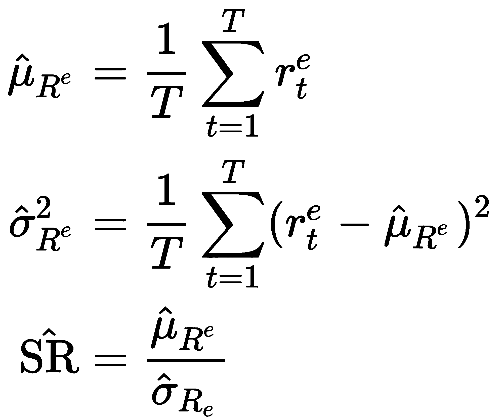
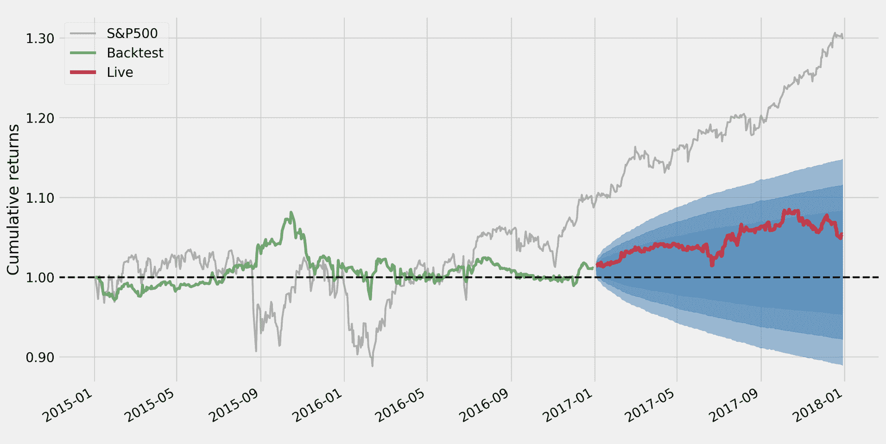
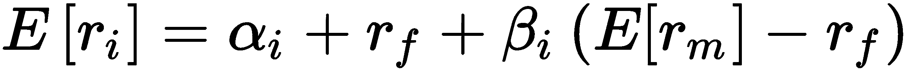
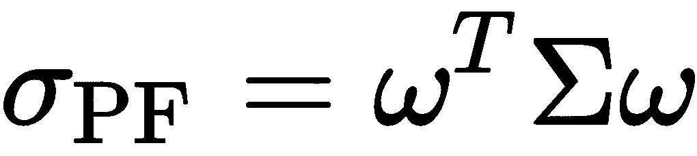
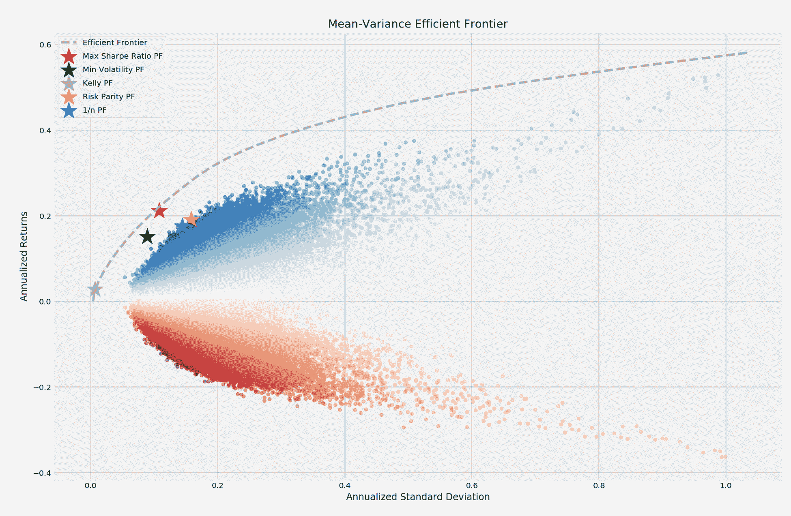
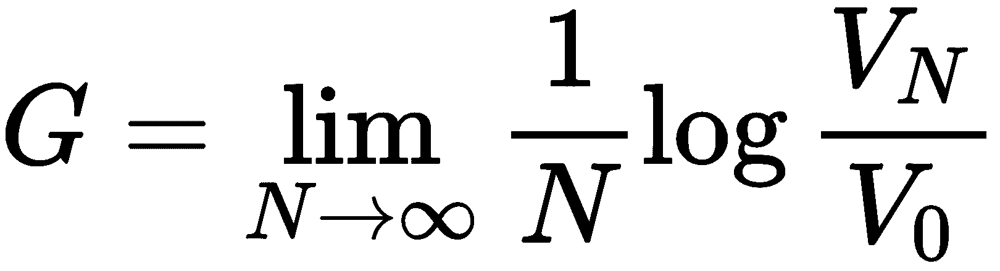
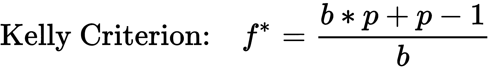

# 五、策略评估

阿尔法因子驱动算法策略，转化为交易，进而产生投资组合。由此产生的投资组合的回报和风险决定了策略的成功。测试策略需要模拟算法生成的投资组合，以验证其在市场条件下的表现。策略评估包括根据历史数据进行回溯测试以优化策略参数，以及根据新的样本外数据进行前向测试以验证样本内性能，并避免因根据特定的过去情况定制策略而导致的错误发现。

在投资组合环境中，正的资产回报可以以非线性方式抵消负的价格变动，因此投资组合回报的总体变化小于投资组合头寸变化的加权平均值，除非它们的回报完全正相关。Harry Markowitz 在 1952 年发展了基于多样化的现代投资组合管理背后的理论，这产生了均值-方差优化:对于给定的一组资产，可以优化投资组合权重以降低风险，风险以给定预期回报水平的回报标准差来衡量。

**资本资产定价模型** ( **资本资产定价模型**)引入了风险溢价，作为持有资产的均衡回报，以补偿单一风险因素——市场——的风险敞口。随着更多风险因素和更精细的暴露选择的出现，风险管理已经变得更加复杂。凯利规则是动态投资组合优化的一种流行方法，它是一段时间内一系列头寸的选择；1968 年，爱德华·索普把它最初在赌博中的应用改编成了股票市场，这是一个著名的例子。

因此，有几种优化投资组合的方法，包括应用**机器学习** ( **ML** )来学习资产之间的层级关系，并将其持有的资产视为投资组合风险状况的补充或替代。

在本章中，我们将讨论以下主题:

*   如何使用`zipline`建立和测试基于阿尔法因子的投资组合
*   如何衡量投资组合的风险和回报
*   如何使用`pyfolio`评估投资组合表现
*   如何使用均值-方差优化和替代方法管理投资组合权重
*   如何使用机器学习来优化投资组合环境中的资产配置

本章的代码示例在 GitHub 库的`05_strategy_evaluation_and_portfolio_management`目录中。

# 如何用 zipline 建立和测试投资组合

在上一章中，我们引入了`zipline`来模拟从跟踪横截面市场、基本面和替代数据中计算阿尔法因子。现在，我们将利用阿尔法因素得出买入和卖出信号。我们将把投资组合权重的优化推迟到本章的后半部分，现在，只需给每种投资分配等值的头寸。这个部分的代码在`01_trading_zipline`子目录中。

# 定期交易和投资组合再平衡

我们将使用上一章开发的自定义`MeanReversion`因子——参见`alpha_factor_zipline_with_trades.py`中的实现。

由`compute_factors()`方法创建的`Pipeline`返回一个表，该表包含一个长列和一个短列，列出了 25 只股票，这些股票上个月的回报率与其年平均回报率的正负偏差最大，并通过标准差进行标准化。它还将范围限制在过去 30 个交易日平均交易量最高的 500 只股票。`before_trading_start()`确保管道的日常执行和结果记录，包括当前价格。

新的`rebalance()`方法将交易订单提交给`exec_trades()`方法，用于由管道以相等的正负权重标记为多头和空头头寸的资产。它还剥离了不再包含在因子信号中的任何当前持股:

```py
def exec_trades(data, assets, target_percent):
    """Place orders for assets using target portfolio percentage"""
    for asset in assets:
        if data.can_trade(asset) and not get_open_orders(asset):
            order_target_percent(asset, target_percent)

def rebalance(context, data):
    """Compute long, short and obsolete holdings; place trade orders"""
    factor_data = context.factor_data
    assets = factor_data.index

    longs = assets[factor_data.longs]
    shorts = assets[factor_data.shorts]
    divest = context.portfolio.positions.keys() - longs.union(shorts)

    exec_trades(data, assets=divest, target_percent=0)
    exec_trades(data, assets=longs, target_percent=1 / N_LONGS)
    exec_trades(data, assets=shorts, target_percent=-1 / N_SHORTS)
```

`rebalance()`方法根据`schedule_function()`实用程序在一周开始时设置的`date_rules`和`time_rules`运行，就在内置`US_EQUITIES`日历规定的`market_open`之后(有关规则的详细信息，请参见文档)。您还可以指定交易佣金的相对值和最低金额。还有一个定义滑点的选项，滑点是交易决策和执行之间价格反向变化的成本:

```py
def initialize(context):
    """Setup: register pipeline, schedule rebalancing,
        and set trading params"""
    attach_pipeline(compute_factors(), 'factor_pipeline')
    schedule_function(rebalance,
                      date_rules.week_start(),
                      time_rules.market_open(),
                      calendar=calendars.US_EQUITIES)

    set_commission(us_equities=commission.PerShare(cost=0.00075, min_trade_cost=.01))
    set_slippage(us_equities=slippage.VolumeShareSlippage(volume_limit=0.0025, price_impact=0.01))
```

算法在调用`run_algorithm()`函数后继续执行，并返回相同的回溯测试性能`DataFrame`。我们现在将转向投资组合回报和风险的常见度量，以及如何使用`pyfolio`库来计算它们。

# 如何用 pyfolio 衡量绩效

ML 是关于优化目标函数的。在算法交易中，目标是整个投资组合的回报和风险，通常相对于基准(可能是现金或无风险利率)。

有几个指标来评估这些目标。我们将简要回顾最常用的指标，以及如何使用`zipline`和 Quantopian 也使用的`pyfolio`库来计算它们。我们还将回顾在测试算法交易策略时，如何在 Quantopian 上应用这些指标。

我们会用一些简单的记法:设 *R* 为一期简单投资组合收益的时间序列， *R=(r <sub>1</sub> ，...，r <sub>T</sub> )* ，从日期 1 到 *T* ，以及*R<sup>f</sup>=(R<sup>f</sup>T15】1，...，R<sup>f</sup><sub>T</sub>**)*为无风险利率的匹配时间序列，这样*R<sup><sub>e</sub></sup>= R-R<sup><sub>f</sub></sup>=(R<sub>1</sub>-R<sup>f</sup><sub>1</sub>，...，r<sub>T</sub>-r<sup>f</sup><sub>T</sub>)*是超额收益。

# 尖锐的比例

事前**夏普比率** ( **SR** )将投资组合的预期超额投资组合与该超额回报的波动性进行比较，以其标准差衡量。它以每单位风险的平均超额回报来衡量报酬:


预期回报和波动性是不可观察的，但可以使用历史数据进行如下估计:



除非无风险利率不稳定(如在新兴市场)，否则超额和原始回报的标准差将是相似的。当 SR 与无风险利率以外的基准一起使用时，例如标准普尔 500，它被称为**I**T2 信息比率。在这种情况下，它衡量投资组合相对于跟踪误差的超额回报，也称为 **alpha** ，跟踪误差是投资组合回报与基准回报的偏差。

对于**独立且同分布的** ( **iid** )收益，根据大样本统计理论，通过将中心极限定理应用于μ̂和σ̂ <sup>2</sup> ，推导出用于统计显著性检验的 SR 估计量的分布。

然而，财务回报经常违反 iid 的假设。Andrew Lo 对平稳但自相关的回报的分布和时间聚合进行了必要的调整。这一点很重要，因为投资策略的时间序列属性(例如，均值回归、动量和其他形式的序列相关性)会对 SR 估计值本身产生不可忽视的影响，特别是当根据较高频率的数据对 SR 进行年度化时(Lo 2002)。

# 主动管理的基本法则

高的**信息比率** ( **IR** )意味着相对于所冒的额外风险而言，表现更有吸引力。主动管理的基本法则将 IR 分解为**信息系数** ( **IC** )作为预测技能的衡量标准，以及通过独立押注应用这一技能的能力。它总结了经常玩(高广度)和玩得好(高 IC)的重要性:


IC 衡量阿尔法因子和其信号产生的远期回报之间的相关性，并捕捉经理预测技能的准确性。策略的广度由投资者在给定时间段内的独立下注次数来衡量，两个值的乘积与 IR 成正比，也称为**评估风险** (Treynor 和 Black)。

该框架已经扩展到包括 **t** **转移系数** ( **TC** )以反映投资组合约束(例如，卖空)，这些约束可能会将信息比率限制在给定 IC 或策略宽度可实现的水平以下。TC 代表经理将洞察力转化为投资组合赌注的效率(Clarke et al. 2002)。

基本定律很重要，因为它强调了卓越表现的关键驱动因素:准确的预测和做出独立预测并根据预测采取行动的能力都很重要。在实践中，拥有广泛投资决策的经理可以获得显著的风险调整超额收益，信息系数在 0.05 到 0.15 之间(如果有空间，可能包括模拟图)。

在实践中，考虑到预测之间的横截面和时间序列相关性，估计一项策略的广度是困难的。

# pyfolio 的样本内和样本外性能

Pyfolio 使用许多标准指标促进了样本内和样本外投资组合绩效和风险的分析。它使用几个内置场景生成涵盖回报、头寸和交易分析以及市场压力期间事件风险的数据单，还包括贝叶斯样本外绩效分析。

它依赖于投资组合回报和头寸数据，也可以考虑交易活动的交易成本和滑点损失。指标是使用`empyrical`库计算的，该库也可以独立使用。

由`zipline`回溯测试引擎产生的性能`DataFrame`可以被转换成必需的`pyfolio`输入。

# 从 alphalens 获取 pyfolio 输入

然而，`pyfolio`也直接与`alphalens`集成，并允许使用`create_pyfolio_input`创建`pyfolio`输入数据:

```py
from alphalens.performance import create_pyfolio_input

qmin, qmax = factor_data.factor_quantile.min(), 
             factor_data.factor_quantile.max()
input_data = create_pyfolio_input(alphalens_data,   
                                  period='1D',
                                  capital=100000,
                                  long_short=False,
                                  equal_weight=False,
                                  quantiles=[1, 5],
                                  benchmark_period='1D')
returns, positions, benchmark = input_data
```

有两个选项可以指定如何生成投资组合权重:

*   `long_short`:如果`False`，权重将对应于因子值除以它们的绝对值，使得负的因子值产生空头。如果`True`，因素价值首先被贬低，因此多头和空头头寸相互抵消，投资组合是市场中性的。
*   `equal_weight`:如果`True`，`long_short`为`True`，资产将被分成大小相等的两组，上/下半部分组成多头/空头头寸。

例如，如果`factor_data`包括每个资产的部门信息，也可以为组创建多空投资组合。

# 从 zipline 回溯测试中获取 pyfolio 输入

使用`extract_rets_pos_txn_from_zipline`可以将`zipline`回溯测试的结果转换成所需的`pyfolio`输入:

```py
returns, positions, transactions = 
         extract_rets_pos_txn_from_zipline(backtest)
```

# 走前测试样本外退货

测试交易策略包括根据历史数据进行回溯测试，以微调阿尔法因子参数，以及根据新的市场数据进行前瞻测试，以验证策略在样本外表现良好，或者参数是否过于贴近特定的历史环境。

Pyfolio 允许指定一个样本外周期来模拟步行测试。当测试一个策略以获得统计上可靠的结果时，有许多方面需要考虑，我们将在这里解决这些问题。

`plot_rolling_returns`函数根据用户定义的基准(我们使用 S & P 500)显示累积的样本内和样本外回报:

```py
from pyfolio.plotting import plot_rolling_returns
plot_rolling_returns(returns=returns,
                     factor_returns=benchmark_rets,
                     live_start_date='2017-01-01',
                     cone_std=(1.0, 1.5, 2.0))
```

该图包括一个圆锥，显示了扩展的置信区间，以指示在给定随机行走假设的情况下，样本外回报何时不太可能出现。这里，在模拟的 2017 年样本外期间，我们的策略在基准测试中表现不佳:



# 性能统计摘要

`pyfolio`提供几个分析函数和图表。`perf_stats`摘要显示了回报和 SR 的年度和累计回报、波动性、偏斜度和峰度。以下附加指标(也可以单独计算)最为重要:

*   **最大下降**:从前一个峰值开始的最高百分比损失
*   **卡尔马尔比率**:相对于最大提款的年度投资组合回报
*   **ω比率**:收益目标的收益与损失的概率加权比率，违约为零
*   **排序比率**:相对于下跌标准差的超额收益
*   **尾巴比率**:右尾巴的大小(收益，第 95 百分位的绝对值)相对于左尾巴的大小(损失，abs。第 5 百分位的值)
*   **每日风险值(VaR)** :与低于每日均值两个标准差的回报相对应的损失
*   **Alpha** :基准收益率无法解释的投资组合收益率
*   **Beta** :暴露于基准

```py
from pyfolio.timeseries import perf_stats
perf_stats(returns=returns, 
           factor_returns=benchmark_rets, 
           positions=positions, 
           transactions=transactions)
```

对于从`MeanReversion`因子得出的模拟多空投资组合，我们获得以下业绩统计数据:

| 公制的 | 全部 | 样品内 | 样本外 | 公制的 | 全部 | 样品内 | 样本外 |
| 岁入 | 1.80% | 0.60% | 4.20% | 斜交 | Zero point three four | Zero point four | Zero point zero nine |
| 累积回报 | 5.40% | 1.10% | 4.20% | 峭度 | Three point seven | Three point three seven | Two point five nine |
| 年度波动性 | 5.80% | 6.30% | 4.60% | 尾部比率 | Zero point nine one | Zero point eight eight | One point zero three |
| 夏普比率 | Zero point three three | Zero point one two | Zero point nine two | 每日风险值 | -0.7% | -0.8% | -0.6% |
| 卡尔马尔比率 | Zero point one seven | Zero point zero six | One point two eight | 总杠杆 | Zero point three eight | Zero point three seven | Zero point four two |
| 稳定性 | Zero point four nine | Zero point zero four | Zero point seven five | 日周转量 | 4.70% | 4.40% | 5.10% |
| 最大压降 | -10.10% | -10.10% | -3.30% | 希腊字母的第一个字母 | Zero point zero one | Zero | Zero point zero four |
| 欧米伽比率 | One point zero six | One point zero two | One point one eight | 贝塔 | Zero point one five | Zero point one six | Zero point zero three |
| Sortino 比率 | Zero point four eight | Zero point one eight | one point three seven |  |  |  |  |

有关组合风险和回报指标的计算和解释的详细信息，请参见附录。

# 提款期和因素暴露

`plot_drawdown_periods(returns)`函数绘制了投资组合的主要提款期，其他几个绘图函数显示了滚动 SR 和滚动因子暴露于市场 beta 或 Fama French 规模、增长和动量因子:

```py
fig, ax = plt.subplots(nrows=2, ncols=2, figsize=(16, 10))
axes = ax.flatten()

plot_drawdown_periods(returns=returns, ax=axes[0])
plot_rolling_beta(returns=returns, factor_returns=benchmark_rets, 
                  ax=axes[1])
plot_drawdown_underwater(returns=returns, ax=axes[2])
plot_rolling_sharpe(returns=returns)
```

该图突出显示了各种样张中包含的可视化子集，说明了 pyfolio 如何让我们深入了解绩效特征以及风险和回报的基本驱动因素:


# 事件风险建模

Pyfolio 还包括各种事件的时间线，您可以使用这些时间线将投资组合的表现与该期间的基准进行比较，例如，在英国退出欧盟投票后的 2015 年秋季抛售期间:

```py
interesting_times = extract_interesting_date_ranges(returns=returns)
interesting_times['Fall2015'].to_frame('pf') \
 .join(benchmark_rets) \
 .add(1).cumprod().sub(1) \
 .plot(lw=2, figsize=(14, 6), title='Post-Brexit Turmoil')
```

结果图如下所示:


# 如何避免回溯测试的陷阱

回溯测试使用历史数据模拟一种算法策略，目标是识别概括新市场条件的模式。除了在不断变化的市场中预测不确定未来的一般挑战之外，许多因素都很可能将样本中的积极表现误认为是真实模式的发现。这些因素包括数据的各个方面、策略模拟的实施以及统计测试及其解释的缺陷。随着更多计算能力、更大数据集和更复杂算法的使用，错误发现的风险成倍增加，这些算法有助于识别噪声中的明显模式。

我们将列出最严重和最常见的方法错误，并参考关于多重测试的文献以了解更多细节。我们还将介绍紧缩的 SR，它说明了在使用同一组财务数据进行分析时，如何调整来自重复试验的指标。

# 数据挑战

由于数据问题对后验效度的挑战包括前瞻偏差、生存偏差和异常值控制。

# 前瞻偏差

当用于开发规则的样本数据包含在数据所指的时间点实际上不可用或不已知的信息时，从过去数据得出的交易规则的测试将产生有偏差的结果。

这种偏差的一个典型来源是未能对报告的财务数据进行常见的事后更正。股票分割或反向分割也会产生前瞻性偏见。在计算收益率时，每股收益数据来自公司财务数据，频率较低，而市场价格至少每天都有。因此，每股收益和价格数据都需要同时进行拆分调整。

解决方案在于仔细分析与进入回溯测试的所有数据相关联的时间戳，以确保只使用时间点数据。高质量的数据提供者，如 Compustat，确保这些标准得到满足。当时间点数据不可用时，需要对报告滞后做出假设。

# 生存偏差

当对只包含当前活跃证券的数据进行回溯测试，而忽略了随着时间的推移而消失的资产(例如，由于破产、退市或收购)时，生存偏差就会出现。不再属于投资领域的证券通常表现不佳，包括这些案例会对回溯测试结果产生正面影响。

当然，解决方案是验证数据集是否包含所有随时间推移可用的证券，而不是仅包含那些在运行测试时仍然可用的证券。

# 异常值控制

分析前的数据准备通常包括异常值的处理，例如，对极值进行 winsorizing 或 clipping。面临的挑战是识别出真正不代表所分析时期的异常值，而不是当时市场环境中不可或缺的极端值。正如厚尾分布所暗示的那样，当极值被更频繁地观察到时，许多市场模型假设正态分布数据。

解决方案包括仔细分析关于极端值发生概率的异常值，并根据这一现实调整策略参数。

# 非代表性时期

如果所使用的时间段没有很好地反映当前环境，缺乏相关的市场机制方面，并且没有包括足够的数据点或捕捉不太可能重复的极端历史事件，则回溯测试不会产生概括到未来时期的代表性结果。

该解决方案包括使用包含重要市场现象的样本期，或生成反映相关市场特征的合成数据(有关实施指南，请参见*资源*部分)。

# 实施问题

与实施历史模拟相关的实际问题包括未能按市值计价，即未能准确反映基础市场价格并说明提款，对交易的可用性、成本或市场影响的不切实际的假设，或信号和交易执行的时间安排。

# 市值计价绩效

这种策略可能在回溯测试过程中表现良好，但随着时间的推移会导致不可接受的损失或波动。

该解决方案包括绘制一段时间内的绩效或计算(滚动)风险指标，如**风险值** ( **风险值**)或排序比率(详见附录)。

# 交易成本

这种策略可能假设需要交易对手的卖空，持有交易时可能影响市场的流动性较低的资产，或低估由于经纪人费用或滑点而产生的成本，即交易决定时的市场价格和随后的执行之间的差异。

该解决方案包括对高流动性领域的限制，以及对交易和滑点成本的现实参数假设(如前面的`zipline`示例所示)。这也防止了包含具有高衰减的不稳定因素信号，并因此防止了更替。

# 交易时机

这种模拟可能会对阿尔法因子信号的评估时间以及由此产生的交易做出不切实际的假设。例如，当下一次交易只能在经常非常不同的开盘价进行时，信号可以在收盘价进行评估。因此，当收盘价被用来评估交易表现时，后验测试会有很大的偏差。

该解决方案包括精心编排信号到达、交易执行和绩效评估的顺序。

# 数据窥探和回测过度拟合

对回测有效性最突出的挑战，包括对公布结果的挑战，与在策略选择过程中由于多次测试而发现的虚假模式有关。在相同数据上测试不同候选项后选择策略可能会使选择有偏差，因为积极的结果更可能是由于性能测量本身的随机性质。换句话说，这种策略对手头的数据进行了过度调整，产生了看似积极的结果。

因此，回测表现不具有信息性，除非报告的试验数量允许评估选择偏倚的风险。在实践或学术研究中很少出现这种情况，这引起了人们对许多已发表观点的有效性的怀疑。

对特定数据集进行过拟合回溯测试的风险不仅来自于直接运行大量测试，还包括基于对可行和不可行的先验知识设计的策略，即其他人对相同数据运行的不同回溯测试的知识。因此，回测过度拟合在实践中是难以避免的。

解决方案包括根据投资或经济理论而不是广泛的数据挖掘工作来选择测试。它还意味着在各种环境和场景中进行测试，可能包括对合成数据的测试。

# 最小回测长度和收缩 SR

马科斯·洛佩斯·德·普拉多([http://www.quantresearch.info/](http://www.quantresearch.info/))发表了大量关于回溯测试的风险，以及如何检测或避免它的文章。这包括一个回测-过度拟合的在线模拟器(【http://datagrid.lbl.gov/backtest/】T2)。

另一个结果包括在给定尝试次数的情况下，投资者应该要求的回测的最小长度的估计，以避免在给定次数的尝试期间选择具有给定样本内 SR 的策略，该策略具有零的预期样本外 SR。这意味着，例如，如果只有两年的每日回溯测试数据可用，则不应尝试超过 7 个策略变化，如果只有五年的每日回溯测试数据可用，则不应尝试超过 45 个策略变化。有关实现的详细信息，请参见参考资料。

De Lopez Prado 和 Bailey (2014)还推导出一个缩小的 SR，以计算 SR 在统计上显著的概率，同时控制多重测试、非正态回报和较短样本长度的通胀效应(参见`deflated_sharpe_ratio.py`的 Python 实现的`03_multiple_testing`子目录和相关公式推导的参考资料)。

# 回溯测试的最佳停止

除了将回溯测试限制在可以在理论基础上证明合理的策略上，而不仅仅是数据挖掘练习，一个重要的问题是何时停止运行额外的测试。

基于最优停止理论对*秘书问题*的解决方案，建议根据以下经验法则来决定:测试 1/e(大约 37%)的合理策略的随机样本，并记录它们的表现。然后，继续测试，直到某个策略优于之前测试过的策略。

这条规则适用于对几个备选方案的测试，目的是尽可能快地选择一个接近最佳的方案，同时将误报的风险降至最低。

# 如何管理投资组合的风险和回报

投资组合管理的目标是在金融工具中建立头寸，以实现与基准相关的预期风险回报权衡。在每个时期，一个经理选择的立场，优化多样化，以降低风险，同时实现目标回报。在不同时期，头寸将重新平衡，以考虑价格变动导致的权重变化，从而实现或维持目标风险状况。

多样化允许我们通过利用价格运动如何相互作用来降低给定预期回报的风险，因为一种资产的收益可以弥补另一种资产的损失。哈里·马科维茨在 1952 年发明了**现代投资组合理论** ( **MPT** )，并提供了通过选择适当的投资组合权重来优化多样化的数学工具。Markowitz 展示了投资组合风险(以投资组合回报的标准差衡量)如何依赖于所有资产的回报及其相对权重之间的协方差。这种关系意味着存在一个有效的投资组合边界，在给定最大投资组合风险水平的情况下，使投资组合收益最大化。

然而，均值-方差前沿对其计算所需的输入估计高度敏感，如预期收益、波动性和相关性。在实践中，约束这些输入以减少抽样误差的均值-方差投资组合表现得更好。这些受约束的特例包括等权重、最小方差和风险均等的投资组合。

资本资产定价模型(CAPM)是一种建立在 MPT 风险收益关系基础上的资产估价模型。它引入了风险溢价的概念，即投资者持有风险资产在市场均衡时可以预期的风险溢价；溢价补偿了资金的时间价值和无法通过多样化消除的总体市场风险(与特定资产的特殊风险相反)。不可分散风险的经济原理是，例如，影响股票回报或债券违约的业务风险的宏观驱动因素。因此，一项资产的预期收益 E[r<sub>I</sub>是无风险利率 r<sub>f</sub>和风险溢价 r<sub>m</sub>之和，风险溢价与该资产在无风险利率上的市场投资组合的预期超额收益敞口成比例:



理论上，市场投资组合包含所有可投资的资产，并且将由所有理性投资者均衡持有。在实践中，广义价值加权指数近似于市场，例如，美国股票投资的标准普尔 500。β <sub>i</sub> 衡量市场投资组合的超额收益敞口。如果 CAPM 有效，截距分量α <sub>i</sub> 应该为零。在现实中，CAPM 的假设经常不被满足，alpha 捕捉到了由于暴露在广阔的市场中而无法解释的回报。

随着时间的推移，研究揭示了风险溢价的非传统来源，如解释一些原始 alpha 的动量或股权价值效应。经济原理，如投资者对新信息反应不足或过度的行为偏差，证明了暴露于这些替代风险因素的风险溢价是合理的。它们演变成了旨在捕捉这些另类贝塔系数的投资风格，这些贝塔系数也可以以专业化指数基金的形式进行交易。在从这些替代风险溢价中分离出贡献后，真正的 alpha 就局限于特殊的资产回报和经理选择风险暴露时间的能力。

在过去的几十年里，EMH 得到了完善，修正了 CAPM 的许多原始缺陷，包括不完善的信息以及与交易、融资和代理相关的成本。很多行为偏差都有同样的效果，有些摩擦被建模为行为偏差。

ML 在基于前面章节讨论的市场、基本面和替代数据源，使用监督和非监督学习技术推导新的 alpha 因子中起着重要作用。机器学习模型的输入包括原始数据和为捕捉信息信号而设计的特征。最大似然模型也用于组合单个预测信号，并提供更高的综合预测能力。

在过去的几十年里，现代投资组合理论和实践有了显著的发展。我们将介绍:

*   均值-方差优化及其缺点
*   替代方案，如最小风险和 1/n 分配
*   风险平价方法
*   风险因素方法

# 均值-方差优化

MPT 求解最优投资组合权重，以最小化给定预期回报的波动性，或最大化给定波动性水平的回报。关键的必要输入是预期资产回报、标准差和协方差矩阵。

# 它是如何工作的

分散投资之所以有效，是因为投资组合回报的方差取决于资产的协方差，并且可以通过包含不完全相关的资产来降低到资产方差的加权平均值以下。特别是，给定投资组合权重的向量ω和协方差矩阵σ，投资组合方差σ <sub>PF</sub> 定义为:



Markowitz 表明，在目标风险下最大化期望投资组合收益的问题具有在目标期望收益水平μ <sub xmlns:epub="http://www.idpf.org/2007/ops">PF 下最小化投资组合风险的等价对偶表示。因此，优化问题变成了:</sub>


# Python 中的有效前沿

我们可以使用`scipy.optimize.minimize`和资产回报的历史估计、标准差和协方差矩阵来计算有效边界。该代码可在本章 repo 的`efficient_frontier`子文件夹中找到，并执行以下步骤序列:

1.  模拟使用狄利克雷分布生成随机权重，并使用历史回报数据计算每个样本投资组合的均值、标准差和 SR:

```py
def simulate_portfolios(mean_ret, cov, rf_rate=rf_rate, short=True):
    alpha = np.full(shape=n_assets, fill_value=.01)
    weights = dirichlet(alpha=alpha, size=NUM_PF)
    weights *= choice([-1, 1], size=weights.shape)

    returns = weights @ mean_ret.values + 1
    returns = returns ** periods_per_year - 1
    std = (weights @ monthly_returns.T).std(1)
    std *= np.sqrt(periods_per_year)
    sharpe = (returns - rf_rate) / std

    return pd.DataFrame({'Annualized Standard Deviation': std,
                         'Annualized Returns': returns,
                         'Sharpe Ratio': sharpe}), weights
```

2.  设置二次优化问题，以求解给定回报的最小标准差或最大 SR。为此，定义测量关键指标的函数:

```py
def portfolio_std(wt, rt=None, cov=None):
    """Annualized PF standard deviation"""
    return np.sqrt(wt @ cov @ wt * periods_per_year)

def portfolio_returns(wt, rt=None, cov=None):
    """Annualized PF returns"""
    return (wt @ rt + 1) ** periods_per_year - 1

def portfolio_performance(wt, rt, cov):
    """Annualized PF returns & standard deviation"""
    r = portfolio_returns(wt, rt=rt)
    sd = portfolio_std(wt, cov=cov)
    return r, sd 
```

3.  定义一个目标函数，该函数表示要优化的`scipy`的`minimize`函数的负 SR，给定权重受约束的约束，[-1，1]，并以绝对值求和为 1:

```py
def neg_sharpe_ratio(weights, mean_ret, cov):
    r, sd = portfolio_performance(weights, mean_ret, cov)
    return -(r - rf_rate) / sd

weight_constraint = {'type': 'eq',
                     'fun': lambda x: np.sum(np.abs(x)) - 1}

def max_sharpe_ratio(mean_ret, cov, short=True):
    return minimize(fun=neg_sharpe_ratio,
                    x0=x0,
                    args=(mean_ret, cov),
                    method='SLSQP',
                    bounds=((-1 if short else 0, 1),) * n_assets,
                    constraints=weight_constraint,
                    options={'tol':1e-10, 'maxiter':1e4})
```

4.  通过迭代一系列目标回报并求解相应的最小方差投资组合来计算有效边界。优化问题和对作为权重函数的投资组合风险和回报的约束可以被公式化如下:

```py
def neg_sharpe_ratio(weights, mean_ret, cov):
    r, sd = pf_performance(weights, mean_ret, cov)
    return -(r - RF_RATE) / sd

def pf_volatility(w, r, c):
    return pf_performance(w, r, c)[1]

def efficient_return(mean_ret, cov, target):
    args = (mean_ret, cov)
    def ret_(weights):
        return pf_ret(weights, mean_ret)

    constraints = [{'type': 'eq', 'fun': lambda x: ret_(x) - 
                     target},
                   {'type': 'eq', 'fun': lambda x: np.sum(x) - 1}]
    bounds = ((0.0, 1.0),) * n_assets
    return minimize(pf_volatility,
                    x0=x0,
                    args=args, method='SLSQP',
                    bounds=bounds,
                    constraints=constraints)
```

5.  该解决方案需要在可接受值的范围内进行迭代，以确定最佳风险回报组合:

```py
def min_vol_target(mean_ret, cov, target, short=True):

    def ret_(wt):
        return portfolio_returns(wt, mean_ret)

    constraints = [{'type': 'eq', 'fun': lambda x: ret_(x) - target},
                     weight_constraint]

    bounds = ((-1 if short else 0, 1),) * n_assets
    return minimize(portfolio_std, x0=x0, args=(mean_ret, cov),
                    method='SLSQP', bounds=bounds,
                    constraints=constraints,
                    options={'tol': 1e-10, 'maxiter': 1e4})

def efficient_frontier(mean_ret, cov, ret_range):
    return [min_vol_target(mean_ret, cov, ret) for ret in ret_range]
```

模拟产生了可行投资组合的子集，有效边界确定了给定历史数据可实现的最优样本内回报风险组合。下图显示了结果，包括最小方差投资组合和使 SR 最大化的投资组合，以及我们在以下部分讨论的替代优化策略产生的几个投资组合。



投资组合优化可以在交易策略的每个评估步骤中运行，以优化头寸。

# 挑战和缺点

前面的均值-方差前沿示例说明了样本内的回顾性优化。在实践中，投资组合优化需要前瞻性的投入。众所周知，预期回报很难准确估计。

协方差矩阵可以更可靠地估计，这就产生了几种可供选择的方法。然而，具有相关资产的协方差矩阵提出了计算挑战，因为优化问题需要对矩阵求逆。高条件数导致数值不稳定，这反过来又引发了 Markovitz 诅咒:要求的多样化越多(相关投资机会)，算法产生的权重就越不可靠。

许多投资者更喜欢使用投资组合优化技术，这种技术的投入要求不那么繁重。我们现在介绍几种旨在解决这些缺点的替代方法，包括基于机器学习的最新方法。

# 均值-方差优化的替代方案

均值-方差优化问题的精确输入带来的挑战导致采用了几种实用的替代方法，这些方法限制了均值、方差或两者，或者省略了更具挑战性的回报估计，例如风险平价方法。

# 1/n 投资组合

简单的投资组合提供了有用的基准，可以衡量产生过度拟合风险的复杂模型的附加值。最简单的策略——权重相等的投资组合——已被证明是表现最好的策略之一。

众所周知，de Miguel、Garlappi 和 Uppal (2009)将各种均值-方差优化器(包括稳健贝叶斯估计器、投资组合约束和投资组合的最优组合)产生的投资组合的样本外表现与简单的 1/N 规则进行了比较。他们发现，1/N 投资组合比每种资产类别头寸产生了更高的夏普比率，原因是估计误差的高成本往往超过了样本外复杂优化的好处。

1/n 投资组合也包含在上面的有效边界图中。

# 最小方差投资组合

另一种选择是**全球最小方差** ( **GMV** )投资组合，它优先考虑风险最小化。它显示在有效边界图中，可以通过使用均值-方差框架最小化投资组合标准差来计算如下:

```py
def min_vol(mean_ret, cov, short=True):
    return minimize(fun=portfolio_std,
                    x0=x0,
                    args=(mean_ret, cov),
                    method='SLSQP',
                    bounds=bounds = ((-1 if short else 0, 1),) * 
                          n_assets,
                          constraints=weight_constraint,
                          options={'tol': 1e-10, 'maxiter': 1e4})
```

相应的`min.`波动性投资组合位于如上所示的有效边界上。

# 全球投资组合优化——布莱克-利特曼方法

Black 和 little man(1992 年)的全球投资组合优化方法将经济模型与统计学习相结合，并因其生成在许多情况下似乎合理的预期回报估计而广受欢迎。

该技术偏离了 CAPM 均衡模型所隐含的市场是均值-方差投资组合的假设，并建立在观察到的市场资本总额可以被认为是市场分配的最优权重的事实上。市场权重反映了市场价格，而市场价格又体现了市场对未来回报的预期。

因此，这种方法可以根据 CAPM 定义的市场足够接近均衡的假设，对不可观察的未来预期回报进行逆向工程，并允许投资者使用收缩估计器根据自己的信念调整这些估计。该模型可以解释为投资组合优化的贝叶斯方法。我们将在[第九章](09.html)、*贝叶斯机器学习*中介绍贝叶斯方法。

# 如何衡量你的赌注——凯利法则

凯利规则在博彩业有着悠久的历史，因为它提供了在赔率变化(但有利)的(无限)赌注序列中的每一个上下注多少的指导，以最大化最终财富。1956 年，Claude Shannon 在贝尔实验室的同事 John Kelly 发表了对信息率的新解释。他对新的智力竞赛节目《6.4 万美元的问题》(the 六万四千美元 Question)中对候选人的投注很感兴趣，在该节目中，西海岸的一名观众利用三个小时的延迟获得了关于获胜者的内幕信息。

凯利将香农的信息理论联系起来，以解决当机会有利，但不确定性仍然存在时，长期资本增长最佳的赌注。他的规则将对数财富最大化为每个游戏成功几率的函数，并包括隐含的破产保护，因为 log(0)是负无穷大，这样凯利赌徒自然会避免失去一切。

# 赌注的最佳大小

Kelly 开始分析二进制输赢结果的游戏。关键变量是:

*   **b** :赔率定义了一个 1 美元赌注的赢金额。赔率= 5/1 意味着如果打赌赢了，就有 5 美元的收益，外加 1 美元资本的回收。
*   概率定义了一个有利结果的可能性。
*   **f** :当前要下注的资金份额。
*   **V** :作为下注结果的资本价值。

凯利规则旨在使无限重复下注的价值增长率最大化:



当 *W* 和 *L* 为胜负数时，则:


我们可以通过相对于 *f* 最大化 *G* 来最大化增长率 *G* ，如下使用`sympy`所示:

```py
from sympy import symbols, solve, log, diff

share, odds, probability = symbols('share odds probability')
Value = probability * log(1 + odds * share) + (1 - probability) * log(1 
        - share)
solve(diff(Value, share), share)

[(odds*probability + probability - 1)/odds]
```

我们得出了下注的最佳资本份额:



# 最佳投资——单一资产

在金融市场环境中，结果和选择都更加复杂，但凯利规则逻辑仍然适用。它因埃德·索普(Ed Thorp)而变得流行，他首先将其应用于赌博并从中获利(在《击败庄家》(Beat the Dealer)中有所描述)，后来他创办了成功的对冲基金 Princeton/Newport Partners。

对于连续的结果，资本增长率由不同回报的概率分布的积分来定义，该概率分布可以在数字上进行优化:


我们可以使用`scipy.optimize`模块求解最优 f <sup>*</sup> 的表达式:

```py
def norm_integral(f, m, st):
    val, er = quad(lambda s: np.log(1+f*s)*norm.pdf(s, m, st), m-3*st, 
                   m+3*st)
    return -val

def norm_dev_integral(f, m, st):
    val, er = quad(lambda s: (s/(1+f*s))*norm.pdf(s, m, st), m-3*st, 
                   m+3*st)
    return val

m = .058
s = .216
# Option 1: minimize the expectation integral
sol = minimize_scalar(norm_integral, args=(
                m, s), bounds=[0., 2.], method='bounded')
print('Optimal Kelly fraction: {:.4f}'.format(sol.x))
```

# 最佳投资–多种资产

我们将以各种股票为例。E. Chan (2008)说明了如何实现凯利规则的多资产应用，其结果相当于均值-方差优化的(潜在杠杆)最大夏普比率投资组合。

计算涉及精度矩阵和返回矩阵的点积，精度矩阵是协方差矩阵的逆矩阵:

```py
mean_returns = monthly_returns.mean()
cov_matrix = monthly_returns.cov()
precision_matrix = pd.DataFrame(inv(cov_matrix), index=stocks, columns=stocks)
kelly_wt = precision_matrix.dot(mean_returns).values
```

凯利投资组合也显示在有效前沿图中(标准化后，绝对权重总和为 1)。许多投资者倾向于降低凯利权重，以减少策略的波动性，半凯利变得特别受欢迎。

# 风险平价

过去 15 年的特点是全球股票市场的两次大危机、持续向上倾斜的收益率曲线和利率的普遍下降，这使得风险平价看起来是一个特别有吸引力的选择。许多机构对风险平价进行了策略配置，以进一步分散投资组合。

风险平价的一个简单实现是根据资产方差的倒数来分配资产，忽略相关性，尤其是回报预测:

```py
var = monthly_returns.var()
risk_parity_weights = var / var.sum()
```

风险平价投资组合也显示在本节开始的有效边界图中。

# 风险因素投资

估算投入的另一个框架是研究驱动资产风险和回报的潜在决定因素或因素。如果我们理解了这些因素是如何影响回报的，我们理解了这些因素，我们就能够构建更稳健的投资组合。

要素投资的概念超越了资产类别标签，着眼于潜在的要素风险，以最大限度地提高多样化的收益。要素投资的目的不是通过对冲基金或私募股权等标签来区分投资工具，而是根据基本面风险因素的不同来识别不同的风险回报状况。均值-方差投资的天真方法是将(人工)分组作为不同的资产类别插入均值-方差优化器。要素投资认识到，这种组合与传统资产类别有许多相同的要素风险。多样化的好处可能被夸大，正如投资者在上一次危机中发现的那样，由于暴露于相同的潜在因素风险，风险资产类别之间的相关性增加了。

# 分级风险平价

均值-方差优化对预期收益的估计和这些收益的协方差非常敏感。当收益高度相关时，协方差矩阵反演也变得更具挑战性和更不准确，这在实践中是经常发生的。这种结果被称为马科维茨诅咒:当多样化因为投资相互关联而变得更加重要时，传统的投资组合优化方法可能会产生不稳定的解决方案。错误的估计会抵消多样化带来的好处。如前所述，即使是简单的等权重投资组合也能击败样本外的均值-方差和基于风险的优化。

更稳健的方法包括附加约束(Clarke 等人，2002 年)、贝叶斯先验(Black 和 Litterman，1992 年)，或使用收缩估计器使精度矩阵在数值上更加稳定(Ledoit 和 Wolf [2003 年]，可在 sci kit-learn([http://sci kit-learn . org/stable/modules/generated/sk learn . co variance . Ledoit Wolf . html](http://scikit-learn.org/stable/modules/generated/sklearn.covariance.LedoitWolf.html)中找到)。**分级风险平价** ( **HRP** )相比之下，利用无监督的机器学习来实现卓越的样本外投资组合分配。

投资组合优化的一项最新创新利用图论和分层聚类，通过三个步骤构建投资组合(Lopez de Prado，2015 年):

1.  定义一个距离度量，使相关的资产彼此接近，并应用单链接聚类来确定层次关系

2.  使用分层相关结构来准对角化协方差矩阵。
3.  使用递归二分法搜索应用自上而下的逆方差加权，将集群资产视为投资组合构建中的补充而非替代，并减少自由度的数量。

Raffinot (2016)提出了一种构建**层次聚类投资组合** ( **HCP** )的相关方法。从概念上讲，复杂的系统，如金融市场，往往有一个结构，并经常以层次的方式组织，而层次中的元素之间的相互作用形成了系统的动态。相关矩阵也缺乏等级的概念，这使得权重可以自由地以潜在的非预期方式变化。

HRP 和 HCP 都经过了 JPM 在各种股权领域的检验。特别是 HRP，与朴素多样化、最大多样化投资组合或 GMV 投资组合相比，产生了相等或更高的风险调整回报率和夏普比率。

我们将在第 12 章、*无监督学习*中介绍 Python 的实现。

# 摘要

在这一章中，我们讨论了投资组合管理的重要主题，它涉及投资头寸的组合，目标是管理风险回报权衡。我们引入了`pyfolio`来计算和可视化关键的风险和回报指标，并比较各种算法的性能。

我们看到了准确的预测对于优化投资组合权重和最大化多样化收益是多么重要。我们还探讨了 ML 如何通过从资产收益协方差矩阵中学习层次关系来促进更有效的投资组合构建。

我们现在将进入本书的第二部分，重点是 ML 模型的使用。这些模型将通过更有效地利用更多样的信息来捕捉更复杂的模式，而不是迄今为止最突出的简单阿尔法因子，从而产生更准确的预测。

我们将首先使用交叉验证来训练、测试和调整回归和分类的线性模型，以实现稳健的样本外性能。我们还将把这些模型嵌入到定义和回溯测试算法交易策略的框架中，我们在前两章已经讨论过了。