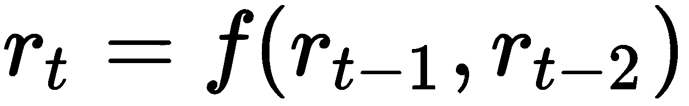
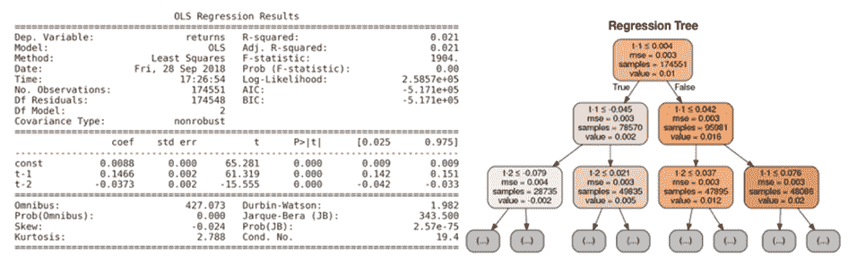
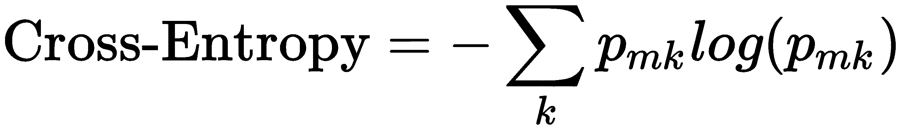
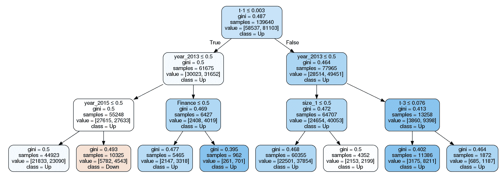
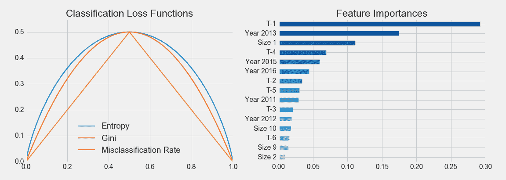
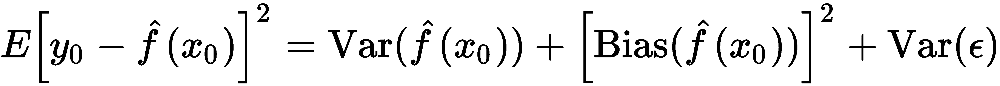
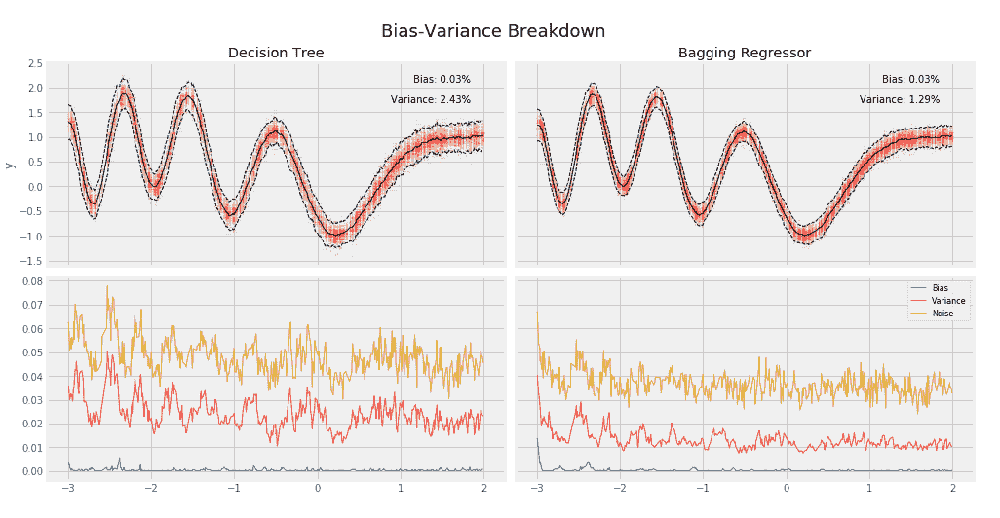
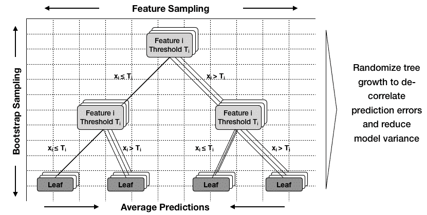
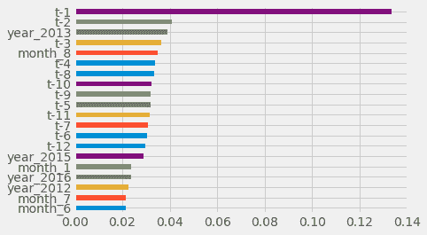

# 十、决策树和随机森林

在这一章中，我们将学习两类新的机器学习模型:决策树和随机森林。我们将看到决策树如何从编码输入和输出变量之间非线性关系的数据中学习规则。我们将说明如何训练决策树并将其用于回归和分类问题的预测，可视化和解释模型学习到的规则，以及调整模型的超参数以优化偏差-方差权衡并防止过度拟合。决策树不仅是重要的独立模型，也经常被用作其他模型的组件。

在本章的第二部分，我们将介绍集合模型，它将多个单独的模型结合起来，产生一个预测误差方差较低的单一集合预测。我们将举例说明 bootstrap 聚合，通常称为 bagging，作为随机化个体模型的构建和减少由集合的组件产生的预测误差的相关性的几种方法之一。

Boosting 是一个非常强大的替代方法，值得单独一章来解决一系列最新的发展。我们将说明 bagging 如何有效地减少方差，并学习如何配置、训练和调优随机森林。我们将看到随机森林作为大量决策树的集合，如何以解释上的一些损失为代价，显著减少预测误差。

简而言之，在本章中，我们将涵盖以下内容:

*   如何使用决策树进行回归和分类
*   如何从决策树中获得洞察力，并可视化从数据中学习到的决策规则
*   为什么集合模型倾向于提供更好的结果
*   bootstrap 聚合如何解决决策树的过度拟合问题
*   如何训练、调整和解释随机森林

# 决策树

决策树是一种机器学习算法，它基于从训练数据中学习到的决策规则来预测目标变量的值。通过改变控制树如何学习决策规则的目标函数，该算法可以应用于回归和分类问题。

我们将讨论决策树如何使用规则进行预测，如何训练它们预测(连续)收益以及(分类)价格运动方向，以及如何有效地解释、可视化和调整它们。

# 树如何学习和应用决策规则

我们在[第 7 章](07.html)、*线性模型*和[第 8 章](08.html)、*时间序列模型*中研究的线性模型，使用输入变量的线性组合学习一组参数来预测结果，在逻辑回归的情况下，可能在通过 S 形链接函数转换之后。

决策树采用不同的方法:它们学习并顺序应用一组规则，将数据点分成子集，然后为每个子集做出一个预测。预测基于应用给定规则序列所产生的训练样本子集的结果值。正如我们将进一步更详细地看到的，分类树直接从相对类频率或多数类的值预测估计的概率，而回归模型从可用数据点的结果值的平均值计算预测。

这些规则中的每一个都依赖于一个特定的特征，并且使用阈值将样本分成两个组，这两个组的值低于或高于关于该特征的阈值。二叉树自然地表示模型的逻辑:根是所有样本的起点，节点表示决策规则的应用，数据沿着边移动，因为它被分成更小的子集，直到到达模型进行预测的叶节点。

对于线性模型，参数值允许解释输入变量对输出和模型预测的影响。相比之下，对于决策树，从根到叶的路径创建了关于特征及其值如何通过模型导致特定决策的透明性。

下图突出显示了模型如何学习规则。在训练期间，该算法扫描特征，并且对于每个特征，寻求找到分割数据的截止点，以最小化使用由分割产生的子集进行预测所产生的损失，该子集由每个子集中的样本数加权:


为了在训练期间构建完整的树，学习算法重复这个划分特征空间的过程，即， *p* 输入变量、 *X <sub>1</sub> ，X <sub>2</sub> 的一组可能值，...X<sub>p</sub>T9】划分成互斥的和集体穷举的区域，每个区域由一个叶节点表示。不幸的是，给定特征序列和阈值的可能组合的爆炸性数量，该算法将不能评估特征空间的每个可能分区。基于树的学习采用自上而下的贪婪方法，称为递归二进制分裂来克服这种计算限制。*

这一过程是递归的，因为它使用先前分割产生的数据子集。它是自上而下的，因为它从树的根节点开始，其中所有的观察仍然属于单个区域，然后通过向预测器空间添加一个更多的分裂来连续创建树的两个新分支。它是贪婪的，因为该算法基于对目标函数的直接影响以特征-阈值组合的形式挑选最佳规则，而不是向前看并提前几个步骤评估损失。我们将回到回归和分类树的更具体的上下文中的分割逻辑，因为这代表了主要的区别。

随着递归分割向树中添加新的节点，训练样本的数量继续减少。如果规则平均分割样本，产生一个完美平衡的树，每个节点有相等数量的子节点，那么在级别 *n* 将有 2 <sup>n</sup> 个节点，每个节点包含观察总数的相应部分。在实践中，这是不可能的，因此沿着一些分支的样本数量可能会迅速减少，并且树倾向于沿着不同的路径生长到不同的深度水平。

为了实现对新观察值的预测，模型使用它在训练期间推断的规则来决定应该将数据点分配给哪个叶节点，然后在特征空间的相应区域中使用训练观察值的平均值(用于回归)或模式(用于分类)。在特征空间的给定区域中，即在给定的叶节点中，较少数量的训练样本降低了预测的置信度，并且可以反映过度拟合。

递归分裂将继续，直到每个叶节点仅包含单个样本，并且训练误差已经减小到零。我们将引入几个标准来限制分裂，并防止决策树产生极端过度拟合的自然趋势。

# 如何在实践中使用决策树

在本节中，我们将说明如何使用基于树的模型来获得洞察力和进行预测。为了演示回归树，我们预测回报，对于分类案例，我们返回到资产价格正负变动的例子。除非另有说明，本节的代码示例在笔记本`decision_trees`中。

# 如何准备数据

我们使用在*[4](04.html)**阿尔法因子研究*中构建的数据集的简化版本。它由 Quandl 提供的 2010-2017 年期间的每日股票价格和各种工程功能组成。详细内容可以在本章的 GitHub repo 中的`data_prep`笔记本中找到。本章中的决策树模型不能处理缺失或分类变量，因此我们将在删除任何前者后对后者应用哑编码。

# 如何编写自定义交叉验证类

我们还构建了一个定制的交叉验证类，该类是为刚刚创建的数据的格式定制的，它有两个级别的 pandas MultiIndex，一个用于 ticker，一个用于数据:

```py
class OneStepTimeSeriesSplit:
    """Generates tuples of train_idx, test_idx pairs
    Assumes the index contains a level labeled 'date'"""

    def __init__(self, n_splits=3, test_period_length=1, shuffle=False):
        self.n_splits = n_splits
        self.test_period_length = test_period_length
        self.shuffle = shuffle
        self.test_end = n_splits * test_period_length

    @staticmethod
    def chunks(l, chunk_size):
        for i in range(0, len(l), chunk_size):
            yield l[i:i + chunk_size]

    def split(self, X, y=None, groups=None):
        unique_dates = (X.index
                        .get_level_values('date')
                        .unique()
                        .sort_values(ascending=False)[:self.test_end])

        dates = X.reset_index()[['date']]
        for test_date in self.chunks(unique_dates, self.test_period_length):
            train_idx = dates[dates.date < min(test_date)].index
            test_idx = dates[dates.date.isin(test_date)].index
            if self.shuffle:
                np.random.shuffle(list(train_idx))
            yield train_idx, test_idx
```

`OneStepTimeSeriesSplit`在使用 *T* 月份的数据进行验证时，确保训练集和验证集的分离，从而通过仅使用截至 *T-1* 期间的数据对每只股票训练模型来避免前瞻偏差。我们将只使用一步到位的预测。

# 如何构建回归树

回归树基于分配给给定节点的训练样本的平均结果值进行预测，并且通常依赖均方误差来在递归二进制分裂期间选择最佳规则。

给定一个训练集，该算法迭代预测器， *X <sub>1</sub> ，X <sub>2</sub> ，...，X<sub>p</sub>T7】，以及可能的切割点， *s <sub>1</sub> ，s <sub>1</sub> ，...，s<sub>N</sub>T15】，寻找最优组合。最优规则将特征空间分成两个区域，*{ X | X<sub>I</sub><s<sub>j</sub>}*和*{ X | X<sub>I</sub>>s<sub>j</sub>**}*，其中 *X <sub>i</sub>* 特征的值在*s<sub>j<sub>的下方或上方</sub></sub>***

让我们从一个简化的例子开始，以便于可视化，并仅使用两个月的滞后回报来预测下个月，就像上一章的 AR(2)模型一样:



使用`sklearn`，配置和训练回归树非常简单:

```py
from sklearn.tree import DecisionTreeRegressor

# configure regression tree
regression_tree = DecisionTreeRegressor(criterion='mse', # default
                                        max_depth=4,     # up to 4 splits
                                        random_state=42)
# Create training data
y = data.returns
X = data.drop('returns', axis=1)
X2 = X.loc[:, ['t-1', 't-2']]

# fit model
regression_tree.fit(X=X2, y=y)

# fit OLS model
ols_model = sm.OLS(endog=y, exog=sm.add_constant(X2)).fit()
```

OLS 总结和决策树前两层的可视化揭示了模型之间的显著差异。OLS 模型为截距和两个特征提供了三个参数，符合该模型对函数 *f* 的线性假设。

相比之下，对于前两层的每个节点，回归树图显示用于分割数据的特征和阈值(注意，特征可以重复使用)，以及**均方误差** ( **MSE** )的当前值、样本数和基于这些训练样本的预测值:



回归树形图

树形图还突出显示了样本在节点上的不均匀分布，因为仅经过两次分割后，样本数就在 28，000 到 49，000 之间变化。

为了进一步说明关于输入变量和输出之间的关系的函数形式的不同假设，我们可以将当前回报预测可视化为特征空间的函数，即滞后回报的值的范围的函数。下图显示了线性回归和回归树的当前期间回报率与一个和两个期间之前的回报率的函数关系:


右侧的线性回归模型结果强调了滞后收益和当前收益之间关系的线性，而左侧的回归树图说明了特征空间递归划分中编码的非线性关系。

# 如何建立分类树

分类树的工作方式就像回归版本，只是结果的分类性质需要不同的方法来进行预测和测量损失。回归树使用相关训练样本的平均结果来预测分配给叶节点的观察的响应，而分类树则使用模式，即相关区域中训练样本中最常见的类别。分类树也可以基于相对类别频率生成概率预测。

# 如何优化节点纯度

当生长分类树时，我们也使用递归二进制分裂，但是，代替使用均方误差的减少来评估决策规则的质量，我们可以使用分类误差率，其仅仅是给定(离开)节点中不属于最常见类别的训练样本的分数。

然而，基尼指数或交叉熵是优选的替代度量，因为它们对节点纯度比对分类错误率更敏感。节点纯度是指一个节点中单个类的优势程度。仅包含具有属于单个类别的结果的样本的节点是纯的，并且暗示对于特征空间的这个特定区域的成功分类。对于采用 *K* 值的分类结果， *0，1，…，K-1* ，对于给定的节点， *m* ，其表示特征空间的区域， *R* <sub>*m* ，</sub>，其中 *p <sub>mk</sub>* 是 *k* 类的结果在*m*中的比例




当类别比例接近 0 或 1 时，即当子节点由于分裂而变得纯净时，基尼不纯度和交叉熵度量都呈现较小的值，并且当类别比例为偶数或在二进制情况下为 0.5 时，基尼不纯度和交叉熵度量最高。本节末尾的图表显示了这两种方法假定的值以及[0，1]比例区间内的错误分类率。

# 如何训练分类树

现在，我们将使用 80%的样本来训练、可视化和评估一个具有多达 5 个连续分裂的分类树，以预测剩余的 20%。我们在这里采取了一种简化图示的捷径，并使用内置的`train_test_split`作为我们的自定义迭代器，它不能防止前瞻偏差。树形配置意味着多达 2 个 <sup>5 个</sup> =32 个叶节点，平均而言，在平衡情况下，将包含超过 4300 个训练样本。看一下下面的代码:

```py
# randomize train-test split
X_train, X_test, y_train, y_test = train_test_split(X, y_binary, test_size=0.2, random_state=42)

# configure & train tree learner
classifier = DecisionTreeClassifier(criterion='gini',
                                    max_depth=5,
                                    random_state=42)
classifier.fit(X=X_train, y=y_train)

# Output:
DecisionTreeClassifier(class_weight=None, criterion='gini', max_depth=5,
            max_features=None, max_leaf_nodes=None,
            min_impurity_decrease=0.0, min_impurity_split=None,
            min_samples_leaf=1, min_samples_split=2,
            min_weight_fraction_leaf=0.0, presort=False, random_state=42,
            splitter='best')
```

训练模型后的输出显示了所有的`DecisionTreeClassifier`参数，我们将在下一节讨论参数调整时详细讨论这些参数。

# 如何可视化决策树

您可以使用`graphviz`库可视化该树(安装说明见 GitHub ),因为`sklearn`可以使用该库使用的`.dot`语言输出树的描述。您可以配置输出以包括要素和类标签，并限制级别数以保持图表的可读性，如下所示:

```py
dot_data = export_graphviz(classifier,
                           out_file=None, # opt. save to file and convert to png
                           feature_names=X.columns,
                           class_names=['Down', 'Up'],
                           max_depth=3,
                           filled=True,
                           rounded=True,
                           special_characters=True)

graphviz.Source(dot_data)
```

结果表明，该模型使用了各种不同的特征，并表明了连续和分类(虚拟)变量的分裂规则。该图表在标签值下显示每个类别的样本数，在标签类别下显示最常见的类别(在样本期内有多个月):



# 如何评估决策树预测

为了评估我们的第一个分类树的预测准确性，我们将使用我们的测试集来生成预测的类别概率，如下所示:

```py
y_score = classifier.predict_proba(X=X_test)[:, 1] # only keep probabilities for pos. class
```

`.predict_proba()`方法为每个类产生一个概率。在二元类中，这些概率是互补的，总和为 1，因此我们只需要正类的值。为了评估泛化误差，我们将根据我们在[第 6 章](06.html)、*机器学习过程*中介绍的接收器操作特性，使用曲线下的面积。结果表明，对于随机预测来说，在 0.5 的基线值之上有显著的改进:

```py
roc_auc_score(y_score=y_score, y_true=y_test)
0.5941
```

# 特征重要性

决策树不仅可以可视化以检查给定特征的决策路径，还可以提供每个特征对模型拟合训练数据的贡献的汇总度量。

特征重要性捕获了由特征产生的分裂在多大程度上有助于优化用于评估分裂质量的模型度量，在我们的情况下是基尼不纯指数。特征的重要性计算为该指标的(标准化)总减少量，并考虑了受分割影响的样本数量。因此，树中较早使用的特征(其中节点往往包含更多样本)通常被认为具有更高的重要性。

下图显示了前 15 项功能的重要性:



# 过度拟合和正则化

决策树有很强的过度拟合倾向，尤其是当数据集相对于样本数量具有大量特征时。如前几章所述，过度拟合会增加预测误差，因为模型不仅会学习训练数据中包含的信号，还会学习噪声。

有几种方法可以解决过度拟合的风险:

*   **降维** ( [第十二章](12.html)，*无监督学习*)通过用更少、更多信息、更少噪音的特征来表示现有特征，提高特征样本比。
*   **集合模型**，比如随机森林，在随机构造树的同时组合多棵树，我们将在本章的第二部分看到。
*   决策树提供了几个**正则化**超参数来限制树的增长和相关的复杂性。虽然每次分割都会增加节点的数量，但也会减少每个节点可用于支持预测的样本数量。对于每个额外的级别，需要两倍数量的样本来填充具有相同样本密度的新节点。
*   **Tree-pruning** 是一个额外的工具，通过删除增加很少价值但增加模型方差的节点或整个树来降低树的复杂性。例如，成本复杂性修剪从一棵大树开始，通过用叶子替换节点递归地减小树的大小，本质上是逆向运行树的构造。各个步骤产生了一系列的树，然后可以使用交叉验证进行比较，以选择理想的大小。

# 如何正则化决策树

下表列出了在 sklearn 决策树实现中可用于此目的的关键参数。在介绍了最重要的参数后，我们将说明如何使用交叉验证来优化超参数设置，以实现偏差-方差权衡和降低预测误差:

< TD 默认值

| **参数** | **选项** | **描述** |
| `**max_depth**` | 没有人 | （同 Internationalorganizations）国际组织 | 最大等级数:分裂节点直到到达`max_depth`或者所有叶子都是纯的或者包含少于`min_samples_split`个样本。 |
| `**max_features**` | 没有人 | 无:所有特征；int
float: fraction
auto，sqrt:sqrt(n _ features)
log2:log2(n _ features) | 分割时要考虑的特征数量。 |
| `**max_leaf_nodes**` | 没有人 | None:无限数量的叶节点
int | 分割节点，直到创建这么多叶子。 |
| `**min_impurity_decrease**` | Zero | 漂浮物 | 如果杂质减少至少这个值，则分裂节点。 |
| `**min_samples_leaf**` | one | int;浮点(以 N 的百分比表示) | 叶节点上的最小样本数。只有在左分支和右分支的每一个中至少有`min_samples_leaf`个训练样本时，才会考虑拆分。可以平滑模型，尤其是回归模型。 |
| `**min_samples_split**` | Two | int 浮点(N 的百分比) | 分割内部节点所需的最小样本数: |
| `**min_weight_fraction_leaf**` | Zero |  | 叶节点所需的所有样本权重总和的最小加权分数。除非 fit 方法中提供`sample_weight`,否则样品重量相等。 |

`max_depth`参数对连续分割的数量施加了一个硬性限制，并且代表了限制树的增长的最直接的方法。

`min_samples_split`和`min_samples_leaf`参数是可选的、数据驱动的方法，用于限制树的增长。这些参数不是对连续分割的数量进行硬性限制，而是控制进一步分割数据所需的最小样本数。后者保证每片叶子一定数量的样本，而前者如果分割导致非常不均匀的分布，则可以创建非常小的叶子。小参数值有利于过度拟合，而大参数值可能会阻止树学习数据中的信号。默认值通常很低，您应该使用交叉验证来探索潜在值的范围。您也可以使用浮点数来表示百分比，而不是绝对数字。

sklearn 文档包含有关如何针对不同用例使用各种参数的更多详细信息；参见 GitHub 参考资料。

# 决策树剪枝

递归二进制分裂可能会对训练集产生良好的预测，但往往会过度拟合数据并产生较差的泛化性能，因为它会导致过于复杂的树，反映在大量的叶节点或特征空间的分区中。更少的分裂和叶节点意味着整体更小的树，并且通常导致更好的预测性能以及可解释性。

限制叶节点数量的一种方法是避免进一步分裂，除非它们产生客观度量的显著改进。然而，这种策略的缺点是，有时导致微小改进的拆分会在以后随着样本组成的不断变化而产生更有价值的拆分。

相比之下，树修剪从生长一棵非常大的树开始，然后移除或修剪节点，以将大树减少为不太复杂和过度拟合的子树。成本-复杂性-修剪通过添加向树模型添加叶节点的惩罚和调整惩罚影响的正则化参数(类似于 lasso 和 ridge 线性回归模型)来生成子树序列。应用于大树，递增的惩罚将自动产生一系列子树。正则化参数的交叉验证可用于识别最佳的修剪子树。

sklearn 中还没有这个方法；有关手动实现修剪的更多细节和方法，请参见 GitHub 上的参考资料。

# 如何调整超参数

决策树提供了一组超参数来控制和调整训练结果。交叉验证是获得泛化误差无偏估计的最重要工具，这反过来允许在各种配置选项中做出明智的选择。sklearn 提供了几个工具来促进交叉验证大量参数设置的过程，即我们将在下一节中说明的`GridSearchCV`便利类。学习曲线还允许进行诊断，评估收集额外数据以减少泛化误差的潜在好处。

# 决策树的 GridsearchCV

`sklearn`提供了一种定义多个超参数值范围的方法。它自动执行交叉验证这些参数值的各种组合的过程，以确定最佳配置。让我们来看一下自动调整模型的过程。

第一步是实例化一个模型对象并定义一个字典，其中关键字命名超参数，值列出要测试的参数设置:

```py
clf = DecisionTreeClassifier(random_state=42)
param_grid = {'max_depth': range(10, 20),
              'min_samples_leaf': [250, 500, 750],
              'max_features': ['sqrt', 'auto']
              }
```

然后，实例化`GridSearchCV`对象，为初始化方法提供评估器对象和参数网格，以及评分方法和交叉验证选择。我们将使用自定义`OneStepTimeSeriesSplit`类的一个对象，初始化为对`cv`参数使用十倍，并将得分设置为`roc_auc`度量。我们可以使用`n_jobs`参数并行搜索，并通过设置`refit=True`自动获得使用最佳超参数的训练模型。

所有设置就绪后，我们可以像安装其他模型一样安装`GridSearchCV`:

```py
gridsearch_clf = GridSearchCV(estimator=clf,
                          param_grid=param_grid,
                          scoring='roc_auc',
                          n_jobs=-1,
                          cv=cv,  # custom OneStepTimeSeriesSplit
                          refit=True,
                          return_train_score=True)

gridsearch_clf.fit(X=X, y=y_binary)
```

训练过程为我们的`GridSearchCV`对象产生了一些新的属性，最重要的是关于最佳设置和最佳交叉验证分数的信息(现在使用正确的设置来避免前瞻偏差)。

将`max_depth`设置为`13`，`min_samples_leaf`设置为`500`，并在决定分割时随机选择一个与特征总数的平方根相对应的数字，产生最佳结果，AUC 为`0.5855`:

```py
gridsearch_clf.best_params_
{'max_depth': 13, 'max_features': 'sqrt', 'min_samples_leaf': 500}

gridsearch_clf.best_score_
0.5855
```

自动化非常方便，但是我们还想检查不同参数值的性能如何演变。完成这个过程后，`GridSearchCV`对象提供详细的交叉验证结果，以获得更多的信息。

# 如何检查树结构

该笔记本还说明了如何更加手动地运行交叉验证，以获得自定义的树属性，例如与某些超参数设置相关联的节点或叶节点的总数。下面的函数访问内部的`.tree_`属性来检索关于节点总数的信息，以及这些节点中有多少是叶节点:

```py
def get_leaves_count(tree):
    t = tree.tree_
    n = t.node_count
    leaves = len([i for i in range(t.node_count) if t.children_left[i]== -1])
    return leaves
```

我们可以将此信息与训练和测试分数相结合，以在整个交叉验证过程中获得有关模型行为的详细信息，如下所示:

```py
train_scores, val_scores, leaves = {}, {}, {}
for max_depth in range(1, 26):
    print(max_depth, end=' ', flush=True)
    clf = DecisionTreeClassifier(criterion='gini', 
                                 max_depth=max_depth,
                                 min_samples_leaf=500,
                                 max_features='auto',
                                 random_state=42)
    train_scores[max_depth], val_scores[max_depth], leaves[max_depth] = [], [], []
    for train_idx, test_idx in cv.split(X):
        X_train, y_train,  = X.iloc[train_idx], y_binary.iloc[train_idx]
        X_test, y_test = X.iloc[test_idx], y_binary.iloc[test_idx]
        clf.fit(X=X_train, y=y_train)

        train_pred = clf.predict_proba(X=X_train)[:, 1]
        train_score = roc_auc_score(y_score=train_pred, y_true=y_train)
        train_scores[max_depth].append(train_score)

        test_pred = clf.predict_proba(X=X_test)[:, 1]
        val_score = roc_auc_score(y_score=test_pred, y_true=y_test)
        val_scores[max_depth].append(val_score)    
        leaves[max_depth].append(get_leaves_count(clf))
```

结果显示在下图的左侧面板中。它突出显示了整个`max_depth`设置范围内的样本内和样本外性能，以及误差指标的置信区间。它还显示了右侧对数刻度上的叶节点数，并显示了 13 次连续拆分时的最佳性能设置，如垂直黑线所示。

# 学习曲线

学习曲线是一个有用的工具，它显示了验证和训练分数如何随着训练样本数量的变化而变化。

学习曲线的目的是找出模型是否会从训练期间使用更多数据中受益以及受益多少。对于诊断模型的泛化错误是否更有可能是由偏差或方差引起的，这也很有用。

例如，如果尽管训练集大小增加，验证分数和训练分数都收敛到类似的低值，则错误更可能是由于偏差，并且额外的训练数据不太可能有所帮助。

看看下面的可视化效果:


# 决策树的优势和劣势

与我们到目前为止探索的线性模型相比，回归和分类树采用了非常不同的预测方法。你如何决定哪个模型更适合手头的问题？请考虑以下情况:

*   如果结果和特征之间的关系是近似线性的(或者可以被相应地转换)，那么线性回归将可能胜过更复杂的方法，例如不利用这种线性结构的决策树。
*   如果这种关系表现出高度非线性和更加复杂，决策树可能会优于经典模型。

几个优点使得决策树非常受欢迎:

*   它们很容易理解和解释，尤其是因为它们很容易可视化，因此更容易被非技术观众所理解。决策树也被称为白盒模型，因为它们在如何做出预测方面具有很高的透明度。黑盒模型，如集成和神经网络，可以提供更好的预测准确性，但决策逻辑往往更难以理解和解释。
*   与对数据做出更强假设或对异常值更敏感并需要数据标准化(如正则化回归)的模型相比，决策树需要更少的数据准备。
*   一些决策树实现处理分类输入，不需要创建虚拟变量(提高内存效率)，并且可以处理丢失的值，正如我们将在第十一章、*梯度提升机器*中看到的那样，但 sklearn 不是这种情况。
*   预测很快，因为它在叶节点的数量上是对数的(除非树变得极度不平衡)。
*   可以使用统计测试来验证模型并说明其可靠性(参见 GitHub 参考资料)。

决策树也有几个主要缺点:

*   决策树有一种内在的倾向，即过度适应训练集，并产生很高的泛化错误。解决这一弱点的关键步骤是修剪(sklearn 尚不支持)以及使用前一节中概述的各种提前停止标准进行正则化。
*   与此密切相关的是决策树的高方差，这是由于决策树能够紧密适应定型集，因此数据中的微小变化会在决策树的结构中产生很大的波动，从而影响模型生成的预测。解决决策树的高方差的关键机制是使用具有低偏差并产生不相关预测误差的随机化决策树的集合。
*   决策树学习的贪婪方法基于局部标准进行优化，即减少当前节点的预测误差，但不保证全局最优的结果。同样，由随机化树组成的集合有助于缓解这个问题。
*   决策树对不平衡的类权重也很敏感，可能会产生有偏差的树。一种选择是对代表性不足的类别进行过采样，或者对更频繁的类别进行欠采样。不过，使用类权重并直接调整目标函数通常更好。

# 随机森林

决策树不仅因为其透明性和可解释性而有用，而且还是更强大的集合模型的基本构建块，该集合模型将许多单独的树与随机改变其设计的策略相结合，以解决上一节中讨论的过度拟合和高方差问题。

# 集合模型

集成学习涉及将几个机器学习模型组合成单个新模型，旨在比任何单个模型做出更好的预测。更具体地说，集成集成了使用一个或多个给定学习算法训练的几个基本估计量的预测，以减少这些模型本身可能产生的泛化误差。

为了实现这个目标，集成学习的个体模型必须是:

*   **准确:**它们胜过原始基线(如样本均值或类别比例)
*   **独立:**它们的预测是以不同的方式生成的，从而产生不同的误差

集成方法是最成功的机器学习算法之一，特别是对于标准数值数据。大型集合在机器学习竞赛中非常成功，可能由许多不同的单个模型组成，这些模型通过手工或使用另一种机器学习算法进行组合。

组合不同模型的预测有几个缺点。这些问题包括可解释性降低，以及培训、预测和模型维护的复杂性和成本增加。因此，在实践中(比赛之外)，从大规模集合中获得的微小精度收益可能不值得增加的成本。

有两组集合方法，通常根据它们如何优化组成模型，然后将结果整合为单个集合预测来区分:

*   **平均法**独立训练几个基本估计量，然后对其预测值进行平均。如果基本模型没有偏差，并且产生不高度相关的不同预测误差，则组合预测可以具有较低的方差，并且可以更加可靠。这类似于从回报不相关的资产中构建投资组合，以降低波动性而不牺牲回报。

*   **Boosting 方法**相反，训练基本估计量是为了减少组合估计量的偏差。动机是将几个弱模型组合成一个强大的合奏。

我们将在本章的剩余部分重点介绍自动平均方法，以及第十一章[、*梯度提升机*中的提升方法。](11.html)

# 装袋如何降低模型方差

我们看到，由于高方差，决策树很可能做出糟糕的预测，这意味着树结构对训练样本的组成非常敏感。我们还看到，具有低方差的模型，如线性回归，尽管有不同的训练样本，但只要有足够的样本给定特征数，就会产生类似的估计。

对于给定的一组独立观测值，每个观测值的方差为*σ<sup>2</sup>T3】，样本均值的标准差由 *σ/n* 给出。换句话说，对一组更大的观察值进行平均会减少方差。因此，减少模型方差及其泛化错误的自然方法是从总体中收集许多训练集，在每个数据集上训练不同的模型，然后对结果预测进行平均。*

实际上，我们通常没有很多不同的训练集。这就是 bagging(引导聚合的缩写)的用武之地。Bagging 是一种通用方法，用于减少机器学习模型的方差，在应用于决策树时特别有用和流行。

Bagging 指的是 bootstrap 样本的集合，bootstrap 样本是带有替换的随机样本。这种随机样本具有与原始数据集相同数量的观察值，但由于替换可能包含重复值。

Bagging 提高了预测准确性，但降低了模型的可解释性，因为不再可能通过可视化树来了解每个特征的重要性。作为一种集成算法，bagging 方法在这些自举样本上训练给定数量的基本估计量，然后将它们的预测聚集成最终的集成预测。

例如，Bagging 通过随机化每棵树的生长方式来减少基本估计量的方差，然后对预测进行平均以减少其泛化误差。在不需要改变底层算法的情况下，改进给定的模型通常是一种简单的方法。它最适合具有低偏差和高方差的复杂模型，如深度决策树，因为它的目标是限制过度拟合。相比之下，提升方法最适合弱模型，如浅层决策树。

有几种装袋方法，它们应用于训练集的随机采样过程不同:

*   粘贴从没有替换的训练数据中抽取随机样本，而装袋样本有替换
*   随机子空间从特征(即列)中随机取样，不进行替换
*   随机补丁通过随机采样观察值和特征来训练基本估计量

# 袋装决策树

为了将 bagging 应用于决策树，我们通过重复替换采样从训练数据中创建引导样本，然后在这些样本中的每个样本上训练一个决策树，并通过对不同树的预测进行平均来创建集成预测。

袋装决策树通常长得很大，也就是说，具有许多层和叶节点，并且没有被修剪，因此每棵树都具有低偏差但高方差。平均他们的预测的效果旨在减少他们的方差。Bagging 已经被证明可以通过构建组合数百甚至数千个在 bootstrap 样本上训练的树的集成来显著提高预测性能。

为了说明 bagging 对回归树方差的影响，我们可以使用由`sklearn`提供的`BaggingRegressor`元估计器。它根据指定采样策略的参数训练用户定义的基本估计器:

*   `max_samples`和`max_features`分别控制从行和列中提取的子集的大小
*   `bootstrap`和`bootstrap_features`确定这些样本中的每一个是否被替换抽取

以下示例使用指数函数为单个`DecisionTreeRegressor`和由十棵树组成的`BaggingRegressor`集合生成训练样本，每棵树长十层。这两个模型都是在随机样本上训练的，并预测实际函数在添加噪声的情况下的结果。

由于我们知道真实函数，我们可以将均方误差分解为偏差、方差和噪声，并根据以下分类比较两种模型中这些分量的相对大小:



对于 100 个重复的随机训练和测试样本，每个样本有 250 和 500 个观察值，我们发现单个决策树的预测方差几乎是基于自举样本的`10`袋装树小集合预测方差的两倍:

```py
noise = .5  # noise relative to std(y)
noise = y.std() * noise_to_signal

X_test = choice(x, size=test_size, replace=False)

max_depth = 10
n_estimators=10

tree = DecisionTreeRegressor(max_depth=max_depth)
bagged_tree = BaggingRegressor(base_estimator=tree, n_estimators=n_estimators)
learners = {'Decision Tree': tree, 'Bagging Regressor': bagged_tree}

predictions = {k: pd.DataFrame() for k, v in learners.items()}
for i in range(reps):
    X_train = choice(x, train_size)
    y_train = f(X_train) + normal(scale=noise, size=train_size)
    for label, learner in learners.items():
        learner.fit(X=X_train.reshape(-1, 1), y=y_train)
        preds = pd.DataFrame({i: learner.predict(X_test.reshape(-1, 1))}, index=X_test)
        predictions[label] = pd.concat([predictions[label], preds], axis=1)
```

对于每个模型，下图显示了上图中两个模型的平均值预测和平均值周围的两个标准差的范围，以及下图中基于真实函数值的偏差-方差-噪声细分:



实施细节见笔记本`random_forest`。

# 如何构建随机森林

随机森林算法扩展了由 bagging 生成的引导样本引入的随机化，以进一步减少方差并提高预测性能。

除了在引导训练数据上训练每个集合成员之外，随机森林还从模型中使用的特征中随机采样(没有替换)。根据实现方式，可以为每棵树或每一次分割抽取随机样本。因此，该算法在学习新规则时面临不同的选择，无论是在树的级别还是针对每个拆分。

回归树和分类树的特征样本大小不同:

*   对于**分类**，样本大小通常是特征数量的平方根。
*   对于**回归**，它可以是从三分之一到所有特征的任何值，并且应该基于交叉验证来选择。

下图说明了随机森林如何随机化单个树的训练，然后将它们的预测聚合为一个集合预测:



除了训练观察之外，随机化特征的目标是进一步去相关各个树的预测误差。并非所有的特征都是相同的，在树构建过程中，少量高度相关的特征将被更频繁、更早地选择，使得整个集合中的决策树更加相似。然而，单个树的泛化误差越小，总体方差将减少得越多。

# 如何训练和调整随机森林

关键配置参数包括在*如何调整超参数*一节中介绍的各个决策树的各种超参数。下表列出了两个`RandomForest`类的附加选项:

| **关键词** | **默认** | **描述** |
| `bootstrap` | `True` | 训练期间的引导样本。 |
| `n_estimators` | `10` | 森林中树木的数量。 |
| `oob_score` | `False` | 使用袋外样本来估计未知数据的 R <sup>2</sup> 。 |

`bootstrap`参数在前面的 bagging 算法大纲中激活，这又使得能够计算出袋外得分(`oob_score`)，该得分使用不包括在用于训练给定树的引导样本中的样本来估计泛化精度(详见下一节)。

`n_estimators`参数定义了作为森林一部分的树木数量。更大的森林表现更好，但也需要更多的时间来建设。重要的是监控作为基础学习者数量的函数的交叉验证误差，以识别预测误差的边际减少何时下降，以及额外训练的成本何时开始超过收益。

`max_features`参数控制学习新决策规则和分割节点时随机选择的可用特征子集的大小。较低的值会降低树的相关性，从而降低总体的方差，但也可能会增加偏差。对于回归问题，好的起始值是`n_features`(训练特征的数量),对于分类问题，好的起始值是`sqrt(n_features)`,但这将取决于特征之间的关系，并且应该使用交叉验证进行优化。

随机森林被设计成包含深度完全成长的树，可以使用`max_depth=None`和`min_samples_split=2`来创建。但是，这些值不一定是最佳的，特别是对于具有许多样本的高维数据，因此，树可能非常深，可能会变得非常计算和内存密集型。

`sklearn`提供的`RandomForest`类通过将`n_jobs`参数设置为在不同内核上运行的`k`个任务来支持并行训练和预测。`-1`值使用所有可用的内核。进程间通信的开销可能会限制线性加速，因此 *k* 个任务可能会花费比单个任务多 *1/k* 的时间。尽管如此，对于大型森林或深层的单个树来说，加速通常是非常显著的，当数据很大时，可能需要大量的时间来训练，并且分割评估变得非常昂贵。

和往常一样，最好的参数配置应该通过交叉验证来确定。以下步骤说明了该过程:

1.  我们将使用`GridSearchCV`来确定分类树集合的最佳参数集:

```py
rf_clf = RandomForestClassifier(n_estimators=10,
                                criterion='gini',
                                max_depth=None,
                                min_samples_split=2,
                                min_samples_leaf=1,
                                min_weight_fraction_leaf=0.0,
                                max_features='auto',
                                max_leaf_nodes=None,
                                min_impurity_decrease=0.0,
                                min_impurity_split=None,
                                bootstrap=True, oob_score=False,
                                n_jobs=-1, random_state=42)
```

2.  我们将使用 10 重自定义交叉验证，并用关键配置设置的值填充参数网格:

```py
cv = OneStepTimeSeriesSplit(n_splits=10)
clf = RandomForestClassifier(random_state=42, n_jobs=-1)
param_grid = {'n_estimators': [200, 400],
              'max_depth': [10, 15, 20],
              'min_samples_leaf': [50, 100]}
```

3.  使用之前的输入配置`GridSearchCV`:

```py
gridsearch_clf = GridSearchCV(estimator=clf,
                          param_grid=param_grid,
                          scoring='roc_auc',
                          n_jobs=-1,
                          cv=cv,
                          refit=True,
                          return_train_score=True,
                          verbose=1)
```

4.  训练由参数网格定义的多个集合模型:

```py
gridsearch_clf.fit(X=X, y=y_binary)
```

5.  获得最佳参数如下:

```py
gridsearch_clf.bestparams{'max_depth': 15,
 'min_samples_leaf': 100,
 'n_estimators': 400}
```

6.  最好的分数是相对于单棵树基线的微小但显著的改进:

```py
gridsearch_clf.bestscore_0.6013
```

# 随机森林的特征重要性

随机森林集合可能包含数百棵树，但仍有可能从袋装模型中获得要素重要性的总体汇总度量。

对于给定的特征，重要性分数是目标函数值的总减少量，这是基于该特征的分割的结果，是所有树的平均值。由于目标函数考虑了有多少特征受到分割的影响，因此该测量隐含地为加权平均值，使得在树的顶部附近使用的特征将获得更高的分数，这是因为在数量少得多的可用节点中包含了更多的观察值。通过对以随机方式生长的许多树进行平均，特征重要性估计丢失了一些方差，并且变得更加准确。

基于用于学习决策规则的不同目标，分类树和回归树的计算是不同的，并且根据回归树的均方误差和分类树的基尼指数或熵来测量。

`sklearn`进一步标准化特征重要性测量，使其总和达到`1`。如此计算的特征重要性也用于特征选择，作为我们在[第 6 章](06.html)、 *T* *机器学习过程*中看到的互信息度量的替代(参见`sklearn.feature_selection`模块中的`SelectFromModel`)。

在我们的示例中，前 20 个功能的重要性值如下所示:



特征重要性值

# 袋外测试

随机森林提供了内置交叉验证的好处，因为单个树是在训练数据的引导版本上训练的。因此，每棵树平均只使用三分之二的可用观测值。为了解释为什么，假设一个 bootstrap 样本的大小 *n* 与原始样本相同，并且每个观察值被抽取的概率 *1/n* 相同。因此，根本不进入 bootstrap 样本的概率是 *(1-1/n)* *<sup>n</sup>* ，它(很快)收敛到 *1/e* ，或大约三分之一。

这剩余的三分之一未包含在用于种植袋装树的训练集中的观察值被称为**袋外**(**)观察值，可以作为验证集。就像交叉验证一样，我们预测每个没有该观察的树的 OOB 样本的响应，然后平均预测的响应(如果回归是目标)或对每个 OOB 样本的单个集合预测采取多数投票或预测的概率(如果分类是目标)。这些预测产生泛化误差的无偏估计，便于在训练期间计算。**

 **所得到的 OOB 误差是该观察的泛化误差的有效估计，因为该预测是使用在没有该观察的情况下学习的决策规则产生的。一旦随机森林足够大，OOB 误差就非常接近留一交叉验证误差。估计测试误差的 OOB 方法对于大数据集非常有效，其中交叉验证在计算上可能是昂贵的。

# 随机森林的利与弊

袋装集合模型有优点也有缺点。随机森林的优势包括:

*   预测性能可以与最好的监督学习算法相媲美
*   它们提供了可靠的特征重要性估计
*   它们提供了对测试误差的有效估计，而不会产生与交叉验证相关的重复模型训练的成本

另一方面，随机森林也有一些缺点:

*   一个集合模型本质上比一个单独的决策树更难解释
*   训练大量的深度树会有很高的计算成本(但是可以并行化),并且使用大量的内存
*   预测速度较慢，这可能会给要求低延迟的应用带来挑战

# 摘要

在这一章中，我们学习了一类新的模型，它能够捕捉非线性关系，与我们到目前为止探索的经典线性模型形成对比。我们看到了决策树如何学习规则来将特征空间划分为产生预测的区域，从而将输入数据分割为特定的区域。

决策树非常有用，因为它们为特性和目标变量之间的关系提供了独特的见解，我们看到了如何可视化编码在树结构中的决策规则序列。

不幸的是，决策树容易过度拟合。我们了解到，集成模型和 bootstrap 聚合方法设法克服了决策树的一些缺点，并使它们成为更强大的复合模型的组成部分。

在下一章，我们将探索另一个集成模型，它被认为是最重要的机器学习算法之一。**