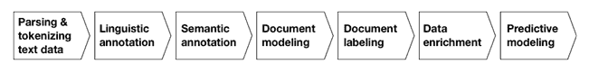
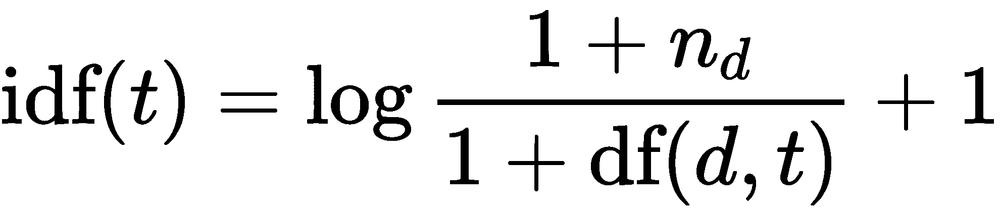
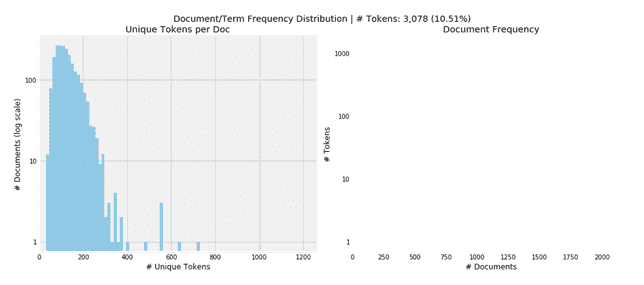
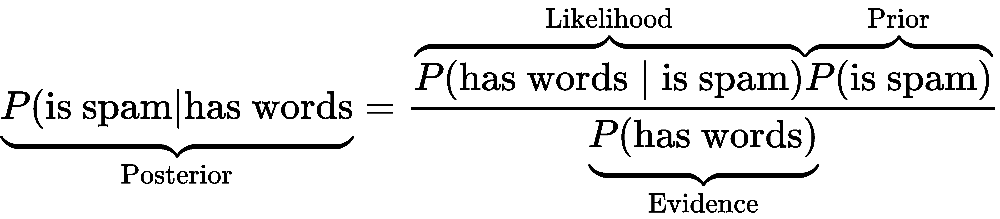
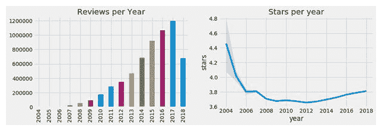

# 十三、使用文本数据

这是三章中的第一章，致力于使用**自然语言处理** ( **NLP** )和**机器学习** ( **ML** )从文本数据中提取算法交易策略的信号。

文本数据在内容上非常丰富，但在格式上是非结构化的，因此需要更多的预处理，以便 ML 算法可以提取潜在的信号。关键的挑战在于将文本转换成算法使用的数字格式，同时表达内容的语义或含义。我们将介绍几种捕捉人类容易理解的语言细微差别的技术，以便它们可以成为 ML 算法的输入。

在这一章中，我们介绍了集中在单个语义单元的基本特征提取技术；即被称为**记号**的单词或词组。我们将展示如何通过创建一个文档-术语矩阵来将文档表示为令牌计数的向量，该矩阵反过来作为文本分类和情感分析的输入。我们还将介绍朴素贝叶斯算法，这是流行的目的。

在接下来的两章中，我们在这些技术的基础上，使用 ML 算法，如主题建模和词向量嵌入，来捕捉包含在更广泛的上下文中的信息。

特别是，在本章中，我们将涵盖以下内容:

*   基本的 NLP 工作流程是什么样子的
*   如何使用`spaCy`和`TextBlob`构建多语言特征提取管道
*   如何执行自然语言处理任务，如**词性** ( **词性**)标注或命名实体识别
*   如何使用文档术语矩阵将令牌转换为数字
*   如何使用朴素贝叶斯模型对文本进行分类
*   如何进行情感分析

以下部分的代码示例在本章的 GitHub 资源库中，参考资料列在主`README`文件中。

# 如何从文本数据中提取特征

考虑到人类使用自然语言交流和存储的信息量，文本数据可能非常有价值——与投资相关的各种数据源从公司声明、合同和专利等正式文档，到新闻、观点和分析师研究，甚至到评论和各种类型的社交媒体帖子和消息。

网上有许多不同的文本数据样本来探索 NLP 算法的使用，其中许多都列在本章的参考资料中。

为了通过最有效地支持实现这一目标的技术和 Python 库来指导我们的旅程，我们将强调 NLP 挑战，介绍 NLP 工作流的关键元素，并说明从文本数据到算法交易的 ML 应用。

# 自然语言处理的挑战

将非结构化文本转换为机器可读格式需要仔细的预处理，以保留数据中有价值的语义方面。人类如何从语言中获得意义，以及如何理解语言的内容，还没有被完全理解，通过机器来提高语言理解仍然是一个非常活跃的研究领域。

NLP 是有挑战性的，因为对 ML 文本数据的有效使用需要理解语言的内部工作原理以及关于它所涉及的世界的知识。主要挑战包括以下方面:

*   多义性导致的歧义；也就是说，一个单词或短语根据上下文可能有不同的意思(例如，当地高中辍学人数减半可能有几种情况)。
*   语言使用不规范且不断变化，尤其是在社交媒体中。
*   成语的使用，如认输。
*   棘手的实体名称，一个 Bug 的生命在哪里玩？
*   世界知识——玛丽和苏是姐妹，玛丽和苏是母亲。

# NLP 工作流

使用文本数据中的 ML 进行算法交易的一个关键目标是从文档中提取信号。文档是来自相关文本数据源的单个样本，例如公司报告、标题或新闻文章，或者 tweet。反过来，语料库是文档的集合(复数:*语料库*)。

下图展示了将文档转换为数据集的关键步骤，该数据集可用于训练能够做出可行预测的监督 ML 算法:



**基础技术**提取被称为**记号**的文本特征语义单元，并使用语言规则和字典用语言和语义注释来丰富这些记号。**词袋** ( **BoW** )模型使用标记频率将文档建模为标记向量，这导致了频繁用于文本分类的文档术语矩阵。

**高级方法**使用 ML 来提炼由这些基本技术提取的特征，并产生更多信息的文档模型。这些模型包括反映跨文档联合使用标记的主题模型和捕获标记使用上下文的词向量模型。

在下一节使用`spaCy`库说明它们的实现之前，我们将更详细地回顾在每个步骤做出的关键决策和相关的权衡。下表总结了 NLP 管道的主要任务:

| **功能** | **描述** |
| 标记化 | 将文本分割成单词、标点符号等。 |
| 词性标注 | 将单词类型分配给标记，如动词或名词。 |
| 依存句法分析 | 标记语法标记依赖，例如 subject <=> object。 |
| 词干化和词汇化 | 指定单词的基本形式:was => be，rats => rat。 |
| 句子边界检测 | 查找并分割单个句子。 |
| 命名实体识别 | 标注真实世界的对象，例如人、公司和位置。 |
| 类似 | 评估单词、文本跨度和文档的相似性。 |

# 解析和标记文本数据

标记是出现在给定文档中的字符的实例，并且应该被视为用于进一步处理的语义单元。词汇表是语料库中包含的被认为与进一步处理相关的一组标记。以下决策中的一个关键权衡是以更大的词汇表为代价准确反映文本源，这可能会转化为更多的功能和更高的模型复杂性。

这方面的基本选择涉及标点符号和大写字母的处理、拼写纠正的使用，以及是否将非常频繁的所谓的**停用词**(如*和*或*的*)作为无意义的噪音排除在外。

另一个决定是关于包含称为 **n 元语法**的 *n* 个个体标记的组作为语义单位(个体标记也被称为**元语法**)。一个 2 个字母(或两个字母)的例子是纽约，而纽约市是 3 个字母(或三个字母)。

目标是创建更准确地反映文档含义的标记。该决定可以依赖于字典或个人和联合使用的相对频率的比较。包括 n 元语法将增加特征的数量，因为唯一 n 元语法的数量往往比唯一一元语法的数量高得多，并且将可能增加噪声，除非通过频率过滤重要性。

# 语言注释

语言注释包括应用**句法和语法规则**来识别句子的边界，尽管标点不明确，以及标记在句子中的作用，用于词性标注和依存分析。它还允许识别用于词干化和词汇化的常见词根形式，以对相关单词进行分组:

*   **POS annotations:** 它有助于根据功能消除标记的歧义(当动词和名词具有相同的形式时，这可能是必要的)，这增加了词汇量，但可能会导致更好的准确性。
*   **依存解析**:它识别记号之间的层次关系，常用于翻译，对于需要更高级语言理解的交互应用很重要，比如聊天机器人。
*   **词干**:它使用简单的规则从一个令牌中删除常见的词尾，如 *s* 、 *ly* 、 *ing* 和 *ed* ，并将其还原为词干或词根形式。
*   **引理化**:它使用更复杂的规则来导出单词的规范根(引理)。它可以检测不规则词根，如 better 和 best，并更有效地压缩词汇，但比词干化慢。这两种方法都以牺牲语义细微差别为代价简化了词汇。

# 语义注释

**命名实体识别** ( **NER** )旨在识别代表感兴趣的对象的令牌，如人、国家或公司。它可以被进一步开发成一个**知识图**，它捕捉了这些实体之间的语义和层次关系。例如，对于旨在预测新闻事件或情绪的影响的应用程序来说，它是一个关键的组成部分。

# 标记

许多 NLP 应用程序学习从文本中提取有意义的信息来预测结果。监督学习需要标签来教导算法真实的输入输出关系。对于文本数据，建立这种关系可能具有挑战性，并且可能需要显式的数据建模和收集。

数据建模决策包括如何量化文本文档(如电子邮件、转录的采访或推文)中隐含的情感，或者将研究文档或新闻报道的哪些方面分配给特定结果。

# 用例

将 ML 与文本数据一起用于算法交易依赖于以直接或间接预测未来价格运动的特征的形式提取有意义的信息。应用范围从利用新闻的短期市场影响到资产估值驱动因素的长期基本面分析。例子包括如下:

*   对产品评论情绪的评估，以评估公司的竞争地位或行业趋势
*   检测信贷合同中的异常情况，以预测违约的可能性或影响
*   根据方向、大小和受影响的实体预测新闻影响

例如，JP 摩根(JP Morgan)基于 25 万份分析师报告开发了一个预测模型，其表现优于几个基准指数，并产生了与情绪因素无关的信号，这些情绪因素是由共识每股收益和推荐变动形成的。

# 从文本到标记 NLP 管道

在本节中，我们将演示如何使用开源 Python 库`spaCy`构建 NLP 管道。`textacy`库建立在`spaCy`之上，提供了对`spaCy`属性和附加功能的简单访问。

请参考`nlp_pipeline_with_spaCy`笔记本，获取以下代码示例、安装说明和其他详细信息。

# 具有空间和文本的 NLP 管道

`spaCy`是一个广泛使用的 Python 库，具有全面的特性集，可用于多种语言的快速文本处理。使用标记化和注释引擎需要安装语言模型。我们将在本章中使用的功能只需要小型模型；更大的模型还包括单词向量，我们将在第 15 章、*词嵌入*中讨论。

一旦安装并链接，我们可以实例化一个`spaCy`语言模型，然后在文档上调用它。因此，`spaCy`产生一个`doc`对象，该对象对文本进行标记，并根据可配置的管道组件对其进行处理，默认情况下，这些组件包括一个标记器、一个解析器和一个命名实体识别器:

```
nlp = spacy.load('en')
nlp.pipe_names
['tagger', 'parser', 'ner']
```

让我们用一个简单的句子来说明管道:

```
sample_text = 'Apple is looking at buying U.K. startup for $1 billion'
doc = nlp(sample_text)
```

# 解析、标记和注释句子

经过解析的文档内容是可迭代的，每个元素都有许多由处理管道产生的属性。下列范例说明如何存取下列属性:

*   `.text`:原 word 文本
*   `.lemma_`:词根
*   `.pos_`:基本位置标签
*   `.tag_`:详细位置标签
*   `.dep_`:标记之间的句法关系或依赖性
*   `.shape_`:关于大写、标点或数字的单词形状
*   `.is alpha`:检查令牌是否为字母数字
*   `.is stop`:检查令牌是否在给定语言的常用单词列表中

我们迭代每个令牌，并将其属性分配给一个`pd.DataFrame`:

```
pd.DataFrame([[t.text, t.lemma_, t.pos_, t.tag_, t.dep_, t.shape_, t.is_alpha, t.is_stop] for t in doc],
             columns=['text', 'lemma', 'pos', 'tag', 'dep', 'shape', 'is_alpha', 'is_stop'])
```

它产生以下输出:

| **正文** | **引理** | **位置** | **标签** | **dep** | **形状** | **is_alpha** | **is_stop** |
| 苹果 | 苹果 | 代词 | NNP | nsubj | 五 x 综合征 | 真实的 | 错误的 |
| 是 | 是 | 动词 | VBZ | 去吧 | xx | 真实的 | 真实的 |
| 看 | 看 | 动词 | VBG | 根 | xxxx | 真实的 | 错误的 |
| 在 | 在 | 腺苷二磷酸 | 在…里 | 准备 | xx | 真实的 | 真实的 |
| 购买 | 买 | 动词 | VBG | pcomp | xxxx | 真实的 | 错误的 |
| 大英联合王国 | 大英联合王国 | 代词 | NNP | 复合的 | X.X。 | 错误的 | 错误的 |
| 启动 | 启动 | 名词 | 神经网络 | 扔过来 | xxxx | 真实的 | 错误的 |
| 为 | 为 | 腺苷二磷酸 | 在…里 | 准备 | xxx | 真实的 | 真实的 |
| $ | $ | 符号 | $ | quantmod | $ | 错误的 | 错误的 |
| one | one | 全国矿工联合会 | 激光唱片 | 复合的 | d | 错误的 | 错误的 |
| 十亿 | 十亿 | 全国矿工联合会 | 激光唱片 | pobj | xxxx | 真实的 | 错误的 |

我们可以在浏览器或笔记本中使用以下内容来可视化语法依赖:

```
displacy.render(doc, style='dep', options=options, jupyter=True)
```

结果是一个依赖关系树:


依存树

我们可以使用`spacy.explain()`对属性的含义有更多的了解，如下所示:

```
spacy.explain("VBZ")
verb, 3rd person singular present
```

# 批处理文档

我们现在将阅读一个更大的由 2225 篇 BBC 新闻文章组成的集合(有关数据源的详细信息，请参见 GitHub ),它们属于五个类别，存储在单独的文本文件中。我们需要做到以下几点:

1.  调用 pathlib 的`Path`对象的`.glob()`方法。
2.  迭代生成的路径列表。
3.  阅读新闻文章的所有行，除了第一行的标题。
4.  将清除的结果附加到列表:

```
files = Path('..', 'data', 'bbc').glob('**/*.txt')
bbc_articles = []
for i, file in enumerate(files):
    _, _, _, topic, file_name = file.parts
    with file.open(encoding='latin1') as f:
        lines = f.readlines()
        body = ' '.join([l.strip() for l in lines[1:]]).strip()
        bbc_articles.append(body)
len(bbc_articles)
2225
```

# 句子边界检测

我们将通过调用第一篇文章中的 NLP 对象来说明句子检测:

```
doc = nlp(bbc_articles[0])
type(doc)
spacy.tokens.doc.Doc
```

从句法分析树中计算句子边界，因此标点和大写起着重要但非决定性的作用。因此，边界将与子句边界相一致，即使是标点符号很差的文本。

我们可以使用`.sents`属性访问解析后的句子:

```
sentences = [s for s in doc.sents]
sentences[:3]
[Voting is under way for the annual Bloggies which recognize the best web blogs - online spaces where people publish their thoughts - of the year. ,
Nominations were announced on Sunday, but traffic to the official site was so heavy that the website was temporarily closed because of too many visitors.,
Weblogs have been nominated in 30 categories, from the top regional blog, to the best-kept-secret blog.]
```

# 命名实体识别

`spaCy`使用`.ent_type_ attribute`启用命名实体识别:

```
for t in sentences[0]:
    if t.ent_type_:
        print('{} | {} | {}'.format(t.text, t.ent_type_, spacy.explain(t.ent_type_)))
annual | DATE | Absolute or relative dates or periods
the | DATE | Absolute or relative dates or periods
year | DATE | Absolute or relative dates or periods
```

`textacy`方便访问第一篇文章中出现的命名实体:

```
from textacy.extract import named_entities
entities = [e.text for e in named_entities(doc)]
pd.Series(entities).value_counts()
year                          4
US                            2
South-East Asia Earthquake    2
annual                        2
Tsunami Blog                  2
```

# N-grams

N-gram 组合了 *N* 个连续的令牌。N-grams 对于 BoW 模型可能是有用的，因为根据文本上下文，将诸如 data scientist 之类的东西视为单个标记可能比将其视为两个不同的标记(data 和 scientist)更有意义。

`textacy`便于查看给定长度的`ngrams`*发生至少`min_freq`次:*

 *```
from textacy.extract import ngrams
pd.Series([n.text for n in ngrams(doc, n=2, min_freq=2)]).value_counts()
East Asia          2
Asia Earthquake    2
Tsunami Blog       2
annual Bloggies    2
```

# spaCy 的流式 API

要通过处理管道传递大量文档，我们可以使用`spaCy`的流式 API，如下所示:

```
iter_texts = (bbc_articles[i] for i in range(len(bbc_articles)))
for i, doc in enumerate(nlp.pipe(iter_texts, batch_size=50, n_threads=8)):
      assert doc.is_parsed
```

# 多语言自然语言处理

`spaCy`包括英语、德语、西班牙语、葡萄牙语、法语、意大利语和荷兰语的训练语言模型，以及 NER 的多语言模型。跨语言的使用很简单，因为 API 不会改变。

我们将使用 TED Talk 字幕的平行语料库来说明西班牙语语言模型(参见 GitHub repo 的数据源参考)。为此，我们实例化了两种语言模型:

```
model = {}
for language in ['en', 'es']:
    model[language] = spacy.load(language)
```

然后，我们阅读每个模型中相应的小文本样本:

```
text = {}
path = Path('../data/TED')
for language in ['en', 'es']:
    file_name = path / 'TED2013_sample.{}'.format(language)
    text[language] = file_name.read_text()
```

句子边界检测使用相同的逻辑，但是发现不同的分解:

```
parsed, sentences = {}, {}
for language in ['en', 'es']:
    parsed[language] = model[language](text[language])
    sentences[language] = list(parsed[language].sents)
print('Sentences:', language, len(sentences[language]))
Sentences: en 19
Sentences: es 22
```

词性标注也以同样的方式工作:

```
pos = {}
for language in ['en', 'es']:
    pos[language] = pd.DataFrame([[t.text, t.pos_, spacy.explain(t.pos_)] for t in sentences[language][0]],
    columns=['Token', 'POS Tag', 'Meaning'])
pd.concat([pos['en'], pos['es']], axis=1).head()
```

结果是英文和西班牙文文档的并列标记注释:

| **令牌** | **位置标签** | **意为** | **令牌** | **位置标签** | **意为** |
| 在那里 | 副词 | 副词 | 存在 | 动词 | 动词 |
| s | 动词 | 动词 | 尤纳 | 方阵函数 | 限定词 |
| a | 方阵函数 | 限定词 | 狭窄的 | 形容词 | 形容词 |
| 紧的 | 形容词 | 形容词 | y | 连词 | 结合 |
| 和 | CCONJ | 并列连词 | 索尔普伦登特 | 形容词 | 形容词 |

下一节说明如何使用经过解析和注释的标记来构建可用于文本分类的文档术语矩阵。

# 带文本块的自然语言处理

`TextBlob`是一个 Python 库，它为常见的 NLP 任务提供了一个简单的 API，并建立在**自然语言工具包** ( **NLTK** )和模式 web 挖掘库的基础上。`TextBlob`有助于词性标注、名词短语提取、情感分析、分类、翻译等。

为了说明`TextBlob`的用法，我们以标题为*Robinson ready for different task*的 BBC 体育文章为例。与`spaCy`和其他库类似，第一步是通过由`TextBlob`对象表示的管道传递文档，以分配各种任务所需的注释(参见本节的`nlp_with_textblob`笔记本):

```
from textblob import TextBlob
article = docs.sample(1).squeeze()
parsed_body = TextBlob(article.body)
```

# 堵塞物

为了执行词干分析，我们从`nltk`库中实例化`SnowballStemmer`，在每个标记上调用它的`.stem()`方法，并显示修改后的标记:

```
from nltk.stem.snowball import SnowballStemmer
stemmer = SnowballStemmer('english')
[(word, stemmer.stem(word)) for i, word in enumerate(parsed_body.words)
    if word.lower() != stemmer.stem(parsed_body.words[i])]
[('Andy', 'andi'),
('faces', 'face'),
('tenure', 'tenur'),
('tries', 'tri'),
('winning', 'win'),
```

# 情感极性和主观性

`TextBlob`使用模式库提供的字典为解析的文档提供极性和主观性估计。这些字典将产品评论中经常出现的形容词映射到情感极性得分，范围从-1 到+1(负面↔正面)和类似的主观得分(客观↔主观)。

`.sentiment`属性提供了每个相关令牌的平均值，而`.sentiment_assessments`属性列出了每个令牌的底层值(参见笔记本):

```
parsed_body.sentiment
Sentiment(polarity=0.088031914893617, subjectivity=0.46456433637284694)
```

# 从标记到数字——文档术语矩阵

在这一节中，我们首先介绍 BoW 模型如何将文本数据转换成数字向量空间表示，这种表示允许使用文档的距离来比较文档。然后，我们继续说明如何使用 sklearn 库创建文档术语矩阵。

# 弓模型

BoW 模型根据文档中包含的术语或标记的频率来表示文档。每个文档变成一个向量，词汇表中的每个标记都有一个条目，反映了标记与文档的相关性。

给定词汇表，计算文档术语矩阵是简单的。然而，这也是一种粗略的简化，因为它从词序和语法关系中抽象出来。尽管如此，它通常在文本分类中很快取得好的结果，因此是一个非常有用的起点。

下图(右边的图)说明了这个文档模型如何将文本数据转换成带有数字条目的矩阵，其中每行对应一个文档，每列对应词汇表中的一个标记。得到的矩阵通常是非常高维和稀疏的；也就是说，它包含许多零条目，因为大多数文档只包含整个词汇表的一小部分:


合成矩阵

有几种方法来衡量一个标记的向量条目，以获取它与文档的相关性。我们将说明如何使用 sklearn 来使用二进制标志，它指示存在或不存在、计数和加权计数，这些计数说明了所有文档中术语频率的差异；即在语料库中。

# 度量文档的相似性

将文档表示为单词向量为每个文档分配了由词汇表创建的向量空间中的一个位置。将向量条目解释为该空间中的笛卡尔坐标，我们可以使用两个向量之间的角度来测量它们的相似性，因为指向相同方向的向量包含具有相同频率权重的相同项。

前面的图表(右边的那张)以二维简化的方式说明了由向量*d<sub>1</sub>T3】表示的文档和由向量 *q* 表示的查询向量(一组搜索词或另一个文档)之间的距离的计算。*

**余弦相似度**等于两个向量夹角的余弦。它将角度的大小转换为[0，1]范围内的数字，因为所有向量条目都是非负的令牌权重。值 1 意味着两个文档在令牌权重方面是相同的，而值 0 意味着两个文档只包含不同的令牌。

如图所示，角度的余弦等于矢量的点积；即它们坐标的和积除以长度的积，用每个向量的欧几里德范数来度量。

# 使用 sklearn 的文档术语矩阵

scikit-learn 预处理模块提供了两个工具来创建文档术语矩阵。`CountVectorizer`使用二进制或绝对计数来测量每个文档 *d* 和令牌 *t* 的**词频** *tf(d，t)* 。

相比之下，`TfidFVectorizer`用**逆文档频率** ( **idf** )来衡量(绝对)词频。结果，出现在更多文档中的术语将比在给定文档中具有相同频率但在所有文档中频率较低的标记获得较低的权重。更具体地说，使用默认设置，文档术语矩阵的 *tf-idf(d，t)* 条目被计算为 *tf-idf(d，t) = tf(d，t) x idf(t)* :



这里 *n <sub>d</sub>* 是文档的数量 *df(d，t)* 是术语 *t* 的文档频率。每份文件的 tf-idf 矢量结果根据其绝对值或平方和进行归一化处理(详见`sklearn`文档)。tf-idf 度量最初用于信息检索以对搜索引擎结果进行排序，并且随后被证明对于文本分类或聚类是有用的。

这两个工具使用相同的接口，在通过生成标记计数来填充文档术语矩阵从而对文本进行矢量化之前，对文档列表执行标记化和进一步的可选预处理。

影响词汇表大小的关键参数包括:

*   `stop_words`:使用内置的或提供一个(常用的)单词列表来排除
*   `ngram_range`:包含由( *n <sub>min</sub>* ， *n <sub>max</sub>* )元组定义的 *n* 范围内的 n 元文法
*   `lowercase`:相应转换字符(默认为`True`)
*   `min_df` / `max_df`:忽略在较少/较多(`int`)或较少/较多份额的文档中出现的单词(如果`float` [0.0，1.0])
*   `max_features`:相应地限制词汇表中的标记数量
*   `binary`:将非零计数设置为 1 `True`

请参见`document_term_matrix`笔记本，了解以下代码示例和其他详细信息。我们再次使用 2225 条 BBC 新闻来说明。

# 使用计数矢量器

该笔记本包含一个交互式可视化工具，探索了`min_df`和`max_df`设置对词汇表大小的影响。我们将文章读入一个数据帧，设置`CountVectorizer`来产生二进制标志并使用所有令牌，调用它的`.fit_transform()`方法来产生一个文档术语矩阵:

```
binary_vectorizer = CountVectorizer(max_df=1.0,
                                    min_df=1,
                                    binary=True)

binary_dtm = binary_vectorizer.fit_transform(docs.body)
<2225x29275 sparse matrix of type '<class 'numpy.int64'>'
   with 445870 stored elements in Compressed Sparse Row format>
```

输出是一个行格式的`scipy.sparse`矩阵，它有效地存储了`2225`(文档)行和`29275`(令牌)列中的`445870`非零条目的一小部分(< 0.7%)。

# 可视化词汇分布

可视化显示，要求标记出现在至少 1%且少于 50%的文档中会将词汇表限制在大约 30，000 个标记的 10%左右。

这留下了每个文档略多于 100 个唯一标记的模式(左图)，右图显示了剩余标记的文档频率直方图:



文档/术语频率分布

# 查找最相似的文档

使用由`scipy.spatial.distance`模块提供的成对距离的`pdist()`函数，`CountVectorizer`结果让我们找到最相似的文档。它返回一个压缩的距离矩阵，其条目对应于一个正方形矩阵的上三角形。我们使用`np.triu_indices()`来转换索引，该索引使到行和列索引的距离最小化，而行和列索引又对应于最近的标记向量:

```
m = binary_dtm.todense() # pdist does not accept sparse format
pairwise_distances = pdist(m, metric='cosine')
closest = np.argmin(pairwise_distances) # index that minimizes distance
rows, cols = np.triu_indices(n_docs) # get row-col indices
rows[closest], cols[closest]
(11, 75)
```

文章编号`11`和`75`在余弦相似度上最接近，因为它们共享 58 个记号(见笔记本):

| **话题** | 技术 | 技术 |
| **标题** | 工作时观看软件 | BT 计划击败拨号诈骗 |
| **正文** | 一种软件已经问世，这种软件不仅可以监控电脑上的每一个按键和动作，还可以作为违法行为的法律证据。对网络犯罪和破坏的担忧促使许多雇主考虑监控员工。 | 英国电信公司正在推出两项举措来帮助打击流氓拨号诈骗，这可以花费拨号上网用户数千美元。从 5 月起，拨号上网用户将可以下载免费软件来阻止计算机使用不在用户预先批准名单上的号码。 |

`CountVectorizer`和`TfidFVectorizer`都可以和`spaCy`一起使用；例如，为了在标记化过程中执行词汇化并排除某些字符，我们使用以下代码:

```
nlp = spacy.load('en')
def tokenizer(doc):
    return [w.lemma_ for w in nlp(doc) 
                if not w.is_punct | w.is_space]
vectorizer = CountVectorizer(tokenizer=tokenizer, binary=True)
doc_term_matrix = vectorizer.fit_transform(docs.body)
```

请参阅笔记本，了解更多详细信息和示例。

# TfidFTransformer 和 TfidFVectorizer

`TfidfTransfomer`从令牌计数的文档项矩阵中计算 tf-idf 权重，例如由`CountVectorizer`产生的矩阵。

`TfidfVectorizer`在一个步骤中执行两种计算。它向控制平滑行为的`CountVectorizer` API 添加了一些参数。

对于小文本样本，TFIDF 计算如下:

```
sample_docs = ['call you tomorrow',
               'Call me a taxi',
               'please call me... PLEASE!']
```

我们像刚才一样计算频率项:

```
vectorizer = CountVectorizer()
tf_dtm = vectorizer.fit_transform(sample_docs).todense()
tokens = vectorizer.get_feature_names()
term_frequency = pd.DataFrame(data=tf_dtm,
                             columns=tokens)

  call  me  please  taxi  tomorrow  you
0     1   0       0     0         1    1
1     1   1       0     1         0    0
2     1   1       2     0         0    0
```

文档频率是包含令牌的文档的数量:

```
vectorizer = CountVectorizer(binary=True)
df_dtm = vectorizer.fit_transform(sample_docs).todense().sum(axis=0)
document_frequency = pd.DataFrame(data=df_dtm,
                                  columns=tokens)
   call  me  please  taxi  tomorrow  you
0     3   2       1     1         1    1
```

tf-idf 重量是这些值的比值:

```
tfidf = pd.DataFrame(data=tf_dtm/df_dtm, columns=tokens)
   call   me  please  taxi  tomorrow  you
0  0.33 0.00    0.00  0.00      1.00 1.00
1  0.33 0.50    0.00  1.00      0.00 0.00
2  0.33 0.50    2.00  0.00      0.00 0.00
```

# 平滑的效果

为了避免零除，`TfidfVectorizer`对文档和术语频率使用平滑:

*   `smooth_idf`:将`1`添加到文档频率中，就好像一个额外的文档包含了词汇表中的所有标记，以防止零划分
*   `sublinear_tf`:应用次线性`tf`缩放；换句话说，用`1 + log(tf)`代替`tf`

结合标准权重，结果略有不同:

```
vect = TfidfVectorizer(smooth_idf=True,
                      norm='l2',  # squared weights sum to 1 by 
                                    document
                      sublinear_tf=False,  # if True, use 1+log(tf)
                      binary=False)
pd.DataFrame(vect.fit_transform(sample_docs).todense(),
            columns=vect.get_feature_names())

   call   me  please  taxi  tomorrow  you
0  0.39 0.00    0.00  0.00      0.65 0.65
1  0.43 0.55    0.00  0.72      0.00 0.00
2  0.27 0.34    0.90  0.00      0.00 0.00
```

# 如何使用 TfidFVectorizer 对新闻文章进行摘要

由于能够分配有意义的标记权重，TFIDF 向量也用于汇总文本数据。例如，Reddit 的`autotldr`函数就是基于类似的算法。请看笔记本中使用 BBC 文章的例子。

# 文本预处理-检查

我们在本节中介绍的处理自然语言以用于机器学习模型的大量技术对于解决这种高度非结构化数据源的复杂本质是必要的。设计好的语言特性既有挑战性又有回报，可以说是释放隐藏在文本数据中的语义价值的最重要的一步。

在实践中，经验有助于我们选择去除噪声而不是信号的变换，但仍然有必要交叉验证和比较不同预处理选择组合的性能。

# 文本分类和情感分析

使用前面讨论的 NLP 技术将文本数据转换为数字特征后，文本分类就像其他分类任务一样工作。

在这一节中，我们将把这些预处理技术应用于新闻文章、产品评论和 Twitter 数据，并向您介绍各种分类器来预测离散的新闻类别、评论分数和情感极性。

首先，我们将介绍朴素贝叶斯模型，这是一种概率分类算法，可以很好地处理词袋模型产生的文本特征。

本节的代码示例在`text_classification`笔记本中。

# 朴素贝叶斯分类器

朴素贝叶斯算法在文本分类中非常流行，因为低计算成本和内存需求有助于在非常大的高维数据集上进行训练。它的预测性能可以与更复杂的模型竞争，提供了良好的基线，并以成功的垃圾邮件检测而闻名。

该模型依赖于贝叶斯定理(参见[第 9 章](09.html)、*贝叶斯机器学习*)和假设各种特征在给定的结果类中相互独立。换句话说，对于一个给定的结果，知道一个特性的值(比如文档中存在一个标记)并不能提供关于另一个特性的值的任何信息。

# 贝叶斯定理复习器

贝叶斯定理表示在给定另一事件(例如，电子邮件包含某些单词)的情况下，一个事件(例如，电子邮件是垃圾邮件而不是良性垃圾邮件)的条件概率，如下所示:



给定包含某些单词的电子邮件实际上是垃圾邮件的**后验**概率取决于三个因素的相互作用:

*   电子邮件是垃圾邮件的**前**概率
*   在垃圾邮件中遇到这些单词的**可能性**
*   **证据**；也就是在邮件中看到这些词的概率

为了计算后验概率，我们可以忽略证据，因为它对所有结果都是一样的(垃圾邮件对火腿)，并且无条件先验可能很容易计算。

然而，这种可能性对合理规模的词汇和真实世界的电子邮件语料库提出了不可逾越的挑战。原因是在不同文档中联合出现或没有联合出现的单词的组合爆炸，这阻止了计算概率表和给可能性赋值所需的评估。

# 条件独立性假设

使模型既易处理又有理由称之为幼稚的假设是，特征独立于结果。为了说明，让我们用三个词*现在汇款*对一封电子邮件进行分类，这样贝叶斯定理变成如下:


形式上，假设这三个词是有条件独立的，这意味着如果邮件是垃圾邮件，观察到 *send* 的概率不受其他词的存在的影响；换句话说， *P(send | money，now，spam) = P(send | spam)* 。因此，我们可以简化似然函数:


使用简单的条件独立性假设，分子中的每一项都可以直接从训练数据中计算出相对频率。分母在所有类别中都是常数，当需要比较后验概率而不是校准后验概率时，可以忽略不计。随着因素(即特征)数量的增加，先验概率变得越来越不相关。

总之，朴素贝叶斯模型的优点是快速训练和预测，因为参数的数量在特征的数量上是线性的，并且它们的估计具有封闭形式的解决方案(基于训练数据频率),而不是昂贵的迭代优化。它也是直观的和可解释的，不需要超参数调整，并且在给定足够信号的情况下对不相关的特征相对鲁棒。

然而，当独立性假设不成立，并且文本分类依赖于特征的组合或者特征是相关的时，该模型将表现不佳。

# 新闻文章分类

我们从使用 BBC 文章的新闻文章分类的朴素贝叶斯模型的说明开始，我们像以前一样阅读 BBC 文章，以获得具有来自五个类别的 2，225 篇文章的数据框架:

```
RangeIndex: 2225 entries, 0 to 2224
Data columns (total 3 columns):
topic 2225 non-null object
heading 2225 non-null object
body 2225 non-null object
```

# 多项式朴素贝叶斯分类器的训练和评估

我们将数据划分为默认的 75:25 训练测试集，确保测试集类紧密反映训练集:

```
y = pd.factorize(docs.topic)[0] # create integer class values
X = docs.body
X_train, X_test, y_train, y_test = train_test_split(X, y, random_state=1, stratify=y)
```

我们继续从训练集中学习词汇，并使用默认设置的`CountVectorizer`转换两个数据集，以获得近 26，000 个特征:

```
vectorizer = CountVectorizer()
X_train_dtm = vectorizer.fit_transform(X_train)
X_test_dtm = vectorizer.transform(X_test)
X_train_dtm.shape, X_test_dtm.shape
((1668, 25919), (557, 25919))
```

训练和预测遵循标准`sklearn`拟合/预测接口:

```
nb = MultinomialNB()
nb.fit(X_train_dtm, y_train)
y_pred_class = nb.predict(X_test_dtm)
```

我们使用`accuracy`评估多类预测，发现默认分类器达到了几乎 98%:

```
accuracy_score(y_test, y_pred_class)
0.97666068222621
```

# 情感分析

情绪分析是 NLP 和机器学习在交易中最受欢迎的用途之一，因为对资产或其他价格驱动因素的积极或消极观点都可能影响回报。

一般来说，情感分析的建模方法依赖于字典，如`TextBlob`库，或针对特定领域的结果训练的模型。后者是优选的，因为它允许更有针对性的标记；例如，通过将文本特征与随后的价格变化联系起来，而不是与间接的情绪得分联系起来。

我们将使用带有二元极性标签的 Twitter 数据集和带有五点结果量表的大型 Yelp 商业评论数据集来说明用于情感分析的机器学习。

# 推特数据

我们使用的数据集包含 160 万条训练和 2009 年的 350 条测试推文，通过算法分配的二元积极和消极情绪分数相当平均地分开(有关更详细的数据探索，请参见相关笔记本)。

# 多项式朴素贝叶斯

我们创建一个具有 934 个标记的文档术语矩阵，如下所示:

```
vectorizer = CountVectorizer(min_df=.001, max_df=.8, stop_words='english')
train_dtm = vectorizer.fit_transform(train.text)
<1566668x934 sparse matrix of type '<class 'numpy.int64'>'
   with 6332930 stored elements in Compressed Sparse Row format>
```

然后，我们像以前一样训练`MultinomialNB`分类器，并预测测试集:

```
nb = MultinomialNB()
nb.fit(train_dtm, train.polarity)
predicted_polarity = nb.predict(test_dtm)
```

结果超过 77.5%的准确率:

```
accuracy_score(test.polarity, y_pred_class)
0.7768361581920904
```

# 与 TextBlob 情感分数的比较

我们还获得了推文的`TextBlob`情感分数，并注意到(见下图)积极的测试推文获得了明显更高的情感评估。然后，我们使用`MultinomialNB`模型和`.predict_proba()`方法计算预测概率，并使用曲线下各自的面积比较两个模型(见下图):


TextBlob 情感得分

在这种情况下，朴素贝叶斯模型优于`TextBlob`。

# 商业评论 Yelp 数据集挑战

最后，我们将情感分析应用于具有五个结果类别的大得多的 Yelp 商业评论数据集。这些数据由几个文件组成，其中包含 Yelp 为鼓励数据科学创新而提供的业务、用户、评论和其他方面的信息。

我们将使用 2010-2018 年期间产生的大约 600 万条评论(详情请参见相关笔记本)。下图显示了每年的点评数量和平均星级数:



代表每年评论数和平均星级数的图表

除了从评论文本中产生的文本特征，我们还将使用与评论一起提交的或关于用户的其他信息。

我们将在 2017 年的数据上训练各种模型，并将 2018 年作为测试集。

# 基准准确度

使用最频繁的星数(=5)来预测测试集，我们实现了接近 52%的准确度:

```
test['predicted'] = train.stars.mode().iloc[0]
accuracy_score(test.stars, test.predicted)
0.5196950594793454
```

# 多项式朴素贝叶斯模型

接下来，我们使用由`CountVectorizer`使用默认设置生成的文档术语矩阵来训练朴素贝叶斯分类器:

```
nb = MultinomialNB()
nb.fit(train_dtm,train.stars)
predicted_stars = nb.predict(test_dtm)
```

该预测在测试集上产生 64.7%的准确度，比基准测试提高了 24.4%。

```
accuracy_score(test.stars, predicted_stars)
0.6465164206691094
```

# 一对多逻辑回归

我们继续训练一个一对所有的逻辑回归，每个类训练一个模型，同时将剩余的类视为负类，并使用不同的模型预测每个类的概率。

仅使用文本特征，我们如下训练和评估模型:

```
logreg = LogisticRegression(C=1e9)
logreg.fit(X=train_dtm, y=train.stars)
y_pred_class = logreg.predict(test_dtm)
```

该模型的准确率显著提高，达到 73.6%；

```
accuracy_score(test.stars, y_pred_class)
0.7360498864740219
```

# 组合文本和数字特征

数据集包含各种数字特征(有关实现细节，请参见相关笔记本)。

矢量器产生`scipy.sparse`矩阵。为了将矢量化的文本数据与其他特征相结合，我们需要首先将它们转换成稀疏矩阵；许多 sklearn 对象和其他库(如 LightGBM)可以处理这些非常节省内存的数据结构。将稀疏矩阵转换为密集的 NumPy 数组会有内存溢出的风险。

大多数变量是分类的，所以我们使用一次性编码，因为我们有一个相当大的数据集来容纳特性的增加。

我们转换编码的数字特征，并将它们与文档术语矩阵相结合:

```
train_numeric = sparse.csr_matrix(train_dummies.astype(np.int8))
train_dtm_numeric = sparse.hstack((train_dtm, train_numeric))
```

# 多项式逻辑回归

逻辑回归还提供了一个多项式训练选项，比一对一的实现方式更快、更准确。我们使用`lbfgs`解算器(详见 GitHub 上链接的 sklearn 文档):

```
multi_logreg = LogisticRegression(C=1e9, multi_class='multinomial', 
                                  solver='lbfgs')
multi_logreg.fit(train_dtm_numeric.astype(float), train.stars)
y_pred_class = multi_logreg.predict(test_dtm_numeric.astype(float))
```

该模型将性能提高到 74.6%的准确度:

```
accuracy_score(test.stars, y_pred_class)
0.7464488070176475
```

在这种情况下，调整正则化参数`C`并没有带来非常显著的改善(参见笔记本)。

# 梯度提升机

为了便于说明，我们还使用默认设置和`multiclass`目标训练了一个 LightGBM 梯度增强树集合:

```
param = {'objective':'multiclass', 'num_class': 5}
booster = lgb.train(params=param,
                    train_set=lgb_train,
                    num_boost_round=500,
                    early_stopping_rounds=20,
                    valid_sets=[lgb_train, lgb_test])
```

基本设置并没有改善多项式逻辑回归，但进一步的参数调整仍然是一个未使用的选项:

```
y_pred_class = booster.predict(test_dtm_numeric.astype(float))
accuracy_score(test.stars, y_pred_class.argmax(1) + 1)
0.738665855696524
```

# 摘要

在这一章中，我们探索了许多处理非结构化数据的技术和选项，目标是提取语义上有意义的数字特征，以用于机器学习模型。

我们介绍了基本的标记化和注释管道，并使用 spaCy 和 TextBlob 说明了它在多种语言中的实现。我们在这些结果的基础上创建了一个基于词袋模型的文档模型，将文档表示为数字向量。我们学习了如何优化预处理管道，然后使用矢量化的文本数据进行分类和情感分析。

在关于替代文本数据的剩余两章中，我们将学习如何使用无监督学习来总结文本，以识别潜在主题(在下一章中),并检查将单词表示为反映单词用法上下文的向量的技术，这些技术已被非常成功地用于为各种分类任务处理更丰富的文本特征。*