# 四、计算烛台和历史数据

金融工具的历史数据是关于金融工具被引入或出售的所有过去价格的数据。一个算法交易策略总是在历史数据上执行，以评估其过去的表现，然后再用真实的钱来部署。这个过程叫做**回测**。历史数据是回测的精华(详细内容见[第八章](09.html)、*回测策略*)。此外，计算技术指标也需要历史数据(详见第五章、*计算和绘制技术指标*)，这有助于实时做出买入或卖出决定。烛台模式是广泛使用的股票分析工具。分析师通常使用各种类型的烛台模式。本章提供的方法向您展示了如何使用 broker APIs 获取历史数据，如何获取和计算多种蜡烛线模式——日式(**开盘-盘高-盘低-收盘** ( **OHLC** ))、换行符、Renko 和 Heikin-Ashi——以及如何使用第三方工具获取历史数据。

在本章中，我们将介绍以下配方:

*   使用代理 API 获取历史数据
*   使用日本(OHLC)烛台模式获取历史数据
*   获取蜡烛间隔变化的日本烛台模式
*   使用换行符烛台模式获取历史数据
*   使用 Renko 烛台模式获取历史数据
*   使用 Heikin-Ashi 烛台模式获取历史数据
*   使用 Quandl 获取历史数据

我们开始吧！

# 技术要求

要成功执行本章中的配方，您需要具备以下条件:

*   Python 3.7+版本
*   Python 包:
*   `pyalgotrading` ( `$ pip install pyalgotrading`)
*   `quandl` ( `$pip install quandl`)这是可选的，仅在最后一个配方中需要

本章最新的 Jupyter 笔记本可以在 GitHub 上找到，网址为[https://GitHub . com/packt publishing/Python-algorithm-Trading-Cookbook/tree/master/chapter 04](https://github.com/PacktPublishing/Python-Algorithmic-Trading-Cookbook/tree/master/Chapter04)。

下面的代码将帮助您设置与 Zerodha 的代理连接，本章中的所有菜谱都将用到它。在尝试任何提供的食谱之前，请确保你已经遵循了这些步骤。

要设置与代理的连接，您需要做的第一件事是收集所需的 API 密钥。代理向每个客户提供唯一的密钥，通常作为`api-key`和`api-secret`密钥对。这些 API 密钥是收费的，通常是按月订阅的。在开始本章之前，你需要从经纪人网站上拿到`api-key`和`api-secret`的副本。更多细节可以参考*附录一*。

执行以下步骤:

1.  导入必要的模块:

```py
>>> from pyalgotrading.broker.broker_connection_zerodha import BrokerConnectionZerodha
```

2.  从代理获取`api_key`和`api_secret`密钥。这些是您独有的，经纪人将使用它们来识别您的 Demat 帐户:

```py
>>> api_key = "<your-api-key>"
>>> api_secret = "<your-api-secret>"
>>> broker_connection = BrokerConnectionZerodha(api_key, 
                                                api_secret)
```

您将获得以下 URL:

```py
Installing package kiteconnect via pip...
Please login to this link to generate your request token: https://kite.trade/connect/login?api_key=<your-api-key>&v=3
```

如果您是第一次运行此程序，并且没有安装`kiteconnect`，则`pyalgotrading`会自动为您安装。第二步的最终输出将是一个链接。点击链接并使用您的 Zerodha 凭据登录。如果认证成功，您将在浏览器的地址栏中看到类似于`https://127.0.0.1/?request_token=&action=login&status=success`的链接。

例如:

```py
https://127.0.0.1/?request_token=H06I6Ydv95y23D2Dp7NbigFjKweGwRP7&action=login&status=success
```

3.  复制字母数字标记并粘贴到`request_token`:

```py
>>> request_token = "<your-request-token>"
>>> broker_connection.set_access_token(request_token)
```

`broker_connection`实例现在已经准备好执行 API 调用。

`pyalgotrading`包支持多个代理，并使用相同的方法为每个代理提供一个连接对象类。它将代理 API 抽象为一个统一的接口，这样用户就不需要担心底层的代理 API 调用，并且可以按原样使用本章中的所有方法。

只有建立代理连接的过程会因代理而异。如果您没有使用 Zerodha 作为您的代理，您可以参考 pyalgotrading 文档来了解如何设置代理连接。对于 Zerodha 用户，上述步骤就足够了。

# 使用代理 API 获取历史数据

金融工具的历史数据是过去时间戳的时间序列数据。可以使用代理 API 在给定的持续时间内获取它。这个菜谱演示了如何建立一个代理连接，以及如何获取一个金融工具一天的历史数据。

## 做好准备

确保`broker_connection`对象在您的 Python 名称空间中可用。参考本章的*技术要求*部分，了解如何设置。

## 怎么做…

执行以下步骤来完成此配方:

1.  获取仪器的历史数据:

```py
>>> instrument = broker_connection.get_instrument('NSE', 
                                                  'TATASTEEL')
>>> historical_data = broker_connection.get_historical_data(
                            instrument=instrument, 
                            candle_interval='minute', 
                            start_date='2020-01-01', 
                            end_date='2020-01-01')
>>> historical_data
```

您将获得以下输出:


2.  打印`historical_data`数据帧的可用列:

```py
>>> historical_data.columns
```

您将获得以下输出:

```py
>>> Index(['timestamp', 'open', 'high', 'low', 'close', 'volume'], 
            dtype='object')
```

## 它是如何工作的…

在*步骤 1* 中，您使用`broker_connection`的`get_instrument()`方法获取一个乐器，并将其分配给一个新属性`instrument`。这个对象是`Instrument`类的一个实例。调用`get_instrument()`需要的两个参数是交易所(`'NSE'`)和交易符号(`'TATASTEEL'`)。接下来，使用`get_historical_data()`方法获取`instrument`的历史数据。该方法有四个参数，描述如下:

*   `instrument`:必须放置历史数据的金融工具。应该是`Instrument`类的一个实例。你在这里通过`instrument`。
*   `candle_interval`:表示历史数据中每根蜡烛线持续时间的有效字符串。你在这里过`minute`。(可能的值有`minute`、`3minute`、`5minute`、`10minute`、`30minute`、`60minute`和`day`。)
*   `start_date`:必须提取历史数据的日期。应该是一个`YYYY-MM-DD`格式的字符串。你在这里通过`2020-01-01`。
*   `end_date:`必须获取历史数据的截止日期，包括该日期。应该是一个`YYYY-MM-DD`格式的字符串。你在这里通过`2020-01-01`。

在*步骤 2* 中，您获取并打印`historical_data`的可用列。您得到的列是`timestamp`、`open`、`high`、`low`、`close`和`volume`。

关于烛台的更多信息将在下一个配方中介绍，*使用日本(OHLC)烛台模式*获取历史数据，本章的第三个配方，*获取蜡烛间隔变化的日本烛台模式*。

# 使用日本(OHLC)烛台模式获取历史数据

金融工具的历史数据是一组烛台。历史数据中的每个条目都是一个烛台。有各种类型的烛台模式。

这个食谱展示了最常用的烛台模式——日本烛台模式。这是一种烛台模式，每个烛台都有一个持续时间，表明该工具在该持续时间内的所有价格。这些数据用四个参数表示——开盘、盘高、盘低和收盘。这些可以描述如下:

*   **开盘**:蜡烛线持续时间开始时金融工具的价格
*   **高**:在整个蜡烛线持续期间，金融工具的最高记录价格
*   **低**:在整个蜡烛线持续时间内金融工具的最低记录价格
*   **收盘**:蜡烛线持续时间结束时金融工具的价格

基于这些参数，日本烛台模式也被称为 **OHLC 烛台模式**。日本烛台模式中的所有时间戳都是等间距的(在市场时间内)。例如，对于 1 分钟蜡烛线间隔，一个交易日的时间戳看起来像上午 9:15、上午 9:16、上午 9:17、上午 9:18 等等，其中每个时间戳以 1 分钟的间隔等距分布。

## 做好准备

确保`broker_connection`和`historical_data`对象在 Python 名称空间中可用。参照本章*技术要求*一节设置`broker_connection`。参考之前的制作方法设置`historical_data`。

## 怎么做…

对于该配方，我们执行以下步骤:

1.  导入必要的模块:

```py
>>> from pyalgotrading.utils.func import plot_candlestick_chart, PlotType
```

2.  从`historical_data`的一行中创建一个绿色蜡烛:

```py
>>> candle_green = historical_data.iloc[:1,:]    
# Only 1st ROW of historical data
>>> plot_candlestick_chart(candle_green, 
                           PlotType.JAPANESE, 
                           "A 'Green' Japanese Candle")
```

您将获得以下输出:

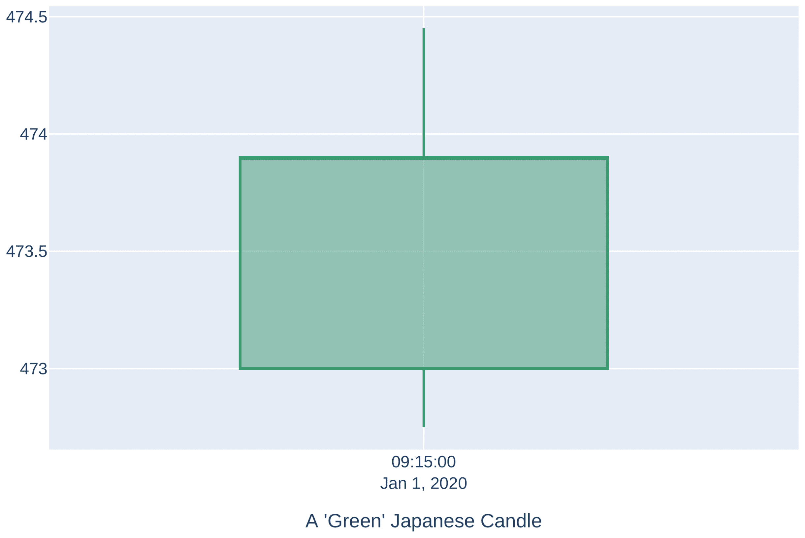

3.  从`historical_data`的一行中创建一个红色蜡烛:

```py
# A 'Red' Japanese Candle
>>> candle_red = historical_data.iloc[1:2,:]     
# Only 2nd ROW of historical data
>>> plot_candlestick_chart(candle_red, 
                           PlotType.OHLC, 
                           "A 'Red' Japanese Candle")
```

这将为您提供以下输出:

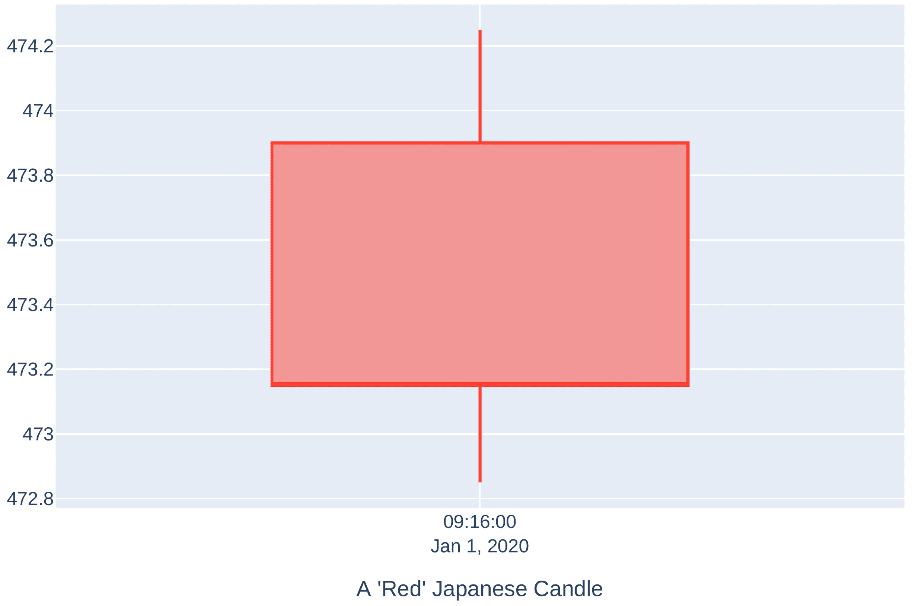

4.  为仪器的历史数据绘制图表:

```py
>>> plot_candlestick_chart(historical_data, 
                           PlotType.OHLC, 
                           'Historical Data | '
                           'Japanese Candlesticks Pattern | '
                           'NSE:TATASTEEL | 1st Jan, 2020 | '
                           'Candle Interval: 1 Minute')
```

这将为您提供以下输出:


5.  为另一台仪器的历史数据绘制图表:

```py
>>> instrument2 = broker_connection.get_instrument('NSE', 'INFY')
>>> historical_data = \
        broker_connection.get_historical_data(instrument2, 
                                              'minute', 
                                              '2020-01-01', 
                                              '2020-01-01')
>>> plot_candlestick_chart(historical_data, 
                           PlotType.OHLC,
                           'Historical Data | '
                           'Japanese Candlesticks Pattern | '
                           'NSE:INFY | 1st Jan, 2020 | '
                           'Candle Interval: 1 Minute')
```

这将为您提供以下输出:


6.  为另一台仪器的历史数据绘制图表:

```py
>>> instrument3 = broker_connection.get_instrument('NSE',
                                                   'ICICIBANK')
>>> historical_data = 
            broker_connection.get_historical_data(instrument3, 
                                                  'minute', 
                                                  '2020-01-01', 
                                                  '2020-01-01')
>>> plot_candlestick_chart(historical_data, PlotType.OHLC, 
                           'Historical Data | '
                           'Japanese Candlesticks Pattern | '
                           'NSE:ICICIBANK | 1st Jan, 2020 | '
                           'Candle Size: 1 Minute')
```

这将为您提供以下输出:


## 它是如何工作的…

在*步骤 1* 中，您导入了`plot_candlestick_chart`，一个用于绘制烛台模式图表的快速实用函数，以及`PlotType`，一个用于各种烛台模式的枚举。接下来的两个步骤介绍了两种类型的烛台，或者简称为**蜡烛**——绿色蜡烛和红色蜡烛。正如我们前面提到的，历史数据中的每个条目都是一根蜡烛。这两个步骤有选择地从数据中提取绿色和红色蜡烛。(请注意，如果您为`historical_data`选择不同的持续时间，传递给`historical_data.iloc`的索引将会不同，例如在*中使用代理 API* 方法获取历史数据)。如果日本蜡烛的**收盘价**高于其**开盘价**，那么它就是绿色的。绿色蜡烛也被称为**看涨**蜡烛，因为它表明在此期间价格看涨，意味着上涨。如果日本蜡烛的收盘价格低于开盘价，那么它就是红色的。红色蜡烛也被称为**看跌**蜡烛，因为它表明在此期间价格看跌，意味着下跌。

在*步骤 4* 中，使用`plot_candlestick_chart()`函数绘制出`historical_data`保存的完整历史数据。该图表是多个烛台的组合，每个烛台的长度不同。因此，这样的图表被称为**烛台模式图**。请注意，蜡烛线间隔是 1 分钟，这意味着时间戳以 1 分钟的间隔均匀分布。*步骤 5* 和 *6* 为`NSE:INFY`和`NSE:ICICIBANK`乐器演示相似的 1 分钟蜡烛间隔烛台模式图。

如果你是烛台模式图表的新手，我建议你与本章 Jupyter 笔记本中的图表互动，该笔记本位于 https://github . com/packt publishing/Python-algorithm-Trading-Cookbook/blob/master/CHAPTER 04/CHAPTER % 204 . ipynb。尝试将鼠标悬停在多根蜡烛上以查看它们的值，并放大/缩小或平移到不同的持续时间以更清楚地查看蜡烛。试着把这些蜡烛的颜色和食谱上的描述联系起来。如果 Jupyter 笔记本中的图表由于某种原因没有自动为你渲染，你可以下载这个 html 文件，对于同一个 Jupyter 笔记本，在你的浏览器中打开并与之交互:[https://github . com/packt publishing/Python-Algorithmic-Trading-Cookbook/blob/master/CHAPTER 04/CHAPTER % 204 . ipynb](https://github.com/PacktPublishing/Python-Algorithmic-Trading-Cookbook/blob/master/Chapter04/CHAPTER%204.ipynb)。

# 获取蜡烛间隔变化的日本烛台模式

金融工具的历史数据可以以具有不同蜡烛间隔的日本蜡烛图的形式进行分析。经纪人通常支持 1 分钟、3 分钟、5 分钟、10 分钟、15 分钟、30 分钟、1 小时、1 天等蜡烛间隔。较短的蜡烛线间隔暗示局部价格运动趋势，而较长的蜡烛线间隔表明整体价格运动趋势。根据算法交易策略，你可能需要更短或更长的蜡烛线间隔。1 分钟的蜡烛间隔通常是可用的最小蜡烛间隔。这个配方展示了一个金融工具在一天中不同蜡烛线间隔的历史数据。

## 做好准备

确保`broker_connection`对象在您的 Python 名称空间中可用。参考本章的*技术要求*部分，了解如何设置`broker_connection`。

## 怎么做…

我们为此配方执行以下步骤:

1.  导入必要的模块:

```py
>>> from pyalgotrading.utils.func import plot_candlestick_chart, PlotType
```

2.  获取乐器:

```py
>>> instrument = broker_connection.get_instrument('NSE', 
                                                  'TATASTEEL')
```

3.  以 1 分钟烛光间隔为仪器的历史数据绘制图表:

```py
>>> historical_data_1minute = \
        broker_connection.get_historical_data(instrument, 
                                              'minute', 
                                              '2020-01-01', 
                                              '2020-01-01')
>>> plot_candlestick_chart(historical_data_1minute, 
                           PlotType.OHLC, 
                           'Historical Data | '
                           'Japanese Candlesticks Pattern | '
                           'NSE:TATASTEEL | '
                           '1st Jan, 2020 | '
                           'Candle Interval: 1 Minute')
```

您将获得以下输出:

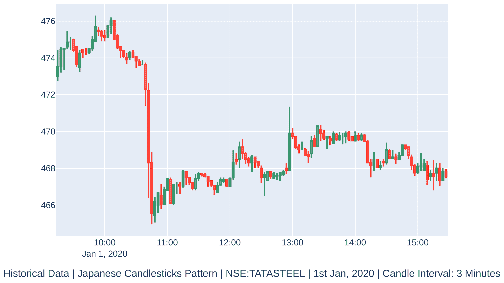

4.  以 3 分钟烛光间隔绘制仪器历史数据图表:

```py
>>> historical_data_3minutes = \
            broker_connection.get_historical_data(instrument, 
                                                  '3minute', 
                                                  '2020-01-01', 
                                                  '2020-01-01')
>>> plot_candlestick_chart(historical_data_3minutes, 
                           PlotType.OHLC, 
                           'Historical Data | '
                           'Japanese Candlesticks Pattern | '
                           'NSE:TATASTEEL | '
                           '1st Jan, 2020 | '
                           'Candle Interval: 3 Minutes')
```

您将获得以下输出:


5.  以 5 分钟烛光间隔绘制仪器历史数据图表:

```py
>>> historical_data_5minutes = \
            broker_connection.get_historical_data(instrument, 
                                                  '5minute', 
                                                  '2020-01-01', 
                                                  '2020-01-01')
>>> plot_candlestick_chart(historical_data_5minutes, 
                           PlotType.OHLC, 
                           'Historical Data | '
                           'Japanese Candlesticks Pattern | '
                           'NSE:TATASTEEL | '
                           '1st Jan, 2020 | '
                           'Candle Interval: 5 Minutes')
```

您将获得以下输出:


6.  以 10 分钟烛光间隔为仪器的历史数据绘制图表:

```py
>>> historical_data_10minutes = \
            broker_connection.get_historical_data(instrument, 
                                                  '10minute', 
                                                  '2020-01-01', 
                                                  '2020-01-01')
>>> plot_candlestick_chart(historical_data_10minutes, 
                           PlotType.OHLC, 
                           'Historical Data | '
                           'Japanese Candlesticks Pattern | '
                           'NSE:TATASTEEL | '
                           '1st Jan, 2020 | '
                           'Candle Interval: 10 Minutes')
```

您将获得以下输出:


7.  以 15 分钟烛光间隔绘制仪器历史数据图表:

```py
>>> historical_data_15minutes = \
            broker_connection.get_historical_data(instrument, 
                                                  '15minute', 
                                                  '2020-01-01', 
                                                  '2020-01-01')
>>> plot_candlestick_chart(historical_data_15minutes, 
                           PlotType.OHLC, 
                           'Historical Data | '
                           'Japanese Candlesticks Pattern | '
                           'NSE:TATASTEEL | '
                           '1st Jan, 2020 | '
                           'Candle Interval: 15 Minutes')
```

您将获得以下输出:

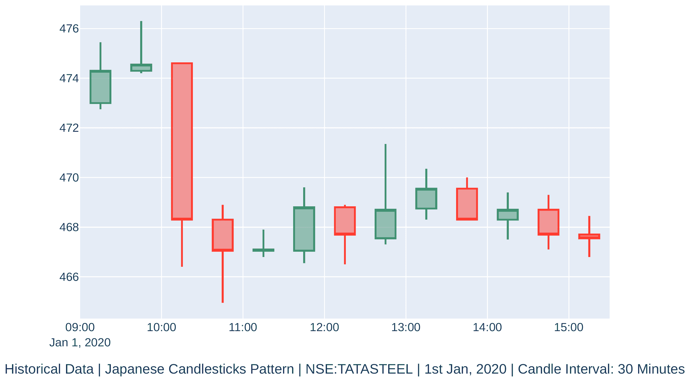

8.  以 30 分钟烛光间隔绘制仪器历史数据图表:

```py
>>> historical_data_30minutes = \
            broker_connection.get_historical_data(instrument, 
                                                  '30minute', 
                                                  '2020-01-01', 
                                                  '2020-01-01')
>>> plot_candlestick_chart(historical_data_30minutes, 
                           PlotType.OHLC, 
                           'Historical Data | '
                           'Japanese Candlesticks Pattern | '
                           'NSE:TATASTEEL | '
                           '1st Jan, 2020 | '
                           'Candle Interval: 30 Minutes')
```

您将获得以下输出:

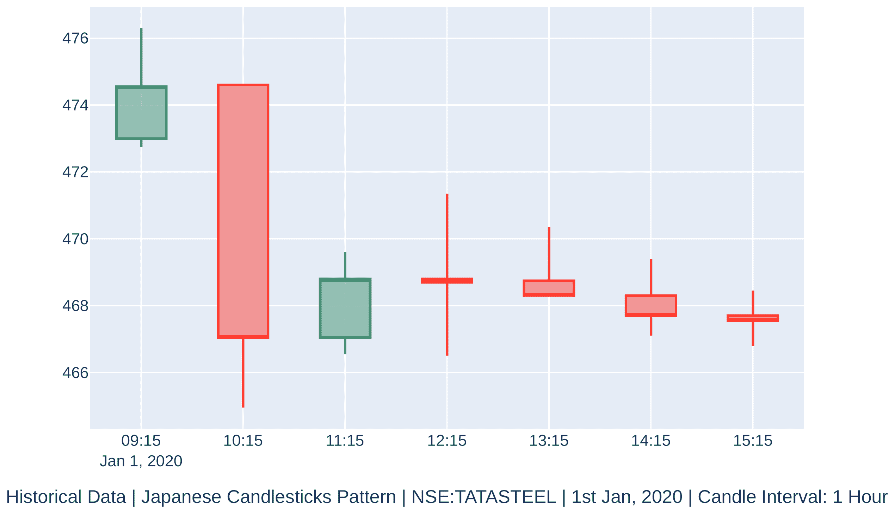

9.  以 1 小时烛光间隔为仪器的历史数据绘制图表:

```py
>>> historical_data_1hour = \
            broker_connection.get_historical_data(instrument, 
                                                  'hour', 
                                                  '2020-01-01', 
                                                  '2020-01-01')
>>> plot_candlestick_chart(historical_data_1hour, 
                           PlotType.OHLC, 
                           'Historical Data | '
                           'Japanese Candlesticks Pattern | '
                           'NSE:TATASTEEL | '
                           '1st Jan, 2020 | '
                           'Candle Interval: 1 Hour')
```

10.  以 1 天蜡烛间隔绘制仪器历史数据图表:

```py
>>> historical_data_day = \
            broker_connection.get_historical_data(instrument, 
                                                  'day', 
                                                  '2020-01-01', 
                                                  '2020-01-01')
>>> plot_candlestick_chart(historical_data_day, 
                           PlotType.OHLC, 
                           'Historical Data | '
                           'Japanese Candlesticks Pattern | '
                           'NSE:TATASTEEL | '
                           '1st Jan, 2020 | '
                           'Candle Interval: Day')
```

您将获得以下输出，这是一根蜡烛线:

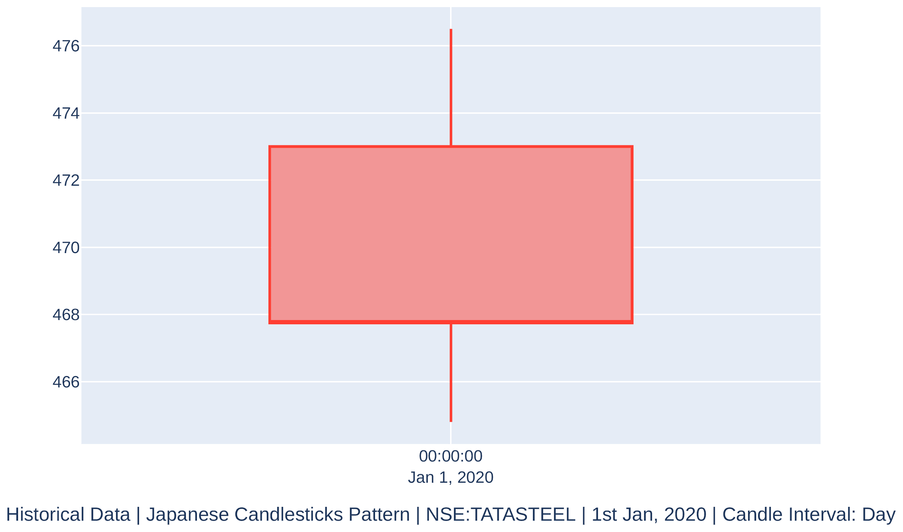

## 它是如何工作的…

在*步骤 1* 中，您导入了`plot_candlestick_chart`，一个用于绘制烛台模式图表的快速实用函数，以及`PlotType`，一个用于各种烛台模式的枚举。在*步骤 2* 中，`broker_connection`的`get_instrument()`方法获取一个乐器并赋予它一个新的属性`instrument`。这个对象是`Instrument`类的一个实例。调用`get_instrument()`需要的两个参数是交易所(`'NSE'`)和交易符号(`'TATASTEEL'`)。*步骤 3* 和 *4* 获取并绘制蜡烛间隔的历史数据；即 1 分钟、3 分钟、5 分钟、10 分钟、15 分钟、30 分钟、1 小时和 1 天。您可以使用`get_historical_data()`方法来获取相同仪器的历史数据以及相同的开始和结束日期，只是蜡烛间隔不同。您使用`plot_candlestick_chart()`函数来绘制日本烛台模式图表。随着蜡烛线间隔的增加，您可以观察到图表之间的以下差异:

*   烛台的总数减少了。
*   图表中由于价格突然波动而出现的尖峰被最小化。较小的蜡烛线间隔图有更多的尖峰，因为它们专注于局部趋势，而较大的蜡烛线间隔图有更少的尖峰，也更平滑。
*   股票价格的长期趋势变得明显。
*   决策可能会变得更慢，因为你必须等待更长时间才能获得新的蜡烛线数据。较慢的决策可能需要，也可能不需要，这取决于策略。例如，为了确认趋势，使用具有较小蜡烛线间隔(比如 3 分钟)的数据和具有较大蜡烛线间隔(比如 15 分钟)的数据的组合将是理想的。另一方面，为了在日内交易中抓住机会，蜡烛线间隔较大的数据，如 1 小时或 1 天，是不可取的。
*   相邻蜡烛线的价格范围(y 轴价差)可能重叠，也可能不重叠。
*   所有时间戳的时间间隔相等(在市场时间内)。

# 使用换行符烛台模式获取历史数据

金融工具的历史数据可以以折线蜡烛图的形式进行分析，这是一种专注于价格运动的蜡烛图。这与日本烛台模式不同，日本烛台模式侧重于时间运动。经纪人通常不会通过 API 提供换行符烛台模式的历史数据。经纪人通常使用日本烛台模式提供历史数据，需要将其转换为折线烛台模式。较短的蜡烛线间隔暗示局部价格运动趋势，而较长的蜡烛线间隔表明整体价格运动趋势。根据你的算法交易策略，你可能需要蜡烛线间隔或大或小。1 分钟的蜡烛间隔通常是可用的最小蜡烛间隔。

换行符烛台模式的工作方式如下:

1.  每个蜡烛只有`open`和`close`属性。
2.  用户定义一个`Number of Lines` ( *n* )设置，通常取为`3`。
3.  在每根蜡烛线间隔结束时，如果股价高于前一根 *n* 分割线蜡烛线的最高点，就会形成一根绿色蜡烛线。
4.  在每根蜡烛线间隔的末端，如果股价低于前一根 *n* 分割线蜡烛线的最低点，就会形成一根红色蜡烛线。
5.  在每个蜡烛间隔结束时，如果点 3 和点 4 都不满足，则不形成蜡烛。因此，时间戳不需要等间距。

这个食谱展示了我们如何使用代理 API 使用日本烛台模式获取历史数据，将历史数据转换成换行符烛台模式，并绘制它。这是对多个蜡烛间隔进行的。

## 做好准备

确保`broker_connection`对象在您的 Python 名称空间中可用。参考本章的*技术要求*部分，了解如何设置`broker_connection`。

## 怎么做…

我们为此配方执行以下步骤:

1.  导入必要的模块:

```py
>>> from pyalgotrading.utils.func import plot_candlestick_chart, PlotType
>>> from pyalgotrading.utils.candlesticks.linebreak import Linebreak
```

2.  获取仪器的历史数据，并将其转换为换行数据:

```py
>>> instrument = broker_connection.get_instrument('NSE', 
                                                  'TATASTEEL')
>>> historical_data_1minute = \
            broker_connection.get_historical_data(instrument, 
                                                  'minute', 
                                                  '2019-12-01', 
                                                  '2019-12-31')
>>> historical_data_1minute_linebreak = \
                              Linebreak(historical_data_1minute)
>>> historical_data_1minute_linebreak
```

您将获得以下输出:

```py
       close       open                   timestamp
0     424.00     424.95   2019-12-02 09:15:00+05:30
1     424.50     424.00   2019-12-02 09:16:00+05:30
2     425.75     424.80   2019-12-02 09:17:00+05:30
3     423.75     424.80   2019-12-02 09:19:00+05:30
4     421.70     423.75   2019-12-02 09:20:00+05:30 
        …         …                ....
1058  474.90     474.55   2019-12-31 10:44:00+05:30
1059  471.60     474.55   2019-12-31 11:19:00+05:30
1060  471.50     471.60   2019-12-31 14:19:00+05:30
1061  471.35     471.50   2019-12-31 15:00:00+05:30
1062  471.00     471.35   2019-12-31 15:29:00+05:30
```

3.  从`historical_data`的一行中创建一个绿色折线蜡烛线:

```py
>>> candle_green_linebreak = historical_data_1minute_linebreak.iloc[1:2,:]            
# Only 2nd ROW of historical data
>>> plot_candlestick_chart(candle_green_linebreak, 
                           PlotType.LINEBREAK, 
                           "A 'Green' Line Break Candle")
```

您将获得以下输出:

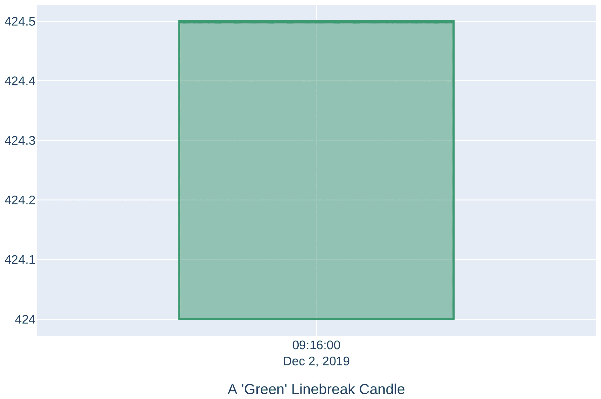

4.  从`historical_data`的一行创建一个红色断线蜡烛:

```py
>>> candle_red_linebreak = historical_data_1minute_linebreak.iloc[:1,:]            
# Only 1st ROW of historical data
>>> plot_candlestick_chart(candle_red_linebreak, 
                           PlotType.LINEBREAK, 
                           "A 'Red' Line Break Candle")
```

您将获得以下输出:


5.  以 1 分钟烛光间隔为仪器的历史数据绘制图表:

```py
>>> plot_candlestick_chart(historical_data_1minute_linebreak, 
                           PlotType.LINEBREAK, 
                           'Historical Data | '
                           'Line Break Candlesticks Pattern | '
                           'NSE:TATASTEEL | '
                           'Dec, 2019 | '
                           'Candle Interval: 1 Minute', True)
```

您将获得以下输出:

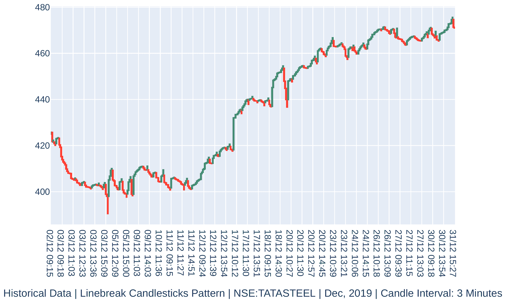

6.  以 3 分钟烛光间隔绘制仪器历史数据图表:

```py
>>> historical_data_3minutes = \
            broker_connection.get_historical_data(instrument, 
                                                  '3minute', 
                                                  '2019-12-01', 
                                                  '2019-12-31')
>>> historical_data_3minutes_linebreak = \
                    Linebreak(historical_data_3minutes)
>>> plot_candlestick_chart(historical_data_3minutes_linebreak, 
                           PlotType.LINEBREAK, 
                           'Historical Data | '
                           'Line Break Candlesticks Pattern | '
                           'NSE:TATASTEEL | '
                           'Dec, 2019 | '
                           'Candle Interval: 3 Minutes', True)
```

您将获得以下输出:

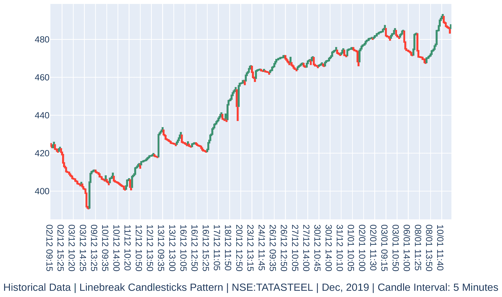

7.  以 5 分钟烛光间隔绘制仪器历史数据图表:

```py
>>> historical_data_5minutes = \
            broker_connection.get_historical_data(instrument, 
                                                  '5minute', 
                                                  '2019-12-01', 
                                                  '2020-01-10')
>>> historical_data_5minutes_linebreak = \
                            Linebreak(historical_data_5minutes)
>>> plot_candlestick_chart(historical_data_5minutes_linebreak, 
                           PlotType.LINEBREAK, 
                           'Historical Data | '
                           'Line Break Candlesticks Pattern | '
                           'NSE:TATASTEEL | '
                           'Dec, 2019 | '
                           'Candle Interval: 5 Minutes', True)
```

您将获得以下输出:

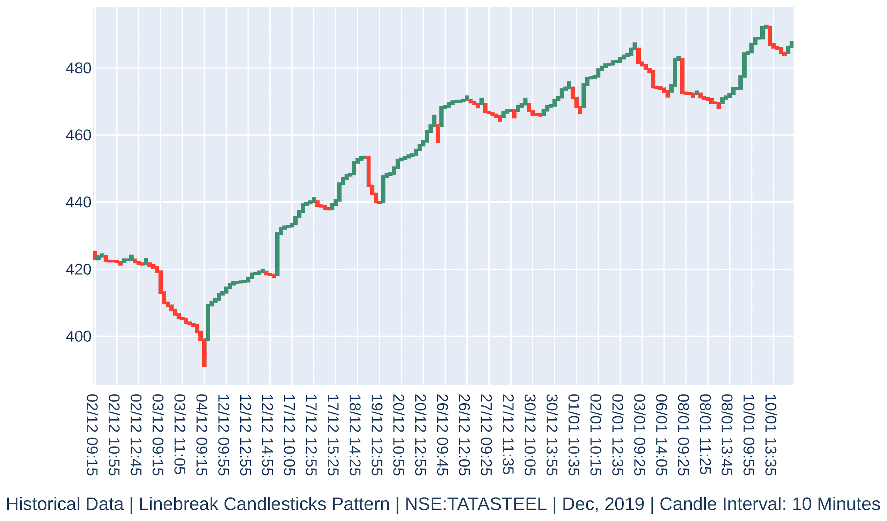

8.  以 10 分钟烛光间隔为仪器的历史数据绘制图表:

```py
>>> historical_data_10minutes = \
            broker_connection.get_historical_data(instrument, 
                                                  '10minute', 
                                                  '2019-12-01', 
                                                  '2020-01-10')
>>> historical_data_10minutes_linebreak = \
                            Linebreak(historical_data_10minutes)
>>> plot_candlestick_chart(historical_data_10minutes_linebreak, 
                           PlotType.LINEBREAK, 
                           'Historical Data | '
                           'Line Break Candlesticks Pattern | '
                           'NSE:TATASTEEL | '
                           'Dec, 2019 | '
                           'Candle Interval: 10 Minutes', True)
```

您将获得以下输出:

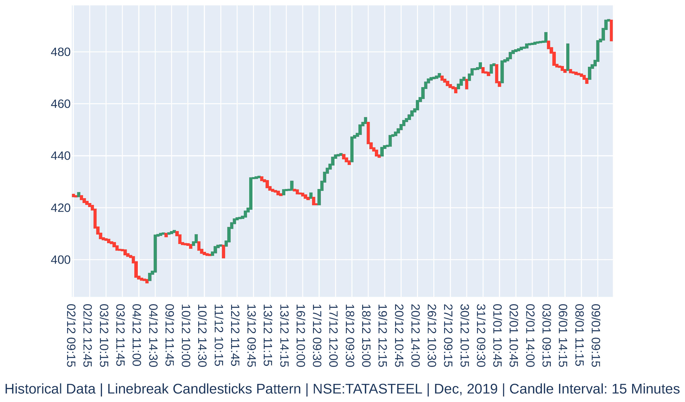

9.  以 15 分钟烛光间隔绘制仪器历史数据图表:

```py
>>> historical_data_15minutes = \
            broker_connection.get_historical_data(instrument, 
                                                  '15minute', 
                                                  '2019-12-01', 
                                                  '2020-01-10')
>>> historical_data_15minutes_linebreak = \
                            Linebreak(historical_data_15minutes)
>>> plot_candlestick_chart(historical_data_15minutes_linebreak, 
                           PlotType.LINEBREAK, 
                           'Historical Data | '
                           'Line Break Candlesticks Pattern | '
                           'NSE:TATASTEEL | '
                           'Dec, 2019 | '
                           'Candle Interval: 15 Minutes', True)
```

您将获得以下输出:


10.  以 30 分钟烛光间隔绘制仪器历史数据图表:

```py
>>> historical_data_30minutes = \
            broker_connection.get_historical_data(instrument, 
                                                  '30minute', 
                                                  '2019-12-01', 
                                                  '2020-01-10')
>>> historical_data_30minutes_linebreak = \
                            Linebreak(historical_data_30minutes)
>>> plot_candlestick_chart(historical_data_30minutes_linebreak, 
                           PlotType.LINEBREAK, 
                           'Historical Data | '
                           'Line Break Candlesticks Pattern | '
                           'NSE:TATASTEEL | '
                           'Dec, 2019 | '
                           'Candle Interval: 30 Minutes', True)
```

您将获得以下输出:


11.  以 1 小时烛光间隔为仪器的历史数据绘制图表:

```py
>>> historical_data_1hour = \
            broker_connection.get_historical_data(instrument, 
                                                  'hour', 
                                                  '2019-12-01', 
                                                  '2020-01-10')
>>> historical_data_1hour_linebreak = \
                                Linebreak(historical_data_1hour)
>>> plot_candlestick_chart(historical_data_1hour_linebreak, 
                            PlotType.LINEBREAK, 
                           'Historical Data | '
                           'Line Break Candlesticks Pattern | '
                           'NSE:TATASTEEL | '
                           'Dec, 2019 | '
                           'Candle Interval: 1 Hour', True)
```

您将获得以下输出:


12.  以 1 天蜡烛间隔绘制仪器历史数据图表:

```py
>>> historical_data_day = \
            broker_connection.get_historical_data(instrument, 
                                                  'day', 
                                                  '2019-12-01', 
                                                  '2020-01-10')
>>> historical_data_day_linebreak = \
                                Linebreak(historical_data_day)
>>> plot_candlestick_chart(historical_data_day_linebreak, 
                           PlotType.LINEBREAK, 
                           'Historical Data | '
                           'Line Break Candlesticks Pattern | '
                           'NSE:TATASTEEL | '
                           'Dec, 2019 | '
                           'Candle Interval: 1 Day', True)
```

您将获得以下输出:


## 它是如何工作的…

在*步骤 1* 中，您导入了`plot_candlestick_chart`，一个用于绘制烛台模式图表的快速实用函数，`PlotType`，一个用于各种烛台模式的枚举，以及`Linebreak`函数，该函数可以将历史数据从日本烛台模式转换为分行烛台模式。在*步骤 2* 中，您使用`broker_connection`的`get_instrument()`方法获取一个乐器，并将其分配给一个新属性`instrument`。这个对象是`Instrument`类的一个实例。调用 get_instrument()需要的两个参数是交易所(`'NSE'`)和交易符号(`'TATASTEEL'`)。接下来，您使用`broker_connection`对象的`get_historical_data()`方法来获取仪器在 2019 年 12 月期间的历史数据，蜡烛间隔为 1 分钟。返回的时序数据是日本烛台模式的形式。`Linebreak()`函数将该数据转换成换行符烛台模式，另一个`pandas.DataFrame`对象。你把它分配给`historical_data_1minute_linebreak`。注意到`historical_data_1minute_linebreak`只有`timestamp`、`open`和`close`列。此外，注意时间戳不是等距的，因为换行符蜡烛线是基于价格变动而不是时间。在*步骤 3* 和 *4* 中，您从数据中选择性地提取一根绿色和一根红色蜡烛。(请注意，如果您为本章第一个配方中获取的`historical_data`选择不同的持续时间，传递给`historical_data.iloc`的指数将会不同。)观察蜡烛没有阴影(在主蜡烛体两侧延伸的线条)，因为蜡烛只有`open`和`close`属性。在*步骤 5* 中，使用`plot_candlestick_chart()`功能绘制`historical_data`保存的完整历史数据。

在*步骤 6* 直到 *12* 中，您使用日本烛台模式获取历史数据，将其转换为折线图，并绘制 3 分钟、5 分钟、10 分钟、15 分钟、30 分钟、1 小时和 1 天蜡烛间隔的转换数据。随着蜡烛线间隔的增加，观察图表之间的以下差异和相似之处:

*   烛台的总数减少了。
*   图表中由于价格突然波动而出现的尖峰被最小化。较小的蜡烛线间隔图有更多的尖峰，因为它们专注于局部趋势，而较大的蜡烛线间隔图有更少的尖峰，也更平滑。
*   股票价格的长期趋势变得明显。

*   决策可能会变得更慢，因为你必须等待更长时间才能获得新的蜡烛线数据。较慢的决策可能需要，也可能不需要，这取决于策略。例如，为了确认趋势，使用具有较小蜡烛线间隔(比如 3 分钟)的数据和具有较大蜡烛线间隔(比如 15 分钟)的数据的组合将是理想的。另一方面，为了抓住日内交易的机会，蜡烛线间隔大的数据，比如 1 小时或 1 天，是不可取的。
*   两根相邻蜡烛线的价格范围(y 轴价差)彼此不重叠。相邻的蜡烛总是共用一端。
*   没有一个时间戳需要在时间上等距(不像日本烛台模式),因为蜡烛是基于价格运动而不是时间运动形成的。

如果您有兴趣了解换行蜡烛的数学和实现，请参考位于[https://github . com/algo bulls/pyalgotrading/blob/master/pyalgotrading/utils/candlesticks/Line Break . py](https://github.com/algobulls/pyalgotrading/blob/master/pyalgotrading/utils/candlesticks/linebreak.py)的`pyalgotrading`包中的源代码。

# 使用 Renko 烛台模式获取历史数据

金融工具的历史数据可以以伦科烛台模式的形式进行分析，这是一种专注于价格运动的烛台模式。这与日本烛台模式不同，它侧重于时间运动。经纪人通常不会通过 API 提供 Renko 烛台模式的历史数据。经纪人通常使用日本烛台模式来提供历史数据，这需要转换为 Renko 烛台模式。较短的蜡烛线间隔暗示局部价格运动趋势，而较长的蜡烛线间隔表明整体价格运动趋势。根据你的算法交易策略，你可能需要蜡烛线间隔或大或小。1 分钟的蜡烛间隔通常是可用的最小蜡烛间隔。

Renko 烛台模式的工作原理如下:

1.  每根蜡烛只有`open`和`close`属性。
2.  您定义了一个**砖块计数** ( `b`)设置，通常设置为`2`。
3.  每根蜡烛总是固定的，等于`Brick Count`。因此，蜡烛在这里也被称为**砖**。

4.  在每根蜡烛线的末端，如果股价比前一个砖块的最高点高`b`点，就形成了一个绿色砖块。如果价格在一个蜡烛线区间内远远高于`b`点，那么就会形成许多 Renko 砖块来解释价格变化。
    例如，假设价格比前一个砖块的高点高 21 点。如果砖块的大小是`2`，那么 10 个 Renko 砖块将会以相同的时间戳形成，以说明 20 点的变化。对于剩下的 1 点变化(21-20)，在价格至少上涨 1 点之前，不会形成砖块。
5.  在每个蜡烛线间隔结束时，如果股价比前一根 Renko 蜡烛线的最低点低`b`点，就会形成一根红色蜡烛线。如果价格在一个蜡烛线区间内远低于`b`点，那么就会形成许多 Renko 砖块来解释价格变化。
    例如，假设价格比之前的最高价格低 21 点。如果砖块的大小是`2`，那么 10 个 Renko 砖块将会以相同的时间戳形成，以说明 20 点的变化。对于剩下的 1 点变化(21-20)，在价格至少下降 1 点之前，不会形成砖块。
6.  没有两根相邻的蜡烛互相重叠。相邻的蜡烛总是共用一端。

7.  没有一个时间戳需要等间距(不像日本烛台模式),因为蜡烛是基于价格运动而不是时间运动形成的。此外，与其他模式不同，可能会有多个带有相同时间戳的蜡烛线。

这个食谱展示了如何使用代理 API 获取日本烛台模式的历史数据，以及如何使用 Renko 烛台模式为各种蜡烛间隔转换和绘制历史数据。

## 做好准备

确保`broker_connection`对象在您的 Python 名称空间中可用。参考本章的*技术要求*部分，了解如何设置`broker_connection`。

## 怎么做…

我们为此配方执行以下步骤:

1.  导入必要的模块:

```py
>>> from pyalgotrading.utils.func import plot_candlestick_chart, PlotType
>>> from pyalgotrading.utils.candlesticks.renko import Renko
```

2.  获取仪器的历史数据，并将其转换为 Renko 数据:

```py
>>> instrument = broker_connection.get_instrument('NSE', 
                                                  'TATASTEEL')
>>> historical_data_1minute = \
            broker_connection.get_historical_data(instrument, 
                                                  'minute', 
                                                  '2019-12-01', 
                                                  '2020-01-10')
>>> historical_data_1minute_renko = Renko(historical_data_1minute)
>>> historical_data_1minute_renko
```

您将获得以下输出:

```py
      close     open                     timestamp
0     424.0   424.95     2019-12-02 09:15:00+05:30
1     422.0   424.00     2019-12-02 09:20:00+05:30
2     426.0   424.00     2019-12-02 10:00:00+05:30
3     422.0   424.00     2019-12-02 10:12:00+05:30
4     420.0   422.00     2019-12-02 15:28:00+05:30
       ...     ...          ...        ...
186   490.0   488.00     2020-01-10 10:09:00+05:30
187   492.0   490.00     2020-01-10 11:41:00+05:30
188   488.0   490.00     2020-01-10 13:31:00+05:30
189   486.0   488.00     2020-01-10 13:36:00+05:30
190   484.0   486.00     2020-01-10 14:09:00+05:30
```

3.  从`historical_data`的一行中创建一个绿色的 Renko 蜡烛:

```py
>>> candle_green_renko = historical_data_1minute_renko.iloc[2:3,:]            
# Only 3rd ROW of historical data
>>> plot_candlestick_chart(candle_green_renko, 
                           PlotType.RENKO, 
                           "A Green 'Renko' Candle")
```

您将获得以下输出:


4.  从`historical_data`的一行中创建一个红色的 Renko 蜡烛:

```py
>>> plot_candlestick_chart(historical_data_1minute_renko, 
                           PlotType.RENKO, 
                           'Historical Data | '
                           'Renko Candlesticks Pattern | '
                           'NSE:TATASTEEL | '
                           'Dec, 2019 | '
                           'Candle Interval: 1 Minute', True)
```

您将获得以下输出:

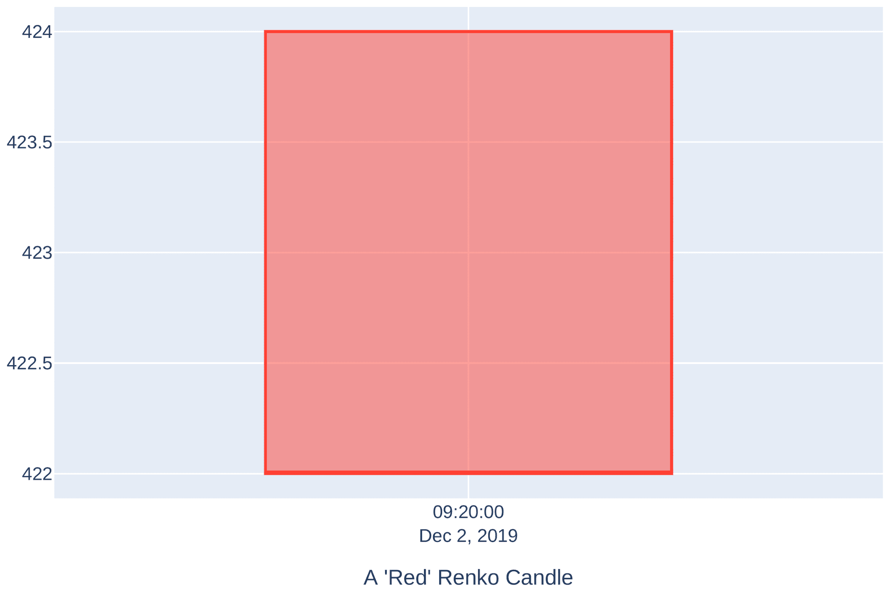

5.  以 1 分钟烛光间隔为仪器的历史数据绘制图表:

```py
>>> historical_data_3minutes = \
            broker_connection.get_historical_data(instrument, 
                                                  '3minute', 
                                                  '2019-12-01', 
                                                  '2019-12-31')
>>> historical_data_3minutes_renko = \
                                Renko(historical_data_3minutes)
>>> plot_candlestick_chart(historical_data_3minutes_renko, 
                           PlotType.RENKO, 
                           'Historical Data | '
                           'Renko Candlesticks Pattern | '
                           'NSE:TATASTEEL | '
                           'Dec, 2019 | '
                           'Candle Interval: 3 Minutes', True)
```

您将获得以下输出:


6.  以 3 分钟烛光间隔绘制仪器历史数据图表:

```py
>>> historical_data_5minutes = \
            broker_connection.get_historical_data(instrument, 
                                                  '5minute', 
                                                  '2019-12-01', 
                                                  '2019-12-31')
>>> historical_data_5minutes_renko = \
                                Renko(historical_data_5minutes)
>>> plot_candlestick_chart(historical_data_5minutes_renko, 
                           PlotType.RENKO, 
                           'Historical Data | '
                           'Renko Candlesticks Pattern | '
                           'NSE:TATASTEEL | '
                           'Dec, 2019 | '
                           'Candle Interval: 5 Minutes', True)
```

您将获得以下输出:

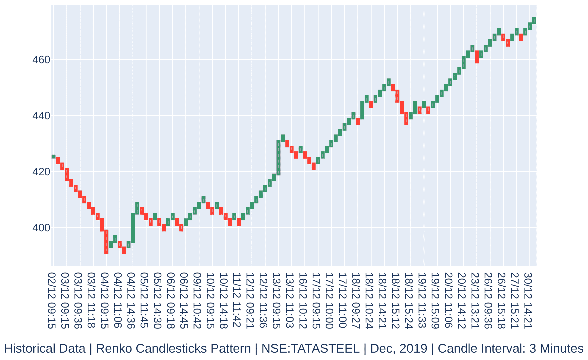

7.  以 5 分钟烛光间隔绘制仪器历史数据图表:

```py
>>> historical_data_10minutes = \
            broker_connection.get_historical_data(instrument, 
                                                  '10minute', 
                                                  '2019-12-01', 
                                                  '2019-12-31')
>>> historical_data_10minutes_renko = \
                                Renko(historical_data_10minutes)
>>> plot_candlestick_chart(historical_data_10minutes_renko, 
                           PlotType.RENKO, 
                           'Historical Data | '
                           'Renko Candlesticks Pattern | '
                           'NSE:TATASTEEL | '
                           'Dec, 2019 | '
                           'Candle Interval: 10 Minutes', True)
```

您将获得以下输出:


8.  以 10 分钟烛光间隔为仪器的历史数据绘制图表:

```py
>>> historical_data_15minutes = \
            broker_connection.get_historical_data(instrument, 
                                                  '15minute', 
                                                  '2019-12-01', 
                                                  '2019-12-31')
>>> historical_data_15minutes_renko = \
                               Renko(historical_data_15minutes)
>>> plot_candlestick_chart(historical_data_15minutes_renko, 
                           PlotType.RENKO, 
                           'Historical Data | '
                           'Renko Candlesticks Pattern | '
                           'NSE:TATASTEEL | '
                           'Dec, 2019 | '
                           'Candle Interval: 15 Minutes', True)
```

您将获得以下输出:

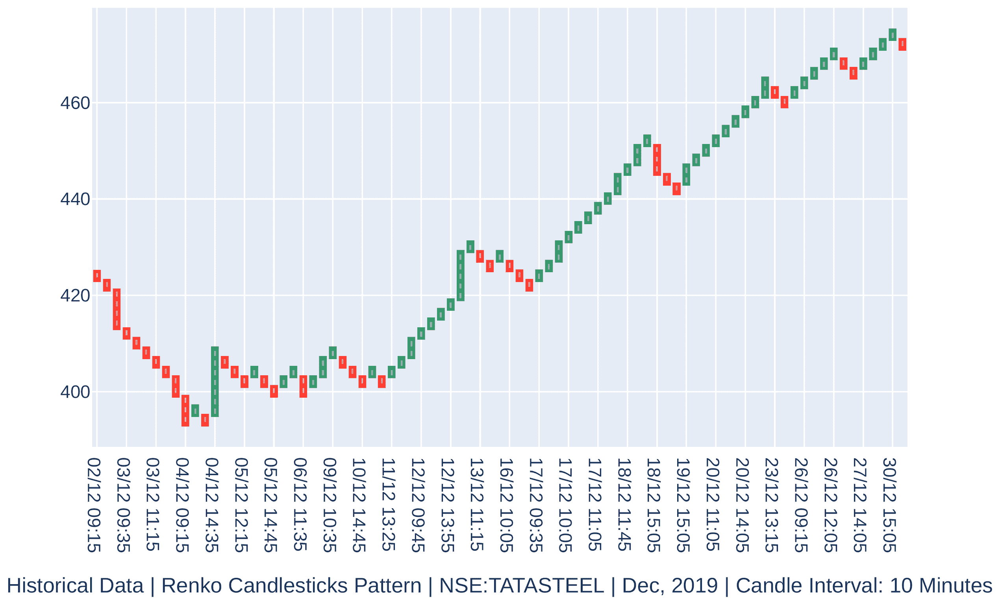

9.  以 15 分钟烛光间隔绘制仪器历史数据图表:

```py
>>> historical_data_15minutes = \
            broker_connection.get_historical_data(instrument, 
                                                  '15minute', 
                                                  '2019-12-01', 
                                                  '2019-12-31')
>>> historical_data_15minutes_renko = \
                                Renko(historical_data_15minutes)
>>> plot_candlestick_chart(historical_data_15minutes_renko, 
                           PlotType.RENKO, 
                           'Historical Data | '
                           'Renko Candlesticks Pattern | '
                           'NSE:TATASTEEL | '
                           'Dec, 2019 | '
                           'Candle Interval: 15 Minutes', True)
```

您将获得以下输出:

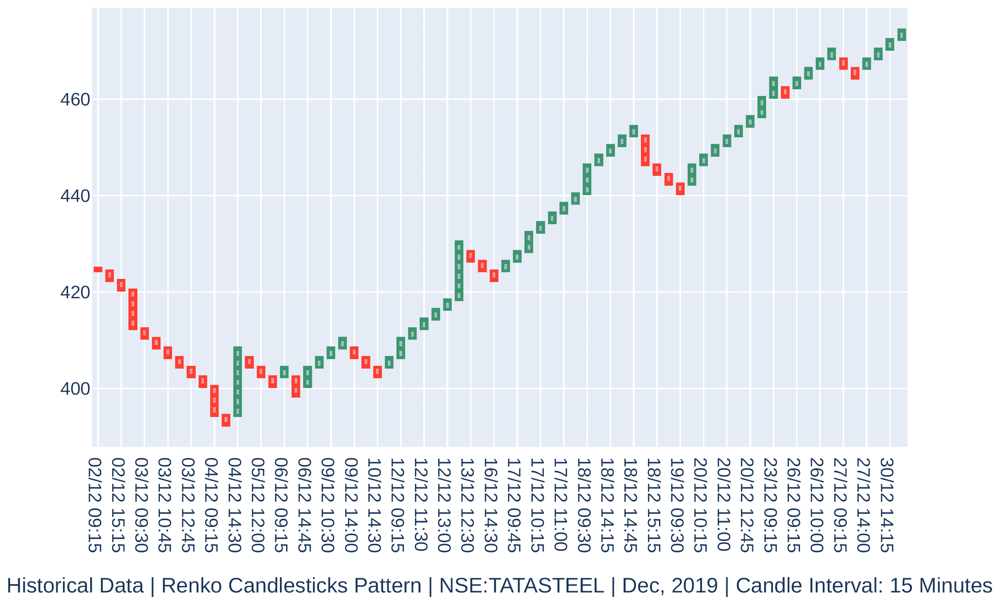

10.  以 30 分钟烛光间隔绘制仪器历史数据图表:

```py
>>> historical_data_30minutes = \
            broker_connection.get_historical_data(instrument, 
                                                  '30minute', 
                                                  '2019-12-01', 
                                                  '2019-12-31')
>>> historical_data_30minutes_renko = \
                                Renko(historical_data_30minutes)
>>> plot_candlestick_chart(historical_data_30minutes_renko, 
                           PlotType.RENKO, 
                           'Historical Data | '
                           'Renko Candlesticks Pattern | '
                           'NSE:TATASTEEL | '
                           'Dec, 2019 | '
                           'Candle Interval: 30 Minutes', True)
```

您将获得以下输出:

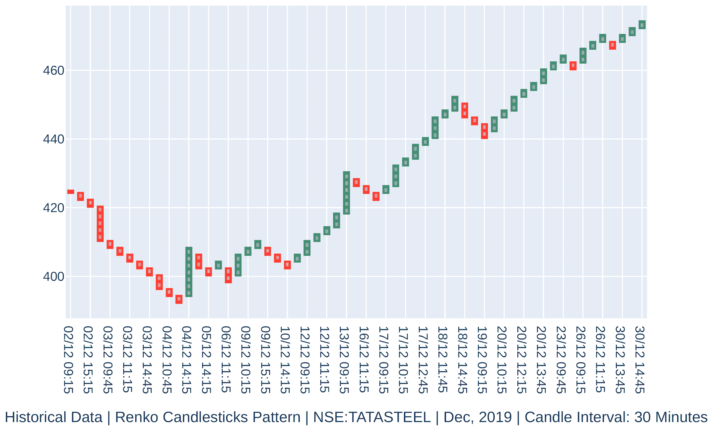

11.  以 1 小时烛光间隔为仪器的历史数据绘制图表:

```py
>>> historical_data_1hour = \
            broker_connection.get_historical_data(instrument, 
                                                  'hour', 
                                                  '2019-12-01', 
                                                  '2019-12-31')
>>> historical_data_1hour_renko = Renko(historical_data_1hour)
>>> plot_candlestick_chart(historical_data_1hour_renko, 
                           PlotType.RENKO, 
                           'Historical Data | '
                           'Renko Candlesticks Pattern | '
                           'NSE:TATASTEEL | '
                           'Dec, 2019 | '
                           'Candle Interval: 1 Hour', True)
```

您将获得以下输出:

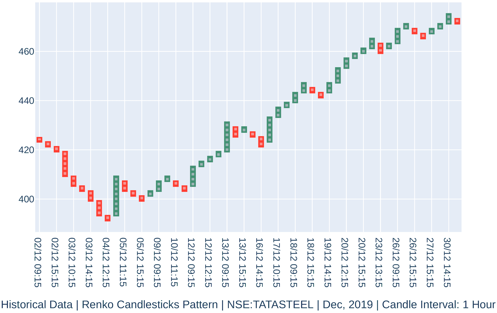

12.  以 1 天蜡烛间隔绘制仪器历史数据图表:

```py
>>> historical_data_day = \
            broker_connection.get_historical_data(instrument, 
                                                  'day', 
                                                  '2019-12-01', 
                                                  '2019-12-31')
>>> historical_data_day_renko = Renko(historical_data_day)
>>> plot_candlestick_chart(historical_data_day_renko, 
                           PlotType.RENKO, 
                           'Historical Data | '
                           'Renko Candlesticks Pattern | '
                           'NSE:TATASTEEL | '
                           'Dec, 2019 | '
                           'Candle Interval: Day', True)
```

您将获得以下输出:


## 它是如何工作的…

在*步骤 1* 中，您导入了`plot_candlestick_chart`，一个用于绘制烛台模式图表的快速实用函数，`PlotType`，一个用于各种烛台模式的枚举，以及`Renko`函数，该函数可以将历史数据从日本烛台模式转换为 Renko 烛台模式。在*步骤 2* 中，您使用`broker_connection`的`get_instrument()`方法获取一个乐器，并将其分配给一个新属性`instrument`。这个对象是`Instrument`类的一个实例。调用 get_instrument()需要的两个参数是交易所(`'NSE'`)和交易符号(`'TATASTEEL'`)。接下来，使用`broker_connection`对象的`get_historical_data()`方法获取 2019 年 12 月的持续时间的历史数据，蜡烛间隔为 1 分钟。返回的时间序列数据是日本烛台模式的形式。`Renko()`函数将该数据转换成 Renko 烛台模式，另一个`pandas.DataFrame`对象。你把它分配给`historical_data_1minute_renko`。观察`historical_data_1minute_renko`有`timestamp`、`open`和`close`栏。此外，注意时间戳不是等距的，因为 Renko 蜡烛线是基于价格变动而不是时间。在*步骤 3* 和 *4* 中，您从数据中选择性地提取一根绿色蜡烛和一根红色蜡烛(请注意，传递给本章第一个配方中获取的`historical_data.iloc`的指数。)观察蜡烛没有阴影(在主蜡烛体两侧延伸的线)，因为蜡烛只有`open`和`close`属性。在*步骤 5* 中，使用`plot_candlestick_chart()`功能绘制出`historical_data`持有的完整历史数据。

在*步骤 6* 直到 *12* 中，您使用日本烛台模式获取历史数据，将其转换为 Renko 烛台模式，并绘制 3 分钟、5 分钟、10 分钟、15 分钟、30 分钟、1 小时和 1 天蜡烛间隔的转换数据。随着蜡烛线间隔的增加，观察图表之间的以下差异和相似之处:

*   烛台的总数减少了。
*   图表中由于价格突然波动而出现的尖峰被最小化。较小的蜡烛线间隔图有更多的尖峰，因为它们专注于局部趋势，而较大的蜡烛线间隔图有更少的尖峰，也更平滑。
*   股票价格的长期趋势变得明显。

*   决策可能会变得更慢，因为你必须等待更长时间才能获得新的蜡烛线数据。较慢的决策可能需要，也可能不需要，这取决于策略。例如，为了确认趋势，使用具有较小蜡烛线间隔(比如 3 分钟)的数据和具有较大蜡烛线间隔(比如 15 分钟)的数据的组合将是理想的。另一方面，为了抓住日内交易的机会，蜡烛线间隔大的数据，比如 1 小时或 1 天，是不可取的。
*   两根相邻蜡烛线的价格范围(y 轴价差)彼此不重叠。相邻的蜡烛总是共用一端。
*   没有一个时间戳需要在时间上等距(不像日本烛台模式)，因为蜡烛是基于价格运动而不是时间运动形成的。

如果您有兴趣了解 Renko candles 的数学和实现，请参考位于[https://github . com/algo bulls/pyalgotrading/blob/master/pyalgotrading/utils/candlesticks/Renko . py](https://github.com/algobulls/pyalgotrading/blob/master/pyalgotrading/utils/candlesticks/renko.py)的`pyalgotrading`包中的源代码。

# 使用 Heikin-Ashi 烛台模式获取历史数据

金融工具的历史数据可以以 Heikin-Ashi 烛台模式的形式进行分析。经纪人通常不会通过 API 使用 Heikin-Ashi 烛台模式提供历史数据。经纪人通常使用日本烛台模式提供历史数据，这需要转换为 Heikin-Ashi 烛台模式。较短的蜡烛线间隔暗示局部价格运动趋势，而较长的蜡烛线间隔表明整体价格运动趋势。基于你的算法交易策略，你可能需要蜡烛线间隔或大或小。1 分钟的蜡烛间隔通常是可用的最小蜡烛间隔。

Heikin-Ashi 烛台模式的工作原理如下:

*   每个蜡烛都有`Close`、`Open`、`High`和`Low`属性。对于每个蜡烛，会发生以下情况:
*   `Close`计算为当前日本蜡烛的`Open`、`High`、`Low`和`Close`属性的平均值。
*   `Open`是前一个 Heikin-Ashi 蜡烛的`Open`和`Close`属性的平均值。

*   `High`是 max 的:
*   `Open`当前的 Heikin-Ashi 蜡烛
*   `Close`当前的 Heikin-Ashi 蜡烛
*   `High`当今日本的蜡烛
*   `Low`是 min 的:
*   `Open`当前的 Heikin-Ashi 蜡烛
*   `Close`当前的 Heikin-Ashi 蜡烛
*   `Low`当今日本的蜡烛
*   当`Close`高于`Open`时，形成绿色蜡烛。(这和日本烛台图案中的绿蜡烛是一样的。)
*   当`Close`低于`Open`时，形成红色蜡烛。(这和日本烛台图案中的红烛是一样的。)
*   所有时间戳的间隔相等(在市场时间内)。

这个菜谱向您展示了如何在使用代理 API 时使用日本烛台模式获取历史数据，以及如何使用 Heikin-Ashi 烛台模式为各种蜡烛间隔转换和绘制历史数据。

## 做好准备

确保`broker_connection`对象在您的 Python 名称空间中可用。参考本章的*技术要求*部分，了解如何设置`broker_connection`。

## 怎么做…

我们为此配方执行以下步骤:

1.  导入必要的模块:

```py
>>> from pyalgotrading.utils.func import plot_candlestick_chart, PlotType
>>> from pyalgotrading.utils.candlesticks.heikinashi import HeikinAshi
```

2.  获取仪器的历史数据，并将其转换为 Heikin-Ashi 数据:

```py
>>> instrument = broker_connection.get_instrument('NSE', 
                                                  'TATASTEEL')
>>> historical_data_1minute = \
            broker_connection.get_historical_data(instrument, 
                                                  'minute', 
                                                  '2019-12-01', 
                                                  '2019-12-31')
>>> historical_data_1minute_heikinashi = \
                            HeikinAshi(historical_data_1minute)
>>> historical_data_1minute_heikinashi
```

您将获得以下输出:


3.  为一行数据创建绿色的 Heikin-Ashi 蜡烛线:

```py
>>> candle_green_heikinashi = \
            historical_data_1minute_heikinashi.iloc[2:3,:]            
# Only 3rd ROW of historical data
>>> plot_candlestick_chart(candle_green_heikinashi, 
                           PlotType.HEIKINASHI, 
                           "A 'Green' HeikinAshi Candle")
```

您将获得以下输出:

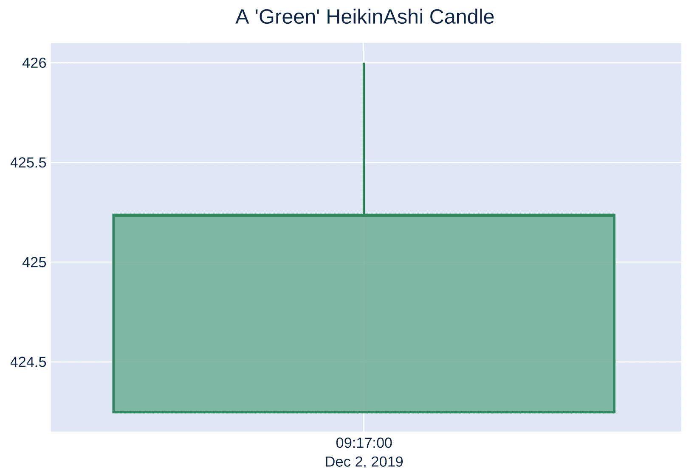

4.  为一行数据创建红色的 Heikin-Ashi 蜡烛线:

```py
# A 'Red' HeikinAshi Candle
>>> candle_red_heikinashi = \
            historical_data_1minute_heikinashi.iloc[4:5,:]            
# Only 1st ROW of historical data
>>> plot_candlestick_chart(candle_red_heikinashi, 
                           PlotType.HEIKINASHI, 
                           "A 'Red' HeikinAshi Candle")
```

您将获得以下输出:

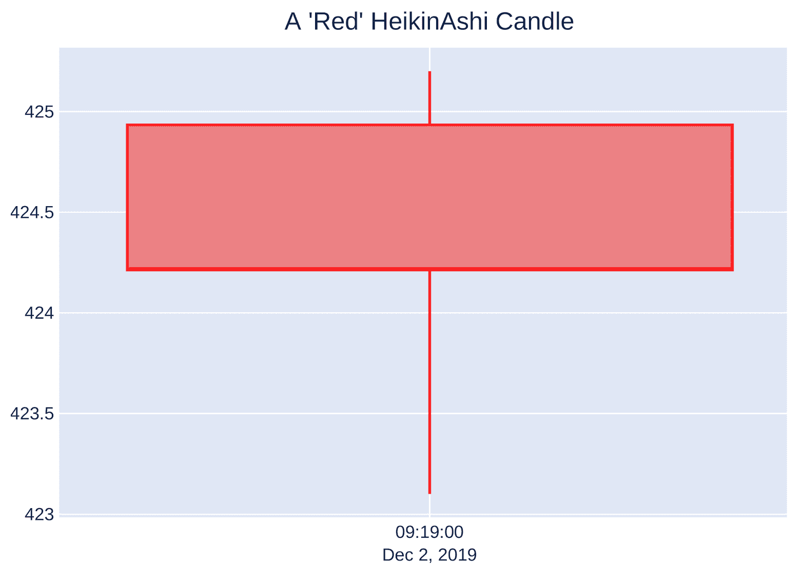

5.  以 1 分钟烛光间隔为仪器的历史数据绘制图表:

```py
>>> plot_candlestick_chart(historical_data_1minute_heikinashi, 
                           PlotType.HEIKINASHI, 
                           'Historical Data | '
                           'Heikin-Ashi Candlesticks Pattern | '
                           'NSE:TATASTEEL | '
                           'Dec, 2019 | '
                           'Candle Interval: 1 minute', True)
```

您将获得以下输出:


6.  以 3 分钟烛光间隔绘制仪器历史数据图表:

```py
>>> historical_data_3minutes = \
            broker_connection.get_historical_data(instrument, 
                                                  '3minute', 
                                                  '2019-12-01', 
                                                  '2019-12-31')
>>> historical_data_3minutes_heikinashi = \
                            HeikinAshi(historical_data_3minutes)
>>> plot_candlestick_chart(historical_data_3minutes_heikinashi, 
                           PlotType.HEIKINASHI, 
                           'Historical Data | '
                           'Heikin-Ashi Candlesticks Pattern | '
                           'NSE:TATASTEEL | '
                           'Dec, 2019 | '
                           'Candle Interval: 3 minutes', True)
```

您将获得以下输出:

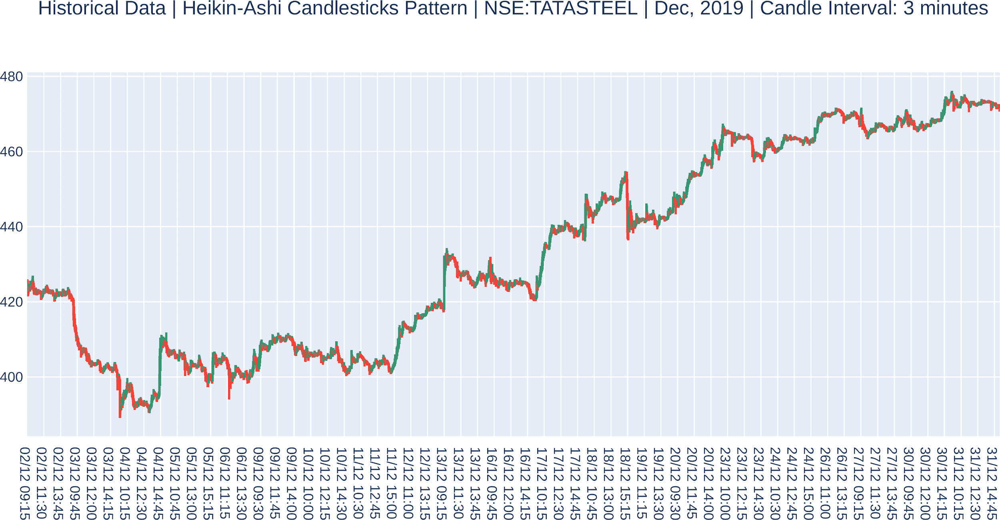

7.  以 5 分钟烛光间隔绘制仪器历史数据图表:

```py
>>> historical_data_5minutes = \
            broker_connection.get_historical_data(instrument, 
                                                  '5minute', 
                                                  '2019-12-01', 
                                                  '2019-12-31')
>>> historical_data_5minutes_heikinashi = \
                           HeikinAshi(historical_data_5minutes)
>>> plot_candlestick_chart(historical_data_5minutes_heikinashi, 
                            PlotType.HEIKINASHI, 
                           'Historical Data | '
                           'Heikin-Ashi Candlesticks Pattern | '
                           'NSE:TATASTEEL | '
                           'Dec, 2019 | '
                           'Candle Interval: 5 minutes', True)
```

您将获得以下输出:


8.  以 10 分钟烛光间隔为仪器的历史数据绘制图表:

```py
>>> historical_data_10minutes = \
            broker_connection.get_historical_data(instrument, 
                                                  '10minute', 
                                                  '2019-12-01', 
                                                  '2019-12-31')
>>> historical_data_10minutes_heikinashi = \
                            HeikinAshi(historical_data_10minutes)
>>> plot_candlestick_chart(historical_data_10minutes_heikinashi, 
                           PlotType.HEIKINASHI, 
                           'Historical Data | '
                           'Heikin-Ashi Candlesticks Pattern | '
                           'NSE:TATASTEEL | '
                           'Dec, 2019 | '
                           'Candle Interval: 10 minutes', True)
```

您将获得以下输出:


9.  以 15 分钟烛光间隔绘制仪器历史数据图表:

```py
>>> historical_data_15minutes = \
            broker_connection.get_historical_data(instrument, 
                                                  '15minute', 
                                                  '2019-12-01', 
                                                  '2019-12-31')
>>> historical_data_15minutes_heikinashi = \
                           HeikinAshi(historical_data_15minutes)
>>> plot_candlestick_chart(historical_data_15minutes_heikinashi, 
                           PlotType.HEIKINASHI, 
                           'Historical Data | '
                           'Heikin-Ashi Candlesticks Pattern | '
                           'NSE:TATASTEEL | '
                           'Dec, 2019 | '
                           'Candle Interval: 15 minutes', True)
```

您将获得以下输出:


10.  以 30 分钟烛光间隔绘制仪器历史数据图表:

```py
>>> historical_data_30minutes = \
            broker_connection.get_historical_data(instrument, 
                                                  '30minute', 
                                                  '2019-12-01', 
                                                  '2019-12-31')
>>> historical_data_30minutes_heikinashi = \
                           HeikinAshi(historical_data_30minutes)
>>> plot_candlestick_chart(historical_data_30minutes_heikinashi, 
                           PlotType.HEIKINASHI, 
                           'Historical Data | '
                           'Heikin-Ashi Candlesticks Pattern | '
                           'NSE:TATASTEEL | '
                           'Dec, 2019 | '
                           'Candle Interval: 30 minutes', True)
```

您将获得以下输出:

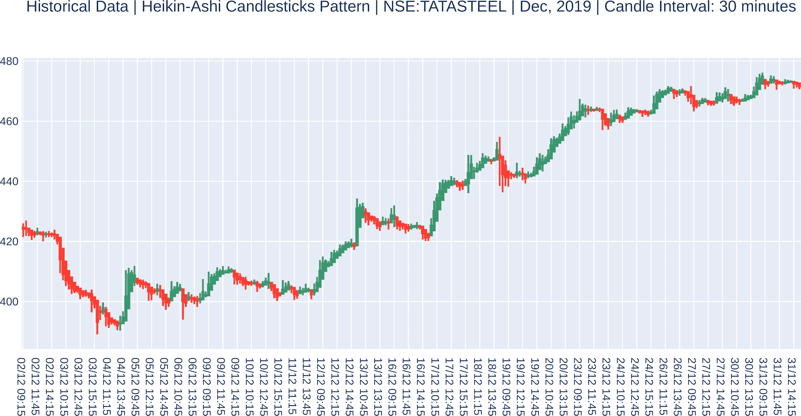

11.  以 1 小时烛光间隔为仪器的历史数据绘制图表:

```py
>>> historical_data_1hour = 
        broker_connection.get_historical_data(instrument, 
                                              'hour', 
                                              '2019-12-01', 
                                              '2019-12-31')
>>> historical_data_1hour_heikinashi = \
                           HeikinAshi(historical_data_1hour)
>>> plot_candlestick_chart(historical_data_1hour_heikinashi, 
                           PlotType.HEIKINASHI, 
                           'Historical Data | '
                           'Heikin-Ashi Candlesticks Pattern | '
                           'NSE:TATASTEEL | '
                           'Dec, 2019 | '
                           'Candle Interval: 1 Hour', True)
```

您将获得以下输出:

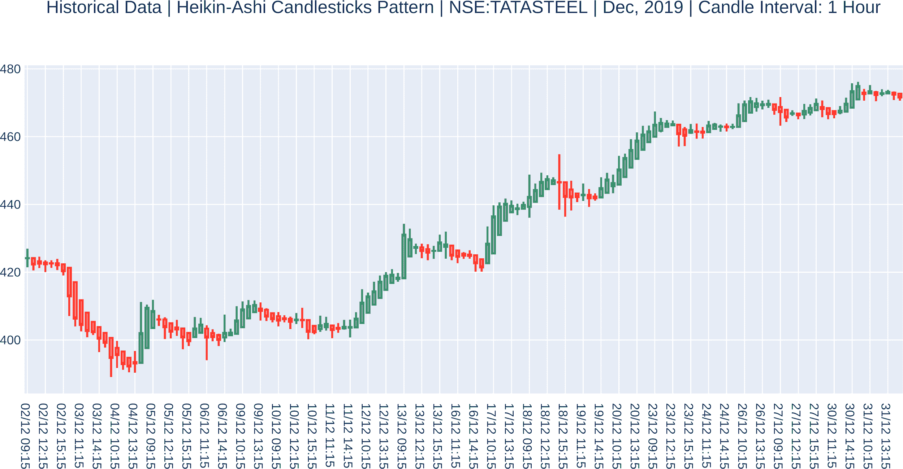

12.  以 1 天蜡烛间隔绘制仪器历史数据图表:

```py
>>> historical_data_day = \
            broker_connection.get_historical_data(instrument, 
                                                  'day', 
                                                  '2019-12-01', 
                                                  '2019-12-31')
>>> historical_data_day_heikinashi = \
                                HeikinAshi(historical_data_day)
>>> plot_candlestick_chart(historical_data_day_heikinashi, 
                           PlotType.HEIKINASHI, 
                           'Historical Data | '
                           'Heikin-Ashi Candlesticks Pattern | '
                           'NSE:TATASTEEL | '
                           'Dec, 2019 | '
                           'Candle Interval: Day', True)
```

您将获得以下输出:

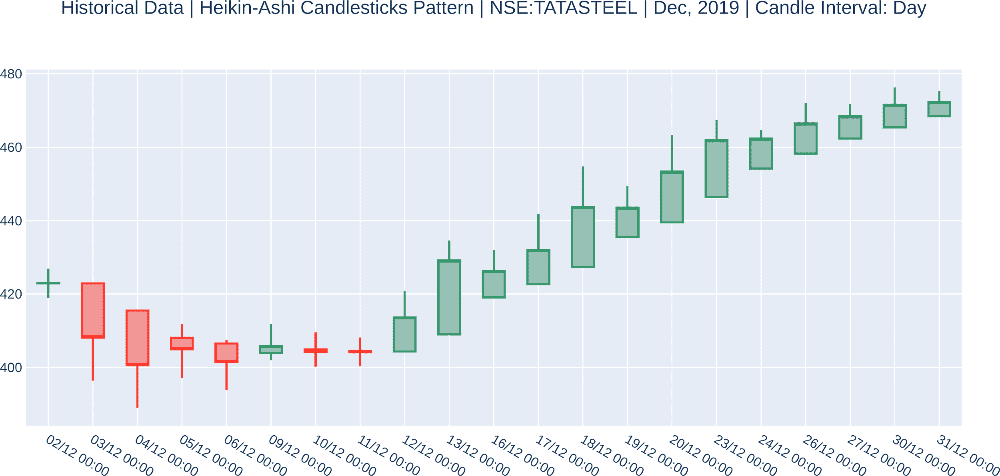

## 它是如何工作的…

在*步骤 1* 中，您导入了`plot_candlestick_chart`，一个用于绘制烛台模式图表的快速实用函数，`PlotType`，一个用于各种烛台模式的枚举，以及`HeikinAshi`函数，该函数可以将来自日本烛台模式的历史数据转换成适用于 Heikin-Ashi 烛台模式的数据。在*步骤 2* 中，您使用`broker_connection`的`get_instrument()`方法获取一个乐器，并将其分配给一个新属性`instrument`。这个对象是`Instrument`类的一个实例。调用`get_instrument()`需要的两个参数是交易所(`'NSE'`)和交易符号(`'TATASTEEL'`)。接下来，使用`broker_connection`对象的`get_historical_data()`方法获取 2019 年 12 月的持续时间的历史数据，蜡烛间隔为 1 分钟。返回的时间序列数据是日本烛台模式的形式。`HeikinAshi()`函数将该数据转换为 Heikin-Ashi 烛台模式，另一个`pandas.DataFrame`对象。你把它分配给`historical_data_1minute_heikinashi`。观察`historical_data_1minute_heikinashi`有`timestamp`、`close`、`open`、`high`和`low`栏。此外，注意时间戳是等距的，因为 Heikin-Ashi 蜡烛是基于日本蜡烛的平均值。在*步骤 3* 和 *4* 中，您从数据中选择性地提取一根绿色和一根红色蜡烛。(请注意，如果您为本章第一个配方中获取的`historical_data`选择不同的持续时间，传递给`historical_data.iloc`的这个指数将会不同。)观察蜡烛有阴影(在主蜡烛体两侧延伸的线)，因为蜡烛有`high`和`low`属性，以及`open`和`close`属性。在*步骤 5* 中，使用`plot_candlstick_charts()`功能绘制`historical_data`保存的完整历史数据。

在*步骤 6* 直到 *12* 中，您使用日本烛台模式获取历史数据，将其转换为 Heikin-Ashi 烛台模式，并分别为 3 分钟、5 分钟、10 分钟、15 分钟、30 分钟、1 小时和 1 天的蜡烛间隔绘制转换后的数据。随着蜡烛线间隔的增加，观察图表之间的以下差异和相似之处:

*   烛台的总数减少了。
*   图表中由于价格突然波动而出现的尖峰被最小化。较小的蜡烛线间隔图有更多的尖峰，因为它们专注于局部趋势，而较大的蜡烛线间隔图有更少的尖峰，也更平滑。
*   股票价格的长期趋势变得明显。

*   决策可能会变得更慢，因为你必须等待更长时间才能获得新的蜡烛线数据。较慢的决策可能需要，也可能不需要，这取决于策略。例如，为了确认趋势，使用具有较小蜡烛线间隔(比如 3 分钟)的数据和具有较大蜡烛线间隔(比如 15 分钟)的数据的组合将是理想的。另一方面，为了抓住日内交易的机会，蜡烛线间隔大的数据，比如 1 小时或 1 天，是不可取的。
*   相邻蜡烛线的价格范围(y 轴分布)可能重叠，也可能不重叠。
*   所有时间戳的时间间隔相等(在市场时间内)。

如果您有兴趣了解 Heikin-Ashi 蜡烛的数学和实现，请参考位于[https://github . com/algo bulls/pyalgotrading/blob/master/pyalgotrading/utils/candlesticks/heikinashi . py](https://github.com/algobulls/pyalgotrading/blob/master/pyalgotrading/utils/candlesticks/heikinashi.py)的`pyalgotrading`包中的源代码。

# 使用 Quandl 获取历史数据

到目前为止，在本章的所有菜谱中，您已经使用了代理连接来获取历史数据。在这个菜谱中，您将使用第三方工具 Quandl(【https://www.quandl.com/tools/python】)获取历史数据。它有一个免费使用的 Python 版本，可以使用`pip`轻松安装。这个方法演示了如何使用 T1 来获取 T4 股票价格(脸书、亚马逊、苹果、微软和谷歌)的历史数据。

## 做好准备

确保您已经安装了 Python `quandl`包。如果还没有，可以使用下面的`pip`命令安装它:

```py
$ pip install quandl 
```

## 怎么做…

我们为此配方执行以下步骤:

1.  导入必要的模块:

```py
>>> from pyalgotrading.utils.func import plot_candlestick_chart, PlotType
>>> import quandl
```

2.  以 1 天的蜡烛线间隔为脸书的历史数据绘制图表:

```py
>>> facebook = quandl.get('WIKI/FB', 
                           start_date='2015-1-1', 
                           end_date='2015-3-31')
>>> plot_candlestick_chart(facebook, 
                           PlotType.QUANDL_OHLC, 
                           'Historical Data | '
                           'Japanese Candlesticks Pattern | '
                           'FACEBOOK | '
                           'Jan-March 2015 | '
                           'Candle Interval: Day', True)
```

您将获得以下输出:


3.  以 1 天的蜡烛线间隔为 Amazon 的历史数据绘制图表:

```py
>>> amazon = quandl.get('WIKI/AMZN', 
                         start_date='2015-1-1', 
                         end_date='2015-3-31')
>>> plot_candlestick_chart(amazon, 
                           PlotType.QUANDL_OHLC, 
                           'Historical Data | '
                           'Japanese Candlesticks Pattern | '
                           'AMAZON | '
                           'Jan-March 2015 | '
                           'Candle Interval: Day', True)
```

您将获得以下输出:

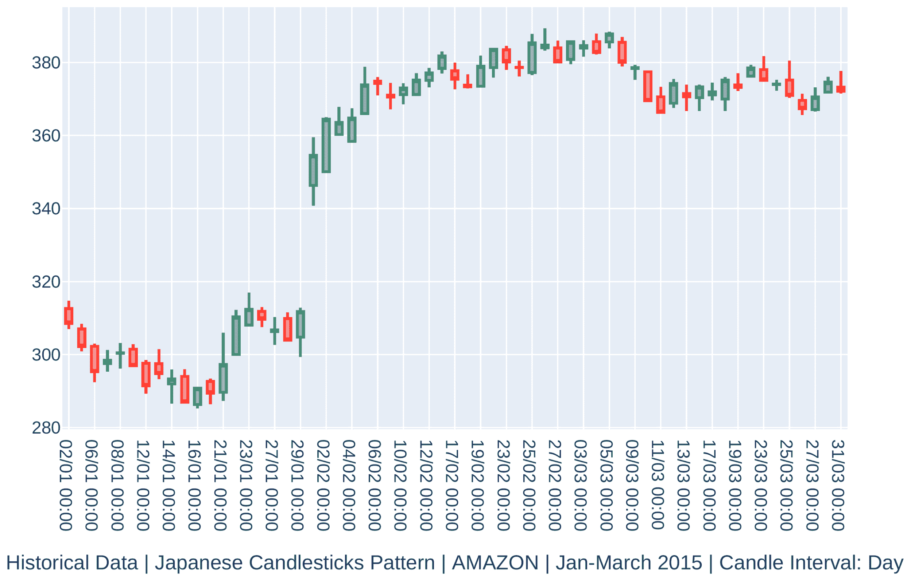

4.  以 1 天的蜡烛线间隔为 Apple 的历史数据绘制图表:

```py
>>> apple = quandl.get('WIKI/AAPL', 
                        start_date='2015-1-1', 
                        end_date='2015-3-31')
>>> plot_candlestick_chart(apple, 
                           PlotType.QUANDL_OHLC, 
                           'Historical Data | '
                           'Japanese Candlesticks Pattern | '
                           'APPLE | '
                           'Jan-March 2015 | '
                           'Candle Interval: Day', True)
```

您将获得以下输出:


5.  以 1 天蜡烛线间隔为 Microsoft 的历史数据绘制图表:

```py
>>> microsoft = quandl.get('WIKI/MSFT', 
                            start_date='2015-1-1', 
                            end_date='2015-3-31')
>>> plot_candlestick_chart(microsoft, 
                           PlotType.QUANDL_OHLC, 
                           'Historical Data | '
                           'Japanese Candlesticks Pattern | '
                           'MICROSOFT | '
                           'Jan-March 2015 | '
                           'Candle Interval: Day', True)
```

您将获得以下输出:

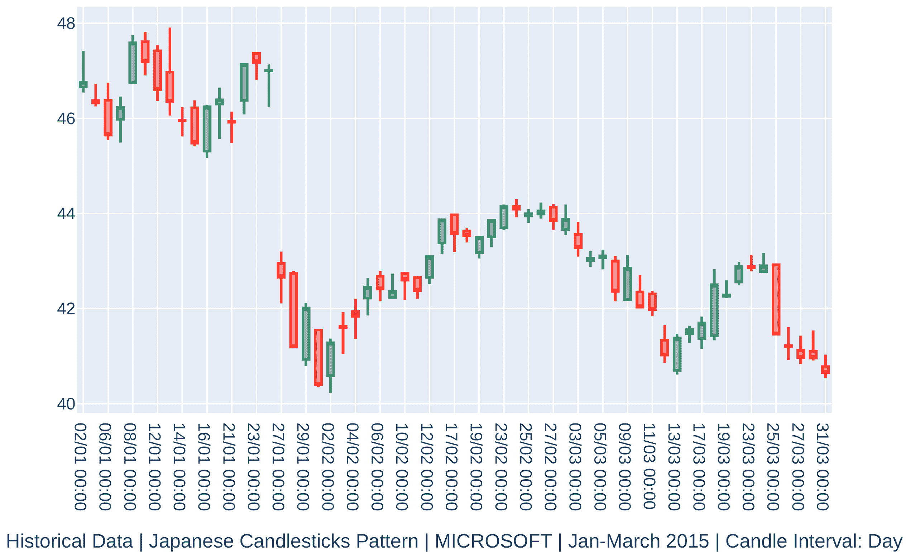

6.  以 1 天的蜡烛线间隔为 Google 的历史数据绘制图表:

```py
>>> google = quandl.get('WIKI/GOOGL', 
                         start_date='2015-1-1', 
                         end_date='2015-3-31')
>>> plot_candlestick_chart(google, 
                           PlotType.QUANDL_OHLC, 
                           'Historical Data | '
                           'Japanese Candlesticks Pattern | '
                           'GOOGLE | '
                           'Jan-March 2015 | '
                           'Candle Interval: Day', True)
```

您将获得以下输出:


## 它是如何工作的…

在*步骤 1* 中，您导入了`plot_candlestick_chart`，一个用于绘制烛台模式图表的快速实用函数，`PlotType`，一个用于各种烛台模式的枚举，以及`quandl`模块。在剩下的步骤中，使用`quandl.get()`获取脸书、亚马逊、苹果、微软和谷歌股票的历史数据，并使用`plot_candlestick_chart()`方法绘制。`quandl`返回的数据是 OHLC(开盘、盘高、盘低、收盘)格式。

这种第三方模块的好处是它们是免费的，您不需要设置代理连接来获取历史数据。不利的一面是，这个来自免费软件的数据有其局限性。例如，不能实时提取数据，也不能提取数据进行日内交易(1 分钟蜡烛线、3 分钟蜡烛线等等)。
所以，要不要用这个数据，就看你的要求了。对于测试或流刷新现有代码库来说，它可能是好的，但对于提供实时数据馈送来说，它不够好，而在真实的交易会话中需要实时数据馈送。