# 六、定期在交易所下单

本章介绍了可以通过代理 API 提交给交易所的各种类型的常规订单。菜谱包括关于下 16 种订单、查询订单状态和退出已完成订单的代码。这些食谱将是你的算法交易策略的基础部分。了解所有类型的订单，并知道根据给定的要求下哪一个订单，对于建立成功的交易策略至关重要。

每个订单都有多个属性，如下表所示:

*   **订单交易类型**:该属性简单定义订单是`BUY`交易还是`SELL`交易。显然，可能的值可以是`BUY`或`SELL`中的一个。
*   **订单类型**:该属性定义订单的类型，暗示订单的高层行为。常用的订单类型有`REGULAR`订单、`BRACKET`订单、`COVER`订单等。您的经纪人可以定义更多类型的订单。本章包括`REGULAR`订单上的食谱。

*   **订单代码**:该属性定义订单是在当天交易时间结束时平仓(即退出)还是结转至下一个交易日。可能的值可以是`INTRADAY`或`DELIVERY`之一。`INTRADAY`订单，顾名思义，只有一天的寿命，如果之前没有退出，将在当天结束时被经纪人退出。另一方面,`DELIVERY`订单被交付到用户的 Demat 账户，并一直存在，直到用户明确结清为止。一个`DELIVERY`订单在最终到达用户的 Demat 账户之前可能会经历多个状态，如下例所示:
*   `DELIVERY T+0`(下单当天)
*   `DELIVERY T+1`(下单的下一个交易日)
*   `DELIVERY T+2`(下单第二个交易日及之后)

这取决于基础部分。例如，权益部分工具的`DELIVERY`订单将经历这些状态。期货和期权部分工具的`DELIVERY`订单不会经过这些状态。

*   **订单品种**:该属性与订单的定价和激活有关。可能的值可以是下列值之一:
*   `MARKET`:立即以最佳市场价格下单。用户在下订单时不需要指定价格。
*   `LIMIT`:以指定价格下单，该价格低于**最后交易价格** ( **LTP** )(对于`BUY`订单)或高于 LTP(对于`SELL`订单)。用户应该在下订单时指定一个*限价*。*限价*将是用户打算购买/出售该工具的价格。
*   `STOPLOSS_LIMIT`:以指定价格下单，该价格高于 LTP(对于`BUY`订单)或低于 LTP(对于`SELL`订单)。用户应指定*触发价*和*限价*。当`LTP`越过*触发价格*时，订单被激活，并以指定的*限价* *价格*下单。
*   `STOPLOSS_MARKET`:以指定价格下单，该价格高于 LTP(对于`BUY`订单)或低于 LTP(对于`SELL`订单)。用户应指定*触发价格*。当 LTP 越过*触发价格*时，订单被激活并以市场价格下单。

所有这些属性一起定义了一个完整的顺序。要下订单，应该准确了解所有四个属性。

前述属性，即订单交易类型、订单类型、订单代码和订单种类，由`pyalgotrading`包定义。您选择的代理可能会以不同的方式命名相同的属性。`pyalgotrading`包在内部处理这样的翻译。

交易所的每一笔订单在其生命周期内都会经历不同的状态。本章中使用的代理支持每个订单的以下状态:

*   `PUT ORDER REQ RECEIVED`
*   `VALIDATION PENDING`
*   `OPEN PENDING`
*   `TRIGGER PENDING`
*   `CANCEL PENDING`
*   `COMPLETE`
*   `CANCELLED`
*   `OPEN`
*   `REJECTED`

本章中的配方为每种常规订单的状态转换提供了详细的状态机图。

如果您使用不同的代理，代理可能支持不同的订单状态或以不同的方式命名订单状态。您可以参考代理 API 文档来理解每种状态的含义。

在本章中，我们将介绍以下配方:

*   建立正常的市场秩序
*   发出常规限价订单
*   发出常规止损限价订单
*   发出常规止损单-市场订单

请确保您在交易时段尝试了所有这些食谱，并且您的经纪账户中有足够的余额。如果这些食谱在市场时间之外被尝试或者余额不足，你的订单将被经纪人拒绝。这意味着订单永远不会到达交易所，你也不会得到预期的回应。

# 技术要求

要成功执行本章中的配方，您需要具备以下条件:

*   Python 3.7+版本
*   Python 包:`pyalgotrading` ( `$ pip install pyalgotrading`)

本章最新的 Jupyter 笔记本可以在 GitHub 上找到，网址为[https://GitHub . com/packt publishing/Python-algorithm-Trading-Cookbook/tree/master/chapter 06](https://github.com/PacktPublishing/Python-Algorithmic-Trading-Cookbook/tree/master/Chapter06)。

设置与代理的连接所需的第一件事是获取 API 密钥。代理将为每个客户提供唯一的密钥，通常是一对`api-key`和`api-secret`密钥。这些 API 密钥是收费的，通常是按月订阅的。在开始之前，你需要从经纪人网站获得你的`api-key`和`api-secret`副本。更多细节可以参考*附录一*。

下面的步骤将帮助您建立与 Zerodha 的代理连接，本章中的所有菜谱都将使用它。在尝试任何食谱之前，请确保您遵循了以下步骤:

1.  导入必要的模块:

```py
>>> from pyalgotrading.broker.broker_connection_zerodha import BrokerConnectionZerodha
>>> from pyalgotrading.constants import *
```

所有的`pyalgotrading`常量现在都可以在 Python 名称空间中使用了。

2.  从代理获取`api_key`和`api_secret`密钥。这些是您独有的，经纪人将使用它们来识别您的 Demat 帐户:

```py
>>> api_key = "<your-api-key>"
>>> api_secret = "<your-api-secret>"
>>> broker_connection = BrokerConnectionZerodha(api_key, 
                                                api_secret)
```

我们得到以下输出:

```py
Installing package kiteconnect via pip. This may take a while...
Please login to this link to generate your request token: https://kite.trade/connect/login?api_key=<your-api-key>&v=3
```

如果您是第一次运行此程序，并且没有安装`kiteconnect`，则`pyalgotrading`会自动为您安装。第二步的最终输出将是一个链接。点击链接并使用您的 Zerodha 凭据登录。如果认证成功，您将在浏览器的地址栏中看到类似于`https://127.0.0.1/?request_token=<alphanimeric-toke>&action=login&status=success`的链接。

我们有以下例子:

```py
https://127.0.0.1/?request_token=H06I6Ydv95y23D2Dp7NbigFjKweGwRP7&action=login&status=success
```

3.  复制字母数字标记并粘贴到`request_token`:

```py
>>> request_token = "<your-request-token>"
>>> broker_connection.set_access_token(request_token)
```

`broker_connection`实例现在已经准备好执行 API 调用。

`pyalgotrading`包支持多个代理，并使用相同的方法为每个代理提供一个连接对象类。它在一个统一的接口后面抽象了代理 API，所以用户不需要担心底层的代理 API 调用，并且可以原样使用本章中的所有配方。只有建立代理连接的过程会因代理而异。如果您没有使用 Zerodha 作为您的代理，您可以参考`pyalgotrading`文档来设置代理连接。对于 Zerodha 用户来说，前面提到的步骤就足够了。

# 建立正常的市场秩序

常规市场订单是最简单的订单类型。这种订单类型用于以最佳市场价格立即下单。市场价格相当于 LTP(如[第三章](03.html)、*提取金融数据*的*金融工具最后交易价格*中所述)。

在发出常规市价单时，它会经历各种中间状态，然后最终到达最终状态(`COMPLETE`或`REJECTED`)。常规市场订单会立即进入结束状态，而不会等待任何中间状态。以下状态机图展示了常规市场订单在其生命周期中的各种状态:

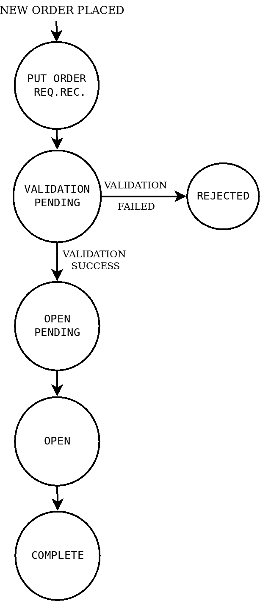

该配方演示了下以下常规市场订单并查询其状态:

*   `BUY`、`REGULAR`、`INTRADAY`、`MARKET`顺序
*   `SELL`、`REGULAR`、`INTRADAY`、`MARKET`顺序
*   `BUY`、`REGULAR`、`DELIVERY`、`MARKET`顺序
*   `SELL`、`REGULAR`、`DELIVERY`、`MARKET`顺序

## 做好准备

确保`pyalgotrading`包中的`broker_connection`对象和常量在 Python 名称空间中可用。参照本章*技术要求*一节设置该对象。

## 怎么做…

我们为此配方执行以下步骤:

1.  获取金融工具并将其分配给`instrument`:

```py
>>> instrument = broker_connection.get_instrument('NSE', 
                                                  'HDFCBANK')
```

2.  下`BUY`、`REGULAR`、`INTRADAY`、`MARKET`订单，显示订单 ID:

```py
>>> order1_id = broker_connection.place_order(
                instrument=instrument, 
                order_transaction_type= \
                    BrokerOrderTransactionTypeConstants.BUY,
                order_type=BrokerOrderTypeConstants.REGULAR,
                order_code=BrokerOrderCodeConstants.INTRADAY,
                order_variety=BrokerOrderVarietyConstants.MARKET,
                quantity=1)
>>> order1_id
```

我们得到以下输出(您的输出可能不同):

```py
'200304002243710'
```

3.  获取并显示订单状态:

```py
>>> broker_connection.get_order_status(order1_id)
```

我们得到以下输出:

```py
'COMPLETE'
```

如果您使用您的凭据登录到代理站点并转到订单部分，您可以找到您的订单详细信息，如以下屏幕截图所示(某些数据可能因您而异):


4.  下`SELL`、`REGULAR`、`INTRADAY`、`MARKET`订单，显示订单 ID:

```py
>>> order2_id = broker_connection.place_order(
                instrument=instrument,
                order_transaction_type= \
                    BrokerOrderTransactionTypeConstants.SELL,
                order_type=BrokerOrderTypeConstants.REGULAR,
                order_code=BrokerOrderCodeConstants.INTRADAY,
                order_variety=BrokerOrderVarietyConstants.MARKET,
                quantity=1)
>>> order2_id
```

我们得到以下输出(您的输出会有所不同):

```py
'200304002244044'
```

5.  获取并显示订单状态:

```py
>>> broker_connection.get_order_status(order2_id)
```

我们得到以下输出:

```py
'COMPLETE'
```

如果您使用您的凭据登录到代理站点并转到订单部分，您可以找到您的订单详细信息，如以下屏幕截图所示(某些数据可能因您而异):

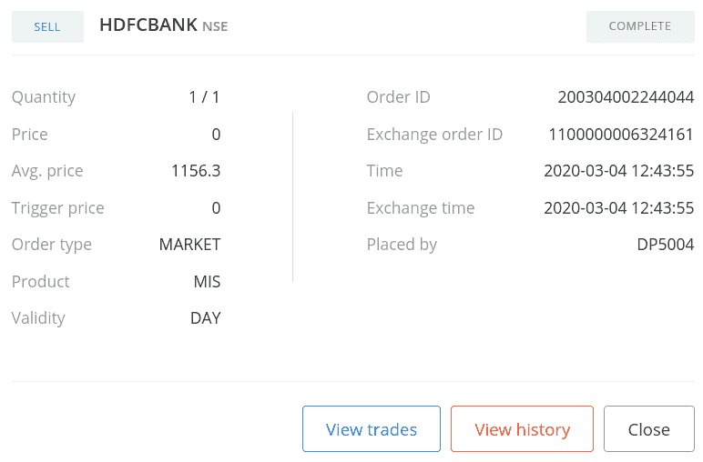

6.  下`BUY`、`REGULAR`、`DELIVERY`、`MARKET`订单，显示订单 ID:

```py
>>> order3_id = broker_connection.place_order(
                instrument=instrument,
                order_transaction_type= \
                    BrokerOrderTransactionTypeConstants.BUY,
                order_type=BrokerOrderTypeConstants.REGULAR,
                order_code=BrokerOrderCodeConstants.DELIVERY,
                order_variety=BrokerOrderVarietyConstants.MARKET,
                quantity=1)
>>> order3_id
```

我们得到以下输出(您的输出可能不同):

```py
'200304002244263'
```

7.  获取并显示订单状态:

```py
>>> broker_connection.get_order_status(order3_id)
```

我们得到以下输出:

```py
'COMPLETE'
```

如果您使用您的凭据登录到代理站点并转到订单部分，您可以找到您的订单详细信息，如以下屏幕截图所示(某些数据可能因您而异):


8.  下`SELL`、`REGULAR`、`DELIVERY`、`MARKET`订单，显示订单 ID:

```py
>>> order4_id = broker_connection.place_order(
                instrument=instrument,
                order_transaction_type= \
                    BrokerOrderTransactionTypeConstants.SELL,
                order_type=BrokerOrderTypeConstants.REGULAR,
                order_code=BrokerOrderCodeConstants.DELIVERY,
                order_variety=BrokerOrderVarietyConstants.MARKET,
                quantity=1)
>>> order4_id
```

我们得到以下输出(您的输出可能不同):

```py
'200304002244333'
```

9.  获取并显示订单状态:

```py
>>> broker_connection.get_order_status(order4_id)
```

我们得到以下输出:

```py
'COMPLETE'
```

如果您使用您的凭据登录到代理站点并转到订单部分，您可以找到您的订单详细信息，如以下屏幕截图所示(某些数据可能因您而异):


## 它是如何工作的…

在*步骤 1* 中，您使用`BrokerConnectionZerodha`类的`get_instrument()`方法获取一个乐器，并将其分配给一个新属性`instrument`。这个对象是`Instrument`类的一个实例。调用`get_instrument`所需的两个参数是交易所(`'NSE'`)和交易符号(`'HDFCBANK'`)。

在*步骤 2* 中，您使用`broker_connection`对象的`place_order`方法在交易所上下单`BUY`、`REGULAR`、`INTRADAY`、`MARKET`。`place_order`方法是特定于经纪人的下单 API 的包装器。它具有以下属性:

*   `instrument`:这是必须下单的金融工具，应该是`Instrument`类的一个实例。我们经过`instrument`这里。
*   `order_transaction_type`:订单交易类型，应该是`BrokerOrderTransactionTypeConstants`类型的枚举。我们经过`BrokerOrderTransactionTypeConstants.BUY`这里。
*   `order_type`:这是订单类型，应该是`BrokerOrderTypeConstants`类型的枚举。我们经过`BrokerOrderTypeConstants.REGULAR`这里。

*   `order_code`:这是订单代码，应该是`BrokerOrderCodeConstants`类型的枚举。我们经过`BrokerOrderCodeConstants.INTRADAY`这里。
*   `order_variety`:这是订单种类，应该是`BrokerOrderVarietyConstants`类型的枚举。我们经过`BrokerOrderVarietyConstants.MARKET`这里。
*   `quantity`:这是给定工具的交易股数，应为正整数。我们在这里通过`1`。

(传递给`place_order`方法的属性是与代理无关的常量，早些时候从`pyalgotrading.constants`模块导入。)

在*步骤 2* 中下订单时，您从代理那里获得一个订单 ID，您将它分配给一个新属性`order1_id`。对象是一个`string`类型。如果订单由于某种原因没有成功，您可能无法获得订单 ID。在*步骤 3* 中，您使用`broker_connection`对象的`get_order_status()`方法获取已下订单的状态。您将`order1_id`作为参数传递给`get_order_status()`方法。您得到的订单状态为`'COMPLETE'`，一个`string`类型。您还可以使用`order1_id`在以后的任何时间点获取所下订单的状态。

您也可以通过登录经纪人网站并查看那里的订单部分来验证您的订单是否成功。您应该会看到类似于*步骤 3* 的输出中显示的屏幕截图的数据。

对于不同的属性组合，该配方中的其他步骤遵循相同的下订单并获取其状态的模式:

*   *步骤 4* 和*步骤 5* : `SELL`、`REGULAR`、`INTRADAY`、`MARKET`顺序
*   *步骤 6* 和 *7* : `BUY`、`REGULAR`、`DELIVERY`、`MARKET`顺序
*   *第 8 步*和*第 9 步* : `SELL`、`REGULAR`、`DELIVERY`、`MARKET`顺序

经纪人为一个订单返回的订单 ID 在其所有客户中是唯一的。您再也不会获得相同的订单 ID，也不会获得分配给其他人所下订单的订单 ID。

# 发出常规限价订单

常规限价单是一种以特定价格下单的订单类型。与正常的市场订单不同，这不是市场价格。要下这个订单，需要一个名为*限价*的特定参数。该参数应满足以下条件:

*   对于`BUY`订单，*限价*应低于市场价格。
*   对于`SELL`订单，*限价*应高于市场价格。

如果不满足这些条件，订单可能会以市场价格下单，本质上将其转换为常规市场订单，或者可能会被经纪人作为无效订单拒绝。

在发出常规限价单时，它会经历各种中间状态，然后最终到达最终状态(`COMPLETE`、`CANCELLED`或`REJECTED`)。常规限价单可以在`OPEN`状态停留一段时间，直到实现有利的市场条件，然后进入`COMPLETE`状态。以下状态机图展示了常规限价单在其生命周期内的各种状态:

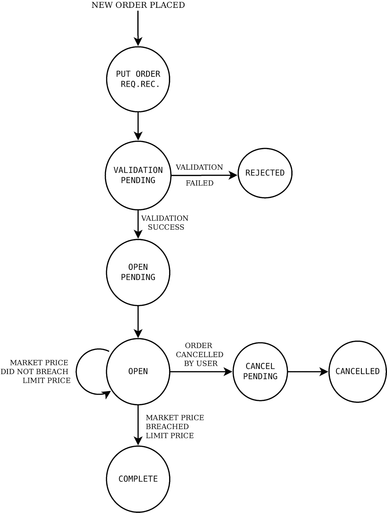

本配方演示了如何下达以下常规限价单并查询其状态:

*   `BUY`、`REGULAR`、`INTRADAY`、`LIMIT`顺序
*   `SELL`、`REGULAR`、`INTRADAY`、`LIMIT`顺序
*   `BUY`、`REGULAR`、`DELIVERY`、`LIMIT`顺序
*   `SELL`、`REGULAR`、`DELIVERY`、`LIMIT`顺序

## 做好准备

确保`pyalgotrading`包中的`broker_connection`对象和常量在 Python 名称空间中可用。参照本章*技术要求*一节设置该对象。

## 怎么做...

我们为此配方执行以下步骤:

1.  获取金融工具并将其分配给`instrument`:

```py
>>> instrument = broker_connection.get_instrument('NSE', 
                                                  'ICICIBANK')
```

2.  去拿 LTP。下`BUY`、`REGULAR`、`INTRADAY`、`LIMIT`订单，显示订单 ID:

```py
>>> ltp = broker_connection.get_ltp(instrument)
>>> order1_id = broker_connection.place_order(
                instrument=instrument,
                order_transaction_type= \
                    BrokerOrderTransactionTypeConstants.BUY,
                order_type=BrokerOrderTypeConstants.REGULAR,
                order_code=BrokerOrderCodeConstants.INTRADAY,
                order_variety=BrokerOrderVarietyConstants.LIMIT,
                quantity=1,
                price=ltp-1)
>>> order1_id
```

我们得到以下输出(您的输出可能不同):

```py
'200303003518407'
```

3.  获取并显示订单状态:

```py
>>> broker_connection.get_order_status(order1_id)
```

我们得到以下输出(您的输出可能不同):

```py
'OPEN'
```

如果您使用您的凭据登录到代理站点并转到订单部分，您可以找到您的订单详细信息，如以下屏幕截图所示(某些数据可能因您而异):

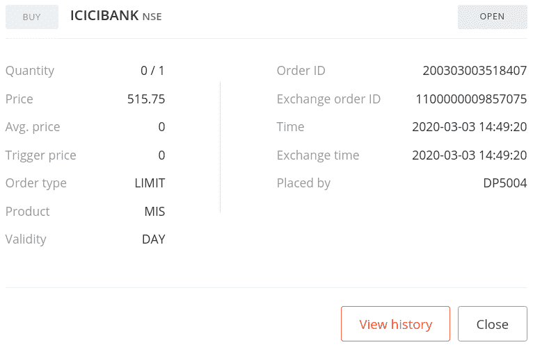

4.  一段时间后再次获取并显示订单状态:

```py
>>> broker_connection.get_order_status(order1_id)
```

我们得到以下输出(您的输出可能不同):

```py
'COMPLETE'
```

如果您使用您的凭据登录到代理站点并转到订单部分，您可以找到您的订单详细信息，如以下屏幕截图所示(某些数据可能因您而异):


5.  去拿 LTP。下`SELL`、`REGULAR`、`INTRADAY`、`LIMIT`订单，显示订单 ID:

```py
>>> ltp = broker_connection.get_ltp(instrument)
>>> order2_id = broker_connection.place_order(
                instrument=instrument,
                order_transaction_type= \
                    BrokerOrderTransactionTypeConstants.SELL,
                order_type=BrokerOrderTypeConstants.REGULAR,
                order_code=BrokerOrderCodeConstants.INTRADAY,
                order_variety=BrokerOrderVarietyConstants.LIMIT,
                quantity=1,
                price=ltp+1)
>>> order2_id
```

我们得到以下输出(您的输出可能不同):

```py
'200303003243352'
```

6.  获取并显示订单状态:

```py
>>> broker_connection.get_order_status(order2_id)
```

我们得到以下结果:

```py
'OPEN'
```

如果您使用您的凭据登录到代理站点并转到订单部分，您可以找到您的订单详细信息，如以下屏幕截图所示(某些数据可能因您而异):


7.  一段时间后再次获取并显示订单状态:

```py
>>> broker_connection.get_order_status(order2_id)
```

我们得到以下输出(您的输出可能不同):

```py
'COMPLETE'
```

如果您使用您的凭据登录到代理站点并转到订单部分，您可以找到您的订单详细信息，如以下屏幕截图所示(某些数据可能因您而异):

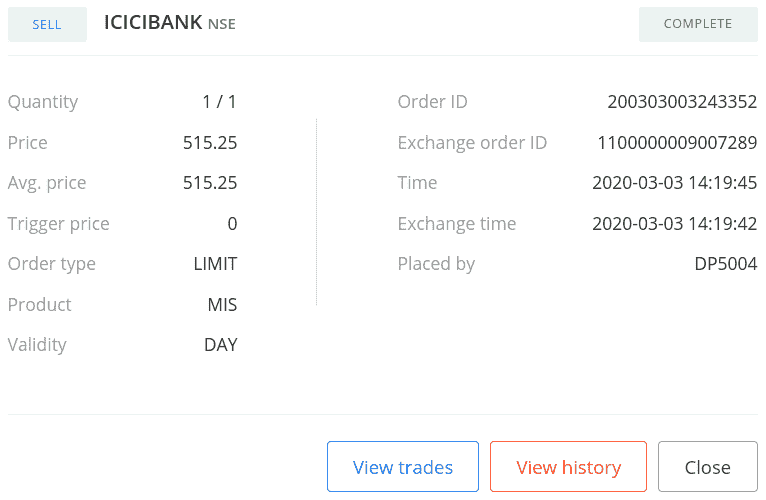

8.  去拿 LTP。下`BUY`、`REGULAR`、`DELIVERY`、`LIMIT`订单，显示订单 ID:

```py
>>> ltp = broker_connection.get_ltp(instrument)
>>> order3_id = broker_connection.place_order(
                instrument=instrument,
                order_transaction_type= \
                    BrokerOrderTransactionTypeConstants.BUY,
                order_type=BrokerOrderTypeConstants.REGULAR,
                order_code=BrokerOrderCodeConstants.DELIVERY,
                order_variety=BrokerOrderVarietyConstants.LIMIT,
                quantity=1,
                price=ltp-1)
>>> order3_id
```

我们得到以下输出(您的输出可能不同):

```py
'200303003266560'
```

9.  获取并显示订单状态:

```py
>>> broker_connection.get_order_status(order3_id)
```

我们得到以下输出:

```py
'OPEN'
```

如果您使用您的凭据登录到代理站点并转到订单部分，您可以找到您的订单详细信息，如以下屏幕截图所示(某些数据可能因您而异):


10.  一段时间后再次获取并显示订单状态:

```py
>>> broker_connection.get_order_status(order3_id)
```

我们得到以下输出:

```py
'COMPLETE'
```

如果您使用您的凭据登录到代理站点并转到订单部分，您可以找到您的订单详细信息，如以下屏幕截图所示(某些数据可能因您而异):


11.  去拿 LTP。下`SELL`、`REGULAR`、`DELIVERY`、`LIMIT`订单，显示订单 ID:

```py
>>> ltp = broker_connection.get_ltp(instrument)
>>> order4_id = broker_connection.place_order(
                instrument=instrument,
                order_transaction_type= \
                    BrokerOrderTransactionTypeConstants.SELL,
                order_type=BrokerOrderTypeConstants.REGULAR,
                order_code=BrokerOrderCodeConstants.DELIVERY,
                order_variety=BrokerOrderVarietyConstants.LIMIT,
                quantity=1,
                price=ltp+1)
>>> order4_id
```

我们得到以下输出(您的输出可能不同):

```py
'200303003280699'
```

12.  获取并显示订单状态:

```py
>>> broker_connection.get_order_status(order4_id)
```

我们得到以下输出:

```py
'OPEN'
```

如果您使用您的凭据登录到代理站点并转到订单部分，您可以找到您的订单详细信息，如以下屏幕截图所示(某些数据可能因您而异):


13.  一段时间后再次获取并显示订单状态:

```py
>>> broker_connection.get_order_status(order4_id)
```

我们得到以下输出:

```py
'COMPLETE'
```

如果您使用您的凭据登录到代理站点并转到订单部分，您可以找到您的订单详细信息，如以下屏幕截图所示(某些数据可能因您而异):

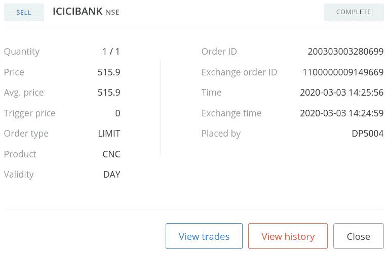

## 它是如何工作的...

在*步骤 1* 中，您使用`BrokerConnectionZerodha`类的`get_instrument()`方法获取一个乐器，并将其分配给一个新属性`instrument`。这个对象是`Instrument`类的一个实例。调用`get_instrument`所需的两个参数是交易所(`'NSE'`)和交易符号(`'ICICIBANK'`)。

在*步骤 2* 中，您使用`BrokerConnectionZerodha`类的`get_ltp()`方法获取仪器的 LTP，并将其分配给一个新属性`ltp`。`instrument`对象在这里作为参数传递。接下来，您使用`broker_connection`对象的`place_order`方法在交易所下一个`BUY`、`REGULAR`、`INTRADAY`、`LIMIT`订单。`place_order`方法是特定于经纪人的下单 API 的包装器。它具有以下属性:

*   `instrument`:这是必须下单的金融工具，应该是`Instrument`类的一个实例。我们经过`instrument`这里。
*   `order_transaction_type`:订单交易类型，应该是`BrokerOrderTransactionTypeConstants`类型的枚举。我们经过`BrokerOrderTransactionTypeConstants.BUY`这里。

*   `order_type`:这是订单类型，应该是`BrokerOrderTypeConstants`类型的枚举。我们经过`BrokerOrderTypeConstants.REGULAR`这里。
*   `order_code`:这是订单代码，应该是`BrokerOrderCodeConstants`类型的枚举。我们经过`BrokerOrderCodeConstants.INTRADAY`这里。
*   `order_variety`:这是订单种类，应该是`BrokerOrderVarietyConstants`类型的枚举。我们经过`BrokerOrderVarietyConstants.LIMIT`这里。
*   `quantity`:给定工具的交易股数，应为正整数。我们在这里通过`1`。
*   `price`:这是应该下单的限价。我们这里通过`ltp-1`，表示比`ltp`低 1 个单价。

(传递给`place_order`方法的属性是与代理无关的常量，早些时候从`pyalgotrading.constants`模块导入。)

在*步骤 2* 下订单时，您从经纪人那里获得一个订单 ID，您将它分配给一个新属性`order1_id`。`order1_id`对象是一个字符串。如果订单由于某种原因没有成功，您可能无法获得订单 ID。注意到价格参数被传递了一个值`ltp-1`。这意味着订单低于市场价格，这是下`BUY LIMIT`订单的必要条件。

在*步骤 3* 中，您使用`broker_connection`对象的`get_order_status()`方法获取已下订单的状态。您将`order1_id`作为参数传递给`get_order_status()`方法。您得到的订单状态为`'OPEN'`，一个字符串。您还可以使用`order1_id`在以后的任何时间点获取所下订单的状态。在*步骤 4* 中，您再次获取订单状态，如果订单完成，您将获得订单状态`'COMPLETE'`。

您也可以通过登录经纪人网站并查看那里的订单部分来验证您的订单是否成功。您应该会看到类似于*步骤 3* 和*步骤 4* 的输出中显示的截图的数据。

在*步骤 3* 中，如果您看到状态为`'COMPLETE'`而不是`'OPEN'`，这可能是由于高波动性。如果你想让订单停留在`'OPEN'`状态一段时间，试着把订单放在离市场价格更远的地方。

对于不同的属性组合，该配方中的其他步骤遵循相同的下订单并获取其状态的模式:

*   *步骤 5* 、 *6、*和 *7* : `SELL`、`REGULAR`、`INTRADAY`、`LIMIT`顺序
*   *步骤 8* 、 *9、*和 *10* : `BUY`、`REGULAR`、`DELIVERY`、`LIMIT`顺序
*   *步骤 11* 、 *12、*和 *13* : `SELL`、`REGULAR`、`DELIVERY`、`LIMIT`顺序

# 发出常规止损限价订单

常规止损限价订单是一种以特定价格下单的订单类型。与正常的市场订单不同，这不是市场价格。要下这个订单，需要两个特定的参数，即*触发价格*和*限价*。这些参数应满足以下条件:

*   对于`BUY`订单，我们需要遵守以下内容:
*   *触发价*和*限价*应高于市场价格。
*   *限价*应该大于*触发价。*
*   对于`SELL`订单，应遵守以下内容:
*   *触发价*和*限价*应低于市场价格。
*   *限价*应低于*触发价。*

如果不满足这些条件，订单可能会以市场价格下单，本质上将其转换为常规市场订单，或者可能会被经纪人作为无效订单拒绝。

在发出常规止损限价单时，它会经历各种中间状态，然后最终到达最终状态(`COMPLETE`、`CANCELLED`或`REJECTED`)。常规止损限价单可以在`TRIGGER_PENDING`状态停留一段时间，直到实现有利的市场条件，然后进入`COMPLETE`状态。以下状态机图展示了常规止损限价订单在其生命周期内的各种状态:

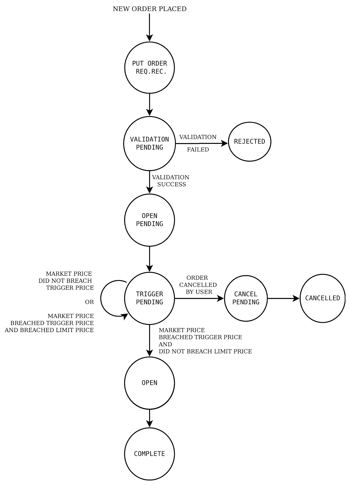

下单后，它保持在`TRIGGER_PENDING`状态，直到市场价格突破*触发价格*，而不是*限价*。也就是这个订单被激活并被发送到交易所的时候。然后，订单以最佳市场价格执行，该价格在*触发价格*和*限价*之间。订单状态从`TRIGGER_PENDING`到`OPEN`再到`COMPLETE`状态。如果市场波动太大，市场价格同时突破*触发价格*和*限价*，订单仍处于`TRIGGER_PENDING`状态。

本配方演示了下述常规止损限价单并查询其状态:

*   `BUY`、`REGULAR`、`INTRADAY`、`STOPLOSS_LIMIT`顺序
*   `SELL`、`REGULAR`、`INTRADAY`、`STOPLOSS_LIMIT`顺序
*   `BUY`、`REGULAR`、`DELIVERY`、`STOPLOSS_LIMIT`顺序
*   `SELL`、`REGULAR`、`DELIVERY`、`STOPLOSS_LIMIT`顺序

## 做好准备...

确保`pyalgotrading`包中的`broker_connection`对象和常量在 Python 名称空间中可用。参照本章*技术要求*一节设置该对象。

## 怎么做…

我们为此配方执行以下步骤:

1.  获取金融工具并将其分配给`instrument`:

```py
>>> instrument = broker_connection.get_instrument('NSE', 
                                                  'AXISBANK')
```

2.  去拿 LTP。下`BUY`、`REGULAR`、`INTRADAY`、`STOPLOSS_LIMIT`订单，显示订单 ID:

```py
>>> ltp = broker_connection.get_ltp(instrument)
>>> order1_id = broker_connection.place_order(
                instrument=instrument,
                order_transaction_type= \
                    BrokerOrderTransactionTypeConstants.BUY,
                order_type=BrokerOrderTypeConstants.REGULAR,
                order_code=BrokerOrderCodeConstants.INTRADAY,
                order_variety= \
                    BrokerOrderVarietyConstants.STOPLOSS_LIMIT,
                quantity=1,
                price=ltp+1,
                trigger_price=ltp+1)
>>> order1_id
```

我们得到以下输出(您的输出可能不同):

```py
'200303003296676'
```

3.  获取并显示订单状态:

```py
>>> broker_connection.get_order_status(order1_id)
```

我们得到以下输出:

```py
'TRIGGER PENDING'
```

如果您使用您的凭据登录到代理站点并转到订单部分，您可以找到您的订单详细信息，如以下屏幕截图所示(某些数据可能因您而异):

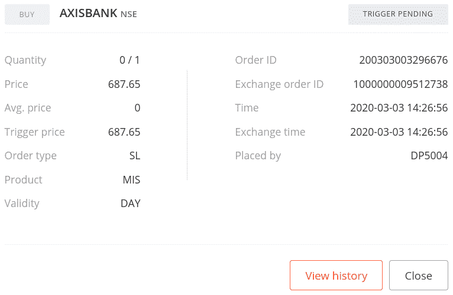

4.  一段时间后再次获取并显示订单状态:

```py
>>> broker_connection.get_order_status(order1_id)
```

我们得到以下输出:

```py
'COMPLETE'
```

如果您使用您的凭据登录到代理站点并转到订单部分，您可以找到您的订单详细信息，如以下屏幕截图所示(某些数据可能因您而异):


5.  去拿 LTP。下`SELL`、`REGULAR`、`INTRADAY`、`STOPLOSS_LIMIT`订单，显示订单 ID:

```py
>>> ltp = broker_connection.get_ltp(instrument)
>>> order2_id = broker_connection.place_order(
                instrument=instrument,
                order_transaction_type= \
                    BrokerOrderTransactionTypeConstants.SELL,
                order_type=BrokerOrderTypeConstants.REGULAR,
                order_code=BrokerOrderCodeConstants.INTRADAY,
                order_variety= \
                    BrokerOrderVarietyConstants.STOPLOSS_LIMIT,
                quantity=1,
                price=ltp-1,
                trigger_price=ltp-1)
>>> order2_id
```

我们得到以下输出(您的输出可能不同):

```py
'200303003576828'
```

6.  获取并显示订单状态:

```py
>>> broker_connection.get_order_status(order2_id)
```

我们得到以下输出:

```py
'TRIGGER PENDING'
```

如果您使用您的凭据登录到代理站点并转到订单部分，您可以找到您的订单详细信息，如以下屏幕截图所示(某些数据可能因您而异):

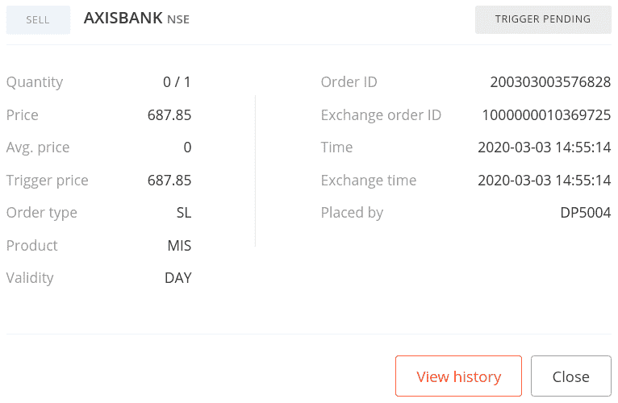

7.  一段时间后再次获取并显示订单状态:

```py
>>> broker_connection.get_order_status(order2_id)
```

我们得到以下输出:

```py
'COMPLETE'
```

如果您使用您的凭据登录到代理站点并转到订单部分，您可以找到您的订单详细信息，如以下屏幕截图所示(某些数据可能因您而异):


8.  去拿 LTP。下`BUY`、`REGULAR`、`DELIVERY`、`STOPLOSS_LIMIT`订单，显示订单 id:

```py
>>> ltp = broker_connection.get_ltp(instrument)
>>> order3_id = broker_connection.place_order(
                instrument=instrument,
                order_transaction_type= \
                    BrokerOrderTransactionTypeConstants.BUY,
                order_type=BrokerOrderTypeConstants.REGULAR,
                order_code=BrokerOrderCodeConstants.DELIVERY,
                order_variety= \
                    BrokerOrderVarietyConstants.STOPLOSS_LIMIT,
                quantity=1,
                price=ltp+1,
                trigger_price=ltp+1)
>>> order3_id
```

我们得到以下输出(您的输出可能不同):

```py
'200303003308116'
```

9.  获取并显示订单状态:

```py
>>> broker_connection.get_order_status(order3_id)
```

我们得到以下输出:

```py
'TRIGGER PENDING'
```

如果您使用您的凭据登录到代理站点并转到订单部分，您可以找到您的订单详细信息，如以下屏幕截图所示(某些数据可能因您而异):


10.  一段时间后再次获取并显示订单状态:

```py
>>> broker_connection.get_order_status(order3_id)
```

我们得到以下输出:

```py
'COMPLETE'
```

如果您使用您的凭据登录到代理站点并转到订单部分，您可以找到您的订单详细信息，如以下屏幕截图所示(某些数据可能因您而异):


11.  去拿 LTP。下`SELL`、`REGULAR`、`DELIVERY`、`STOPLOSS_LIMIT`订单，显示订单 ID:

```py
>>> ltp = broker_connection.get_ltp(instrument)
>>> order4_id = broker_connection.place_order(
                instrument=instrument,
                order_transaction_type= \
                    BrokerOrderTransactionTypeConstants.SELL,
                order_type=BrokerOrderTypeConstants.REGULAR,
                order_code=BrokerOrderCodeConstants.DELIVERY,
                order_variety= \
                    BrokerOrderVarietyConstants.STOPLOSS_LIMIT,
                quantity=1,
                price=ltp-1,
                trigger_price=ltp-1)
>>> order4_id
```

我们得到以下输出(您的输出可能不同):

```py
'200303003312976'
```

12.  获取并显示订单状态:

```py
>>> broker_connection.get_order_status(order4_id)
```

我们得到以下输出:

```py
'TRIGGER PENDING'
```

如果您使用您的凭据登录到代理站点并转到订单部分，您可以找到您的订单详细信息，如以下屏幕截图所示(某些数据可能因您而异):


13.  一段时间后再次获取并显示订单状态:

```py
>>> broker_connection.get_order_status(order4_id)
```

我们得到以下输出:

```py
'COMPLETE'
```

如果您使用您的凭据登录到代理站点并转到订单部分，您可以找到您的订单详细信息，如以下屏幕截图所示(某些数据可能因您而异):

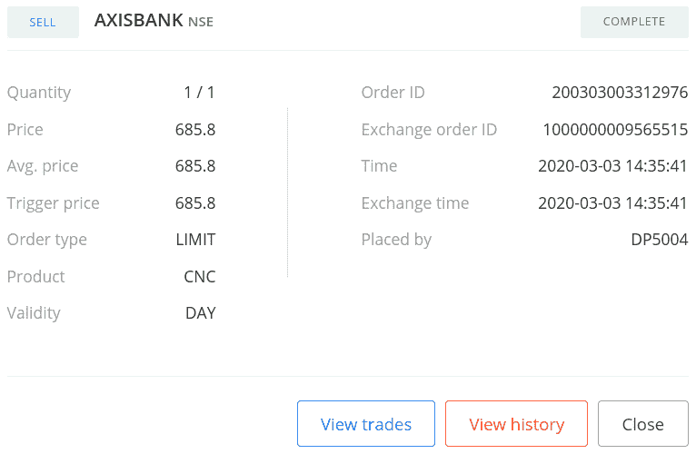

## 它是如何工作的…

在*步骤 1* 中，您使用`BrokerConnectionZerodha`类的`get_instrument()`方法获取一个乐器，并将其分配给一个新属性`instrument`。这个对象是`Instrument`类的一个实例。调用`get_instrument`所需的两个参数是交易所(`'NSE'`)和交易符号(`'AXISBANK'`)。

在*步骤 2* 中，您使用`BrokerConnectionZerodha`类的`get_ltp()`方法获取仪器的 LTP，并将其分配给一个新属性`ltp`。`instrument`对象在这里作为参数传递。接下来，您使用`broker_connection`对象的`place_order`方法在交易所下一个`BUY`、`REGULAR`、`INTRADAY`、`STOPLOSS_LIMIT`订单。`place_order`方法是特定于经纪人的下单 API 的包装器。它具有以下属性:

*   `instrument`:这是必须下单的金融工具，应该是`Instrument`类的一个实例。我们经过`instrument`这里。
*   `order_transaction_type`:这是订单交易类型，应该是`BrokerOrderTransactionTypeConstants`类型的枚举。我们经过`BrokerOrderTransactionTypeConstants.BUY`这里。

*   `order_type`:这是订单类型，应该是`BrokerOrderTypeConstants`类型的枚举。我们经过`BrokerOrderTypeConstants.REGULAR`这里。

*   `order_code`:这是订单代码，应该是`BrokerOrderCodeConstants`类型的枚举。我们经过`BrokerOrderCodeConstants.INTRADAY`这里。
*   `order_variety`:这是订单种类，应该是`BrokerOrderVarietyConstants`类型的枚举。我们经过`BrokerOrderVarietyConstants.STOPLOSS_LIMIT`这里。
*   `quantity`:这是给定工具的交易股数，应为正整数。我们在这里通过`1`。
*   `price`:这是应该下单的限价。我们这里通过`ltp+1`，表示单价在`ltp`以上的`1`。
*   这是下单的触发价格。我们这里通过`ltp+1`，表示单价在`ltp`以上的`1`。

(传递给`place_order`方法的属性是与代理无关的常量，早些时候从`pyalgotrading.constants`模块导入。)

在*步骤 2* 中下订单时，您从代理那里获得一个订单 ID，您将它分配给一个新属性`order1_id`。`order1_id`对象是一个字符串。如果订单由于某种原因没有成功，您可能无法获得订单 ID。观察价格和`trigger_price`参数被传递了一个值`ltp+1`。这意味着订单高于市场价格，这是下`BUY STOPLOSS_LIMIT`订单的必要条件。

在*步骤 3* 中，您使用`broker_connection`对象的`get_order_status()`方法获取已下订单的状态。您将`order1_id`作为参数传递给`get_order_status()`方法。您得到的订单状态为`'TRIGGER PENDING'`，一个字符串。您还可以使用`order1_id`在以后的任何时间点获取所下订单的状态。在*步骤 4* 中，您再次获取订单状态，如果订单完成，您将获得订单状态`'COMPLETE'`。

您也可以通过登录经纪人网站并查看那里的订单部分来验证您的订单是否成功。您应该会看到类似于*步骤 3* 和*步骤 4* 的输出中的截图。

在*步骤 3* 中，如果您看到状态为`'COMPLETE'`而不是`'TRIGGER PENDING'`，这可能是由于高波动性。如果你想让订单停留在`'OPEN'`状态一段时间，试着把订单放在离市场价格更远的地方。

对于不同的属性组合，该配方中的其他步骤遵循相同的下订单并获取其状态的模式:

*   *步骤 5* 、 *6、*和 *7* : `SELL`、`REGULAR`、`INTRADAY`、`STOPLOSS_LIMIT`顺序
*   *步骤 8* 、 *9、*和 *10* : `BUY`、`REGULAR`、`DELIVERY`、`STOPLOSS_LIMIT`顺序
*   *步骤 11* 、 *12、*和 *13* : `SELL`、`REGULAR`、`DELIVERY`、`STOPLOSS_LIMIT`顺序

# 发出常规止损单-市场订单

常规止损单是一种以特定价格下单的订单。与正常的市场订单不同，这不是市场价格。要下这个订单，需要一个名为*触发价格*的特定参数。该参数应满足以下条件:

*   *的触发价格*应该高于`BUY`订单的市场价格。
*   *的触发价格*应该低于`SELL`订单的市场价格。

如果不满足这些条件，订单可能会以市场价格下单，本质上将其转换为常规市场订单，或者可能会被经纪人作为无效订单拒绝。

在发出常规止损单时，它会经历各种中间状态，然后最终到达最终状态(`COMPLETE`、`CANCELLED`或`REJECTED`)。常规止损市场订单可以在`TRIGGER_PEDNING`状态停留一段时间，直到实现有利的市场条件，然后转移到`COMPLETE`状态。

下面的状态机图演示了常规止损市价单在其生命周期内的各种状态:


下单后，它保持在`TRIGGER_PENDING`状态，直到市场价格突破*触发价格*。也就是这个订单被激活并发送到交易所的时候。然后，订单以最佳市场价格执行。订单状态从`TRIGGER_PENDING`到`OPEN`再到`COMPLETE`状态。

常规止损市价订单的行为类似于常规止损限价订单(见*下常规止损限价订单*处方)，除了一个区别——止损市价订单只需要*触发价格*而不需要*限价*，而止损限价订单需要两个参数。您可以将止损市价订单视为止损限价订单，其限价*不受限制*。

本配方演示了下述常规止损单并查询其状态:

*   `BUY`、`REGULAR`、`INTRADAY`、`STOPLOSS_MARKET`顺序
*   `SELL`、`REGULAR`、`INTRADAY`、`STOPLOSS_MARKET`顺序
*   `BUY`、`REGULAR`、`DELIVERY`、`STOPLOSS_MARKET`顺序
*   `SELL`、`REGULAR`、`DELIVERY`、`STOPLOSS_MARKET`顺序

## 做好准备

确保`pyalgotrading`包中的`broker_connection`对象和常量在 Python 名称空间中可用。参照本章*技术要求*一节设置该对象。

## 怎么做…

我们为此配方执行以下步骤:

1.  获取金融工具并将其分配给`instrument`:

```py
>>> instrument = broker_connection.get_instrument('NSE', 
                                                  'KOTAKBANK')
```

2.  去拿 LTP。下`BUY`、`REGULAR`、`INTRADAY`、`STOPLOSS_MARKET`订单，显示订单 ID:

```py
>>> ltp = broker_connection.get_ltp(instrument)
>>> order1_id = broker_connection.place_order(
                instrument=instrument,
                order_transaction_type= \
                    BrokerOrderTransactionTypeConstants.BUY,
                order_type=BrokerOrderTypeConstants.REGULAR,
                order_code=BrokerOrderCodeConstants.INTRADAY,
                order_variety= \
                    BrokerOrderVarietyConstants.STOPLOSS_MARKET,
                quantity=1,
                trigger_price=ltp+1)
>>> order1_id
```

我们得到以下输出(您的输出可能不同):

```py
'200727003362763'
```

3.  获取并显示订单状态:

```py
>>> broker_connection.get_order_status(order1_id)
```

我们得到以下输出:

```py
'TRIGGER PENDING'
```

如果您使用您的凭据登录到代理站点并转到订单部分，您可以找到您的订单详细信息，如以下屏幕截图所示(某些数据可能因您而异):


4.  一段时间后再次获取并显示订单状态:

```py
>>> broker_connection.get_order_status(order1_id)
```

我们得到以下输出:

```py
'COMPLETE'
```

如果您使用您的凭据登录到代理站点并转到订单部分，您可以找到您的订单详细信息，如以下屏幕截图所示(某些数据可能因您而异):

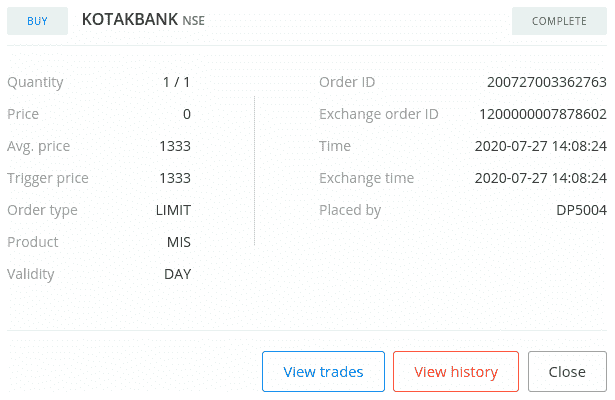

5.  去拿 LTP。下`SELL`、`REGULAR`、`INTRADAY`、`STOPLOSS_MARKET`订单，显示订单 ID:

```py
>>> ltp = broker_connection.get_ltp(instrument)
>>> order2_id = broker_connection.place_order(
                instrument=instrument,
                order_transaction_type= \
                    BrokerOrderTransactionTypeConstants.SELL,
                order_type=BrokerOrderTypeConstants.REGULAR,
                order_code=BrokerOrderCodeConstants.INTRADAY,
                order_variety= \
                    BrokerOrderVarietyConstants.STOPLOSS_MARKET,
                quantity=1,
                trigger_price=ltp-1)
>>> order2_id
```

我们得到以下输出(您的输出可能不同):

```py
'200303003345436'
```

6.  获取并显示订单状态:

```py
>>> broker_connection.get_order_status(order2_id)
```

我们得到以下输出:

```py
'TRIGGER PENDING'
```

如果您使用您的凭据登录到代理站点并转到订单部分，您可以找到您的订单详细信息，如以下屏幕截图所示(某些数据可能因您而异):


7.  一段时间后再次获取并显示订单状态:

```py
>>> broker_connection.get_order_status(order2_id)
```

我们得到以下输出:

```py
'COMPLETE'
```

如果您使用您的凭据登录到代理站点并转到订单部分，您可以找到您的订单详细信息，如以下屏幕截图所示(某些数据可能因您而异):

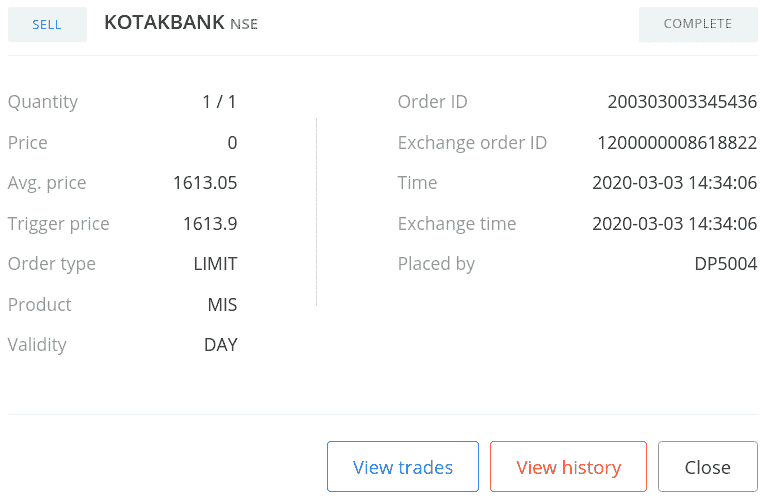

8.  去拿 LTP。下`BUY`、`REGULAR`、`DELIVERY`、`STOPLOSS_MARKET`订单，显示订单 ID:

```py
>>> ltp = broker_connection.get_ltp(instrument)
>>> order3_id = broker_connection.place_order(
                instrument=instrument,
                order_transaction_type= \
                    BrokerOrderTransactionTypeConstants.BUY,
                order_type=BrokerOrderTypeConstants.REGULAR,
                order_code=BrokerOrderCodeConstants.DELIVERY,
                order_variety= \
                    BrokerOrderVarietyConstants.STOPLOSS_MARKET,
                quantity=1,
                trigger_price=ltp+1)
>>> order3_id
```

我们得到以下输出(您的输出可能不同):

```py
'200727003580657'
```

9.  获取并显示订单状态:

```py
>>> broker_connection.get_order_status(order3_id)
```

我们得到以下输出:

```py
'TRIGGER PENDING'
```

如果您使用您的凭据登录到代理站点并转到订单部分，您可以找到您的订单详细信息，如以下屏幕截图所示(某些数据可能因您而异):


10.  一段时间后再次获取并显示订单状态:

```py
>>> broker_connection.get_order_status(order3_id)
```

我们得到以下输出:

```py
'COMPLETE'
```

如果您使用您的凭据登录到代理站点并转到订单部分，您可以找到您的订单详细信息，如以下屏幕截图所示(某些数据可能因您而异):


11.  去拿 LTP。下`SELL`、`REGULAR`、`DELIVERY`、`STOPLOSS_MARKET`订单，显示订单 ID:

```py
>>> ltp = broker_connection.get_ltp(instrument.segment)
>>> order4_id = broker_connection.place_order(
                instrument=instrument,
                order_transaction_type= \
                    BrokerOrderTransactionTypeConstants.SELL,
                order_type=BrokerOrderTypeConstants.REGULAR,
                order_code=BrokerOrderCodeConstants.DELIVERY,
                order_variety= \
                    BrokerOrderVarietyConstants.STOPLOSS_MARKET,
                quantity=1,
                trigger_price=ltp-1)
>>> order4_id
```

我们得到以下输出(您的输出可能不同):

```py
'200727003635594'
```

12.  获取并显示订单状态:

```py
>>> broker_connection.get_order_status(order4_id)
```

我们得到以下输出:

```py
'TRIGGER PENDING'
```

如果您使用您的凭据登录到代理站点并转到订单部分，您可以找到您的订单详细信息，如以下屏幕截图所示(某些数据可能因您而异):

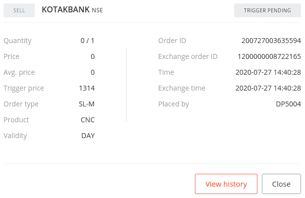

13.  一段时间后再次获取并显示订单状态:

```py
>>> broker_connection.get_order_status(order4_id)
```

我们得到以下输出:

```py
'COMPLETE'
```

如果您使用您的凭据登录到代理站点并转到订单部分，您可以找到您的订单详细信息，如以下屏幕截图所示(某些数据可能因您而异):


## 它是如何工作的…

在*步骤 1* 中，您使用`BrokerConnectionZerodha`类的`get_instrument()`方法获取一个乐器，并将其分配给一个新属性`instrument`。这个对象是`Instrument`类的一个实例。调用`get_instrument`所需的两个参数是交易所(`'NSE'`)和交易符号(`'KOTAKBANK'`)。

在*步骤 2* 中，您使用`BrokerConnectionZerodha`类的`get_ltp()`方法获取仪器的 LTP，并将其分配给一个新属性`ltp`。`instrument`对象在这里作为参数传递。接下来，您使用`broker_connection`对象的`place_order`方法在交易所下一个`BUY`、`REGULAR`、`INTRADAY`、`STOPLOSS_MARKET`订单。`place_order`方法是特定于经纪人的下单 API 的包装器。它具有以下属性:

*   `instrument`:这是必须下单的金融工具，应该是`Instrument`类的一个实例。我们经过`instrument`这里。
*   `order_transaction_type`:订单交易类型，应该是`BrokerOrderTransactionTypeConstants`类型的枚举。我们经过`BrokerOrderTransactionTypeConstants.BUY`这里。

*   `order_type`:这是订单类型，应该是`BrokerOrderTypeConstants`类型的枚举。我们经过`BrokerOrderTypeConstants.REGULAR`这里。
*   `order_code`:这是订单代码，应该是`BrokerOrderCodeConstants`类型的枚举。我们经过`BrokerOrderCodeConstants.INTRADAY`这里。
*   `order_variety`:这是订单种类，应该是`BrokerOrderVarietyConstants`类型的枚举。我们经过`BrokerOrderVarietyConstants.STOPLOSS_MARKET`这里。
*   `quantity`:这是给定工具的交易股数，应为正整数。我们在这里通过`1`。
*   这是下单的触发价格。我们这里通过`ltp+1`，表示单价在`ltp`以上的`1`。

(传递给`place_order`方法的属性是与代理无关的常量，早些时候从`pyalgotrading.constants`模块导入。)

在*步骤 2* 中下订单时，您从代理那里获得一个订单 ID，您将它分配给一个新属性`order1_id`。`order1_id`对象是一个字符串。如果订单由于某种原因没有成功，您可能无法获得订单 ID。注意到`trigger_price`参数被传递了一个值`ltp+1`。这意味着订单高于市场价格，这是下`BUY STOPLOSS_MARKET`订单的必要条件。

在*步骤 3* 中，您使用`broker_connection`对象的`get_order_status()`方法获取已下订单的状态。您将`order1_id`作为参数传递给`get_order_status()`方法。您得到的订单状态为`'TRIGGER PENDING'`，一个字符串。您还可以使用`order1_id`在以后的任何时间点获取所下订单的状态。在*步骤 4* 中，您再次获取订单状态，如果订单完成，您将获得订单状态`'COMPLETE'`。

您也可以通过登录经纪人网站并查看那里的订单部分来验证您的订单是否成功。您应该会看到类似于*步骤 3* 和*步骤 4* 的输出中显示的截图的数据。

在*步骤 3* 中，如果您看到状态为`'COMPLETE'`而不是`'TRIGGER PENDING'`，这可能是由于高波动性。如果你想让订单停留在`'OPEN'`状态一段时间，试着把订单放在离市场价格更远的地方。

对于不同的属性组合，该配方中的其他步骤遵循相同的下订单并获取其状态的模式:

*   *步骤 5* 、 *6* 、 *7* : `SELL`、`REGULAR`、`INTRADAY`、`STOPLOSS_MARKET`顺序
*   *步骤 8* 、 *9、*和 *10* : `BUY`、`REGULAR`、`DELIVERY`、`STOPLOSS_MARKET`顺序
*   *步骤 11* 、 *12、*和 *13* : `SELL`、`REGULAR`、`DELIVERY`、`STOPLOSS_MARKET`顺序