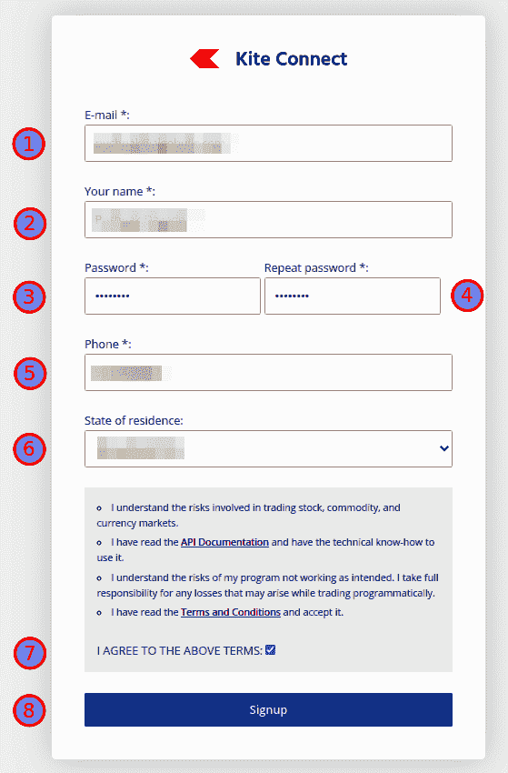
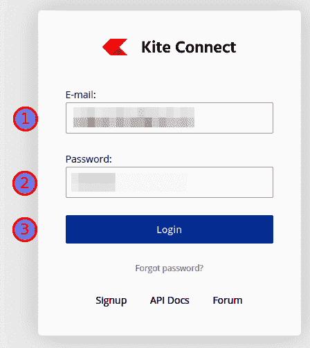
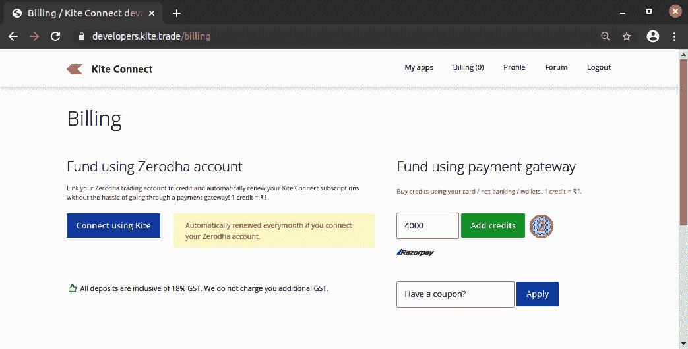
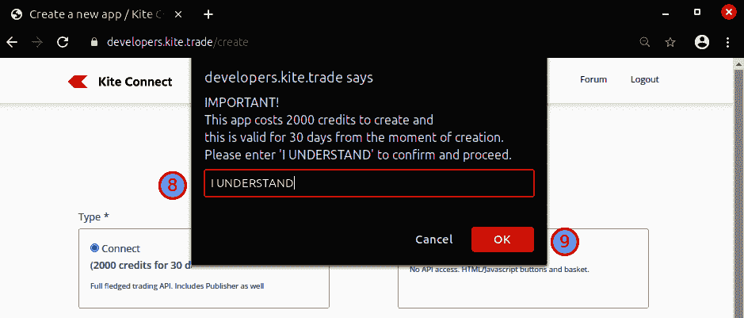
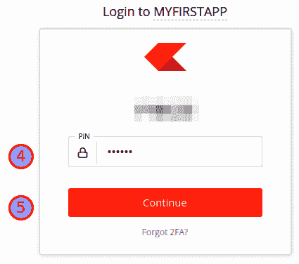
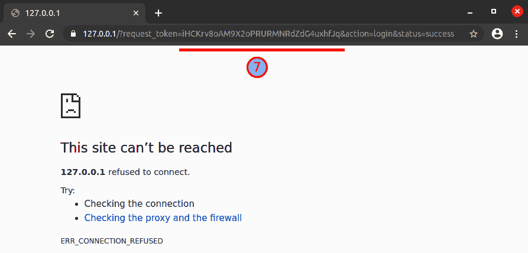

# 十二、附录一：设置您的 Zerodha 帐户

本附录将帮助您在 zero DHA([https://zerodha.com](https://zerodha.com))建立您的经纪账户。

本附录解释了以下部分:

*   在线开立 Zerodha 账户
*   登录 Zerodha 交易平台网站
*   设置您的 Zerodha 开发者选项帐户
*   登录 Zerodha 开发人员选项网站
*   购买和启用 Zerodha 开发人员选项 API
*   通过触发您的第一个 API 调用来测试 API 密钥和授权应用程序

## 在线开立 Zerodha 账户

你可以按照 YouTube 视频中的步骤在线开设你的 Zerodha 账户:[https://www.youtube.com/watch?v=dcOIc8YZ9pc](https://www.youtube.com/watch?v=dcOIc8YZ9pc)。

如果你手头有必要的文件，正如视频中提到的，帐户设置可以在 30 分钟内完成。一旦完成，你的开户过程就开始了，你必须等待 Zerodha 开户团队的回复。Zerodha 通常需要一周时间才能将您的帐户凭证回复给您。

如果您在开户时需要任何帮助，也可以访问 Zerodha 支持链接([https://Support . zero DHA . com/category/account-opening/online-account-opening/articles/how-do-I-open-a-account-online](https://support.zerodha.com/category/account-opening/online-account-opening/articles/how-do-i-open-an-account-online))。

## 登录 Zerodha 交易平台网站

在 Zerodha 成功开户后，你可以用收到的凭证登录他们的交易平台，名为 **Kite** 。游览 https://kite.zerodha.com。

访问网站后，您可以通过五个步骤登录网站:

1.  输入您的用户 ID。
2.  输入您的密码。
3.  点击**登录**按钮:


4.  输入您的 PIN 码:


5.  点击**继续**按钮。

成功登录后，您应该会看到如下屏幕截图所示的控制面板:


## 设置您的 Zerodha 开发者选项帐户

一旦您获得了 Zerodha broking 帐户凭证，我们现在可以继续使用 Zerodha 设置一个开发者选项帐户。

请进入 [https://kite.trade](https://kite.trade) 点击**报名**:


您可以通过八个步骤注册新帐户:

1.  输入您的电子邮件 ID。
2.  输入你的名字**。**
3.  输入您的密码。
4.  验证您的密码。
5.  输入您的电话号码。
6.  选择您居住的州。
7.  阅读并勾选**我同意上述条款**复选框。

8.  点击**注册**按钮:



## 登录 Zerodha 开发人员选项网站

在成功注册 Kite Connect 后，您可以使用您设置的凭据登录。访问 [https://kite.trade](https://kite.trade) 。

您可以通过三个步骤登录网站:

1.  输入您注册的电子邮件 ID。
2.  输入您的密码(用于注册的密码)。
3.  点击**登录**按钮:



首次登录后，您应该会看到这样的页面:


## 购买和启用 Zerodha 开发人员选项 API

有两种类型的 API 可用:

*   **Connect API** :这个 API 允许在 API 上放置订单，获取头寸/持仓/订单，获取配置文件，等等。这个 API 在真实交易中是必需的，但在回溯测试或纸上交易中不是必需的。
*   **历史数据 API** :该 API 允许提取历史数据。如果你正在实现你自己的算法交易系统，这个 API 可能是需要的。您也可以从单独的供应商处获取历史数据。

这两个 API 的文档可以在这里找到:[https://kite.trade/docs/connect](https://kite.trade/docs/connect)。

如果你打算使用 AlgoBulls 交易平台([https://algobulls.com](https://algobulls.com))进行真实交易，那么你只需要为你的经纪账户购买并启用 Connect API。你不需要购买任何 API 来进行回溯测试或者纸上交易。AlgoBulls 平台提供所有服务的历史数据。

分两步登录 [https://kite.trade](https://kite.trade) 即可购买所需 API 的积分:

1.  点击顶部菜单中的**计费**。这将加载一个新页面:


2.  输入所需金额并点击**添加信用**按钮。通过弹出的支付网关窗口完成支付:



如果要同时启用这两个 API，所需金额应该是 **4000** 。如果想只启用 Connect API，需要的数量应该是 **2000。**登录 https://developers.kite.trade/create 了解更多关于购买原料药所需的确切数量。

接下来，要启用所需的 API，应该从登录页面执行以下步骤:

1.  点击**创建新应用**。这将加载一个新页面:


2.  确保选择了**类型** : **连接**。
3.  输入您的应用名称。
4.  输入您的 Zerodha 客户端 ID。
5.  输入`http://127.0.0.1`作为你的**重定向网址**。(如果您在端口`80`上本地托管服务器，您可以输入一个未使用的不同端口的 URL，比如说`http://127.0.0.1:8000`)。
6.  输入应用程序的描述。

7.  点击**创建**按钮:


8.  阅读确认信息并输入`I UNDERSTAND`。
9.  点击**确定**按钮:



这就完成了您的第一个应用程序的创建。现在，您应该会在登录页面上看到您的应用程序:


点击应用程序以查看您的详细信息，并获取 API 密钥和 API 密码。或者，如果您想激活历史数据 API，请在**插件**部分点击**订阅**并确认订阅。这将花费 2000 信用点:


如下面截图所示可以获得密钥( **API 密钥**和 **API 秘密**)。点击**显示 API 秘密**按钮，显示 API 秘密:


## 通过触发您的第一个 API 调用来测试 API 密钥和授权应用程序

您可以使用一个简单的 Python 程序来测试您的 API 键。执行以下步骤:

1.  从`pyalgotrading`导入 Zerodha 代理连接类:

```
>>> from pyalgotrading.broker.broker_connection_zerodha import BrokerConnectionZerodha
```

2.  使用您的 API 密钥和 API 秘密创建代理连接:

```
>>> api_key = "<your-api-key>"
>>> api_secret = "<your-api-secret>"
>>> broker_connection = BrokerConnectionZerodha(api_key, api_secret)
```

您将获得以下结果:

```
https://kite.trade/connect/login?api_key=
```

您需要点击生成的链接并按照以下步骤登录 Zerodha:

1.  输入您的用户 ID。
2.  输入您的密码(用于交易平台)。
3.  点击**登录**按钮:


4.  输入您的 PIN。
5.  点击**继续**按钮:



6.  点击**授权**按钮:


对于新的 Zerodha 开发人员选项应用程序，此步骤只发生一次。

7.  如果您的凭证正确，您将被重定向到`127.0.0.1`。忽略可能显示的任何错误消息。只需从选项卡的地址栏中复制令牌。令牌是字符`request_token=`和`&`之间的字符串，两者都被排除在外。每次执行这些步骤时，都会生成一个新的随机令牌。例如，如果重定向 URL 是`https://127.0.0.1/?request_token=iHCKrv8oAM9X2oPRURMNRdZdG4uxhfJq&action=login&status=success`，那么令牌是`iHCKrv8oAM9X2oPRURMNRdZdG4uxhfJq`:



8.  设置由前面输出中给出的 URL 接收的令牌:

```
>>> request_token = "<your-request-token>"
>>> broker_connection.set_access_token(request_token)
```

9.  您可以通过获取您的个人资料详细信息来检查连接是否成功:

```
>>> broker_connection.get_profile()
```

这会产生以下输出:

```
{'user_id': <your-user-id>,
 'user_type': 'individual',
 'email': '<your-email-id>',
 'user_name': <your-user-name>',
 'user_shortname': <your-user-shortname>',
 'broker': 'ZERODHA',
 'exchanges': ['CDS', 'MF', 'NFO', 'NSE', 'BSE'],
 'products': ['CNC', 'NRML', 'MIS', 'BO', 'CO'],
 'order_types': ['MARKET', 'LIMIT', 'SL', 'SL-M'],
 'avatar_url': '',
 'meta': {'demat_consent': 'physical'}}
```

这成功地验证了 API 键正在工作。