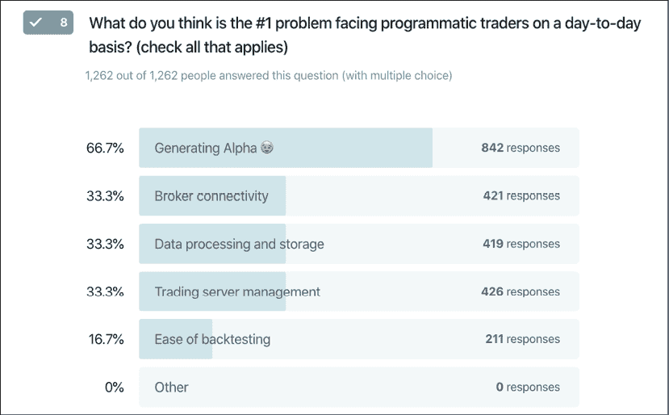
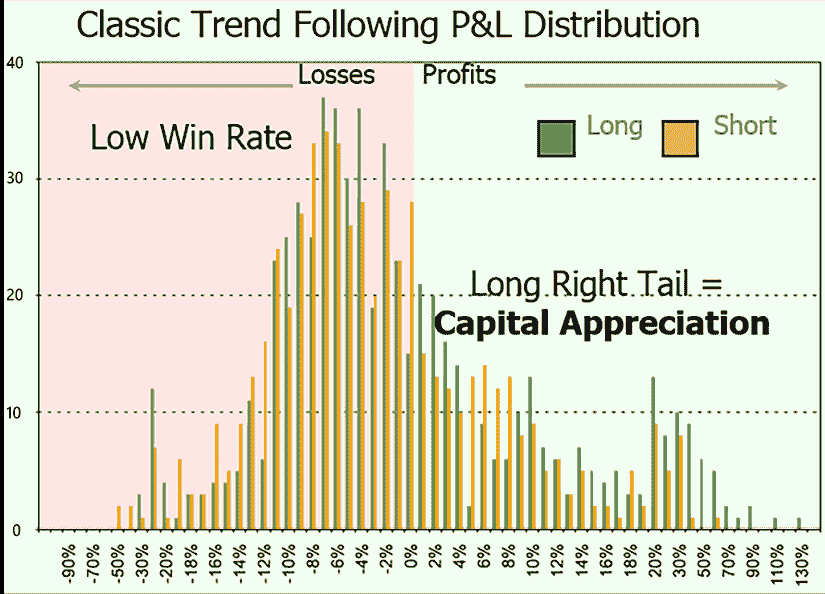
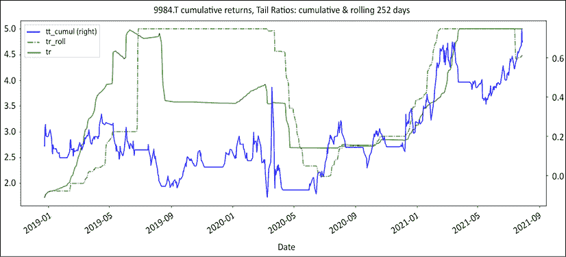

# six

# 交易优势是一个数字，下面是公式

在这一章中，我们将揭开金融行业中一个守卫最森严的秘密:幕后不是一个老人，而是一个简单的公式。然后，我们将这个公式分解成两个不同的模块:信号和资金管理。

在信号模块中，我们将探索如何确定进场和出场的时间，以及两种策略类型的属性，这两种策略似乎提供了交易优势；趋势跟踪和均值回归。我们将在*第 7 章*、*提高你的交易优势*中继续这个讨论，然后在*第 8 章*、*仓位调整中更深入地讨论资金管理模块:资金是在资金管理模块*中产生的。

在此过程中，我们将讨论以下主题:

*   导入库
*   交易优势公式:算术和几何收益预期
*   交易优势不是一个故事
*   不考虑资产类别，只有两种策略

您可以通过以下链接访问本章所有图片的彩色版本:[https://static . packt-cdn . com/downloads/9781801815192 _ color images . pdf](https://static.packt-cdn.com/downloads/9781801815192_ColorImages.pdf)。你也可以通过这本书的 GitHub 资源库获得本章的源代码:[https://GitHub . com/Packt publishing/algorithm-Short-Selling-with-Python-Published-by-Packt](https://github.com/PacktPublishing/Algorithmic-Short-Selling-with-Python-Published-by-Packt)

# 导入库

对于这一章和本书的其余部分，我们将使用`pandas`、`numpy`、`yfinance`和`matplotlib`库。因此，请记住首先导入它们:

```
# Import Libraries
import pandas as pd
import numpy as np
import yfinance as yf
%matplotlib inline
import matplotlib.pyplot as plt 
```

# 交易优势公式

> “信息不是知识。”
> 
> –阿尔伯特·爱因斯坦，专利办事员

谁说科幻小说没有进入严峻的金融世界？向任何对冲基金经理询问他们的优势，你将进入一个十字军打击公司阴谋的世界，金融夏洛克·霍尔姆斯耐心地将信息拼图拼凑在一起，远见者投资于下一个新的[在此插入下一个颠覆性的技术术语……]。

交易行业的每个人都会说，你需要一个优势来赚钱。然而，他们永远不会告诉你如何建立一个可持续的，大概是担心传播会侵蚀他们的。可以理解的是，交易优势一直是这种神秘的秘方。

只有三种常见的优势类型:技术优势、信息优势和统计优势，这些优势将在接下来的几个部分中讨论。

## 技术优势

与 10 年前的任何顶级机构投资者相比，今天的任何散户交易者都能获得更多的信息和计算能力。任何拥有一点 Python 技能的人都可以从互联网上抓取数据，并通过机器学习或人工智能进行处理，这比任何传统研究部门都要快得多。一个对冲基金级别的云基础设施每月花费不到 50 美元。任何人都可以在 YouTube、Quora 或任何其他学习平台上免费学习如何编码、分析数据、交易、投资和管理投资组合。技术给金融界带来了民主。

每个人都想成为吉姆·西蒙斯，但没人想去管水管。如图 6.1 所示，当被问及程序化交易者面临的首要问题是什么时，三分之一的回答与数据处理、存储和服务器管理有关。这表明，对于许多有抱负的算法交易员来说，主要障碍仍然是技术，他们需要一个完整的工程团队来实现交易自动化。市场参与者需要是专家系统工程师，以确保持续的连接。然后，他们必须提高他们的开发技能，写出不仅是机器，更重要的是人类也能读懂的代码。



图 6.1:交易自动化的瓶颈:对于许多有抱负的算法交易者来说，主要的障碍仍然是技术

策略的第一次迭代就像囚禁米开朗基罗的大卫的石头。需要大量耐心的雕刻才能揭示以弗所。如果写得不好，要花更多的时间来理清另一种意大利文化遗产:意大利面条。所有这些都处理好之后，市场参与者终于可以专注于设计阿尔法生成策略了。接下来是一系列的困难:扩大/缩小，风险管理，这本书讲述的所有有趣的东西。将价值数十亿美元的想法转化为无错误的代码仍然是一个令人生畏的技术障碍。底线是，要让钱为你工作需要大量的工作。

一个简单的类比就是苹果 1 时代的个人电脑产业。每个人都想玩太空入侵者。只有极少数铁杆玩家愿意自己组装电脑玩游戏。如今，其他所有比特币爱好者都想学习算法交易。很少有人愿意投入汗水、鲜血和泪水来搭建自己的平台。这本书将为你提供构建自己战略的基础。

## 信息优势

传统上，这个行业的运作是基于这样一种信念，即信息会带来优势。这要么是特权信息，如接触高层管理人员和分析师给予的更好待遇，要么是其更险恶的表亲，内部信息。任何信息优势都会被迅速套利掉。

信息优势从一开始就没有真正发挥作用。如果击败华尔街所需要的只是更好的信息优势，那么理论上，大型交易公司的动物王国——它们的分析师议会、博士学校、基金经理的骄傲、交易者的谋杀、卖方研究人员的漂移、经纪人的成群结队和专家意见的万花筒——拥有快速拨号的公司访问和足够拯救半个大陆的资金——将持续胜过市场。实际上，有记录以来的每一年，受人尊敬的机构都一瘸一拐地跟在低技术含量的普通指数基金后面。信息只能提供暂时的优势，随着时间的推移，这种优势会越来越快地被套利。信息想要民主化。

## 统计优势

统计优势不容易被套利交易消除。它的存在和持续是设计好的。重要的不是“什么”,而是“如何”交易。在接下来的部分，我们将看看如何建立一个强大的统计交易优势。我们不会试图告诉你如何选择不同的股票，而是如何从你已经选择的股票中挤出更多的汁液。

# 交易优势不是一个故事

> “如果你不能衡量它，你就不能改善它。”
> 
> 彼得·德鲁克

交易优势不是一个故事。交易优势是一个数字，公式由几个函数组成:

1.  算术收益预期:在 execution trader English 中，这是你赢的频率乘以你平均赚了多少减去你输的频率乘以你平均输了多少。这个函数是经典的算术期望，在每所中学的统计学导论中都会出现，但在金融 MBA 课程中却没有。当谈论交易优势或收益预期时，市场参与者默认算术收益预期。很容易掌握和计算。这个公式简单明了，即使对那些不了解其复杂性的人来说也是如此。

    ```
    # Expectancy formula, win_rate is your Hit ratio, avg_win is the average gain per trade, and avg_loss is the average loss per trade
    def expectancy(win_rate, avg_win, avg_loss):
        # win% * avg_win% - loss% * abs(avg_loss%) 
        return win_rate * avg_win + (1-win_rate) * avg_loss 
    ```

2.  几何收益预期(乔治):利润和损失几何复合。几何增益预期在数学上更接近策略的预期稳健性。

    ```
    def george(win_rate,avg_win,avg_loss):  
        # (1+ avg_win%)** win% * (1- abs(avg_loss%)) ** loss%  -1 
        return (1+avg_win) ** win_rate * (1 + avg_loss) ** (1 - win_rate) - 1 
    ```

3.  凯利标准是一种头寸规模算法，可以优化投资组合的几何增长率。凯利有一段迷人的历史，从 18 世纪<sup xmlns:epub="http://www.idpf.org/2007/ops" class="Superscript--PACKT-">数学家丹尼尔·伯努利开始，由小 J.L .凯利重新发现，由传奇人物爱德华·索普推广。Kelly 使用了和之前一样的原料，但是烹饪方式有所不同。

    ```
    def kelly(win_rate,avg_win,avg_loss):  
        # Kelly = win% / abs(avg_loss%) - loss% / avg_win% 
        return win_rate / np.abs(avg_loss) - (1-win_rate) / avg_win 
    ```</sup> 

在本章和下一章，我们将使用一个基本的策略来展示公式是如何工作的。把它想象成傻瓜的海龟交易者。首先，我们用软银回收 50/20 海龟(9984。t)而不模拟滑点或交易成本。该代码是从*第 5 章*、*政权定义*中循环而来的。首先，我们重新定义一些函数。

```
def regime_breakout(df,_h,_l,window):
    hl =  np.where(df[_h] == df[_h].rolling(window).max(),1,
                                np.where(df[_l] == df[_l].rolling(window).min(), -1,np.nan))
    roll_hl = pd.Series(index= df.index, data= hl).fillna(method= 'ffill')
    return roll_hl

def turtle_trader(df, _h, _l, slow, fast):
    '''
    _slow: Long/Short direction
    _fast: trailing stop loss
    '''
    _slow = regime_breakout(df,_h,_l,window = slow)
    _fast = regime_breakout(df,_h,_l,window = fast)
    turtle = pd. Series(index= df.index, 
                        data = np.where(_slow == 1,np.where(_fast == 1,1,0), 
                                np.where(_slow == -1, np.where(_fast ==-1,-1,0),0)))
    return turtle 
```

然后我们让软银通过傻瓜海龟策略，计算回报，并打印出两张图表。

```
ticker = '9984.T' # Softbank
start = '2017-12-31'
end = None
df =  round(yf.download(tickers= ticker,start= start, end = end, 
                        interval = "1d",group_by = 'column',
                        auto_adjust = True, prepost = True, 
                        treads = True, proxy = None),0)
slow = 50
fast = 20 
df['tt'] = turtle_trader(df, _h= 'High', _l= 'Low', slow= slow,fast= fast)
df['stop_loss'] = np.where(df['tt'] == 1, df['Low'].rolling(fast).min(),
                    np.where(df['tt'] == -1, df['High'].rolling(fast).max(),np.nan))

df['tt_chg1D'] = df['Close'].diff() * df['tt'].shift()
df['tt_PL_cum'] = df['tt_chg1D'].cumsum()

df['tt_returns'] = df['Close'].pct_change() * df['tt'].shift()
tt_log_returns = np.log(df['Close']/df['Close'].shift()) * df['tt'].shift()
df['tt_cumul'] = tt_log_returns.cumsum().apply(np.exp) - 1 

df[['Close','stop_loss','tt','tt_cumul']].plot(secondary_y=['tt','tt_cumul'],
                                  figsize=(20,8),style= ['k','r--','b:','b'],
                       title= str(ticker)+' Close Price, Turtle L/S entries, cumulative returns')

df[['tt_PL_cum','tt_chg1D']].plot(secondary_y=['tt_chg1D'],
                                  figsize=(20,8),style= ['b','c:'],
                                 title= str(ticker) +' Daily P&L & Cumulative P&L') 
```

该代码采取以下步骤:

1.  使用对数回报:对数回报比算术回报更容易操作。算术和不会复合，而对数会。累积收益用`apply(np.exp)` 法计算。
2.  策略进入/退出:使用`shift()` 方法，进入和退出延迟一格。

下图用黑色显示了收盘价，用红色虚线显示了跟踪止损。在副轴上，我们有多头/空头头寸:–1 代表空头，+1 代表多头。蓝色实线是累积收益:


图 6.2:傻瓜海龟:多头和空头，累积收益

这一策略似乎以其原始的形式发挥了作用。第二个图表显示了每日和累计的利润和亏损。平线是指没有活动位置的情况:


图 6.3:软银每日和累计损益(P&L)

接下来，我们将计算滚动利润、亏损和预期，并将它们绘制成图表。

```
# Separate profits from losses
loss_roll = tt_log_returns.copy()
loss_roll[loss_roll > 0] = np.nan
win_roll = tt_log_returns.copy()
win_roll[win_roll < 0] = np.nan

# Calculate rolling win/loss rates and averages
window= 100
win_rate = win_roll.rolling(window).count() / window
loss_rate = loss_roll.rolling(window).count() / window
avg_win = win_roll.fillna(0).rolling(window).mean()
avg_loss = loss_roll.fillna(0).rolling(window).mean()

# Calculate expectancies
df['trading_edge'] = expectancy(win_rate,avg_win,avg_loss).fillna(method='ffill')
df['geometric_expectancy'] = george(win_rate,avg_win,avg_loss).fillna(method='ffill')
df['kelly'] = kelly(win_rate,avg_win,avg_loss).fillna(method='ffill')

df[window*2:][['trading_edge', 'geometric_expectancy', 'kelly']].plot(
    secondary_y = ['kelly'], figsize=(20,6),style=['b','y','g'], 
    title= 'trading_edge, geometric_expectancy, kelly') 
```

1.  复制`win_roll`和`loss_roll`中的日收益，得到统一长度的系列。为`win_roll`系列的损失分配 N/A，反之亦然，为`loss_roll`系列分配利润。
2.  实例化窗口大小和滚动计数，以计算胜率和损失率。
3.  滚动求和法不支持缺失值。因此，我们使用`fillna(0)`方法用`0`替换缺失值来计算移动平均值。填充数据框并绘图。


图 6.4:软银滚动交易优势，几何预期，凯利

这个策略有一个积极的交易优势，但是再次请不要在家里尝试这个——它太简单了，不能在真钱产品中使用，并且只用于教育目的。图表上的那三条线是同一主题的变体。食材是一样的，但是做菜有点不一样。关键要点是:在预期收益变为正值之前，什么都不会发生。夏普，索蒂诺，延森，特雷诺和信息比率都很好，但它们是在预期增益为正之后出现的。

所有这些公式都可以分解成两个模块:

*   **信号模块**:胜败率。这些是进场和出场信号产生的回报。
*   **资金管理模块**:平均盈亏。这些贡献来自回报乘以下注规模。

这揭示了交易优势是可以从头设计的。市场参与者假装由于他们的分析能力和机器学习水晶球，他们对未来有更好的了解。与此同时，赌场公开宣传随机性。尽管如此，前者回报参差不齐，而后者日复一日地不断印钞。这不是巧合。前者相信知识是一种优势，而赌场操纵他们的优势。因此，每个市场参与者的工作就是优化他们的交易优势。在接下来的几章中，我们将考虑如何设计这些模块并最大化交易优势，从信号模块开始，然后进入资金管理模块和第 8 章、*中的头寸调整:资金是在资金管理模块*中产生的。

所以，事不宜迟，让我们从信号模块开始。

## 信号模块:入口和出口

> “你必须知道什么时候握牌，
> 知道什么时候弃牌，
> 知道什么时候收手，
> 知道什么时候跑路。”
> 
> 肯尼·罗杰斯，赌徒

让我们从一劳永逸地扼杀一个经典神话开始:“只要你 51%的时间是正确的，你就会赚钱。”不对。他们自己也承认，拥有数十年业绩记录的行业顶尖企业往往声称长期胜率平平。相反，在 2000 年清算和解散之前，LTCM 的胜率非常高。

只要你有有利的交易优势，你就会赚钱。我们首先需要设计的是信号模块。正如我们在*第一章*、*股市游戏*中看到的，误报无法根除。随机性会一直存在。每个篮子里都有几个坏苹果。关键是设计政策来发现那些坏苹果，在它们糟蹋篮子之前处理它们，然后继续前进。

### 条目:选股被大大高估了

> "殴打将持续到士气提高为止。"
> 
> 布莱舰长，英国皇家舰艇邦蒂号

股票市场是唯一一项人们喜欢在比赛开始前颁发奖牌的竞技运动。这个行业建立在对选股人的狂热崇拜之上。每个人都喜欢谈论他们最喜欢的股票。市场参与者 90%的精力都集中在做出正确的决定上。不幸的是，同样 90%的市场参与者将无法连续 5 年超过基准。

在量化交易员的行话中，这被称为相关性。当相关性年复一年地持续记录在案的每一年时，r 的平方，量子术语中的*因果关系*，就等于 1。在执行交易英语中，疯狂是指普通沮丧的市场参与者投入越来越多的精力和资源选股，却年复一年地失败。总之，90%的市场参与者不出所料地失败了，因为他们总是关注错误的事情:入场。也许现在是我们考虑采取不同方法的时候了。

根据杰里米·西格尔教授的说法，股市的长期平均回报率为+7%。从短边来看，这给寒暄留下了很小的空间。想法便宜又丰富。每个人都有一个装满百万美元创意的袋子。想法和利润的区别，叫做执行力。正如我们在*第一部分*、*中看到的，内部游戏:揭开卖空的神秘面纱*，许多市场参与者在做空方面失败，因为他们是在想法萌发时进入的，而不是在它们完全成熟时进入的。表现不佳在财务上相当于我们吃了还未成熟的水果而消化不良。

这本书不会给你一个银弹方法论。这本书的目的是介绍一种对市场的概率观点，这样你就可以成为一个统计上更好的自己。这本书仅仅是一本烹饪书，介绍你带到餐桌上的食材。基本面、技术面和量化卖空者都赚了钱，但如果没有先获得概率，他们不可能成功。

有两个时候你需要认识到概率:选股和进场。在执行交易者英语中，这意味着在扣动扳机之前，有两次你应该听听市场怎么说。

*   首先，你需要做空横盘或熊市的股票。在牛市中做空股票就像站在铁轨上，期待货运列车一辆接一辆地停下来。在*第 5 章，制度定义*中，我们学习了一种根据制度对股票进行重新分类的客观方法。由于卖空是一种相对游戏(股票价格的绝对下跌是一个滞后指标)，制度变革通常以股票市场板块轮换的形式出现。昨天的宠儿是明天的狗。
*   The second time when you need to be aware of probabilities is entry. Market participants coming from the long side like to buy on breakouts. The same logic does not translate well on the short side. Remember that almost all market participants are in the markets to buy long. Some people have been waiting on the sideline for an opportunity to buy on dips. Fast-falling markets are often followed by rapid bear market rallies. There is a short window when probabilities are in favor of short sellers.

    进入空头头寸的最佳时机是熊市反弹结束的时候。我们将在*第三部分*、*多空博弈:构建多空产品*中复习做空的合气道。

我们之前看到了增益预期的视觉表现。在接下来的章节中，我们将会看到一些提高你交易优势的技巧。它们不仅限于卖空。有些可能不适合你的风格或策略。

### 退出:账面利润向实际货币的转化

唯一没有撤退策略就投入战斗的士兵被称为神风特攻队士兵。他们不指望活着回来。因为你可能不希望你的交易看起来像自杀任务，所以制定退出策略的最佳时间是在你“被套牢”之前，进入一个位置。

在金融服务行业，唯一比卫生纸便宜的是后验测试和模拟打印。这只是纸币。没人会受伤。真正的钱是唯一重要的东西。让我们把这个想法更进一步。你唯一知道赚了多少“真钱”，或者赔了多少的时候，是在结束交易之后。在此之前的任何东西都被称为账面利润。底线:退出很重要。

我们都习惯于相信我们最初的选择是最重要的。如果我们有合适的实习，从合适的大学毕业，或者选择了合适的第一份工作，那么我们的职业生涯就会一帆风顺。然而，生活是当我们有其他计划时发生在我们身上的事情。我们经常低估运气在我们生活中的作用。在正确的时间出现在正确的地点让许多幸运的人变得富有。然而，这些人第一次尝试很少成功。他们尝试，失败，然后转向，直到最终有所突破。

由于市场参与者喜欢购买和持有，婚姻可以说是一个明智的比喻。每一桩婚姻都以乐观的“从此幸福快乐”开始，然而大约一半的婚姻以离婚统计结束。结婚很容易。离婚是改变人生的大事。如果你在结婚前没有考虑到不测，那么这将是情感上和经济上的毁灭性打击。糟糕的婚姻是可以挽救的。糟糕的离婚不能。坏条目可以被挽救。不好的退场不行。这就是 P&L 的印刷时间。

在接下来的章节中，你会看到，提高交易优势的 7 个步骤中有 5 个是处理亏损的。另一个很好的类比是个人理财。有两种方法可以增加你的储蓄。要么你维持目前的支出，去找一份收入更高的工作，要么你限制支出，存下差额。如果你有稳定的高薪，前者效果很好。

如果你的收入完全是可变的，那么你更明智的做法是保持一个低的固定成本基数，将你从市场上获得的任何差价收入囊中。你会得到和其他玩家一样的高薪，但是不同的是你不需要他们来维持生计。在财务克里奥尔语中，这种对支出的关注被称为“减少损失”

# 不考虑资产类别，只有两种策略

杰克·施瓦格经常指出，没有放之四海而皆准的圣杯。市场奇才以各种形式出现，有时甚至带有矛盾的策略。不过他们有一个共同点。他们擅长管理风险和控制损失。他们总是关注不利的一面。胜利的位置会照顾好自己。市场参与者的工作是照顾输家。

市场参与者通常用他们交易的“什么”来定义自己(资产类别、市场、时间跨度)，很少用他们交易的“方式”来定义自己。不考虑资产类别的，只有两种策略:趋势跟踪和均值回归。只有两种策略的原因不是进入，而是退出。你如何选择平仓决定了你的主要交易风格。当低效率得到纠正时，均值回归阵营提前结束。追随趋势的人群喜欢驾驭他们的赢家。一个经典的例子是价值与增长。价值投资者购买被低估的股票，然后将接力棒交给成长型投资者，后者驾驭这些股票走向夕阳。

例如，均值回归市场参与者会以 0.5 的**市净率**(**)买入一只股票，当 PBR 回到 1 时平仓，然后继续前进。趋势跟踪者会以同样的估值买入同样的股票，但会把它带入极度兴奋的状态。在这个曾经默默无闻、研究不足的名字最终进入一级投资银行的“强烈买入”名单，并在此后表现不佳之后，他们最终会平仓。**

 **一些读者可能会认为，价值投资者更像是均值回归型投资者，而成长型经理更像是趋势追随型投资者。这通常是真的，但并不总是如此。最好的反例，也可能是终极价值趋势跟随者是沃伦·巴菲特。他投资于被低估的企业，并打算永久持有。你的位置不是百达翡丽手表。你没有为后代保留它们。在某个时候，你会平仓。只有三种情况会发生:价格上涨、下跌或不涨。你要么赔钱，要么赚钱，要么浪费钱。每个案例都需要一个场景。你需要一个计划来实现利润，减少损失，并对付吃白食的人。我们的目标是设计一个更好的统计交易优势。如果只有两种策略类型，那么花时间了解它们的行为方式、收益和风险，以及它们是互斥的还是兼容的是很重要的。

## 趋势跟踪

> "坐等赚钱."
> 
> 杰西·利弗莫尔

**趋势跟随**策略依赖于少数大赢家的资本增值。系统化的商品交易顾问(**CTA**)寻找突破并设置保护性的跟踪止损。技术分析师寻找进场点，乘势上涨。即使是基本面选股者也有资格成为趋势跟踪者。它们跟随基本面、盈利势头甚至信息流的改善，而不是价格走势。底线是，不管他们有意识地承认与否，市场参与者的默认模式是趋势跟踪。因为趋势跟踪是市场参与者的主要模型，我们在本书中使用了一个基本的趋势跟踪策略(傻瓜海龟)。

这是趋势跟踪者的 P&L 分布图:



图 6.5:经典的趋势跟踪多头/空头 P&L 分布

我们可以观察到以下特性:

*   低胜率:30%到 50%之间的某个地方。峰值交易数在分布的亏损部分。对于每一个 Alphabet、亚马逊或苹果，都有数不清的 Nestcapes、Ataris 或 MySpaces。
*   阿尔法一代(Alpha generation):趋势跟踪策略依靠少数赢家的资本增值来抵消大量的小亏损。这导致利润随时间推移而增长，而亏损则迅速削弱股票曲线。亏损很快得到解决，而赢家需要时间成熟。
*   **正偏斜**:右尾 P & L 分布给出了有利的尾部比率。赢家比输家大。上图是历史悠久的“砍掉你的失败者，驾驭你的成功者”的形象化展示同样，实现这些巨额回报需要时间。与此同时，权益曲线必须处理沿途的青蛙污点。
*   **周期性**:市场不会一直保持趋势。风格时好时坏。当一种风格不起作用时，亏损就开始增加。成功的趋势跟踪者会很快意识到自己的错误，把个人损失控制在较小的范围内。当他们的风格受欢迎时，他们就驾驭潮流走向日落。
*   相对较低的成交量:成交量是周期性的函数。当市场趋势向上或向下时，没有必要做任何事情。传奇交易者杰西·利弗莫尔曾经说过，钱是在等待中赚来的。当一种风格不再受欢迎时，随着更多的青蛙被搅动，营业额将会增加。
*   **波动性**:这是周期性的后果。市场参与者会经历回报低迷的时期。

趋势跟踪者亲吻了很多青蛙。风险在于，所有美味的蝙蝠人累积起来的污点可能抵不上几个公主的美貌。趋势跟踪策略的风险在于亏损对利润的总权重。

趋势跟踪策略最相关的风险指标是比较累计利润和亏损。这就是先知杰克·施瓦格(Jack Schwager)所青睐的收益-痛苦比(gain-to-pain ratio)，也就是俗称的利润因子或获利能力因子。它指出，当分子中的累计利润超过亏损时，比率大于 1，反之亦然，对于亏损策略。这是算术增益预期的另一个版本，作为一个比率而不是一个增量。

```
def rolling_profits(returns,window):
    profit_roll = returns.copy()
    profit_roll[profit_roll < 0] = 0
    profit_roll_sum = profit_roll.rolling(window).sum().fillna(method='ffill')
    return profit_roll_sum

def rolling_losses(returns,window):
    loss_roll = returns.copy()
    loss_roll[loss_roll > 0] = 0
    loss_roll_sum = loss_roll.rolling(window).sum().fillna(method='ffill')
    return loss_roll_sum

def expanding_profits(returns): 
    profit_roll = returns.copy() 
    profit_roll[profit_roll < 0] = 0 
    profit_roll_sum = profit_roll.expanding().sum().fillna(method='ffill') 
    return profit_roll_sum 

def expanding_losses(returns): 
    loss_roll = returns.copy() 
    loss_roll[loss_roll > 0] = 0 
    loss_roll_sum =    loss_roll.expanding().sum().fillna(method='ffill') 
    return loss_roll_sum 

def profit_ratio(profits, losses):    
    pr = profits.fillna(method='ffill') / abs(losses.fillna(method='ffill'))
    return pr

window = 252
df['pr_roll'] = profit_ratio(profits= rolling_profits(returns = tt_log_returns,window = window), 
                             losses= rolling_losses(returns = tt_log_returns,window = window))
df['pr'] = profit_ratio(profits= expanding_profits(returns= tt_log_returns), 
                             losses= expanding_losses(returns = tt_log_returns))

df[window:] [['tt_cumul','pr_roll','pr'] ].plot(figsize = (20,8),secondary_y= ['tt_cumul'],
                            style = ['b','m-.','m'], 
  title = str(ticker)+' cumulative returns, Profit Ratio, cumulative &  rolling '+str(window)+' days') 
```

上面的代码计算滚动和累积的收益-痛苦/利润比率。结构是对称的，所以我们集中讨论滚动利润。

1.  通过复制退货系列实例化一个`profit_roll`数据帧。将`0` 分配给损失。这将保持数据帧的形状。
2.  使用`rolling`方法计算滚动总和。使用`fillna`方法填充`#N/A`缺失值。
3.  根据`rolling_profits`和`rolling_losses`函数，计算`profit_ratio`。
4.  `rolling` 函数后面是累积版本。综合来看，`expanding()` 方法和流行的`cumsum()` 方法做的是一样的事情。唯一的区别是`expanding()` 不会像`cumsum()`那样在丢失值时重置为`0`。


图 6.6:软银累积回报率和利润率:滚动和累积

上图描绘了滚动和累积利润比率以及信号。由于信号不稳定，利润率急剧下降。相反，趋势市场的利润率会上升。

趋势跟踪策略带来了令人印象深刻但不稳定的表现。他们经历了长时间的表现平平，这对经理和投资者的情感资本造成了损害。他们的主要挑战是保持较小的累积损失。只有在亏损保持在较小的程度上，利润才会看起来很大。

为了说明这个现象，一个原始的海龟交易者曾经说过，有了 30%以上的胜率，他们持有了预期会失败的头寸。这种心态上的微妙转变让他们对风险管理更加警惕。

## 平均值回复

**均值回归**策略复利无数。他们依赖的前提是，极端最终会回归均值。他们套利市场的低效率。均值回归策略本质上是捕捉修正低效率所需的时间。例如，与标的股票相比，权证的价格可能看起来很便宜。随着时间的推移，价格会趋于一致，差距会缩小。它们通常具有低波动性和稳定的表现。他们在既定的市场中表现良好:牛市、熊市或横盘。偏好均值回归策略的市场是典型的横盘阶段，价格以半可预测的方式波动。他们可能会发现牛市或熊市阶段更具挑战性，但有大量的经验证据表明，有才华的经理人在这些市场表现出色。同样，风险管理是专业人士和游客的区别。

均值回归策略在制度变化期间表现不佳。例如，多头高贝塔，空头低贝塔会在牛市中创造奇迹，但当市场形态转变为横盘和熊市时，会有很多表现。上一轮牛市的宠儿有时会在随后的熊市中一路走低。他们在尾部事件中也表现不佳。短期伽马基金多年来表现良好，直到它们在 2008 年 GFC 期间惊人地在三周内爆发。


图 6.7:经典的长/短均值回归 P&L 分布

均值回复策略的特点是:

*   **阿尔法一代**:均值反转策略失误率高。他们**的驻地**薄利多销。
*   **负偏斜**:左尾 P & L 分布。不利尾比:输家比赢家大。上图直观地展示了一句由来已久的格言“你不能因为获利而破产。”事实证明，如果损失太大，你或许可以。均值回归策略套利无效率。当低效率得到纠正时，交易就结束了。有时，这些低效率持续存在。因为最初的前提是低效率必然会得到纠正，所以止损并不强制执行。这导致了罕见但毁灭性的打击。
*   **胜率高**:往往在 50%以上。市场并非在所有时间框架下都是有效的。
*   **中到高周转率**:在实践中，低效率比**有效市场假说** ( **EMH** )和后来的学术理论普遍认为的更频繁出现。
*   **持续的低波动性小利润**:均值反转策略在稳定的市场机制中套利多个小的低效率。
*   **潜在的毁灭性左尾损失**:均值回归策略在成熟市场执行，在那里低效率得到纠正。当过去的低效率持续存在时，它们会在政权更迭期间失败。有趣的是，趋势跟踪策略在均值回复策略失效的时候开始表现良好。
*   **缓慢复苏**:意思是逆转策略银行薄利多销。需要很多小胜利来抵消一些大损失。

正如我们前面看到的，均值回归策略会带来持续的小利润，但会遭受罕见但却是决定性的挫折。均值回归策略的风险在尾部。几次毁灭性的损失就足以使船沉没。毕竟泰坦尼克号的船长有 99%的胜率。因此，最相关的风险衡量标准是最大利润与最大损失的比率，即尾部比率:

```
def rolling_tail_ratio(cumul_returns, window, percentile,limit):
    left_tail = np.abs(cumul_returns.rolling(window).quantile(percentile))
    right_tail = cumul_returns.rolling(window).quantile(1-percentile)
    np.seterr(all='ignore')
    tail = np.maximum(np.minimum(right_tail / left_tail,limit),-limit)
    return tail

def expanding_tail_ratio(cumul_returns, percentile,limit):
    left_tail = np.abs(cumul_returns.expanding().quantile(percentile))
    right_tail = cumul_returns.expanding().quantile(1 - percentile)
    np.seterr(all='ignore')
    tail = np.maximum(np.minimum(right_tail / left_tail,limit),-limit)
    return tail

df['tr_roll'] = rolling_tail_ratio(cumul_returns= df['tt_cumul'], 
                             window= window, percentile= 0.05,limit=5)
df['tr'] = expanding_tail_ratio(cumul_returns= df['tt_cumul'], percentile= 0.05,limit=5)

df[window:] [['tt_cumul','tr_roll','tr'] ].plot(secondary_y= ['tt_cumul'],style = ['b','g-.','g'], figsize = (20,8),
    title= str(ticker)+' cumulative returns, Tail Ratios: cumulative &  rolling '+str(window)+ ' days') 
```

该代码包括以下步骤:

1.  `cumul_returns`:在此功能中，`returns`是指日志返回`np.log(px/px.shift())`。使用`cumsum()`方法计算累积回报，并填充缺失值。
2.  使用`quantile`方法计算左右尾翼滚动。
3.  这个系列有点不稳定——分母中的 0 返回一个错误，因此错误设置为`ignore`。
4.  设置上限和下限，以避免每边都有无穷大的数。

最终的图表显示了的累积回报率以及滚动和累积尾部比率。



图 6.8:软银、累积回报率和尾部比率:滚动和累积

如你所见，我们在累计和滚动的基础上计算了 5%的尾部比率。如你所见，尾部比率可以很快转向无穷大或零。这就是为什么它应该通过限制来限制范围。请注意，与我们之前看到的利润比率相比，尾部比率的响应性要差得多。这个比率不适用于趋势跟踪策略。它一直很高，以至于必须降低到第 5 和第 95 百分位才能看到。这说明这些策略确实有不同的风险特征。

# 摘要

让我们回顾一下。神秘的，神秘的，神话般的，不可思议的交易优势只不过是我们在学校学到的一个小公式，叫做预期收益。现在，事实证明，具有积极交易优势的策略往往分为两类。这与时间框架、资产类别、工具和市场阶段无关。市场参与者预计，低效率要么会得到纠正并回归均值，要么会持续下去并形成趋势。这些策略是相互排斥的。他们有相反的收益和风险。

然后，我们花时间去理解每种策略类型的特性，这样我们就可以想出更好的方法来设计更好的交易优势。既然我们已经了解了这些策略的行为，下一步就是卷起袖子，打开引擎盖，调整信号引擎。**