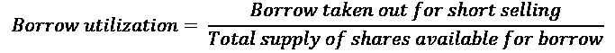

# Ten

# 完善投资领域

市场参与者通常会发现巨大的市场令人生畏。因此，在我们开始将前几章的观点整合到一个组合投资策略中之前，我们将用一个简短的章节将市场缩小到一个可管理的投资领域。

在这一章中，我们将从做多/做空业务的一些概念盲点开始，试图为你将要交易的真实世界提供一些有价值的背景。接下来，我们将通过考虑一些塑造了交易者和市场运作方式的重大事件和话题，跟随资金来揭示投资者真正想要的是什么。

我们将讨论以下主题:

*   避免卖空陷阱
*   投资者真正想要的是什么？

# 避免卖空陷阱

这部分是关于运用智能过滤器来避免经典的卖空陷阱。随着从业者对卖空越来越熟悉，他们可能会重新审视其中的一些要点。这里的观点大多来自痛苦的经历。

## 流动性和市场影响

流动性是熊市的货币。如果你不能在没有重大市场影响的情况下将卖出，你就什么都不拥有。它拥有你。处理短期流动性的方式完全不同。从长期来看，随着越来越多的投资者被价格上涨所吸引，流动性会增加。早起的鸟儿最终会卖给更多的市场参与者。

从短期来看，当投资者平仓时，这是一条单行道。打完之后，他们不会回来参加第二轮比赛。没有什么比库伯勒-罗斯模型更能准确捕捉长期市场参与者的情感历程了。市场参与者为他们的损失感到悲伤。每个阶段甚至在市场上都有独特的标志。兴趣减退，随着市场参与者的减少，流动性也在减少。早期熊市比后期熊市更具流动性。卖空者离场时的流动性比进场时更低。

在混合物中加入短时间的挤压，你就得到一份爆炸性鸡尾酒的配方。你最不希望的事情就是在没有严重市场影响的情况下，你无法覆盖大量头寸，从而陷入空头挤压。从短期来看，衡量流动性和市场影响的方法不在于建仓需要多长时间，而在于建仓有多容易。

这将投资领域限制在流动性不成问题的问题上。2008 年大金融危机的解决让市场沉迷于量化宽松，也就是所谓的免费资金。通俗地说，货币当局用止痛药充斥世界，以减轻经济危机的痛苦。一旦货币当局暗示退出，市场就会螺旋式下降，交易员就会涌向更安全、更具防御性的股票，这就是所谓的“避险”这迫使货币骑兵不断向金融体系注入更多止痛药，从而将各种投机资产推入泡沫区域。当风险上升，交易者寻找更高风险、更有盈利潜力的股票时，中小市值股票就是行动发生的地方。同时，从短期来看，无聊的蓝筹股已经过时。只要没有失败的责任，就没有安全行事的动机。当风险“消失”时，市场参与者的投资更具防御性，他们倾向于更大规模的资本化，流动性仍然充足。恢复多空大盘股交易并不容易。做空小盘股是一项血腥的运动。流动性蒸发了，你可以在买卖价差中停靠一艘超级油轮。因此，收益可能会在第一次挤压时被抹去。

一句话:让你的净市场敞口与总体市场体制和流动性水平相匹配。无论一些想法看起来多么诱人，只保留那些流动性不成问题的想法。

## 拥挤的短裤

> "猫王已经离开大楼了。"

早在 2007 年，我研制了一种**大规模杀伤性短距武器** ( **WMSD** )命名为**挤压箱**力学可能违反直觉，但它有一个超现实的准确率来预测潜在的短暂挤压。只需要一个只做多的经理建立一个微小的投机性多头头寸。由于买卖平衡已经失衡，这将推高价格，把游客赶出去。他们会疯狂地补仓，这将很快演变成空头挤压。此时，只做多的经理会从容地退出他们的多头头寸，获得可观的利润。当我意识到这个项目直接伤害了我在对冲基金界的朋友时，这个 WMSD 被永久拆除了。

故事的寓意:从你的投资领域中消除所有拥挤的空头，即借款利用率超过 50%的问题。他们甚至不应该在你的雷达上。想想那些经常闯红灯的人。一切都很好，直到他们在医院醒来。

做空赚钱的方法是找到机构投资者在清算什么，然后搭他们的尾巴。好的短篇故事通常可以弥补糟糕的短线交易。每一条信息都有一个价格标签。不要等到所有的拼图都拼好了。当一个故事恶化到足以成为明显的空头候选时，机构投资者将会清算他们的多头头寸。唯一剩下的人将是争夺一块干骨头的卖空者。这就引出了一个简单而强大的供求指标，叫做**借款利用率**。

借入利用率是卖空借入的股票除以可供借入的股票供应量的比率。大型机构有贷款项目，他们通过收取费用借出一部分长期持有的股票。当他们削减这些头寸时，供应就会枯竭。

与此同时，随着空头越来越受欢迎，借贷需求也在增加。分子上的需求和分母上的供给使得借贷利用率成为衡量机构所有权和受欢迎程度的最有效指标。例如，借款利用率超过 50%仅仅意味着做空意愿超过了机构持股。由于机构是市场的主要参与者，风险/回报比率明显恶化。

根据公司的所有权结构，借款利用率可能会有很大差异。一些股东不参与贷款项目。例如，少数股东控制的公司很少有股东，出于不可思议的原因，他们往往无法意识到自己的孩子是恶性熊市袭击的目标。

卖空是一项昂贵的运动。卖空者被收取借款费用。这些利率范围从容易借到的普通抵押品(T2)到难以借到的或拥挤的空头的禁止利率。随着借款逐渐被取出，剩余资产的质量会恶化。除此之外，难以借到的债券不仅能获得让莎士比亚笔下的夏洛克脸红的高利贷利率；它们有时是可赎回的。这意味着贷款人可以选择在短时间内收回贷款。这被称为**召回**。当召回发生时，卖空者要么在别处借入，要么平仓。召回有时会导致短暂的挤压。

最后进场的卖空者往往过于兴奋，对借入可赎回股票不会三思。当召回发生时，他们找不到借款人，被迫平仓。由于抛售压力已经达到高潮，新的买入压力造成供需失衡。股价毫不费力地上涨。这促使其他卖空者止损，他们开始补仓。这迅速演变成一场全面的卖空挤压，不仅赶走了游客，也赶走了更有经验的卖空者。一句话:远离其他卖空者利用低质量借款的问题。

与更受欢迎的问题相比，拥挤的空头往往对市场的敏感度较低。当市场遇到周期性气穴时，拥挤的空头几乎不动。与此同时，长期表现良好的股票暴跌。相对而言，这意味着拥挤的空头跑赢大盘，多头跑输大盘。对这一现象的一个可能解释是缺乏机构和散户投资者的参与。拥挤的空头中没有机构的多头资金，所以当周期性回调发生时，没有人卖出，推动股价下跌。一句话:当多头头寸急剧下跌时，拥挤的空头不会挤掉多头头寸。如果拥挤的短裤带来的唯一东西是满足了对正确的昂贵需求，那么这不是你应该采取的方法。

结论:就像节食者需要把冰淇淋和薯片从伸手可及的地方拿走一样，把拥挤的空头从你的投资宇宙中彻底剔除。

## 高股息率的沃土

> “他们说最好的武器是永远不用开火的。我不同意。我更喜欢你只需要发射一次的武器。”
> 
> 托尼·斯塔克，钢铁侠

公司有时会提高股息收益率，为股价带来股息支持。高股息率吸引了寻求更稳定现金流的价值投资者和零售商。这有效地阻止了卖空者参与做空活动。然而，尽管高股息率可能会遏制短期卖空压力，但从长期来看，这并不能阻止股价下跌。高股息率通常是前成长型公司的同义词。他们已经停止增长，所以他们重新分配现金给股东。这使得高收益股票世界成为有利可图的和平卖空的沃土。

关于股息的好消息是，它们是可预测的公司事件。卖空者需要注意几个事件。前两个是记录和支付日期。在这些时刻，卖空者需要抑制自己的热情。公司有时会在发布收益公告时决定提高股息。把你的交易安排在这些日期前后，你会有一段非常愉快的时光。例如，投资者倾向于在宣布股息的日期后立即减持。这加剧了股息支付日期的下降。

将高收益股票重新定义为可行空头候选的另一种方法是，首先关注股息如此之高的根本原因。成长型股票的股息收益率通常很低。他们需要他们的现金再投资于他们的企业。另一方面，稳定、成熟的公司拥有过剩的现金，但长期前景不具吸引力。一点点股息对吸引投资者大有帮助。

一句话:高分红背后隐藏着价值陷阱。寻找高收益表现不佳的股票，并在分红日期前后导航，你会有一段出乎意料的轻松时光。

## 股票回购

> “一个男人做一件事一般有两个原因。一个听起来不错的，真实的。”
> 
> 摩根大通

传统观点认为，当股价被低估时，公司会在公开市场上回购股票。实际上，在时机低估方面，他们和卖方分析师一样无知。股票回购在 2007 年末达到顶峰，在 2009 年 3 月触底。

股票回购的支持者认为，没有比回购股票更好的利用他们的现金和廉价信贷的方式了。这产生了涓滴效应，有利于整体经济。

这种股东至上的思想可以追溯到米尔顿弗里德曼(Milton Friedman)在上世纪 80 年代开创的一个学派。通过股票回购计划，公司已经成为市场上越来越大的参与者。前总统特朗普减税后的反弹主要是由企业回购自己的股票推动的。

反对者认为，现金从利益相关者(员工、客户、R&D 和供应商)那里被抽走，然后流向股东。简单地说，教练吝啬于球员，却慷慨地施舍给球迷。大多数高管的薪酬来自股票期权。因此，他们有直接的动机来支撑股价，以充实他们的股票期权计划。最有力的方法是回购股票。这降低了流动性，抬高了每股收益，并推高了股价。

2020 年的疫情冠状病毒揭露了这种虚伪，一劳永逸地解决了这场争论。股票回购夺走了公司的生命。这种过分关注短期市场影响的做法不符合公司的长期利益。当世界进入封锁状态时，企业几乎立刻发现自己资不抵债。他们的股价暴跌，但他们仍然不得不面对回购的贷款义务。在资本主义的历史上，从来没有皇帝如此憔悴和赤裸地漫无目的地四处游荡。

然而，这与卖空者的观点无关。公司有足够多的钱来人为抬高股价。因此，卖空者应避免卖空参与股票回购计划的公司。好消息是，股票回购与市场波动高度相关。股票回购在最需要的时候蒸发了，在调整期间。这意味着做空季节已经开始，而且正在如火如荼地进行。

一句话:不要直接做空推出股票回购的公司。让他们掏空自己，等待不可避免的脆弱。

## 基本面分析

> “时间在我这边。”
> 
> 米克·贾格尔

基本面分析给了股票市场分析高贵的字母。很少有努力像股票分析那样能激发智力。制度定义可以大大简化基本面分析师的工作。

当基本面分析师考虑市场机制时，他们本质上是试图回答一个理论问题。他们试图弄清楚为什么一只股票会下跌，为什么现在会下跌。原因有很多。

他们最终可能被证明是正确的。然而，它们承担了巨大的时间、声誉以及最终的商业风险。他们希望在投资者失去耐心之前，市场会认同他们的观点。有太多的随机变量来期望一致的结果。

另一方面，让基本面分析服从市场机制试图回答一个实际问题:为什么这只股票会下跌？好消息是，答案通常分为三类:

*   首先，这可能是暂时的错误定价。这种体制可能已经从牛市转变为横盘。在一个强劲的牛市阶段之后，股票往往会停下来消化上涨。这一阶段被称为巩固。股票可能会在一段时间内成为死钱。如果是这样，解决方法很简单。死钱走看起来更好了一个充满活力的发型。调整你的仓位。将资本重新分配给新的想法。如果股票再次开始上涨，将有充足的时间补充库存。
*   第二，如果一个板块中的几只股票开始一致表现不佳，这表明板块轮动。这就减少了分析师的工作:在表现不佳的板块中挑选几乎任何股票。
*   第三，如果一只股票的表现与它所在的板块不一致，这可能表明一些股票特有的问题。这是基本面分析师大放异彩的时候了。这是发现真正有利可图的结构性空头的时候了。价值陷阱往往不被注意，因为它们具备价值股的所有外部特征。他们通常有慷慨的分红政策。相对于同行，它们的估值有所折扣，这使得它们表面上看起来很有吸引力。然而，它们的表现一直不佳。它们很便宜，而且保持便宜是有原因的。基本面分析师的工作就是找出原因。

从短期来看，传统的基本面分析很难做到。信息不对称是卖空者必须应对的问题。公司很少主动宣布坏消息。分析师保持他们的“买入”评级，直到决定性的一天，当他们碰巧在报纸上看到公司前一天晚上申请破产。

然而，卖方支持者可能有一些不自觉的边际效用。在误导性的“买入”评级的冻土地带，表现不佳的代名词是“为长期投资者买入”。寻找评级没有刷新、盈利模型积灰、甚至连维护研究都没有适当维护的股票。一个电话就能确认“那些是长期投资者的股票”，你就成功了。

# 投资者真正想要的是什么？

每当市场“陷入低谷”时，多空行业似乎都会经历一场严重的生存危机投资者被粗暴地提醒，下行保护只意味着有限的下行，实际上没有上行。该行业一直采用“造好了，他们就会来”的产品供应模式。如果我们的目标是建立可持续发展的企业，那么现在是时候停下来，从投资者的角度来看待这个世界了。这将为逐步建立满足投资者需求的多空产品提供重要背景。

## 2007 年量化宽松崩溃的教训

> "就这样，用沙子做成的城堡，
> 最终融入大海，
> "
> 
> 吉米·亨德里克斯

2007 年 8 月，全球各地的市场都被横截面波动吓了一跳。尽管指数波动不大，但成份股连续几天全线上涨。很快，各种量化市场中性基金平仓的传闻开始流传。这是 Quants 1.0 时代终结的开始。

那些聪明的市场中立基金都像威尼斯比萨饼:菜单上有 37 种不同的名称，但每个人的皮都一样。他们有非常相似的模型。由于它们是市场中性的，卖空的现金收益可以被用来几乎无限地增加杠杆。一些基金将杠杆提高了 7 倍，以放大原本平淡无奇的回报。有一段时间，一切都运转良好。基金经理所要做的就是继续卖空更多股票，以匹配不断扩大的多头。这一切运行良好，直到 2007 年夏天，房地产泡沫开始溃烂。

每次雪崩都是从雪球开始的。当时，在市场的另一个角落，一些大型多策略商店被要求为他们的**信用违约责任** ( **CDO** )和**信用违约掉期** ( **CDS** )投资组合提供更多抵押品。当它们无法为自己的信用账户筹集现金时，它们被迫清算流动性最强的资产类别。他们转向量化的市场中性书籍。这是最初的雪球。在仲夏，流动性通常会枯竭。他们的空头支票缺乏流动性。当第一批商店开始回补头寸时，它们推高了价格。这引发了他们邻居的止损。他们开始平仓。这引发了具有传染性的连锁反应，最终导致了一个混乱的横截面市场。这就是传染的定义。

人们有时会争论什么是好的品质，但他们很少在不好的方面有不同意见。每个人都发现自己穿着同样的短裤。由于可供卖空的股票数量有限，交易变得非常拥挤。多策略基金的清算加剧了这一问题。经理们最终意识到，他们需要数周时间来平仓空头头寸，于是他们开始将头寸削减至可控水平。流动性是主要风险。拥有大致相同模型的每个人都在同一时间得出了相同的认识。精英量化分析师们争先恐后地补仓，这在金融领域相当于一头大象狂奔穿过一家中国商店。

当年，市场中性基金被标榜为安全的投资工具:低波动性的股票回报。在许多人看来，市场中立意味着资本保护。因此，当这些基金在看似平静的市场中开始发布-3-4%的月回报率时，发生了两件事。大宗经纪商提高了保证金要求，因为**风险值** ( **风险值**)增加，迫使基金降低杠杆。其次，投资者把鲍勃·马利转向基金经理:“救赎之歌。”

这些赎回迫使基金经理平仓，增加了基金的波动性。随着杠杆率的降低、波动性的增加和赎回量的增加，要想挽回损失，即便不是几年，也需要几个月的时间。另外，名誉损失是不可挽回的。量化市场中性基金 1.0 的游戏结束了。

这场危机始于一个简单的错误:这些基金的设计者做出了致命的假设，认为短期会反映长期。有一段时间，确实如此。但随着基金规模越来越大，做空的独特动力又回来困扰它们。流动性枯竭。短裤变得拥挤。当经理们意识到短期风险已经呈指数增长时，已经太晚了。

这个故事的寓意是:如果你想经营一个可持续的多头/空头企业，你需要从空头开始构建你的投资组合。

关于这个主题的更多信息，请参见马修·罗斯曼(Matthew S. Rothman)于 2007 年 8 月 9 日撰写的《量化世界的动荡时期》。

接下来的两部分将进一步关注投资者真正想要的是什么。他们不会把资金放在复杂的长/空交易中，去购买同样的 AAPL 股票，而低技术含量的交易所交易基金 T2(ETF T4)可以以零头的价格买到这种股票。投资者希望获得与市场波动无关的低波动回报。

## 多空行业的青蜂侠情结

> “是什么，比应该是什么更重要。太多的人从一个应该是什么的立场来看待什么是什么。”
> 
> 伟大的美籍华人哲学家李小龙

1966 年的电视连续剧《青蜂侠》由布雷特·里德(Brett Reid)和加藤(Kato)主演，布雷特·里德白天是《每日哨兵报》的一名雄心勃勃的出版商，晚上是打击犯罪的《青蜂侠》，加藤是他的忠实跟班。如果不是一个名叫李小龙的不知名演员扮演的助手巴特勒，这部非常容易被遗忘的电视剧永远不会进入邪教系列的万神殿。

多头/空头行业饱受未解决的青蜂侠情结之苦。很多多空参与者都是披着狼皮的羊。敏锐敏捷的对冲基金经理喜欢夸耀自己在长期选股方面的卓越分析能力。谁在乎呢。没有人需要像对冲基金经理那样复杂的“技巧”来购买 AAPL。任何“无聊”的只做多基金经理都会以极低的成本提供完全相同的服务。更好的是，随着时间的推移，任何低技术、低成本、普通的 ETF 都会比任何积极的经理做得更好。

真正让多头/空头市场参与者成为狂热基金经理的原因是，他们有能力在没有人赚钱的时候赚钱。这句话来自一个叫“简书”的伙伴。

多头/空头行业是一个竞争激烈的领域。市场参与者知道，他们必须立即行动以吸引投资者。因此，他们默认在自己的舒适区内交易。他们花大部分时间从长期角度挑选股票。与此同时，对短裤的无休止的挫败感阻碍了他们学习错综复杂的“黑暗艺术”尽管最初的意图是好的，但这本小书逐渐被边缘化了。

只要市场上涨，这种情况就会持续下去。一旦市场遭遇“软肋”，被忽视的空头就无法弥补多头的损失。当业绩穿过气穴时，投资者会窒息。他们不得不吞下过高的费用，忍受“阿尔法挑战”的回报。难怪当他们意识到下跌保护实际上意味着损失少于市场时会窒息。因此，多空行业现在遭到越来越多的冷嘲热讽也就不足为奇了。

## 伯尼·麦道夫的教训

> “当你看到我不止一次欺骗没有丝毫良心不安，无论是无赖还是傻瓜。”
> 
> 贾科莫·卡萨诺瓦

每个市场参与者都有一些产生阿尔法的“秘方”因此，他们会推出适合自己投资风格的产品。他们按照“造好了，他们就会来”的模式运营，相信仅凭阿尔法一代就足以吸引投资者。很快，他们就会感到奇怪，为什么在对管理下的**资产**(**)的激烈竞争中，其他回报平平的参与者超过了表现稳健的市场奇才。**

 **作为一种资产类别，系统化的商品交易顾问(T1)(T2，CTA，T3)和 T4 已经主导了几十年的业绩游戏。然而，根据《老友记》和畅销书作家迈克尔·科韦尔(Michael Covel)的说法，他们合计的 AUM 只占全球管理资产的 0.4%。尽管长期集体跟踪记录出色，但它们的总 AUM 仍是一个舍入误差。这就是基金经理感到困惑的地方。一方面，投资者公开表示他们在寻求回报。另一方面，当该把钱花在他们该花的地方时，他们会选择其他东西。好消息是钱会留下痕迹。

在称赞马多夫先生的营销头脑之前，让我们弄清楚一件事。任何诈骗投资者的白领罪犯都应该被判几十年监禁。伯纳德·l·麦道夫是私营小联盟有史以来最伟大的骗子的有力竞争者。他花了几十年时间从数千名投资者那里骗取了数十亿美元。他的故事对投资者的想法提供了有价值的洞察。

马多夫提供的东西如此强大，以至于它压制了金融业一些最老练的参与者的专业怀疑。在狱中一次罕见的采访中，马多夫承认，投资者“本应该更清楚。”以下是马多夫所谓的收益表:

<colgroup><col> <col> <col></colgroup> 
|  | 标准普尔 500 指数 | 费尔菲尔德哨兵(麦道夫) |
| 年平均回报率 | 7.7% | 11.0% |
| 复合回报 | 201.0% | 504.0% |
| 正月数 | 63.0% | 92.0% |
| 最大值减少 | -46.3% | -1.6% |
| 提款持续时间(月) | Eighty | Two |
| 半相关 |  | Zero point zero three |

平均每年 11.04%，表现不错，但并不令人惊讶。如前所述，投资者说他们想要回报，但他们对提款做出反应。让马多夫与众不同的有四点:

*   首先，提款的持续时间:永远不要考验投资者的耐心。从散户到机构资产配置者，每个投资者心中挥之不去的一个问题是:“现在投资还来得及吗？”只有当贪婪或对错过的恐惧比对失去金钱的恐惧更强烈时，他们才会将辛苦赚来的积蓄用于工作。实际上，资金流入高峰往往与牛市的顶部重合。那些相信“道指在 36000 点”的骗子，在 2000 年 8 月开始暴跌，在 2007 年 5 月赚回他们的钱之前，不得不忍受连续 80 个月的下跌。这正好赶上下一次潜水。相比之下，马多夫总是敞开大门。他只有连续两个月不景气。每个月都是进入的好月份。从统计数据来看，这么短的下降持续时间是不太可能的。唯一一个接近过的市场参与者是传奇人物爱德华·索普，讽刺的是，他在丑闻爆发前 14 年就揭发了马多夫。
*   其次，提款的规模:永远不要考验投资者的胃口。一旦资金减少，投资者担心情况会变得多糟。市场可能会上涨 7%的长期平均回报率，方便地忽略了其间糟糕透顶的 40-50%的下跌。尽管正回报并不引人注目，但-1.56%的最大降幅使其看起来像是一项无风险投资。卡尼曼-特沃斯基用一种更聪明的方式阐述了他们的前景理论:厌恶损失比追逐利润更有力量。它阐明了一个强有力的概念:“只要你不亏损，你赚多少并不重要。”投资者可以一劳永逸。
*   第三是提款的频率:永远不要考验投资者的神经。据说马多夫有 92%的时间上涨，而标准普尔指数只有 63%。S&P 有 6 年的年回报率超过 20%。它也有 4 年的负两位数回报。相比之下，麦道夫的欺诈平均回报率为 11.04%。然而，S&P 的复合回报率是 200%，而马多夫是 500%。
*   第四是半相关性(与 S&P 指数下跌月份的相关性)，或在下跌市场赚钱的能力。当市场下跌时，麦道夫的 3%被认为是上涨的。那一个决定了交易。当所有人都倒下的时候，仍然站起来的经理会脱颖而出。他们的电话响个不停，吸引着感兴趣的投资者。

在现实世界中，产生像马多夫那样的回报在统计学上是不可能的。然而，你越接近，你的提议就越有吸引力。如果你设法建立一个介于麦道夫的圣杯和指数的被动投资之间的产品，你将比你的竞争对手有很大的优势。

# 摘要

这短短的一章并不是为了测试读者的脑细胞。这只是一个如何避免经典的昂贵陷阱和满足投资者期望的实用技巧的集合。投资者不会因为长期想法而买入多头/空头产品。他们想要低波动、不相关的回报。这一章考虑了投资者的期望，同时避免了把短书当作更有趣的长书的事后想法的陷阱。如果这些问题股票从你的视野中消失，它们将不会在你的脑海中，这将消除诱惑。

一旦你提炼了你的投资领域，明白了投资者对你的期望，是时候扣动扳机了。在接下来的章节中，我们将把所有的东西放在一起，看看在实践中如何做到这一点。**