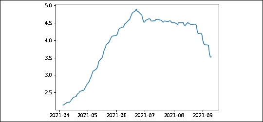
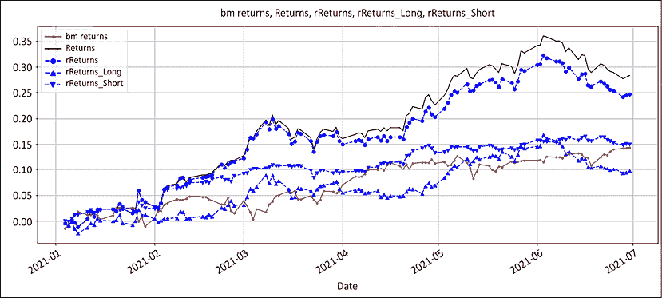
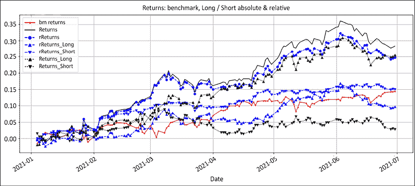
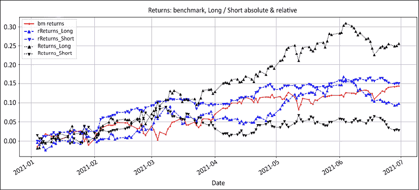
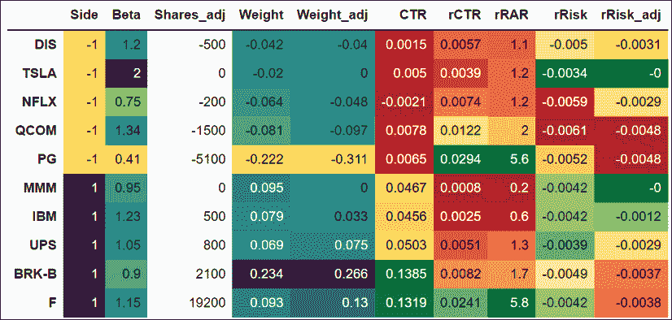
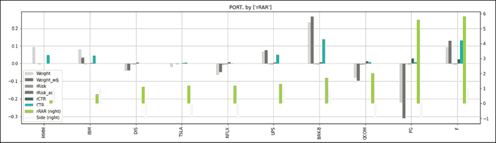
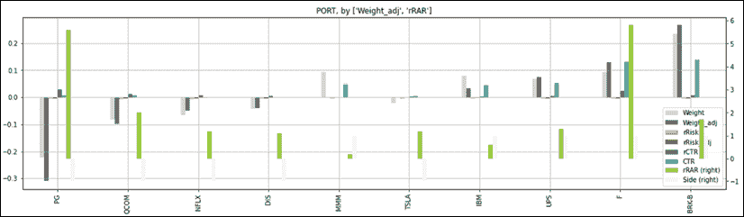

# Thirteen

# 投资组合管理系统

> “托托，我有一种感觉，我们已经不在堪萨斯了。”
> 
> 多萝西，绿野仙踪

我在对冲基金界的第一份工作是为一家管理资金不足 500 万美元的初创对冲基金建立和维护一个**投资组合管理系统** ( **PMS** )。负责人认为，风险管理不是企业的装饰品，而是企业本身。快进到现在，他们是日本替代空间的主导者。在这一章中，我们将继续前两章的工作，并介绍一个定制的 PMS，它显示了整个投资组合的风险可视化。

为了说明强大的 PMS 的重要性，让我们把本书中探讨的一些概念联系起来。在*第一章*、*股市博弈*中，我们设定的背景是市场是一个无限的、复杂的随机博弈。在*第 6 章*、*中，交易边缘是一个数字，这里是公式*，我们揭开了神奇、神秘、神话般的交易边缘公式。在*第 8 章*、*头寸规模:资金在资金管理模块*中产生，我们证明了头寸规模决定绩效。我们在*第 11 章*、*长/短工具箱*中了解了我们工具箱中的工具。因此，我们知道头寸规模是关键的决定因素，但我们不知道哪些头寸会成功，但我们必须在管理风险敞口时保持积极的预期。多年来每天冲洗和重复，以吸引和留住投资者。

在我的职业生涯中，朋友和同事们已经足够慷慨地公开了他们的经前综合症。存活率与他们的 PMSes 质量直接相关。不是每个有适当系统的人都能成功。然而，每一个没有系统的经理最终都会崩溃。

经前综合症就像飞行仪器。任何菜鸟都能在晴朗的天空下驾驶飞机。这些仪器是为了防止飞机在起飞和夜间着陆时，穿越大雾和湍流而坠毁。没有仪器，不是每个人都会回家。市场不是风平浪静、一帆风顺的。事情确实出乎意料地变得糟糕。情绪确实会让我们偏离方向。在 execution trader 英语中，如果你没有扎实的 PMS，你怎么能自称是投资组合经理呢？使用 Python 构建一个定制的 PMS 应该有自己的书，如果没有自己专门的文学流派的话，因此超出了本书的范围。但是，在本章中，我们将简要介绍一些基本概念和指导原则，希望能为您提供指导:

*   糟糕的投资组合管理系统的症状
*   你的投资组合管理系统就是你的钢铁侠套装
*   自动化枯燥的东西
*   构建健壮的项目组合管理系统

您可以通过以下链接访问本章所有图片的彩色版本:[https://static . packt-cdn . com/downloads/9781801815192 _ color images . pdf](https://static.packt-cdn.com/downloads/9781801815192_ColorImages.pdf)。你也可以通过这本书的 GitHub 资源库获得本章的源代码:[https://GitHub . com/Packt publishing/algorithm-Short-Selling-with-Python-Published-by-Packt](https://github.com/PacktPublishing/Algorithmic-Short-Selling-with-Python-Published-by-Packt)。

# 导入库

对于本章和本书的其余部分，我们将使用`pandas`、`numpy`、`yfinance`和`matplotlib`库。因此，请记住首先导入它们:

```
# Import Libraries
import pandas as pd
import numpy as np
import yfinance as yf
%matplotlib inline
import matplotlib.pyplot as plt 
```

# 糟糕的投资组合管理系统的症状

当谈到扭转业绩时，一个好的 PMS 是最容易实现的。2005 年，我加入了一家对冲基金，该基金的经前综合症非常难看，看着它可能会造成脑损伤。我立即把它整理好，至少是为了消除健康隐患。突然，问题儿童像圣诞树上的花环一样亮了起来。短期波动的细价股、懒惰的狗和不受重视的赛狗都被迅速处理了。波动性下降了。性能更加稳定。夏普比率飙升。投资者注意到了。**管理资产** ( **AUM** )增长。就这么简单。

每个人都想知道赢家的“秘方”,但这是一个“阿尔法挑战”者的教训可以帮助我们避免无意中重复同样的错误的领域。这里有一个简单的练习，可以帮助你确定你的系统是否需要升级。有缺陷的经前综合症有以下一种或多种症状。

## 无效资本配置

尽管投资组合经理喜欢向公众展示一个奥林匹克半神的形象，但几句话就能把他们拉回现实:

*   “好人最后才是赢家”:一些股票回报可观，但由于仓位小而无人问津。这些通常是试探性的微小位置。他们回报高，但贡献少，因为他们没有足够的规模。
*   “肥猫捉不到老鼠”:一些大仓位的贡献仅仅是因为他们巨大的体重。这是经前综合症的一个经典问题。和上面这一点有直接关系。这些往往是高信念的想法，占据了太多的房地产，而回报却微不足道。
*   “我们曾经是战士”:这些是经验丰富的贡献者，他们现在可以免租了。这些想法已经过时一段时间了。他们有很多固有的历史贡献，但不再支付租金。我们已经在第七章**中解决了游戏中三分之二的情况，提高你的交易优势*。*

## 监控不足的风险检测

需要关注的一个关键指标是流动性，以避免“加州旅馆综合症”换句话说，你不拥有你不能清算的东西，它拥有你。流动性是熊市的货币。是否存在在没有严重市场影响的情况下无法平仓的头寸？下面是一个函数，它重述了在平均交易量的一部分退出时的仓位大小(天数)。对卖空者来说，真正的恐惧是当你看到熊市反弹势头增强，并意识到你的头寸太大，无法全身而退。没有什么比在熊市海啸后被挤出头寸，却眼睁睁看着它继续下跌更糟糕的了。

一个简单的风险衡量方法是将头寸规模重新表述为以平均交易量的一小部分进行清算所需的天数。下面的代码只是计算平均音量的一小部分。位置数量除以这个分数:

```
ticker = 'UNG' #ETF natural gas 
volume = yf.download(tickers= ticker,start= '2021-01-01', end = None,                     interval = "1d",group_by = 'column',                     auto_adjust = True, prepost = True,treads = True,                      proxy = None)['Volume']

def days_liquidation(quantity,volume,window,fraction):
    avg_vol_fraction = volume.rolling(window).mean()* fraction
    return round(quantity/avg_vol_fraction,2)
quantity = 100000
window = 63
fraction =0.01
days_liquidation(quantity,volume,window,fraction)[-1] 
```

这会产生如下所示的输出:

```
3.52 
```

我们可以制作如图*图 13.1* 所示的图表:

```
plt.plot(days_liquidation(quantity,volume,window,fraction)) 
```

我们从 2021 年初开始下载`volume`数据。该函数将固定百分比乘以音量的移动平均值。这个股数除以成交量的分数:`0.01`，或者 1%。这个值是任意的，并且故意低以显示原理。在实践中，5-10%是合理的阈值。在 2021 年 6 月底，如果订单规模不超过平均交易量的 1%,将需要大约 5 天来清算整个头寸。我们打印了系列中的最后一个数字，并绘制了移动平均值:



图 13.1:3 个月平均交易量的 1%的清算天数

上图显示流动性不是一成不变的。按日均交易量的 1%清算头寸交易原本需要大约 2 天时间。随着流动性的减少，清算所需的天数增加到 5 天，然后回落到 3.5 天左右。当价格对你不利时，一周就是永恒。因此，应对流动性进行监控。

市场影响是大量交易引起的价格的不利变化。当仓位超过日交易量的 5%时，市场影响就开始了。如果一个头寸在成交量的 10%时超过 5 天，那么预计会有严重的市场影响。此外，熊市反弹的剧烈程度怎么低估都不为过。你将在精神上处于不利地位，把自己从一个洞里交易出来。因此，始终监控流动性，并在交易量减少时削减头寸。

## 高波动性

拥挤的空头平均借入利用率高。流动性将减少，波动性将增加，回报将恶化。利用率或借款费用的热图是非常有价值的工具。在出版之日，不幸的是没有免费的资源可以借用。作为一个捷径，当贷款费用大大高于平均水平时，假设流行。应对拥挤空头的最简单方法是随着人气上升而减少仓位。同样，制定简单的规则，比如(举例来说)如果利用率超过 40%,就将暴露量减半，每增加 10%,暴露量再减半。当利用率达到 60%时，暴露量将是原始大小的 25%。这只是精神食粮。

夸张并不突出:人们想要自我感觉良好。在市场上，做感觉良好的事情很少是最有利可图的行动。面临风险的股票必须在视觉上让经理们采取行动。股票很少意外上涨。他们经常发出微妙的信号，表明事情没有按照他们应该的方式发展。

## 高度相关

多样化的目标是降低相关性。关联是难以避免的。在*第 4 章*、*多头/空头方法论:绝对和相对*中，我们引入了相对系列来降低与基准的相关性。然而，焦点已经从预测绝对顶部或底部转移到捕捉行业轮动，并据此配置资产。投资组合中的相关性很难消除。坦率地说，我不知道如何在实践中做到这一点。至今也没有遇到成功的方法。

## 糟糕的风险管理

有几种不同类型的风险敞口，可以通过以下方式表明投资组合管理不善:

*   净敞口:当投资组合的净敞口与当前的看涨/看跌观点不符时。在熊市阶段尤其如此，尽管环境黯淡，净敞口仍显示出残余的看涨情绪。投资组合认知失调是指风险敞口不能反映经理人的主张。
*   净贝塔敞口:在大多数有缺陷的系统中，缺乏真正的市场敏感性。当管理者只关注净敞口时，他们会将低方向性与净市场敏感度混为一谈。净贝塔比净敞口更进一步，以反映对市场的敏感性。
*   市值敞口:做空期货是对冲的垃圾食品。正如我们在*第 11 章*、*多空工具箱*中看到的，小型股和大型股有不同的风险状况。当市场总体情绪乐观时，小盘股表现良好，而大盘股是更安全的押注。净市值敞口反映了投资组合的整体乐观情绪
*   总风险敞口:经济景气时杠杆过多，经济不景气时现金过多。总风险敞口是降低或增加风险的最简单的杠杆。当有疑问时，崩溃杠杆是最简单的风险政策。
*   外汇敞口:市值和外汇敞口可以解释很多好/坏的表现。正如我们在*第 4 章*、*多头/空头方法论:绝对和相对*中看到的，纳斯达克多年来的表现都超过了标准普尔 500 指数&。多年的宽松货币政策回报了投机性发行和那些押注于此的人。有钱容易，赚钱也容易。没有哪个牛市提升过任何人的智商。

总而言之，资产管理行业投资回报最高的是定制的 PMS。随着信息差距的缩小，市场参与者争相寻找优势。如果你能比你的同行更早发现并解决问题，你就获得了持续的竞争优势。

# 你的投资组合管理系统就是你的钢铁侠套装

> 你知道，我最常被问到的问题是，“托尼，你怎么穿着西装去洗手间的？”“[长时间停顿]就这样。”
> 
> 托尼·斯塔克，钢铁侠

托尼·斯塔克可能是个天才、亿万富翁、花花公子和慈善家。真正赋予他超能力的是他定制的钢铁侠套装。他的西装不是在梅西百货买的。他在车库里造了几辆兰博基尼，这种东西独特地增强了他的战斗风格。同理，你的经前综合症就是你的钢铁侠套装。这是你交易策略的延伸。它的唯一目的是帮助你在不确定的情况下做出交易决定。既然没有人像你这样交易，那就需要高度的定制化。

一个经典的错误是购买昂贵的现成软件包，认为更多的信息会导致更好的交易决策。软件解决方案主要是由中层管理人员为前台专业人员设计的报告工具。你的 PMS 是交易工具，不是报告工具。Barra 因子分解或华尔街共识每股收益不会告诉你今天应该卖空哪家公司的多少股票。信息转化为知识，而知识并不容易转化为技能。培养技能的关键是专注于直接导致行动的信息。

在实践中，系统集成几个月后，投资组合经理通常会用那些闪亮的玩具提供的低技术含量的 Excel 电子表格来管理他们的投资组合。他们买了一辆兰博基尼去取牛奶。因此，在你匆忙购买最昂贵的玩具之前，这里有一些原则可以帮助你明确你的需求。信息必须按照四个原则来组织:清晰、相关、简单和灵活。

## 清晰:绕过左脑

在压力下，你的杏仁核会释放化学物质，降低你的前额皮质或“思考大脑”的活动你清晰思考的能力会受损。你的经前综合症需要清晰:信息必须有条理，这样问题才能跃然眼前。其次，左脑无法处理数字的行列。它很慢，每秒 5 到 7 比特。它不会产生联想。一切都模糊成一个无菌数字汤。与此同时，右脑处理信息的速度要快 100 倍，寻找模式，进行联想。幸运的是，数据可视化是数据科学的新趋势。视觉线索绕过了思维较慢的大脑。当决策涉及多个因素时，用数字作画有助于联想。例如，将你在投资领域中的头寸可视化为热图，将立即告诉你是否在正确的轨道上，是否在每个领域中骑着最好的马。我们将在本章末尾查看投资组合热图。

另一个主题是警报。你有没有想过为什么灾难警报这么烦人？如果《欢乐颂》宣布即将发生地震、海啸或火山爆发，人们可能不会有同样的紧迫感。我们天生就会远离痛苦，走向快乐。警报是为了迫使最不情愿的人采取行动。当一个职位需要处理的时候，尽可能的让警告变得唠叨。警报越烦人，就越有可能被迅速处理。最好的提醒是那些你在做日常工作之前必须首先手动确认的提醒。举例:假设一只股票到了止损。如果一个提醒被设置为你必须点击它才能继续你的投资组合，会发生两件事。要么你迅速处理这个问题，要么你最终完全避开你的工具。当对正确的需求取代了赚钱的需要时，我们内心的白痴会格外努力地自我破坏。

一个典型的错误是有多个页面，每个页面对应一个风险因素。这意味着用户必须在页面之间来回切换并做笔记。每一度的摩擦都会增加信息泄露。飞行员不必在飞机上跑来跑去，看看液压系统和燃油表是否一切正常。如果您想在不同的风险之间建立关联，您需要将所有相关信息整合到一页的摘要中，以便在后面的页面中深入查看。把它想象成汽车或飞机的仪表板。你需要的所有信息都摆在你面前。

把事情放在上下文中。左脑不能有效地处理数字。295%的总曝光率只是一个数字。当绘制在显示基准、总、净风险和绩效的图表上时，该数字是在上下文中的。这是一个可视化的市场表现，你是如何定位的，以及随着时间的推移所产生的表现。一张图胜过千言万语。让我们再来看一下在*第 11 章*、*中看到的例子，多空工具箱*。我们模拟了以下证券交易所的投资组合。我们在假设从 2020 年 12 月 31 日到 2021 年 6 月没有交易的情况下计算数据:

```
# Chapter 13: Portfolio Management System
K = 1000000
lot = 100
port_tickers = ['QCOM','TSLA','NFLX','DIS','PG', 'MMM','IBM','BRK-B','UPS','F']
bm_ticker= '^GSPC'
tickers_list = [bm_ticker] + port_tickers
df_data= { 
'Beta':[1.34,2,0.75,1.2,0.41,0.95,1.23,0.9,1.05,1.15],
'Shares':[-1900,-100,-400,-800,-5500,1600,1800,2800,1100,20800],
'rSL':[42.75,231,156,54.2,37.5,42.75,29.97,59.97,39.97,2.10]
}
port = pd.DataFrame(df_data,index=port_tickers)
port['Side'] = np.sign(port['Shares'])

start_dt = '2021-01-01'
end_dt = '2021-07-01'
price_df = round( yf.download(tickers= tickers_list,start= '2021-01-01', 
                              end = '2021-07-01', interval = "1d",                               group_by = 'column',auto_adjust = True,                               prepost = True, treads = True,                               proxy = None)['Close'],2)

bm_cost = price_df[bm_ticker][0]
bm_price = price_df[bm_ticker][-1]

port['rCost'] = round(price_df.iloc[0,:].div(bm_cost) *1000,2)
port['rPrice'] = round(price_df.iloc[-1,:].div(bm_price) *1000,2)
port['Cost'] = price_df.iloc[0,:]
port['Price'] = price_df.iloc[-1,:] 
```

在*第 11 章*、*多空工具箱*中，我们处理了`port`数据帧。这一次，我们将使用`price_df`可视化曝光。我们将首先计算基准回报率。然后，我们将计算相对和绝对的多空市值。

我们将计算绝对和相对的风险和回报。

```
price_df['bm returns'] = round(np.exp(np.log(price_df[bm_ticker]/price_df[bm_ticker].shift()).cumsum()) - 1, 3)
rel_price = round(price_df.div(price_df['^GSPC'],axis=0 )*1000,2)

rMV = rel_price.mul(port['Shares'])
rLong_MV = rMV[rMV >0].sum(axis=1)
rShort_MV = rMV[rMV <0].sum(axis=1)
rMV_Beta = rMV.mul(port['Beta'])
rLong_MV_Beta = rMV_Beta[rMV_Beta >0].sum(axis=1) / rLong_MV
rShort_MV_Beta = rMV_Beta[rMV_Beta <0].sum(axis=1)/ rShort_MV

price_df['rNet_Beta'] = rLong_MV_Beta - rShort_MV_Beta
price_df['rNet'] = round((rLong_MV + rShort_MV).div(abs(rMV).sum(axis=1)),3)

price_df['rReturns_Long'] = round(np.exp(np.log(rLong_MV/rLong_MV.shift()).cumsum())-1,3)
price_df['rReturns_Short'] = - round(np.exp(np.log(rShort_MV/rShort_MV.shift()).cumsum())-1,3)
price_df['rReturns'] = price_df['rReturns_Long'] + price_df['rReturns_Short']

MV = price_df.mul(port['Shares'])
Long_MV = MV[MV >0].sum(axis=1)
Short_MV = MV[MV <0].sum(axis=1)
price_df['Gross'] = round((Long_MV - Short_MV).div(K),3)
price_df['Net'] = round((Long_MV + Short_MV).div(abs(MV).sum(axis=1)),3)

price_df['Returns_Long'] = round(np.exp(np.log(Long_MV/Long_MV.shift()).cumsum())-1,3)
price_df['Returns_Short'] = - round(np.exp(np.log(Short_MV/Short_MV.shift()).cumsum())-1,3)
price_df['Returns'] = price_df['Returns_Long'] + price_df['Returns_Short']

MV_Beta = MV.mul(port['Beta'])
Long_MV_Beta = MV_Beta[MV_Beta >0].sum(axis=1) / Long_MV
Short_MV_Beta = MV_Beta[MV_Beta <0].sum(axis=1)/ Short_MV
price_df['Net_Beta'] = Long_MV_Beta - Short_MV_Beta 
```

`rel_price`帧是`price_df`数据帧除以基准收盘乘以 1000。我们使用连续系列，而不是回到系列的开始。索引开头的值是 4 位小数。因此，我们将相对价格乘以 1000，以便更容易处理这些数字。我们用股票数量乘以价格，用持仓量的符号合计，然后相加得到相对的多头和空头市场价值。由于没有交易，除了回报之外，市场价值没有变化。因此，我们使用市值每日变化来计算累积回报。正如我们在*第十一章*、*多空工具箱*中看到的，总敞口使用绝对系列。这是实际的资产负债表用途。

我们在图表中标出了主要风险敞口和回报。然后我们绘制相对系列:

```
price_df[['bm returns','Returns','Gross','rNet_Beta','rNet' ]].plot(
    figsize=(20,8),grid=True, secondary_y=['Gross'],
    style= ['r.-','k','g--','g-.','g:','b:','c','c:'],
    title = 'bm returns, Returns, Gross, rNet_Beta, rNet')

price_df[['bm returns', 'Returns', 'rReturns', 'rReturns_Long',
          'rReturns_Short']].plot(figsize=(20,8),grid=True,
             style= ['r.-','k','b--o','b--^','b--v','g-.','g:','b:'],
             title= 'bm returns, Returns, rReturns, rReturns_Long, rReturns_Short')
price_df[['bm returns','Returns','rReturns',
          'rReturns_Long','rReturns_Short','Returns_Long',          'Returns_Short']].plot(
            figsize=(20,8),grid=True,secondary_y=['Gross'], 
            style= ['r.-','k','b--o','b--^','b--v','k:^','k:v',],
title= 'Returns: benchmark, Long / Short absolute & relative')
price_df[['bm returns',
          'rReturns_Long','rReturns_Short','Returns_Long',          'Returns_Short']].plot(
            figsize=(20,8),grid=True,secondary_y=['Gross'], 
            style= ['r.-','b--^','b--v','k:^','k:v',],
title= 'Returns: benchmark, Long / Short absolute & relative') 
```

我们将有四个图表。第一个是“你是谁？”图表:


图 13.2:“你是谁”图表:市场回报和风险

上图是个人喜欢的。如果有一个图表来总结一个经理的投资组合管理技巧，那就是这个。它显示了经理人如何应对市场抛给他们的东西。基准市场回报是红色实线，所有其他线是经理的反应:

*   总暴露量是虚线。杠杆是信心的直接体现。总敞口上升显示了信心。
*   净暴露是虚线。净曝光象征乐观。净敞口的上升表明看涨情绪在增长。由于投资组合的双方都表现良好，空头减少了，而多头增加了。这导致了净长漂移。
*   净β是点划线的稳定线。净贝塔象征着风险偏好。当风险出现时，更多的投机性问题将出现在长单上，防御类股和名字将出现在短单上。没有交易，所以净贝塔只是市场价值演变的反映。
*   最后，黑色实线是退货。以这种方式管理风险导致了这种表现。
*   这张图表中唯一缺失的部分是净交易。用棒线画净多头/空头交易，这将显示响应。因为在这个例子中没有交易，所以没有棒线。

接下来，我们来看看长短书是如何促成业绩的。我们最初的前提是，一个长/短投资组合是两个相关书籍的总和。长期债券必须跑赢指数，而短期债券必须落后于基准。事情是这样发生的:



图 13.3:回报:基准、绝对、相对、多头和空头

实际上，在短时间内持续跑赢指数的情况非常罕见。红色实线是基准。蓝色虚线是相对性能，黑色实线是绝对性能。

首先，多空的表现超过了指数。这是这本书最接近虚构的部分。相对长的回报是向上的三角形。短期相对收益是向下的三角形。其次，注意多空相对收益与指数的接近程度。它们是指数的超额收益。将此与我们在*第 4 章*、*多空方法论:绝对和相对*中看到的处于相对看涨或看跌状态的股票数量进行对比。它们围绕基准波动。

为了充分理解超额收益的含义，让我们比较一下相对多空收益和绝对收益:



图 13.4:回报:基准、绝对、相对、多头和空头

这张嘈杂的图表显示了绝对的多头和空头回报。它显示了一个对许多绝对玩家来说仍然陌生的原则。在牛市中做空赚钱意味着尽可能少亏损。收支平衡是件好事。从你在熊市的多头头寸来考虑这个问题。你并不指望赚到钱，坦白地说，如果你没有因赌博而倾家荡产，你会很高兴。

让我们把绝对和相对净收益都去掉，把注意力集中在多空绝对和相对收益上，把问题讲清楚:



图 13.5:回报:基准、绝对、相对、多头和空头

在执行交易者英语中，期待你的空头在牛市中流血。只要确保你不会让一个小擦伤变成感染，使整个投资组合坏死。这是许多新手卖空者犯的经典错误，即缩减他们的卖空交易。这个三段论通常是这样的:

1.  长/短竞技场是一项高度竞争的运动。绩效的每个基点都很重要。
2.  这本简书泄露了阿尔法，财务克里奥尔语的损失金钱。
3.  所以，让我们把短书缩小成胡桃状的阿尔法出血，把重点放在长边上。

这种思路通常以萎缩的短边结束。这扩大了净敞口，增加了净贝塔。这直接增加了与市场的相关性和回报的波动性。这两者正是投资者愿意支付溢价来避免的。卖空是一块肌肉，不收缩就会萎缩。总之，把重点放在你的授权、你的敞口和指数的超额收益上。

## 相关性:钢铁侠汽车收音机效果

尽管托尼·斯塔克的宇航服里有这么多小玩意，你有没有想过为什么他的钢铁侠宇航服里没有一个低科技的汽车收音机？他还是斯塔克工业的首席执行官，也许他想知道市场专家对他的股价有什么看法。然而，听美国消费者新闻与商业频道的圣诞颂歌只是托尼·斯塔克在与坏人战斗时无法承受的分心。

钢铁侠汽车收音机效应是市场参与者有时会人为限制他们可以管理的股票数量的原因。你的 PMS 不是来提供信息的。它是你交易策略的延伸，在这里告诉你该怎么做。它会发出指令，这些指令要么来自你的策略中的信号，要么来自你的风险管理。你不需要知道你的夏普比率或两年后的一致每股收益来执行止损。你需要知道你的主要敞口，以及根据你在*第 11 章*、*多头/空头工具箱*中设计的指令，你需要交易多少股票来对冲你的投资组合。

每个人都有一个监控屏幕，显示他们投资组合中发生的事情。很少有市场参与者采取额外的步骤来建立一个交易屏幕，将他们的交易规则和处理信息嵌入到交易决策中。

建立一个单独的交易单，每个交易决定都有一栏:止损，获利，出场，再进场，等等。让你的交易规则或投资过程在后台运行。当需要做出决定时，在相应的单元格中显示股份数量，否则将其留空。

例如，当一只股票达到获利回吐目标时，只需打印需要平仓的股票数量。

在*第 11 章*、*多头/空头工具箱*中，我们执行了按比例风险调整。首先，我们将重新发布代码。我们将显示调整前后的总量。然后我们将打印出订单:

```
# Chapter 13: Portfolio Management System
adjust_long = adjust_short  =  -0.01 

MV = port['Shares'] * port['Price']
port['Weight'] = round(MV.div(abs(MV).sum()), 3)
port['rR'] = (port['rCost'] - port['rSL'])
port['rRisk'] = -round(np.maximum(0,(port['rR'] * port['Shares'])/K), 4)
port['rRAR'] = round( (port['rPrice'] - port['rCost'])/port['rR'], 1)
port['rCTR'] = round(port['Shares'] * (port['rPrice']-port['rCost'])/ K,4)
port['CTR'] = round(port['Shares'] * (port['Price']-port['Cost'])/ K,4)
port_long = port[port['Side'] > 0]
port_short = port[port['Side'] < 0]
pro_rata_long = port_long['rRisk'] / (port_long['rRisk'].sum() * port_long['rRAR'])
risk_adj_long = (abs(adjust_long) * pro_rata_long * K / port_long['rR'] // lot) * lot
shares_adj_long =  np.minimum(risk_adj_long, port_long['Shares'])*np.sign(adjust_long)

pro_rata_short = port_short['rRisk'] / (port_short['rRisk'].sum() * port_short['rRAR'])
risk_adj_short = (abs(adjust_short) * pro_rata_short * K / port_short['rR'] // lot)*lot
shares_adj_short = np.maximum(risk_adj_short,port_short['Shares'])*np.sign(adjust_short)

port['Qty_adj'] = shares_adj_short.append(shares_adj_long)
port['Shares_adj'] = port['Shares'] + port['Qty_adj']
port['rRisk_adj'] = -round(np.maximum(0,(port['rR'] * port['Shares_adj'])/K),4)
MV_adj= port['Shares_adj'] * port['Price']
rMV_adj = port['Shares_adj'] * port['rPrice']
port['Weight_adj'] = round(MV_adj.div(abs(MV_adj).sum()),3)
port.loc[port['Shares_adj'] != 0,'Shares_adj'] 
```

我们决定通过`-0.01`在多头和空头方面均等地更新风险，这相当于降低 1%的风险。按比例调整的排序关键是相对风险调整后的回报。相对风险单位的相对表现越低，调整幅度越大。调整后的股票和交易数量为:

```
QCOM     -1500 
NFLX      -200 
DIS       -500 
PG       -5100 
IBM        500 
BRK-B     2100 
UPS        800
F        19200 
```

您可以将`adjust_long`和`adjust_short`变量的值调整为您想要的任何风险调整值(正或负)。添加一个价格列，另一个订单类型列，这就是系统必须给出的全部内容。你不需要知道任何关于苹果乳酸发酵和每次你喝一杯酒时在桶中陈酿的事情。

## 简单:复杂是懒惰的一种形式

当你为自己的生命而战时，你不需要笨重、闪亮的游行服装。你需要斯巴达盔甲——轻便、有效、经得起战斗考验。

当你开始建立你的项目管理系统时，你会被诱惑添加更多的铃铛和哨子。复杂是懒惰的一种形式。建造必要的东西，而不是美好的东西。例如，如果你交易移动平均线，你不需要价格，第一和第二移动平均线，和股票这四列。这是信息过载。你所需要的只是一个列，列上要交易的股票数量或权重，并且只在满足条件时。

你的经前综合症不需要重新发明轮子。大宗经纪商通过他们的 API 提供了你需要的大量信息。比如，性能计算就是一种资源浪费。它涉及公司行为，如股票分割、分红和认购/赎回。所有这些都进入修改的 Dietz 时间序列性能计算，由份额类别分开。与此同时，你的大宗经纪商将在每天早餐前通过他们的 API 提供**净资产值** ( **资产净值**)和业绩计算。

经验法则是只显示将导致决策的信息，或者是直接的，如交易，或者是间接的，如未平仓风险水平。另一个例子是借款利用。你的系统抛出了数千股股票的短期交易。你开始流口水，但随后系统也显示借款利用率在 40%左右。交易较小的尺码可能更明智。

## 灵活性:信息不能转化为决策

给经理配备 PMS 就像给一个近视的人配眼镜。起初，他们乐于见到任何东西。然后，他们开始要求更多。视力赋予视力。一个典型的错误是在弄清楚自己需要什么之前就购买昂贵的软件。软件解决方案是由中台员工为前台员工设计的。这通常会导致前台人员使用该软件的一小部分功能，并在 Excel 上构建一个单独的工具。

另一个错误是从一开始就硬编码所有东西。你的经前综合症会和你一起进化。每一个小的改进都有连锁效应。当人们开始例行锻炼时，晚上出去喝酒的前景就不那么有吸引力了。没有人像你一样交易，所以没有人能替你做。它不一定要完美，但必须首先奏效。一开始，让它便宜又灵活。Excel，Google Sheets，R，Python，Jupyter 笔记本足够开始尝试了。理论上，C++比 Python 快。在实践中，C++比 Python 慢几个月，甚至几年。Python 是新的 Excel！

# 自动化枯燥的东西

所有市场参与者都想成为下一个吉姆·西蒙斯。没人想去管水管。人们想做令人兴奋的事情。他们想带着他们十亿美元的想法出现，然后交易。他们不想关注风险管理。在这一节中有几个应该自动化的耗时且最终令人厌烦的过程的例子，以及为什么。

交易对账是对下单和执行的交易进行对账的过程。它显示了什么交易以什么价格成交。这是为数不多的让阅读税法看起来令人兴奋的任务之一。然而，这是一项重要的任务，因为数据是用来进行交易分析的。加权平均价格 ( **VWAP** )价格是否超过**成交量？**

更新 PMS 很无聊，但不像看起来那么容易。公司会经历各种各样的公司行为，比如分红和股票分割。这些公司行为会影响数据的一致性。它需要注意细节。

自动化交易订单路由。绝大多数算法交易者都有自动化执行。毕竟，如果系统说“买这么多这个”或“卖这么多那个”，那就照做。执行是自动的。全权交易者仍在努力完全信任他们的系统。如果系统吐出一个可笑的数字呢？或者说，如果市场这样做或者那样做呢？信任是建立起来的。一个简单的解决方案是默认自动执行，除非有手动覆盖。

# 构建健壮的项目组合管理系统

下面是一个建立强大的 PMS 的快速分步指南。请记住，每个 PMS 都需要高度的定制。你在打造自己的钢铁侠套装。因此，该指南仍将相当模糊。

*   将你的策略形式化为简单的交易决策:买/卖，多少，什么价格。交易顺序相当简单。画一个流程图，并填写顺序。
*   添加来自风险管理的决策:流动性、权重、借款利用率、净 beta 以及总风险和净风险。我们之前看到了整个投资组合的风险降低。
*   从你的监控工具中，创建一个单独的交易单，每个交易决定在单独的栏中。这种极简监控工具对于大型投资组合尤其有效。
*   在你的视野之外，嵌入你的交易规则。这可以是工作表最右边的列、Excel 中的宏和 Python 中的脚本。你需要的只是盘子里的香肠，而不是整个烹饪过程的图像。
*   在你的视野中，用报价器作为行，交易决策作为列来索引你的投资组合。
*   决策可视化:如果一个交易决策被触发，在相应的单元格中打印股票的数量，或者重量，其他的都留空。这增加了视觉冲击。
*   从基于规则的行动开始:止损或获利是低努力高影响的决定。
*   随着时间的推移，构建一个集成的工具。添加您的交易历史，直接计算头寸规模。一个强大的工具是将您的投资组合监控工具和观察列表整合到市场热图中。
*   扔掉汽车收音机。当您细化您的过程时，您将会尝试添加单元格和列。再努力一点，尽可能多的留在后台。

在*第 11 章*、*多头/空头工具箱*中，有一个扩展的表格，里面有要交易的股票。我们按照(多头或空头)和相对风险调整回报率(`rRAR`)对数据框架进行重新排序。我们对数据帧进行切片，只显示相关的列:

```
port = port.sort_values(by=['Side','rRAR'])
port_cols = ['Side','Beta','Shares_adj','Weight',             'Weight_adj','CTR','rCTR',
             'rRAR','rRisk','rRisk_adj']
port[port_cols] 
```

它看起来像这样:


让我们将上面的表格放在一个项目组合管理框架中。

*   让我们先把投资组合的侧面和对市场的敏感度形象化。我们想知道高/低 beta 位于哪一边。我们是看涨还是看跌？
*   接下来，我们希望有自己的交易决策。我们不需要最后对最后一个专栏得出结论。我们想知道先做什么。然后，我们可以检查系统是否按预期工作。
*   我们已经知道调整将减少我们的总风险。现在，我们想知道对每个位置的前/后影响。这些是“权重”和“权重 _ 调整”列。
*   风险纯粹主义者会显示体重对风险的影响。我们的资产配置关键是根据业绩而不是权重来降低风险。我们希望首先削减表现不佳的头寸。因此，我们显示贡献，“CTR”，“rCTR”，和相对风险调整回报，“rRAR。”
*   最后，我们显示了“rRISK”和“rRisk_adj”之前和之后的相对风险。最后一列显示了股票级别的投资组合的剩余风险。

这个概念性的框架可以归结为它最基本的组成部分。每一栏中的每一个数字都有其存在的理由。就连 office Solitaire 和 Tetris grand masters 的高层，也就是合规和风险官，都会同意这是根据业内 vigor 中最严格的风险管理准则编制的，用白话来说就是“我不知道，看起来不像是要炸掉农场。”

唯一的问题是，我们大脑的左半球不具备处理这些信息的能力。这是一个大脑无法处理的无菌数字汤，更不用说与之相关了。有意识的大脑每秒可以处理 5 +/-2 比特的信息。在执行交易员英语中，当你的眼睛从桌子的一端移到另一端时，你的大脑已经忘记了它首先需要寻找什么。第二个坏消息:你没什么特别的。每个人都会这样。此外，雨人，如果你能记住表，你会更好地生活在 21 点桌上算牌。

真正的问题是，我们如何把这种无菌汤变成我们一眼就能准确处理的东西？原来我们的大脑天生就有右半球。它以光速处理信息，在看似随机的数据之间建立联系。唯一的缺点是，数据需要以大脑可以处理的格式重新打包。在 execution trader 英语中，我们用数字来画。我们将使用一个名为 Styler 的内置构造函数。只需要几行代码就可以返回一个通用的热图。这几行代码可以循环使用，为市场回报绘制快速有效的热图。

```
perf_cols= ['rCTR', 'CTR','rRisk', 'rRisk_adj','rRAR']
desc_cols= ['Side','Beta','Weight','Weight_adj',]
sort_cols = ['Side','rRAR']
asc = [True,True]
port[port_cols].sort_values(by = sort_cols,ascending= asc).style.background_gradient(
    subset = desc_cols, cmap = 'viridis_r').background_gradient(
    subset = perf_cols, cmap = 'RdYlGn').format('{:.5g}') 
```

我们经营一个多头/空头投资组合。出现在短边的数字通常带有负号。我们不希望我们的潜意识将空头头寸与负回报联系起来。因此，我们将描述性字段(`desc_cols`)与性能相关的列(`perf_cols`)分离开来。您希望在单个数据帧上显示的色彩映射表越多，您就越容易背靠背地堆叠。

在中添加了`sort_values`方法，进一步增强了热图的通用性。这个无菌汤的数字是活的，如果画得好的话。西斯廷教堂的壁画可能看起来很神圣，但它们背后只是一堵墙。



图 13.6:投资组合热图

该热图按边(多头/空头)和相对风险调整回报率(rRAR)排序。画出来的数字会变得生动。这个表格可以进一步简化。同样，指导原则是显示尽可能少的干扰。让我们注意一下这个显示的改进:

*   首先，数量、成本、价格和止损列是隐藏的。它们是重要的信息，但不是关键的。可能分散注意力的非关键信息被删除。如果触发了止损，你需要知道需要交易多少股。在那之前，它们是一种干扰。
*   在这个例子中，前五列是严格描述性的。要交易的股份数量没有额外的意义。因此，它不需要油漆工作。
*   其他描述性列使用黄色到蓝绿色到紫色的颜色代码。Side 立即显示我们正在处理的是书的哪一面。贝塔向展示我们是如何被砍掉的。看起来大部分低贝塔系数的东西都偏矮。前后权重最大的仍然是调整后风险仍然较高的股票。
*   其他一切都用三种颜色编码，从红色到橙色到绿色，表明每个细胞的健康或重量。这个系统是有效的。

以下是其他可视化的想法。当建立一个 PMS 时，把注意力集中在你能产生共鸣的事情上。这是你的钢铁侠套装。有些人喜欢表格并使用热图。有些人对图表有反应。在下一个代码块中，我们将以条形图的形式可视化信息。我们将使用不同的关键字对数据进行排序，以说明不同的观点。

```
bar_cols= ['Weight', 'Weight_adj','rRisk','rRisk_adj','rCTR',            'CTR','rRAR','Side']
col_style= ['lightgrey','dimgrey','lightcoral','red',
            'forestgreen','lightseagreen','yellowgreen','whitesmoke']
sort_keys= ['Weight_adj','rCTR']
sec_y=['rRAR','Side']
sort= ['rRAR']
port[bar_cols].sort_values(by=sort).plot(kind='bar',
            grid=True,figsize=(20,5),
            secondary_y=sec_y,color=col_style, title= 'PORT, by '+str(sort))

sort= ['Weight_adj','rRAR']
port[bar_cols].sort_values(by=sort).plot(kind='bar',
            grid=True,figsize=(20,5),
            secondary_y=sec_y,color=col_style, title= 'PORT, by '+str(sort))

sort= ['Side','rRisk_adj']
port[bar_cols].sort_values(by=sort).plot(kind='bar',
            grid=True,figsize=(20,5),
            secondary_y=sec_y,color=col_style, title= 'PORT, by '+str(sort)) 
```

代码里除了色码没有什么真正花里胡哨的。让一个法国人给自己的书涂上颜色代码，那只猪就会涂上淡色和淡紫色的口红，让人想起夏天的莫奈花园。

我们使用三种不同的排序关键字来显示三种不同视角下的数据:



图 13.7:按“rRAR”排序的投资组合

排序键是 rRAR，以升序排列，不考虑边。总的来说，图表的前半部分被多头占据。牛市的浪潮会抬高所有的股票。尽管这本书没有产生大量的绝对资金，但它已经获得了巨大的回报。

其次，我们按“重量”和“rRAR”排序:



图 13.8:按“权重”和“rRAR”排序的投资组合

这将一切重新分类为长/短账簿，并对投资组合进行“rRAR”透视。最重仓的是风险调整最好的贡献者，这符合这个投资组合管理策略。


图 13.9:按“Side”和“rRisk_adj”排序的投资组合

这将按“边”和相对风险调整后“rRisk_adj”排序。这将生成一个双面图表，左边是短边，右边是长边。结果与策略一致。表现最好的人权重更大，风险也更高。接下来，让我们看看市场参与者最喜欢的跟踪工具:观察名单。

除非有一些交易决策嵌入其中，否则观察名单是无效的。我们都错过了一些交易，仅仅是因为我们的注意力不在球上。以下是一个循序渐进的方法，可确保您维护一份健康可行的观察列表:

*   输入报价器、目标水平、输入日期
*   自动触发:当价格达到目标水平时，打印要交易的股票数量，否则为空
*   剔除陈旧的想法:定期按日期排序。每次回顾后删除陈旧的想法
*   每天对列表排序一次

这份半自动监控名单将使你在竞争中脱颖而出。市场参与者很少花时间正式制定他们的计划。当其他人都在恐惧中试图随机应变时，你会拿出一个合理的计划。

这个过程可能需要几周甚至几个月，这取决于你的正式化程度。定制的 PMS 将会产生以下积极影响:

*   这将迫使你正式化你的过程。如果投资是一个过程，那么自动化就是合乎逻辑的结论。自工业革命开始以来，这一原则经受住了时间的考验。计算机处理的发展强化了这一点。
*   它将揭示你的过程中的缺陷。自主和半自动市场参与者有盲点。
*   这将减少情绪干扰:在监控屏幕上做决定是 100%自主的。运行算法是 100%系统化的。你会落在光谱的某处。
*   它减少了压力:当所有的决定都在后台运行，只在需要的时候才出现，你就不需要担心和抢先采取行动。
*   它释放了精神带宽，要么管理更多的名字，要么花更多的时间思考。当您的系统与您的过程一致时，您将花费更少的时间来担心，换句话说，消耗更多的时间来计划。

当你是分析师或业余散户时，你就是股票骑师。你赢了一些股票。你在游戏中有一些皮肤，但是你不会像达摩克利斯之剑一样带着百万美元的门票睡觉。当你选择成为投资组合经理时，你就不再是骑师了。你承担起稳主的责任。你的工作是在马厩里的所有马之间优化有限的资源。这就是你需要经前综合症的原因。

# 摘要

投资 PMS 是你所做的投资决策中回报最高的。没有一个，你可能会幸运地在这里或那里选择正确的股票，但没有什么比得上一个强大的 PMS 的纪律一致性。你将在坏疽出现并限制表现之前，为胜利者加油并处理皮肉之伤。你将成为一个更加自律的市场参与者。风险管理不是业务的一部分。这是生意。投资组合经理不从事选股业务。他们的业务是管理他们选择或通过的股票的风险。随着时间的推移，小收益会越积越多，让你从那些仍然相信选股是成功关键的竞争者中脱颖而出。当你的投资组合管理成为你的钢铁侠套装时，你将与那些认为自己交易系统的人竞争。

卖空有风险。市场不合作。然而，选择不学习卖空的风险更大。你可以选择永远不参与卖空，但不管怎样，学习卖空只会丰富你的技能。我们真诚地希望这本书能引发一场关于卖空的讨论。这个领域被妖魔化和研究不足已经太久了。我们希望已经把它的贵族信给了纪律。

我们首先破除了卖空的神话，并解释了为什么做多心态会在做空方面失败。我们继续通过相关系列和制度定义来研究想法的产生。这也是关于头寸规模和风险管理。这本书的最后一部分不仅仅是构建长/短投资组合。它是关于设计一种投资者觉得有吸引力的产品——不相关的低波动性回报——使用多头/空头工具。

您将在*附录股票筛选*中找到一个自动股票筛选工具，我们希望它对您有用！