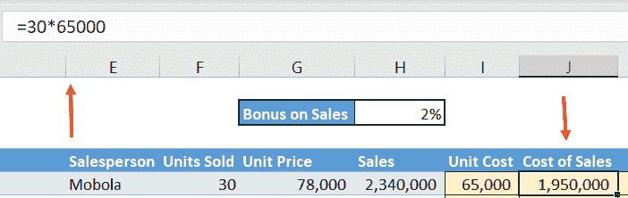
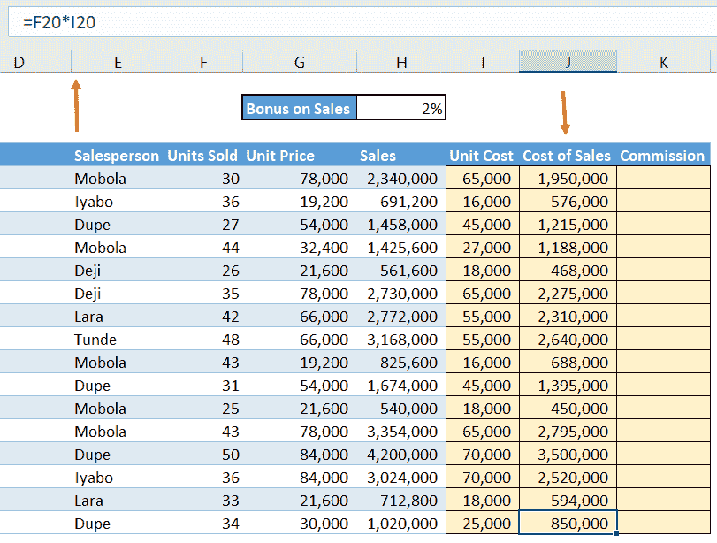
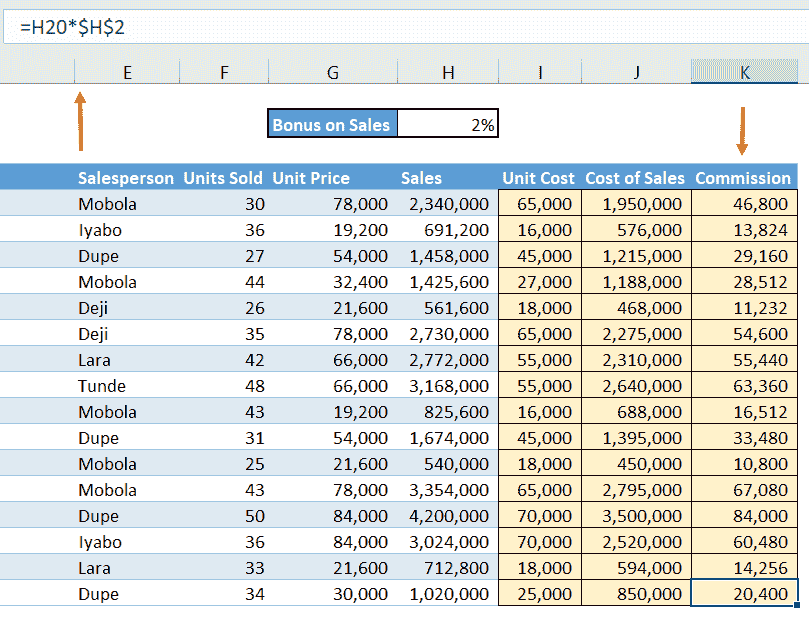
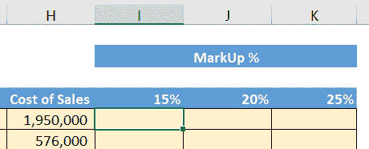
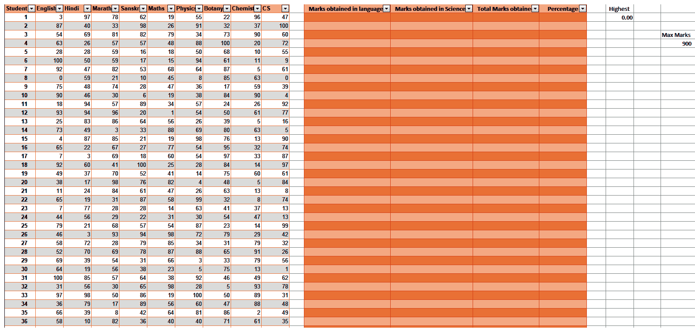
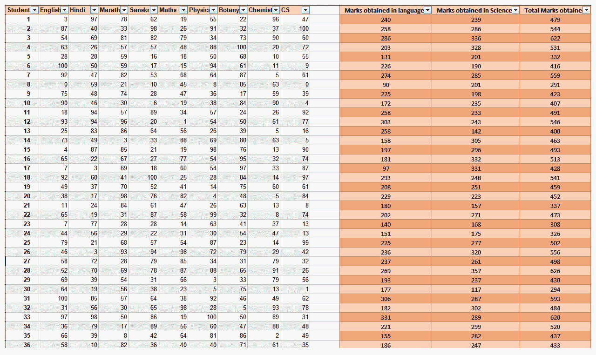
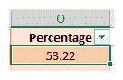

# 在 Excel 中应用引用框架

让我们假设 Microsoft Excel 中的一个工作表被分成超过 1 百万行和超过 16，000 列。行标为 **1** 、 **2** 、 **3** 等等，直到**1048576**，列标为 **A** 、 **B** 、 **C** 等等，直到 **XFD** 。在一个工作表中，行和列交叉形成超过 160 亿个单元格。

但是，由于单元格是由交叉形成它的列和行来标识的，所以每个单元格都有一个唯一的标识，通常写为交叉的列名和行名。因此， **UV** 列和行 **59** 形成了 **UV59** 单元。在那台计算机上的那个工作簿的那个工作表上没有其他的 **UV59** 单元格。此功能构成了 Excel 中引用框架的基础。本章将讨论各种类型的参考框架，以及如何实现它们中的每一个来简化大量的数据集合。

在本章中，我们将讨论以下主题:

*   框架介绍
*   相对引用
*   绝对参考
*   混合引用
*   实现参考框架

# 框架介绍

引用框架确保您可以简单地通过在公式中包含单元格引用来使用任何单元格的内容。下面的截图是最简单的例子。通过在单元格 **F5** 中键入`=D4`，单元格 **D4** 、`Happy day`的内容在单元格 **F5** 中被复制:

您可以在 Excel 中输入公式，方法是直接在单元格中键入公式各部分的值，如下面的屏幕截图所示:

`Cost of Sales`是`Units Sold` × `Unit Cost`，这里是`30` × `65,000`。公式栏显示我们输入`=30*65000`得到`1,950,000`。

这种方法的两个主要缺点如下:

*   不清楚这些数据是从哪里来的。几个月后，当您来回顾您的模型时，您不希望为了确定输入的来源而不得不再次考虑整个过程。
*   如果需要修改包含您输入的值的单元格以容纳新的和/或更准确的信息，无论这些变量出现在模型中的公式中或已经在公式中使用，您都需要相应地逐个更新它们。

# 相对引用

为了避免上述缺点，您应该输入包含值的单元格的单元格引用，而不是键入实际值，如下面的屏幕截图所示:

前面截图中的公式栏显示我们输入了`F5*I5`。

这样，输入来自哪里就一目了然了。所有包含引用这些单元格的公式的单元格都将被自动更新。

引用的另一个优点是，默认情况下，Excel 会注册单元格引用相对于活动单元格的位置。因此，在前面的示例中， **F5** 被注册为左边的四个单元格， **I5** 被注册为活动单元格、 **J5** 左边的一个单元格。

相关之处在于，当您将该公式复制到另一个位置时，Excel 会记住公式中包含的原始单元格引用相对于原始活动单元格的位置。然后，Excel 会相应地调整引用，以保持这些位置相对于新的活动单元格的位置。

因此，如果公式向下复制 15 个单元格，引用的行部分向下调整 15 行，因此`F5*I5`自动变成`F20*I20`。这样，由于公式是相同的，即`Units Sold` × `Unit Cost`，我们可以简单地将我们的公式复制到列表中，仍然可以获得正确的答案。这可以从下面的截图中看出:

这在我们在上一节看到的例子中是行不通的，在这个例子中，我们直接在活动单元格中输入值。如果我们在这种情况下向下复制，我们将得到相同的值，`1,950,000`，在列表中一直向下。

这种引用单元格而不是其实际值的技术称为相对引用。

有几种不同的方法可以复制到单元格区域，如下所示:

*   第一种方法是选择要复制的单元格或单元格区域，按 *Ctrl + C* ，选择要复制的单元格区域，然后按 *Enter* 或 *Ctrl + V* 。

如果按下 *Ctrl + V* ，Excel 会在该区域最后一个单元格的右下角放置一个 *Ctrl* 图标。然后你可以点击图标或者简单的按下 *Ctrl* ，会出现一个**选择性粘贴**选项框，如下图所示:

然后，您可以选择、粘贴格式、粘贴值、移调或执行任何其他选项。

如果您按下 *Enter* 进行粘贴，则此功能不可用。

*   第二种方式是内置 Excel。有一个小黑框出现在所选单元格的右下角，称为**填充柄**。当您将光标悬停在填充柄上时，它会变成一个粗黑十字。选择包含要复制的值的单元格，然后在填充柄上按住鼠标右键，并将其向下拖动到要复制的单元格区域。然后，释放鼠标右键。以下屏幕截图显示了 Excel 中单元格的填充柄:

*   或者，您可以双击填充柄和下面的所有单元格，直到表格的最后一行。这些将由原始单元格填充。你不需要预先选择单元格——你需要做的就是按下 *Ctrl + C* 来让这个方法工作。

但是，必须填充相邻列(左侧或右侧)中的单元格，以便向 Excel 指示您希望填充公式的深度。

*   最后一种方法如下——从包含要复制公式的单元格开始，选择要复制到的单元格范围，然后按 *Ctrl + D* 。所有选定的单元格都将用公式填充。这种方法是我个人最喜欢的，它和双击填充柄一起，是复制到单元格区域的最优雅的方式。你也可以通过按下 *Ctrl + R* 来使用这种方法向右填充。您会发现这对于在财务模型的预测年份列中向右填充公式非常有用。

# 绝对参考

有时，您会有一个公式，其中包含一个您不希望 Excel 在复制公式时修改的引用。例如，假设我们要计算每个销售人员的销售佣金。这将是`Sales` × `Commission`。

当我们在列表中向下移动时，行号会发生变化，因此对销售人员所做销售的引用会从 **H5** 移动到 **H6** ，到 **H7** ，并最终移动到 **H20** ，这是我们列表中的最后一条记录。

然而，单元格 **H2** 中的相同佣金百分比适用于所有销售人员。因此，当我们向下复制列表时，我们需要保留单元格引用， **H2** ，因此我们需要锁定单元格引用或使其成为绝对引用。

我们通过在引用的列和行部分之前放置`$`符号来实现这一点。这样一来，`H2`就变成了`$H$2`。

Excel 允许您按下 *F4* 键将`$`符号放在列和行引用之前，而不是将它们键入。

当您输入公式时，一旦您指向单元格 **H2** ，并且它已经注册在您的公式中，只需按下 *F4* 键，美元符号就会出现，一个在`H`之前，一个在`2`之前，以给出`$H$2`。我们将通过下面的截图更详细地检查这一点。第一个屏幕截图显示了引用`H2`的公式:

下面的截屏显示了您按下 *F4* 后的相同公式:

在下面的截图中，我们可以看到公式已经作为`=H5*$H$2`输入到单元格 **K5** 中，当您按下 *Enter* 时，公式就变成了`46,800`:

这意味着当我们将公式从列表中的一行复制到下一行时，对`Sales`的引用将相应地改变，但是对`Commission`的引用将被锁定在单元格 **H2** 上。

以下截图显示了所有销售人员在`Sales`上的`Commission`:

这是绝对引用的一个例子。

正如我们前面提到的，单元格引用由相交形成该单元格的行和列组成。因此，如果一个单元格在列 **G** ，行 **59** ，它的单元格引用是**G59**； **G** 是单元格引用的列部分，而 **59** 是单元格引用的行部分。任何两个单元格都不能有相同的单元格引用。

当您需要在保留引用相对的行部分时仅锁定列部分，或者在保留引用相对的列部分时仅锁定行部分时，会出现混合引用。这在下面的*混合参考*部分的例子中有所说明。

您应该注意两件事——首先，只有当您想要将公式复制到另一个位置时，参考框架才是相关的。其次，它的主要功能使您可以输入一次公式，然后在包含公式的单元格的范围内复制它，公式的单元格引用具有相对于活动单元格的类似位置。

虽然这个框架可以让你节省大量宝贵的时间，但它不是强制性的，如果你发现你很难理解这个框架，你可以忽略它，手动复制这个公式。

# 混合引用

以下示例使用相同的`Sales Report`工作表，试图比较通过使用`15%`、`20%`和`25%`的`MarkUps`获得的销售额。

在这种情况下，销售额计算为`Cost of Sales` × (1+ `MarkUp %`)。这是标记布局的屏幕截图:

当你只需要锁定一个方向的引用时，需要混合引用，要么向下**要么向右**，但不能两者都锁定。在下面的示例中，您将在单元格`I5`中创建公式，然后通过行 **6** 到 **20** 以及列 **J** 和 **K** 向下复制它。下面的截图显示了`15%`加价的计算:

基础公式是`H5*(1+I4)`。

请注意，公式中有两个单元格引用，`H5`和`I4`，您需要分别考虑。

牢房 **H5** 是`Cost of Sales`。列部分是 **H** ，我们在考虑跨列向右复制时会看到。行部分是 **5** ，我们在考虑向下复制行时会看到它。当沿行复制公式时，您希望销售成本从一条记录到下一条记录发生变化。换句话说，引用的行部分 **5** 不应该被锁定——它应该保持相对；就是前面不应该有`$`的标志。

当跨列复制公式时，从一个`MarkUp %`移到下一个`MarkUp %`时，销售成本保持不变。换句话说，引用的列部分， **H** ，应该用前面的`$`符号锁定。

下面的屏幕截图显示了如何计算第一个引用的引用模式:

因此，我们的第一个参考是`$H5`。

单元格`I4`是`MarkUp %`，也就是`15%`。列部分是 **I** ，我们在考虑跨列向右复制时会用到它。行部分是 **4** ，我们在考虑向下复制行的时候会看到。

当沿着行复制公式时，您希望标记边距(即`15%`)从一条记录到下一条记录保持不变。换句话说，引用的行部分 **4** 应该被锁定，并且前面应该有一个`$`符号。当跨列复制公式时，标记应该从`15%`移动到`20%`，依此类推。换句话说，引用的列部分， **I** ，应该用前面的`$`符号锁定。

下面的屏幕截图显示了如何计算第二个引用的引用模式:

因此，我们的第二个引用将是`I$4`，公式将是`=$H5*(1+I$4)`。这会产生以下输出:

我们现在将对所有单元格进行此操作。

键盘上的 *F4* 键是一个切换键，可以在四个选项之间循环。以单元格引用`H5`为例，按一次 *F4* 键会将`$`符号置于列和行部分之前，以给出`$H$5`。第二次按下将把`$`标志放在排零件前面，只给`H$5`。第三次按下会将`$`标记放在柱形零件前面，仅给出`$H5`。最后，第四次按下 *F4* 键会将参考返回到相对参考，H5，没有`$`符号。

现在，把公式抄下来。

检查复制的公式是否给出了正确答案总是谨慎的。您可以通过选中已复制区域右下角的单元格来完成此操作。在本例中，这是单元格 **K20** ，它正确地引用了单元格 **H20** 和 **K4** 。下面的屏幕截图显示了为确保正确构建公式而进行的检查:

# 实现参考框架

现在，你们都已经掌握了每种参考框架背后的理论，并且知道在哪里使用它们，让我们将这些知识应用到现实生活的场景中。

假设您是一名教师，并且您有全班学生的分数，您需要根据以下标准对数据进行排序并将其分成不同的组:

*   学生所有语言的总分
*   学生在所有学科中的总分
*   总分得分

在这种情况下，引用框架真正发挥了作用。我们可以按照以下步骤使用所需的标准对数据进行排序:

1.  打开提供给你的`Marks.xlsx`文件，其中包含参加期中考试的 66 名学生的成绩。数据将类似于下面的屏幕截图:

2.  现在，我们将开始整理数据。通过查看第一个标准，我们可以看到语言的等级出现在列 **B** 到 **E** 中。因此，让我们在相应的字段中输入学生 1 的公式，在本例中是 **L2** 。由于我们要计算分数的总和，所以我们的公式将是`=B2+C2+D2+E2`，如下面的截图所示:

这会产生以下输出:

3.  现在，对于 student 2，我们只需单击 sum 字段右下角的填充柄，并将其拖到其下的字段，这将产生以下输出:

4.  正如我们在*相对引用*一节中了解到的，我们可以通过几种方式用各自的值填充所有单元格。这里我们将使用最优雅的方式，双击 **L3** 单元格上的填充柄，得到如下输出:

正如我们所看到的，所有的单元格现在已经自动填充了它们各自的值。

作为练习，我会将`Marks obtained in Sciences`列留空，以便您可以自己尝试。

5.  冲洗并重复`Total Marks obtained`栏。我们的最终表格应该类似于下图:

现在，假设您想要找出每个学生得分的百分比。我们可以通过使用以下公式来实现:

为此，我们将应用混合引用。

6.  首先，我们将创建一个独立的单元格， **T5** ，在其中我们将输入学生可以得到的最高分数(`900`)，如下面的屏幕截图所示:

7.  现在，我们将输入公式来计算单元格 **O2** 中学生 1 的百分比，如下所示:

这会产生以下输出:

作为练习，使用填充柄来查找剩余 65 名学生的百分比。

这里你可以做的另一件很酷的事情是使用`=MAX()`函数找到得分最高的学生。完成所有工作后，我们的最终工作表应该类似于下面的屏幕截图:

正如我们所看到的，Excel 中的引用框架具有巨大的功能，所有这些都可以在各个领域中实现。

# 摘要

在本章中，我们学习了 Excel 中的引用框架。我们学习了三种类型的引用；即相对引用、绝对引用和混合引用；以及何时使用它们中的每一个。我们知道这个概念可以在我们的 Excel 工作中节省大量时间，但只有当我们需要将包含一个或多个单元格引用的单元格或单元格范围复制到另一个位置时，这个概念才是相关的。我们还学习了 *F4* 快捷键，以及它如何在不同的引用形式之间切换。

在下一章*了解项目和建立假设*中，我们将介绍了解您所从事的任何项目的目的以及如何建立假设的必要性，这是预测我们未来三到五年的实际结果所必需的。