# 理解项目和建立假设

在金融建模中，没有放之四海而皆准的方法。金融模型在规模、目的和复杂程度上可以有很大的不同。估价模型与贷款偿还模型有很大不同。为扩展业务而创建的模型将不同于为处理业务而创建的模型。一个模型的建立是为了让人们对一家企业的价值有一个大致的概念，这个模型远没有一个支持私募或首次公开募股的模型复杂。你必须理解你被要求准备的模型的范围和目的。无论你的模型多么令人印象深刻，如果它不符合用户的要求，它是没有用的。在这一章中，你将学习如何分析项目，了解项目的目的是什么。您还将学习如何创建假设来改进我们的项目。

在本章中，我们将讨论以下主题:

*   理解项目的性质和目的
*   进行采访
*   建筑假设

# 理解项目的性质和目的

为了确定项目的性质和目的，您需要解决以下几个问题:

*   这个项目想做什么？
*   你是在寻求重视什么，投射什么，还是两者兼而有之？
*   项目的重点或范围是什么？
*   你是把企业看作一个整体，还是企业的一部分，还是某项资产、工厂或设备？
*   目标受众是谁？
*   是内部使用还是个人使用，还是为了向更广泛的受众演示？
*   是经过挑选的、知识渊博的观众还是普通大众？
*   项目中是否有任何专家或技术部分需要您聘请该领域的专家？

这些问题的答案将会影响到你如何处理你的模型，你构建什么类型的模型，以及它有多详细。

# 进行采访

你应该花大量的建模时间与客户的管理层进行讨论。当人们被叫去和专业人士讨论时，他们通常会感到不安，所以你需要消除他们的恐惧，为你们的讨论创造一个没有威胁的环境。你需要让他们明白他们是专家，你需要他们的帮助来理解业务。

这些访谈将帮助你理解为什么决定准备一个财务模型。它们应该涵盖公司的历史，包括已经采取的关键政策决定及其对公司业绩的影响。你需要对关键管理人员进行评估，以及你能在多大程度上相信他们的断言。你需要尽可能完整地记录你们的讨论，但是如果需要的话，要为客户的后续采访做好准备。

# 史料

我们用来预测公司未来五年业绩的假设基础是公司的历史财务状况。为此，你需要获得该公司三年或五年的财务报表。理想情况下，你会想要一份 Excel 格式的账目软拷贝。不幸的是，通常可用的是硬拷贝或 PDF 文件。即使是 Excel 或 CSV 格式，布局也很可能需要修改，以符合您的首选布局。

因此，您应该准备在 Excel 中以适合您的模型的布局再次输入帐户。你需要提取每年的资产负债表和损益表。历史财务数据极其重要，因为除了构成我们假设和预测的基础之外，它们还将在需要故障排除时发挥非常重要的作用。由于我们将在预测年份使用相同的概念和公式，因此使用一套完整和平衡的账户作为起点会有所帮助。

# 建筑假设

财务模型可以被定义为一个数学假设的集合，其目的是为了企业未来的结果、财务状况和现金流，通常是为了得出企业的价值。建立可靠的假设对模型的成功至关重要。

以下是您假设的快速清单:

*   基于真实的历史人物
*   现实的
*   解释清楚
*   易于验证
*   正确记录
*   在模型中(通常使用不同的字体)与计算单元在视觉上有所区别

# 一般假设

你的模型的总体假设是，企业将盈利，现金流最终将为正。

您还假设该企业是一个持续经营的企业(在可预见的未来，它将能够偿还到期债务),并且您获得或得到的关于竞争对手和预计成本和收入的信息是准确的。

# 损益和资产负债表假设

当你建立你的财务报表假设时，你从识别增长驱动力开始。在这种情况下，增长驱动因素是那些最能反映过去三年或五年个别项目增长的指数或指标。

在进行这个练习时，你需要考虑你的决策的成本效益，尤其是在处理不重要的项目时。有时，一个简单的最佳判断预测就足够了。

# 损益账户增长驱动因素

营业额是损益表中最重要的项目。因此，集中精力确定营业额的驱动因素，然后将一些不太重要的生产线费用与预计营业额联系起来是有意义的。

合适的驱动因素可能是同比增长或通胀，或**复合年增长率** ( **CAGR** )。我们现在来看看这两个驱动程序。

# 同比增长

这只是从一年到下一年的增长。通常用百分比来表示。从**年 1** 到**年 2** 的营业额同比增长可计算如下:


# 复合年增长率

要理解 CAGR，你必须理解复利的概念。

如果你以每年 10%的利率投资 1 亿奈拉，你将在年底获得 1000 万奈拉的利息(1 亿奈拉的 10%)。在第二年年底，你会得到另外 1000 万元的利息，以此类推。然而，如果你决定不提取 1000 万元的利息，而是将其复利化，你将有 100 万元+100 万元= 110 万元在第二年年初以 10%的利率投资。因此，在第二年末，你将获得 1100 万奈拉的利息(1100 万奈拉的 10%)。因此，你会有 n110 万+n11 万= N121m 万，在第三年初以 10%的利率投资，依此类推。

奈拉是尼日利亚的货币——你可以用你选择的任何一种货币来代替它，它的价值不会受到影响！

请注意，与您在每年年底提取利息相比，在多年内复利会产生更高的总体回报。你也可以说，你今天的 100 万元在一年结束时价值 110 万元，在两年结束时价值 121 万元，以此类推。今天的钱明天更值钱。

同比增长很少在多个时期保持不变；每年都不一样。实际上，您可能会遇到类似于以下屏幕截图所示的场景:

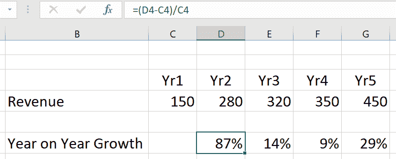

CAGR 是一个指数，用于将多个时期的不同增长率转换为所有时期的单一增长率。

一个项目的 CAGR 取该项目第一年的价值和最后一年的价值，并假设复利，计算该期间的增长率。

CAGR 的公式如下:


我们可以通过隔离等式右侧的 *V1* 来简化这一点，如下所示:

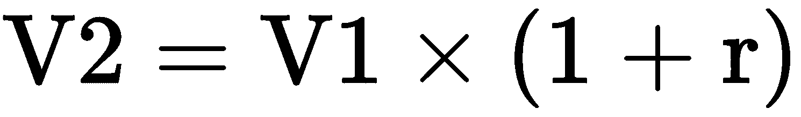

因此，第三年的价值如下:

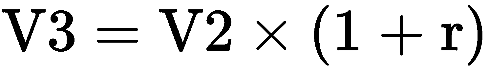

通过将 *V2* 的值代入前面的等式，我们得到如下结果:


现在， *V4* 如下:

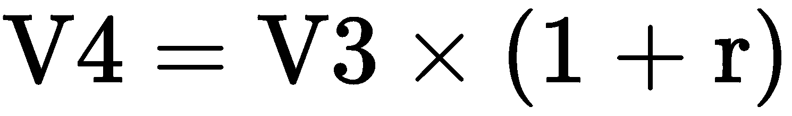

代入 *V3* ，我们得到如下结果:


这导致下面的一般公式:

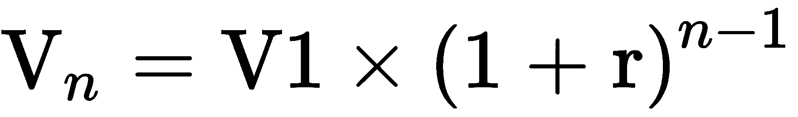

我们采取以下步骤重新排列并使 *r* 成为公式的主题:


我们将 *V1* 移到另一边，这样就变成了 *V <sub>n</sub> /V1* :

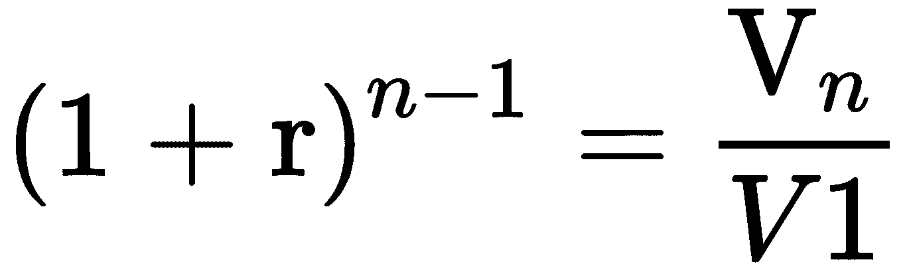

我们将电源符号移到另一边，这样它就变成了 *1/(n-1):*


现在，CAGR 是这样的:


当它被完整地写出来时，它是这样的:


这里， *n* 是总年数。

我们示例中的收入 CAGR 如下:


幂或指数在 Excel 中用`^`表示。因此，2 <sup>2</sup> 成为 Excel 中的 2^2。我们将在这里查看`CAGR`公式:


这给了我们一个`32%`的`CAGR`，如下面的截图所示:

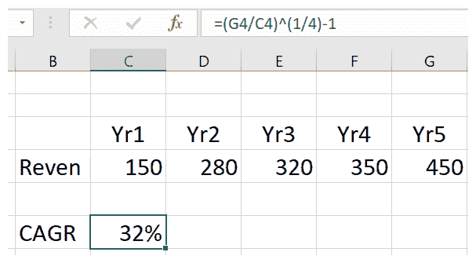

请注意，您可以使用相同的公式来计算其他项目的 CAGR，如销售成本。

总的来说，我们将增长驱动因素应用于以下价值观:

*   **成交量——价格和成交量**:对于一个简单的模型，你可以根据成交量来进行预测。然而，为了使您的模型更加灵活，您可能希望增加它的细节或粒度。在这种情况下，你可以将营业额分解成各个组成部分，并根据价格和数量进行预测。
*   **购买——成本和数量**:同样，对于购买和其他直接费用，如果有必要，您可以使您的模型更加细化，并根据成本和数量进行预测。
*   **管理费用**:大部分管理费用可以根据营业额的历史百分比来预测。然后，将过去五年的平均营业额百分比应用于未来五年每年的估计营业额。

# 资产负债表增长驱动因素

资产负债表增长驱动因素不像损益驱动因素那样直接。当一个损益项目是该项目在审查期间发生的总和时，一个资产负债表项目是由期初余额，加上或减去该项目在该期间的变动，以便在特定时间点达到平衡；也就是说，期末。

一位智者曾经说过，收入是虚荣，利润是理智，但现金是现实。我们通过考虑现金流来确定适当的资产负债表驱动因素。

推动现金流的资产负债表项目是营运资本的要素——存货、债务人和债权人。这些项目的增减对现金流有直接影响。下图显示了这一过程:

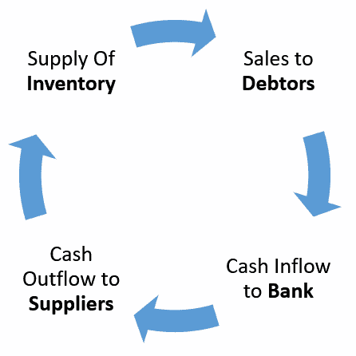

营运资本周期包括你周转股票的速度，你的债务人付款的速度，以及你偿还债权人的速度。一般来说，周期运转越快，其组成部分转化为现金的速度就越快。资产负债表增长驱动因素是使用…的*天的概念计算的。*下图显示了每个流程的不同标签:


# 库存天数

一家公司的管理层需要确保他们有足够的库存来满足客户的需求，并避免供应延迟。另一方面，他们不应该持有太多的股票，因为这束缚了原本可以有效利用的现金。

随着时间的推移，管理人员将会了解持有的最佳库存水平，以及何时重新订购库存，以便在满足客户需求和避免库存过多之间取得适当的平衡。一旦实现了适当的库存控制，售出库存所需的时间(库存天数)应该是相当稳定的，并可用作估计未来库存的基础。

库存天数或库存天数的计算方法如下:


这里，**期初存货**是年初存货，**期末存货**是年末存货，**销货成本**是已售商品的成本。

# 债务人天数

债务人也有类似的假设。一旦管理层建立了一个有效的债务回收流程，平均而言，贸易债务人支付的天数随着时间的推移变得相当稳定，并可用于估计未来的债务人。

债务人天数的公式如下:


这里，**期初债务人**是年初债务人数，**期末债务人**是年末债务人数。

# 债权人天数

最后，一旦管理层能够与供应商协商有利的信用条款，并且有效的付款流程已经到位，向供应商付款所需的时间就变得相当稳定。

债权人天数的计算公式如下:


这里，**期初债权人**是年初债权人数，**期末债权人**是年末债权人数。

一旦我们确立了我们的历史增长驱动因素，我们就转向与管理层讨论的笔记和我们自己的评估，以便对未来五年所选项目和余额的预计行为做出假设。

对于利润和损失项目，我们将注意诸如 *…x 应在未来五年内按历史 CAGR 增长，*或...*应比历史上的 CAGR、*多(或少)增加 0.5%，或...*应在未来五年内从 y%逐渐增加到 z%，或者...w *在接下来的两年里我将保持不变*，*然后在第五年逐渐增加到 y%。**

继续我们的例子，假设销售经理预计在未来五年内，营业额的增长将比历史 CAGR 少 2%,我们将如下进行。

使用您对 Excel 中引用框架的了解，您将突出显示所有要填充增长驱动因素的预测年份的单元格，CAGR <2% (cells **H4** 到 **L4** ，使用适当的绝对和相对引用构建`CAGR`的公式，并减去`2%`:

```
CAGR = ($G$4/$C$4)^(1/4)-1-2%
```

然后，按下 *Ctrl* + *Enter* 。这将为您提供未来五年的预计增长动力，如下图所示:

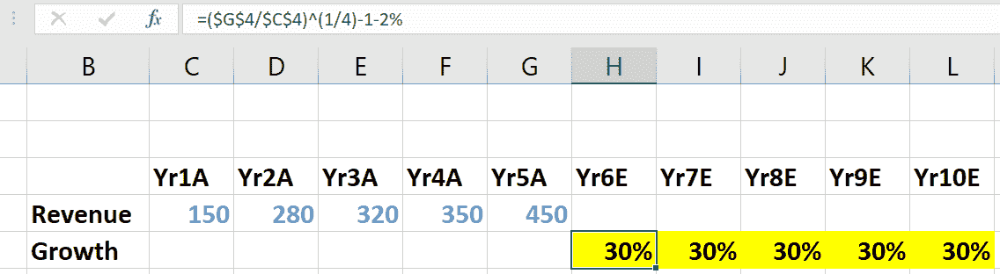

接下来，我们将增长值应用于上一年有实际结果的营业额，`Yr5A`(**A**代表**实际**)，得到第一年估计数字的营业额，`Yr6E`(**E**代表**估计**)，使用以下公式:

```
=G4*(1+H5)
```

我们将对`Yr7E`和随后的每个预测年度重复这一过程。

在实践中，您将突出显示单元格**到 **L4** ，键入一次公式，然后按下 *Ctrl* + *Enter* 来一次填充所有突出显示的单元格，如下所示:**

 **

对其他主要损益项目应用同样的程序。

对于不太重要的损益项目，如`Sales and distribution`，首先计算每个历史年度的百分比营业额。

下面的屏幕截图显示了管理费用占营业额的百分比:


然后，您可以将该驱动因素预测为五个历史年份的平均值。

请注意，用相同的公式填充单元格区域的最快方法是执行以下操作:

1.  选择单元格区域。
2.  适当使用相对、绝对和混合引用构建公式(参见[第 4 章](04.html) *，在 Excel 中应用引用框架*，了解更多信息)。
3.  按住 *Ctrl* ，然后按*Enter*(*Ctrl*+*Enter*)。

该区域中的所有单元格都将填充相同的公式，就像您将公式复制到每个单元格中一样。

如果您忘记了第 1 步，并且在构造公式之前没有选择单元格区域，则所有内容都不会丢失:

1.  适当使用相对、绝对和混合引用构建公式(参见[第 4 章](04.html) *，在 Excel 中应用引用框架*，了解更多信息)。
2.  选择要用公式填充的单元格区域，从您键入公式的单元格开始，并包括该单元格。
3.  现在，如果单元格区域向下，按 *Ctrl* + *D* ，如果单元格区域向右，按 *Ctrl* + *R* 。

以下屏幕截图显示了如何计算未来五年的增长驱动因素:

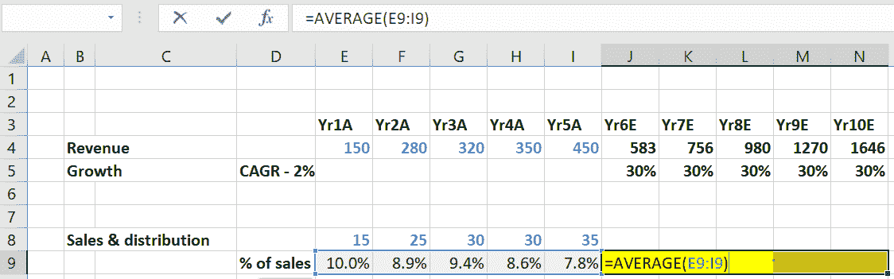

最后，您可以将预计的驱动因素应用到从`Yr6E`到`Yr10E`的每一年。

下面的屏幕截图显示了通过将增长驱动因素应用于去年的价值来计算费用总额:

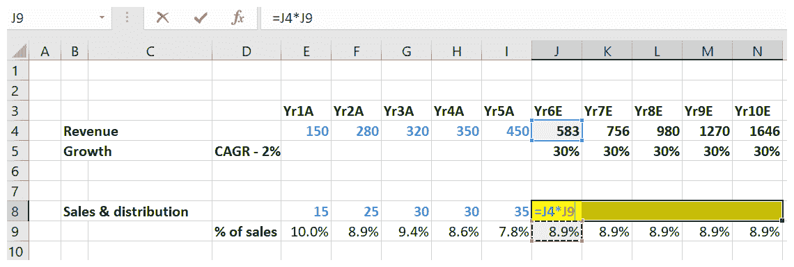

通过这样做，您将得出 6E 年到 10E 年的预计销售和分销成本。

下面的屏幕截图显示了使用相同的公式填写其他预测年份:


通过这种方式，您将建立从`Yr6E`到`Yr10E`的预计/估计年度的损益账户。在这一阶段，除了折旧和利息之外，你的损益表是完整的。

对于资产负债表项目，我们需要重新考虑我们在… 的*天的公式:*


重新排列公式，我们得到以下结果:


让我们扩展一下平均库存和商品销售的日常成本:


然后，通过重新排列公式，我们得到以下结果:


**库存天数**:我们已经提到，库存天数预计会保持稳定。因此，您可以采用过去五年的平均库存历史天数，并将其用作未来五年的预计库存驱动因素。如果有任何事件表明活动可能受到影响，从而对销货成本产生重大影响，您可以对计算的平均库存天数进行最佳判断调整。例如，一个大的竞争对手进入市场可能会导致销售暂时放缓，从而导致销售成本的减少，从而增加库存天数。

**:一年的期初存货就是上一年的期末存货。因此，`Yr6E`的期初库存就是`Yr5A`的期末库存。**

 ****年度 COGS** :这将在预测中提前计算，并在`Yr6E`到`Yr10E`的损益账户中建立。因为等式右边的所有项目都是已知的，我们可以计算`Yr6E`的期末存货，然后重复`Yr7E`到`Yr10E`的程序。以下屏幕截图显示了预测年份的库存计算:


**负债天数**:同理，负债天数可以表示为:


历史负债天数的平均值将作为`Yr6E`至`Yr10E`的预计负债天数。

以下屏幕截图显示了预测年份的债务人计算:

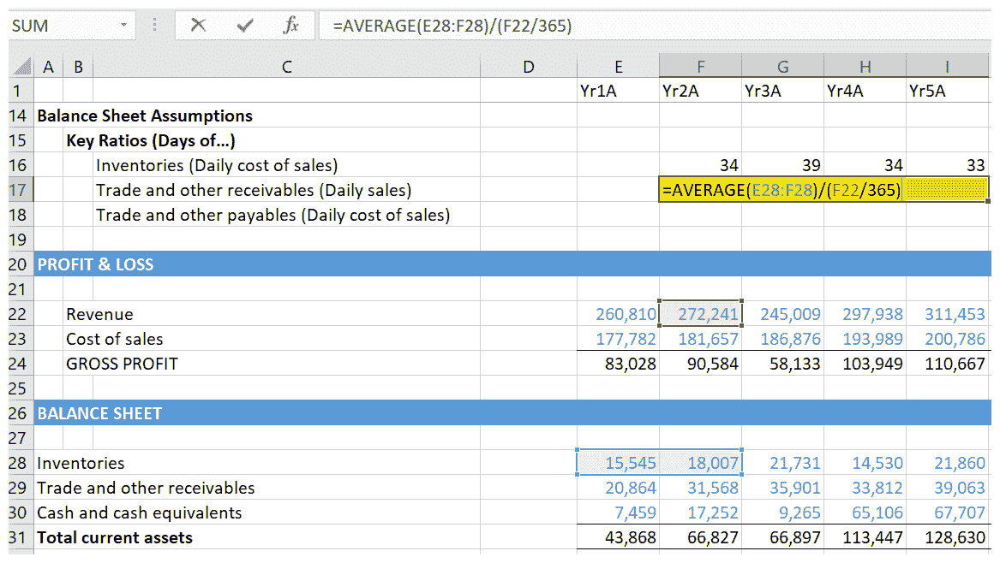

**债权人天数**:最后，我们有以下等式:


历史债权天数的平均值将用于估算`Yr6E`至`Yr10E`的债权天数。

以下屏幕截图显示了预测年份的债权人计算:


一旦我们用这些项目填充了资产负债表，我们将有一个完整的资产负债表，除了长期资产、贷款，当然还有现金。

# 摘要

在这一章中，我们已经看到，如果没有一个项目的本质和目的的全面知识，你可能最终得到一个不符合你的客户规格的模型。我们已经了解了假设的性质和原因，以及与管理层讨论预测未来假设的重要性。在进行假设时，我们已经意识到历史财务、资产负债表、损益表和现金流量表的重要性。我们还了解了历史财务数据，这是解决模型中可能出现的异常情况的重要起点。

在下一章*资产和负债明细表*中，我们将学习如何预测长期资产和借款。我们将介绍不同的方法:一种复杂但更精确的方法，一种简单但更主观的方法。我们还将学习如何用资产和负债明细表中的输出来更新资产负债表和损益。****