# 合理性和准确性的模型测试

准备一个财务模型涉及许多假设和主观决定。为了尽可能地减少这种主观性的影响，您将需要采用某些程序，其中一些我们已经提到过，并执行某些旨在突出最不稳定的假设的测试，并直接关注模型最敏感的输入。

在本章中，我们将讨论以下主题:

*   包含内置测试和程序
*   解决纷争
*   理解敏感性分析
*   使用直接和间接的方法
*   了解场景分析
*   创建一个简单的蒙特卡罗模拟模型

# 包含内置测试和程序

就其本质而言，金融模型充满了公式和计算。虽然大多数都很简单，但是它们的数量和重复性导致了错误的暴露，这可能会让最有成就的建模者在试图追踪它们时做噩梦。

以下是在您的模型中采用的一些程序，以减少这种风险:

*   **硬编码单元格**:应该用蓝色字体区分。以下屏幕截图显示了蓝色字体的硬编码单元格，以区别于标准黑色字体的计算单元格:


如果一个模型必须被修改，那么这些硬编码的单元将需要被调整以实现所需的改变。使用蓝色字体可以减少导航到需要修改的单元格所需的时间。

*   **平衡检查**:为资产负债表创建平衡检查可以确保您能够确认它处于平衡状态，并快速识别导致其失衡的任何行为。平衡检查应该是明显的，并清楚地区分平衡和不平衡状态。

    为了使资产负债表平衡，**总资产减去流动负债**必须等于**总权益和非流动负债**。如果存在未显示的舍入差额，这仍会导致失衡警报。这就是为什么您应该使用`ROUND`函数来确保 Excel 在比较两个总数时忽略小数。

    The following screenshot shows an example of a balance check:

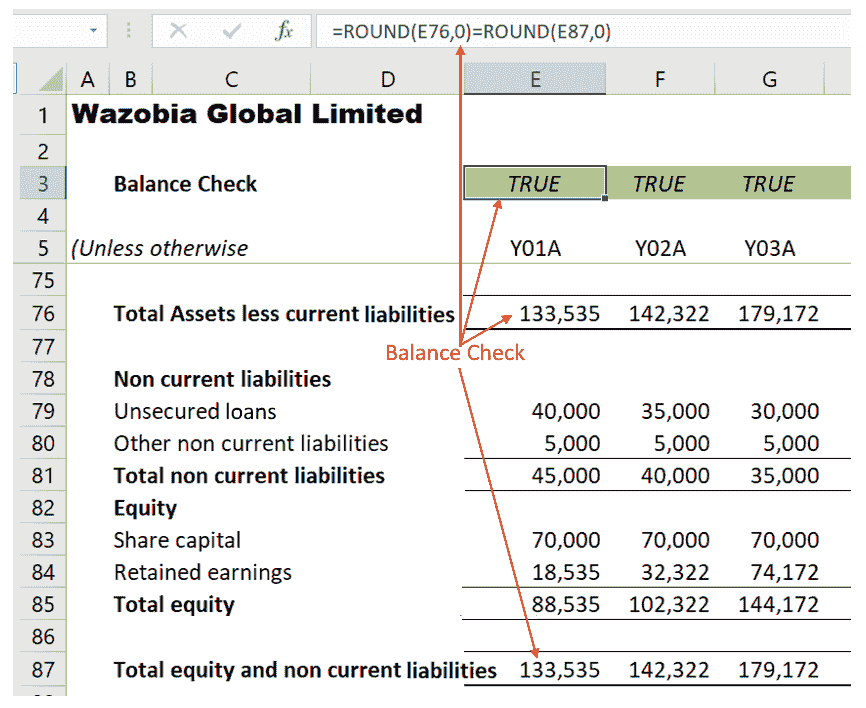

*   **现金及现金等价物**:资产负债表上的现金及现金等价物应当与现金流量表中相应年度的期末现金余额相同。这在某种程度上保证了模型在数学上是准确的。
*   **只输入一次值**:如果需要再次输入一个值，只需参照包含该值的原始条目的单元格即可。这减少了出错的风险，并确保如果必须修改该值，您只需调整原始条目，所有其他事件都会相应地更新。
*   **每行使用一个公式**:利用 Excel 的引用框架，[第四章](04.html)、*在 Excel 中应用引用框架、*输入一次公式，在右边的行中填入相同的公式，其余年份都是如此。如果处理得当，这将极大地减少建模时间并降低错误发生率。

# 解决纷争

如果出现错误，您可以采取某些步骤来快速排除几种可能性:

*   **引用单元格**:引用单元格是在特定单元格中得出值时被引用的单元格
*   **从属单元格**:从属单元格是那些在公式中包含焦点单元格的单元格

下面的截图将用于进一步解释这一点:

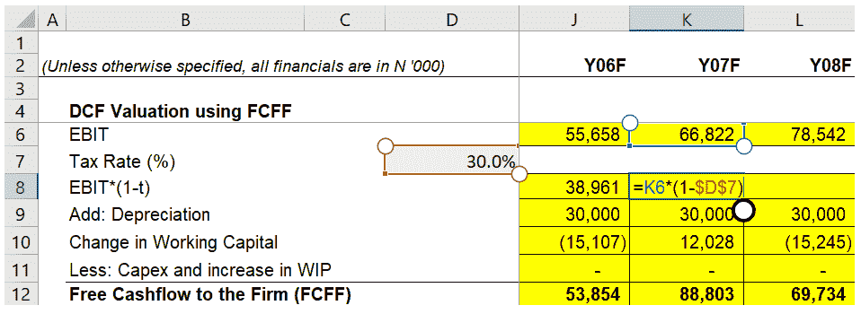

根据前面的截图，让我们看看单元格 **K8** 。该单元格中的公式是`=K6*(1-$D$7)`，所以单元格 **K6** 和 **D7** 是单元格 **K8** 的前身。另一方面，单元格 **K8** 是两个单元格 **K6** 和 **D7** 的从属。

在**公式**功能区的**公式审核**组中，选择**追踪引用单元格**或**追踪从属单元格**会显示蓝色细箭头，相应地将单元格链接到其引用单元格或其从属单元格。

下面的屏幕截图向我们展示了如何使用 Excel 来可视化从属和引用案例:

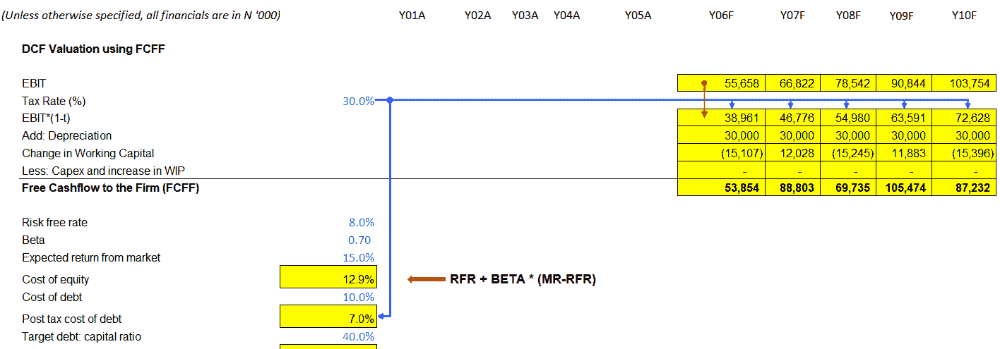

我们可以看到单元格 **D7** 有几个依赖项。但是，由于是硬编码条目，所以没有先例。如果任何单元格有问题，跟踪引用单元格和/或从属单元格可以揭示可能导致异常的错误引用。

*   **显示公式**:有一个很有用的键盘快捷键， *Ctrl +`，*可以让你在显示工作表中所有相关单元格的公式或者将它们保留为值之间切换。按一次 *Ctrl + `* 会显示工作表中的所有公式，如下图所示:

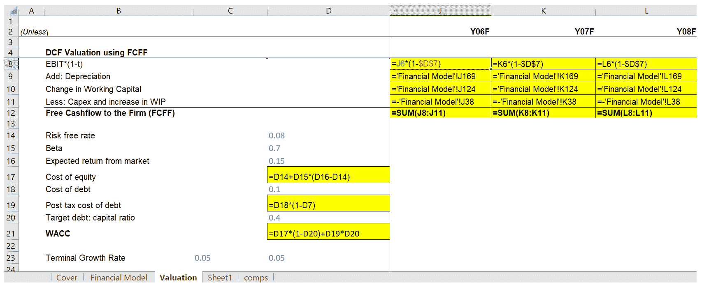

再次按下 *Ctrl+`* 返回数值显示，如下图所示:

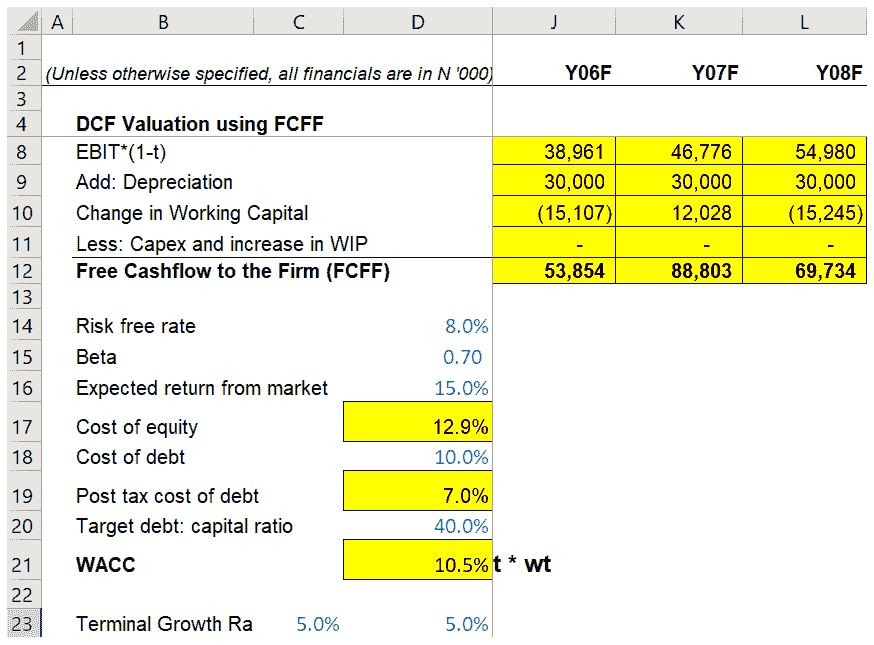

这很有用，因为它允许您快速浏览工作表中的公式，并找出任何明显的错误。

*   **求值公式**:有一个**的运算顺序**，它规定了 Excel 执行操作数(+、-、x、、)的顺序——括号，然后是指数，然后是乘法、除法(从左到右，以最先的为准)，然后是加法和减法(从左到右，以最先的为准)。当您必须编写具有多个操作数的复杂公式时，以下操作顺序有助于确保公式正确执行。不可避免的是，你会有错误地安排公式和弄错顺序的时候，从而导致错误的答案。

**评估公式**功能一步一步地引导您完成 Excel 执行公式并得出显示答案的各个阶段。例如，计算终值的公式如下:

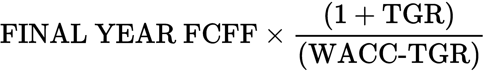

将此公式输入到 Excel 单元格中时，它会变成以下形式:

```
=N12*(1+D23)/(D21-D23)
```

选中终止值单元格，进入**求值公式** ( **公式**功能区> **公式编辑**组> **求值公式**)。启动**评估公式**对话框，如下图所示:


**评估公式**对话框显示正在评估公式的单元格(本例中为 N25)，公式本身在**评估**框中重现，对话框底部有四个按钮；即**评估**、**步入**、**步出**、**关闭**。在**评估**框中，下一个要评估的项目带有下划线。这可能是一个操作(+，-，x，\，^)，将单元格引用转换为该单元格中的值，或者从公式的一部分中删除括号。

默认情况下，Excel 将从左到右执行公式，直到到达一个决策点，在这里可以选择执行更高等级的操作数，这将导致不同的答案。然后，Excel 将跳转到排序较高的操作数并首先执行它，然后返回到排序较低的操作数并从左向右继续。

在 **N25** 的公式中，第一步是 Excel 将第一个引用 **N12** 和 FCFF 转换为该单元格中的值。因此，在前面的截图中，引用 **N12** 带有下划线。下面的截图带我们一步一步地了解公式的执行过程:

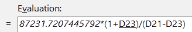

参考值 **N12** 现在被其值代替。请注意，Excel 并不显示经过格式化四舍五入后的缩写金额 87，232，而是显示精确到小数点后 10 位的完整数字。

序列中的下一个操作数应该是乘法。但是，括号的排名高于乘法，因此将优先。因此，在 Excel 返回到默认的从左到右顺序之前，括号中的内容将被完全执行。

在下面的屏幕截图中，第一组括号中的引用`D23`现在带有下划线，表示它将在接下来执行:

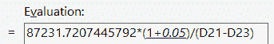

引用`D23`现在由它的值`0.05` (5%)代替，并且该行现在位于第一组括号的内容之下，表示加法，即使它的等级较低，也将在下一个 give `(1.05)`之后执行:


在下面的屏幕截图中，`1.05`周围的括号被移除，该行现在返回到正常序列并位于乘法运算下:

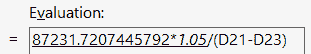

下面的屏幕截图显示了乘法的结果:

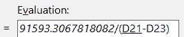

单元格引用`D21`将被转换为其值:

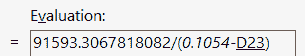

现在，`D23`将被它的值所取代，如单元格中所示:


在下面的两个截图中，显示了减法的结果，然后去掉了括号。首先，对减法进行评估:

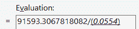

接下来，删除括号，将括号中的数字引入公式:

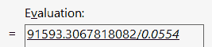

然后，执行最后一个操作数 division，以给出公式的结果，如下面的屏幕截图所示:


您应该注意，如果在任何阶段检测到公式中有错误，您可以点击中的**步骤暂停评估，进入公式，进行修正，然后点击**退出**继续评估。**

# 理解敏感性分析

在第九章**估值*中，我们计算出一个价值为股权的股价。由于模型中固有的不确定性，您应该采取一些措施来减轻这种不确定性。一种方法是进行一些测试，看看当你改变一些投入和驱动因素来达到这个价值时，股价会如何变化。*

 *这个过程叫做**灵敏度分析**。除了你的目标值的波动性，它还表明哪些投入或驱动因素对目标值有最大的影响。您需要确定两个在您的模型中占据显著位置的输入或驱动因素。

我们已经提到过，营业额是损益表中最突出的数字。因此，我们可以将收入增长驱动因素作为宣传的一个项目。另一个突出的项目是终值。

我们已经在[第九章](08.html)、*估值*中看到，这对你的股价估值有多大的影响。您可以使用终值增长率，这是一个用于得出终值的变量，作为敏化的第二个项目。想法是改变这些输入，看看它对你的股价有什么影响，然后把结果画出来。

# 使用直接和间接的方法

敏感性分析有两种方法:直接法和间接法。这两种方法都利用了可以在 Excel 中的**数据**功能区的**预测**组中的**假设**下找到的数据表。下面是**数据表的位置截图...**选项:

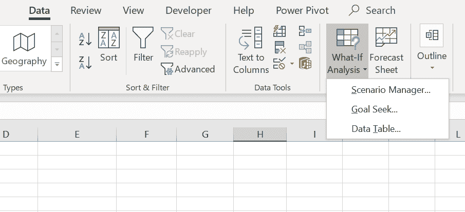

为了利用数据表，您必须以特定的方式组织数据。以下屏幕截图显示了数据表的布局:

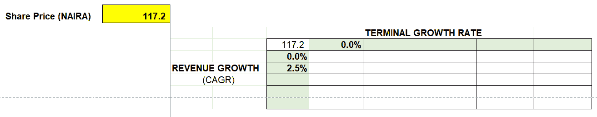

表格布局左上角的单元格必须与目标价值股价相关，我们希望观察其行为。该特定位置对于数据表功能的工作至关重要。但是，由于它不会用于任何其他用途，所以在这里以白色字体颜色显示，使其肉眼不可见，以免引起任何干扰。

行输入值在表的第一行输入。我们已经为行输入选择了**终端增长率**，其值从 3%和 1%增加到 7%。列输入是**收入增长(CAGR)** ，输入到表的最左列，值从 0%和 2.5%增加到 9.5%。

但是，5%条目被更改为 4.5%，以符合用作营业额增长驱动因素的实际历史 CAGR。在准备数据表功能时，从左上角具有目标值的单元格中选择整个表，不包括输入/驱动值。然后，选择**数据表...从**数据**功能区上预测组的**假设**菜单中选择**。这将启动**数据表**对话框，如以下截图所示:


**数据表**对话框有两个输入，**行输入** **单元格**和**列输入单元格**。

# 直接方法

在此方法中，行和列输入单元格通过它们在模型中出现的单元格直接链接到模型。在这种情况下，**行输入单元格**是链接到您的模型的**估价**部分中的**终端增长率**单元格；单元格 **D265** 。 **C** **列输入单元格**是`Y06F`的营业额增长驱动因素，在**假设**部分，它链接到您的模型，单元格 **J11** 。

下面的屏幕截图是对**行输入单元格**的说明:


下面的屏幕截图是对**列输入单元格**的说明:


当您按下 **OK** 时，数据表中会填入您的模型中的终端增长率和营业额增长驱动因素的替代结果，并在数据表行和列标题中填入替代值。以下是已完成数据表的截图:

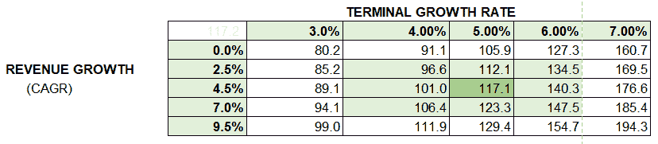

您可以通过查看 5%的终端增长率和 4.5%的营业额增长驱动力下的份额值来测试您的数据表的准确性。

您的表格已经过排列，因此该值位于表格的正中间，在用深绿色填充的单元格中。显示的是`117.1`，对比你的估值结果`117.2`。这让您确信您的数据表设置正确，计算正确。

从表中我们看到，在终端增长率为 3%，营收增长率为 0%的情况下，最低股价为 N `80.2`，最高股价为 N `194.3`，终端增长率为 7%，营收增长率为 9.5%。

# 间接方法

此方法将表格链接到包含我们选择的变量或驱动因素的公式。为此，我们首先设置数据表，如下面的屏幕截图所示:


所有三个输入都具有 0.0%的变更基值，该值将被添加到包含我们所选输入的公式中。然后，我们还为营业额增长和销售成本增加了两个附加值-2.5%和 2.5%，为终端增长率增加了-1.0%和 1.0。变化值表示我们将使用间接方法用数据表测试模型敏感性的范围。

然后编辑相关公式，通过添加 0.0%单元将数据表链接到模型。例如，预测的第一年`Y06F`的营业额是通过将营业额增长驱动因素应用于上一年`Y05A`的营业额得出的，如以下公式所示:

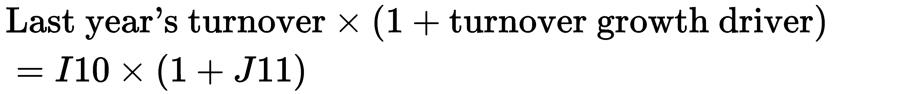

您将编辑公式，在单元格 **C295** 中添加数据表中营业额增长驱动因素的基值 0.0%，如下所示:

```
=I10*(1+J11+C295)
```

然后，您应该将该公式复制到其他预测年度。这样，您就将数据表链接到了模型，而没有更改其结果:


同样，将`Cost of Sales`数据表链接到单元格 **J12** 中的公式:


然后，将终端增长率数据表链接到单元格 **N267** 中的公式。

注意，终值增长率在这个公式中出现了两次，因此必须根据输入的每次出现进行修改。

以下屏幕截图显示了如何将终端增长率数据表链接到您的模型:

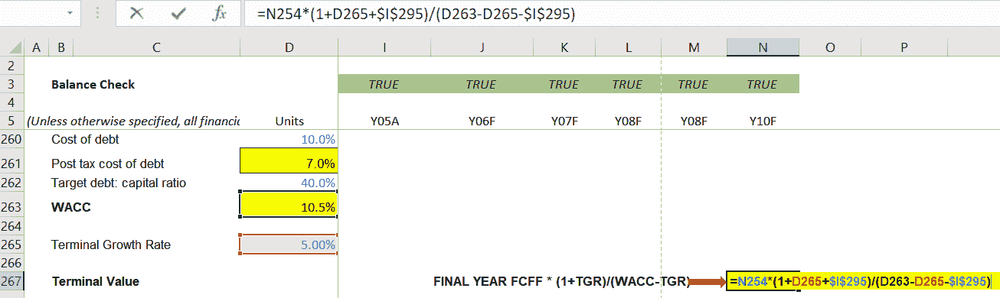

现在，您可以返回并使用**假设分析**、**数据表**功能填充您的数据表。首先，选择整个营业额增长表:

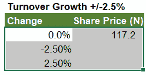

进入**数据** > **假设分析**下的**数据表**，或者使用键盘快捷键*Alt*+*A+**W+**T*，弹出**数据表**对话框。以下是**数据表**对话框的截图:


将**行输入单元格**留空，选择 0.0%的单元格作为**列输入单元格**。当您点击**确定**时，数据表将被填充以低于原始比率 2.5%和高于原始比率 2.5%的营业额增长率的股价计算值。

下面的截图显示了填充的`Turnover Growth Rate`数据表:

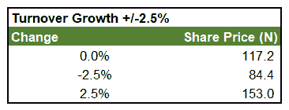

对`Cost of Sales`和`Terminal Growth Rate`数据表重复相同的步骤。这是使用间接方法的完整数据表的屏幕截图:


再次检查你的数据表，你会注意到它比基础营业额增长 4.5%高出 2.5%；换句话说，7.0%。

在 7%的营业额增长率和 5%的终端增长率下，使用直接法，我们得到的股价为 N123.3，这与我们的间接法营业额增长率数据库中的值一致。在 4%的终端增长率和 4.5%的营业额增长率下，使用直接法，我们得到的股价为 N101.0，这与我们间接法数据库中终端增长率的值一致。

目前，间接方法数据表很难理解，所以你需要更进一步，准备一个**龙卷风图**。龙卷风图是在一个地方显示多个输入和驱动因素变化的影响的有效方式。首先，您将从间接方法数据表中准备一个包含图表所需信息的表格。

第一步是计算股价从基础值到负变化值的百分比变化。我们对变化是消极的还是积极的不感兴趣，只要求绝对的变化。所以，我们将使用下面的公式:


下面的屏幕截图显示了股价的百分比变化，以及输入或驱动因素的变化:


对销售成本和终端增长率重复这个公式。现在，首先使用以下公式对最小的百分比变化进行排名:

```
=SMALL(% change, rank number)
```

将公式向下复制到接下来的两行，这样等级数将从 1 变为 2，然后变为 3。这将导致百分比从最小到最大排列，如下面的屏幕截图所示:

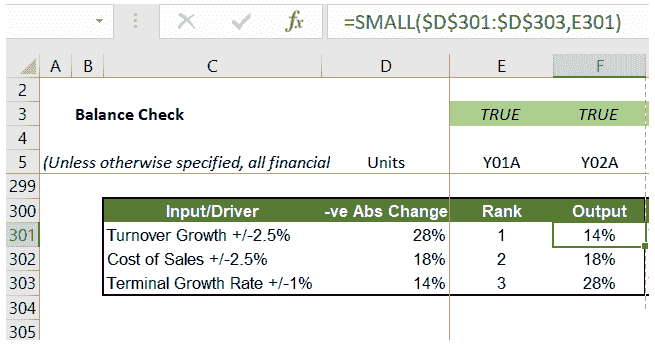

使用`INDEX`和`MATCH`功能(参见[第三章](03.html)、*公式和功能*)，在分级输出旁边输入适当的输入和驱动程序名称(绝对变化)。这些将作为我们的横轴标签。

以下是`INDEX`和`MATCH`公式的截图:


将输出放在标签的右边，形成两个系列，一个是正的，另一个是负的，数字相同。以下屏幕截图显示了完整的表格:


现在，通过转到**插入** > **柱形图或条形图**，然后选择**二维堆积条形图**，创建一个图表。一个空白图表将被放置在您的工作表上。从上下文相关的图表设计菜单中，点击**选择数据**，打开**选择数据源**对话框，如下所示:


现在，通过选择**图例条目(系列)**下的**添加**，依次添加两个系列。打开**编辑系列**对话框。选择正输出列作为第一个系列。第一个数据系列的选择如下图所示:

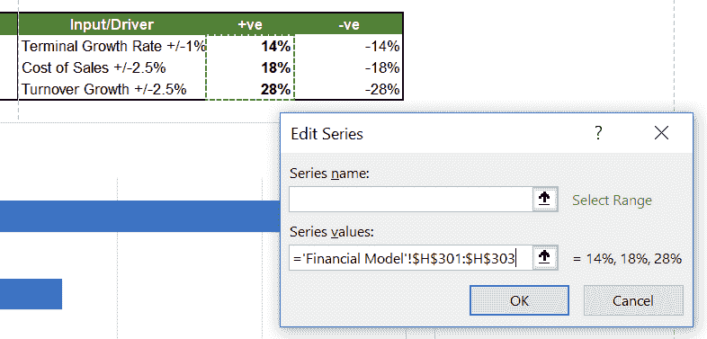

重复该过程添加第二个系列。第二个数据系列的选择如下图所示:

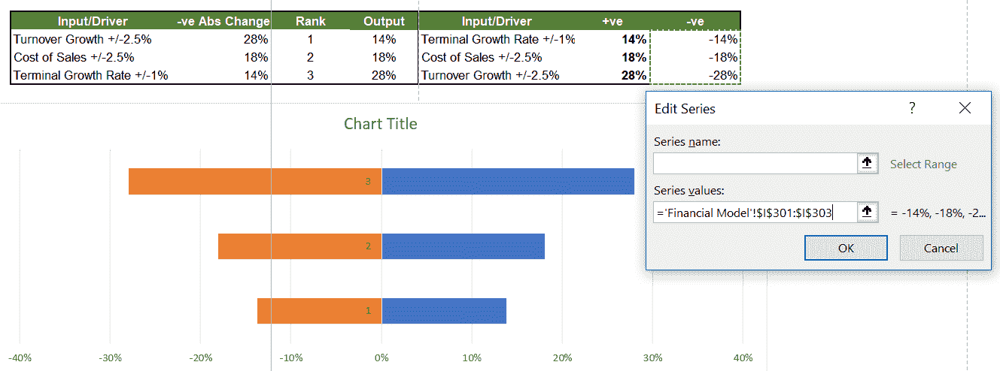

现在，选择水平轴标签。点击**编辑**，然后选择带有输入和驱动名称的列。以下屏幕截图显示了水平轴标签的编辑:


以下屏幕截图显示了编辑水平轴标签的另一种方法:


标签将出现在负系列数据内的水平轴上:

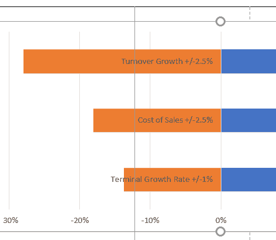

双击横轴，启动**格式轴**对话框，如以下截图所示:

请记住，您的图表是一个堆积条形图，因此会向一侧翻转，因此水平轴实际上是垂直的。


向下滚动显示**标签**选项并点击它。将标签位置更改为`Low`:

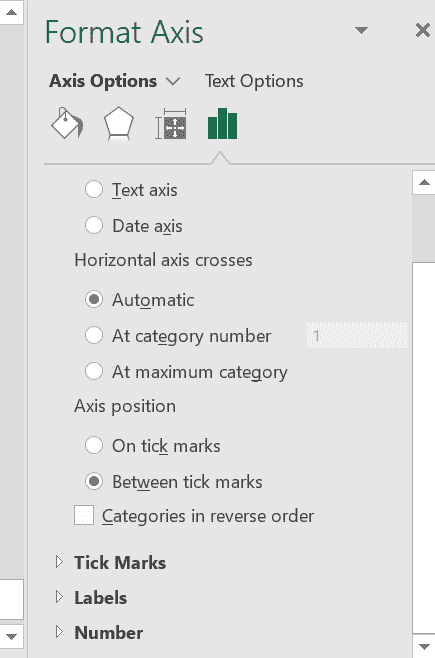

这会产生以下输出:


现在，依次点击彩色系列，将颜色改为更合适的颜色:

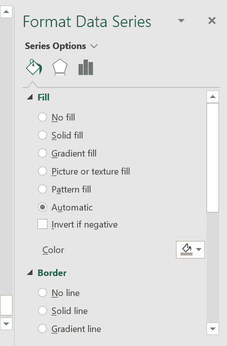

添加图表标题并进行编辑，使其具有适当的突出性:

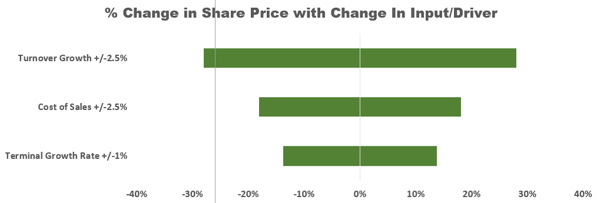

该图表清楚地表明，改变营业额增长驱动因素对股价的影响最大，其次是销售成本，最后是终端增长率。

# 了解场景分析

在敏感性分析中，我们选择了一些输入或驱动因素并改变它们，同时保持所有其他变量不变。这向我们展示了每个选择的输入对股价的孤立影响。然而，在实践中，这种情况很少发生。变量不会孤立地变化。通常情况下，你会发现一些变量会随着特定的环境或场景而发生变化。情景分析通常着眼于两到三组情况，最有可能的是最坏情况和最好情况。

对于每一种情况，您将为所选变量假设替代值。在选择变量时，你应该集中在那些最主观的输入或驱动因素上。情景分析包括将所有选定的变量代入您的模型中的给定情景，并检查这对股价的影响。我们将看看乐观、基本和悲观的情况。我们还将选择**成交量 CAGR** 、 **TGR** 和 **WACC** ，因为这些变量对股价有重大影响。

按照下面的屏幕截图设置您的表，分别使用适当的值来反映乐观和悲观的情况。基本案例将反映我们的 DCF 估值的计算值。下面的屏幕截图显示了场景表:

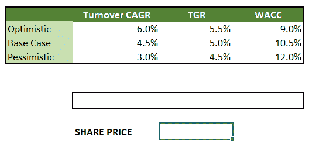

我们现在需要设置一个选择框，它将允许我们选择一个场景，并将该场景链接到我们为每个场景选择的值。我们将为此使用一个组合框，以及`OFFSET`函数。这个组合框可以在 Excel 的 **Developer** 选项卡的**控件**组的 **Insert** 下找到。如果没有显示**开发者**标签，请转到**文件** > **选项** > **自定义功能区**。在**主选项卡**下，勾选**开发者**旁边的复选框。

下面的截图显示了**开发者**选项卡上**组合框**的位置:

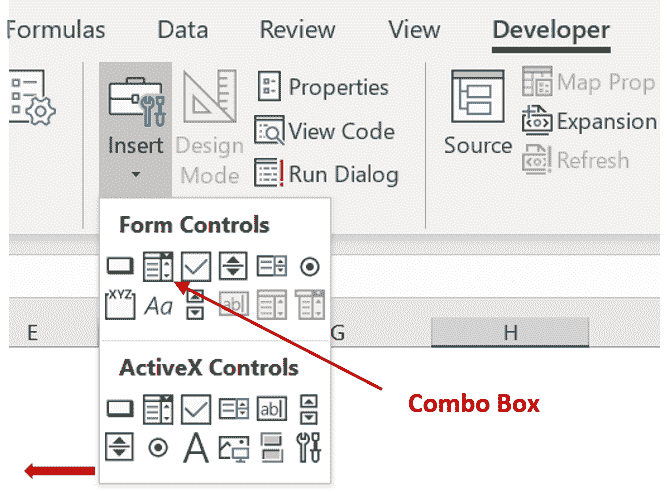

将**组合框**放在参考框旁边，右键单击组合框，选择**格式控件**。打开**格式对象**对话框，如下图所示:


对于**输入范围**，选择带有场景标签的单元格。**单元格链接**可以是任何空白单元格。选择`SHARE PRICE`标签左侧的单元格。下面的截图显示了**组合框**的**格式对象**对话框:

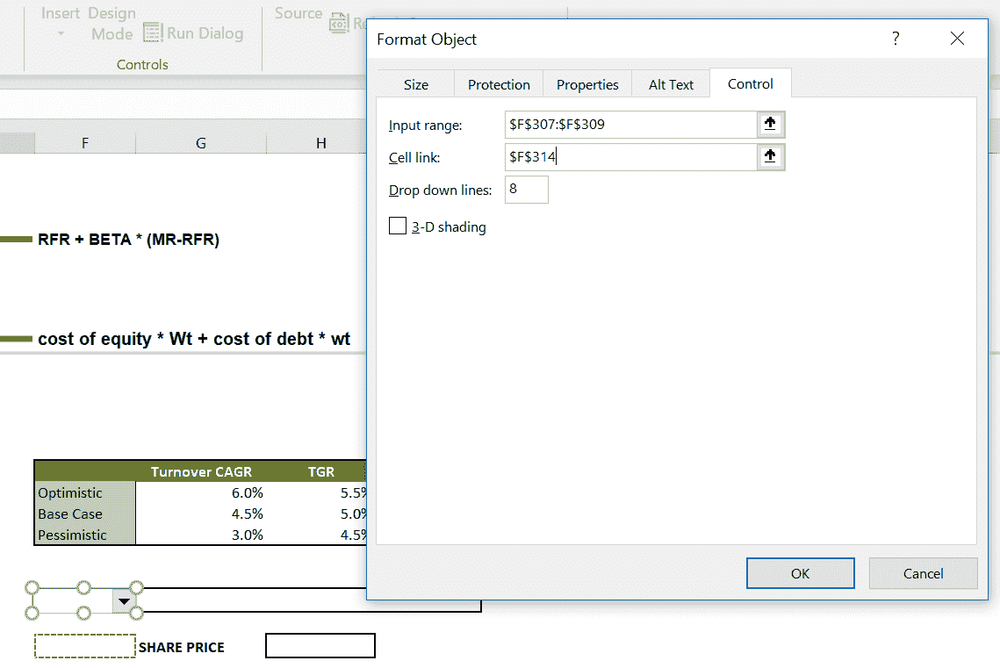

单击组合框右侧的箭头。将显示一个带有方案名称的下拉列表。以下截图是**组合框**选项的下拉列表:

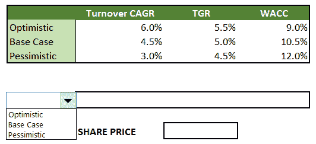

一旦您选择了任何一个选项，它们将显示在组合框中，并且在**单元格链接**单元格中会显示一个数字，对应于您选择的选项列表中的位置。我们现在需要在引用栏中反映所选场景的变量值。为此，我们将使用`OFFSET`函数，以及**单元**中的计数器。`OFFSET`函数的参数允许您将 Excel 引导到一个特定的单元格，从中提取内容。

下面的屏幕截图显示了`OFFSET`函数的参数:


该功能允许您选择一个`reference`变量。下一个参数`rows`允许您指定从参考点向下偏移的行数；`cols`允许您指定从参考点偏移的列数；`height`和`width`只会在你想指定一个范围而不是单个单元格的时候使用。

下面的截图显示了**单元格链接**中的数字 2。当**基本情况**时，选择场景列表中的第二个:


在**组合框中选择**基础案例**后，**的数字 2 显示在**单元格链接**中(参考前面的截图。这对应于**组合框下拉列表中**基础案例**的位置。**接下来，选择参考框中的单元格，然后进入`OFFSET`功能。

利用我们对 Excel 引用框架的了解，我们认识到这是我们将要在引用框的三个单元格中输入的相同公式。因此，我们可以选择三个单元格，输入一次公式，然后按下 *Ctrl + Enter* 来完成并一次填充所有三个单元格。以下截图显示了输入`OFFSET`公式参数时的值:

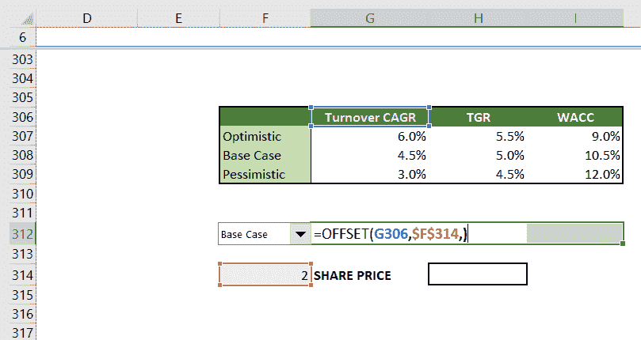

使参比单元 **G306** ，朝`Turnover CAGR`方向移动。当引用复制到右边时，我们希望它查看单元格 **H306** ，标题`TGR`，它在同一行的下一列。使行单元格`$F$314`与**单元格链接**。我们正在锁定这个单元格引用，这样当引用复制到右边时，它仍然会查看**单元格链接**。

然后，我们在`row`参数后添加一个逗号，表示我们已经完成了该参数的输入。然而，由于我们不再输入任何参数，我们可以关闭括号，然后按下 *Ctrl +Enter* 来完成并一次填充所有三个单元格。现在，将股票价格链接到您的模型的**估价**部分的适当单元格。我们还将清空**单元格链接**单元格，这样它就不会引起干扰。下面的屏幕截图显示了一个场景模板，其中股价被链接，而**单元格链接**被删除:

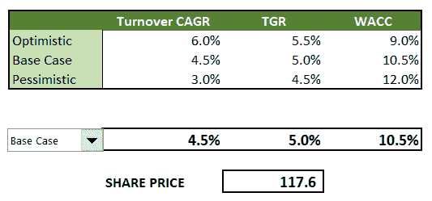

下一步是将参照框中的单元链接到模型中的适当位置。首先，将引用框中`Assumptions`单元格 **I10** 的收入增长`CAGR`单元格与 **G312** 相关联。下面的屏幕截图显示了将`CAGR`单元格链接到引用框的场景:

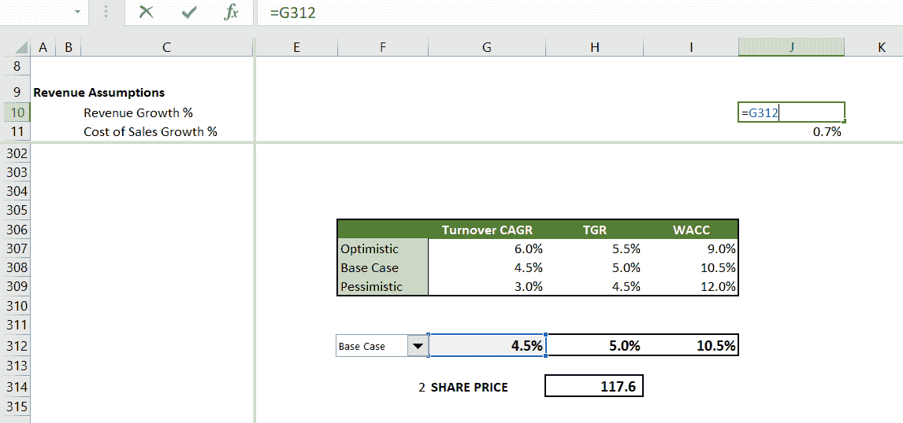

然后，将`TGR`，单元格 **D247** ，链接到参考框中的单元格 **H312** 。以下截图显示了如何将`TGR`链接到参考框:


然后，将单元格 **D245** 、`WACC`链接到参考框中的单元格 **H312** 。以下截图显示了如何将`WACC`链接到参考框:

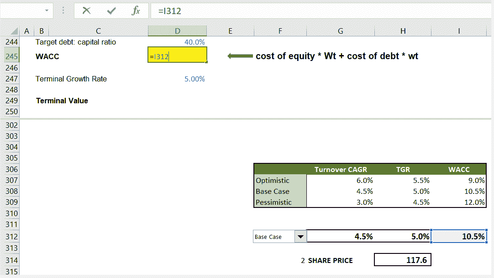

最后，我们使用条件格式来突出显示当前选择的场景。转到**条件格式** > **新规则...**上了**家**的彩带。以下截图显示了**主页**功能区上的**条件格式**选项:


选择**新规则...**打开**新格式** **规则**对话框:


现在，选择**使用一个公式来确定哪些单元格要格式化**。

我们需要使用这个公式，而不仅仅是选择一个预设选项，因为我们将要指定的条件的一些单元格并不是要应用该条件的单元格。以下截图显示了**新格式规则**对话框:

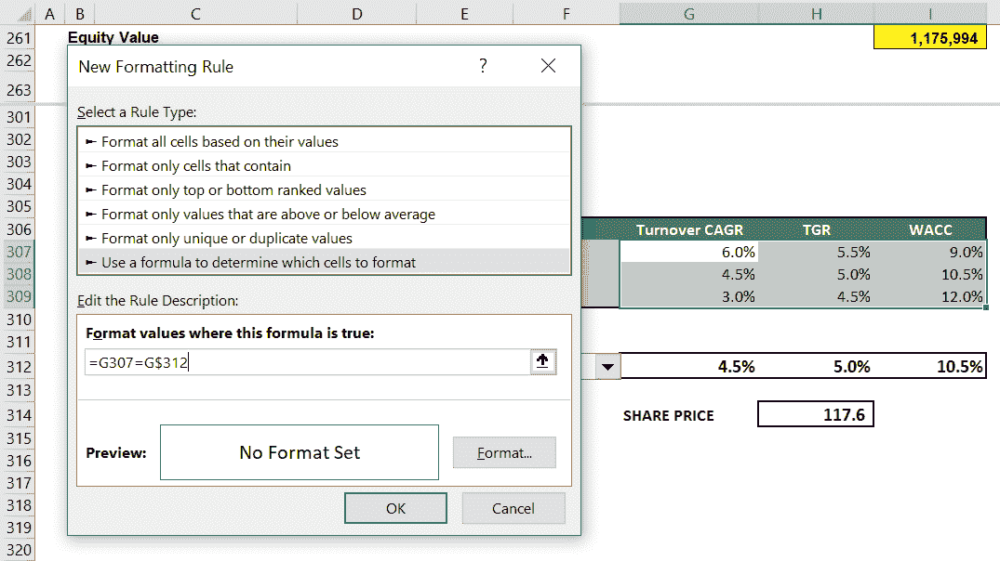

同样，我们将利用相对、绝对和混合引用的知识来节省时间，只需输入公式一次。我们将使用的条件如下:当我们的场景模板中的任何值等于引用框的同一列中的值时，则显示我们将指定的特殊格式。

我们首先突出显示场景模板中的所有值单元格，然后输入公式，如前面的屏幕截图所示:

```
=G307=G$312
```

当该语句为真时(当前为假)，该单元格将显示我们将指定的特殊格式。公式复制到右边，`G307`变成`H307`,`G$312`变成`H$312`。公式复制下来，`G307`变成`G308`，而`G$312`保持为`G$312`。这确保了公式始终链接到参考框的行，即行`312`。

现在我们对公式的正确性感到满意，我们按下 *Ctrl + Enter* 用我们的公式填充场景模板中的所有值单元格。我们现在可以指定满足条件时希望显示的特殊格式。为字体选择红色粗体样式。该屏幕截图显示了如何指定自定义的**字体**格式:


现在，我们将选择一个更好的颜色填充。以下截图显示了如何指定自定义的**填充**格式:

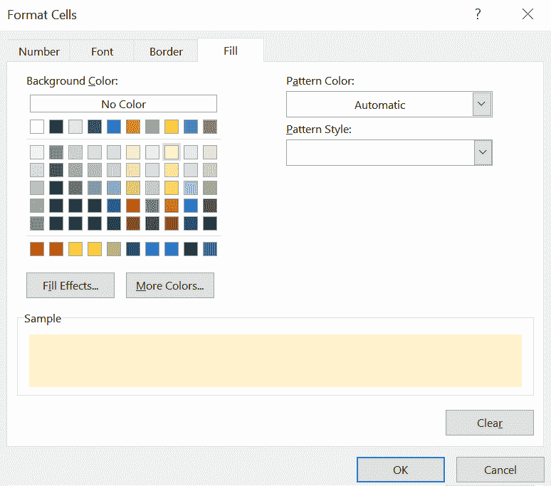

当您按下 **OK** 时，您将返回到**新格式规则**对话框，该对话框现在显示特殊格式的示例。以下截图显示了带有自定义格式示例的**新格式规则**对话框:


当您按下 **OK** 时，您将返回到工作表，并将观察到**基本情况**的值显示条件格式。这是因为这是我们的**组合框**中当前选择的场景。在**基础情况**情景下，股价为`117.6`。具有条件格式的基本情况如下面的屏幕截图所示:

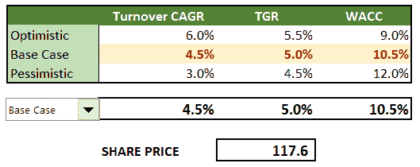

在**组合框**中，选择`Optimistic`场景。以下屏幕截图显示了使用条件格式的乐观场景:


`Optimistic`场景的值现在显示条件格式。这是因为在我们的**组合框**中当前选择的场景是`Optimistic`场景。股价是`222.4`。现在，选择`Pessimistic`场景。

下面的屏幕截图显示了带有条件格式的`Pessimistic`场景:

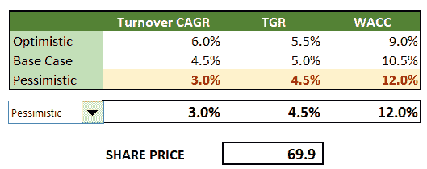

`Pessimistic`场景的值现在显示条件格式。这是因为在我们的**组合框**中当前选择的场景是`Pessimistic`场景。股价是`69.9`。

# 创建一个简单的蒙特卡罗模拟模型

蒙特卡洛模拟是一种计算过程中不同结果的概率的模型，其中存在许多固有的不确定性。该模型利用随机生成的数字来获得数千个可能的结果，从中可以推断出最有可能的结果。我们将关注自由现金流的增长，FCFF，以及资本成本，WACC，这两者都是我们的 DCF 模型的组成部分。

使用以下公式计算历史年份`Y02A`至`Y05A`的 FCFF 增长率:


以下屏幕截图显示了计算出的 FCFF 历史增长率:

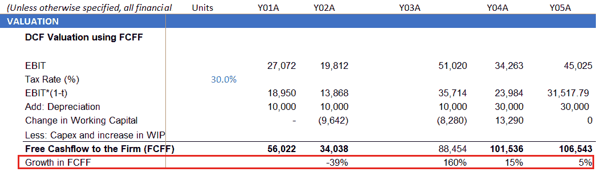

通常，蒙特卡罗模拟使用成千上万次重复。然而，为了便于说明，我们将数量限制为 100。让我们取 FCFF 历史增长率的平均值。

以下屏幕截图显示了 FCFF 平均增长率的计算方法:

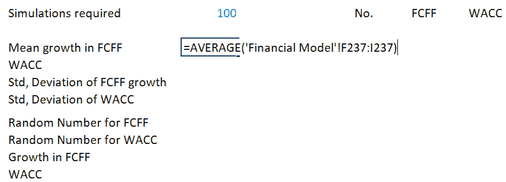

我们从模型的估价部分获得`WACC`。下面的屏幕截图显示了如何操作:


我们将假设每个标准偏差为 1%。标准差是一个衡量我们期望我们的模拟与我们的 FCFF 增长和 WACC 的初始值相差多少的指标。我们现在使用 Excel 函数`RAND`为 FCFF 增长和 WACC 创建一个随机数生成器，用于 FCFF 增长和 WACC。

下面的屏幕截图显示了我们如何为 FCFF 增长和 WACC 创建随机数生成器:


`RAND`函数生成一个介于 0 和 1 之间的随机数。每次 Excel 在这个或另一个单元格中执行计算时，函数都会重新计算，并重新生成另一个随机数。数字`0.83751`，转化为该值出现的`83.75%`几率。

通过这种设置，Excel 可以为 FCFF 增长和 WACC 生成 100 种不同的结果。如果将这些结果绘制成图表，它们将遵循所谓的**正态分布**。

这是一个正态分布图:


这些点聚集在一个中心峰周围。一个值离峰值越远，该值出现的可能性就越小。峰值代表所有值的平均值，是变量最可能的值。从图表中，您可以从 X 轴(水平轴)中选择一个值，然后向上画一条垂直线。它与曲线的交点给出了该值出现的概率。

在我们正在创建的场景中，我们正在生成随机概率，我们希望将这些概率转换为 FCFF 增长和 WACC 的值。为此，我们使用 Excel 函数`NORMINV`。该函数使用平均值、标准偏差和概率来计算`growth in FCFF`和`WACC`变量的值。

以下是显示`NORMINV`功能的截图:

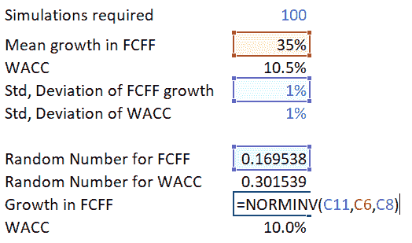

我们可以通过简单的按下 *F2* ( **编辑**)，然后*输入*，手动强制 Excel 生成一个新鲜的随机数。每次产生新的随机数，都会为 FCFF 增长和 WACC 创造新的值。

请注意，不同屏幕截图中的值是不同的。这是因为`RAND`函数会不断产生新的随机数。

我们可以将这些新值一个接一个地复制并粘贴到另一个位置，以便将结果制成表格。我们将不得不这样做 100 次，以涵盖我们正在构建的场景所需的模拟数量。或者，有一种更有效的方法，使用数据表。

首先在空白单元格中键入`1`。选中该单元格，点击**主页**功能区的**编辑**组中的**填充**图标，然后选择**系列**。这是选择**填充** > **系列**的截图:

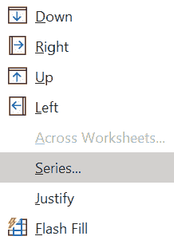

一个**系列**对话框打开。在字段选择**系列中的**列**，输入**步进值**为`1`，输入**停止值**为`100`。这是**系列**对话框的截图:**

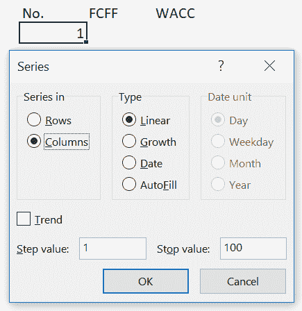

当你按下 **OK** 键时，从 1 到 100 的一系列数字就会生成，从你之前输入的数字`1`开始。现在，通过将 FCFF 的增长与数字 1 旁边的单元格联系起来，创建第一个迭代。

这张截屏显示了 FCFF 的增长如何与我们的新表格相关联:

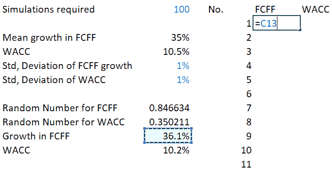

然后，以同样的方式连接 WACC。这张截图显示了`WACC`如何链接到我们的新表格:


我们现在将使用**数据表**用`Growth in FCFF`和`WACC`的值填充我们的新表。突出显示新表格中的所有单元格，然后转到**数据**功能区下的**预测**组，选择**假设分析**，然后选择**数据表**。在打开的**数据表**对话框中，忽略**行输入单元格**。

对于**列输入单元格**，选择表格外的任意空单元格。这个屏幕截图显示了选择表外的一个空单元格作为**列输入单元格**:


当您点击 **OK** 时，表格中填充了`Growth in FCFF`和`WACC`的 100 次迭代，如下图所示:


然后，根据我们的假设，通过取 FCFF 增长 100 次迭代的平均值，我们得到 FCFF 增长的最可能值。这张截屏展示了我们如何在 FCFF 实现新的增长:

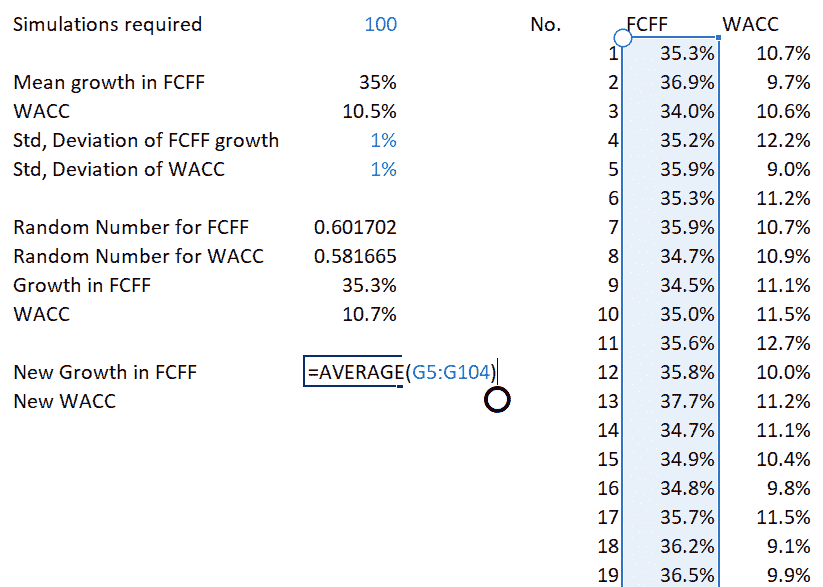

`WACC`最可能的值是`WACC`的 100 次迭代的平均值。下面的截图说明了我们如何得到一个新的`WACC`:

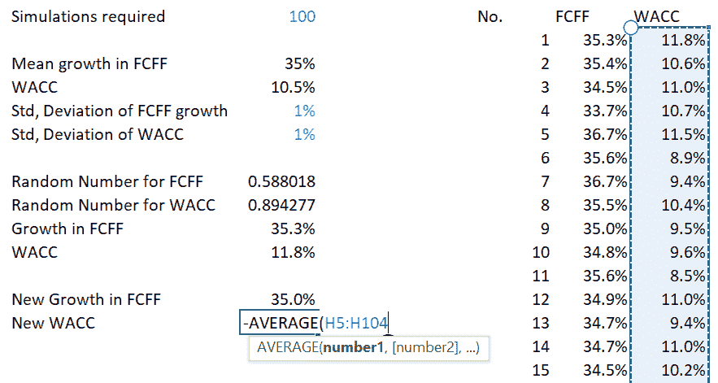

我们现在将 FCFF 和 WACC 增长的新价值代入我们的估值模型。下面的屏幕截图显示了如何做到这一点:

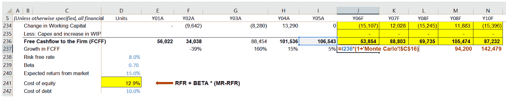

然后，我们在公式中用 WACC 代替`Terminal Value`，如下所示:


我们重新计算预测年份的`FCFF`的现值和终值、净现值等，以得出 N'(000) `2,069,368`的`Enterprise Value`，N'(000) `1,942,675`的`Equity Value`、市值，以及最终的`194.27`的`Share Price (NAIRA)`。

# 摘要

在这一章中，我们学习了如何将一些测试和程序整合到您的模型中，以提高模型的准确性。我们已经学习了一些基本程序，以便对模型中出现的错误进行故障排除。我们已经理解了敏感性分析的含义，并学会了如何使用直接和间接方法。我们还学会了如何在图表中显示我们的结果，并对它们进行有意义的解释。最后，我们学习了情景分析，它与敏感性分析的区别，以及如何使用它。

金融建模可能是一个复杂的话题，但我们希望我们已经能够充分揭开它的神秘面纱，以鼓励你接受一个非常有益的主题。完全避免一些技术内容是不可能的，但我们希望即使在这里，我们也能够使它不那么令人生畏。*