# 五、使用 Matplotlib 实现数据可视化

数据可视化使得理解数字数据比阅读纯数字表格要容易得多。图表库的主要用途是即时洞察数据并识别模式、趋势和异常值。

当决定哪只股票可能适合哪种算法交易策略时，创建股价图表是第一步——有些策略只适合趋势股票，有些适合均值回复股票，等等。虽然数字统计很重要，但没有什么可以替代精心设计的图表。

本章向我们介绍 Matplotlib，这是一个静态的、动态的、交互式的 Python 可视化库，扩展了 NumPy 的功能。`pandas`库允许使用 Matplotlib 直接绘制数据帧。

本章涵盖以下主要主题:

*   创造人物和支线剧情
*   用颜色、标记和线型丰富地块
*   用刻度、标签和图例丰富坐标轴
*   用注释丰富数据点
*   将图保存到文件
*   用 Matplotlib 绘制一个`pandas`数据帧

# 技术要求

本章使用的 Python 代码可以在本书的代码库中的`Chapter05/matplotlib.ipynb`笔记本中找到。

# 创造人物和支线剧情

Matplotlib 支持在单个图形上绘制多个图表(子图)，这是 Matplotlib 对绘图画布的称呼。

## 定义人物的支线剧情

要创建一个`matplotlib.pyplot.figure`对象，使用下面的方法:

```
import matplotlib.pyplot as plt
fig = plt.figure(figsize=(12, 6), dpi=200)
```

这产生了一个空的图形对象(`0 Axes`):

```

```

在我们在这个图上绘制任何东西之前，我们需要添加支线剧情来为它们创造空间。`matplotlib.pyplot.figure.add_subplot(...)`方法让我们通过指定子情节的大小和位置来做到这一点。

下面的代码块在左侧添加了一个大小为 1x2 的网格子图，然后在右上角添加了一个 2x2 的子图，最后在右下角添加了一个 2x2 的子图:

```
ax1 = fig.add_subplot(1, 2, 1)
ax2 = fig.add_subplot(2, 2, 2)
ax3 = fig.add_subplot(2, 2, 4)
fig
```

结果是下面的图形对象包含了我们刚刚添加的支线剧情:

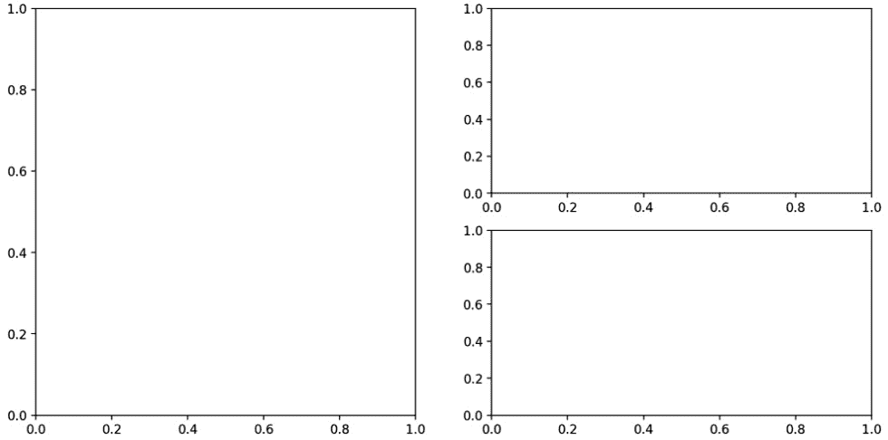

图 5.1–包含三个空支线剧情的图

现在，一旦我们为图表(`"plots"` / `"subplots"`)创建了空间，我们就可以用可视化来填充它们。在所有报表中，页面上的物理空间非常昂贵，因此创建像前面这样的图表是最佳实践。

## 支线剧情中的密谋

让我们使用`numpy.linspace(...)`在 *x* 轴上生成等间距值，然后使用`numpy.square(...)`、`numpy.sin(...)`和`numpy.cos(...)`方法在 *y* 轴上生成相应的值。

我们将使用通过添加支线剧情获得的`ax1`、`ax2`和`ax3`轴变量来绘制这些函数:

```
import numpy as np
x = np.linspace(0, 1, num=20)
y1 = np.square(x)
ax1.plot(x, y1, color='black', linestyle='--')
y2 = np.sin(x)
ax2.plot(x, y2, color='black', linestyle=':')
y3 = np.cos(x)
ax3.plot(x, y3, color='black', linestyle='-.')
fig
```

现在，下面的图包含了我们刚刚绘制的值:

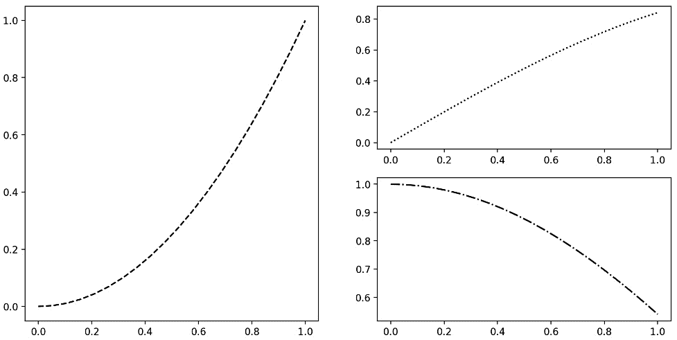

图 5.2–包含三个绘制平方、正弦和余弦函数的子图

创建支线剧情时可以传递`sharex=`参数，指定所有支线剧情应该共享同一个 *x* 轴。

让我们演示这个功能并绘制正方形，然后使用`numpy.power(...)`方法将`x`提升到 10 的幂，并用相同的 *x* 轴绘制它们:

```
fig, (ax1, ax2) = plt.subplots(2, figsize=(12, 6),
                               sharex=True)
ax1.plot(x, y1, color='black', linestyle='--')
y2 = np.power(x, 10)
ax2.plot(x, y2, color='black', linestyle='-.')
```

结果如下图所示，一个共享的 *x* 轴和不同的函数绘制在每个图形上:


图 5.3–共享一个 x 轴的子图，包含正方形和 10 个函数

我们生成的图表还不能自我解释——不清楚 x 轴和 y 轴上的单位是什么，以及每个图表代表什么。为了改进图表，我们需要用颜色、标记和线条样式来丰富它们，用记号、图例和标签来丰富轴，并提供所选数据点的注释。

# 用颜色、标记和线条样式丰富绘图

颜色、标记和线条样式使图表更容易理解。

后面的代码块绘制了四个不同的函数，并使用以下参数修改的外观:

*   `color=`参数是用于分配颜色的。
*   `linewidth=`参数用于改变线条的宽度/厚度。
*   `marker=`参数指定不同的形状来标记数据点。
*   `markersize=`参数改变这些标记的大小。
*   `alpha=`参数用于修改透明度。
*   `drawstyle=`参数将一个图的数据点之间的默认线连接更改为阶梯连接。

代码如下:

```
fig, (ax1, ax2, ax3, ax4) = plt.subplots(4, 
                                         figsize=(12, 12), 
                                         sharex=True)
x = np.linspace(0, 10, num=20)
y1 = np.exp(x)
y2 = x ** 3
y3 = np.sin(y2)
y4 = np.random.randn(20)
ax1.plot(x, y1, color='black', linestyle='--', linewidth=5,
         marker='x', markersize=15)
ax2.plot(x, y2, color='green', linestyle='-.', linewidth=2, 
         marker='^', markersize=10, alpha=0.9)
ax3.plot(x, y3, color='red', linestyle=':', marker='*', 
         markersize=15, drawstyle='steps')
ax4.plot(x, y4, color='green', linestyle='-', marker='s', 
         markersize=15)
```

输出显示了四个函数,它们被赋予了不同的属性:


图 5.4–展示不同颜色、线条样式、标记样式、透明度和大小选项的图

使用不同的颜色、线条样式、标记样式、透明度和大小选项使我们能够生成丰富的图表，其中包含易于识别的多个时间序列。明智地选择颜色，因为它们在一些笔记本电脑屏幕上或打印出来的纸上可能不太好。

丰富坐标轴是制作优秀图表的下一步。

# 用刻度、标签和图例丰富坐标轴

通过刻度、极限和标签定制轴，可以进一步改进图表。

`matplotlib.pyplot.xlim(...)`方法设置 *x* 轴上的值的范围。

`matplotlib.pyplot.xticks(...)`方法指定刻度显示在 *x* 轴的什么位置:

```
plt.xlim([8, 10.5])
plt.xticks([8, 8.42, 8.94, 9.47, 10, 10.5])
plt.plot(x, y1, color='black', linestyle='--', marker='o')
```

这将修改 *x* 轴，使其处于指定的限制范围内，并修改明确指定值处的刻度:

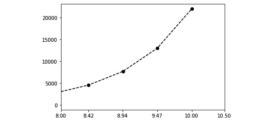

图 5.5–x 轴上有明确界限和刻度的图

我们还可以使用`matplotlib.Axes.set_yscale(...)`方法将其中一个轴的比例改为非线性。

`matplotlib.Axes.set_xticklabels(...)`方法改变 *x* 轴上的标签:

```
fig, ax = plt.subplots(1, figsize=(12, 6))
ax.set_yscale('log')
ax.set_xticks(x)
ax.set_xticklabels(list('ABCDEFGHIJKLMNOPQRSTUV'))
ax.plot(x, y1, color='black', linestyle='--', marker='o',
        label='y=exp(x)')
```

代码块的输出显示了 *y* 轴刻度的差异，现在是对数刻度，而x 轴刻度有特定的刻度标签:

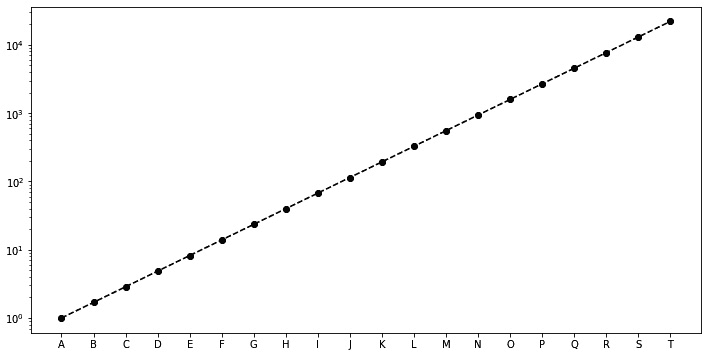

图 5.6–用对数 y 轴刻度和自定义 x 轴刻度标签绘图

如果数据集覆盖大范围的值和/或如果我们想要传达百分比变化或乘法因子的，图表中的对数标度是有用的。

`matplotlib.Axes.set_title(...)`方法为绘图添加标题，`matplotlib.Axes.set_xlabel(...)`和`matplotlib.Axes.set_ylabel(...)`方法为 *x* 和 *y* 轴设置标签。

`matplotlib.Axes.legend(...)`方法添加了一个图例，这使得图形更容易解释。`loc=`参数用`loc='best'`指定图例在图上的位置，意味着 Matplotlib 自动选择最佳位置:

```
ax.set_title('xtickslabel example')
ax.set_xlabel('x labels')
ax.set_ylabel('log scale y values')
ax.legend(loc='best')
fig
```

下面的图显示了标题、 *x* -和*y*-轴标签以及图例:

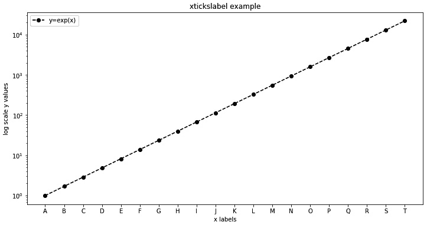

图 5.7–展示标题、x 轴和 y 轴标签以及图例的图

对于理解图表来说，具有每个时间序列的不同呈现方式以及解释的单位和坐标轴标签的图表就足够了。然而，总有一些特殊的数据点会因被指出而受益。

# 用注释丰富数据点

`matplotlib.Axes.text(...)`方法给添加一个文本框到我们的图中:

```
ax.text(1, 10000, 'Generated using numpy and matplotlib')
fig
```

输出如下所示:

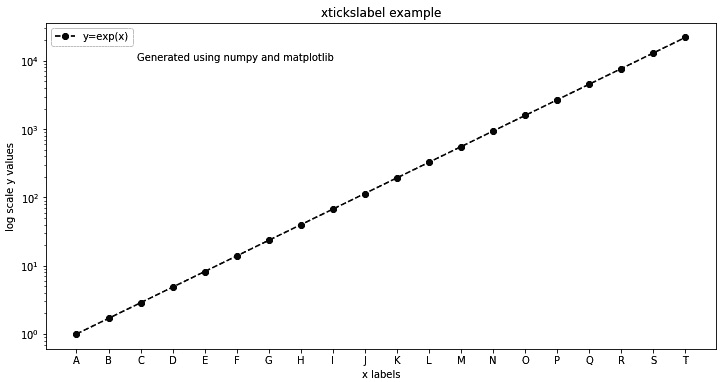

图 5.8–显示 Matplotlib 文本注释的绘图

`matplotlib.Axes.annotate(...)`方法提供了对注释的更多控制。

下面的代码块使用以下参数来控制注释:

*   `xy=`参数指定数据点的位置。
*   `xytext=`参数指定文本框的位置。
*   `arrowprops=`参数接受指定参数的字典来控制从文本框到数据点的箭头。
*   `facecolor=`参数指定颜色，而`shrink=`参数指定箭头的大小。
*   `horizontalalignment=`和`verticalalignment=`参数指定文本框相对于数据点的方向。

代码如下:

```
for i in [5, 10, 15]:
    s = '(x=' + str(x[i]) + ',y=' + str(y1[i]) + ')'
    ax.annotate(s, xy=(x[i], y1[i]), xytext=(x[i]+1, 
                y1[i]-5),
                arrowprops=dict(facecolor='black', 
                shrink=0.05), horizontalalignment='left', 
                verticalalignment='top')
fig
```

结果如下:


图 5.9–带有数据点文本和箭头注释的绘图

将注意力吸引到关键数据点有助于读者将注意力集中在图表的信息上。

`matplotlib.Axes.add_patch(...)`方法可用于添加不同的形状标注。

接下来的代码块添加了一个`matplotlib.pyplot.Circle`对象，它接受以下内容:

*   `xy=`参数指定位置
*   `radius=`参数指定圆的半径
*   `color=`参数指定圆的颜色

代码如下:

```
fig, ax = plt.subplots(1, figsize=(12, 6))
ax.plot(x, x, linestyle='--', color='black', marker='*', 
        markersize=15)
for val in x:
    ax.add_patch(plt.Circle(xy=(val, val), radius=0.3, 
                 color='darkgray'))
```

这将生成围绕数据点的图:


图 5.10–添加补片生成的数据点周围包含圆形注释的图

既然我们已经生成了漂亮、专业的图表，我们需要学习如何分享图像。

# 将图保存到文件

`matplotlib.pyplot.figure`对象使用户能够以不同的文件格式将图形保存到磁盘，这些文件格式具有许多大小和分辨率说明符，例如`dpi=`参数:

```
fig.savefig('fig.png', dpi=200)
```

这将下面的图写到`fig.png`文件中的:

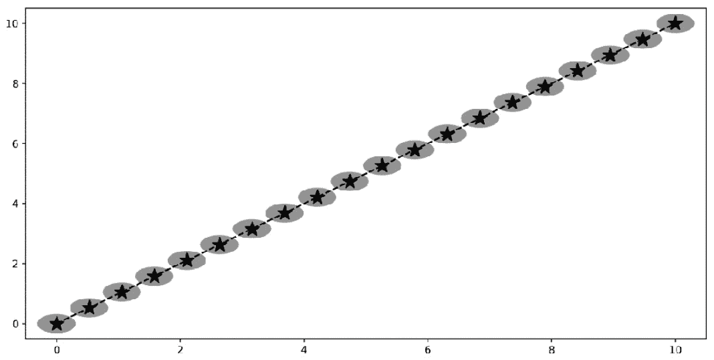

图 5.11–将 Matplotlib 图写入磁盘上的文件，并使用外部查看器打开

交易策略表现的导出图像经常用于 HTML 或电子邮件报告。对于打印，选择打印机的 DPI 作为图表的 DPI。

# 用 Matplotlib 绘制Pandas数据图

`pandas`库使用 Matplotlib 为系列和数据帧对象提供绘图功能。

让我们用包含模拟价格的连续值的`Cont`值和模拟价格变化的`Delta1`和`Delta2`值创建一个`pandas`数据框架。`Cat`值包含来自五种可能性的分类数据:

```
import pandas as pd
df = pd.DataFrame(index=range(1000), 
                  columns=['Cont value', 'Delta1 value', 
                           'Delta2 value', 'Cat value'])
df['Cont value'] = np.random.randn(1000).cumsum()
df['Delta1 value'] = np.random.randn(1000)
df['Delta2 value'] = np.random.randn(1000)
df['Cat value'] = np.random.permutation(['Very high',
                                         'High', 'Medium',
                                         'Low', 
                                         'Very Low']*200)
df['Delta1 discrete'] = pd.cut(df['Delta1 value'], 
                               labels=[-2, -1, 0, 1, 2], 
                               bins=5).astype(np.int64)
df['Delta2 discrete'] = pd.cut(df['Delta2 value'], 
                               labels=[-2, -1, 0, 1, 2], 
                               bins=5).astype(np.int64)
df
```

这个产生了下面的数据帧:

```
    Cont value  Delta1 val  Delta2 val  Cat value  Delta1 discrete  Delta2 discrete
0   -1.429618    0.595897   -0.552871   Very high    1    0
1   -0.710593    1.626343    1.123142      Medium    1    1
...       ...         ...         ...       ...    ...  ...
998 -4.928133   -0.426593   -0.141742   Very high    0    0
999 -5.947680    -0.183414  -0.358367      Medium    0    0
1000 rows × 6 columns
```

让我们探索如何可视化这个数据框架的不同方法。

## 创建数据帧列的折线图

我们可以使用带有`kind=`参数的`pandas.DataFrame.plot(...)`方法在线图中绘制`'Cont value'`:

```
df.plot(y='Cont value', kind='line', color='black', 
        linestyle='-', figsize=(12, 6))
```

该命令生成以下图表:


图 5.12-使用Pandas生成的线图。DataFrame.plot(…)方法

折线图通常用于显示时间序列。

## 创建数据帧列的条形图

可以使用`pandas.DataFrame.plot(...)`方法和`kind='bar'`参数来构建条形图。

让我们首先按`'Cat value'`值对数据帧进行分组，然后在条形图中绘制`Delta1 discrete`值计数:

```
df.groupby('Cat value')['Delta1 discrete']\
.value_counts().plot(kind='bar', color='darkgray',
                     title='Occurrence by (Cat,Delta1)', 
                     figsize=(12, 6))
```

这将生成以下图表，显示`(Cat value, Delta1 discrete)`值对的频率:


图 5.13–显示(Cat 值，Delta1 离散)值对频率的垂直条形图

`kind='barh'`参数构建一个水平条形图而不是垂直条形图:

```
df.groupby('Delta2 discrete')['Cat value'].value_counts()\
.plot(kind='barh', color='darkgray', 
      title='Occurrence by (Delta2,Cat)', 
      figsize=(12, 12))
```

输出如下所示:


图 5.14–显示(Delta2 离散，猫值)对频率的水平条形图

条形图最适合用来比较分类值的大小。

## 创建数据帧列的直方图和密度图

`pandas.DataFrame.plot(…)`方法中的`kind='hist'`参数构建直方图。

让我们创建一个`Delta1 discrete`值的直方图:

```
df['Delta1 discrete'].plot(kind='hist', color='darkgray', 
                           figsize=(12, 6), label='Delta1')
plt.legend()
```

生成的直方图如下所示:


图 5.15–delta 1 离散频率直方图

我们可以通过指定`kind='kde'`参数建立一个**概率密度函数** ( **PDF** )，这个使用`Delta2 discrete`值的**核密度估计** ( **KDE** )生成一个 PDF:

```
df['Delta2 discrete'].plot(kind='kde', color='black', 
                           figsize=(12, 6), 
                           label='Delta2 kde')
plt.legend()
```

输出如下所示:


图 5.16–显示δ2 离散值的 PDF 的 KDE 图

直方图和 pdf/KDEs 用于评估一些随机变量的概率分布。

## 创建两个数据帧列的散点图

使用`kind='scatter'`参数生成来自`pandas.DataFrame.plot(...)`方法的散点图。

以下代码块绘制了`Delta1`和`Delta2`值之间的散点图:

```
df.plot(kind='scatter', x='Delta1 value', y='Delta2 value',
        alpha=0.5, color='black', figsize=(8, 8))
```

输出如下:

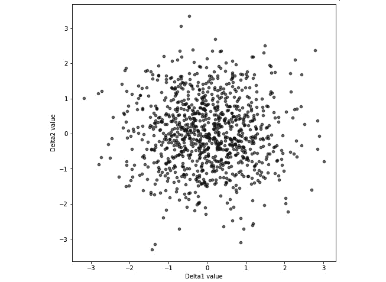

图 5.17–增量 1 值和增量 2 值字段的散点图

`pandas.plotting.scatter_matrix(...)`方法在`Delta1`和`Delta2`值之间的非对角线条目上建立散点图矩阵，在矩阵的对角线条目上建立直方图/KDE 图:

```
pd.plotting.scatter_matrix(df[['Delta1 value', 
                               'Delta2 value']], 
                           diagonal='kde', color='black', 
                           figsize=(8, 8))
```

输出如下所示:

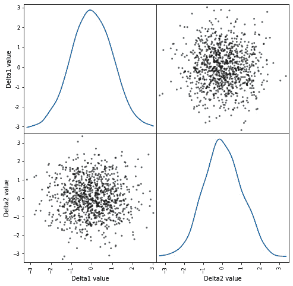

图 5.18–增量 1 值和增量 2 值字段的散点图

散点图/散点图矩阵用于观察两个变量之间的关系。

## 绘制时间序列数据

下面的代码块创建一个`pandas`数据帧，包含两个假设的交易工具`A`和`B`的价格。数据帧由代表从`1992`到`2012`的每日日期的`DateTimeIndex`对象索引:

```
dates = pd.date_range('1992-01-01', '2012-10-22')
time_series = pd.DataFrame(index=dates, columns=['A', 'B'])
time_series['A'] = \
np.random.randint(low=-100, high=101, 
                  size=len(dates)).cumsum() + 5000
time_series['B'] = \
np.random.randint(low=-75, high=76, 
                  size=len(dates)).cumsum() + 5000
time_series
```

产生的数据帧如下:

```
                 A      B
1992-01-01    5079    5042
1992-01-02    5088    5047
    ...        ...     ...
2012-10-21    6585    7209
2012-10-22    6634    7247
7601 rows × 2 columns
```

让我们用这个时间序列来表示典型的曲线类型。

### 在线图中绘制价格

首先，让我们用折线图绘制 20 年来`A`和`B`的每日价格:

```
time_series['A'].plot(kind='line', linestyle='—', 
                      color='black', figsize=(12, 6), 
                      label='A')
time_series['B'].plot(kind='line', linestyle='-.', 
                      color='darkgray', figsize=(12, 6), 
                      label='B')
plt.legend()
```

输出如下所示:

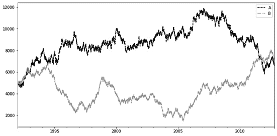

图 5.19-显示 20 年间假设工具 A 和 B 价格的图表

虽然大多数时间序列图是折线图，但其他图表类型提供了更多的见解。

### 绘制价格变化直方图

金融时间序列分析的下一站通常是检查一段时间内价格的变化。

下面的代码块使用`pandas.DataFrame.shift(...)`和`pandas.DataFrame.fillna(...)`方法生成六个新字段，表示 1 天、5 天和 20 天的价格变化。我们还删除了因移位而丢失数据的行，最终数据帧保存在`time_series_delta`数据帧中:

```
time_series['A_1_delta'] = \
time_series['A'].shift(-1) – time_series['A'].fillna(0)
time_series['B_1_delta'] = \
time_series['B'].shift(-1) – time_series['B'].fillna(0)
time_series['A_5_delta'] = \
time_series['A'].shift(-5) – time_series['A'].fillna(0)
time_series['B_5_delta'] = \
time_series['B'].shift(-5) – time_series['B'].fillna(0)
time_series['A_20_delta'] = \
time_series['A'].shift(-20) – time_series['A'].fillna(0)
time_series['B_20_delta'] = \
time_series['B'].shift(-20) – time_series['B'].fillna(0)
time_series_deltas = time_series[['A_1_delta', 'B_1_delta', 
                                  'A_5_delta', 'B_5_delta', 
                                  'A_20_delta', 
                                  'B_20_delta']].dropna()
time_series_deltas
```

数据帧包含以下内容:

```
           A_1_delta    B_1_delta    A_5_delta    B_5_delta    A_20_delta    B_20_delta
1992-01-01     9.0    5.0   -49.0   118.0   -249.0   -56.0
1992-01-02   -91.0   69.0   -84.0   123.0   -296.0   -92.0
...            ...    ...     ...     ...      ...     ...
2012-10-01    88.0   41.0   -40.0  -126.0   -148.0   -84.0
2012-10-02   -10.0  -44.0   -71.0  -172.0   -187.0   -87.0
7581 rows × 6 columns
```

我们可以根据本章所学，用下面的代码块绘制`A`的价格变化直方图:

```
time_series_delt's['A_20_de'ta'].plot(ki'd='h'st', 
                                      col'r='bl'ck', 
                                      alpha=0.5, 
                                      lab'l='A_20_de'ta', 
                                      figsize=(8,8))
time_series_delt's['A_5_de'ta'].plot(ki'd='h'st', 
                                     col'r='darkg'ay', 
                                     alpha=0.5, 
                                     lab'l='A_5_de'ta', 
                                     figsize=(8,8))
time_series_delt's['A_1_de'ta'].plot(ki'd='h'st', 
                                     col'r='lightg'ay', 
                                     alpha=0.5, 
                                     lab'l='A_1_de'ta', 
                                     figsize=(8,8))
plt.legend()
```

输出如下:


图 5.20-a1、a5 和 a20 三角洲的直方图

直方图用于评估基础数据的概率分布。这个特殊的直方图表明`A_20` delta 具有最大的可变性，这是有意义的，因为基础数据表现出一种强烈的趋势。

### 创建价格变化密度图

我们还可以使用 KDE PDF 绘制价格变化的密度。

以下代码块绘制了`B`中价格变化的密度函数:

```
time_series_deltas['B_20_delta'].plot(kind='kde', 
                                      linestyle='-', 
                                      linewidth=2, 
                                      color='black', 
                                      label='B_20_delta', 
                                      figsize=(8,8))
time_series_deltas['B_5_delta'].plot(kind='kde', 
                                     linestyle=':', 
                                     linewidth=2, 
                                     color='black', 
                                     label='B_5_delta', 
                                     figsize=(8,8))
time_series_deltas['B_1_delta'].plot(kind='kde', 
                                     linestyle='--', 
                                     linewidth=2, 
                                     color='black', 
                                     label='B_1_delta', 
                                     figsize=(8,8))
plt.legend()
```

输出如下:


图 5.21-1、5 和 20 天内 B 价格变化的 KDE 密度图

KDE 密度图与直方图非常相似。与由离散方框组成的直方图相反，kde 是连续的线。

### 按间隔创建盒状图

我们可以按不同的时间间隔对每日价格进行分组，例如年、季度、月或周，并使用箱线图显示这些价格的分布。

下面这段代码首先使用带有`freq='A'`的`pandas.Grouper`对象来指定年周期，然后对结果应用`pandas.DataFrame.groupby(…)`方法来构建一个`pandas.DataFrameGroupBy`对象。最后，我们调用`pandas.DataFrameGroupBy.boxplot(...)`方法来生成方框图。我们指定`rot=90`参数来旋转 *x* 轴刻度标签，使其更具可读性:

```
group_A = time_series[['A']].groupby(pd.Grouper(freq='A'))
group_A.boxplot(color='black', subplots=False, rot=90, 
                figsize=(12,12))
```

输出如下所示:

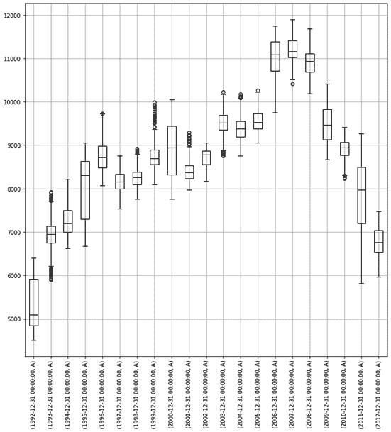

图 5.22–包含按年份分组的 A 价格的箱线图分布的图

带触须的盒状图用于通过相应的四分位数可视化数字数据组:

*   盒子的下限对应于下四分位数，而盒子的上限代表组的上四分位数。
*   框内的线显示间隔的中值。
*   方框下方的线以最低观测值结束。
*   方框上方的线以最高观测值结束。

### 创建滞后散点图

我们可以使用`pandas.plotting.scatter_matrix(…)`方法将不同价格变化变量之间的关系可视化:

```
pd.plotting.scatter_matrix(time_series[['A_1_delta', 
                                        'A_5_delta', 
                                        'A_20_delta', 
                                        'B_1_delta', 
                                        'B_5_delta', 
                                        'B_20_delta']], 
                           diagonal='kde', color='black', 
                           alpha=0.25, figsize=(12, 12))
```

结果显示了`(A_5_Delta and A_1_Delta)`、`(A_5_Delta and A_20_Delta)`、`(B_1_Delta and B_5_Delta)`和`(B_5_Delta and B_20_Delta)`变量对之间的一些线性关系:


图 5.23-A 和 B 价格增量变量的散点图

我们还可以使用具有不同`lag=`值的`pandas.plotting.lag_plot(...)`方法来指定不同的滞后水平，以生成`A`的价格和滞后价格之间的散点图:

```
fig, (ax1, ax2, ax3) = plt.subplots(3, figsize=(12, 12))
pd.plotting.lag_plot(time_series['A'], ax=ax1, lag=1, 
                     c='black', alpha=0.2)
pd.plotting.lag_plot(time_series['A'], ax=ax2, lag=7, 
                     c='black', alpha=0.2)
pd.plotting.lag_plot(time_series['A'], ax=ax3, lag=20, 
                     c='black', alpha=0.2)
```

这将为 1、7 和 20 天的滞后生成以下三幅图:


图 5.24-滞后值为 1、7 和 20 天的 A 价格的滞后图，显示了鞅的性质

对数图检查时间序列是否是随机的，没有任何趋势。对于一个随机时间序列，它的滞后图显示没有结构。前面的图显示了明显的线性趋势；也就是说，我们可能成功地用一个自回归模型对其建模。

### 创建自相关图

自相关图显示了与某一时间点的价格以及滞后一定时期的价格之间的关系。

我们可以使用`pandas.plotting.autocorrelation_plot(...)`方法在 *x* 轴上绘制滞后值，并在 *y* 轴上绘制价格与滞后指定值的价格之间的相关性:

```
fig, ax = plt.subplots(1, figsize=(12, 6))
pd.plotting.autocorrelation_plot(time_series['A'], ax=ax)
```

我们可以看到，随着滞后值的增加，自相关性慢慢变差:


图 5.25-显示滞后值与价格和滞后指定值的价格之间的自相关关系的曲线图

自相关图总结了时间序列的随机性。对于随机时间序列，所有滞后的所有自相关将接近于 0。对于非随机时间序列，至少有一个自相关明显非零。

# 总结

在本章中，我们学习了如何用 Matplotlib 创建视觉上吸引人的`pandas`数据帧图表。虽然我们可以计算许多数字统计，但图表通常能更快地提供更深刻的见解。您应该总是绘制尽可能多的不同图表，因为每个图表都提供不同的数据视图。

在下一章，我们将学习如何在 Python 中执行统计测试和估计统计模型。