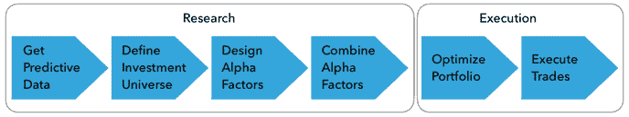
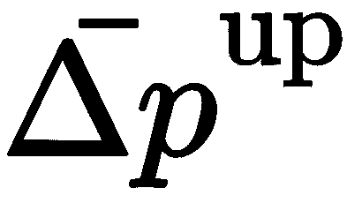
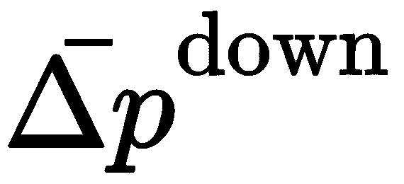
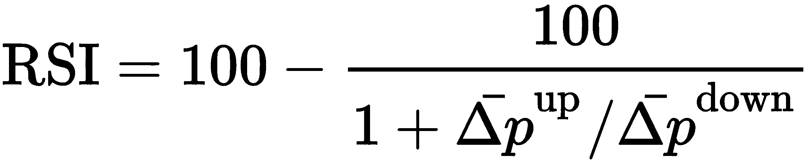
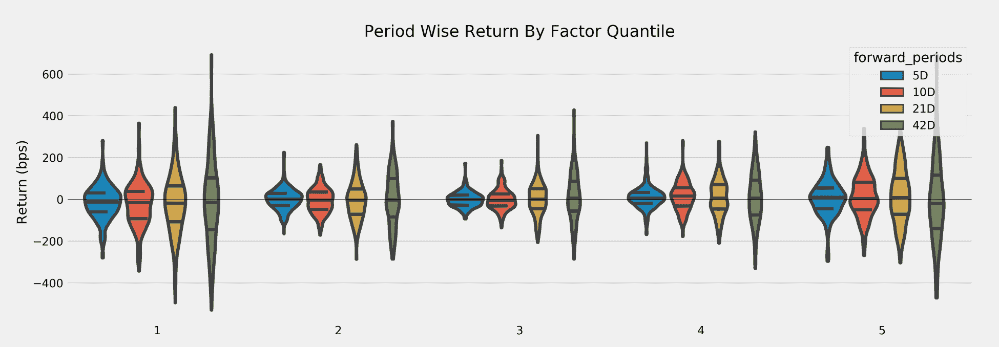
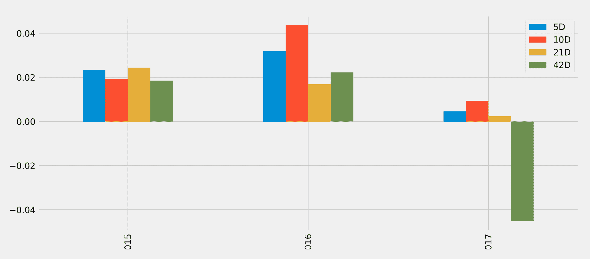

# 阿尔法因子研究

算法交易策略由指示何时买入或卖出资产以产生相对于基准的正回报的信号驱动。资产回报中未被基准敞口解释的部分被称为**阿尔法**，因此这些信号也被称为**阿尔法因子**。

阿尔法因子旨在根据可用的市场、基本面或替代数据预测投资领域中资产的价格变动。因子可以组合一个或几个输入变量，但每次策略评估该因子时，都会为每个资产假定一个值。交易决策通常依赖于各种资产的相对价值。交易策略通常基于多个因素发出的信号，我们将看到**机器学习** ( **ML** )模型特别适合有效地整合各种信号，以做出更准确的预测。

阿尔法因子的设计、评估和组合是算法交易策略工作流程研究阶段的关键步骤，如下图所示。我们将在本[第四章](05.html)、*战略评估*中重点介绍研究阶段，在下一章重点介绍执行阶段。这本书的剩余部分将集中于使用 ML 来发现和组合阿尔法因子。看一下下图:



本章将使用一个简单的均值反转因子来介绍用 Python 编写的算法交易模拟器`zipline`，它有助于测试给定投资领域的阿尔法因子。在下一章中，当我们在投资组合背景下回溯测试交易策略时，我们也将使用`zipline`。接下来，我们将讨论评估阿尔法因子预测性能的关键指标，包括信息系数和信息比率，这导致了主动管理的基本规律。

特别是，本章将讨论以下主题:

*   如何描述、证明和衡量关键类型的阿尔法因素
*   如何使用金融特征工程创建阿尔法因子
*   如何离线使用`zipline`测试单个阿尔法因子
*   如何在 Quantopian 上使用`zipline`来组合阿尔法因子并识别更复杂的信号
*   **信息系数** ( **IC** )如何衡量阿尔法因子的预测性能
*   如何使用`alphalens`评估预测绩效和营业额

# 工程阿尔法因子

阿尔法因素是包含预测信号的市场、基本面和替代数据的转换。它们旨在捕捉推动资产回报的风险。一组因素描述了基本的经济变量，如增长、通胀、波动性、生产率和人口风险。另一套包括可交易的投资风格，如市场投资组合、价值增长投资和动量投资。

还有一些因素可以解释基于金融市场的经济或制度环境的价格变动，或者投资者行为，包括这种行为的已知偏差。因素背后的经济理论可以是理性的，即因素在长期内有高回报，以补偿它们在困难时期的低回报，或者是行为的，即因素风险溢价来自代理人可能有偏见的或不完全理性的行为，而代理人没有被套利。

人们不断寻找和发现新的因素，以更好地捕捉已知的或反映新的回报驱动因素。管理着近 2000 亿美元资产的 Research Affiliates 的联合创始人杰森？许(Jason Hsu)确定了 2015 年前在知名期刊上发表的约 250 个因子，并估计这一数字可能每年增加 40 个因子。为了避免错误的发现，并确保一个因素提供一致的结果，它应该有一个有意义的经济直觉，使它似乎可以反映市场会补偿的风险。

数据转换包括简单的算术运算，如变量随时间的绝对或相对变化、数据系列之间的比率或时间窗口内的聚合，如简单或指数移动平均。它们还包括从价格模式的技术分析中得出的计算结果，如需求与供给的相对强度指数，以及许多从证券基本面分析中熟悉的指标。

# 重要因素类别

在一个理想化的世界中，风险因素的类别应该相互独立(正交)，产生正的风险溢价，并形成一个涵盖所有风险维度的完整集合，解释给定类别中资产的系统风险。实际上，这些要求只能大致满足。我们将在第 12 章、*无监督学习*中阐述如何利用无监督学习，特别是主成分和独立成分分析，得出合成的、数据驱动的风险因素。

我们将回顾源自市场、基本面和替代数据的因素的关键类别，以及用于捕捉它们的典型指标。我们还将展示如何使用内置因子为 Quantopian 平台上测试的算法实现这些因子，使用`numpy`和`pandas`进行自定义计算，或者使用`talib`库进行技术分析。

# 势头和情绪因素

动量投资遵循一句格言:趋势是你的朋友，否则让你的赢家跑。动量风险因素旨在做多表现良好的资产，同时做空在一定时期内表现不佳的资产。

依赖这一因素的策略的前提是资产价格呈现出一种趋势，反映在正的序列相关性中。这种价格势头将挑战有效市场假说，该假说认为仅凭过去的价格回报无法预测未来的表现。尽管理论上有相反的论点，价格动量策略在所有资产类别中都产生了正回报，并且是许多交易策略的重要组成部分。

# 基本原理

动量效应的原因指向投资者行为、持续的供给和需求失衡、风险资产和经济之间的正反馈循环或市场微观结构。

行为原因反映了投资者以不同的速度处理新信息时，对市场消息反应不足和反应过度的偏见。在最初对新闻反应不足之后，投资者通常会推断过去的行为，创造价格动力。上世纪 90 年代末市场泡沫期间科技股的反弹是一个极端的例子。恐惧和贪婪的心理也促使投资者增加对盈利资产的投资，并继续出售亏损资产。

动量也可能有基本面驱动因素，比如风险资产和经济之间的正反馈循环。经济增长提振股票，由此产生的财富效应通过更高的支出反馈到经济中，再次刺激增长。与债券、外汇和大宗商品相比，价格和经济之间的正反馈通常会将股票和信贷的动力延伸到更长的时间范围，而负反馈会造成反转，需要更短的投资时间范围。造成这一势头的另一个原因可能是市场摩擦导致的持续供需失衡，例如，当商品生产需要大量时间来适应需求趋势时。石油产量可能会滞后于经济繁荣带来的需求增长多年，持续的供应短缺可能会引发并支撑价格上涨势头。

市场微观结构效应也可以创造与行为模式相关的价格动量，激励投资者购买产品并实施模仿其偏好的策略。例如，减少损失并让利润运行的交易智慧让投资者使用交易策略，如止损、**固定比例投资组合保险**(**)、动态 delta 对冲或基于期权的策略，如保护性看跌期权。这些策略创造了动力，因为它们意味着预先承诺在资产表现不佳时卖出，在表现优异时买入。类似地，风险平价策略(见下一章)倾向于买入表现良好的低波动性资产，卖出表现不佳的高波动性资产。使用这些策略对投资组合进行自动再平衡，往往会增强价格势头。**

 **# 关键指标

动量因子通常是通过识别趋势和模式从价格时间序列的变化中得出的。它们可以基于绝对或相对回报，通过比较资产的横截面或分析资产的时间序列，在传统资产类别内或跨传统资产类别，在不同的时间范围内构建。

下表列出了一些常见的说明性指标:

| **因子** | **描述** |
| **相对强度指示器** ( **RSI** ) | RSI 比较股票最近的价格变化，以确定股票是超买还是超卖。高 RSI(例如，高于 70)表明超买，低 RSI(例如，低于 30)表明超卖。它使用前几个交易日的平均价格变化，正价格变化和负价格变化来计算:
 |
| 价格势头 | 该因子计算给定的前几个交易日的总回报。在学术文献中，通常使用过去 12 个月，但排除最近一个月，因为在最近的价格变动中经常观察到短期反转效应，但更短的时期也已被广泛使用。 |
| 12 个月的价格趋势卷调整 | 经波动性因素调整的 12 个月价格动量将过去 12 个月的总回报除以这些回报的标准差，从而使总回报标准化。 |
| 价格加速上涨 | 价格加速计算趋势的梯度(根据波动性进行调整),使用较长和较短时期(例如一年零三个月的交易日)的每日价格的线性回归，并将斜率的变化作为价格加速的衡量标准进行比较。 |
| 52 周高点的百分比 | 该因子使用最近 52 周的最高价格和最近价格之间的百分比差值。 |

其他情绪指标包括:

| **因子** | **描述** |
| 收益预测很重要 | 该指标通过一致估计的数量对股票进行排名，作为分析师覆盖范围和信息不确定性的代理。更高的值是更可取的。 |
| 建议中的 n 个月变化 | 该因子根据前 N 个月一致建议的变化对股票进行排名，其中改进是可取的(不管它们是从强卖变为卖还是从买变为强买，等等)。 |
| 12 个月内已发行股份的变化 | 这一因素衡量一家公司在过去 12 个月内拆分调整后的股票数量的变化，其中负变化意味着股票回购，这是可取的，因为它表明管理层认为股票相对于其内在价值和未来价值而言是便宜的。 |
| 目标价的 6 个月变化 | 该指标跟踪平均分析师目标价的 6 个月变化，较高的正变化自然更受欢迎。 |
| 净收益修正 | 此系数表示上调和下调收入估计值之间的差异，以占总修正数的百分比表示。 |
| 已发行股份的短期权益 | 这一指标是目前卖空的已发行股票的百分比，即投资者借入股票并在随后某一天需要回购，同时推测其价格将会下跌。因此，高水平的空头兴趣表明负面情绪，预计预示着未来的表现不佳。 |

# 价值因素

价格相对于其基本价值较低的股票往往会带来超过资本化加权基准的回报。价值因素反映了这种相关性，旨在提供信号，以购买低估的资产，即那些相对便宜的资产，并出售那些高估和昂贵的资产。因此，任何价值策略的核心都是一个估值模型，该模型可以估计或代表资产的公允价值或基本价值。公允价值可以定义为绝对价格水平、相对于其他资产的价差或资产交易的范围(例如，两个标准差)。

价值策略依赖于价格向资产公允价值的均值回归。他们假设价格只是由于行为效应(如过度反应或羊群行为)或流动性效应(如临时市场影响或长期供求摩擦)而暂时偏离公允价值。由于价值因素依赖于均值回归，它们通常表现出与动量因素相反的性质。对于股票来说，与价值股相反的是成长股，由于增长预期而具有高估值。

价值因素支持广泛的系统策略，包括基本面和市场估值、统计套利和交叉资产相对价值。它们通常作为长/短投资组合实施，不暴露于其他传统或替代风险因素。

基本面价值策略从依赖于目标资产类别的经济和基本面指标中得出公允的资产价值。例如，在固定收入、货币和商品中，指标包括资本账户余额、经济活动、通货膨胀或资金流动的水平和变化。在股票和企业信贷中，价值因素可以追溯到上世纪 30 年代格雷厄姆和多德的证券分析，自那以后，沃伦巴菲特(Warren Buffet)让这一分析变得著名。股权价值法将股票价格与基本指标进行比较，如账面价值、顶线销售额、底线收益或各种现金流指标。

市值策略使用统计或机器学习模型来识别由于流动性供应效率低下而导致的错误定价。统计套利和指数套利是捕捉短期市场影响逆转的突出例子(我们将在下一章讨论配对交易)。从长期来看，市值交易还会利用股票和大宗商品的季节性效应。

跨资产相对价值策略关注不同资产的相对错误定价。例如，可转换债券套利交易涉及一家公司的股票、信用和波动性之间的相对价值。相对价值还包括信用和股票波动之间的交易，使用信用信号交易股票或商品和股票之间的相对价值交易。

# 基本原理

价值效应的存在既有理性解释，也有行为解释。我们将从大量的研究中引用一些突出的例子，并在 GitHub 资源库中列出进一步的参考。

在理性、有效的市场观点中，价值溢价补偿了更高的真实或感知风险。研究人员提出的证据表明，与更精简、更灵活的成长型公司相比，价值型公司适应不利经济环境的灵活性更低，或者价值型股票的风险与高财务杠杆和更不确定的未来收益有关。价值型和小盘股投资组合也比增长型和大盘股投资组合对宏观冲击更加敏感。

从行为角度来看，价值溢价可以用损失厌恶和心理会计偏差来解释。投资者可能不太担心近期表现强劲的资产的损失，因为之前的收益提供了缓冲。这种损失厌恶偏见诱使投资者认为股票的风险比以前低，并以较低的利率贴现其未来现金流。相反，近期表现不佳可能会导致投资者提高资产的贴现率。不同的回报预期导致价值溢价，因为相对于基本面具有高市盈率的成长型股票在过去表现良好，但展望未来，投资者将要求较低的平均回报，因为他们对较低风险的偏见，而价值型股票则相反。

# 关键指标

有大量的估价代理是根据基本面数据计算出来的。这些因素可以组合起来作为机器学习估价模型的输入，以预测价格。在接下来的章节中，我们将举例说明这些因素在实践中是如何运用的:

| **因子** | **描述** |
| 现金流收益率 | 该比率将每股经营现金流除以股价。较高的比率意味着股东获得更好的现金回报(如果使用股息或股票回购支付，或者有利可图地再投资于企业)。 |
| 自由现金流收益率 | 该比率将每股自由现金流除以股价，自由现金流反映了扣除必要费用和投资后可供分配的现金量。更高且不断增长的自由现金流收益率通常被视为表现优异的信号。 |
| **投入资本的现金流回报** ( **CFROIC** ) | CFROIC 衡量公司的现金流盈利能力。它将经营现金流除以投资资本，投资资本定义为总债务加净资产。更高的回报意味着企业有更多的现金投入一定数量的资本，为股东创造更多的价值。 |
| 现金流量对总资产的比率 | 该比率将运营现金流除以总资产，并表明一家公司相对于其资产可以产生多少现金，其中较高的比率更好地类似于 CFROIC。 |
| 自由现金流对企业价值 | 该比率衡量公司相对于其企业价值产生的自由现金流，企业价值衡量为股权和债务的组合价值。 |
| EBITDA 对企业价值 | 该比率衡量公司的 EBITDA(利息、税项、折旧和摊销前的收益)，是现金流相对于其企业价值的代理。 |
| 收益率(1 年后) | 该比率将过去 12 个月的收益总和除以最近的市场(收盘)价格。 |
| 收益率(1 年后) | 这个比率不是实际的历史收益，而是将一个滚动的 12 个月的预期分析师收益除以最后的价格，其中的预期是预测的(可能是加权的)平均值。 |
| PEG 比率 | 市盈率(PEG)比率将股票的市盈率(P/E)除以给定时期的收益增长率。该比率通过公司的收益增长来调整为一美元收益所支付的价格(以市盈率衡量)。 |
| 相对于行业的 1 年预期市盈率 | 相对于相应行业市盈率的预测市盈率。它旨在通过考虑估值中的行业差异来减轻通用市盈率的行业偏差。 |
| 销售收益 | 该比率衡量股票相对于其创收能力的估值。在其他条件相同的情况下，历史销售价格比较高的股票有望跑赢大盘。 |
| 销售收益 FY1 | 远期销售价格比使用分析师销售预测，结合(加权)平均值。 |
| 账面价值收益率 | 该比率将历史账面价值除以股价。 |
| 股息收益率 | 当前年化股息除以最后收盘价。贴现现金流估值假设公司的市场价值等于其未来现金流的现值。 |

# 波动性和规模因素

低波动性因子捕捉波动性、贝塔或特质风险低于平均水平的股票的超额回报。市值较大的股票往往具有较低的波动性，因此传统的*规模*因素通常与最近的波动性因素相结合。

低波动性异常是一个与金融基本原则相悖的经验难题。**资本资产定价模型** ( **资本资产定价模型**)和其他资产定价模型宣称，较高的风险应该获得较高的回报，但在许多市场和较长时期内，情况正好相反，风险较低的资产表现优于风险较高的同行。

# 基本原理

低波动异常与有效市场假说和 CAPM 假设相矛盾。相反，已经提出了几种行为解释。

彩票效应建立在经验证据的基础上，即个人接受类似彩票的赌注，预期损失很小，但可能会赢，即使这种大赢的概率相当低。如果投资者认为价格低、波动大的股票的风险回报类似于彩票，那么这可能是一个有吸引力的赌注。因此，投资者可能会因偏好不同而对高波动性股票支付过高，对低波动性股票支付过低。代表性偏差表明，投资者将少数广为人知的波动性股票的成功推广到所有波动性股票，而忽略了这些股票的投机性质。

投资者也可能对他们预测未来的能力过于自信，对于结果更不确定的波动股票，他们的意见分歧更大。由于做多(即持有一项资产)比做空(即持有一项资产)更容易表达积极观点，乐观者的数量可能会超过悲观者，并不断推高波动性股票的价格，导致回报率下降。

此外，投资者在牛市和危机期间的行为有所不同。在牛市期间，贝塔系数的离差要低得多，因此低波动性股票的表现不会太差，而在危机期间，投资者会寻找或持有低波动性股票，贝塔系数的离差会增加。因此，从长期来看，波动性较低的资产和投资组合表现更好。

# 关键指标

用于识别低波动性股票的指标涵盖了广泛的范围，一端是已实现的波动性(标准差)，另一端是预测(隐含)波动性和相关性。一些人将低波动性视为低贝塔。对于不同的指标，支持波动异常的证据似乎是强有力的。

# 质量因素

质量因素旨在捕捉高利润、运营高效、安全、稳定和管理良好(简而言之，高质量)的公司相对于市场的超额回报。市场似乎还会奖励相对收益确定性，惩罚收益波动较大的股票。依赖基本面分析的选股者长期以来一直主张投资组合向高质量企业倾斜，但这在量化投资中是一个相对较新的现象。鉴于质量的主观性质，主要的挑战是如何使用定量指标一致和客观地定义质量因素。

基于独立质量因素的策略往往以反周期的方式表现，因为投资者支付溢价以最小化下行风险并推高估值。因此，在多因素战略中，质量因素通常与其他风险因素相结合，最常见的是与价值相结合，以合理的价格生产质量战略。多空质量因素往往具有负的市场 beta，因为它们是波动性较低的多空质量股票，而做空波动性较大的低质量股票。因此，质量因素通常与低波动性和动量因素正相关，而与价值和广泛的市场敞口负相关。

# 基本原理

质量因素可能是表现优异的信号，因为持续的盈利能力、现金流的稳定增长、谨慎的杠杆作用、资本市场融资的低需求或低金融风险等优越的基本面支撑了对股票的需求，并在长期内支撑了此类公司的价格。从公司财务的角度来看，优质公司通常会谨慎管理其资本，并降低过度杠杆化或过度资本化的风险。

一个行为解释表明，投资者对质量信息反应不足，类似于投资者追逐赢家、卖出输家的动量理论。优质溢价的另一个理由是类似成长型股票的羊群效应。基金经理可能会发现，购买一家基本面强劲的公司比购买一只波动性更大(风险更高)的价值股更容易找到理由，即使该公司的股价正变得越来越高。

# 关键指标

质量因素依赖于从资产负债表和损益表中计算出来的指标，这些指标表明反映在高利润或现金流利润率、运营效率、财务实力和更广泛的竞争力中的盈利能力，因为它意味着长期保持盈利能力的能力。

因此，质量是使用总盈利能力(最近被添加到 Fama-French 因子模型中，参见 [第 7 章](07.html)、*线性模型*)、投资资本回报率、低盈利波动性或各种盈利能力、盈利质量和杠杆指标的组合来衡量的，下表列出了一些选项。

盈余管理主要通过操纵应计项目来实现。因此，应计项目的规模通常被用作盈余质量的一个指标:相对于资产的总应计项目越高，盈余质量越低。然而，这一点并不明确，因为应计项目可以反映盈余操纵，也可以反映对未来业务增长的会计估计:

| **因子** | **描述** |
| 资产周转率 | 这一因素衡量公司利用其资产(需要资本)产生收入的效率，计算方法是将销售额除以总资产；营业额越高越好。 |
| 资产周转率 12 个月变化 | 该因素衡量过去一年中管理层利用资产创造收入的效率变化。效率提升水平最高的股票通常有望跑赢大盘。 |
| 流动比率 | 流动比率是衡量公司支付短期债务能力的流动性指标。它比较公司的流动资产和流动负债，从质量角度来看，流动比率越高越好。 |
| 利息保障倍数 | 这一因素衡量公司支付债务利息的难易程度。计算方法是将公司的 EBIT(息税前利润)除以利息支出。更高的比率是理想的。 |
| 杠杆作用 | 一个公司的负债明显多于权益，被认为是高杠杆的。负债权益比通常与前景成反比，杠杆率越低越好。 |
| 支付比率 | 以股息形式支付给股东的收益金额。派息率较高的股票被分配到前十分之一，而派息率较低的股票被分配到后十分之一。 |
| **净资产收益率** ( **净资产收益率**) | 根据股票的历史净资产收益率对股票进行排名，并将净资产收益率最高的股票分配到前十名。 |

# 如何将数据转换成因子

基于对关键因素类别、其基本原理和流行指标的概念性理解，一项关键任务是确定可能更好地捕捉先前列出的回报驱动因素所体现的风险的新因素，或找到新的因素。在这两种情况下，将创新因素的性能与已知因素的性能进行比较，以确定增量信号增益是非常重要的。

# 有用的熊猫和数字方法

NumPy 和 pandas 是自定义因子计算的关键工具。数据目录中的笔记本`00-data-prep.ipynb`包含了如何创建各种因子的例子。笔记本使用由 GitHub repo 根目录下的 data 文件夹中的`get_data.py`脚本生成的数据，并以`HDF5`格式存储，以便更快地访问。关于熊猫`DataFrames`的`parquet`、`HDF5`和`csv`存储格式的对比，请参见 GitHub repo 上[第二章](02.html)、*市场和基本面数据*目录中的笔记本`storage_benchmarks.ipynb`。

以下说明了从原始股票数据中计算选定因子的一些关键步骤。为了节省空间，我们在这里省略了更多的细节和可视化，请查看笔记本。

# 加载数据

我们加载覆盖美国股票市场 2000-18 年的 Quandl 股票价格数据集，使用`pd.IndexSlice`对`pd.MultiIndex`执行切片操作，选择调整后的收盘价并取消透视列，以将数据帧转换为宽格式，其中分笔成交点位于列中，时间戳位于行中:

```
idx = pd.IndexSlice
with pd.HDFStore('../../data/assets.h5') as store:
    prices = store['quandl/wiki/prices'].loc[idx['2000':'2018', :], 
                   'adj_close'].unstack('ticker')

prices.info()
DatetimeIndex: 4706 entries, 2000-01-03 to 2018-03-27
Columns: 3199 entries, A to ZUMZ
```

# 从每日频率重新采样到每月频率

为了减少培训时间并试验更长时间范围的策略，我们使用可用的调整后收盘价将每日业务数据转换为月末频率:

```
monthly_prices = prices.resample('M').last()
```

# 计算动量因子

为了捕捉时间序列动态，例如，捕捉动量模式，我们使用`pct_change(n_periods)`计算历史回报，即由`lags`标识的不同月期的回报。然后，我们使用`.stack()`将宽结果转换回长格式，使用`.pipe()`将`.clip()`方法应用到结果`DataFrame`，并在[1%，99%]级别上 winsorize 返回；也就是说，我们将异常值限制在这些百分点。

最后，我们使用几何平均来标准化回报。在使用`.swaplevel()`改变`MultiIndex`级别的顺序后，我们获得了从 1 个月到 12 个月的 6 个期间的复合月回报率:

```
outlier_cutoff = 0.01
data = pd.DataFrame()
lags = [1, 2, 3, 6, 9, 12]
for lag in lags:
    data[f'return_{lag}m'] = (monthly_prices
                           .pct_change(lag)
                           .stack()
                           .pipe(lambda x: x.clip(lower=x.quantile(outlier_cutoff),
                        upper=x.quantile(1-outlier_cutoff)))
                           .add(1)
                           .pow(1/lag)
                           .sub(1)
                           )
data = data.swaplevel().dropna()
data.info()

MultiIndex: 521806 entries, (A, 2001-01-31 00:00:00) to (ZUMZ, 2018-03-
                             31 00:00:00)
Data columns (total 6 columns):
return_1m 521806 non-null float64
return_2m 521806 non-null float64
return_3m 521806 non-null float64
return_6m 521806 non-null float64
return_9m 521806 non-null float64
return_12m 521806 non-null float6
```

我们可以使用这些结果来计算动量因子，动量因子基于较长时期的回报和最近的月回报之间的差异，以及`3`和`12`月回报之间的差异，如下所示:

```
for lag in [2,3,6,9,12]:
    data[f'momentum_{lag}'] = data[f'return_{lag}m'].sub(data.return_1m)
data[f'momentum_3_12'] = data[f'return_12m'].sub(data.return_3m)
```

# 使用滞后回报和不同的持有期

为了使用滞后值作为输入变量或与当前观察值相关联的特征，我们使用`.shift()`方法将历史回报移动到当前时段:

```
for t in range(1, 7):
    data[f'return_1m_t-{t}'] = data.groupby(level='ticker').return_1m.shift(t)
```

类似地，为了计算不同持有期的回报，我们使用之前计算的标准化期间回报，并将它们移回，以使它们与当前的财务特征保持一致:

```
for t in [1,2,3,6,12]:
    data[f'target_{t}m'] = data.groupby(level='ticker')[f'return_{t}m'].shift(-t)
```

# 计算系数β

我们将在第八章、*时间序列模型*中引入 Fama—French 数据，使用线性回归来估计资产对常见风险因素的暴露程度。五个 Fama-French 因素，即市场风险、规模、价值、运营盈利能力和投资，已被经验证明可以解释资产回报，并通常用于评估投资组合的风险/回报状况。因此，在旨在预测未来回报的模型中，将过去的因素风险作为财务特征包括在内是很自然的。

我们可以使用 pandas-datareader 访问历史因子回报，并使用`pyfinance`库中的`PandasRollingOLS`滚动线性回归功能估计历史风险，如下所示:

```
factors = ['Mkt-RF', 'SMB', 'HML', 'RMW', 'CMA']
factor_data = web.DataReader('F-F_Research_Data_5_Factors_2x3', 
              'famafrench', start='2000')[0].drop('RF', axis=1)
factor_data.index = factor_data.index.to_timestamp()
factor_data = factor_data.resample('M').last().div(100)
factor_data.index.name = 'date'
factor_data = factor_data.join(data['return_1m']).sort_index()

T = 24
betas = (factor_data
         .groupby(level='ticker', group_keys=False)
         .apply(lambda x: PandasRollingOLS(window=min(T, x.shape[0]-1), y=x.return_1m, x=x.drop('return_1m', axis=1)).beta))
```

我们将在[第 7 章](07.html)、*线性模型*中更详细地探讨 Fama-French 因子模型和线性回归。请参阅笔记本以获取更多示例。

# 内在的量子因素

随附的笔记本`factor_library.ipynb`包含许多示例因子，这些因子要么是由 Quantopian 平台提供的，要么是使用 Jupyter 笔记本的研究 API 从可用数据源计算的。

有一些内置的因素可以与定量 Python 库结合使用，特别是`numpy`和`pandas`，以便从广泛的相关数据源(如美国股票价格、晨星基本面和投资者情绪)中导出更复杂的因素。

例如，作为晨星基本面数据集的一部分，可以获得价格销售比，即前面介绍的销售收益率的倒数。它可以作为管道的一部分，在我们介绍`zipline`库时会进一步描述。

# TA-Lib

TA-Lib 库包括许多技术因素。Python 实现可用于本地使用，例如使用`zipline`和`alphalens`，它也可用于 Quantopian 平台。该笔记本还使用 TA-Lib 说明了几个可用的技术指标。

# 寻找信号——如何使用滑索

历史上，阿尔法因子使用单一的输入和简单的试探法，阈值或分位截断点来识别买入或卖出信号。ML 已被证明在从更多样化和更大的输入数据集中提取信号方面相当有效，包括基于历史模式分析的其他 alpha 因子。因此，今天的算法交易策略利用了大量的阿尔法信号，其中许多信号单独来看可能很弱，但当通过 ML 算法与其他模型驱动或传统因素结合时，可以产生可靠的预测。

开源`zipline`库是一个事件驱动的回溯测试系统，由众包量化投资基金 Quantopian([https://www.quantopian.com/](https://www.quantopian.com/))在生产中维护和使用，以促进算法开发和现场交易。它使算法对交易事件的反应自动化，并为其提供当前和历史时间点数据，从而避免前瞻偏差。

您可以将它与数据包一起离线使用，以研究和评估阿尔法因子。在 Quantopian 平台上使用它时，您将获得更广泛的基础和替代数据。我们还将在这一章演示量子研究环境，在下一章演示回溯测试 IDE。这一节的代码在本章的 GitHub repo 文件夹的`01_factor_research_evaluation`子目录中。

安装后，在执行第一个算法之前，您需要接收一个数据包，默认情况下，该数据包由 Quandl 社区维护的 3000 家美国上市公司的股价、股息和股票分割数据组成。您需要一个 Quandl API 密钥来运行下面的代码，该代码将数据存储在您的主文件夹中的`~/.zipline/data/<bundle>`下:

```
$ QUANDL_API_KEY=<yourkey> zipline ingest [-b <bundle>]
```

# 架构–事件驱动的交易模拟

一个`zipline`算法将在初始设置后运行一段时间，并在特定事件发生时执行其交易逻辑。这些事件由交易频率驱动，也可以由算法调度，并导致`zipline`调用某些方法。该算法通过`context`字典维护状态，并通过包含**时间点** ( **PIT** )当前和历史数据的`data`变量接收可操作信息。该算法返回一个包含投资组合绩效指标(如果有任何交易)的`DataFrame`，以及可用于记录(例如)因子值的用户定义指标。

您可以在 Jupyter 笔记本的命令行中，通过使用`run_algorithm()`函数来执行算法。

一个算法需要一个`initialize()`方法，在模拟开始时调用一次。该方法可用于向所有其他算法方法可用的`context`字典添加属性，或注册执行更复杂数据处理的`pipelines`，例如基于阿尔法因子的逻辑过滤证券。

算法通过可选的方法执行，这些方法或者由`zipline`自动安排，或者以用户定义的时间间隔执行。方法`before_trading_start()`在每天开市前被调用，主要用于识别算法当天可能交易的一组证券。方法`handle_data()`每分钟都被调用。

`Pipeline API`便于从历史数据中定义和计算证券横截面的阿尔法因子。流水线定义计算，该计算在具有一组证券的 PIT 值的表中产生列。它需要用`initialize()`方法注册，然后可以按照自动或定制的时间表执行。该库提供了许多内置计算，如移动平均线或布林线，可用于快速计算标准因子，但也允许创建自定义因子，我们将在接下来进行说明。

最重要的是，`Pipeline API`将阿尔法因子研究模块化，因为它将阿尔法因子计算与算法的其余部分分离，包括交易订单的安排和执行以及投资组合持有量、价值等的簿记。

# 来自市场数据的单一阿尔法因子

我们首先要说明离线环境中的`zipline`阿尔法因子研究工作流程。特别是，我们将开发和测试一个简单的均值回归因子，该因子用于衡量最近的表现偏离历史平均水平的程度。短期反转是一种常见的策略，它利用了股票价格上涨可能意味着的弱预测模式，即在不到一分钟到一个月的时间内反转。详见笔记本`single_factor_zipline.ipynby`。

为此，因子计算最后一个月回报相对于过去一年的滚动月回报的 z 分数。在这一点上，我们不会下任何订单来简单地说明一个`CustomFactor`的实现，并在模拟过程中记录结果。

经过一些基本设置后，`MeanReversion`子类化了`CustomFactor`并定义了一个`compute()`方法。它在一个也是默认的一年窗口内创建了月回报的默认输入，因此在给定的一天，Quandl 数据集中的每个证券的`monthly_return`变量将有 252 行和一列。

`compute_factors()`方法创建一个`MeanReversion`因子实例，并创建`long`、`short`和`ranking`管道列。前两个包含可用于下订单的布尔值，后一个反映了评估整体因素表现的整体排名。此外，它使用内置的`AverageDollarVolume`因子将计算限制在更具流动性的股票上:

```
from zipline.api import attach_pipeline, pipeline_output, record
from zipline.pipeline import Pipeline, CustomFactor
from zipline.pipeline.factors import Returns, AverageDollarVolume
from zipline import run_algorithm

MONTH, YEAR = 21, 252
N_LONGS = N_SHORTS = 25
VOL_SCREEN = 1000

class MeanReversion(CustomFactor):
    """Compute ratio of latest monthly return to 12m average,
       normalized by std dev of monthly returns"""
    inputs = [Returns(window_length=MONTH)]
    window_length = YEAR

    def compute(self, today, assets, out, monthly_returns):
        df = pd.DataFrame(monthly_returns)
        out[:] = df.iloc[-1].sub(df.mean()).div(df.std())

def compute_factors():
    """Create factor pipeline incl. mean reversion,
        filtered by 30d Dollar Volume; capture factor ranks"""
    mean_reversion = MeanReversion()
    dollar_volume = AverageDollarVolume(window_length=30)
    return Pipeline(columns={'longs'  : mean_reversion.bottom(N_LONGS),
                             'shorts' : mean_reversion.top(N_SHORTS),
                             'ranking': 
                          mean_reversion.rank(ascending=False)},
                          screen=dollar_volume.top(VOL_SCREEN))
```

结果将允许我们发出长订单和短订单。我们将在下一章看到如何通过选择一个再平衡期和在新信号到来时调整投资组合来建立投资组合。

`initialize()`方法注册`compute_factors()`管道，`before_trading_start()`方法确保管道每天运行。`record()`函数将管道的`ranking`列以及当前资产价格添加到由`run_algorithm()`函数返回的性能`DataFrame`中:

```
def initialize(context):
    """Setup: register pipeline, schedule rebalancing,
        and set trading params"""
    attach_pipeline(compute_factors(), 'factor_pipeline')

def before_trading_start(context, data):
    """Run factor pipeline"""
    context.factor_data = pipeline_output('factor_pipeline')
    record(factor_data=context.factor_data.ranking)
    assets = context.factor_data.index
    record(prices=data.current(assets, 'price'))
```

最后，用 UTC 术语定义开始和结束`Timestamp`对象，设置一个资本基数，并通过引用关键执行方法来执行`run_algorithm()`。`performance`数据帧包含嵌套数据，例如，`prices`列由每个单元格的`pd.Series`组成。因此，以`pickle`格式存储时，后续数据访问更容易:

```
start, end = pd.Timestamp('2015-01-01', tz='UTC'), pd.Timestamp('2018-
             01-01', tz='UTC')
capital_base = 1e7

performance = run_algorithm(start=start,
                            end=end,
                            initialize=initialize,
                            before_trading_start=before_trading_start,
                            capital_base=capital_base)

performance.to_pickle('single_factor.pickle')
```

在下一节中，我们将使用存储在`performance`数据框架中的因子和定价数据来评估各种持有期的因子表现，但首先，我们将了解如何通过在 Quantopian 平台上组合来自一组不同数据源的多个 alpha 因子来创建更复杂的信号。

# 组合来自不同数据源的因素

Quantopian 研究环境是为预测阿尔法因子的快速测试而定制的。这个过程非常相似，因为它建立在`zipline`之上，但是提供了更丰富的数据源访问。下面的代码示例说明了如何不仅从前面的市场数据中，而且从基本面和替代数据中计算 alpha 因子。详见笔记本`multiple_factors_quantopian_research.ipynb`。

Quantopian 免费提供了数百个晨星基本面变量，还包含了`stocktwits`信号作为替代数据源的例子。还有自定义的领域定义，如`QTradableStocksUS`，它应用几个过滤器将回溯测试领域限制为在现实市场条件下可能可交易的股票:

```
from quantopian.research import run_pipeline
from quantopian.pipeline import Pipeline
from quantopian.pipeline.data.builtin import USEquityPricing
from quantopian.pipeline.data.morningstar import income_statement, 
     operation_ratios, balance_sheet
from quantopian.pipeline.data.psychsignal import stocktwits
from quantopian.pipeline.factors import CustomFactor, 
     SimpleMovingAverage, Returns
from quantopian.pipeline.filters import QTradableStocksUS
```

我们将使用一个定制的`AggregateFundamentals`类来使用最后报告的基本数据点。这旨在解决这样一个事实，即基本面是按季度报告的，Quantopian 目前不提供一种简单的方法来汇总历史数据，比如说在滚动基础上获得过去四个季度的总和:

```
class AggregateFundamentals(CustomFactor):
    def compute(self, today, assets, out, inputs):
        out[:] = inputs[0]
```

我们将再次使用前面代码中的自定义因子`MeanReversion`。我们还将使用`rank()`方法的`mask`参数为给定的宇宙定义计算其他几个因子:

```
def compute_factors():
    universe = QTradableStocksUS()

    profitability = (AggregateFundamentals(inputs=
                     [income_statement.gross_profit],
                                           window_length=YEAR) /
                     balance_sheet.total_assets.latest).rank(mask=universe)

    roic = operation_ratios.roic.latest.rank(mask=universe)
    ebitda_yield = (AggregateFundamentals(inputs=
                             [income_statement.ebitda],
                                          window_length=YEAR) /
                    USEquityPricing.close.latest).rank(mask=universe)
    mean_reversion = MeanReversion().rank(mask=universe)
    price_momentum = Returns(window_length=QTR).rank(mask=universe)
    sentiment = SimpleMovingAverage(inputs=
                            [stocktwits.bull_minus_bear],

                            window_length=5).rank(mask=universe)

    factor = profitability + roic + ebitda_yield + mean_reversion + 
             price_momentum + sentiment

    return Pipeline(
            columns={'Profitability'      : profitability,
                     'ROIC'               : roic,
                     'EBITDA Yield'       : ebitda_yield,
                     "Mean Reversion (1M)": mean_reversion,
                     'Sentiment'          : sentiment,
                     "Price Momentum (3M)": price_momentum,
                     'Alpha Factor'       : factor})
```

该算法使用一种简单的方法，通过简单地将每个因素的资产排名相加，将六个单独的因素结合起来。我们希望在预测未来回报时考虑相对重要性和增量信息，而不是同等权重。下一章的 ML 算法将允许我们使用相同的回溯测试框架来做这件事。

执行也依赖于`run_algorithm()`，但是 Quantopian 平台上的返回`DataFrame`只包含`Pipeline`创建的因子值。这很方便，因为这种数据格式可以用作`alphalens`的输入，该库用于评估阿尔法因子的预测性能。

# 分离信号和噪声–如何使用 alphalens

Quantopian 已经开源了 Python 库`alphalens`，用于预测性股票因素的性能分析，它与回溯测试库`zipline`和投资组合性能和风险分析库`pyfolio`集成得很好，我们将在下一章探讨。

`alphalens`有助于分析与以下方面相关的阿尔法因子的预测能力:

*   信号与后续回报的相关性
*   基于信号(子集)的相等或因子加权投资组合的盈利能力
*   表示潜在交易成本的周转率因素
*   因素-特定事件期间的表现
*   按部门分列的上述细目

可以使用样张或单独的计算和绘图进行分析。为了节省空间，在线回购中有说明页。

# 创建远期回报和因子五分位数

为了利用`alphalens`，我们需要提供一系列资产的信号，如由`MeanReversion`因子的等级返回的信号，以及在给定持有期内投资一项资产所获得的远期回报。详见笔记本`03_performance_eval_alphalens.ipynb`。

我们将从`single_factor.pickle`文件中恢复`prices`，如下所示(`factor_data`):

```
performance = pd.read_pickle('single_factor.pickle')

prices = pd.concat([df.to_frame(d) for d, df in performance.prices.items()],axis=1).T
prices.columns = [re.findall(r"\[(.+)\]", str(col))[0] for col in 
                  prices.columns]
prices.index = prices.index.normalize()
prices.info()

<class 'pandas.core.frame.DataFrame'>
DatetimeIndex: 755 entries, 2015-01-02 to 2017-12-29
Columns: 1661 entries, A to ZTS
dtypes: float64(1661)
```

GitHub 知识库的`alpha factor evaluation`笔记本有更多关于如何以特定于行业的方式进行评估的细节。

我们可以使用`get_clean_factor_and_forward_returns`实用函数创建所需格式的`alphalens`输入数据，该函数还返回给定持有期的信号四分位数和远期回报:

```
HOLDING_PERIODS = (5, 10, 21, 42)
QUANTILES = 5
alphalens_data = get_clean_factor_and_forward_returns(factor=factor_data,
                                     prices=prices,
                                     periods=HOLDING_PERIODS,
                                     quantiles=QUANTILES)

Dropped 14.5% entries from factor data: 14.5% in forward returns computation and 0.0% in binning phase (set max_loss=0 to see potentially suppressed Exceptions). max_loss is 35.0%, not exceeded: OK!
```

`alphalens_data`数据框架包含在指定持有期的给定日期对给定资产的投资回报，以及因子值，即资产在该日期的`MeanReversion`排名，以及相应的分位数值:

| **日期** | **资产** | **5D** | **10D** | **21D** | **42D** | **因子** | **因子 _ 分位数** |
| 01/02/15 | A | 0.07% | -5.70% | -2.32% | 4.09% | Two thousand six hundred and eighteen | four |
| AAL | -3.51% | -7.61% | -11.89% | -10.23% | One thousand and eighty-eight | Two |
| AAP | 1.10% | -5.40% | -0.94% | -3.81% | Seven hundred and ninety-one | one |
| AAPL | 2.45% | -3.05% | 8.52% | 15.62% | Two thousand nine hundred and seventeen | five |
| ABBV | -0.17% | -2.05% | -6.43% | -13.70% | Two thousand nine hundred and fifty-two | five |

前向收益和信号分位数是评估信号预测能力的基础。通常，因子应该为不同的分位数提供明显不同的回报，例如因子值的底部五分之一为负回报，顶部分位数为正回报。

# 按因子分位数预测性能

作为第一步，我们希望通过因子分位数来可视化平均周期回报。我们可以使用来自`performance`的内置函数`mean_return_by_quantile`和来自`plotting`模块的`plot_quantile_returns_bar`:

```
from alphalens.performance import mean_return_by_quantile
from alphalens.plotting import plot_quantile_returns_bar
mean_return_by_q, std_err = mean_return_by_quantile(alphalens_data)
plot_quantile_returns_bar(mean_return_by_q);
```

结果是一个条形图，根据因子信号的五分位数，分解了四个不同持有期的远期回报均值。如你所见，除了最长的持有期之外，底部的五分之一比顶部的五分之一产生了更多的负面结果:


第 10 天的保持期为第一和第四个四分位数提供了稍好的结果。我们还希望看到由每个信号五分位数驱动的投资在一段时间内的表现。我们将每天计算，而不是 5D 持有期的平均回报，并且`alphalens`将调整期间回报，以说明每日信号和更长持有期之间的不匹配(有关详细信息，请参见文档):

```
from alphalens.plotting import plot_cumulative_returns_by_quantile
mean_return_by_q_daily, std_err =     
     mean_return_by_quantile(alphalens_data, by_date=True)
plot_cumulative_returns_by_quantile(mean_return_by_q_daily['5D'], 
     period='5D');
```

由此得出的折线图显示，在这三年的大部分时间里，最高的两个五分之一人口的表现明显好于最低的两个五分之一人口。然而，如前图所示，第四个五分位数的信号比第一个五分位数的信号表现更好:


对交易策略有用的一个因素显示了前面的模式，其中累积回报沿着明显不同的路径发展，因为这允许多空策略具有较低的资本要求和相应的较低的整体市场敞口。

然而，我们也需要考虑周期回报的离差，而不仅仅是平均值。为此，我们可以依靠内置的`plot_quantile_returns_violin`:

```
from alphalens.plotting import plot_quantile_returns_violin
plot_quantile_returns_violin(mean_return_by_q_daily);
```

该分布图强调了每日回报的范围相当宽，尽管有不同的方法，但分布的分离非常有限，因此，在任何给定的一天，不同五分位数之间的表现差异可能相当有限:



当我们关注单个阿尔法因子的评估时，我们忽略了与交易执行相关的实际问题，这是在简化事情，我们将在下一章讨论适当的回溯测试时放松这些问题。其中包括:

*   交易的交易成本
*   滑点，决策价格和交易执行价格之间的差异，例如，由于市场影响

# 信息系数

这本书的大部分内容是关于使用 ML 模型的 alpha 因子的设计。ML 是关于优化一些预测目标的，在这一节中，我们将介绍用于衡量 alpha 因子性能的关键指标。我们将阿尔法定义为超过基准的平均回报。

这导致了**信息比率** ( **IR** )，它通过将 alpha 除以跟踪风险来衡量每单位风险的平均超额回报。当基准是无风险利率时，IR 对应于众所周知的夏普比率，我们将强调在回报不是正态分布的典型情况下出现的关键统计测量问题。我们还将解释主动管理的基本法则，它将 IR 分解为预测技能和有效利用预测技能的策略能力的组合。

阿尔法因子的目标是对未来回报的准确方向预测。因此，一个自然的性能指标是阿尔法因子的预测和目标资产的远期回报之间的相关性。

最好使用非参数 Spearman 等级相关系数，该系数衡量两个变量之间的关系可以用单调函数描述的程度，而不是衡量线性关系强度的 Pearson 相关。

我们可以使用`alphalens`获得信息系数，它依赖于引擎盖下的`scipy.stats.spearmanr`(关于如何直接使用`scipy`获得 p 值的示例，请参见回购协议)。`factor_information_coefficient`函数计算周期相关性，`plot_ic_ts`用一个月的移动平均值创建时间序列图:

```
from alphalens.performance import factor_information_coefficient
from alphalens.plotting import plot_ic_ts
ic = factor_information_coefficient(alphalens_data)
plot_ic_ts(ic[['5D']])
```

该时间序列图显示了具有显著正移动平均 IC 的延长期。如果有足够的机会运用这种预测技巧，0.05 甚至 0.1 的 IC 可以取得显著的优异表现，正如主动管理的基本法则所说明的:


年度平均 IC 图强调了因子的表现在历史上是如何不均衡的:

```
ic = factor_information_coefficient(alphalens_data)
ic_by_year = ic.resample('A').mean()
ic_by_year.index = ic_by_year.index.year
ic_by_year.plot.bar(figsize=(14, 6))
```

这会产生以下图表:



在这种情况下，低于 0.05 的信息系数很低，但意义重大，可以产生相对于基准的正剩余回报，我们将在下一节中看到。`create_summary_tear_sheet(alphalens_data)`创建 IC 汇总统计数据，其中风险调整后的 IC 是由平均 IC 除以 IC 的标准偏差得到的，该 IC 也要经过双边 t 检验，使用`scipy.stats.ttest_1samp`进行零假设 *IC = 0* :

|  | **5D** | **10D** | **21D** | **42D** |
| 送冰人 | Zero point zero one | Zero point zero two | Zero point zero one | Zero |
| 集成电路标准。 | Zero point one four | Zero point one three | Zero point one two | Zero point one two |
| 风险调整集成电路 | Zero point one | Zero point one three | Zero point one | Zero point zero one |
| Two point six eight | Three point five three | Two point five three | Zero point one four |  |
| p 值(IC) | Zero point zero one | Zero | Zero point zero one | Zero point eight nine |
| 集成电路偏斜 | Zero point four one | Zero point two two | Zero point one nine | Zero point two one |
| IC 峰度 | Zero point one eight | -0.33 | -0.42 | -0.27 |

# 要素周转率

因子周转率衡量与给定分位数相关的资产变化的频率，即根据信号序列调整投资组合需要多少交易。更具体地说，它衡量的是当前在某个因子分位数中的资产份额，而该分位数在上一个时期不在该分位数中。此命令会生成下表:

```
create_turnover_tear_sheet(alphalens_data)
```

加入基于五分位数的投资组合的资产份额相当高，这表明交易成本对从预测业绩中获益构成了挑战:

| **平均营业额** | **5D** | **10D** | **21D** | **42D** |
| **分位数 1** | 59% | 83% | 83% | 41% |
| **分位数 2** | 74% | 80% | 81% | 65% |
| **分位数 3** | 76% | 80% | 81% | 68% |
| **分位数 4** | 74% | 81% | 81% | 64% |
| **分位数 5** | 57% | 81% | 81% | 39% |

关于票据贴现商周转率的另一种观点是票据贴现商在不同持有期的资产等级相关性，也是分析表的一部分:

|  | **5D** | **10D** | **21D** | **42D** |
| **平均因子等级自相关** | Zero point seven one one | Zero point four five two | -0.031 | -0.013 |

一般来说，更大的稳定性更有利于保持交易成本可控。

# 阿尔法因子资源

研究过程需要根据阿尔法因子信号的预测能力来设计和选择阿尔法因子。算法交易策略通常建立在多个阿尔法因子的基础上，这些因子为每种资产发送信号。这些因素可以使用 ML 模型进行汇总，以优化各种信号如何转化为关于单个头寸的时机和规模的决策，我们将在后续章节中看到。

# 替代算法交易库

用于算法交易和数据收集的其他开源 Python 库包括(参见 GitHub 上的链接):

*   QuantConnect 是 Quantopian 的竞争对手
*   WorldQuant 提供在线竞争，并为众包对冲基金招募社区贡献者
*   Alpha Trading Labs 提供高频测试基础设施，其商业模式类似于 Quantopian
*   Python 算法交易库(PyAlgoTrade)专注于回溯测试，并为纸上交易和现场交易提供支持。它允许你用历史数据评估一个交易策略的想法，目的是用最少的努力做到这一点。
*   pybacktest 是一个使用 pandas 的矢量化回溯测试框架，目标是紧凑、简单和快速(该项目目前暂停)
*   ultrafinance 是一个较老的项目，它结合了实时金融数据收集、分析和交易策略的回溯测试
*   Python 交易提供了量化交易的课程和一系列函数和类
*   Interactive Brokers 在其平台上为实时交易提供了一个 Python API

# 摘要

在这一章中，我们介绍了在交易算法的事件驱动模拟中使用`zipline`库，包括离线和 Quantopian 在线平台。我们已经说明了单个阿尔法因子的设计和评估，以从市场、基本面和替代数据中获得算法交易策略的信号，并展示了一种结合多个因子的简单方法。我们还引入了`alphalens`库，允许对信号的预测性能和交易周转率进行综合评估。

反过来，投资组合构建流程从更广的角度出发，旨在从风险和回报角度优化头寸规模。我们现在将转向在投资组合过程中平衡风险和回报的各种策略。我们还将更详细地探讨在有限的历史数据上对交易策略进行回溯测试的挑战，以及如何应对这些挑战。**