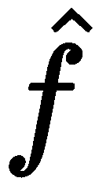
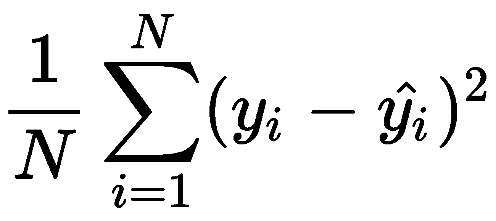
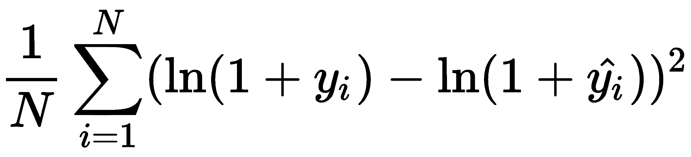
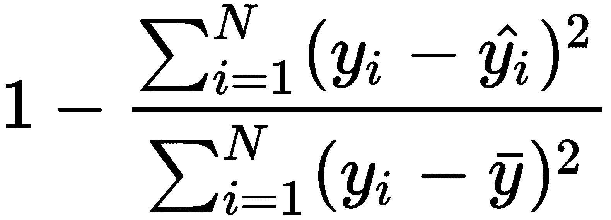
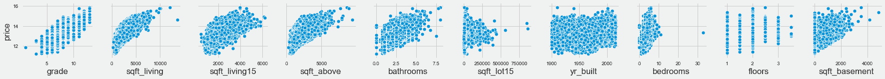
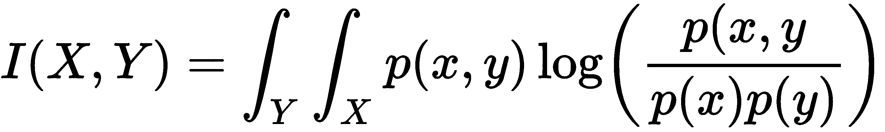
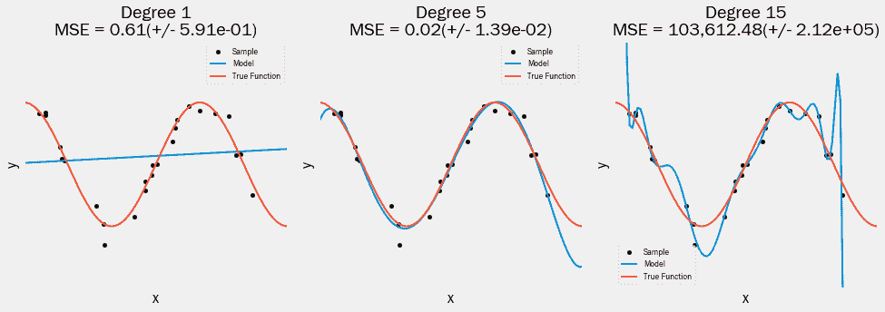
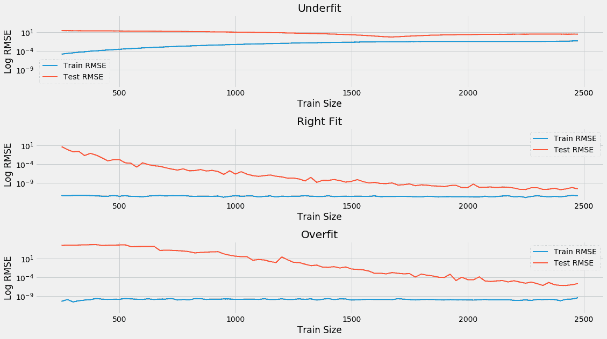
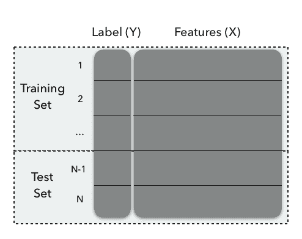
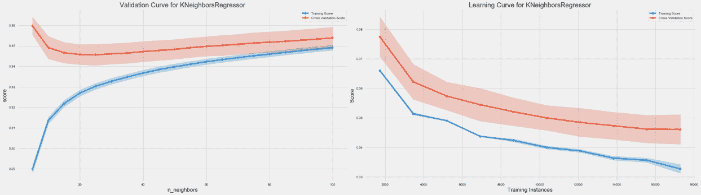

# 机器学习过程

在这一章中，我们将开始说明如何使用广泛的监督和非监督的**机器学习** ( **ML** )模型进行算法交易。在使用各种 Python 库演示相关应用程序之前，我们将解释每个模型的假设和用例。模型的类别将包括:

*   横截面、时间序列和面板数据的回归和分类的线性模型
*   广义加法模型，包括基于非线性树的模型，如**决策树**
*   集合模型，包括随机森林和梯度推进机器
*   用于降维和聚类的无监督线性和非线性方法
*   神经网络模型，包括递归和卷积架构
*   强化学习模型

我们将把这些模型应用于本书第一部分介绍的市场、基本面和替代数据源。我们将通过展示如何在算法交易策略中嵌入这些模型来生成或组合阿尔法因子，或者优化投资组合管理过程并评估它们的性能，来进一步构建到目前为止所涵盖的材料。

这些模型及其用途有几个共同的方面。本章涵盖了这些常见的方面，因此我们可以在接下来的章节中重点关注特定于模型的用法。它们包括通过优化目标或损失函数从数据中学习函数关系的总体目标。它们还包括测量模型性能的密切相关的方法。

我们区分无监督和有监督的学习和有监督的回归和分类问题，并概述了算法交易的用例。我们将监督学习用于输入和输出数据之间关系的统计推断与用于从未来输入预测未来输出进行对比。我们还说明了预测误差是如何由于模型的偏差或方差，或由于数据中的高信噪比。最重要的是，我们提出了诊断错误来源和提高模型性能的方法。

在本章中，我们将讨论以下主题:

*   使用数据的监督和非监督学习是如何工作的
*   如何应用 ML 工作流
*   如何为回归和分类制定损失函数
*   如何训练和评估监督学习模型
*   偏差-方差权衡如何影响预测误差
*   如何诊断和解决预测错误
*   如何使用交叉验证来训练模型，以管理偏差-方差权衡
*   如何使用 scikit-learn 实现交叉验证
*   为什么金融数据的性质需要不同的样本外检验方法

如果你已经非常熟悉 ML，请随意跳过，直接学习如何使用线性模型来产生和组合阿尔法因子作为算法交易策略。

# 从数据中学习

有许多关于 ML 的定义，它们都围绕着自动检测数据中有意义的模式。两个突出的例子包括:

*   人工智能先驱 Arthur Samuelson 在 1959 年将人工智能定义为计算机科学的一个子领域，它赋予计算机无需显式编程就能学习的能力。
*   托尼·米切尔(Toni Mitchell)是该领域目前的领导者之一，他在 1998 年更具体地提出了一个适定的学习问题:计算机程序从与任务相关的经验中学习，并衡量任务的性能是否随着经验的增加而提高。

经验以训练数据的形式呈现给算法。与以前试图建造解决问题的机器的主要区别在于，算法用来做出决策的规则是从数据中学习的，而不是被编程或硬编码的——这是 20 世纪 80 年代著名的专家系统的情况。

自动学习的关键挑战是在将模型的学习推广到新数据时，识别训练数据中有意义的模式。模型可以识别大量的潜在模式，而训练数据仅构成算法在未来执行任务所需的更大现象集的样本。可以从给定输入生成给定输出的无限数量的函数使得搜索过程不可能在没有对合格函数集的限制的情况下求解。

一方面，算法能够学习的模式类型受限于其假设空间的大小，另一方面受限于样本数据中包含的信息量。假设空间的大小在算法之间变化很大。一方面，这种限制使得搜索能够成功，另一方面，当算法从训练样本推广到新数据时，这意味着归纳偏差。

因此，关键的挑战变成了如何选择一个模型，该模型的假设空间足够大以包含学习问题的解决方案，但又足够小以确保给定训练数据大小的可靠概括。随着信息量越来越大，假设空间越来越大的模型就会成功。

**没有免费的午餐定理**指出没有通用的学习算法。相反，为了成功搜索有意义的模式，学习者的假设空间必须使用关于任务领域的先验知识来适应特定的任务。在本章中，我们将密切关注模型对特定任务的数据关系所做的假设，并强调将这些假设与从数据探索中收集的经验证据相匹配的重要性。掌握任务所需的过程可以分为监督学习、非监督学习和强化学习。

# 监督学习

监督学习是最常用的 ML 类型。我们将用本书的大部分章节来学习这一类别中模型的各种应用。术语*监督*意味着指导学习过程的结果变量的存在——也就是说，它教导算法正在学习的任务的正确解决方案。监督学习旨在概括从单个样本中学习到的输入和输出数据之间的函数关系，并将其应用于新数据。

根据领域的不同，输出变量也可互换地称为标签、目标、结果、内生变量或左侧变量。我们将用*y<sub>I</sub>T3】进行观测 *i = 1，...、N* 或 *y* 的向量符号。一些任务由几个结果表示，也称为**多标签问题**。监督学习问题的输入数据也被称为特征、外生变量和右侧变量，由用于观察的特征向量的 *x* <sub xmlns:epub="http://www.idpf.org/2007/ops">*i*</sub> 表示 *i = 1，...，N* 或 *X* 。*

监督学习问题的解决方案是一个函数()，它表示模型从样本中了解到的输入-输出关系，并逼近真实关系，用表示。此函数可用于推断样本之外的感兴趣变量之间的统计关联或潜在因果关系，或者可用于预测新输入数据的输出。

这两个目标都面临着一个重要的权衡:更复杂的模型有更多的*移动部件*，能够表示更微妙的关系，但它们也可能更难检查。他们还可能过度拟合并学习特定于训练样本的随机噪声，而不是代表输入-输出关系的一般模式的系统信号。另一方面，过于简单的模型会错过信号并给出有偏差的结果。这种权衡被称为监督学习中的**偏差-方差权衡**，但从概念上讲，这也适用于其他形式的 ML，其中过于复杂的模型可能在训练数据之外表现不佳。

# 无监督学习

当解决一个无监督的学习问题时，我们只观察特征，没有结果的测量。任务不是预测未来结果或推断变量之间的关系，而是在没有任何结果信息来指导搜索过程的情况下在数据中找到结构。

通常，无监督算法旨在学习对其他任务有用的输入数据的新表示。这包括在需要数据点或特征的同时，提出标识观察结果之间的共性的标签，或捕获相关信息的概括描述。无监督学习算法与有监督学习算法的不同之处还在于，它们对要发现的结构的性质做出了假设。

# 应用程序

无监督学习有几个有用的用途，可以应用于算法交易，包括如下:

*   将具有相似风险和回报特征的证券组合在一起(参见本章中的分级风险平价(研究投资组合优化))
*   发现驱动大量证券表现的少量风险因素
*   识别系统差异和可能带来更高风险的交易和价格模式
*   确定文档主体中的潜在主题(例如，收入电话会议记录)，这些主题包含这些文档最重要的方面

在高层次上，这些应用程序依赖于识别聚类的方法和降低数据维数的方法。

# 聚类算法

聚类算法使用相似性度量来识别包含相似信息的观察值或数据属性。它们通过将大量的数据点分配给少量的聚类来汇总数据集，以便聚类成员之间的关系比其他聚类成员之间的关系更密切。

分类算法的主要区别在于它们将产生的分类类型，这意味着对数据生成过程的不同假设，如下所示:

*   **K-均值聚类**:数据点属于大小相等的 *k* 个聚类中的一个，这些聚类呈椭圆形
*   **高斯混合模型**:数据点由各种多元正态分布生成
*   **基于密度的聚类**:聚类具有任意形状，并且仅由最小数量的附近数据点的存在来定义
*   **层次聚类**:数据点属于通过连续合并较小的聚类而形成的组的各种超集

# 降维

降维产生的新数据捕捉了源数据中包含的最重要的信息。这些算法不是将现有数据分组到聚类中，而是将现有数据转换到一个新的数据集，该数据集使用明显更少的特征或观察值来表示原始信息。

算法在它们将生成的新数据集的性质方面有所不同，如下表所示:

*   **主成分分析(PCA)** :寻找能捕捉现有数据集中大多数差异的线性变换
*   **流形学习**:识别产生数据的低维表示的非线性变换
*   **自动编码器**:使用神经网络以最小的信息损失非线性压缩数据

我们将在以下几个章节中更深入地探讨线性、非线性和基于神经网络的无监督学习模型，包括主题建模和 Word2vec 特征提取形式的**自然语言处理** ( **NLP** )的重要应用。

# 强化学习

**强化学习**是 ML 的第三种。它的目标是在给定一组描述背景或环境的输入数据的情况下，选择产生最高回报的行动。它既是动态的，也是互动的:积极和消极的奖励流会影响算法的学习，现在采取的行动可能会影响环境和未来的奖励。

利用已经学会的产生一定回报的行动过程和探索可能在未来增加回报的新行动之间的权衡产生了试错法。强化学习使用动态系统理论优化代理的学习，特别是具有不完全信息的马尔可夫决策过程的最优控制。

强化学习不同于监督学习，在监督学习中，可用的训练数据为算法安排了上下文和正确的决策。它是为交互式环境量身定制的，在这种环境中，随着代理获得新的经验，学习必须以*在线*或持续的方式进行。然而，**人工智能** ( **AI** )中一些最引人注目的进展涉及强化，它使用深度学习来近似行动、环境和未来奖励之间的功能关系。它也不同于无监督学习，因为结果的反馈将是可用的，尽管有延迟。

强化学习特别适合算法交易，因为在不确定的动态环境中，回报最大化代理的概念与投资者或与金融市场互动的交易策略有许多共同之处。这种方法已经成功地应用于游戏代理，最突出的是围棋游戏，但也适用于复杂的视频游戏。它还用于机器人领域，例如自动驾驶汽车，或者基于用户交互的个性化服务，如网站服务。我们将在[第 21 章](06.html)、*强化学习*中介绍构建算法交易策略的强化学习方法。

# 机器学习工作流程

为算法交易策略开发一个 ML 解决方案需要一个系统的方法来最大化成功的机会，同时节约资源。为了促进协作、维护和以后的改进，使过程透明和可复制也是非常重要的。

下图概述了从问题定义到部署预测性解决方案的关键步骤:


该过程在整个序列中是迭代的，并且不同阶段所需的工作将根据项目而变化，但是该过程通常应该包括以下步骤:

1.  框定问题，确定目标度量，并定义成功
2.  获取、清理和验证数据
3.  了解您的数据并生成信息丰富的要素
4.  选择一个或多个适合您的数据的机器学习算法
5.  训练、测试和调整您的模型
6.  用你的模型解决原来的问题

在接下来的部分中，我们将使用一个简单的例子来演示这些步骤，以说明一些要点。

# 基本演练–k-最近邻

这本书的 GitHub 知识库的本章文件夹中的`machine_learning_workflow.ipynb` 笔记本包含几个示例，这些示例使用房价数据集来说明机器学习工作流。

我们将使用相当简单的**k-最近邻** ( **KNN** )算法，该算法允许我们处理回归和分类问题。

在其默认的`sklearn`实现中，它识别`k`个最近的数据点(基于欧几里德距离)来进行预测。它分别预测邻域中最频繁的类或分类或回归情况下的平均结果。

# 框定问题-目标和指标

任何机器学习练习的起点都是它旨在解决的最终用例。有时，这个目标将是统计推断，以便确定变量之间的关联甚至因果关系。然而，最常见的目标是直接预测结果以产生交易信号。

推理和预测都使用度量来评估模型实现其目标的程度。我们将集中于预测模型的公共目标函数和相应的误差度量，它们可以通过输出的变量类型来区分:连续输出变量意味着回归问题，分类变量意味着分类，有序分类变量的特例意味着排序问题。

问题可能是几个 alpha 因子的有效组合，可以被设计为旨在预测回报的回归问题，旨在预测未来价格运动方向的二元分类问题，或者旨在将股票分配到不同表现类别的多类别问题。在下一节中，我们将介绍这些目标，并看看如何测量和解释相关的误差指标。

# 预测对推理

由监督学习算法产生的函数关系可用于推断——即获得对结果如何产生的洞察——或用于预测——即针对未知或未来输入(由 *X* 表示)产生精确的输出估计(由表示)。

对于算法交易，推断可用于估计资产回报对风险因素的因果或统计依赖性，而预测可用于预测风险因素。将两者结合起来可以预测资产价格，进而可以转化为交易信号。

统计推断是从样本数据中得出关于潜在概率分布或总体参数的结论。潜在的结论包括关于单个变量的分布特征的假设检验，或者变量之间的数值关系的存在性或强度。它们还包括统计指标的点估计或区间估计。

推断首先取决于对生成数据的过程的假设。我们将回顾这些假设和用于线性模型推断的工具，这些假设和工具已经被很好地建立。更复杂的模型对输入和输出之间的结构关系做出更少的假设，而是更公开地处理函数逼近的任务，同时将数据生成过程视为黑箱。这些模型，包括决策树、集成模型和神经网络，在用于预测任务时受到关注并经常表现出色。然而，随机森林最近获得了一个我们稍后将介绍的推理框架。

# 因果推理

因果推断旨在确定关系，以便某些输入值暗示某些输出——例如，在假设所有其他变量保持不变的情况下，导致给定资产价格以某种方式移动的某个宏观变量星座。

关于两个或多个变量之间关系的统计推断产生了相关性度量，只有在满足其他几个条件时，才能将其解释为因果关系——例如，当替代解释或反向因果关系被排除时。满足这些条件需要一个实验设置，其中所有相关的感兴趣的变量可以完全控制，以隔离因果关系。或者，准实验设置以随机方式将观察单位暴露于输入的变化，以排除其他可观察或不可观察的特征对环境变化的观察效果负责。

这些条件很少满足，因此推论结论需要谨慎对待。这同样适用于预测模型的性能，预测模型也依赖于特征和输出之间的统计关联，这种关联可能会随着模型之外的其他因素而变化。

KNN 模型的非参数性质不适合推断，所以我们将推迟工作流程中的这一步，直到我们在下一章遇到线性模型。

# 回归问题

回归问题旨在预测一个连续变量。**根** - **均方误差** ( **RMSE** )是最流行的损失函数和误差度量，尤其是因为它是可微分的。损失是对称的，但误差越大，计算中的权重越大。使用平方根的优点是以目标变量为单位测量误差。当目标服从指数增长时，同样的度量与误差 ( **RMSLE** )的 **RMSE 对数相结合是合适的，因为它的不对称惩罚使负误差的权重小于正误差。您也可以先对目标进行对数变换，然后使用 RMSE，就像我们在本节后面的示例中所做的那样。**

**平均绝对误差** ( **MAE** )和**中位绝对误差** ( **MedAE** )是对称的，但不会对更大的误差进行加权。MedAE 对异常值是稳健的。

解释方差得分计算模型所占的目标方差的比例，并在 0 和 1 之间变化。R <sup>2</sup> 得分或决定系数产生相同的结果，残差的平均值为 0，但也可能不同。特别是，当对样本外数据进行计算时(或者对于没有截距的线性回归)，它可能是负值。

下表定义了用于计算的公式以及可以从`metrics`模块导入的相应的`sklearn`函数。`scoring` 参数与自动列车测试功能(如`cross_val_score`和`GridSearchCV`)结合使用，我们将在本节稍后介绍这些功能，并在随附的笔记本中进行说明:

| **名称** | **公式** | **sklearn** | **评分参数** |
| 均方误差 |  | `mean_squared_error` | `neg_mean_squared_error` |
| 均方对数误差 |  | `mean_squared_log_error` | `neg_mean_squared_log_error` |
| 绝对平均误差 |  | `mean_absolute_error` | `neg_mean_absolute_error` |
| 中位数绝对误差 |  | `median_absolute_error` | `neg_median_absolute_error` |
| 解释方差 |  | `explained_variance_score` | `explained_variance` |
| R2 分数 |  | `r2_score` | `r2` |

以下屏幕截图显示了笔记本中演示的房价回归的各种误差指标:


`sklearn`函数还支持多标签评估——也就是说，为单个观察值分配多个结果值；更多细节参见 GitHub 上引用的文档([https://GitHub . com/packt publishing/Hands-On-Machine-Learning-for-algorithm-Trading/tree/master/chapter 06](https://github.com/PacktPublishing/Hands-On-Machine-Learning-for-Algorithmic-Trading/tree/master/Chapter06))。

# 分类问题

分类问题有分类结果变量。大多数预测器会输出一个分数来表示一个观察值是否属于某一类。第二步，将这些分数转化为实际的预测。

在二进制的情况下，我们将类标记为正和负，分数通常在零之间变化，或者相应地被归一化。一旦分数被转换为 0-1 预测，就可能有四种结果，因为两个现有类别中的每一个都可能被正确或错误地预测。对于两个以上的类，如果你区分几个潜在的错误，可能会有更多的情况。

所有的误差度量都是通过将实际类别和预测类别相关联的 2×2 混淆矩阵的四个字段的预测分解来计算的。下图所示的表中列出的度量(如准确性)评估给定阈值的模型:


分类器不一定需要输出校准的概率，而是应该产生在区分正面和负面情况时彼此相关的分数。因此，考虑到正确和错误预测的成本和收益，阈值是一个可以并且应该优化的决策变量。较低的阈值意味着更积极的预测，具有潜在上升的假阳性率，而对于较高的阈值，相反的情况可能是正确的。

# 接收器工作特性和曲线下面积

**接收器工作特性** ( **ROC** )曲线允许我们基于分类器的性能来可视化、组织和选择分类器。它计算所有的**真阳性率** ( **TPR** )和**假阳性率** ( **FPR** )的组合，这些组合是使用任何预测得分作为阈值产生预测的结果。然后在一个边长为 1 的正方形上画出这些线对。

进行随机预测的分类器(考虑到类别不平衡)将平均产生相等的 TPR 和 FPR，使得组合将位于对角线上，这成为基准情况。由于表现不佳的分类器将从重新标记预测中受益，因此该基准也成为最小值。

曲线 ( **AUC** )下的**面积定义为 ROC 图下在 0.5 和最大值 1 之间变化的面积。这是分类器的分数能够将数据点相对于它们的类成员关系排列得有多好的汇总度量。更具体地说，分类器的 AUC 具有重要的统计特性，表示分类器将随机选择的阳性实例排列得高于随机选择的阴性实例的概率，这等同于 Wilcoxon 排列测试。此外，AUC 还具有对类别失衡不敏感的优势。**

# 精确召回曲线

当对其中一个类别的预测特别感兴趣时，精度和召回曲线显示了不同阈值的这些错误度量之间的权衡。这两种方法都评估特定类的预测质量。下面的列表显示了它们是如何应用到正类的:

*   **Recall** 测量对于给定阈值，分类器预测为阳性的实际阳性类成员的份额。它起源于信息检索，测量通过搜索算法成功识别的相关文档的份额。
*   **相比之下，Precision** 衡量的是正确的正面预测的比例。

召回率通常随着阈值的降低而增加，但是精确度可能会降低。精确召回曲线将可获得的组合可视化，并考虑到错过大量相关案例或产生较低质量预测的成本和收益，允许优化阈值。

F1 分数是给定阈值的精度和召回率的调和平均值，可用于在考虑这两个指标应该具有的相对权重的同时，对阈值进行数值优化。

下图显示了 ROC 曲线和相应的 AUC，以及精度-召回曲线和 F1 分数，使用相同的精度和召回权重，得到最佳阈值 0.37。该图表摘自随附的笔记本，您可以在其中找到对二值化房价进行运算的 KNN 分类器的代码:


# 收集和准备数据

我们已经讨论了市场、基本面和替代数据来源的重要方面，并将继续使用这些来源的各种示例来说明各种模型的应用。

除了我们将通过 Quantopian 平台访问的市场和基本面数据之外，当我们研究自然语言处理和图像处理和识别时，我们还将获取和转换文本数据。除了获取、清理和验证数据以将其与通常以时间序列格式提供的交易数据相关联之外，以允许快速访问的格式存储数据以实现快速探索和迭代也很重要。我们已经推荐了 HDF 和镶木地板。对于更大的数据量，Apache Spark 是最佳解决方案。

# 探索、提取和设计特征

了解单个变量的分布以及结果和特征之间的关系是选择合适算法的基础。这通常从散点图等可视化开始，如配套笔记本中所示(如下图所示)，但也包括从线性指标(如相关性)到非线性统计(如引入信息系数时遇到的 Spearman 等级相关系数)的数值评估。它还包括信息论度量，如交互信息，如下一小节所示:



散点图

系统的探索性分析也是一个成功的预测模型中最重要的因素的基础:提取数据中包含的信息，但算法不一定能以原始形式获取这些信息的特征工程。特征工程受益于领域专业知识、统计学和信息论的应用以及创造力。

它依赖于对数据转换的巧妙选择，有效地梳理出输入和输出数据之间的系统关系。有许多选择，包括异常值检测和处理、函数转换和几个变量的组合，包括无监督学习。我们将从头到尾举例说明，但会强调这个特性最好通过经验来学习。Kaggle 是一个向其他数据科学家学习的好地方，这些科学家在 Kaggle 社区分享他们的经验。

# 使用信息论评估特征

特征和结果之间的**互信息** ( **MI** )是两个变量之间的相互依赖性的度量。它将相关性的概念扩展到非线性关系。更具体地说，它量化了通过一个随机变量获得的关于另一个随机变量的信息。

MI 的概念与随机变量的熵的基本概念密切相关。熵量化了随机变量中包含的信息量。形式上，两个随机变量 *X* 和 *Y* 的互信息——*I*(*X*， *Y* )定义如下:



`sklearn`函数实现了`feature_selection.mutual_info_regression`，它计算所有特征和连续结果之间的交互信息，以选择最有可能包含预测信息的特征。还有一个分类版本(详见文档)。笔记本`mutual_information.ipynb`笔记本包含我们在[第 4 章](04.html)、*阿尔法因子研究*中创建的财务数据的应用。

# 选择最大似然算法

本书的剩余部分将介绍几个模型系列，从线性模型到深度神经网络，线性模型对输入和输出变量之间的函数关系的性质做出相当强的假设，深度神经网络做出很少的假设。如介绍部分所述，更少的假设将需要更多的数据，这些数据具有关于关系的重要信息，以便学习过程能够成功。

在介绍这些模型时，我们将概述关键假设以及如何测试它们。

# 设计和调整模型

ML 过程包括基于模型的泛化误差的估计来诊断和管理模型复杂性的步骤。无偏估计需要统计上合理有效的程序，以及与输出变量类型一致的误差度量，这也决定了我们是在处理回归、分类还是排序问题。

# 偏差-方差权衡

当预测新输入数据的结果时，ML 模型产生的误差可以分解为可约和不可约的部分。不可约部分是由于未测量的数据中的随机变化(噪声)，例如相关但缺失的变量或自然变化。泛化误差的可约部分又可以分解为偏差和方差。两者都是由于真实的函数关系和机器学习算法所做的假设之间的差异，如以下列表中所详述的:

*   **偏差导致的误差**:假设过于简单，无法捕捉真实函数关系的复杂性。因此，每当模型试图学习真实函数时，它都会犯系统性错误，平均而言，预测也会有类似的偏差。这也被称为**欠拟合**。
*   **方差误差**:考虑到真实关系，算法过于复杂。它不是捕捉真实的关系，而是过度拟合数据并从噪声中提取模式。因此，它从每个样本中学习不同的函数关系，样本外预测将有很大差异。

# 欠拟合与过拟合

下图说明了通过使用越来越复杂的多项式逼近余弦函数并测量样本内误差来进行过拟合。更具体地说，我们随机抽取 10 个样本，添加一些噪声( *n* = 30)，以学习不同复杂度的多项式(参见随附笔记本中的代码)。每次，模型预测新的数据点，我们捕捉这些预测的均方误差，以及这些误差的标准偏差。

下图中的左侧面板显示了一个 1 次多项式；一条直线明显地位于真实函数的下方。然而，从真实函数中抽取的一个样本到下一个样本，估计的线不会有显著的不同。中间的面板显示，在[0，1]区间上，5 次多项式相当好地逼近真实关系。另一方面，15 次多项式几乎完美地拟合了小样本，但是提供了对真实关系的较差估计:它过度拟合了样本数据点中的随机变化，并且所学习的函数将随着所抽取的每个样本而强烈变化:



# 管理权衡

让我们通过尝试学习带有一些附加噪声的九次余弦函数的泰勒级数近似来进一步说明过拟合与欠拟合的影响。在下图中，我们绘制了真实函数的随机样本，并拟合了欠拟合、过拟合的多项式，提供了大致正确的灵活度。然后，我们预测样本外并测量 RMSE。

3 次多项式的高偏差但低方差与第一幅图中可见的各种预测误差的低偏差但极高方差相比。左侧面板显示了减去真实函数值后产生的误差分布。直线的欠拟合情况产生差的样本内拟合，并且显著偏离样本外的目标。过度拟合模型显示样本内最佳拟合，误差分散最小，但价格是样本外的较大方差。与真实模型的功能形式相匹配的适当模型在样本之外表现最好。

以下屏幕截图的右侧面板显示了实际预测而非误差，以展示不同类型的拟合在实践中的表现:


# 学习曲线

学习曲线描绘了训练和测试误差相对于用于学习函数关系的数据集大小的演变。对于给定的模型，它是诊断偏差-方差权衡的有用工具，因为误差会有不同的表现。具有高偏差的模型将具有高但相似的训练误差，包括样本内和样本外，而过拟合模型将具有非常低的训练误差。

样本外误差的下降说明过度拟合模型可能受益于额外的数据或工具来限制模型的复杂性，如正则化，而欠拟合模型需要使用更多的特征或增加模型的复杂性，如以下屏幕截图所示:



# 如何使用交叉验证进行模型选择

当你的用例有几个候选模型(也就是算法)可用时，选择其中一个的行为被称为**模型选择**问题。模型选择旨在识别在给定新数据的情况下将产生最低预测误差的模型。

对这种泛化误差的无偏估计需要对不属于模型训练的数据进行测试。因此，我们只使用部分可用数据来训练模型，并留出另一部分数据来测试模型。为了获得预测误差的无偏估计，绝对不能将有关测试集的信息泄漏到定型集中，如下图所示:



有几种方法可用于拆分可用数据，这些方法在用于训练的数据量、误差估计的方差、计算强度以及拆分数据时是否考虑数据的结构方面存在差异。

# 如何在 Python 中实现交叉验证

我们将通过展示如何将具有 10 个观察值的模拟数据集的索引分配给训练和测试集(详情见`cross_validation.py`)来说明将数据分为训练和测试集的各种选项，如以下代码所示:

```
data = list(range(1, 11))
[1, 2, 3, 4, 5, 6, 7, 8, 9, 10]
```

# 基本训练-测试分割

对于将数据分成训练集和测试集的单个分割，使用`sklearn.model_selection.train_test_split`，其中`shuffle`参数默认确保观察值的随机选择，这反过来可以通过设置`random_state`来复制。还有一个`stratify`参数，对于分类问题，它确保训练集和测试集将包含每个类的大致相同的份额，如下面的代码所示:

```
train_test_split(data, train_size=.8)
[[8, 7, 4, 10, 1, 3, 5, 2], [6, 9]]
```

在这种情况下，我们使用除行号`6`和`9`之外的所有数据训练模型，这些数据将用于生成预测和测量`know`标签上给出的误差。这种方法对于快速评估是有用的，但是对于分割是敏感的，并且测试误差估计的标准误差将会更高。

# 交叉验证

**交叉验证** ( **CV** )是一种流行的模型选择策略。CV 背后的主要思想是将数据分割一次或多次，以便每次分割用作一次验证集，剩余部分用作训练集:数据的一部分(训练样本)用于训练算法，剩余部分(验证样本)用于估计算法的风险。然后，CV 选择估计风险最小的算法。

虽然数据分割试探法非常通用，但 CV 的一个关键假设是数据是**独立同分布** ( **IID** )。在下面的章节中，我们将会看到，对于时间序列数据来说，情况往往不是这样，需要一种不同的方法。

# 使用保持测试装置

当根据验证分数选择超参数时，请注意，由于多次测试，该验证分数是有偏差的，不再是泛化误差的良好估计。对于错误率的无偏估计，我们必须根据新的数据集来估计得分，如下图所示:


因此，我们使用三种方式分割数据，如上图所示:一部分用于交叉验证，并被重复分割为定型集和验证集。剩余部分作为保留集，仅在交叉验证完成时使用，以生成无偏测试误差估计值。我们将在下一章开始构建 ML 模型时说明这种方法。

# KFold 迭代器

`sklearn.model_selection.KFold`迭代器产生几个分离的分割，并将这些分割中的每一个分配给验证集一次，如下面的代码所示:

```
kf = KFold(n_splits=5)
for train, validate in kf.split(data):
    print(train, validate)

[2 3 4 5 6 7 8 9] [0 1]
[0 1 4 5 6 7 8 9] [2 3]
[0 1 2 3 6 7 8 9] [4 5]
[0 1 2 3 4 5 8 9] [6 7]
[0 1 2 3 4 5 6 7] [8 9]
```

除了分割的数量之外，大多数 CV 对象都有一个`shuffle`参数来确保随机化。为了再现结果，设置`random_state`，如下所示:

```
kf = KFold(n_splits=5, shuffle=True, random_state=42)
for train, validate in kf.split(data):
    print(train, validate)

[0 2 3 4 5 6 7 9] [1 8]
[1 2 3 4 6 7 8 9] [0 5]
[0 1 3 4 5 6 8 9] [2 7]
[0 1 2 3 5 6 7 8] [4 9]
[0 1 2 4 5 7 8 9] [3 6]
```

# 遗漏简历

最初的 CV 实现使用留一法，将每个观察值作为验证集使用一次，如下面的代码所示:

```
loo = LeaveOneOut()
for train, validate in loo.split(data):
    print(train, validate)

[1 2 3 4 5 6 7 8 9] [0]
[0 2 3 4 5 6 7 8 9] [1]
...
[0 1 2 3 4 5 6 7 9] [8]
[0 1 2 3 4 5 6 7 8] [9]
```

这最大化了被训练的模型的数量，这增加了计算成本。虽然验证集不重叠，但训练集的重叠被最大化，从而提高了模型及其预测误差的相关性。因此，对于具有较大折叠数的模型，预测误差的方差较高。

# 省略简历

与留一法 CV 类似的版本是留一法 CV，它生成所有可能的`p`数据行组合，如下面的代码所示:

```
lpo = LeavePOut(p=2)
for train, validate in lpo.split(data):
    print(train, validate)

[2 3 4 5 6 7 8 9] [0 1]
[1 3 4 5 6 7 8 9] [0 2]
...
[0 1 2 3 4 5 6 8] [7 9]
[0 1 2 3 4 5 6 7] [8 9]
```

# 洗牌拆分

`sklearn.model_selection.ShuffleSplit`对象创建具有潜在重叠验证集的独立分割，如下面的代码所示:

```
ss = ShuffleSplit(n_splits=3, test_size=2, random_state=42)
for train, validate in ss.split(data):
    print(train, validate)
[4 9 1 6 7 3 0 5] [2 8]
[1 2 9 8 0 6 7 4] [3 5]
[8 4 5 1 0 6 9 7] [2 3]
```

# 使用 scikit-learn 进行参数调整

模型选择通常涉及使用不同算法(如线性回归和随机森林)或不同配置对模型的样本外性能进行反复交叉验证。不同的配置可能涉及超参数的变化或不同变量的包含或排除。

`yellowbricks`库扩展了`sklearn` API 来生成诊断可视化工具，以便于模型选择过程。这些工具可用于调查要素之间的关系、分析分类或回归错误、监控聚类算法性能、检查文本数据的特征以及帮助选择模型。我们将展示在参数调整阶段提供有价值信息的验证和学习曲线——参见`machine_learning_workflow.ipynb`笔记本了解实现细节。

# 带黄砖的验证曲线

验证曲线(见下图左侧面板)显示了单个超参数对模型交叉验证性能的影响。这有助于确定模型是欠拟合还是过拟合给定数据集。

在只有一个超参数的 **KNeighborsRegressor** 的示例中，我们可以清楚地看到，对于大于 20 的 *k* 的值，模型欠拟合，其中验证误差随着我们减少邻居的数量而下降，从而使我们的模型更加复杂，因为它对特征空间中更明显的邻居组或区域进行预测。对于低于 20 的值，随着训练和验证误差发散，模型开始过度拟合，平均样本外性能迅速恶化，如下图所示:



# 学习曲线

学习曲线(参见上图右侧的房价回归示例)有助于确定模型的交叉验证性能是否会受益于额外的数据，以及预测误差是否更多地由偏差或方差驱动。

如果训练和交叉验证性能收敛，那么更多的数据不太可能提高性能。在这一点上，重要的是评估模型性能是否满足由人类基准确定的预期。如果不是这种情况，那么您应该修改模型的超参数设置，以更好地捕捉特征和结果之间的关系，或者选择具有更高能力的不同算法来捕捉复杂性。

此外，由阴影置信区间显示的训练和测试误差的变化提供了关于预测误差的偏差和方差来源的线索。交叉验证误差周围的可变性是方差的证据，而训练集的可变性表明偏差，这取决于训练误差的大小。

在我们的例子中，交叉验证性能持续下降，但增量改进已经缩小，错误已经稳定，因此较大的训练集不太可能有太多好处。另一方面，在给定验证误差范围的情况下，与训练误差相比，数据显示出很大的差异。

# 使用 GridSearchCV 和管道进行参数调整

由于超参数调整是机器学习工作流的一个关键组成部分，因此有一些工具可以自动化这个过程。`sklearn`库包括一个`GridSearchCV`接口，该接口并行交叉验证所有参数组合，捕获结果，并使用在整个数据集的交叉验证期间表现最佳的参数设置自动训练模型。

实际上，训练集和验证集通常需要在交叉验证之前进行一些处理。Scikit-learn 还提供了`Pipeline`来自动化由`GridSearchCV`促成的自动化超参数调整中的任何必要的特征处理步骤。

您可以查看附带的`machine_learning_workflow.ipynb`笔记本中的实现示例，以了解这些工具的运行情况。

# 金融领域交叉验证的挑战

到目前为止讨论的交叉验证方法的一个关键假设是可用于训练的样本的**独立且相同的** ( **iid** )分布。

对于财务数据来说，往往不是这样。相反，由于序列相关性和时变标准差，金融数据既不是独立分布，也不是同分布，也称为**异方差**(详见下两章)。`sklearn.model_selection`模块中的`TimeSeriesSplit`旨在处理时序数据的线性顺序。

# 使用 sklearn 进行时间序列交叉验证

数据的时间序列性质意味着交叉验证会产生一种情况，即未来的数据将用于预测过去的数据。这在最好的情况下是不现实的，在最坏的情况下是数据窥探，因为未来的数据反映了过去的事件。

为了解决时间依赖性问题，`sklearn.model_selection.TimeSeriesSplit`对象使用扩展的训练集实现了一个步行测试，其中后续的训练集是过去训练集的超集，如下面的代码所示:

```
tscv = TimeSeriesSplit(n_splits=5)
for train, validate in tscv.split(data):
    print(train, validate)

[0 1 2 3 4] [5]
[0 1 2 3 4 5] [6]
[0 1 2 3 4 5 6] [7]
[0 1 2 3 4 5 6 7] [8]
[0 1 2 3 4 5 6 7 8] [9]
```

您可以使用`max_train_size`参数来实现向前遍历交叉验证，其中训练集的大小保持不变，类似于`zipline`测试交易算法的方式。Scikit-learn 使用子类化促进了定制交叉验证方法的设计，我们将在接下来的章节中实现。

# 清除、禁运和组合 CV

对于金融数据，标签通常来自重叠的数据点，因为回报是根据多个时期的价格计算的。在交易策略的情况下，模型预测的结果，可能意味着在资产中建立头寸，可能只有在以后评估该决策时才知道，例如，在平仓时。

由此产生的风险包括从测试到训练集的信息泄漏，这可能导致人为夸大的性能，需要通过确保所有数据都是时间点数据来解决，即在数据用作模型输入时真正可用和已知。Marcos Lopez de Prado 在*Advances in Financial Machine Learning*中提出了几种方法来解决财务数据交叉验证的挑战，如下表所示:

*   **清除**:消除验证集中预测某个时间点数据点后发生评估的训练数据点，以避免前瞻偏差。
*   **禁止**:进一步排除测试期后的训练样本。
*   **组合交叉验证**:前向 CV 严重限制了可测试的历史路径。取而代之的是，给定 T 个观察值，计算所有可能的训练/测试分割，用于 *N* < *T* 组，每个组保持它们的顺序，并清除和禁止潜在的重叠组。然后，在所有组合的 *N* - *k* 组上训练模型，同时在剩余的 *k* 组上测试模型。结果是大量可能的历史路径。

Prado 的*金融机器学习的进展*包含了实现这些方法的样本代码；代码也可以通过新的库`timeseriescv`获得。

# 摘要

在这一章中，我们介绍了从数据中学习的挑战，并把监督、非监督和强化模型作为我们在本书中学习的主要学习形式，以建立算法交易策略。我们讨论了监督学习算法对它们试图学习的函数关系进行假设的需要，以便限制搜索空间，同时招致可能导致过度泛化错误的归纳偏差。

我们介绍了 ML 工作流程的关键方面，介绍了回归和分类模型最常见的误差度量，解释了偏差-方差权衡，并举例说明了使用交叉验证管理模型选择过程的各种工具。

在下一章中，我们将深入线性回归模型和分类模型，开发我们第一个使用 ML 的算法交易策略。