# 七、线性模型

线性模型家族代表了最有用的假设类别之一。在算法交易中广泛应用的许多学习算法依赖于线性预测器，因为它们在许多情况下可以被有效地训练，它们对嘈杂的金融数据相对鲁棒，并且它们与金融理论有很强的联系。线性预测也很直观，易于解释，并且通常与数据相当吻合，或者至少提供了一个良好的基线。

当勒让德和高斯将线性回归应用于天文学并开始分析其统计特性时，线性回归已被人们所知超过 200 年。此后，许多扩展采用了线性回归模型和基线**普通最小二乘法** ( **OLS** )方法来学习其参数:

*   **广义线性模型** ( **GLM** )通过允许响应变量暗示非正态分布的误差分布，扩大了应用范围。GLM 包括出现在分类问题中的**分类响应变量**的概率单位或逻辑模型。
*   更多的**稳健估计方法**能够在数据违反基线假设的情况下进行统计推断，例如，由于随时间推移或跨观察的相关性。对于包含对相同单位的重复观察的面板数据，例如一个资产领域的历史回报，通常就是这种情况。
*   **收缩法**旨在提高线性模型的预测性能。他们使用复杂性惩罚来偏置模型学习的系数，目标是减少模型的方差并提高样本外预测性能。

在实践中，线性模型被应用于回归和分类问题，目的是推断和预测。学术界和行业研究人员开发的许多资产定价模型都利用了线性回归。应用包括识别推动资产回报的重要因素，例如作为风险管理的基础，以及预测不同时间范围内的回报。另一方面，分类问题包括方向性的价格预测。

在本章中，我们将讨论以下主题:

*   线性回归的工作原理及其假设
*   如何训练和诊断线性回归模型
*   如何用线性回归预测未来收益
*   如何使用正则化来提高预测性能
*   逻辑回归如何工作
*   如何将回归转换成分类问题

有关代码示例、其他资源和参考资料，请参见在线 GitHub 资源库中本章的目录。

# 推理和预测的线性回归

顾名思义，线性回归模型假设输出是输入的线性组合的结果。该模型还假设了一个随机误差，允许每个观察值偏离预期的线性关系。模型不能以确定的方式完美地描述输入和输出之间的关系的原因包括，例如，缺少变量、测量或数据收集问题。

如果我们想根据从样本估计的回归参数得出关于总体中真实(但未观察到的)线性关系的统计结论，我们需要添加关于这些误差的统计性质的假设。基线回归模型做出了强有力的假设，即误差的分布在误差之间是相同的，并且误差是相互独立的，也就是说，知道一个误差并不能帮助预测下一个误差。**独立且同分布** ( **iid** )误差的假设意味着它们的协方差矩阵是单位矩阵乘以代表误差方差的常数。

这些假设保证了 OLS 方法提供的估计不仅是无偏的，而且是有效的，也就是说，它们具有最低的采样误差学习算法。然而，这些假设在实践中很少得到满足。在金融领域，我们经常会遇到在给定横截面上重复观察的面板数据。试图评估一系列资产在一段时间内对一系列风险因素的系统性暴露，通常会暴露出时间或横截面维度或两者的相关性。因此，出现了替代的学习算法，其假设更多的误差协方差矩阵不同于单位矩阵的倍数。

另一方面，学习线性模型的有偏参数的方法可以产生具有较低方差的估计，从而提高预测性能。**收缩方法**通过应用正则化来降低模型的复杂性，正则化将惩罚项添加到线性目标函数中。损失与系数的绝对大小正相关，因此这些系数相对于基线情况缩小了。系数越大意味着模型越复杂，对输入变化的反应越强烈。正确校准后，惩罚可以限制模型系数的增长，使其超出最佳偏差-方差权衡所建议的范围。

我们将介绍线性模型的基线横截面和面板技术，以及在关键假设被违反时产生精确估计的重要改进。然后，我们将通过估算在算法交易策略开发中普遍存在的因素模型来说明这些方法。最后，我们将集中讨论正则化方法。

# 多元线性回归模型

我们将介绍模型的规格和目标函数，学习其参数的方法，允许对这些假设进行推断和诊断的统计假设，以及使模型适应这些假设失败的情况的扩展。

# 如何制定模型

多元回归模型定义了一个连续输出变量和 *p* 输入变量之间的线性函数关系，输入变量可以是任何类型，但可能需要预处理。相比之下，多元回归是指对多个输入变量的多个输出进行回归。

在总体中，对于输出 *y* 、输入向量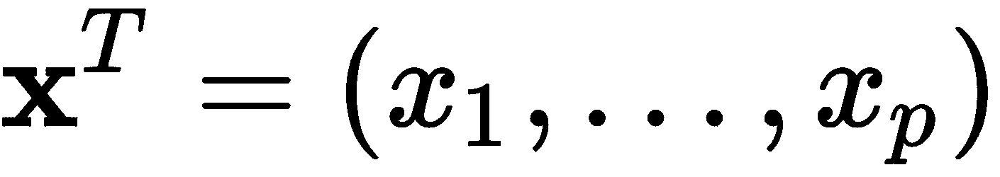和误差 *ε* 的单个实例，线性回归模型具有以下形式:

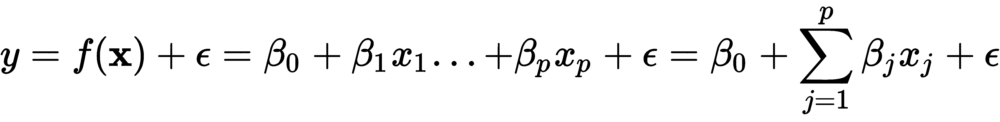

系数的解释很简单:系数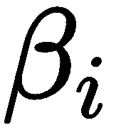的值是变量 *x <sub> i </sub>* 对输出的部分平均影响，保持所有其他变量不变。

该模型也可以更紧凑地写成矩阵形式。在这种情况下， *y* 是 *N* 输出观测值的向量， *X* 是在 *p* 变量上有 *N* 行观测值加上一列 1 用于截距的设计矩阵，是包含 *P = p+1* 系数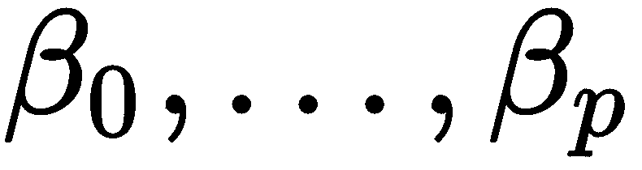的向量:


该模型在其 *p +1* 参数中是线性的，但是可以通过相应地选择或变换变量来模拟非线性关系，例如通过包括多项式基展开或对数项。它还可以使用带有虚拟编码的分类变量，并通过创建形式为 *x <sub>i</sub> 的新输入来实现变量之间的交互。x<sub>j</sub>T7】。*

为了从统计学的角度完成模型的公式化，以便我们可以检验关于参数的假设，我们需要对误差项做出具体的假设。我们将在首先介绍学习参数的替代方法之后这样做。

# 如何训练模型

从数据中学习模型参数有几种方法:**普通最小二乘法**(**OLS**)**最大似然估计**(**MLE**)**随机梯度下降** ( **SGD** )。

# 最小平方

最小二乘法是从输入数据中学习最接近输出的超平面参数的原始方法。顾名思义，最佳近似使输出值和模型表示的超平面之间的距离平方和最小。

给定数据点的模型预测和实际结果之间的差异是残差(而真实模型与群体中真实输出的偏差被称为**误差**)。因此，在形式上，最小二乘估计方法选择系数向量来最小化**残差** **平方和** ( **RSS** ):


因此，最小二乘系数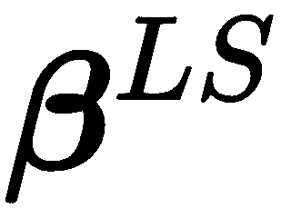计算如下:


最小化 RSS 的最佳参数向量来自于将前面的表达式相对于的导数设置为零。这产生了唯一的解决方案，假设 X 具有全列秩，即输入变量不是线性相关的，如下所示:


当 *y* 和 *X* 通过减去它们各自的平均值而被去均值后，表示输入和输出之间的协方差与输出方差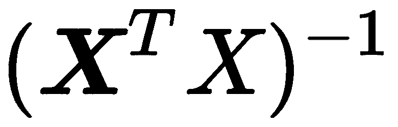之比。还有一种几何解释:最小化 RSS 的系数确保残差向量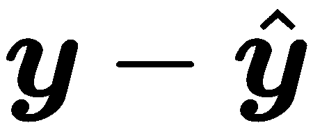正交于由 *X* 的列跨越的的子空间，并且估计值是到该子空间的正交投影。

# 最大似然估计

最大似然法是估计统计模型参数的一种重要的通用方法。它依赖于似然函数，该函数计算作为模型参数的函数，对于一组给定的两个输入数据，观察到输出值样本的可能性有多大。似然性不同于概率，因为它不被标准化为从 0 到 1 的范围。

我们可以通过假设误差项的分布来设置线性回归示例的似然函数，例如标准正态分布:

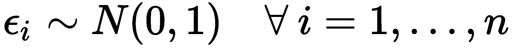。

这允许我们在给定相应输入向量*x<sub>I</sub>T4】和参数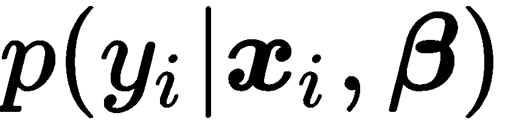的情况下，计算观察给定输出的条件概率:*

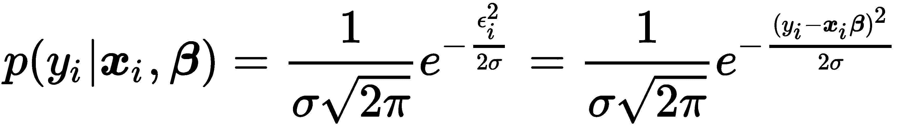

假设在给定输入的情况下，输出值是条件独立的，则样本的似然性与各个输出数据点的条件概率的乘积成比例。由于求和比乘积更容易，我们应用对数来获得对数似然函数:


MLE 的目标是通过选择模型参数，将观察到的输入视为给定，最大化实际上已经观察到的输出样本的概率。因此，最大似然参数估计来自最大化(对数)似然函数:

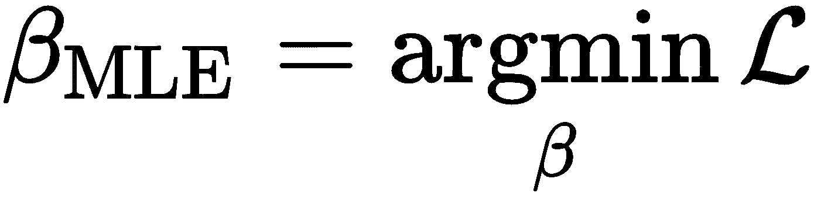

由于正态分布的假设，最大化对数似然函数会产生与最小二乘法相同的参数解，因为唯一依赖于参数的表达式是指数中的平方残差。对于其他分布假设和模型，MLE 将产生不同的结果，在许多情况下，最小二乘法是不适用的，正如我们将在后面看到的逻辑回归。

# 梯度下降

梯度下降是一种通用优化算法，可以找到平滑函数的驻点。如果目标函数是凸的，则解将是全局最优的。梯度下降的变体广泛用于复杂神经网络的训练，也用于计算 MLE 问题的解。

该算法使用包含其关于参数的偏导数的目标函数的梯度。这些导数表明在相应参数的方向上，对于无穷小的步长，目标改变了多少。原来函数值的最大变化是由梯度本身方向上的一个阶跃引起的。

因此，当最小化描述例如预测误差成本的函数时，该算法使用训练数据计算当前参数值的梯度，并根据其相应梯度分量的负值修改每个参数。因此，目标函数将采用较低的值，并将参数移向更接近解的位置。当梯度变小时，优化停止，并且参数值变化很小。

这些步骤的大小就是学习率，这是一个可能需要调整的关键参数；许多实现包括这个学习率随着迭代次数逐渐增加的选项。根据数据的大小，算法可能会在整个数据集上迭代多次。每个这样的迭代被称为一个**时期。**用于停止进一步迭代的历元数和容差是您可以调整的超参数。

随机梯度下降随机选择一个数据点，并计算该数据点的梯度，而不是在更大的样本上求平均值，以实现加速。也有批处理版本，每个步骤使用一定数量的数据点。

# 高斯——马尔可夫定理

要评估模型的统计数据并进行推断，我们需要对残差进行假设，即输入中无法解释的部分的属性。**高斯——马尔可夫定理** ( **GMT** )定义了 OLS 产生模型参数的无偏估计所需的假设，以及这些估计何时在横截面数据的所有线性模型中具有最低的标准误差。

基线多元回归模型做出以下 GMT 假设:

1.  在总体中，**线性**成立，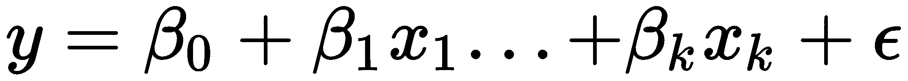其中未知但为常数，为随机误差
2.  输入变量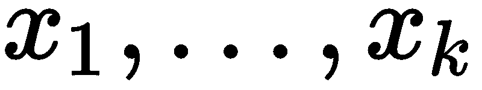的数据是来自总体的**随机样本**
3.  没有完美的**共线性**-输入变量之间没有精确的线性关系
4.  给定任何输入: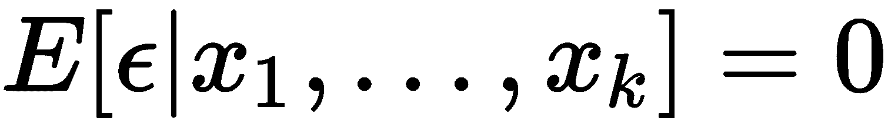，**误差的条件均值为零**
5.  给定输入: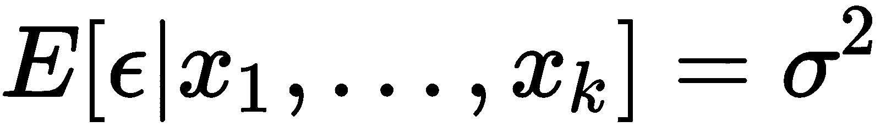，误差项具有恒定方差

第四个假设意味着不存在与任何输入变量相关的缺失变量。在前四个假设下，OLS 方法给出了**无偏的**估计:包含一个不相关的变量不会使截距和斜率估计有偏差，但是省略一个相关的变量会使 OLS 估计有偏差。OLS 也是**一致的**:随着样本量的增加，估计值收敛到真实值，因为标准误差变得任意。不幸的是，反过来也是正确的:如果由于模型遗漏了相关变量或函数形式错误(即遗漏了二次项或对数项)，误差的条件期望不为零，则所有参数估计都是有偏的。如果误差与任何输入变量相关，那么 OLS 也是不一致的，也就是说，添加更多的数据不会消除偏差。

如果我们加上第五个假设，那么 OLS 也会产生最佳线性无偏估计(蓝色)，其中最佳意味着这些估计在所有线性估计量中具有最低的标准误差。因此，如果这五个假设成立，统计推断是目标，那么 OLS 估计是可行的。然而，如果目标是预测，那么我们将会看到存在其他的估计量，它们用一些偏差来换取较低的方差，以在许多情况下获得更好的预测性能。

既然我们已经介绍了基本的 OLS 假设，我们可以看看小样本和大样本的推断。

# 如何进行统计推断

线性回归中的推断旨在从样本数据中得出关于总体真实关系的结论。这包括对总体关系的显著性或特定系数的值的假设检验，以及对置信区间的估计。

统计推断的关键要素是具有已知分布的检验统计量。我们可以用它来假设零假设为真，并计算在样本中观察到该统计值的概率，即 p 值。如果 p 值低于显著性阈值(通常为 5%)，那么我们拒绝该假设，因为它使得实际样本值非常不可能。同时，我们承认 p 值反映了我们拒绝事实上正确的假设是错误的概率。

除了五个 GMT 假设，经典线性模型假设**正态**—总体误差正态分布，与输入变量无关。这个假设意味着输出变量是正态分布的，取决于输入变量。这个强有力的假设允许推导出系数的精确分布，这反过来又意味着小样本中类似精确假设检验所需的检验统计量的精确分布。这个假设经常失败——例如，资产回报不是正态分布的——但是，幸运的是，正态下使用的方法也大致有效。

我们有以下分布特征和检验统计，大约在 GMT 假设 1-5 下，并且恰好在正态性成立时:

*   参数估计遵循多元正态分布: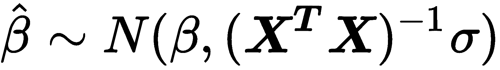。
*   在 GMT 1–5 下，参数估计已经是无偏的，我们可以使用得到的无偏估计，即恒定误差方差。
*   关于单个系数的假设检验的 t 统计量是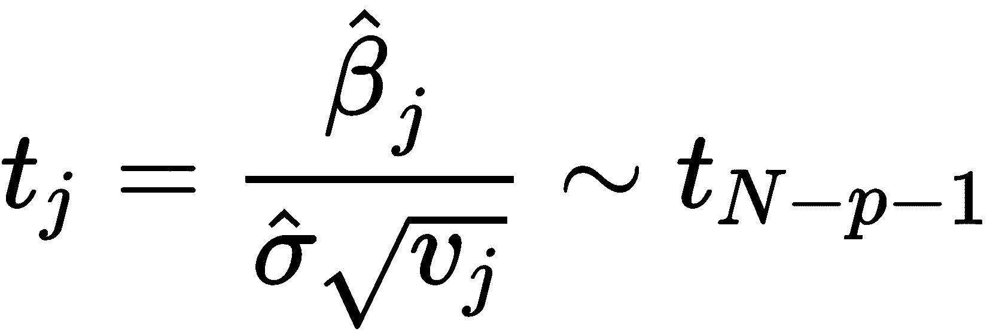，并且遵循具有 *N-p-1* 个自由度的 t 分布，其中是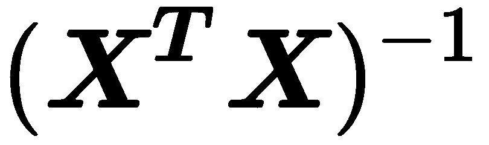的对角线的 j 元素。
*   *t* 分布收敛于正态分布，因为正态分布的 97.5 分位数是 1.96，所以对于参数估计的 95%置信区间，一个有用的经验法则是。包含零的区间意味着我们不能拒绝零假设，即真实参数为零，因此与模型无关。
*   *F* 统计允许对几个参数进行限制测试，包括整个回归是否显著。它测量由附加变量引起的 RSS 的变化(减少)。
*   最后，**拉格朗日乘数** ( **LM** )测试是对 *F* 测试的替代，用于限制多个限制。

# 如何诊断和解决问题

诊断验证模型假设，并在解释结果和进行统计推断时防止错误的结论。它们包括拟合优度的测量和关于误差项的各种假设测试，包括残差与正态分布的匹配程度。此外，诊断测试残差方差是否确实是常数或表现出异方差性，以及误差是否是有条件不相关的或表现出序列相关性，即知道一个误差是否有助于预测连续误差。

除了下面概述的测试之外，目视检查残差以检测是否存在系统模式也很重要，因为这些模式表明模型缺少一个或多个驱动结果的因素。

# 适合度

拟合优度评估模型在多大程度上解释了结果的变化。它们有助于评估模型规格的质量，例如，在不同的模型设计中进行选择。他们对适合度的评估不同。这里讨论的测量提供了样本内信息；当我们在下一节关注预测模型时，我们将使用样本外测试和交叉验证。

突出的拟合优度度量包括应最大化的(调整后的)R <sup>2</sup> 并基于最小二乘估计:

*   R <sup>2</sup> 衡量模型解释的结果数据中的变化份额，并计算为，其中 TSS 是结果与其均值的方差之和。它还对应于实际结果值和由模型估计(拟合)的结果值之间的平方相关系数。目标是使 R <sup>2</sup> 最大化，但是随着模型增加更多的变量，它永远不会减少，因此，鼓励过度拟合。

*   调整后的 R <sup>2</sup> 因增加更多变量而惩罚 R<sup>2</sup>；每个额外的变量都需要显著降低 RSS 以产生更好的拟合优度。

或者，阿凯克(AIC)和**贝叶斯信息标准** ( **BIC** )将被最小化，并基于最大似然估计:

*   ，其中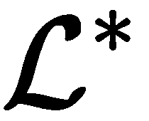是最大似然函数值，k 是参数个数
*   其中 *N* 是样本量

这两个指标都因复杂性而受到惩罚，BIC 施加了更高的惩罚，因此它可能不足，而 AIC 相对而言可能过度。从概念上讲，AIC 的目标是找到最能描述未知数据生成过程的模型，而 BIC 则试图在一系列候选模型中找到最佳模型。在实践中，当目标是样本内拟合时，两个标准可以联合使用来指导模型选择；否则，基于泛化误差估计的交叉验证和选择是更可取的。

# 异方差

GMT 假设 5 要求残差协方差采取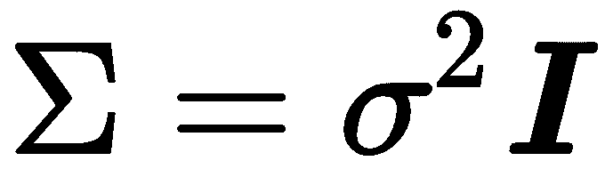的形状，即，具有等于误差项的恒定方差的项的对角矩阵。当残差方差不是常数，而是不同的观测值时，就会出现异方差。如果残差方差与输入变量正相关，也就是说，当远离平均值的输入值的误差较大时，OLS 标准误差估计值将会过低，因此，t 统计量将会膨胀，从而导致错误地发现实际上不存在的关系。

诊断从目视检查残留物开始。(假定是随机的)残差中的系统模式表明对各种选择误差是同方差的零假设的统计检验。这些测试包括 breu sch——异教徒和白人测试。

有几种方法可以校正异方差的 OLS 估计值:

*   当使用所谓的**三明治**T2 估计器计算误差方差时，稳健标准误差(有时称为白标准误差)会考虑异方差。
*   聚类标准差假设数据中有不同的组，这些组是同伦的，但组之间的误差方差不同。这些群体可能是不同行业的不同资产类别或股票。

当时，OLS 的几种替代方案使用不同的假设来估计误差协方差矩阵。以下内容可在`statsmodels`中找到:

*   **加权最小二乘** ( **WLS** ):对于异方差误差，其中协方差矩阵只有对角元素，如 OLS，但现在元素允许变化
*   可行的**广义最小二乘法** ( **GLSAR** )，用于遵循自回归 AR (p)过程的自相关误差(参见线性时间序列模型一章)
*   **广义最小二乘**(**【GLS】**)适用于任意协方差矩阵结构；在存在异方差或序列相关的情况下，产生有效的无偏估计

# 序列相关

序列相关是指线性回归产生的连续残差是相关的，这违反了第四个 GMT 假设。正序列相关意味着标准误差被低估，t-统计量将被夸大，如果被忽略会导致错误的发现。但是，在计算标准误差时，有程序可以校正序列相关性。

德宾-沃森统计诊断序列相关性。它测试了 OLS 残差不自相关的假设，而不是遵循自回归过程的假设(我们将在下一章探讨)。测试统计范围从 0 到 4，接近 2 的值表示非自相关，较低的值表示正自相关，较高的值表示负自相关。确切的阈值取决于参数和观测值的数量，并且需要在表格中查找。

# 多重共线性

当两个或多个独立变量高度相关时，就会出现多重共线性。这带来了几个挑战:

*   很难确定哪些因素会影响因变量
*   单个 p 值可能会产生误导-即使变量很重要，p 值也可能很高
*   回归系数的置信区间将会过大，甚至可能包括零，使得不可能确定独立变量对结果的影响

没有正式的或基于理论的解决方案来纠正多重共线性。相反，尝试移除一个或多个相关的输入变量，或者增加样本量。

# 如何在实践中运行线性回归

随附的笔记本`linear_regression_intro.ipynb`展示了一个简单的线性回归和一个多元线性回归，后者同时使用了 OLS 和梯度下降。对于多元回归，我们生成两个范围从-50 到+50 的随机输入变量*x<sub>1</sub>T4】和*x<sub>2</sub>T8】，以及一个作为输入加上随机高斯噪声的线性组合计算的结果变量，以满足正态假设 GMT 6:**

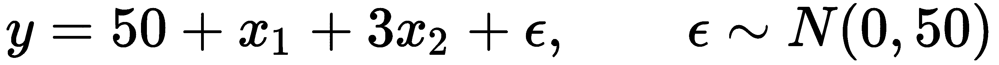

# 带统计模型的 OLS

我们使用`statsmodels`来估计一个多元回归模型，该模型准确地反映了如下的数据生成过程:

```
from statsmodels.api import 
X_ols = add_constant(X)
model = OLS(y, X_ols).fit()
model.summary()
```

这产生了下面的 **OLS 回归结果**摘要:

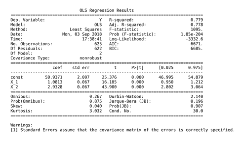

ols 衰退结果汇总

摘要的上半部分显示了数据集的特征，即估计方法、观测值和参数的数量，并指出标准误差估计不考虑异方差。中间的面板显示了密切反映人工数据生成过程的系数值。我们可以确认，显示在汇总结果中间的估计值可以使用之前推导的 OLS 公式获得:

```
beta = np.linalg.inv(X_ols.T.dot(X_ols)).dot(X_ols.T.dot(y))
pd.Series(beta, index=X_ols.columns)

const   50.94
X_1      1.08
X_2      2.93

```

下图说明了由模型拟合到随机生成的数据点的超平面:


超平面

面板的右上部分显示了刚才讨论的拟合优度度量，以及拒绝所有系数为零且不相关的假设的 f 检验。类似地，t 统计表明截距和两个斜率都非常显著。

摘要的底部包含剩余诊断。左图显示用于检验正态假设的偏斜度和峰度。综合检验和 jar que-Bera 检验都未能拒绝残差呈正态分布的零假设。Durbin-Watson 统计测试残差中的序列相关性，其值接近 2，在给定 2 个参数和 625 个观测值的情况下，无法拒绝无序列相关性的假设。

最后，条件数提供了关于多重共线性的证据:它是包含输入数据的设计矩阵的最大和最小特征值的平方根之比。大于 30 的值表明回归可能具有显著的多重共线性。

`statsmodels`包括笔记本中链接的附加诊断测试。

# 使用 sklearn 的随机梯度下降

`sklearn`库在其`linear_models`模块中包含了一个`SGDRegressor`模型。为了使用这种方法学习相同模型的参数，我们需要首先标准化数据，因为梯度对比例很敏感。为此，我们使用`StandardScaler()`在拟合步骤中计算每个输入变量的平均值和标准偏差，然后在转换步骤中减去平均值并除以标准偏差，我们可以方便地在单个`fit_transform()`命令中执行:

```
scaler = StandardScaler()
X_ = scaler.fit_transform(X)
```

然后我们使用默认值实例化`SGDRegressor`,除了一个`random_state`设置以方便复制:

```
sgd = SGDRegressor(loss='squared_loss', fit_intercept=True, 
                   shuffle=True, random_state=42,  # shuffle training data for better gradient estimates
                   learning_rate='invscaling',     # reduce learning rate over time
                   eta0=0.01, power_t=0.25)        # parameters for learning rate path
```

现在我们可以拟合`sgd`模型，为 OLS 和`sgd`模型创建样本内预测，并计算每个模型的均方根误差:

```
sgd.fit(X=X_, y=y)
resids = pd.DataFrame({'sgd': y - sgd.predict(X_),
                      'ols': y - model.predict(sm.add_constant(X))})
resids.pow(2).sum().div(len(y)).pow(.5)

ols   50.06
sgd   50.06

```

正如所料，两个模型产生了相同的结果。我们现在将进行一个更加雄心勃勃的项目，使用线性回归来估计多因素资产定价模型。

# 如何建立线性因子模型

算法交易策略使用**线性因子模型**来量化资产回报和代表这些回报主要驱动因素的风险来源之间的关系。每个因素风险都有一个溢价，总资产回报可以预期对应于这些风险溢价的加权平均值。

在从建设和资产选择到风险管理和绩效评估的投资组合管理过程中，有几个因素模型的实际应用。随着常见风险因素现在可以交易，因素模型的重要性不断增加:

*   通过数量少得多的因素对许多资产的回报进行汇总，减少了优化投资组合时估计协方差矩阵所需的数据量
*   对资产或投资组合暴露于这些因素的估计允许管理由此产生的风险，例如通过在风险因素本身被交易时输入合适的套期保值
*   因子模型也允许评估新α因子的增量信号内容
*   因子模型还可以帮助评估基金经理相对于基准的表现是否确实是由于选择资产和把握市场时机的技能，或者相反，这种表现可以通过投资组合向已知回报驱动因素倾斜来解释，这些驱动因素如今可以复制为低成本、被动管理的基金，而不会产生主动管理费

以下例子适用于股票，但所有资产类别的风险因素都已确定(参见 GitHub 知识库中的参考资料)。

# 从 CAPM 到 Fama——French 五因素模型

自从**资本资产定价模型** ( **CAPM** )使用所有 *N* 资产各自对单一因素的敞口解释了所有【】N 资产的预期回报，即整个市场相对于无风险利率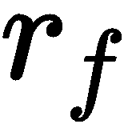的预期超额回报以来，风险因素一直是量化模型的关键成分。该模型采用以下线性形式:

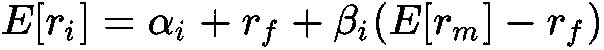

这不同于经典的基本面分析，如多德和格雷厄姆的分析，他们的回报取决于公司的特征。理由是，总体而言，投资者无法通过分散投资来消除这种所谓的系统性风险。因此，在均衡状态下，他们要求为持有与其系统风险相称的资产提供补偿。该模型意味着，在价格立即反映所有公共信息的有效市场中，不应该有更高的风险调整回报率，也就是说，的值应该为零。

该模型的实证测试使用线性回归，但一直失败，引发了一场辩论，是有效市场还是联合假说的单因素方面应该受到指责。事实证明，这两个前提可能都是错误的:

*   约瑟夫·斯蒂格利茨(Joseph Stiglitz)获得了 2001 年诺贝尔经济学奖，部分原因是他证明了市场通常不是完全有效的:如果市场是有效的，那么收集数据就没有价值，因为这些信息已经反映在价格中了。然而，如果没有收集信息的动机，就很难看出信息应该如何反映在价格中。
*   另一方面，CAPM 的理论和实证改进表明，额外的因素有助于解释一些异常现象，这些异常现象存在于不依赖于整体市场风险的较高风险调整回报中，例如较小公司的较高回报。

斯蒂芬·罗斯在 1976 年提出了套利定价理论，作为一种替代方案，它考虑到了多种风险因素，同时避开了市场效率。与资本资产定价模型相反，它假设由于错误定价而获得高回报的机会可能存在，但会很快被套利交易消除。该理论并没有具体说明这些因素，但作者的研究表明，最重要的是通货膨胀和工业生产的变化，以及风险溢价或利率期限结构的变化。

肯尼斯·弗伦奇(Kenneth French)和尤金·法玛(Eugene Fama，2013 年诺贝尔奖得主)发现了依赖于公司特征的额外风险因素，这些因素如今被广泛使用。1993 年，Fama-French 三因素模型将企业的相对规模和价值添加到单一 CAPM 风险源中。2015 年，五因素模型进一步扩大了范围，纳入了公司盈利能力和投资水平，这些都是在中间几年显示出的重要因素。此外，许多因素模型包括一个价格动量因素。

Fama-French 风险因子是根据反映给定风险因子的指标，作为具有高或低值的多样化投资组合的回报差异来计算的。这些回报是通过根据这些指标对股票进行分类，然后在某个百分点以上做多股票，在某个百分点以下做空股票而获得的。与风险因素相关的指标定义如下:

*   **规模** : **市值** ( **我**)
*   **价值** : **股权账面价值** ( **BE** )除以本人
*   **营业利润率(OP)** :收入减去销货成本/资产
*   **投资**:投资/资产

还有非监督学习技术，用于使用因子和主成分分析进行数据驱动的风险因素发现，我们将在第 12 章、*的[非监督学习中探讨。](12.html)*

# 获取风险因素

Fama 和 French 通过他们的网站提供更新的风险因素和研究组合数据，你可以使用`pandas_datareader`库来获得这些数据。对于该应用，请参考`fama_macbeth.ipynb`笔记本了解更多详情。

具体来说，我们将使用五个 Fama-French 因子，这是通过首先将股票分为三个大小组，然后为其余三个公司特定因子中的每一个分为两个大小组而得到的。因此，这些因素涉及三组价值加权投资组合，按规模和账面市值比、规模和运营盈利能力以及规模和投资进行 3 x 2 排序。风险因子值计算为**投资组合** ( **PF** )的平均回报，如下表所示:

| **概念** | **标签** | **名称** | **风险系数计算** |
| 大小 | 服务器信息块 | 小减去大 | 九个小股票 PF 减去九个大股票 PF |
| 价值 | HML | 高减去低 | 
两个值 PF 减去两个增长值(具有低 BE/ME 值)PF |
| 收益性 | RMW | 强健减去虚弱 | 两个鲁棒 OP PF 减去两个弱 OP PF |
| 投资 | 军事委员会(Committee of Military Affairs) | 保守减去激进 | 两个保守投资组合减去两个激进投资组合 |
| 市场 | Rm-Rf | 市场超额回报 | 所有在美国主要交易所注册并上市的公司的价值权重回报减去一个月期国库券利率 |

我们将使用我们在 2010-2017 年期间获得的每月频率的回报，如下所示:

```
import pandas_datareader.data as web
ff_factor = 'F-F_Research_Data_5_Factors_2x3'
ff_factor_data = web.DataReader(ff_factor, 'famafrench', start='2010', end='2017-12')[0]
ff_factor_data.info()

PeriodIndex: 96 entries, 2010-01 to 2017-12
Freq: M
Data columns (total 6 columns):
Mkt-RF 96 non-null float64
SMB 96 non-null float64
HML 96 non-null float64
RMW 96 non-null float64
CMA 96 non-null float64
RF 96 non-null float64
```

Fama 和 French 还提供了许多投资组合，我们可以用它们来说明对因子暴露的估计，以及给定时间段内市场上可用的风险溢价的值。我们将以每月一次的频率使用 17 个行业组合的面板。我们将从回报中减去无风险利率，因为因子模型适用于超额回报:

```
ff_portfolio = '17_Industry_Portfolios'
ff_portfolio_data = web.DataReader(ff_portfolio, 'famafrench', start='2010', end='2017-12')[0]
ff_portfolio_data = ff_portfolio_data.sub(ff_factor_data.RF, axis=0)
ff_factor_data = ff_factor_data.drop('RF', axis=1)
ff_portfolio_data.info()

PeriodIndex: 96 entries, 2010-01 to 2017-12
Freq: M
Data columns (total 17 columns):
Food     96 non-null float64
Mines    96 non-null float64
Oil      96 non-null float64
...
Rtail    96 non-null float64
Finan    96 non-null float64
Other    96 non-null float64
```

我们现在将建立一个基于面板数据的线性因素模型，使用一种方法来解决一些基本线性回归假设的失败。

# Fama-Macbeth 回归

给定风险因素和投资组合回报的数据，估计投资组合的风险敞口是有用的，即风险因素推动投资组合回报的程度，以及给定因素的风险敞口值多少，即市场的风险因素溢价是多少。如果因素暴露是已知的或可以假设的，那么风险溢价允许估计任何投资组合的回报。

更正式地说，我们将有 *i=1，...，N* 资产或投资组合收益超过 *t=1，...，T* 个周期和每项资产的超额周期收益将表示为。目标是测试 *j 是否=1、...，M* 因子解释了超额收益和与每个因子相关的风险溢价。在我们的例子中，我们有 *N=17* 个投资组合和 *M=5* 个因子，每个因子有=96 个数据周期。

因子模型是对给定时期内许多股票的估计。在这种横截面回归中，推断问题可能会出现，因为经典线性回归的基本假设可能不成立。潜在的违规包括测量误差、由于异方差和序列相关性导致的残差协变以及多重共线性。

为了解决由残差的相关性引起的推断问题，Fama 和 MacBeth 提出了一种两步方法来对要素收益进行横截面回归。两阶段 Fama-Macbeth 回归旨在估计市场对特定风险因素的暴露所奖励的溢价。这两个阶段包括:

*   **第一阶段** : *N* 时间序列回归，对每个资产或投资组合的超额收益进行一次因子回归，以估计因子负荷。以矩阵形式，对于每项资产:

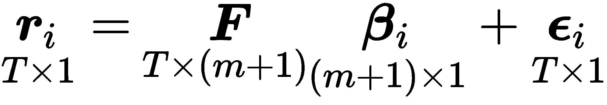

*   **第二阶段** : T 个横截面回归，每个时间段一个，估算风险溢价。在矩阵形式中，我们获得每个时期风险溢价的向量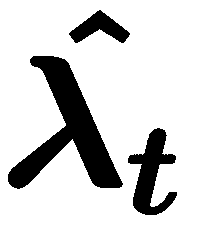:

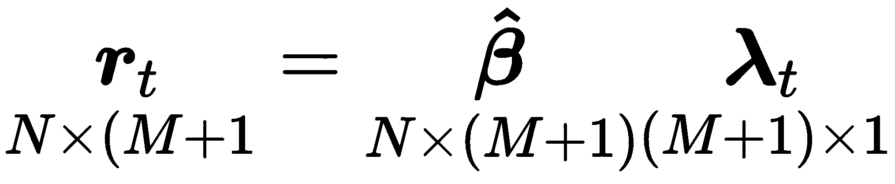

现在，我们可以将因子风险溢价计算为时间平均值，并使用 t 统计量来评估它们各自的显著性，假设风险溢价估计值随时间独立: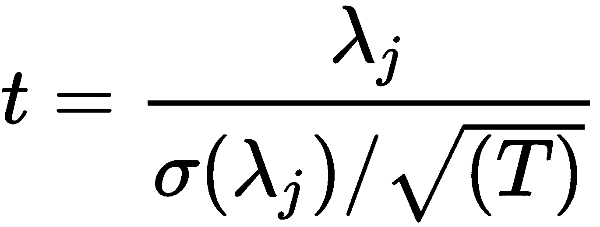。

如果我们有一个非常大的和代表性的交易风险因素的数据样本，我们可以使用样本均值作为风险溢价估计。然而，我们通常没有足够长的历史，样本平均值周围的误差幅度可能相当大。Fama-Macbeth 方法利用因子与其他资产的协方差来确定因子溢价。资产回报的二阶矩比一阶矩更容易估计，获得更精细的数据可以大大提高估计，而均值估计则不然。

我们可以实施第一阶段来获得 17 个因子的载荷估计值，如下所示:

```
betas = []
for industry in ff_portfolio_data:
    step1 = OLS(endog=ff_portfolio_data[industry],
                exog=add_constant(ff_factor_data)).fit()
    betas.append(step1.params.drop('const'))

betas = pd.DataFrame(betas,
                     columns=ff_factor_data.columns,
                     index=ff_portfolio_data.columns)
betas.info()
Index: 17 entries, Food  to Other
Data columns (total 5 columns):
Mkt-RF    17 non-null float64
SMB       17 non-null float64
HML       17 non-null float64
RMW       17 non-null float64
CMA       17 non-null float64
```

在第二阶段，我们对投资组合横截面的周期回报进行了 96 次回归，回归的因素为:

```
lambdas = []
for period in ff_portfolio_data.index:
    step2 = OLS(endog=ff_portfolio_data.loc[period, betas.index],
                exog=betas).fit()
    lambdas.append(step2.params)

lambdas = pd.DataFrame(lambdas,
                       index=ff_portfolio_data.index,
                       columns=betas.columns.tolist())
lambdas.info()
PeriodIndex: 96 entries, 2010-01 to 2017-12
Freq: M
Data columns (total 5 columns):
Mkt-RF    96 non-null float64
SMB       96 non-null float64
HML       96 non-null float64
RMW       96 non-null float64
CMA       96 non-null float64
```

最后，我们计算 96 个周期的平均值，以获得我们的因素风险溢价估计值:

```
lambdas.mean()
Mkt-RF    1.201304
SMB       0.190127
HML      -1.306792
RMW      -0.570817
CMA      -0.522821
```

`linear_models`库用面板数据的各种模型扩展了`statsmodels`,还实现了两阶段 Fama-MacBeth 程序:

```
model = LinearFactorModel(portfolios=ff_portfolio_data, 
                          factors=ff_factor_data)
res = model.fit()
```

这为我们提供了相同的结果:


线性因子模型估计摘要

随附的笔记本通过使用行业模型说明了分类变量在估计一大组个股的风险溢价时的用途。

# 收缩方法:线性回归的正则化

当满足高斯-马尔可夫假设时，训练线性回归模型的最小二乘法将产生最佳的、线性的和无偏的系数估计。即使违反了关于误差协方差矩阵的 OLS 假设，像 GLS 这样的变化也表现得很好。然而，有一些估计器会产生有偏的系数来减少方差，以实现更低的总体泛化误差。

当一个线性回归模型包含许多相关变量时，它们的系数将很难确定，因为一个大的正系数对 RSS 的影响可以被一个相关变量的类似的大的负系数抵消。因此，由于系数的这种变动空间，模型将具有高方差的趋势，这增加了模型过度拟合样本的风险。

# 如何对冲过度拟合

控制过拟合的一种流行技术是**正则化**，它包括向误差函数添加惩罚项，以阻止系数达到大值。换句话说，对系数的大小限制可以减轻对样本外预测的潜在负面影响。我们会遇到所有模型的正则化方法，因为过度拟合是一个如此普遍的问题。

在本节中，我们将介绍收缩方法，该方法针对两个动机来改进迄今为止讨论的线性模型方法:

*   **预测精度**:最小二乘估计的低偏差但高方差表明，可以通过收缩或将一些系数设置为零来减少泛化误差，从而以稍高的偏差换取模型方差的减少。
*   **解释**:大量的预测因素可能会使结果的整体解释或交流变得复杂。牺牲一些细节来将模型限制到具有最强效果的参数的较小子集可能是更可取的。

收缩模型通过对回归系数的大小施加惩罚来限制回归系数。这些模型通过向目标函数添加一项来实现这一目标，使得收缩模型的系数最小化 RSS 加上与系数的(绝对)大小正相关的惩罚。增加的惩罚将寻找线性回归系数转变为约束最小化问题，该问题通常采用以下拉格朗日形式:

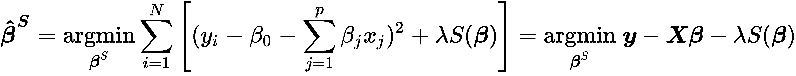

正则化参数λ决定了惩罚效果的大小，即正则化的强度。一旦λ为正，系数将不同于无约束最小二乘参数，这意味着有偏估计。应该使用交叉验证来自适应地选择超参数λ，以最小化预期预测误差的估计。

收缩模型的不同之处在于它们计算惩罚的方式，即 s 的函数形式。最常见的版本是岭回归，它使用系数的平方和，而 lasso 模型将惩罚基于系数的绝对值之和。

# 岭回归的工作原理

岭回归通过向目标函数添加罚值来缩小回归系数，该罚值等于系数的平方和，这又对应于系数向量的 L <sup>2</sup> 范数:

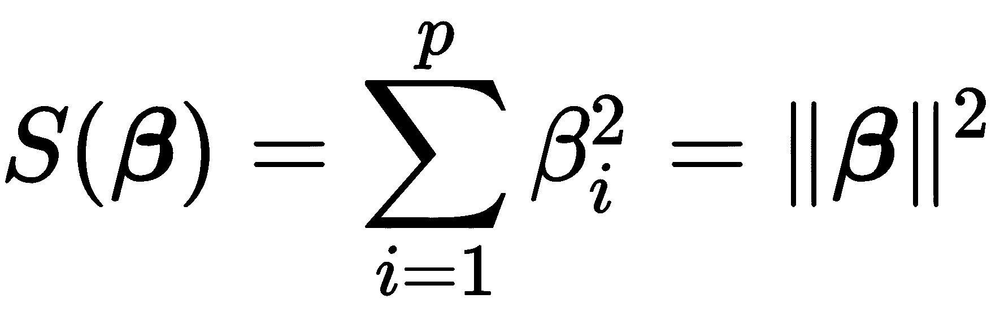

因此，脊系数定义为:

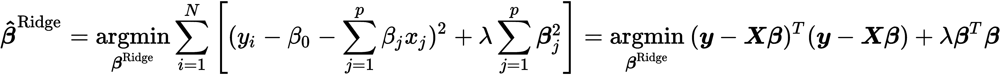

截距已从惩罚中排除，以使程序独立于为输出变量选择的原点，否则，向所有输出值添加常数将改变所有斜率参数，而不是平行移动。

重要的是通过从每个输入中减去相应的平均值并将结果除以输入的标准差来标准化输入，因为岭解对输入的比例很敏感。岭估计量也有一个类似于 OLS 情形的封闭解:

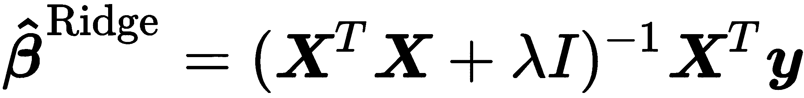

解决方案是在求逆之前将缩放后的单位矩阵λ *I* 加到 *X <sup>T</sup> X* 上，保证了问题的非奇异性，即使*X<sup>T</sup>T*T10】X 没有满秩。这是最初引入这种估计器时使用它的动机之一。

脊罚导致所有参数成比例收缩。在**正交输入**的情况下，岭估计只是最小二乘估计的缩放版本，即:

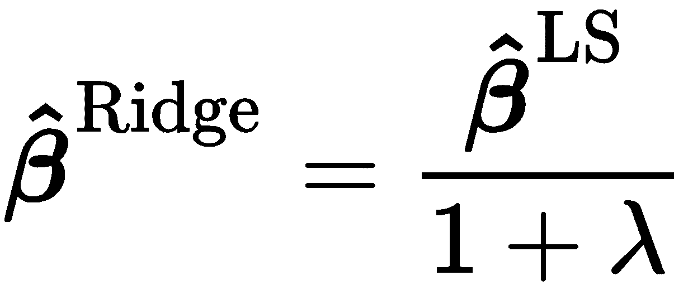

使用输入矩阵 *X* 的**奇异值分解** ( **SVD** )，我们可以深入了解在输入不正交的更常见情况下，收缩如何影响输入。居中矩阵的 SVD 表示矩阵的主要成分(参见[第 11 章](11.html)、*梯度提升机器*，关于无监督学习)，其以方差的降序捕获数据的列空间中不相关的方向。

岭回归收缩与数据中方差较小的方向相关联的输入变量的系数，比收缩与方差较大的方向相关联的输入变量的系数要大。因此，岭回归的隐含假设是，在预测输出时，数据中变化最大的方向将是最有影响或最可靠的。

# 套索回归如何工作

lasso 在信号处理中被称为基追踪，它也通过向残差的平方和添加惩罚来缩小系数，但 lasso 惩罚的效果略有不同。套索惩罚是系数向量的绝对值之和，对应于它的 L <sup>1</sup> 范数。因此，套索估计由下式定义:

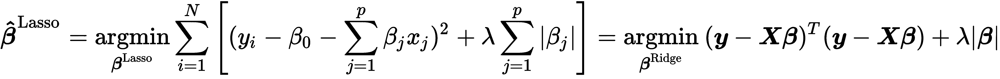

与岭回归类似，输入需要标准化。套索罚函数使解成为非线性的，系数没有像岭回归中那样的封闭表达式。相反，套索解是一个二次规划问题，并且有可用的有效算法来计算不同λ值的系数的整个路径，其计算成本与岭回归相同。

套索惩罚的效果是随着正则化的增加，逐渐将一些系数减少到零。因此，套索可用于连续选择要素子集。

# 如何使用线性回归预测收益

笔记本`linear_regression.ipynb`包含使用 OLS 和`statsmodels`和`sklearn`预测股票价格的例子，以及山脊和套索模型。它被设计为在量子研究平台上作为笔记本运行，并依赖于在[第 4 章](04.html)、*阿尔法因子研究*中介绍的`factor_library`。

# 准备数据

我们需要选择一个股票领域和一个时间范围，建立和转换我们将用作特征的阿尔法因子，计算我们旨在预测的远期回报，并可能清理我们的数据。

# 宇宙创造和时间范围

我们将使用 2014 年和 2015 年的股票数据，这些数据来自一个自定义的`Q100US`宇宙，该宇宙使用内置的过滤器、因子和分类器来选择 100 只股票，这些股票在过去 200 个交易日中具有最高的平均美元交易量，并通过额外的默认标准进行过滤(有关详细信息，请参见 GitHub 上链接的 Quantopian 文档)。宇宙根据过滤标准动态更新，因此，尽管在任何给定时间点有 100 只股票，但样本中可能有超过 100 只不同的股票:

```
def Q100US():
    return filters.make_us_equity_universe(
        target_size=100,
        rankby=factors.AverageDollarVolume(window_length=200),
        mask=filters.default_us_equity_universe_mask(),
        groupby=classifiers.fundamentals.Sector(),
        max_group_weight=0.3,
        smoothing_func=lambda f: f.downsample('month_start'),
    )
```

# 目标回报计算

我们将测试各种`lookahead`期的预测，以确定产生最佳可预测性的最佳持有期，通过信息系数衡量。更具体地说，我们使用内置的`Returns`函数计算 1 天、5 天、10 天和 20 天的回报，结果是在两年内对 100 只股票进行了超过 50，000 次观察(每只股票包括大约 252 个交易日):

```
lookahead = [1, 5, 10, 20]
returns = run_pipeline(Pipeline({'Returns{}D'.format(i): Returns(inputs=[USEquityPricing.close],
                                          window_length=i+1, mask=UNIVERSE) for i in lookahead},
                                screen=UNIVERSE),
                       start_date=START,
                       end_date=END)
return_cols = ['Returns{}D'.format(i) for i in lookahead]
returns.info()

MultiIndex: 50362 entries, (2014-01-02 00:00:00+00:00, Equity(24 [AAPL])) to (2015-12-31 00:00:00+00:00, Equity(47208 [GPRO]))
Data columns (total 4 columns):
Returns10D    50362 non-null float64
Returns1D     50362 non-null float64
Returns20D    50360 non-null float64
Returns5D     50362 non-null float64
```

# 阿尔法因子选择和转换

我们将使用 50 多种功能，涵盖基于市场、基本面和替代数据的广泛因素。该笔记本还包括自定义转换，将通常在季度报告频率中提供的基本数据转换为滚动年度总计或平均值，以避免过度的季节波动。

一旦通过[第 4 章](04.html)、*阿尔法因子研究*中概述的各种渠道计算出因子，我们就使用`pd.concat()`将它们组合起来，分配索引名称，并创建一个分类变量来识别每个数据点的资产:

```
data = pd.concat([returns, value_factors, momentum_factors,
                  quality_factors, payout_factors, growth_factors,
                  efficiency_factors, risk_factors], axis=1).sortlevel()
data.index.names = ['date', 'asset']
data['stock'] = data.index.get_level_values('asset').map(lambda x: x.asset_name)
```

# 数据清理–缺失数据

在下一步中，我们删除缺少 20%以上观察值的行和列，导致丢失 6%的观察值和三列:

```
rows_before, cols_before = data.shape
data = (data
        .dropna(axis=1, thresh=int(len(data) * .8))
        .dropna(thresh=int(len(data.columns) * .8)))
data = data.fillna(data.median())
rows_after, cols_after = data.shape
print('{:,d} rows and {:,d} columns dropped'.format(rows_before - rows_after, cols_before - cols_after))
2,985 rows and 3 columns dropped
```

此时，我们有 51 个特征和股票的分类标识符:

```
data.sort_index(1).info()

MultiIndex: 47377 entries, (2014-01-02, Equity(24 [AAPL])) to (2015-12-
                            31, Equity(47208 [GPRO]))
Data columns (total 52 columns):
AssetToEquityRatio             47377 non-null float64
AssetTurnover                  47377 non-null float64
CFO To Assets                  47377 non-null float64
...
WorkingCapitalToAssets         47377 non-null float64
WorkingCapitalToSales          47377 non-null float64
stock                          47377 non-null object
dtypes: float64(51), object(1)
```

# 数据探索

对于线性回归模型，探索要素之间的相关性以识别多重共线性问题以及检查要素和目标之间的相关性非常重要。笔记本包含 seaborn 聚类图，该聚类图显示了特征相关性矩阵的分层结构。它识别少量高度相关的聚类。

# 分类变量的虚拟编码

我们需要将分类变量`stock`转换成数字格式，以便线性回归可以处理它。为此，我们使用虚拟编码为每个类别级别创建单独的列，并在原始分类列中用条目`1`标记该级别的存在，否则用`0`标记。Pandas函数`get_dummies()`自动执行虚拟编码。它检测并正确转换类型对象的列，如下图所示。例如，如果包含整数的列需要虚拟变量，可以使用关键字`columns`来标识它们:

```
df = pd.DataFrame({'categories': ['A','B', 'C']})

  categories
0          A
1          B
2          C

pd.get_dummies(df)

   categories_A  categories_B  categories_C
0             1             0             0
1             0             1             0
2             0             0             1
```

当将所有类别转换为虚拟变量并用截距估计模型时(通常会这样)，您会无意中创建多重共线性:矩阵现在包含冗余信息，不再具有满秩，也就是说，变得单一。通过删除一个新的指示器列，可以很容易地避免这种情况。缺失类别级别上的系数现在将被截距捕获(当每隔一个类别哑元为`0`时，截距始终为`1`)。使用`drop_first`关键字相应地修正虚拟变量:

```
pd.get_dummies(df, drop_first=True)

   categories_B  categories_C
0             0             0
1             1             0
2             0             1
```

应用于我们的组合特征和回报，我们获得 181 列，因为有超过 100 只股票，因为宇宙定义自动更新股票选择:

```
X = pd.get_dummies(data.drop(return_cols, axis=1), drop_first=True)
X.info()

MultiIndex: 47377 entries, (2014-01-02 00:00:00+00:00, Equity(24 [AAPL])) to (2015-12-31 00:00:00+00:00, Equity(47208 [GPRO]))
Columns: 181 entries, DividendYield to stock_YELP INC
dtypes: float64(182)
memory usage: 66.1+ MB
```

# 创建远期回报

目标是预测给定持有期的回报。因此，我们需要将具有回报值的特征与每个股票未来 1、5、10 或 20 天的相应回报数据点对应起来。我们通过将 pandas `.groupby()`方法与`.shift()`方法相结合来实现这一点，如下所示:

```
y = data.loc[:, return_cols]
shifted_y = []
for col in y.columns:
    t = int(re.search(r'\d+', col).group(0))
    shifted_y.append(y.groupby(level='asset')['Returns{}D'.format(t)].shift(-t).to_frame(col))
y = pd.concat(shifted_y, axis=1)
y.info()

MultiIndex: 47377 entries, (2014-01-02, Equity(24 [AAPL])) to (2015-12-31, Equity(47208 [GPRO]))
Data columns (total 4 columns):
Returns1D     47242 non-null float64
Returns5D     46706 non-null float64
Returns10D    46036 non-null float64
Returns20D    44696 non-null float64
dtypes: float64(4)
```

现在每个收益序列都有不同数量的观察值，因为向前移动在每个股票的尾端都产生了缺失值。

# 使用统计模型的线性 OLS 回归

如前所述，我们可以使用带有`statsmodels`的 OLS 来估计线性回归模型。我们选择一个远期回报，例如 10 天的持有期，去除低于 2.5%和高于 97.5%百分点的异常值，并相应地拟合模型:

```
target = 'Returns10D'
model_data = pd.concat([y[[target]], X], axis=1).dropna()
model_data = model_data[model_data[target].between(model_data[target].quantile(.025), 
                                                   model_data[target].quantile(.975))]

model = OLS(endog=model_data[target], exog=model_data.drop(target, axis=1))
trained_model = model.fit()
trained_model.summary()
```

# 诊断统计

由于变量的数量很大，为了节省空间，可以将摘要放在笔记本中。诊断统计表明，鉴于 jar que-Bera 统计的高 p 值，不能拒绝残差呈正态分布的假设。

然而，Durbin-Watson 统计值较低，为 1.5，因此我们可以在 5%的水平上轻松拒绝无自相关的零假设。因此，标准误差可能是正相关的。如果我们的目标是了解哪些因素与远期回报显著相关，我们将需要使用稳健的标准误差(`statsmodels .fit()`方法中的一个参数)重新运行回归，或者使用完全不同的方法，例如允许更复杂误差协方差的面板模型。

# 使用 sklearn 的线性 OLS 回归

由于 sklearn 是针对预测而定制的，因此我们将使用交叉验证，根据线性回归模型的预测性能对其进行评估。

# 自定义时间序列交叉验证

我们的数据由分组的时间序列数据组成，这些数据需要自定义的交叉验证功能来提供训练和测试指数，以确保测试数据紧跟每个股票的训练数据，并且我们不会无意中产生前瞻偏差或泄漏。

我们可以使用下面的函数来实现这一点，该函数返回一个产生训练和测试日期对的`generator`。确保培训期间最短长度的一组培训日期。对数取决于参数`nfolds`。不同的测试时段不重叠，并且位于数据中可用时段的末尾。在使用测试周期后，它成为训练数据的一部分，其大小相应地增长:

```
def time_series_split(d=model_data, nfolds=5, min_train=21):
    """Generate train/test dates for nfolds 
    with at least min_train train obs
    """
    train_dates = d[:min_train].tolist()
    n = int(len(dates)/(nfolds + 1)) + 1
    test_folds = [d[i:i + n] for i in range(min_train, len(d), n)]
    for test_dates in test_folds:
        if len(train_dates) > min_train:
            yield train_dates, test_dates
        train_dates.extend(test_dates)
```

# 选择功能和目标

我们需要选择适当的回报序列(我们将再次使用 10 天的持有期)并去除异常值。我们还会将收益转换为对数收益，如下所示:

```
target = 'Returns10D'
outliers = .01
model_data = pd.concat([y[[target]], X], axis=1).dropna().reset_index('asset', drop=True)
model_data = model_data[model_data[target].between(*model_data[target].quantile([outliers, 1-outliers]).values)]

model_data[target] = np.log1p(model_data[target])
features = model_data.drop(target, axis=1).columns
dates = model_data.index.unique()

DatetimeIndex: 45114 entries, 2014-01-02 to 2015-12-16
Columns: 183 entries, Returns10D to stock_YELP INC
dtypes: float64(183)
```

# 交叉验证模型

我们将使用 250 倍来预测大约 2 天的远期回报，跟随历史训练数据，其长度将逐渐增加。每次迭代从我们定制的交叉验证函数中获得适当的训练和测试数据，选择相应的特性和目标，然后进行相应的训练和预测。我们获得了均方根误差以及实际值和预测值之间的 Spearman 等级相关性:

```
nfolds = 250
lr = LinearRegression()

test_results, result_idx, preds = [], [], pd.DataFrame()
for train_dates, test_dates in time_series_split(dates, nfolds=nfolds):
    X_train = model_data.loc[idx[train_dates], features]
    y_train = model_data.loc[idx[train_dates], target]
    lr.fit(X=X_train, y=y_train)

    X_test = model_data.loc[idx[test_dates], features]
    y_test = model_data.loc[idx[test_dates], target]
    y_pred = lr.predict(X_test)

    rmse = np.sqrt(mean_squared_error(y_pred=y_pred, y_true=y_test))
    ic, pval = spearmanr(y_pred, y_test)

    test_results.append([rmse, ic, pval])
    preds = preds.append(y_test.to_frame('actuals').assign(predicted=y_pred))
    result_idx.append(train_dates[-1])
```

# 测试结果-信息系数和 RMSE

我们已经从 250 次折叠中捕捉到了测试预测，并可以计算出整体和 21 天的滚动平均值:

```
fig, axes = plt.subplots(nrows=2)
rolling_result = test_result.rolling(21).mean()
rolling_result[['ic', 'pval']].plot(ax=axes[0], title='Information Coefficient')
axes[0].axhline(test_result.ic.mean(), lw=1, ls='--', color='k')
rolling_result[['rmse']].plot(ax=axes[1], title='Root Mean Squared Error')
axes[1].axhline(test_result.rmse.mean(), lw=1, ls='--', color='k')
```

我们获得了下面的图表，该图表突出了 IC 和 RMSE 的负相关性以及它们各自的值:


图表突出了 IC 和 RMSE 的负相关性

对于整个期间，我们看到通过实际和预测回报的等级相关性测量的信息系数是弱正的，并且在统计上是显著的:

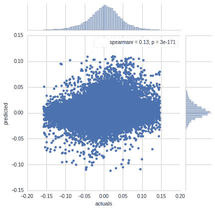

# 使用 sklearn 的岭回归

对于岭回归，我们需要用关键字`alpha`调整正则化参数，该关键字对应于我们之前使用的λ。我们将以对数步长尝试从 10 <sup>-5</sup> 到 10 <sup>5</sup> 的 21 个值。

脊罚的比例敏感性要求我们使用`StandardScaler`对输入进行标准化。请注意，我们总是使用`.fit_transform()`方法从训练集中学习均值和标准差，然后使用`.transform()`方法将这些学习到的参数应用到测试集中。

# 使用交叉验证调整正则化参数

然后，我们继续使用`250`折叠再次交叉验证超参数值，如下所示:

```
nfolds = 250
alphas = np.logspace(-5, 5, 21)
scaler = StandardScaler()

ridge_result, ridge_coeffs = pd.DataFrame(), pd.DataFrame()
for i, alpha in enumerate(alphas):
    coeffs, test_results = [], []
    lr_ridge = Ridge(alpha=alpha)
    for train_dates, test_dates in time_series_split(dates, nfolds=nfolds):
        X_train = model_data.loc[idx[train_dates], features]
        y_train = model_data.loc[idx[train_dates], target]
        lr_ridge.fit(X=scaler.fit_transform(X_train), y=y_train)
        coeffs.append(lr_ridge.coef_)

        X_test = model_data.loc[idx[test_dates], features]
        y_test = model_data.loc[idx[test_dates], target]
        y_pred = lr_ridge.predict(scaler.transform(X_test))

        rmse = np.sqrt(mean_squared_error(y_pred=y_pred, y_true=y_test))
        ic, pval = spearmanr(y_pred, y_test)

        test_results.append([train_dates[-1], rmse, ic, pval, alpha])
    test_results = pd.DataFrame(test_results, columns=['date', 'rmse', 'ic', 'pval', 'alpha'])
    ridge_result = ridge_result.append(test_results)
    ridge_coeffs[alpha] = np.mean(coeffs, axis=0)
```

# 交叉验证结果和岭系数路径

现在，我们可以绘制每个超参数值获得的信息系数，并可视化系数值如何随着正则化的增加而演变。结果表明，当λ=10 时，IC 值最高。对于这种级别的正则化，右侧面板显示，与(几乎)无约束模型相比，系数已经显著缩小，其中 *λ=10 <sup>-5</sup>* :

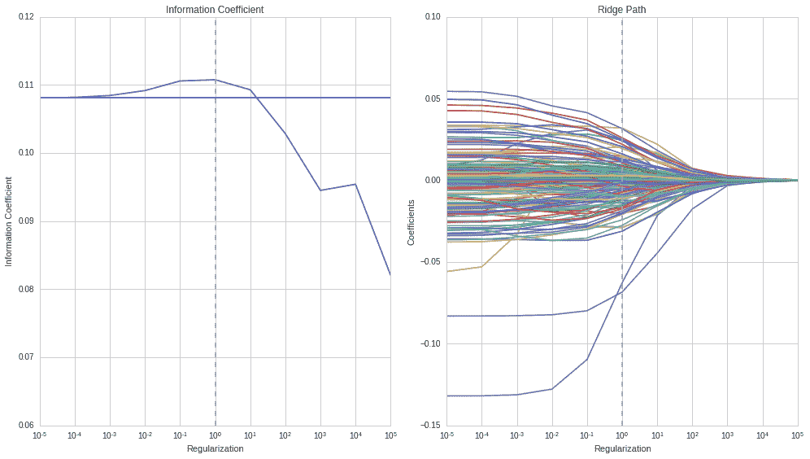

交叉验证结果和岭系数路径

# 前 10 个系数

系数的标准化允许我们通过比较它们的绝对大小来得出它们的相对重要性的结论。10 个最相关的系数是:


前 10 个系数

# 使用 sklearn 进行套索回归

lasso 实现看起来非常类似于我们刚刚运行的 ridge 模型。主要区别在于，lasso 需要使用迭代坐标下降来获得解决方案，而 ridge 可以依赖于封闭形式的解决方案:

```
nfolds = 250
alphas = np.logspace(-8, -2, 13)
scaler = StandardScaler()

lasso_results, lasso_coeffs = pd.DataFrame(), pd.DataFrame()
for i, alpha in enumerate(alphas):
    coeffs, test_results = [], []
    lr_lasso = Lasso(alpha=alpha)
    for i, (train_dates, test_dates) in enumerate(time_series_split(dates, nfolds=nfolds)):
        X_train = model_data.loc[idx[train_dates], features]
        y_train = model_data.loc[idx[train_dates], target]
        lr_lasso.fit(X=scaler.fit_transform(X_train), y=y_train)

        X_test = model_data.loc[idx[test_dates], features]
        y_test = model_data.loc[idx[test_dates], target]
        y_pred = lr_lasso.predict(scaler.transform(X_test))

        rmse = np.sqrt(mean_squared_error(y_pred=y_pred, y_true=y_test))
        ic, pval = spearmanr(y_pred, y_test)

        coeffs.append(lr_lasso.coef_)
        test_results.append([train_dates[-1], rmse, ic, pval, alpha])
    test_results = pd.DataFrame(test_results, columns=['date', 'rmse', 'ic', 'pval', 'alpha'])
    lasso_results = lasso_results.append(test_results)
    lasso_coeffs[alpha] = np.mean(coeffs, axis=0)
```

# 交叉验证的信息系数和套索路径

如前所述，我们可以绘制交叉验证期间使用的所有测试集的平均信息系数。我们再次看到，正则化改进了无约束模型的 IC，在*λ= 10<sup>-5</sup>T3 的水平上提供了最佳的样本外结果。最佳正则化值与岭回归非常不同，因为损失由绝对值之和组成，而不是相对较小的系数值的平方值。我们还可以看到，对于这个正则化级别，系数也类似地缩小了，如在岭回归的情况下:*


交叉验证的信息系数和套索路径

总之，山脊和套索将产生类似的结果。Ridge 通常计算速度更快，但 lasso 也会通过逐渐将系数减小到零来产生连续的要素子集选择，从而消除要素。

# 线性分类

到目前为止讨论的线性回归模型假设了一个定量的响应变量。在本节中，我们将重点关注用于推理和预测的定性输出变量的建模方法，这一过程被称为**分类**，在实践中甚至比回归更频繁出现。

预测数据点的定性响应被称为**分类**该观察，因为它涉及将观察分配到一个类别或类。在实践中，分类方法通常预测定性变量的每个类别的概率，然后使用该概率来决定正确的分类。

我们可以忽略输出变量假定为离散值的事实来处理分类问题，并应用线性回归模型来尝试使用多个输入变量预测分类输出。然而，很容易构造出这种方法表现很差的例子。此外，当我们知道*y∈【0，1】*时，模型产生大于 1 或小于 0 的值没有直观意义。

有许多不同的分类技术或分类器可用于预测定性反应。在本节中，我们将介绍与线性回归密切相关的广泛使用的逻辑回归。我们将在接下来的章节中讨论更复杂的方法，包括决策树和随机森林，以及梯度提升机器和神经网络。

# 逻辑回归模型

逻辑回归模型源于对给定函数在 *x* 中为线性的输出类的概率进行建模的愿望，就像线性回归模型一样，同时确保它们的总和为 1，并保持在【0，1】中，正如我们对概率的预期。

在本节中，我们将介绍逻辑回归模型的目标和函数形式，并描述训练方法。然后，我们说明了如何使用 statsmodels 对宏观数据使用逻辑回归进行统计推断，以及如何使用 sklearn 实现的正则化逻辑回归来预测价格变动。

# 目标函数

举例来说，我们将使用输出变量 y，如果在给定的时间范围 d 内股票回报为正，则该变量的值为 1，否则为 0:


我们可以很容易地将 y 扩展到三个类别，其中 0 和 2 反映了超过某个阈值的负和正价格变动，1 则不然。然而，逻辑回归不是对输出变量 *y* 建模，而是对给定阿尔法因子或特征向量的 y 属于任一类别的概率建模。换句话说，逻辑回归模拟了股票价格上涨的概率，取决于模型中包含的变量的值:


# 物流功能

为了防止模型产生[0，1]区间之外的值，我们必须使用一个函数对 *p(x)* 建模，该函数在 *x* 的整个域上仅给出 0 和 1 之间的输出。逻辑函数满足这一要求，并且总是产生一条 S 形曲线(见笔记本示例)，因此，不管 X 的值如何，我们都将获得一个合理的预测:

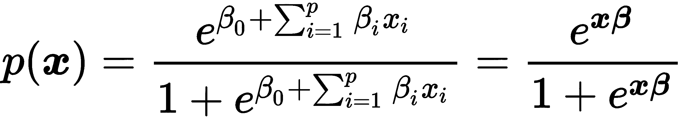

这里，向量 *x* 包括由第一组件、捕获的截距的 1。我们可以转换该表达式，以分离出看起来像线性回归的部分，从而得出:

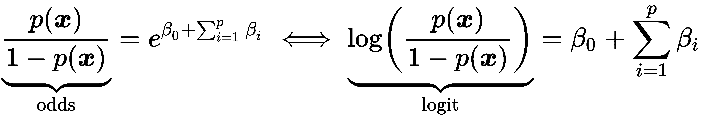

数量*p(x)/【1p(x)】*被称为**赔率**，这是一种表达概率的替代方式，可能在赌博中很常见，可以采用 0 到∞之间的任何值赔率，其中低值也意味着低概率，高值意味着高概率。

logit 也称为 log-odds(因为它是 odds 的对数)。因此，逻辑回归表示在 *x* 中是线性的 logit，看起来很像前面的线性回归。

# 最大似然估计

必须使用可用的训练数据来估计系数向量。虽然我们可以使用(非线性)最小二乘法来拟合逻辑回归模型，但更通用的最大似然法是首选方法，因为它具有更好的统计特性。正如我们刚刚讨论的，使用最大似然拟合逻辑回归模型背后的基本直觉是寻求对的估计，使得预测概率尽可能接近实际结果。换句话说，我们试图找到,使得这些估计在股票价格上涨的所有情况下都产生接近 1 的数字，否则产生接近 0 的数字。更正式地说，我们寻求最大化似然函数:


使用和比使用积更容易，所以让我们取两边的对数来得到对数似然函数和逻辑回归系数的相应定义:

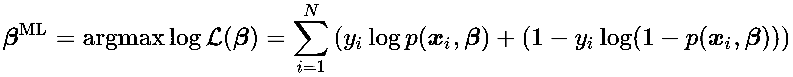

通过将相对于的导数设置为零来最大化该方程，产生 p+1 个所谓的分数方程，这些方程的参数是非线性的，可以使用凹对数似然函数的迭代数值方法来求解。

# 如何使用 statsmodels 进行推理

我们将基于一个包含 1959 年至 2009 年美国季度宏观数据的简单内置数据集，通过`statsmodels`说明如何使用逻辑回归(详见笔记本`logistic_regression_macro_data.ipynb`)。

下表列出了变量及其转换:

| **变量** | **描述** | **转换** |
| `realgdp` | 实际国内生产总值 | 年增长率 |
| `realcons` | 实际个人消费支出 | 年增长率 |
| `realinv` | 实际私人国内投资总额 | 年增长率 |
| `realgovt` | 实际联邦支出和总投资 | 年增长率 |
| `realdpi` | 实际私人可支配收入 | 年增长率 |
| `m1` | M1 名义货币存量 | 年增长率 |
| `tbilrate` | 月 3 日国库券利率 | 水平 |
| `unemp` | 季节性调整失业率(%) | 水平 |
| `infl` | 通货膨胀率 | 水平 |
| `realint` | 实际利率 | 水平 |

为了获得二元目标变量，我们计算季度实际 GDP 年增长率的 20 个季度滚动平均值。然后，如果当前增长率超过移动平均值，则我们指定 1，否则指定 0。最后，我们改变指标变量，使下一季度的结果与当前季度一致。

我们使用截距，将四分之一值转换为虚拟变量，并按如下方式训练逻辑回归模型:

```
import statsmodels.api as sm

data = pd.get_dummies(data.drop(drop_cols, axis=1), columns=['quarter'], drop_first=True).dropna()
model = sm.Logit(data.target, sm.add_constant(data.drop('target', axis=1)))
result = model.fit()
result.summary()
```

这为我们的具有 198 个观察值和 13 个变量(包括截距)的模型产生了以下总结:

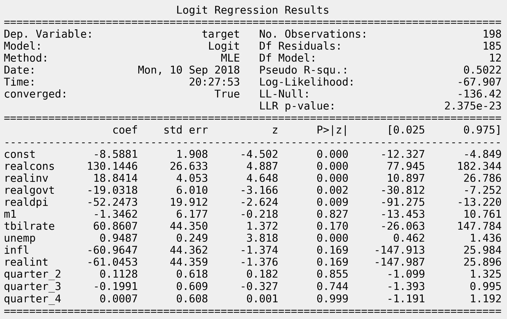

Logit 回归结果

该摘要表明该模型已经使用最大似然法进行了训练，并且提供了对数似然函数在-67.9 处的最大值。

当只包括截距时，LL-Null 值-136.42 是最大化对数似然函数的结果。它构成了伪 R <sup>2</sup> 统计量和对数- **似然比** ( **LLR** )检验的基础。

伪 R <sup>2</sup> 统计量替代了最小二乘法中常见的 R <sup>2</sup> 。它是基于零模型 m <sub>0</sub> 和全模型 m <sub>1</sub> 的最大化对数似然函数的比率计算的，如下所示:

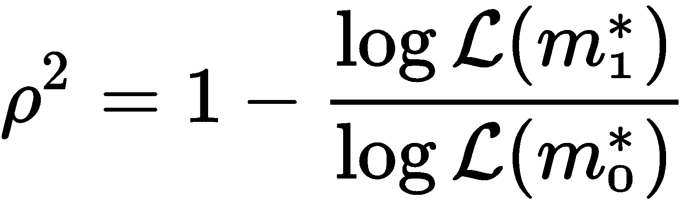

这些值从 0(当模型不能提高似然性时)到 1(当模型完全适合且对数似然性在 0 时最大)不等。因此，较高的值表示更好的拟合。

LLR 测试通常比较更严格的模型，计算如下:


零假设是限制模型表现更好，但低 p 值表明我们可以拒绝这一假设，更喜欢完整模型而不是零模型。这类似于线性回归的 f 检验(当我们使用 MLE 估计模型时，我们也可以使用 LLR 检验)。

z 统计量与 t 统计量在线性回归输出中的作用相同，其计算方法等同于系数估计值与其标准误差的比值。p 值还表示假设总体系数为零的零假设 *H <sub>0</sub> : β = 0* 时观察到检验统计量的概率。对于`intercept`、`realcons`、`realinv`、`realgovt`、`realdpi`和`unemp`，我们可以拒绝这个假设。

# 如何使用逻辑回归进行预测

套索 L <sub>1</sub> 罚值和岭 L <sub>2</sub> 罚值都可以与逻辑回归一起使用。它们具有与我们刚刚讨论的相同的收缩效应，套索可以再次用于任何线性回归模型的变量选择。

正如线性回归一样，标准化输入变量也很重要，因为正则化模型对比例很敏感。正则化超参数也需要在线性回归情况下使用交叉验证进行调整。

# 如何使用 sklearn 预测价格变动

我们继续价格预测的例子，但现在我们将结果变量二进制化，这样每当 10 天的回报为正时，它就取值 1，否则取值 0；参见子目录`stock_price_prediction`中的笔记本`logistic_regression.ipynb`:

```
target = 'Returns10D'
label = (y[target] > 0).astype(int).to_frame(target)
```

有了这个新的分类结果变量，我们现在可以使用默认的 L <sub>2</sub> 正则化来训练逻辑回归。对于逻辑回归，正则化公式与线性回归相反:λ值越高，正则化程度越低，反之亦然。我们使用交叉验证评估 11 个参数值，如下所示:

```
nfolds = 250
Cs = np.logspace(-5, 5, 11)
scaler = StandardScaler()

logistic_results, logistic_coeffs = pd.DataFrame(), pd.DataFrame()
for C in Cs:
    coeffs = []
    log_reg = LogisticRegression(C=C)
    for i, (train_dates, test_dates) in enumerate(time_series_split(dates, nfolds=nfolds)):
        X_train = model_data.loc[idx[train_dates], features]
        y_train = model_data.loc[idx[train_dates], target]
        log_reg.fit(X=scaler.fit_transform(X_train), y=y_train)

        X_test = model_data.loc[idx[test_dates], features]
        y_test = model_data.loc[idx[test_dates], target]
        y_pred = log_reg.predict_proba(scaler.transform(X_test))[:, 1]

        coeffs.append(log_reg.coef_.squeeze())
        logistic_results = (logistic_results
                            .append(y_test
                                    .to_frame('actuals')
                                    .assign(predicted=y_pred, C=C)))
    logistic_coeffs[C] = np.mean(coeffs, axis=0)
```

然后，我们使用上一章讨论的`roc_auc_score`来比较各种正则化参数的预测精度:

```
auc_by_C = logistic_results.groupby('C').apply(lambda x: roc_auc_score(y_true=x.actuals.astype(int), 
                                                         y_score=x.predicted))
```

我们可以再次沿着系数路径绘制超参数值范围的 AUC 结果，该结果显示了当系数在最佳正则化值 10 <sup>2</sup> 处有所收缩时预测准确性的提高:

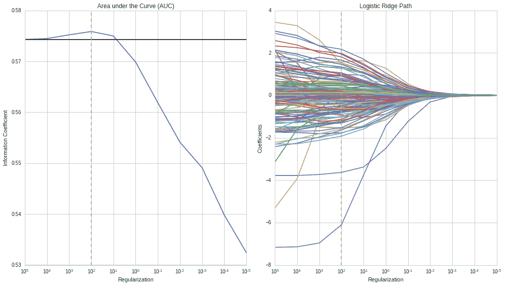

AUC 和 Logistic 岭路径

# 摘要

在这一章中，我们介绍了第一个机器学习模型，使用线性模型的重要基线情况进行回归和分类。我们探索了两个任务的目标函数的公式，了解了各种训练方法，并学习了如何使用该模型进行推理和预测。

我们应用这些新的机器学习技术来估计线性因素模型，这些模型对于管理风险、评估新的阿尔法因素和属性表现非常有用。我们还应用线性回归和分类来完成第一个预测任务，即预测股票收益的绝对值和方向。

在下一章中，我们将着眼于线性时间序列模型的重要主题，这些模型被设计来捕捉单变量和多变量情况下的序列相关模式。我们还将学习新的交易策略，因为我们基于捕捉两个股票价格序列之间动态相关性的协整概念来探索配对交易。