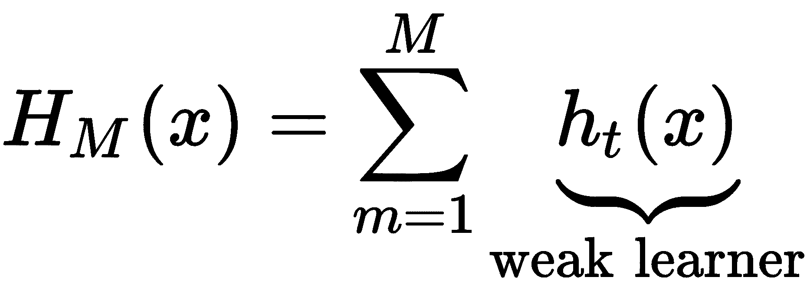
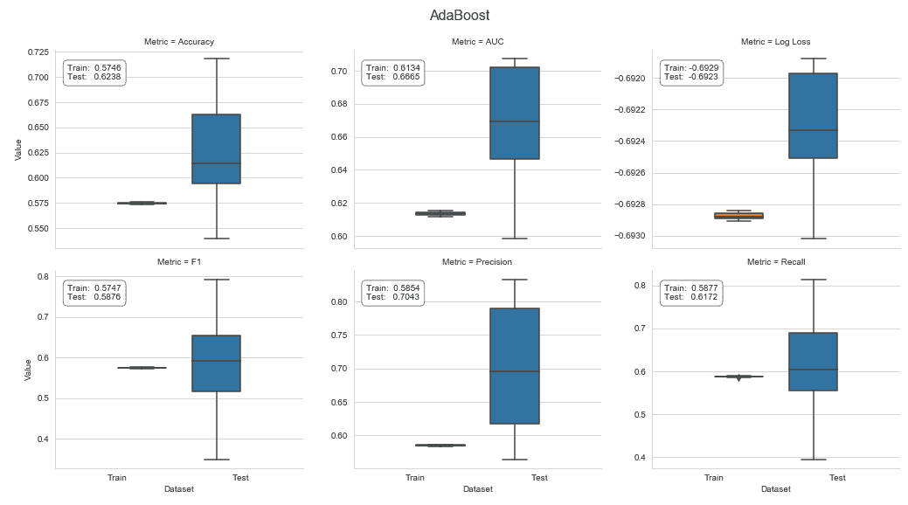
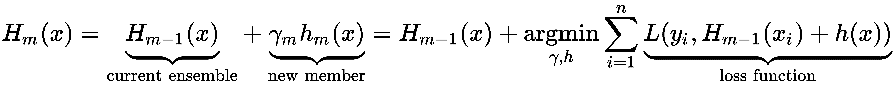
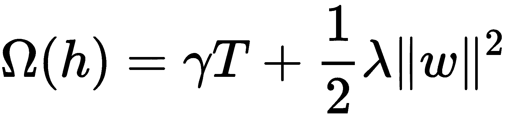
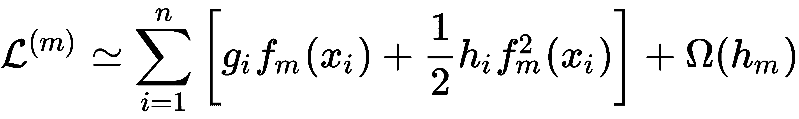
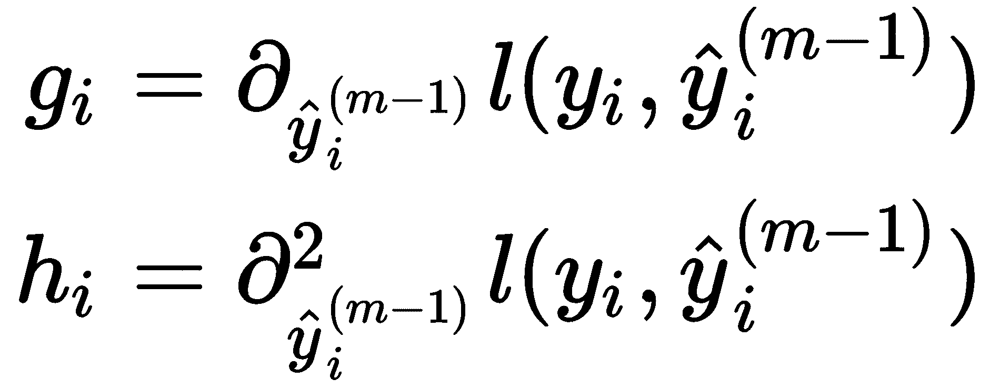
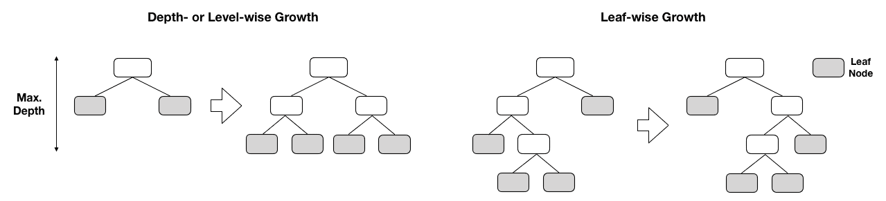
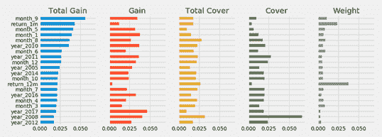
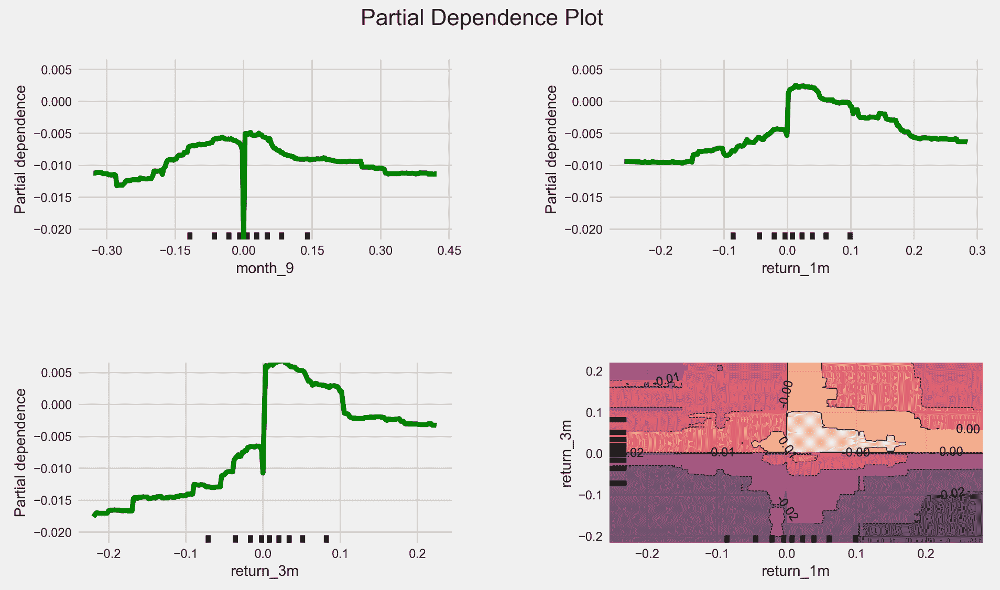
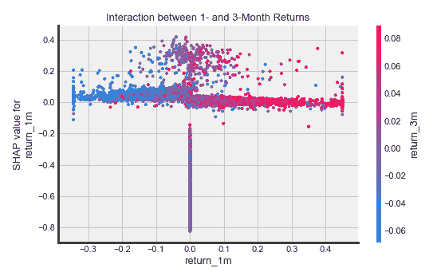

# 梯度推进机器

在前一章中，我们了解了随机森林如何通过将单个决策树组合成一个集合来降低单个树的高方差，从而提高单个决策树所做的预测。随机森林使用 bagging(bootstrap aggregation 的缩写)将随机元素引入到生长个体树的过程中。

更具体地说，bagging 通过替换从数据中抽取样本，以便每棵树都在数据的不同但大小相等的随机子集上进行训练(重复一些观察)。随机森林还随机选择特征的子集，以便用于训练每棵树的数据的行和列都是原始数据的随机版本。然后，集合通过对单个树的输出进行平均来生成预测。

单独的树通常生长得很深，以确保低偏差，同时依靠随机训练过程来产生不同的、不相关的预测误差，这些误差在聚集时比单独的树预测具有更低的方差。换句话说，随机化训练的目的是去相关或多样化由单个树产生的误差，使得集合更不容易过度拟合，具有更低的方差，并且更好地推广到新数据。

在这一章中，我们将探索 boosting，一种替代的**机器学习** ( **ML** )算法，用于决策树的集成，通常会产生更好的结果。关键区别在于，在添加新树之前，增强会根据模型产生的累积错误修改用于为每棵树定型的数据。与随机森林相反，随机森林使用不同版本的训练集彼此独立地训练许多树，提升使用数据的重新加权版本按顺序进行。最新的 boosting 实现也采用了随机森林的随机化策略。

在这一章中，我们将看到 boosting 是如何在过去的三十年中发展成为最成功的 ML 算法之一的。在撰写本文时，它已经开始主导结构化数据的机器学习竞赛(例如，与高维图像或语音相反，在高维图像或语音中，输入和输出之间的关系更复杂，深度学习擅长)。更具体地说，在本章中，我们将讨论以下主题:

*   增压是如何工作的，以及它与装袋有何不同
*   增强是如何从自适应发展到梯度增强的
*   如何通过 sklearn 使用和调整 AdaBoost 和梯度增强模型
*   最先进的 GBM 实现如何显著加快计算速度
*   如何防止梯度推进模型的过度拟合
*   如何使用`xgboost`、`lightgbm`和`catboost`在大型数据集上构建、调整和评估梯度增强模型
*   如何从梯度推进模型中解读和获得洞察力

# 自适应增压

像 bagging 一样，boosting 是一种集成学习算法，它将基础学习器(通常是决策树)组合成一个集成。Boosting 最初是为分类问题开发的，但也可以用于回归，并被称为过去 20 年中引入的最有效的学习思想之一(如 Trevor Hastie 等人在*Elements of Statistical Learning*中所述)。参考链接见 GitHub)。与 bagging 一样，它是一种通用方法或元方法，可以应用于许多统计学习模型。

开发 boosting 的动机是找到一种方法，将许多*弱*模型(当预测器的性能仅略好于随机猜测时，称为弱)的输出组合成一种更强大的，即 boosted 联合预测。一般来说，boosting 学习一种类似于线性回归形式的附加假设，*H<sub>M</sub>T5】。然而，现在每个 *m= 1，...，M* 元素的求和是一个弱基础学习器，称为*h<sub>t</sub>T11】这本身就需要训练。下面的公式总结了这种方法:**



正如上一章所讨论的，bagging 根据训练数据的不同随机样本来训练基础学习者。相比之下，提升是通过在被重复修改以反映累积学习结果的数据上训练基础学习者来顺序进行的。目标是确保下一个基本学习者补偿当前集合的缺点。我们将在本章中看到，boosting 算法在如何定义缺点方面有所不同。集合使用弱模型预测的加权平均值进行预测。

第一个 boosting 算法是由 Robert Schapire 和 Yoav Freund 在 1990 年左右开发的，它有数学证明可以提高弱学习者的表现。1997 年，分类问题的实际解决方案以**自适应增强** ( **AdaBoost** )算法的形式出现，该算法在 2003 年获得了哥德尔奖。大约五年后，当 Leo Breiman(他发明了随机森林)将这种方法与梯度下降联系起来，而 Jerome Friedman 在 1999 年提出梯度推进时，这种算法被扩展到任意目标函数。近年来出现了许多优化的实现，如 XGBoost、LightGBM 和 CatBoost，它们牢固地确立了梯度增强作为结构化数据首选解决方案的地位。

在以下部分中，我们将简要介绍 AdaBoost，然后重点介绍梯度提升模型，以及这种非常强大和灵活的算法的几种最先进的实现。

# AdaBoost 算法

AdaBoost 是第一个在拟合额外的集成成员时迭代适应累积学习进度的 boosting 算法。特别地，AdaBoost 在拟合新的弱学习器之前，改变了训练数据的权重，以反映当前集成在训练集上的累积误差。AdaBoost 是当时最准确的分类算法，Leo Breiman 在 1996 年的 NIPS 大会上将其称为世界上最好的现成分类器。

该算法对 ML 有非常重要的影响，因为它提供了理论上的性能保证。这些保证只需要足够的数据和弱学习器，其可靠的预测比随机猜测要好。作为这种分阶段学习的自适应方法的结果，精确的 ML 模型的开发不再需要在整个特征空间上的精确性能。相反，一个模型的设计可以集中在寻找那些比抛硬币表现更好的弱学习者。

AdaBoost 与 bagging 有很大的不同，bagging 在非常深的树上建立集合以减少偏差。相比之下，AdaBoost 将浅树作为弱学习器，通常对树桩(即由单次分裂形成的树)产生较高的准确性。该算法从等权训练集开始，然后连续改变样本分布。每次迭代后，AdaBoost 增加错误分类的观察值的权重，并减少正确预测的样本的权重，以便后续的弱学习器更多地关注特别困难的情况。一旦被训练，新的决策树被结合到具有反映其对减少训练误差的贡献的权重的集成中。

用于基本学习器集合的 AdaBoost 算法， *h <sub>m</sub> (x)* ， *m=1，...，M* ，预测离散类， *y ∈ [-1，1]* 和 *N* 训练观察值可以总结如下:

1.  初始化样本权重 *w <sub>i</sub> =1/N* 对于观测值 *i=1，...，N* 。
2.  对于每个基分类器*h<sub>m</sub>T3】， *m=1，...，M* ，执行以下操作:*
    1.  将 *h <sub>m</sub> (x)* 拟合到训练数据，用*w<sub>I</sub>T7】加权。*
    2.  计算训练集上基础学习者的加权错误率 *ε* <sub>*m*</sub> 。
    3.  将基本学习者的总体权重*α<sub>m</sub>T3】计算为其错误率的函数，如以下公式所示:*


3.  当集合成员的加权和为正时，预测正类，否则预测负类，如下式所示:


AdaBoost 具有许多实际优点，包括易于实现和快速计算，并且它可以与用于识别弱学习器的任何方法相结合。除了系综的大小，没有需要调整的超参数。AdaBoost 对于识别异常值也是有用的，因为获得最高权重的样本是那些一贯被错误分类并且本质上不明确的样本，这对于异常值也是典型的。

另一方面，AdaBoost 在给定数据集上的性能取决于弱学习者充分捕捉特征和结果之间关系的能力。正如理论所表明的，当数据不足时，或者当集合成员的复杂性与数据的复杂性不匹配时，提升将不会很好地执行。它也容易受到数据中噪声的影响。

# 带 sklearn 的 AdaBoost

作为其 ensemble 模块的一部分，sklearn 提供了一个支持两个或更多类的`AdaBoostClassifier`实现。本节的代码示例在笔记本`gbm_baseline`中，它比较了各种算法与虚拟分类器的性能，虚拟分类器总是预测最频繁的类。

我们需要首先定义一个`base_estimator`作为所有集合成员的模板，然后配置集合本身。我们将使用默认的`DecisionTreeClassifier`和`max_depth=1`——也就是说，只有一个裂口的树桩。`base_estimator`的复杂性是一个关键的调整参数，因为它取决于数据的性质。如前一章所述，对`max_depth`的更改应该与适当的正则化约束相结合，例如使用对`min_samples_split`的调整，如以下代码所示:

```
base_estimator = DecisionTreeClassifier(criterion='gini', 
                                        splitter='best',
                                        max_depth=1, 
                                        min_samples_split=2, 
                                        min_samples_leaf=20, 
                                        min_weight_fraction_leaf=0.0,
                                        max_features=None, 
                                        random_state=None, 
                                        max_leaf_nodes=None, 
                                        min_impurity_decrease=0.0, 
                                        min_impurity_split=None)
```

第二步，我们将设计服装。参数`n_estimators`控制弱学习者的数量，参数`learning_rate`决定每个弱学习者的贡献，如下面的代码所示。默认情况下，弱学习者是决策树的树桩:

```
ada_clf = AdaBoostClassifier(base_estimator=base_estimator,
                             n_estimators=200,
                             learning_rate=1.0,
                             algorithm='SAMME.R',
                             random_state=42)
```

导致良好结果的主要调整参数是`n_estimators`和基本估计器复杂度，因为树的深度控制着特性之间的交互程度。

我们将使用自定义的 12 重滚动时间序列分割交叉验证 AdaBoost 集成，以预测样本中最后 12 个月的 1 个月，使用所有可用的先前数据进行训练，如以下代码所示:

```
cv = OneStepTimeSeriesSplit(n_splits=12, test_period_length=1, shuffle=True)
def run_cv(clf, X=X_dummies, y=y, metrics=metrics, cv=cv, fit_params=None):
    return cross_validate(estimator=clf,
                          X=X,
                          y=y,
                          scoring=list(metrics.keys()),
                          cv=cv,
                          return_train_score=True,
                          n_jobs=-1,                    # use all cores
                          verbose=1,
                          fit_params=fit_params)
```

结果显示加权测试准确度为 0.62，测试 AUC 为 0.6665，负对数损失为-0.6923，测试 F1 得分为 0.5876，如以下屏幕截图所示:



有关交叉验证和处理结果的代码的更多详细信息，请参见配套笔记本。

# 梯度推进机器

AdaBoost 还可以被解释为一种分阶段的前向方法，用于在每次迭代中最小化二进制数 *y* ∈ [-1，1】的指数损失函数 *m* 以识别新的基本学习器*h<sub>m</sub>T7】以及要添加到集成中的相应权重 *α <sub>m</sub>* ，如下式所示:*


AdaBoost 算法的这种解释是在它发表几年后才被发现的。它将 AdaBoost 视为一种基于坐标的梯度下降算法，可以最小化特定的损失函数，即指数损失。

梯度提升利用了这种洞察力，并将提升方法应用于更广泛的损失函数。该方法使得机器学习算法的设计能够解决任何回归、分类或排序问题，只要它可以使用可微分的损失函数来公式化，从而具有梯度。将这种通用方法灵活地定制为许多特定的预测任务对于提高的受欢迎程度至关重要。

所得到的**梯度提升机器** ( **GBM** )算法背后的主要思想是训练基础学习器来学习集合的当前损失函数的负梯度。结果，在给定先前集合成员所产生的误差的情况下，对集合的每次添加都直接有助于减少总的训练误差。由于每个新成员代表数据的一个新函数，梯度提升也被认为是以加法方式优化函数 *h <sub>m</sub>* 。

简而言之，该算法连续地将弱学习器*h<sub>m</sub>T3】例如决策树拟合到为当前集合评估的损失函数的负梯度，如以下公式所示:*



换句话说，在给定的迭代 *m* 中，该算法为每个观察值计算当前损失的梯度，然后将回归树拟合到这些伪残差。在第二步中，它为每个终端节点识别最佳常数预测，该预测最小化由于将新学习器添加到集成中而导致的增量损失。

这不同于独立的决策树和随机森林，在独立的决策树和随机森林中，预测依赖于相关终端或叶节点中存在的训练样本的结果值:在回归的情况下，它们的平均值，或者二元分类的正类的频率。对损失函数的梯度的关注也意味着梯度增强使用回归树来学习回归和分类规则，因为梯度总是连续的函数。

最终的集成模型基于各个决策树预测的加权和进行预测，每个决策树都经过了训练，以在给定一组给定特征值的先前预测的情况下最小化集成损失，如下图所示:


梯度推进树已经在许多分类、回归和排序基准上展示了最先进的性能。它们可能是最受欢迎的集成学习算法，既可以作为各种机器学习竞赛中的独立预测器，也可以用于现实世界的生产管道，例如，预测在线广告的点击率。

梯度推进的成功基于其以增量方式学习复杂函数关系的能力。这种算法的灵活性要求通过调整超参数来谨慎管理过度拟合的风险，超参数限制了模型学习噪声(而不是训练数据中的信号)的固有趋势。

我们将介绍控制梯度提升树模型复杂性的关键机制，然后使用 sklearn 实现来说明模型调优。

# 如何训练和调整 GBM 模型

梯度提升性能的两个关键驱动因素是集成的大小及其组成决策树的复杂性。

决策树的复杂性控制旨在避免学习高度特定的规则，这些规则通常意味着叶节点中非常少量的样本。在前一章中，我们讨论了用于限制决策树过度适应训练数据的能力的最有效的约束。它们包括要求:

*   分割一个节点或接受它为终端节点的最小样本数，或
*   在回归的情况下，通过纯度或熵或均方误差测量的节点质量的最小改进。

除了直接控制集合的大小，还有各种正则化技术，如收缩，我们在第 7 章、*线性模型*的[中的脊和套索线性回归模型的上下文中遇到。此外，在随机森林环境中使用的随机化技术也通常应用于梯度推进机器。](07.html)

# 集合大小和提前停止

每次增强迭代都旨在减少训练损失，因此对于大型集合，训练误差可能会变得非常小，从而增加过拟合的风险以及对未知数据的较差性能。交叉验证是找到最小化泛化误差的最佳集合大小的最佳方法，因为它取决于应用和可用数据。

由于需要在训练之前指定集合大小，因此监视验证集的性能并在给定迭代次数的验证误差不再减小时中止训练过程是有用的。这种技术称为早期停止，经常用于需要大量迭代且容易过拟合的模型，包括深度神经网络。

请记住，对大量试验使用相同验证集的早期停止也会导致过度拟合，只是对特定的验证集而不是训练集。在制定交易策略时，最好避免进行大量实验，因为错误发现的风险会显著增加。在任何情况下，保持一个坚持集，以获得泛化误差的无偏估计。

# 收缩率和学习率

收缩技术将增加的模型复杂性的惩罚应用于模型的损失函数。对于增强系综，可以通过将每个新系综成员的贡献按比例缩小 0 到 1 之间的因子来应用收缩。这个因子被称为 boosting 系综的学习率。降低学习率会增加收缩，因为它降低了每个新决策树对集成的贡献。

学习速率具有与集合大小相反的效果，对于较低的学习速率，集合大小趋于增加。已经发现，较低的学习率加上较大的集成会减少测试误差，特别是对于回归和概率估计。大量的迭代在计算上更昂贵，但是只要各个树保持浅，用快速的现有技术实现通常是可行的。根据实现的不同，您还可以使用自适应学习率，它可以根据迭代次数进行调整，通常可以降低在过程后期添加的树的影响。我们将在本章后面看到一些例子。

# 子采样和随机梯度增强

正如上一章详细讨论的，自举平均(bagging)提高了噪声分类器的性能。

随机梯度提升在每次迭代中使用没有替换的采样来在训练样本的子集上生长下一棵树。这样做的好处是计算量更低，精度通常更高，但二次采样应该与收缩相结合。

正如你所看到的，超参数的数量不断增加，推动了潜在组合的数量，这反过来增加了在有限的训练数据上从大量参数试验中选择最佳模型的假阳性风险。最好的方法是按顺序进行，单独选择参数值，或者使用低基数子集的组合。

# 如何通过 sklearn 使用渐变增强

sklearn 的 ensemble 模块包含用于回归和分类的梯度推进树的实现，包括二进制和多类。下面的`GradientBoostingClassifier`初始化代码说明了我们之前介绍的关键调优参数，以及我们通过查看独立决策树模型所熟悉的那些参数。笔记本`gbm_tuning_with_sklearn`包含了这个部分的代码示例。

可用的损失函数包括导致 AdaBoost 算法的指数损失和对应于概率输出的逻辑回归的偏差。`friedman_mse`节点质量度量是包含改进分数的均方误差的变体(参见 GitHub 参考文献以获得原始论文的链接)，如以下代码所示:

```
gb_clf = GradientBoostingClassifier(loss='deviance',                # deviance = logistic reg; exponential: AdaBoost
                                    learning_rate=0.1,              # shrinks the contribution of each tree
                                    n_estimators=100,               # number of boosting stages
                                    subsample=1.0,                  # fraction of samples used t fit base learners
                                    criterion='friedman_mse',       # measures the quality of a split
                                    min_samples_split=2,            
                                    min_samples_leaf=1, 
                                    min_weight_fraction_leaf=0.0,   # min. fraction of sum of weights
                                    max_depth=3,                    # opt value depends on interaction
                                    min_impurity_decrease=0.0, 
                                    min_impurity_split=None, 
                                    max_features=None, 
                                    max_leaf_nodes=None, 
                                    warm_start=False, 
                                    presort='auto',
                                    validation_fraction=0.1, 
                                    tol=0.0001)
```

类似于`AdaBoostClassifier`，这个模型不能处理缺失值。我们将再次使用 12 重交叉验证来获得对滚动 1 个月持有期的定向回报进行分类的错误，如以下代码所示:

```
gb_cv_result = run_cv(gb_clf, y=y_clean, X=X_dummies_clean)
gb_result = stack_results(gb_cv_result)
```

我们将对结果进行解析和绘图，以找到相对于`AdaBoostClassifier`的微小改进——使用默认参数值，如下面的屏幕截图所示:


# 如何用 GridSearchCV 调优参数

`model_selection`模块中的`GridSearchCV`类有助于对我们想要测试的超参数值的所有组合进行系统评估。在下面的代码中，我们将说明七个调整参数的功能，这些参数定义后将导致总共 2 <sup>4</sup> x 3 <sup>2</sup> x 4 = 576 种不同的模型配置:

```
cv = OneStepTimeSeriesSplit(n_splits=12)

param_grid = dict(
        n_estimators=[100, 300],
        learning_rate=[.01, .1, .2],
        max_depth=list(range(3, 13, 3)),
        subsample=[.8, 1],
        min_samples_split=[10, 50],
        min_impurity_decrease=[0, .01],
        max_features=['sqrt', .8, 1]
)
```

`.fit()`方法使用自定义的`OneStepTimeSeriesSplit`和`roc_auc`分数执行交叉验证，以评估 12 倍。Sklearn 让我们像对待任何其他使用`joblib` pickle 实现的模型一样持久化结果，如以下代码所示:

```
gs = GridSearchCV(gb_clf,
                   param_grid,
                   cv=cv,
                   scoring='roc_auc',
                   verbose=3,
                   n_jobs=-1,
                   return_train_score=True)
gs.fit(X=X, y=y)

# persist result using joblib for more efficient storage of large numpy arrays
joblib.dump(gs, 'gbm_gridsearch.joblib')
```

`GridSearchCV`对象在完成后有几个额外的属性，我们可以在加载 pickled 结果后访问这些属性，以了解哪个超参数组合执行得最好，以及它的平均交叉验证 AUC 分数，这导致了相对于默认值的适度改进。这显示在以下代码中:

```
pd.Series(gridsearch_result.best_params_)
learning_rate              0.01
max_depth                  9.00
max_features               1.00
min_impurity_decrease      0.01
min_samples_split         10.00
n_estimators             300.00
subsample                  0.80

gridsearch_result.best_score_
0.6853
```

# 参数对测试分数的影响

`GridSearchCV`结果存储平均交叉验证分数，以便我们可以分析不同的超参数设置如何影响结果。

下图左侧面板中的六个`seaborn`群图显示了所有参数值的 AUC 测试分数的分布。在这种情况下，最高 AUC 测试分数要求低的`learning_rate`和大的`max_features`值。一些参数设置，如低`learning_rate`，会产生一系列结果，这些结果取决于其他参数的补充设置。其他参数与实验中使用的所有设置的高分兼容:


我们现在将探讨超参数设置如何共同影响平均交叉验证分数。为了深入了解参数设置是如何相互作用的，我们可以用平均测试分数作为结果和参数设置来训练一个`DecisionTreeRegressor`,以一键或虚拟格式编码为分类变量(详见笔记本)。树形结构强调使用所有特征(`max_features_1`)、低`learning_rate`和三个以上的`max_depth`可获得最佳结果，如下图所示:


本节第一个图表的右侧面板中的条形图显示了超参数设置在产生不同结果时的影响，通过它们对增长到最大深度的决策树的特征重要性来衡量。自然地，出现在树顶部附近的特征也累积最高的重要性分数。

# 如何在维持集上测试

最后，我们将评估我们从`GridSearchCV`练习中排除的最佳模型在维持集上的性能。它包含样本期的最后六个月(截至 2018 年 2 月；详见笔记本)。我们使用下面的代码，基于`0.6622`的 AUC 分数获得一个泛化性能估计:

```
best_model = gridsearch_result.best_estimator_
preds= best_model.predict(test_feature_data)
roc_auc_score(y_true=test_target, y_score=preds)
0.6622

```

sklearn 梯度增强实现的缺点是计算速度有限，这使得很难快速尝试不同的超参数设置。在下一节中，我们将看到在过去几年中出现了几个优化的实现，它们大大减少了训练大规模模型所需的时间，并极大地促进了这种高效算法的更广泛应用。

# 快速可扩展的 GBM 实施

在过去几年中，几个新的梯度提升实现使用了各种创新，这些创新加速了训练，提高了资源效率，并允许算法扩展到非常大的数据集。新的实现及其来源如下:

*   XGBoost(极限梯度推进)是由华盛顿大学的陈天琦于 2014 年提出的
*   LightGBM 由微软于 2017 年 1 月首次发布
*   由 Yandex 于 2017 年 4 月首次发布的 CatBoost

这些创新解决了训练梯度增强模型的具体挑战(详细参考请参见 GitHub 上的本章`README`)。XGBoost 实现是第一个获得普及的新实现:在 Kaggle 于 2015 年发布的 29 个获奖解决方案中，有 17 个解决方案使用了 XGBoost。其中八个只依赖于 XGBoost，而其他的结合了 XGBoost 和神经网络。

我们将首先介绍随着时间的推移而出现并随后融合的关键创新(因此大多数功能可用于所有实现)，然后再说明它们的实现。

# 算法创新如何推动绩效

随机森林可以通过在独立的引导样本上生长单独的树来并行训练。相比之下，梯度增强的顺序方法会降低训练速度，这反过来会使大量超参数的实验变得复杂，这些超参数需要适应任务和数据集的性质。

为了通过树来扩展集成，训练算法相对于集成损失函数的负梯度递增地最小化预测误差，类似于传统的梯度下降优化器。因此，训练期间的计算成本与评估每个特征的潜在分裂点对决策树与当前梯度的拟合的影响所花费的时间成比例。

# 二阶损失函数近似

最重要的算法创新通过使用依赖于二阶导数的近似法降低了评估损失函数的成本，类似于牛顿寻找驻点的方法。因此，相对于使用完全损失函数，在贪婪树扩展期间对潜在分裂评分更快。

如前所述，以增量方式训练梯度增强模型，目标是最小化集合*H<sub>M</sub>T3】的预测误差和正则化惩罚的组合。表示步骤 *m* 后集合对结果 *y <sub>i</sub>* 的预测为*ŷ<sub>I</sub>*<sup xmlns:epub="http://www.idpf.org/2007/ops">(*m*)</sup>， *l* 作为衡量结果与预测之间差异的可微凸损失函数，ω作为随着集合的复杂性增加的惩罚 *H 【T23**


正则化惩罚通过支持选择使用简单和预测回归树的模型来帮助避免过度拟合。例如，在 XGBoost 的情况下，回归树的罚分 *h* 取决于每棵树的叶子数量 *T* ，每个终端节点的回归树分数 *w* ，以及超参数γ和λ。这在下面的公式中进行了总结:



因此，在每一步，算法都贪婪地添加最能改善正则化目标的假设*h<sub>m</sub>T3】。基于泰勒展开的损失函数的二阶近似加速了目标的评估，如下面的公式所总结的:*



这里， *g <sub>i</sub>* 为给定特征值添加新学习器前损失函数的一阶梯度， *h <sub>i</sub>* 为对应的二阶梯度(或 Hessian)值，如下式所示:



XGBoost 算法是第一个利用损失函数的这种近似来计算给定树结构的最佳休假分数和损失函数的相应值的开源算法。分数由末端节点中样本的梯度和 Hessian 的和的比率组成。它使用这个值来对分裂产生的信息增益进行评分，类似于我们在上一章看到的节点杂质测量，但适用于任意损失函数(详细推导见 GitHub 上的参考资料)。

# 简化的分裂查找算法

sklearn 的梯度推进实现找到了列举连续特征的所有选项的最佳分割。这种精确的贪婪算法在计算上要求很高，因为它必须首先根据特征值对数据进行排序，然后才能对潜在的大量分割选项进行评分并做出决定。当数据不适合内存或者在多台机器上的分布式设置中训练时，这种方法面临挑战。

近似分裂寻找算法通过将特征值分配给用户确定的一组箱来减少分裂点的数量，这也可以极大地减少训练期间的存储器需求，因为对于每个箱只需要存储单个分裂。XGBoost 引入了一种分位数草图算法，该算法也能够将加权训练样本划分到百分位箱中，以实现均匀分布。XGBoost 还引入了处理由缺失值、频繁的零梯度统计和一键编码导致的稀疏数据的能力，并且还可以学习给定分割的最佳默认方向。因此，该算法只需要计算非缺失值。

相比之下，LightGBM 使用**基于梯度的单侧采样** ( **高斯**)来排除大部分梯度较小的样本，仅使用剩余部分来估计信息增益并相应地选择分裂值。具有较大梯度的样本需要更多的训练，并且往往对信息增益贡献更多。LightGBM 还使用排他特性捆绑来组合互斥的特性，因为它们很少同时取非零值，从而减少了特性的数量。因此，LightGBM 是发布时最快的实现。

# 深度方向与叶片方向的生长

LightGBM 与 XGBoost 和 CatBoost 的不同之处在于它如何区分要拆分的节点的优先级。LightGBM 决定按叶方式分裂，即它分裂最大化信息增益的叶节点，即使这会导致不平衡的树。相比之下，XGBoost 和 CatBoost 在深度方向上扩展所有节点，并在添加更多级别之前先在给定深度拆分所有节点。这两种方法以不同的顺序展开节点，并且除了完整的树之外，将产生不同的结果。下图说明了这两种方法:



LightGBM 的逐叶分割倾向于增加模型的复杂性，并可能加快收敛，但也增加了过度拟合的风险。具有 *n* 层的深度方向生长的树具有多达 *2* <sup>*n*</sup> 个终端节点，而具有 *2 <sup>n</sup>* 个叶的叶方向的树可以具有明显更多的层，并且在一些叶中包含相应更少的样本。因此，调整 LightGBM 的`num_leaves`设置需要格外小心，该库允许我们同时控制`max_depth`以避免过度的节点不平衡。LightGBM 的最新版本还提供了深度方向的树生长。

# 基于 GPU 的培训

所有新的实现都支持在一个或多个 GPU 上进行训练和预测，以实现显著的加速。它们与当前支持 CUDA 的 GPU 兼容。安装要求各不相同，并且发展很快。XGBoost 和 CatBoost 实现适用于几个当前版本，但是 LightGBM 可能需要本地编译(参见 GitHub 获取相关文档的链接)。

加速取决于库和数据类型，范围从较低的个位数倍数到几十倍。GPU 的激活只需要改变任务参数，不需要修改其他超参数。

# DART 树木辍学

2015 年，Rashmi 和 Gilad-Bachrach 提出了一种新的模型来训练梯度提升树，旨在解决他们标记为过度专门化的问题:在后期迭代中添加的树往往只会影响少数实例的预测，而对其余实例的贡献较小。但是，模型的样本外性能可能会受到影响，并且它可能会对过程早期添加的少量树的贡献过于敏感。

新算法采用了已被成功用于学习更精确的深度神经网络的漏失，其中漏失在学习过程中使随机部分的神经连接静音。因此，较高层中的节点不能依靠少数连接来传递预测所需的信息。这种方法为深度神经网络在许多任务中的成功做出了重大贡献，并且也与其他学习技术一起使用，如逻辑回归，以抑制随机的特征份额。随机森林和随机梯度增强也会遗漏随机要素子集。

DART 在树的层次上运行，并使完整的树静音，而不是单独的特征。目标是让使用 DART 生成的集合中的树更均匀地对最终预测做出贡献。在某些情况下，这已被证明可以为排序、回归和分类任务产生更准确的预测。该方法首先在 LightGBM 中实现，也可用于 XGBoost。

# 分类特征的处理

CatBoost 和 LightGBM 实现直接处理分类变量，不需要哑编码。

CatBoost 实现(因其对分类特征的处理而得名)除了自动一键编码之外，还包括多个处理此类特征的选项，并将单个特征的类别或多个特征的类别组合分配给数值。换句话说，CatBoost 可以从现有特征的组合中创建新的分类特征。与单个特征或特征组合的类别级别相关联的数值取决于它们与结果值的关系。在分类的情况下，这与观察到正类的概率相关，基于先验并使用平滑因子对样本进行累积计算。有关更详细的数字示例，请参见文档。

LightGBM 实现对分类特征的级别进行分组，以最大化组内关于结果值的同质性(或最小化方差)。

XGBoost 实现不直接处理分类特性，而是需要一次性(或虚拟)编码。

# 附加功能和优化

XGBoost 在几个方面优化了计算，通过将数据保存在内存中的压缩列块中来支持多线程，其中每一列都按相应的特征值排序。XGBoost 在训练之前计算一次这个输入数据布局，并在整个过程中重复使用它来分摊额外的前期成本。当使用分位数时，对列的拆分统计信息的搜索变成了线性扫描，这可以并行完成，并且很容易支持列二次抽样。

随后发布的 LightGBM 和 CatBoost 库基于这些创新，LightGBM 通过优化线程和减少内存使用进一步加快了训练速度。由于它们的开源性质，库已经趋向于随着时间的推移而融合。

XGBoost 还支持单调性约束。这些约束确保给定特性的值只与整个范围内的结果正相关或负相关。它们有助于整合关于模型的已知正确的外部假设。

# 如何使用 XGBoost、LightGBM 和 CatBoost

XGBoost、LightGBM 和 CatBoost 为包括 Python 在内的多种语言提供了接口，并且既有与其他 sklearn 功能兼容的 sklearn 接口，如`GridSearchCV`，又有自己的方法来训练和预测梯度增强模型。`gbm_baseline.ipynb`笔记本展示了 sklearn 接口在每个实现中的使用。库方法通常有更好的文档记录，并且易于使用，所以我们将使用它们来说明这些模型的使用。

这个过程需要创建特定于库的数据格式，调整各种超参数，以及评估结果，我们将在下面的部分中进行描述。随附的笔记本包含`gbm_tuning.py`、`gbm_utils.py`和`gbm_params.py`文件，这些文件共同提供以下功能并产生相应的结果。

# 如何创建二进制数据格式

如前所述，所有库都有自己的数据格式来预计算要素统计数据，以加速分割点的搜索。这些也可以坚持下来，加速后续训练的开始。

以下代码为将与`OneStepTimeSeriesSplit`一起使用的每个模型构建二进制训练和验证数据集:

```
cat_cols = ['year', 'month', 'age', 'msize', 'sector']
data = {}
for fold, (train_idx, test_idx) in enumerate(kfold.split(features)):
    print(fold, end=' ', flush=True)
    if model == 'xgboost':
        data[fold] = {'train': xgb.DMatrix(label=target.iloc[train_idx],
                                           data=features.iloc[train_idx],
                                           nthread=-1),                  # use avail. threads
                      'valid': xgb.DMatrix(label=target.iloc[test_idx],
                                           data=features.iloc[test_idx],
                                           nthread=-1)}
    elif model == 'lightgbm':
        train = lgb.Dataset(label=target.iloc[train_idx],
                            data=features.iloc[train_idx],
                            categorical_feature=cat_cols,
                            free_raw_data=False)

        # align validation set histograms with training set
        valid = train.create_valid(label=target.iloc[test_idx],
                                   data=features.iloc[test_idx])

        data[fold] = {'train': train.construct(),
                      'valid': valid.construct()}

    elif model == 'catboost':
        # get categorical feature indices
        cat_cols_idx = [features.columns.get_loc(c) for c in cat_cols]
        data[fold] = {'train': Pool(label=target.iloc[train_idx],
                                    data=features.iloc[train_idx],
                                    cat_features=cat_cols_idx),

                      'valid': Pool(label=target.iloc[test_idx],
                                    data=features.iloc[test_idx],
                                    cat_features=cat_cols_idx)}
```

可用选项略有不同:

*   `xgboost`允许使用所有可用的线程
*   `lightgbm`明确地将为验证集创建的分位数与训练集对齐
*   `catboost`实现需要使用索引而不是标签来标识特性列

# 如何调整超参数

众多超参数在`gbm_params.py`中列出。每个库都有参数设置，用于:

*   指定总体目标和学习算法
*   设计基础学习者
*   应用各种正则化技术
*   处理训练期间的提前停止
*   支持在 CPU 上使用 GPU 或并行化

每个库的文档详细描述了可能引用相同概念的各种参数，但是这些参数在不同的库中有不同的名称。GitHub 存储库包含一个站点的链接，该站点突出显示了`xgboost`和`lightgbm`的相应参数。

# 目标和损失函数

这些库支持几种提升算法，包括针对树和线性基学习器的梯度提升，以及针对 LightGBM 和 XGBoost 的 DART。LightGBM 还支持我们之前描述的 GOSS 算法，以及随机森林。

梯度推进的吸引力包括对任意可微分损失函数的有效支持，并且每个库为回归、分类和排序任务提供了各种选项。除了所选择的损失函数之外，在训练和交叉验证期间，可以使用附加的评估度量来监控性能。

# 学习参数

梯度推进模型通常使用决策树来捕获特征交互，并且各个树的大小是最重要的调整参数。XGBoost 和 CatBoost 将`max_depth`默认值设置为 6。相比之下，LightGBM 使用默认的`num_leaves`值 31，这对应于平衡树的五个级别，但是对级别的数量没有限制。为避免过拟合，`num_leaves`应低于 *2 <sup>max_depth</sup>* 。例如，对于表现良好的值为 7 的`max_depth`，您可以将`num_leaves`设置为 70–80，而不是 2 <sup>7</sup> =128，或者直接约束`max_depth`。

树或提升迭代的数量定义了集合的整体大小。所有库都支持`early_stopping`一旦损失函数在给定的迭代次数内没有进一步的改进，就中止训练。因此，通常最好设置大量迭代，并根据验证集的预测性能停止训练。

# 正规化

所有库都为基础学习者实现了正则化策略，例如样本数量的最小值或者分裂和叶节点所需的最小信息增益。

它们还支持通过学习率使用收缩在集合级别上进行正则化，该学习率限制新树的贡献。还可以通过回调函数来实现自适应学习速率，该回调函数随着训练的进行而降低学习速率，正如在神经网络环境中成功使用的那样。此外，可以使用 *L1* 或 *L2* 来正则化梯度增强损失函数，正则化类似于通过修改ω(*h<sub>m</sub>*)或通过增加用于添加更多树的惩罚γ的脊和套索线性回归模型，如前所述。

这些库还允许使用 bagging 或 column 子采样来随机化随机森林的树木生长，并去相关预测误差以减少总体方差。用于近似分裂查找的特征的量化增加了更大的箱，作为防止过度拟合的附加选项。

# 随机网格搜索

为了探索超参数空间，我们指定想要组合测试的关键参数的值。sklearn 库支持`RandomizedSearchCV`交叉验证从指定分布中随机抽样的参数组合子集。我们将实现一个定制版本，它允许我们在监控当前表现最佳的组合时利用早期停止，这样我们可以在对结果满意时中止搜索过程，而不是事先指定一组迭代次数。

为此，我们像以前一样根据每个库的参数指定一个参数网格，使用`itertools`库提供的内置笛卡尔`product`生成器生成所有组合，并随机`shuffle`结果。对于 LightGBM，我们自动将`max_depth`设置为当前`num_leaves`值的函数，如以下代码所示:

```
param_grid = dict(
        # common options
        learning_rate=[.01, .1, .3],
        colsample_bytree=[.8, 1],  # except catboost

        # lightgbm
        num_leaves=[2 ** i for i in range(9, 14)],
        boosting=['gbdt', 'dart'],
        min_gain_to_split=[0, 1, 5],  # not supported on GPU

all_params = list(product(*param_grid.values()))
n_models = len(all_params) # max number of models to cross-validate
shuffle(all_params)
```

然后，我们执行如下交叉验证:

```
GBM = 'lightgbm'
for test_param in all_params:
    cv_params = get_params(GBM)
    cv_params.update(dict(zip(param_grid.keys(), test_param)))
    if GBM == 'lightgbm':
        cv_params['max_depth'] = int(ceil(np.log2(cv_params['num_leaves'])))
    results[n] = run_cv(test_params=cv_params,
                        data=datasets,
                        n_splits=n_splits,
                        gb_machine=GBM)
```

`run_cv`函数实现了所有三个库的交叉验证。对于`light_gbm`示例，流程如下所示:

```
def run_cv(test_params, data, n_splits=10):
    """Train-Validate with early stopping"""
    result = []
    cols = ['rounds', 'train', 'valid']
    for fold in range(n_splits):
        train = data[fold]['train']
        valid = data[fold]['valid']

        scores = {}
        model = lgb.train(params=test_params,
                          train_set=train,
                          valid_sets=[train, valid],
                          valid_names=['train', 'valid'],
                          num_boost_round=250,
                          early_stopping_rounds=25,
                          verbose_eval=50,
                          evals_result=scores)

        result.append([model.current_iteration(),
                       scores['train']['auc'][-1],
                       scores['valid']['auc'][-1]])

    return pd.DataFrame(result, columns=cols)
```

`train()`方法还产生存储在`scores`字典中的验证分数。当提前停止生效时，最后一次迭代也是最好的分数。更多细节请参见 GitHub 上的完整实现。

# 如何评价结果

使用 GPU，我们可以在几分钟内训练一个模型，并在几个小时内评估数百个参数组合，而使用 sklearn 实现则需要很多天。对于 LightGBM 模型，我们探索了使用库处理分类变量的能力的因子版本和使用一键编码的虚拟版本。

结果可在`model_tuning.h5` HDF5 商店获得。模型评估代码示例在`eval_results.ipynb`笔记本中。

# 跨模型的交叉验证结果

当比较三个库的四次测试运行的平均交叉验证 AUC 时，我们发现 CatBoost 为表现最佳的模型产生了略高的 AUC 分数，同时也产生了最大的结果离差，如下图所示:


性能最佳的 CatBoost 模型使用以下参数(详见笔记本):

*   12 的`max_depth`和 128 的`max_bin`
*   `max_ctr_complexity`为 2，这限制了分类特征的组合数量
*   `one_hot_max_size`为 2，从数值变量的赋值中排除二进制特征
*   `random_strength`不同于 0 以随机化分割的评估

与 LightGBM 和 XGBoost(都使用 GPU)相比，训练速度稍慢，每个模型平均需要 230 秒。

对 LightGBM 和 XGBoost 模型的最高性能模型的更详细的观察表明，LightGBM 因子模型实现了与其他两个模型几乎一样好的性能，而模型复杂度低得多。它平均只包含 41 棵树，每棵树最多三层，每层不超过八片叶子，同时还以`min_gain_to_split`的形式使用正则化。它在训练集上过度拟合明显更少，训练 AUC 仅略高于验证 AUC。它的训练速度也快得多，每个模型只需要 18 秒，因为它的复杂性更低。实际上，这种模型更可取，因为它更有可能产生良好的样本外性能。详细信息如下表所示:

|  | **LightGBM 假人** | **XGBoost 假人** | **光 GBM 因子** |
| 验证 AUC | 68.57% | 68.36% | 68.32% |
| 培训 AUC | 82.35% | 79.81% | 72.12% |
| `learning_rate` | Zero point one | Zero point one | Zero point three |
| `max_depth` | Thirteen | nine | three |
| `num_leaves` | Eight thousand one hundred and ninety-two |  | eight |
| `colsample_bytree` | Zero point eight | one | one |
| `min_gain_to_split` | Zero | one | Zero |
| 巡视 | Forty-four point four two | Fifty-nine point one seven | Forty-one |
| 时间 | Eighty-six point five five | Eighty-five point three seven | Eighteen point seven eight |

下图显示了不同的`max_depth`设置对 LightGBM 和 XGBoost 模型的验证分数的影响:较浅的树产生更大范围的结果，需要与适当的学习率和正则化设置相结合，以产生上表所示的强结果:


除了之前显示的`DecisionTreeRegressor`，我们还可以使用线性回归来评估与验证 AUC 评分相关的不同特征的统计显著性。对于 LightGBM 虚拟模型，回归解释了结果中 68%的变化，我们发现只有`min_gain_to_split`正则化参数不显著，如下图所示:


在实践中，深入了解模型如何得出预测结果是极其重要的，特别是对于决策者通常需要合理解释的投资策略。

# 如何解读 GBM 结果

理解为什么一个模型预测某个结果是非常重要的，原因有几个，包括信任、可操作性、责任和调试。当目标是更多地了解所研究现象的潜在驱动因素时，对模型揭示的特征和结果之间的非线性关系以及特征之间的相互作用的洞察也是有价值的。

了解树集成方法(如梯度增强或随机森林模型)所做预测的常用方法是将要素重要性值归属于每个输入变量。这些要素重要性值可以针对单个预测进行单独计算，也可以针对整个数据集(即所有样本)进行全局计算，从而从更高的层面了解模型如何进行预测。

# 特征重要性

有三种主要方法来计算 **g** **全局特征重要性**值:

*   **增益**:Leo brei man 在 1984 年提出的这一经典方法使用了所有分割对给定特征贡献的损失或杂质的总减少。动机很大程度上是启发性的，但这是选择特性的常用方法。
*   **分割计数**:这是一种替代方法，根据基于结果信息增益的为此目的的特征选择，计算特征被用于进行分割决策的频率。
*   **置换**:这种方法随机置换测试集中的特征值，并测量模型误差变化的程度，假设一个重要的特征会导致预测误差大幅增加。不同的排列选择导致这种基本方法的替代实现。

计算单个预测的特征相关性的个性化特征重要性值不太常见，因为可用的模型不可知解释方法比特定于树的方法慢得多。

所有梯度提升实现都在训练后提供特征重要性分数作为模型属性。XGBoost 库提供了五个版本，如下表所示:

*   `total_gain`和`gain`作为其每次分割的平均值
*   `total_cover`使用某一功能时，每次分割的样本数
*   `weight`作为先前值的分割计数

使用训练模型的`.get_score()`方法和相应的`importance_type`参数可以获得这些值。对于性能最佳的 XGBoost 模型，结果如下(总的*度量*的相关性为 0.8，同样的还有`cover`和`total_cover`):



虽然不同月份和年份的指标占主导地位，但从`total_gain`的角度来看，最近 1 个月的回报是第二重要的特征，并且根据`weight`的衡量标准经常使用，但由于平均应用于相对较少的实例，因此产生的平均收益较低(有关实施细节，请参见笔记本)。

# 部分相关图

除了单个特征对模型预测的汇总贡献之外，部分相关图还显示了目标变量和一组特征之间的关系。梯度增强树的非线性特性导致这种关系依赖于所有其他特征的值。因此，我们将忽略这些特性。通过这样做，我们可以将部分相关性解释为预期的目标响应。

我们可以只对单个特征或特征对的部分依赖进行可视化。后者会产生等值线图，显示特征值的组合如何产生不同的预测概率，如以下代码所示:

```
fig, axes = plot_partial_dependence(gbrt=gb_clf,
                                    X=X_dummies_clean,
                                    features=['month_9', 'return_1m', 'return_3m', ('return_1m', 'return_3m')],
                                    feature_names=['month_9','return_1m', 'return_3m'],
                                    percentiles=(0.01, 0.99),
                                    n_jobs=-1,
                                    n_cols=2,
                                    grid_resolution=250)
```

经过一些额外的格式化(见配套的笔记本)，我们得到了以下的图:



右下方的图显示了在[1%，99%]百分点处剔除异常值后，给定滞后 1 个月和 3 个月回报的值范围，下个月正回报概率的相关性。`month_9`变量是一个虚拟变量，因此是类似阶跃函数的图。我们还可以在 3D 中可视化依赖关系，如以下代码所示:

```
targets = ['return_1m', 'return_3m']
target_feature = [X_dummies_clean.columns.get_loc(t) for t in targets]
pdp, axes = partial_dependence(gb_clf,
                               target_feature,
                               X=X_dummies_clean,
                               grid_resolution=100)

XX, YY = np.meshgrid(axes[0], axes[1])
Z = pdp[0].reshape(list(map(np.size, axes))).T

fig = plt.figure(figsize=(14, 8))
ax = Axes3D(fig)
surf = ax.plot_surface(XX, YY, Z,
                       rstride=1,
                       cstride=1,
                       cmap=plt.cm.BuPu,
                       edgecolor='k')
ax.set_xlabel(' '.join(targets[0].split('_')).capitalize())
ax.set_ylabel(' '.join(targets[1].split('_')).capitalize())
ax.set_zlabel('Partial Dependence')
ax.view_init(elev=22, azim=30)
```

这产生了 1 个月回报方向对滞后的 1 个月和 3 个月回报的部分依赖性的 3D 图:


# SHapley 加法解释

在 2017 年 NIPS 大会上，来自华盛顿大学的 Scott Lundberg 和 Su-In Lee 提出了一种新的更准确的方法来解释个体特征对树集合模型输出的贡献，称为 **SHapley 加法解释**，或 **SHAP** 值。

这种新算法偏离了我们之前看到的树集成的特征属性方法不一致的观察结果，也就是说，模型中增加特征对输出的影响的变化会降低该特征的重要性值(有关详细说明，请参见 GitHub 上的参考资料)。

SHAP 价值观统一了来自合作博弈理论和局部解释的观点，并且已经被证明在理论上是最优的、一致的，并且基于期望是局部精确的。最重要的是，伦德伯格和李开发了一种算法，该算法设法降低了计算这些模型不可知的附加特征归属方法的复杂性，从*O*(*TLD<sup>M</sup>T5)到*O*(*TLD*T10】2，其中 *T* 和 *M* 分别是树和特征的数量，而 *D* 和*L 这项重要的创新允许在几分之一秒内解释以前难以处理的具有数千棵树和特征的模型的预测。开源实现于 2017 年底推出，与 XGBoost、LightGBM、CatBoost 和 sklearn 树模型兼容。**

Shapley 值起源于博弈论，是一种为合作游戏中的每个玩家分配一个值的技术，该值反映了他们对团队成功的贡献。SHAP 值是对基于树的模型的博弈论概念的一种适应，并且针对每个特征和每个样本进行计算。它们衡量一个特征如何对给定观察的模型输出做出贡献。由于这个原因，SHAP 值提供了关于特征的影响如何在样本间变化的不同见解，考虑到在这些非线性模型中交互作用的作用，这是很重要的。

# 如何按特征总结 SHAP 价值观

要获得多个样本的特征重要性的高级概述，有两种方法绘制 SHAP 值:所有样本的简单平均值，类似于之前计算的全局特征重要性度量(如以下屏幕截图的左侧面板所示)，或散点图，显示每个样本的每个特征的影响(如以下屏幕截图的右侧面板所示)。使用经过训练的兼容库模型和匹配的输入数据来生成它们非常简单，如下面的代码所示:

```
# load JS visualization code to notebook
shap.initjs()

# explain the model's predictions using SHAP values
explainer = shap.TreeExplainer(model)
shap_values = explainer.shap_values(X_test)

shap.summary_plot(shap_values, X_test, show=False)
```

以下屏幕截图右侧的散点图按要素在所有样本中的总 SHAP 值对要素进行排序，然后显示每个要素如何影响由 SHAP 值测量的模型输出，值是要素值的函数，用颜色表示，其中红色表示相对于要素范围的高值，蓝色表示低值:


# 如何使用力图来解释预测

下面的力图显示了各种要素及其值对模型输出的累积影响，在本例中为 0.6，比基准值 0.13(所提供数据集的平均模型输出)高很多。以红色突出显示的功能增加了输出。十月份是最重要的特征，将输出从 0.338 增加到 0.537，而 2017 年则减少了输出。

因此，我们获得了模型如何得出特定预测的详细细分，如下图所示:


我们还可以一次计算多个数据点或预测的力图，并使用聚类可视化来深入了解特定影响模式在数据集上的普遍程度。下图显示了前 1，000 个观察值的力图，这些观察值旋转了 90 度，水平堆叠，并按照不同特征对给定观察结果的影响进行排序。该实现使用要素 SHAP 值上的数据点的分层凝聚聚类来识别这些模式，并以交互方式显示结果以进行探索性分析(请参阅笔记本)，如以下代码所示:

```
shap.force_plot(explainer.expected_value, shap_values[:1000,:], X_test.iloc[:1000])
```

这会产生以下输出:


# 如何分析特征交互

最后，SHAP 值允许我们通过将这些交互作用从主要影响中分离出来，从而获得对不同特征之间的交互作用的额外见解。`shap.dependence_plot`可以定义如下:

```
shap.dependence_plot("return_1m", shap_values, X_test, interaction_index=2, title='Interaction between 1- and 3-Month Returns')
```

它显示了 1 个月回报率的不同值(在 *x* 轴上)如何影响结果(在 *y* 轴上的 SHAP 值)，并通过 3 个月回报率进行区分:



SHAP 值在每个单独预测的级别上提供粒度特征属性，并通过(交互式)可视化实现复杂模型的更丰富的检查。本节开头显示的 SHAP 汇总散点图提供了比全球要素重要性条形图更具差异化的见解。单个聚类预测的力图允许更详细的分析，而 SHAP 相关图捕捉交互作用的影响，因此，比部分相关图提供更准确和详细的结果。

SHAP 值的局限性，与任何当前的特征重要性度量一样，涉及高度相关的变量的影响的属性，因为它们的相似影响可能以任意方式被分解。

# 摘要

在本章中，我们探讨了梯度推进算法，该算法用于以顺序方式构建集成，添加了一个浅层决策树，该决策树仅使用非常少量的特征来改进已经做出的预测。我们看到了梯度提升树如何非常灵活地应用于广泛的损失函数，并提供了许多机会来调整模型以适应给定的数据集和学习任务。

最近的实现通过加速训练过程并提供对特征的重要性和个体预测的驱动因素的更一致和详细的见解，极大地促进了梯度增强的使用。在下一章，我们将转向贝叶斯方法。