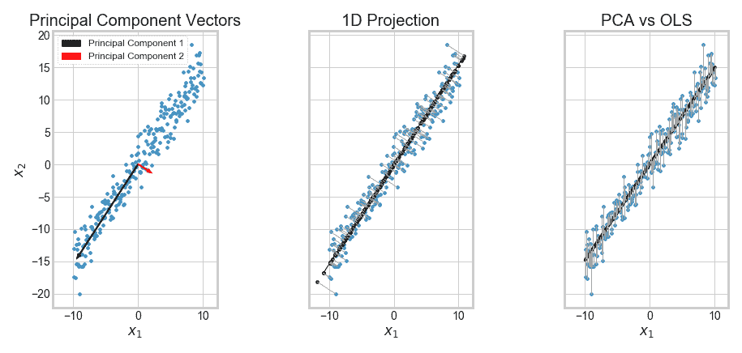
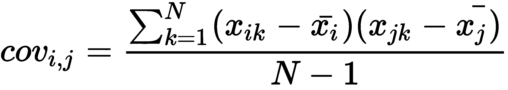
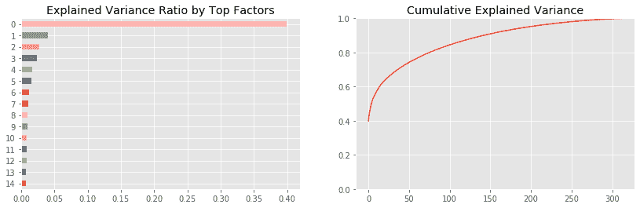
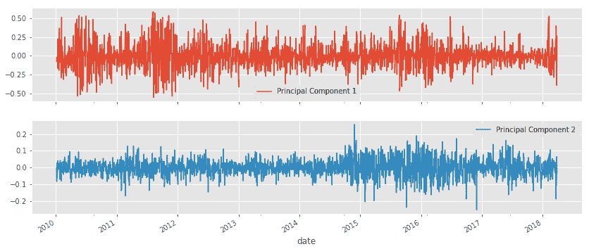
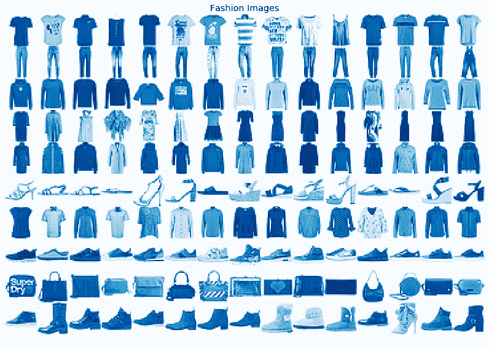
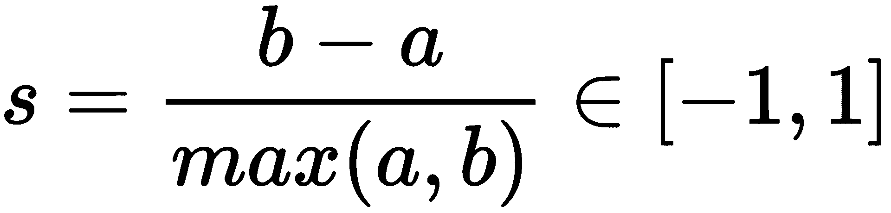
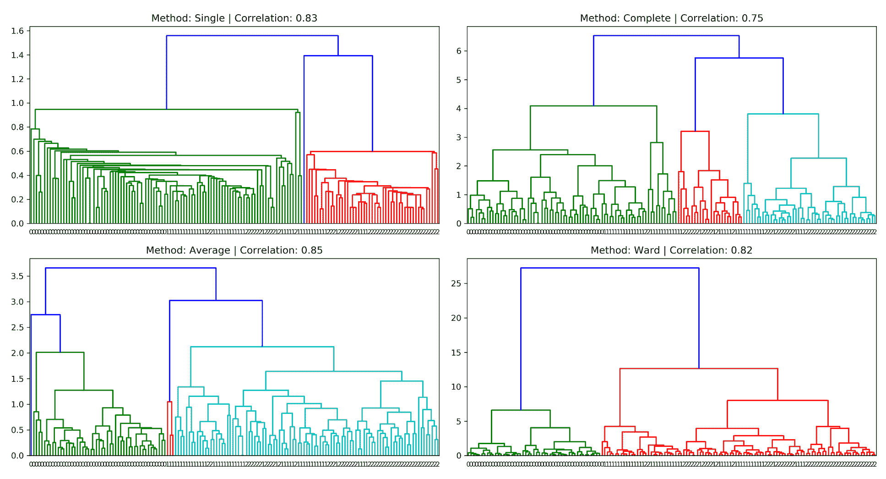
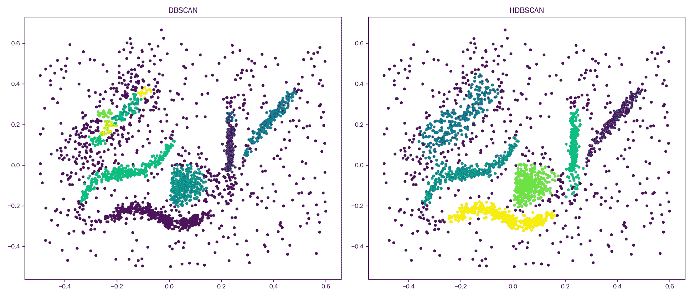

# 十二、无监督学习

在[第 6 章](06.html)、*机器学习过程*中，我们讨论了无监督学习如何在没有结果变量(如教师)的情况下，通过揭示数据中的结构来引导搜索过程，从而增加价值。这项任务与我们在前几章关注的监督学习的设置形成对比。

当数据集只包含特征而不包含结果的测量时，或者当我们想要提取与结果无关的信息时，无监督学习算法会很有用。我们的目标不是预测未来的结果，而是研究对解决另一项任务(包括探索数据集)有用的数据的信息表示。

示例包括确定主题以总结文档(参见[第 14 章](14.html)、*主题建模*)，减少特征数量以降低过度拟合的风险和监督学习的计算成本，或对类似观察结果进行分组，如本章末尾使用聚类进行资产分配所示。

降维和聚类是无监督学习的主要任务:

*   **降维**将现有特征转换成一个新的、更小的集合，同时最大限度地减少信息损失。存在各种各样的算法，不同之处仅在于它们如何测量信息损失，它们是否应用线性或非线性变换，或者它们对新特征集施加的约束。
*   **聚类算法**识别并分组相似的观察值或特征，而不是识别新的特征。算法的不同之处在于它们如何定义观察的相似性以及它们对结果组的假设。

更具体地说，本章包括以下内容:

*   **主成分分析** ( **PCA** )和**独立成分分析** ( **ICA** )如何进行线性降维
*   如何应用主成分分析从资产收益中识别风险因素和特征投资组合
*   如何使用非线性流形学习来总结高维数据以实现有效的可视化
*   如何使用 t-SNE 和 UMAP 探索高维替代图像数据
*   k 均值、分层和基于密度的聚类算法的工作原理
*   如何根据分级风险平价使用凝聚聚类构建稳健的投资组合

每一节的代码样本都在本章的在线 GitHub 资源库目录中，位于 https://GitHub . com/packt publishing/Hands-On-Machine-Learning-for-Algorithmic-Trading。

# 降维

在线性代数术语中，数据集的特征创建了一个**向量空间**，其维度对应于线性无关列的数量(假设观测值多于特征)。当两列完全相关时，它们是线性相关的，因此可以使用加法和乘法的线性运算从另一列计算出一列。

换句话说，它们是平行向量，代表相同而非不同的方向或轴，并且只构成一个维度。类似地，如果一个变量是几个其他变量的线性组合，那么它就是由这些列创建的向量空间的一个元素，而不是添加它自己的一个新维度。

数据集的维度数量很重要，因为每个新维度都可以增加一个关于结果的信号。然而，也有一个被称为**维数灾难**的缺点:随着独立特征数量的增加，而观察数量保持不变，数据点之间的平均距离也在增加，特征空间的密度呈指数下降。

这对机器学习的影响是巨大的，因为当观察距离更远时，预测变得更加困难；也就是说，彼此不同。下一节将讨论由此带来的挑战。

降维寻求通过使用更少的特征来更有效地表示数据中的信息。为此，算法将数据投影到低维空间，同时丢弃数据中没有信息的变化，或者通过识别数据所在的或附近的低维子空间或流形。

流形是局部类似欧几里得空间的空间。一维流形包括线和圆(但不是八的截图，由于交叉点的原因)。流形假设认为，高维数据通常驻留在低维空间中，如果被识别，则允许在该子空间中忠实地表示数据。

因此，降维通过寻找一组不同的、更小的变量来压缩数据，这些变量捕捉原始特征中最重要的内容，以最大限度地减少信息损失。压缩有助于消除维数灾难，节省内存，并允许可视化高维数据的重要方面，否则很难探索。

# 线性和非线性算法

降维算法的不同之处在于它们对新变量的约束，以及它们如何将信息损失降至最低:

*   **PCA、ICA 等线性算法**将新变量约束为原始特征的线性组合；即低维空间中的超平面。PCA 要求新特征不相关，而 ICA 则更进一步，规定了统计独立性——不存在线性和非线性关系。以下屏幕截图说明了 PCA 如何将三维特征投影到二维空间中:


*   非线性算法不限于超平面，可以捕捉数据中更复杂的结构。然而，给定无限数量的选项，算法仍然需要做出假设来达成解决方案。在本节中，我们将展示 **t 分布随机邻居嵌入** ( **t-SNE** )和**一致流形逼近和投影** ( **UMAP** )对于可视化高维数据是如何非常有用。下面的屏幕截图说明了流形学习如何在三维特征空间中识别二维子空间(`manifold_learning`笔记本说明了其他算法的使用，包括局部线性嵌入):


# 维度的诅咒

数据集维数的增加意味着在表示相应欧几里得空间中每个观察值的特征向量中有更多的条目。我们使用欧几里得距离来测量向量空间中的距离，也称为 **L2 范数**，我们将其应用于线性回归系数的向量，以训练正则化的岭回归模型。

笛卡尔坐标的两个 *n* 维向量之间的欧氏距离 *p = (p <sub>1</sub> ，p <sub>2</sub> ，...，p <sub>n</sub> )* 和 *q = (q <sub>1</sub> ，q <sub>2</sub> ，...，q <sub>n</sub> )* 是使用毕达哥拉斯开发的熟悉公式计算的:


因此，每一个新的维度都会在总和中增加一个非负项，因此距离会随着不同向量的维度数量而增加。换句话说，对于给定数量的观察，随着特征数量的增长，特征空间变得越来越稀疏；即密度较低或较空。另一方面，较低的数据密度需要更多的观察来保持数据点之间的平均距离不变。

下图显示了我们需要多少数据点来保持均匀分布在一条线上的 10 个观察值的平均距离。从一维的 10 <sup>1</sup> 到二维的 10 <sup>2</sup> 和三维的 10 <sup>3</sup> 呈指数级增长，因为每次我们添加一个新的维度，数据都需要扩展 10 倍:


本节 GitHub repo 文件夹中的`curse_of_dimensionality`笔记本模拟了数据点之间的平均和最小距离如何随着维度数量的增加而增加:


模拟从不相关的均匀或相关正态分布中提取范围为[0，1]的要素，并将要素数量逐渐增加到 2，500 个。对于从正态分布提取的特征，数据点之间的平均距离增加到特征范围的 11 倍以上，在不相关的均匀分布的(极端)情况下增加到 20 倍以上。

当观察值之间的距离增加时，有监督的机器学习变得更加困难，因为对新样本的预测不太可能基于从相似训练特征的学习。换句话说，随着要素数量的增加，可能的唯一行的数量呈指数增长，这使得对空间进行有效采样变得更加困难。

类似地，通过对实际关系做出较少假设的灵活算法学习的函数的复杂性随着维度的数量呈指数增长。

灵活的算法包括我们在[第 10 章](10.html)、*决策树和随机森林*、[第 11 章](11.html)、*梯度提升机器*中看到的基于树的模型，以及我们将从[第 17 章](12.html)、*深度学习*开始讨论的深度神经网络。这些算法的方差随着它们有更多的机会在更多的维度上过度适应噪声而增加，导致较差的泛化性能。

在实践中，特征是相互关联的，通常基本如此，或者没有表现出很大的变化。由于这些原因，降维有助于压缩数据而不会丢失太多信号，并在节省内存的同时消除诅咒。在这些情况下，它补充了正则化的使用，以管理由于方差和模型复杂性导致的预测误差。

我们在下一节中提出的关键问题变成了:寻找数据的低维表示的最佳方法是什么，以尽可能少地丢失信息？

# 线性降维

线性降维算法计算平移、旋转和重缩放原始要素的线性组合，以捕捉数据中的显著变化，并受新要素特征的约束。

**主成分分析** ( **PCA** )，由卡尔·皮尔逊于 1901 年发明，寻找反映数据中最大方差方向的新特征，同时相互不相关，或正交。

**独立分量分析** ( **ICA** )相比之下，起源于 20 世纪 80 年代的信号处理，目标是分离不同的信号，同时施加统计独立性的更强约束。

本节介绍这两种算法，然后说明如何将 PCA 应用于资产回报，以从数据中学习风险因素，并为系统交易策略构建所谓的特征投资组合。

# 主成分分析

PCA 找到作为现有特征的线性组合的主成分，并使用这些成分来表示原始数据。分量数是决定目标维数的超参数，需要等于或小于观测值或列数，以较小者为准。

PCA 旨在捕捉数据中的大部分差异，使其易于恢复原始特征，以便每个分量都添加信息。它通过将原始数据投影到主成分空间来降低维数。

PCA 算法的工作原理是识别一系列主成分，每个主成分都与数据中最大方差的方向一致，这是在考虑了先前计算的成分所捕获的变化之后。顺序优化还确保新组件与现有组件不相关，使得结果集构成向量空间的正交基。

这个新的基对应于原始基的旋转版本，使得新的轴指向方差连续减小的方向。每个主成分所解释的原始数据的方差的下降反映了原始特征之间的相关程度。

例如，捕获相对于特征总数的原始变化的 95%的分量的数量提供了对原始数据中线性无关信息的洞察。

# 可视化 2D 的 PCA

下面的截图展示了二维随机数据集的 PCA 的几个方面(参见`pca_key_ideas`笔记本):



*   左图显示了第一和第二主成分在正交时如何与最大方差的方向对齐。
*   中间的面板显示了第一主成分如何最小化重建误差，重建误差是以数据点和新轴之间的距离之和来测量的。
*   最后，右边的面板显示了监督 OLS，它通过从(单个)特征计算的(一维)超平面来逼近结果变量(这里我们选择 x <sub>2</sub> )。垂直线强调了 OLS 如何最小化沿着结果轴的距离，与 PCA 形成对比，PCA 最小化垂直于超平面的距离。

# PCA 做出的假设

PCA 提出了几个需要记住的重要假设。其中包括以下内容:

*   高方差意味着高信噪比
*   数据是标准化的，因此不同特征之间的差异是可比较的
*   线性转换捕捉数据的相关方面
*   超过一阶和二阶矩的高阶统计量无关紧要，这意味着数据具有正态分布

对一阶和二阶矩的强调符合标准的风险/回报指标，但正态性假设可能与市场数据的特征相冲突。

# PCA 算法如何工作

该算法寻找向量以创建目标维度的超平面，该超平面最小化重建误差，该误差被测量为数据点到该平面的平方距离的总和。如上所述，这个目标对应于在给定其他分量的情况下找到与最大保留方差方向对齐的向量序列，同时确保所有主分量相互正交。

在实践中，该算法通过计算协方差矩阵的特征向量或使用奇异值分解来解决该问题。

我们使用一个随机生成的具有 100 个数据点的三维椭圆来说明计算，如以下截图的左侧面板所示，包括由前两个主成分定义的二维超平面(请参见`the_math_behind_pca`笔记本以获取以下代码示例):


三维椭圆和二维超平面

# 基于协方差矩阵的主成分分析

我们首先使用具有特征 *x <sub>i</sub> ，x <sub>j 【T4，</sub>* *i* ， *j* = 1，...， *n* 作为第 *i* 行和第 *j* 列的条目:



对于一个 *n* 维的方阵 *M* ，我们定义特征向量*ω<sub>I</sub>T7】和特征值*λ<sub>I</sub>T11】， *i* =1，...， *n* 如下:**


因此，我们可以使用特征向量和特征值来表示矩阵 *M* ，其中 *W* 是包含特征向量作为列向量的矩阵，而 *L* 是包含λ <sub>i</sub> 作为对角元素(否则为 0)的矩阵。我们将特征分解定义如下:


使用 NumPy，我们实现如下，其中Pandas数据帧包含椭圆的 100 个数据点:

```
# compute covariance matrix:
cov = np.cov(data, rowvar=False) # expects variables in rows by default
cov.shape
(3, 3)
```

接下来，我们计算协方差矩阵的特征向量和特征值。特征向量包含主分量(其中符号是任意的):

```
eigen_values, eigen_vectors = eig(cov)
eigen_vectors
array([[ 0.71409739, -0.66929454, -0.20520656],
[-0.70000234, -0.68597301, -0.1985894 ],
[ 0.00785136, -0.28545725, 0.95835928]])
```

我们可以将该结果与从 sklearn 获得的结果进行比较，发现它们在绝对意义上是匹配的:

```
pca = PCA()
pca.fit(data)
C = pca.components_.T # columns = principal components
C
array([[ 0.71409739, 0.66929454, 0.20520656],
[-0.70000234, 0.68597301, 0.1985894 ],
[ 0.00785136, 0.28545725, -0.95835928]])
np.allclose(np.abs(C), np.abs(eigen_vectors))
True
```

我们还可以验证特征分解，从包含特征值的对角矩阵 *L* 开始:

```
# eigenvalue matrix
ev = np.zeros((3, 3))
np.fill_diagonal(ev, eigen_values)
ev # diagonal matrix
array([[1.92923132, 0\. , 0\. ],
[0\. , 0.55811089, 0\. ],
[0\. , 0\. , 0.00581353]])
```

我们发现结果确实成立:

```
decomposition = eigen_vectors.dot(ev).dot(inv(eigen_vectors))
np.allclose(cov, decomposition)
```

# 使用奇异值分解的 PCA

接下来，我们将看看使用**奇异值分解** ( **SVD** )的替代计算。当观察的数量大于特征的数量时(典型情况)，该算法较慢，但是产生更好的数值稳定性，特别是当一些特征是强相关时(通常是首先使用 PCA 的原因)。

SVD 将我们刚刚应用于正方形和对称协方差矩阵的特征分解推广到更一般的情况，即 *m* x *n* 矩形矩阵。它具有下图中心所示的形式。*σ*的对角线值为奇异值， *V** 的转置包含主分量作为列向量:


在这种情况下，我们需要确保我们的数据以平均值零为中心(前面的协方差计算考虑到了这一点):

```
n_features = data.shape[1]
data_ = data - data.mean(axis=0
Using the centered data, we compute the singular value decomposition:
U, s, Vt = svd(data_)
U.shape, s.shape, Vt.shape
((100, 100), (3,), (3, 3))
We can convert the vector s that only contains the singular values into an nxm matrix and show that the decomposition works:
S = np.zeros_like(data_)
S[:n_features, :n_features] = np.diag(s)
S.shape
(100, 3)
```

我们发现分解确实再现了标准化数据:

```
np.allclose(data_, U.dot(S).dot(Vt))
True
```

最后，我们确认 *V** 的转置的列包含主要成分:

```
np.allclose(np.abs(C), np.abs(Vt.T))
True
```

在下一节中，我们将展示 sklearn 如何实现 PCA。

# 带 sklearn 的 PCA

`sklearn.decomposition.PCA`实现遵循基于`fit()`和`transform()`方法的标准 API，这两种方法分别计算所需数量的主成分并将数据投影到成分空间中。便利方法`fit_transform()`一步完成。

PCA 提供三种不同的算法，可使用`svd_solver`参数指定:

*   `Full`使用 SciPy 提供的 LAPACK 求解器计算精确的 SVD
*   `Arpack`运行适合计算少于全部组件数量的截断版本
*   `Randomized`使用基于采样的算法，当数据集具有超过 500 个观察值和要素时，该算法更有效，目标是计算少于 80%的组件
*   `Auto`在最有效的地方使用随机化，否则，它使用完整的 SVD

有关算法实现的详细信息，请参见 GitHub 上的参考资料。

PCA 对象的其他关键配置参数如下:

*   `n_components`:这些通过传递`None`(默认)计算所有主成分，或者将数量限制为`int`。对于`svd_solver=full`，有两个额外的选项:区间[0，1]中的浮点数计算保留数据中方差的相应份额所需的分量数，而`mle`选项使用最大似然估计维数。
*   `whiten`:如果`True`，它将分量向量标准化为单位方差，在某些情况下，单位方差可用于预测模型(默认为`False`)。

要计算三维省略号的前两个主要成分并将数据投影到新空间，使用`fit_transform()`如下:

```
pca = PCA(n_components=2)
projected_data = pca.fit_transform(data)
projected_data.shape
(100, 2)
```

前两个分量的解释方差非常接近 100%:

```
pca2.explained_variance_ratio_
array([0.77381099, 0.22385721])
```

本节开头的屏幕截图显示了数据在新的二维空间中的投影。

# 独立成分分析

**独立成分分析** ( **ICA** )是另一种线性算法，其识别表示原始数据的新基础，但是追求与 PCA 不同的目标。

ICA 出现在信号处理中，它所要解决的问题叫做**盲源分离**。它通常被描述为鸡尾酒会问题，即给定数量的客人同时发言，以便单个麦克风记录重叠的信号。ICA 假设有多少个扬声器就有多少个不同的麦克风，每个麦克风放置在不同的位置，以便记录不同的信号混合。ICA 的目标是从不同的记录中恢复单个信号。

换句话说，有 *n* 个原始信号和一个未知的平方混合矩阵 *A* 产生一组 *n* 维的 *m* 个观测值，因此:


目标是找到矩阵 *W=A <sup>-1</sup>* ，该矩阵解开混合信号以恢复源。

唯一确定矩阵 *W* 的能力取决于数据的非高斯分布。否则， *W* 可以任意旋转，因为多元正态分布在旋转下是对称的。

此外，ICA 假设混合信号是其分量的和，并且不能识别高斯分量，因为它们的和也是正态分布的。

# ICA 假设

ICA 做出了以下重要假设:

*   信号的来源在统计上是独立的
*   线性变换足以捕捉相关信息
*   独立分量不具有正态分布
*   混合矩阵 A 可以求逆

ICA 还要求数据居中和白化；即与单位方差互不相关。如上所述使用 PCA 预处理数据实现了所需的变换。

# 独立分量分析算法

sklearn 使用的 FastICA 是一种定点算法，它使用高阶统计量来恢复独立源。特别地，它最大化了每个分量到正态分布的距离，作为独立性的代表。

另一种称为 **InfoMax** 的算法将组件之间的互信息最小化，作为统计独立性的一种度量。

# 带 sklearn 的 ICA

sklearn 的 ICA 实现使用了与 PCA 相同的接口，因此没有什么需要添加的。请注意，由于 ICA 不连续计算成分，因此没有解释方差的度量。相反，每个组件都旨在捕获数据的独立方面。

# 算法交易的 PCA

PCA 在几个方面对算法交易有用。其中包括通过将主成分分析应用于资产回报的数据驱动的风险因素推导，以及基于资产回报相关矩阵的主成分构建不相关的投资组合。

# 数据驱动的风险因素

在[第 7 章](07.html)、*线性模型*中，我们探讨了量化金融中使用的风险因素模型，以捕捉回报的主要驱动因素。这些模型根据系统风险因素的暴露程度和与这些因素相关的回报来解释资产回报的差异。

特别是，我们探索了 Fama-French 方法，该方法基于关于平均回报的经验行为的先验知识指定因素，将这些因素视为可观察的，然后使用线性回归估计风险模型系数。另一种方法将风险因素视为潜在变量，并使用 PCA 等因素分析技术来同时估计这些因素以及它们如何从历史回报中推动回报。

在本节中，我们将回顾这种方法如何以纯统计或数据驱动的方式导出因子，其优点是不需要事先了解资产回报的行为(有关详细信息，请参见`pca`和`risk_factor`笔记本模型)。

我们将使用 Quandl 股价数据，并选择 2010-18 年期间市值和数据最大的 500 只股票的每日调整收盘价。然后，我们计算每日回报如下:

```
idx = pd.IndexSlice
with pd.HDFStore('../../data/assets.h5') as store:
stocks = store['us_equities/stocks'].marketcap.nlargest(500)
returns = (store['quandl/wiki/prices']
.loc[idx['2010': '2018', stocks.index], 'adj_close']
.unstack('ticker')
.pct_change())
```

我们获得超过 2000 个交易日的`351`股票和回报:

```
returns.info()
DatetimeIndex: 2072 entries, 2010-01-04 to 2018-03-27
Columns: 351 entries, A to ZTS
```

PCA 对异常值很敏感，因此我们在 2.5%和 97.5%分位数处对数据进行 winsorize:

```
returns = returns.clip(lower=returns.quantile(q=.025),
upper=returns.quantile(q=.975),
axis=1)
```

PCA 不允许丢失数据，因此我们将删除至少 95%的时间段没有数据的股票，第二步，删除至少 95%的剩余股票没有观察数据的交易日:

```
returns = returns.dropna(thresh=int(returns.shape[0] * .95), axis=1)
returns = returns.dropna(thresh=int(returns.shape[1] * .95))
```

我们剩下的是`314`涵盖类似时期的股票回报系列:

```
returns.info()
DatetimeIndex: 2070 entries, 2010-01-05 to 2018-03-27
Columns: 314 entries, A to ZBH
```

我们使用任何给定交易日的平均回报来估算任何剩余的缺失值:

```
daily_avg = returns.mean(1)
returns = returns.apply(lambda x: x.fillna(daily_avg))
```

现在，我们准备使用默认参数将主成分模型拟合到资产回报，以使用完整的 SVD 算法计算所有成分:

```
pca = PCA()
pca.fit(returns)
PCA(copy=True, iterated_power='auto', n_components=None, random_state=None,
svd_solver='auto', tol=0.0, whiten=False)
```

我们发现，最重要的因素解释了约 40%的每日回报变化。主导因素通常被解释为市场，而其余因素可以被解释为行业或风格因素，这与我们在第五章[、*策略评估*和](05.html)[第七章](07.html)、*线性模型*中的讨论一致，这取决于更仔细检查的结果(见下一个例子)。

右边的图显示了累积解释方差，并表明大约 10 个因素解释了这个大截面股票回报率的 60%:



该笔记本包含一个更广泛的股票横截面和更长的 2000 年至 2018 年期间的模拟。它发现，平均而言，前三个因素分别解释了 500 只随机选择的股票的 25%、10%和 5%。

累积图显示了一个典型的肘形模式，它可以帮助确定一个合适的目标维度，因为它表明额外的组件增加了较少的解释价值。

我们可以选择前两个主成分来验证它们确实是不相关的:

```
risk_factors = pd.DataFrame(pca.transform(returns)[:, :2],
columns=['Principal Component 1', 'Principal Component 2'],
index=returns.index)
risk_factors['Principal Component 1'].corr(risk_factors['Principal Component 2'])
7.773256996252084e-15
```

此外，我们可以绘制时间序列，以突出每个因素如何捕捉不同的波动模式:



风险因素模型将采用主成分的子集作为预测未来回报的特征，类似于我们在第 7 章、*线性模型-回归和分类*中的方法。

# 特征投资组合

PCA 的另一个应用涉及归一化收益的协方差矩阵。相关矩阵的主成分以降序捕捉资产之间的大多数协变，并且是相互不相关的。此外，我们可以使用标准化的主成分作为投资组合的权重。

让我们使用 2010-2018 年期间有数据的 30 只最大的股票来帮助说明:

```
idx = pd.IndexSlice
with pd.HDFStore('../../data/assets.h5') as store:
stocks = store['us_equities/stocks'].marketcap.nlargest(30)
returns = (store['quandl/wiki/prices']
.loc[idx['2010': '2018', stocks.index], 'adj_close']
.unstack('ticker')
.pct_change())
```

我们再次对收益进行 winsorize 和 normalize:

```
normed_returns = scale(returns
       .clip(lower=returns.quantile(q=.025),
        upper=returns.quantile(q=.975),
        axis=1)
.apply(lambda x: x.sub(x.mean()).div(x.std())))
```

在前一个例子中去掉资产和交易日之后，我们剩下 23 项资产和 2000 多个交易日。我们估计了所有的主成分，发现两个最大的主成分分别解释了协变的 55.9%和 15.5%。

```
pca.fit(cov)
pd.Series(pca.explained_variance_ratio_).head()
0 55.91%
1 15.52%
2 5.36%
3 4.85%
4 3.32%
```

接下来，我们选择并标准化四个最大的组成部分，以便它们的总和为`1`，我们可以将它们用作投资组合的权重，我们可以将它们与由所有股票组成的等权重投资组合进行比较:

```
top4 = pd.DataFrame(pca.components_[:4], columns=cov.columns)
eigen_portfolios = top4.div(top4.sum(1), axis=0)
eigen_portfolios.index = [f'Portfolio {i}' for i in range(1, 5)]
```

权重显示了不同的侧重点——例如，**投资组合 3** 对样本中的两家支付处理商万事达卡和维萨卡给予了较大权重，而**投资组合 2** 则更多地关注科技公司:


当将每个投资组合在样本期间的表现与由我们的小样本组成的市场进行比较时，我们发现投资组合 1 的表现非常相似，而其他投资组合获得了不同的回报模式:


比较每个投资组合的表现

# 流形学习

线性降维将原始数据投影到与数据中的信息方向一致的低维超平面上。对线性变换的关注简化了计算，并呼应了常见的财务指标，如 PCA 的目标是捕捉最大方差。

然而，线性方法自然会忽略数据中非线性关系所反映的信号。这种关系在包含例如图像或文本数据的备选数据集中非常重要。在探索性分析期间检测这种关系可以提供关于数据的潜在信号内容的重要线索。

相反，流形假设强调高维数据通常位于嵌入在高维空间中的低维非线性流形上或附近。本节开头截图显示的二维瑞士卷就说明了这样的拓扑结构。

流形学习旨在找到内在维度的流形，然后将数据表示在这个子空间中。一个简化的示例使用道路作为三维空间中的一维流形，并使用门牌号作为局部坐标来识别数据点。

几种技术逼近低维流形。一个例子是**局部线性嵌入** ( **LLE** )，它是由萨姆·罗伊斯和劳伦斯·索尔在 2000 年开发的，用于展开之前截图中的瑞士卷(参见`manifold_learning_lle`笔记本中的例子)。

对于每个数据点，LLE 识别给定数量的最近邻，并计算将每个点表示为其邻居的线性组合的权重。它通过将每个邻域线性投影到低维流形上的全局内部坐标来寻找低维嵌入，并且可以被认为是 PCA 应用的序列。

可视化需要减少到至少三个维度，可能低于固有维度，并提出忠实地表示局部和全局结构的挑战。这一挑战与维数灾难带来的距离增加有关。虽然球体的体积随着维度的数量呈指数增长，但是在较低维度中可用于表示高维数据的空间却非常有限。

例如，在 12 维中，可以有 13 个等距点，但是在二维中，只能有三个等距点形成边长相等的三角形。因此，在较低维度中准确反映一个点到其高维邻居的距离有扭曲所有其他点之间关系的风险。结果是拥挤问题:为了保持全局距离，局部点可能需要放置得过于靠近，反之亦然。

接下来的两节介绍了在解决复杂数据集可视化的拥挤问题方面取得进展的技术。我们将使用 fashion `MNIST`数据集，它是用于计算机视觉的经典手写数字 MNIST 基准数据的更复杂的替代物。它包含 10 个类别的 60，000 个训练和 10，000 个时尚对象的测试图像(参见以下示例):



针对该数据的流形学习算法的目标是检测类别是否位于不同的流形上，以促进它们的识别和区分。

# t 雪

t 分布随机邻居嵌入是 Laurens van der Maaten 和 Geoff Hinton 在 2010 年开发的一种获奖算法，用于检测高维数据中的模式。它采用一种概率的、非线性的方法来定位几个不同但相关的低维流形上的数据。

该算法强调在低维中将相似的点保持在一起，而不是在高维中保持分开的点之间的距离，这是由最小化平方距离的算法(如 PCA)产生的。

该算法通过将高维距离转换为(条件)概率来进行，其中高概率意味着低距离，并反映基于相似性对两个点进行采样的可能性。它通过在每个点上定位正态分布并计算点和每个相邻点的密度来实现这一点，其中困惑度参数控制相邻点的有效数量。

在第二步中，它在低维中排列点，并使用类似计算的低维概率来匹配高维分布。它使用 Kullback-Leibler 散度来衡量分布之间的差异，这对于在低维中错误放置相似的点施加了很高的惩罚。

低维概率使用具有一个自由度的学生 t 分布，因为它具有较厚的尾部，可以减少在高维空间中放错更远的点的惩罚，从而管理拥挤问题。

下图的上半部分显示了 SNE 霸王龙如何区分不同的图像类别。较高的困惑值增加了用于计算局部结构的邻居的数量，并逐渐导致更加重视全局关系:


t-SNE 是目前高维数据可视化的最新技术。弱点包括计算复杂性，它与点的数量 *n* 成二次比例，因为它评估所有成对的距离，但随后基于树的实现将成本降低到 *n log n* 。

t-SNE 不便于将新数据点投影到低维空间中。压缩输出对于基于距离或基于密度的聚类算法来说不是非常有用的输入，因为 t-SNE 对小距离和大距离的处理是不同的。

# UMAP

均匀流形近似和投影是用于可视化和一般维数减少的较新的算法。它假设数据均匀分布在局部连通的流形上，并使用模糊拓扑寻找最接近的低维等价数据。它使用一个影响结果的邻居参数，与上面的困惑类似。

它的速度更快，因此比 t-SNE 更适用于大型数据集，有时比 t-SNE 更能保持全局结构。它还可以与不同的距离函数一起工作，包括例如余弦相似度，余弦相似度用于测量单词计数向量之间的距离。

上图最下面一行的四个图表说明了 UMAP 是如何将不同的集群进一步分开的，而 t-SNE 则提供了对本地结构更细致的了解。

该笔记本还包含每个算法的交互式绘图可视化，允许探索标签并识别哪些对象放置得彼此靠近。

# 使聚集

聚类和降维都对数据进行汇总。正如刚才详细讨论的那样，降维通过使用新的、更少的、捕捉最相关信息的特征来表示数据，从而对数据进行压缩。相反，聚类算法将现有的观察值分配给由相似数据点组成的子组。

聚类可以通过从连续变量中学习到的类别来更好地理解数据。它还允许根据学习到的标准对新对象进行自动分类。相关应用的示例包括层次分类法、医疗诊断和客户细分。

或者，可以使用聚类将组表示为原型，使用(例如)聚类的中点作为学习分组的最佳代表。一个示例应用包括图像压缩。

聚类算法在识别分组的策略方面有所不同:

*   组合算法选择不同观察分组中最一致的
*   概率建模估计最有可能生成聚类的分布
*   分层聚类找到一系列嵌套的聚类，这些聚类在任何给定的阶段优化一致性

算法在组成有用的对象集合的概念上也有所不同，这些集合需要与数据特征、领域和应用程序的目标相匹配。分组类型包括以下几种:

*   各种形状的明显分开的组
*   基于原型或基于中心的紧凑集群
*   基于密度的任意形状的簇
*   基于连通性或基于图形的集群

聚类分析算法的其他重要方面包括:

*   是否需要独占集群成员资格
*   它是进行硬(二元)分配还是软(概率)分配
*   是否完成并将所有数据点分配给聚类

以下部分介绍了关键算法，包括 k-Means、分层和基于密度的聚类，以及高斯混合模型。`clustering_algos`笔记本比较了这些算法在不同的标记数据集上的性能，以突出它们的优缺点。它使用互信息(参见第 6 章[，**机器学习过程*)来测量聚类分配和标签的一致性。*](06.html)

 *# k 均值聚类

k-Means 是最著名的聚类算法，由贝尔实验室的 Stuart Lloyd 于 1957 年首次提出。

该算法找到 *K* 质心，并将每个数据点准确地分配给一个聚类，目标是最小化聚类内方差(称为惯性)。它通常使用欧几里德距离，但也可以使用其他度量。k-Means 假设聚类是球形的并且大小相等，并且忽略了特征之间的协方差。

这个问题在计算上是困难的(np-hard ),因为有*K<sup>N</sup>T3】种方式将 *N* 个观察值划分成 *K* 个聚类。标准迭代算法为给定的 *K* 提供局部最优值，并如下进行:*

1.  随机定义 *K* 个聚类中心，并将点分配给最近的质心。
2.  重复如下步骤:
    *   对于每个聚类，计算质心作为特征的平均值
    *   将每个观测值分配给最近的质心
3.  收敛:分配(或集群内的变化)不会改变。

`kmeans_implementation`笔记本展示了如何使用 Python 对算法进行编码，并将算法的迭代优化可视化。下面的屏幕截图突出显示了所得到的质心如何将特征空间划分为称为 **Voronoi** 的区域，这些区域描绘了聚类:


对于给定的初始化，结果是最佳的，但是替代的开始位置将产生不同的结果。因此，我们从不同的初始值计算多个聚类，并选择最小化类内方差的解决方案。

k-Means 需要连续的或一次性编码的分类变量。距离度量通常对比例很敏感，因此有必要对要素进行标准化，以确保它们具有相同的权重。

k-Means 的优势包括其广泛的适用性、快速收敛和对大数据的线性可伸缩性，同时产生均匀大小的聚类。

这些弱点包括:

*   需要调整超参数 *k*
*   缺乏找到全局最优的保证
*   假设集群是球体并且特征不相关
*   对异常值的敏感性

# 评估集群质量

聚类质量度量有助于在备选聚类结果中进行选择。`kmeans_evaluation`笔记本显示了以下选项:

1.  k 均值目标函数建议我们比较惯性或组内方差的演变。
2.  最初，额外的质心会大幅降低惯性，因为新的聚类会提高整体拟合度。
3.  一旦找到了适当数量的聚类(假设它存在)，新的质心减少的聚类内方差要小得多，因为它们倾向于分裂自然分组。
4.  因此，当 k-Means 找到数据的良好聚类表示时，惯性倾向于遵循类似于 PCA 的解释方差比的肘形路径，如下面的屏幕截图所示(有关实施细节，请参见笔记本):


轮廓系数提供了更详细的聚类质量图。它回答了这样一个问题:最近簇中的点相对于指定簇中的点有多远？

为此，它将平均组内距离( *a* )与最近组的平均距离( *b* )进行比较，并计算以下分数 *s* :



分数可以在 *-1* 和 *1* 之间变化，但负值实际上不太可能，因为它们意味着大多数点被分配到错误的聚类。轮廓分数的有用可视化将每个数据点的值与全局平均值进行比较，因为它突出了每个聚类相对于全局配置的一致性。经验法则是避免平均分数低于所有样本平均值的聚类。

下面的屏幕截图显示了三个和四个聚类的轮廓图摘录，其中前者突出显示了聚类 *1* 对全局轮廓得分的贡献低于标准，而所有四个聚类都有一些值表现出高于平均得分:


总之，鉴于通常无监督的性质，有必要改变聚类算法的超参数，并评估不同的结果。校准特征的比例也很重要，特别是当一些特征应该被赋予更高的权重，因此应该在更大的比例上测量时。

最后，为了验证结果的稳健性，使用数据子集来识别特定模式是否一致出现。

# 分层聚类

分层聚类避免了指定目标聚类数的需要，因为它假设数据可以连续地合并到越来越不相似的聚类中。它不追求全局目标，而是逐步决定如何产生一系列嵌套的聚类，从单个聚类到由单个数据点组成的聚类。

有两种方法:

1.  **凝聚聚类**自下而上进行，根据相似性依次合并剩余的两个组
2.  **分裂聚类**自上而下地工作，并顺序地分裂剩余的聚类以产生最不同的子群

这两个组都产生了 *N* -1 个层次级别，并有助于在将数据划分为同类组的最佳级别上选择聚类。我们将关注更常见的聚集聚类方法。

凝聚聚类算法从单个数据点出发，计算包含所有相互距离的相似性矩阵。然后，它采取 *N* -1 个步骤，直到不再有不同的聚类，并且每次更新相似性矩阵以替换已经被新聚类合并的元素，从而矩阵逐渐缩小。

虽然层次聚类没有像 k-Means 这样的超参数，但聚类之间的不相似性度量(相对于单个数据点而言)对聚类结果有重要影响。这些选项有如下不同:

*   **单链**:两个簇最近邻的距离
*   **完全链接**:各个集群成员之间的最大距离
*   **组平均值:**每组平均值之间的距离
*   **沃德方法**:最小化组内方差

# 可视化——树状图

随着不断合并数据，分层聚类提供了对观察值之间相似程度的深入了解。从一个合并到下一个合并的相似性度量的显著变化表明在这一点之前存在自然聚类。

树状图将连续的合并可视化为二叉树，将各个数据点显示为树叶，将最终的合并显示为树根。它还显示了相似性如何从底部到顶部单调递减。因此，通过切割树状图来选择聚类是很自然的。

下面的屏幕截图(参见`hierarchical_clustering`笔记本了解实施细节)使用前面介绍的四种不同的距离度量，展示了具有四个类别和三个特征的经典虹膜数据集的树状图:



它使用同伦相关系数来评估分层聚类的适合度，同伦相关系数比较点之间的成对距离和发生成对合并的聚类相似性度量。系数为 1 意味着更近的点总是更早合并。

不同的链接方法产生不同外观的树状图，因此我们不能使用这种可视化来比较不同方法的结果。此外，沃德的方法，最小化组内方差，可能不能正确地反映方差的变化，而是总方差，这可能是误导。取而代之的是，其他的质量度量标准，比如共生相关性，或者度量标准，比如惯性(如果与总体目标一致的话)，可能更合适。

集群的优势包括:

*   您不需要指定群集的数量
*   它通过直观的可视化方式提供了关于潜在聚类的洞察力
*   它产生了一个可以作为分类法的集群层次结构
*   它可以与 k-Means 结合使用，以减少凝聚过程开始时的项目数

分层集群的缺点包括:

*   由于大量的相似性矩阵更新，在计算和存储方面的高成本
*   它不会达到全局最优，因为所有合并都是最终的
*   维数灾难会给嘈杂的高维数据带来困难

# 基于密度的聚类

基于密度的聚类算法根据与其他聚类成员的接近程度来分配聚类成员。他们追求的目标是识别任意形状和大小的密集区域。它们不需要指定一定数量的簇，而是依赖于定义邻域大小和密度阈值的参数(参见`density_based_clustering`笔记本中的相关代码示例)。

# DBSCAN

**基于密度的带噪声应用空间聚类** ( **DBSCAN** )于 1996 年被开发出来，并在 2014 年 KDD 会议上获得了*时间检验*奖，因为它在理论和实践上都受到了关注。

它旨在识别核心样本和非核心样本，其中前者扩展了聚类，而后者是聚类的一部分，但没有足够的邻近样本来进一步增长聚类。其他样本是异常值，不分配给任何聚类。

它使用一个`eps`参数作为邻域的半径，使用`min_samples`参数作为核心样本所需的成员数。它是确定性的和排他性的，并且对于不同密度的集群和高维数据有困难。将参数调整到所需的密度是一项挑战，尤其是因为密度通常不恒定。

# 分级数据库扫描

分层 DBSCAN 是最近的发展，它假设集群是潜在不同密度的孤岛，以克服刚才提到的 DBSCAN 挑战。它还旨在识别核心和非核心样本。它使用`min_cluster_ size`和`min_samples`参数来选择一个邻域并扩展一个聚类。该算法迭代多个`eps`值，并选择最稳定的聚类。

除了识别不同密度的聚类之外，它还提供了对数据密度和层次结构的深入了解。

以下屏幕截图显示了 DBSCAN 和 HDBSCAN 如何识别形状迥异的集群:



# 高斯混合模型

**高斯混合模型** ( **GMM** )是一个生成模型，它假设数据是由各种多元正态分布混合生成的。该算法旨在估计这些分布的均值和协方差矩阵。

它推广了 k-Means 算法:它增加了特征之间的协方差，使得聚类可以是椭球而不是球体，而质心由每个分布的平均值表示。GMM 算法执行软分配，因为每个点都有可能成为任何聚类的成员。

# 期望值最大化算法

GMM 使用期望最大化算法来识别混合高斯分布的成分。目标是从未标记的数据中学习概率分布参数。

该算法迭代进行如下:

1.  初始化-假设随机质心(例如，使用 k 均值)
2.  重复以下步骤，直到收敛(即分配的变化低于阈值):
    *   **期望步骤**:软分配——计算每个分布中每个点的概率
    *   **最大化步骤**:调整正态分布参数，使数据点最有可能

以下屏幕截图以等高线形式显示了 Iris 数据集的 GMM 聚类成员概率:


# 分级风险平价

分级风险平价的关键思想是在协方差矩阵上使用分级聚类，以便能够将具有相似相关性的资产分组在一起，并通过在构建投资组合时仅将相似资产视为替代品来减少自由度的数量(详细信息请参见`hierarchical_risk_parity`子文件夹中的笔记本和 Python 文件)。

第一步是计算距离矩阵，该矩阵表示相关资产的接近度并满足距离度量要求。生成的矩阵成为 SciPy 分层聚类函数的输入，该函数使用目前讨论的几种可用方法之一来计算连续的聚类:

```
def get_distance_matrix(corr):
"""Compute distance matrix from correlation;
0 <= d[i,j] <= 1"""
return np.sqrt((1 - corr) / 2)
distance_matrix = get_distance_matrix(corr)
linkage_matrix = linkage(squareform(distance_matrix), 'single')
```

可以将`linkage_matrix`用作`seaborn.clustermap`函数的输入，以可视化产生的层次聚类。由`seaborn`显示的树状图显示了单个资产和资产集群是如何根据它们的相对距离合并的:

```
clustergrid = sns.clustermap(distance_matrix,
method='single',
row_linkage=linkage_matrix,
col_linkage=linkage_matrix,
cmap=cmap, center=0)
sorted_idx = clustergrid.dendrogram_row.reordered_ind
sorted_tickers = corr.index[sorted_idx].tolist()
```


热图

与原始相关矩阵的 a `seaborn.heatmap`相比，排序后的数据(右图)现在有了更多的结构。

使用根据由聚类算法引起的层级排序的跑马灯，HRP 现在继续计算自上而下的逆方差分配，该分配根据树中进一步向下的子聚类的方差连续调整权重:

```
def get_cluster_var(cov, cluster_items):
    """Compute variance per cluster"""
    cov_ = cov.loc[cluster_items, cluster_items]  # matrix slice
    w_ = get_inverse_var_pf(cov_)
    return (w_ @ cov_ @ w_).item()
```

为此，该算法使用二分法搜索，根据元素的相对风险将聚类的方差分配给元素:

```
def get_hrp_allocation(cov, tickers):
    """Compute top-down HRP weights"""

    weights = pd.Series(1, index=tickers)
    clusters = [tickers]  # initialize one cluster with all assets

    while len(clusters) > 0:
        # run bisectional search:
        clusters = [c[start:stop] for c in clusters
                    for start, stop in ((0, int(len(c) / 2)),
                                        (int(len(c) / 2), len(c)))
                    if len(c) > 1]
        for i in range(0, len(clusters), 2):  # parse in pairs
            cluster0 = clusters[i]
            cluster1 = clusters[i + 1]

            cluster0_var = get_cluster_var(cov, cluster0)
            cluster1_var = get_cluster_var(cov, cluster1)

            weight_scaler = 1 - cluster0_var / (cluster0_var + cluster1_var)
            weights[cluster0] *= weight_scaler
            weights[cluster1] *= 1 - weight_scaler
    return weights
```

由此产生的投资组合分配产生的权重总和为`1`，反映了相关性矩阵中的结构(详见笔记本)。

# 摘要

在这一章中，我们探索了无监督学习方法，这些方法允许我们从数据中提取有价值的信号，而不依赖于标签提供的结果信息的帮助。

我们看到了如何使用线性降维方法，如 PCA 和 ICA，从数据中提取不相关或独立的成分，作为风险因素或投资组合权重。我们还介绍了先进的非线性流形学习技术，这些技术可以产生复杂的备选数据集的最先进的可视化。

在第二部分中，我们介绍了几种在各种假设下产生数据驱动分组的聚类方法。例如，这些分组可用于构建将风险对等原则应用于已分层聚类的资产的投资组合。

在接下来的三章中，我们将学习替代数据的关键来源的各种 ML 技术，即文本文档的自然语言处理。*