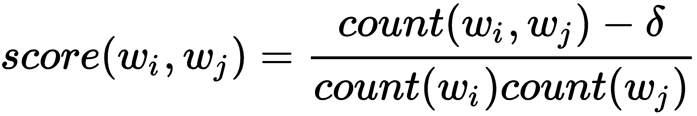
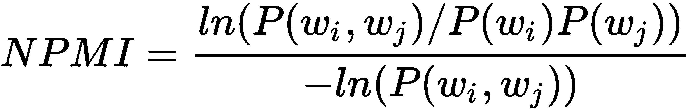
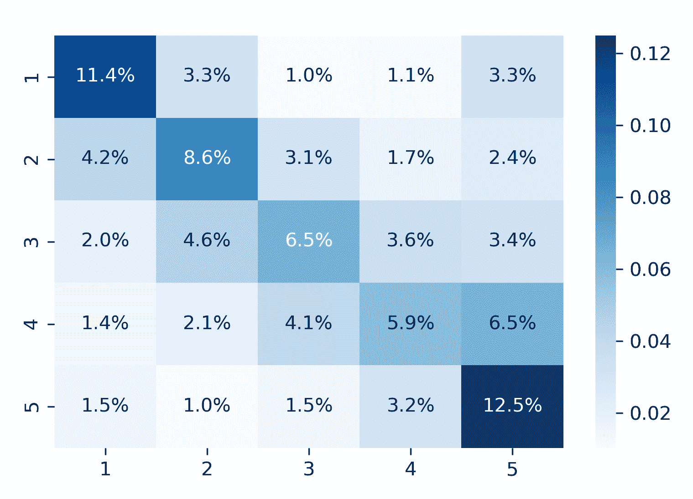

# 十五、词嵌入

在前两章中，我们应用词袋模型将文本数据转换成数字格式。结果是稀疏的、固定长度的向量，表示高维单词空间中的文档。这允许评估文档的相似性，并创建特征来训练机器学习算法，并对文档的内容进行分类或对其中表达的情感进行评级。然而，这些向量忽略了使用术语的上下文，因此，例如，包含相同单词的不同句子将由相同的向量编码。

在这一章中，我们将介绍另一类算法，它们使用神经网络来学习单个语义单元(如单词或段落)的矢量表示。这些向量是密集的而不是稀疏的，并且具有数百个实值而不是数万个二进制或离散条目。它们被称为**嵌入**，因为它们在连续的向量空间中给每个语义单元分配一个位置。

嵌入是通过训练模型来将令牌与其上下文相关联而产生的，其好处是相似的用法意味着相似的向量。此外，我们将看到嵌入是如何对语义方面进行编码的，例如通过单词的相对位置来确定单词之间的关系。因此，它们是用于深度学习模型的强大功能，我们将在接下来的章节中介绍。

更具体地说，在本章中，我们将讨论以下主题:

*   什么是词嵌入以及它们如何工作和捕获语义信息
*   如何使用经过训练的单词向量
*   哪些网络架构对训练 Word2vec 模型有用
*   如何使用 Keras、gensim 和 TensorFlow 训练 Word2vec 模型
*   如何可视化和评估词向量的质量
*   如何使用 SEC 文件训练 Word2vec 模型
*   `Doc2vec`如何扩展 Word2vec

# 词嵌入如何编码语义

单词袋模型将文档表示为反映它们所包含的标记的向量。词嵌入将标记表示为低维向量，因此它们的相对位置反映了它们在上下文中如何使用的关系。它们体现了语言学中的分布假说，即单词最好由它们的同伴来定义。

词向量能够捕捉许多语义方面；不仅同义词彼此接近，而且单词可以有多种相似度，例如，单词 driver 可以类似于 driver 或 to cause。此外，嵌入反映了成对的词之间的关系，例如类推(东京对于日本就像巴黎对于法国一样，或者去了就是去了，所见即所见)，我们将在本节稍后说明。

嵌入是通过训练机器学习模型来根据上下文预测单词而产生的，反之亦然。在下一节中，我们将介绍这些神经语言模型是如何工作的，并介绍包括 Word2vec、`Doc2vec`和 fastText 在内的成功方法。

# 神经语言模型如何在上下文中学习用法

词嵌入是通过训练浅层神经网络来预测给定上下文的单词而产生的。传统语言模型将上下文定义为目标之前的单词，而词嵌入模型使用目标周围对称窗口中包含的单词。相比之下，单词袋模型使用整个文档作为上下文，并使用(加权)计数来捕获单词的共现，而不是预测向量。

使用的早期神经语言模型包括增加计算复杂性的非线性隐藏层。Word2vec 及其扩展简化了体系结构，可以在大型数据集上进行训练(例如，维基百科包含超过 20 亿个标记；参见[第 17 章](https://www.packtpub.com/sites/default/files/downloads/Deep_Learning.pdf)、*深度学习*，了解关于前馈网络的更多细节)。

# Word2vec 模型-大规模学习嵌入

Word2vec 模型是一个两层神经网络，它将文本语料库作为输入，并输出该语料库中单词的一组嵌入向量。有两种不同的体系结构可以使用下图所示的浅层神经网络有效地学习单词向量:

*   **连续单词袋** ( **CBOW** )模型使用上下文单词向量的平均值作为输入来预测目标单词，因此它们的顺序无关紧要。CBOW 模型训练速度更快，对于频繁出现的术语往往更准确，但对不常用的词关注较少。
*   相比之下， **Skip-Gram** ( **SG** )模型使用目标单词来预测从上下文中抽取的单词。它适用于小型数据集，即使对于罕见的单词或短语也能找到很好的表示:


因此，Word2vec 模型接收一个嵌入向量作为输入，并使用另一个嵌入向量计算点积。请注意，假设向量为赋范向量，当向量相等时，点积最大(绝对值),当向量正交时，点积最小。

然后，它使用反向传播来调整嵌入权重，以响应由目标函数计算的由于任何分类错误造成的损失。我们将在下一节看到 Word2vec 如何计算损耗。

训练通过在文档上滑动上下文窗口来进行，文档通常被分割成句子。对语料库的每次完整迭代被称为一个**时期**。根据数据，矢量质量收敛可能需要几十个历元。

从技术上讲，SG 模型已经被证明可以分解一个单词-上下文矩阵，该矩阵包含了相应单词和上下文对的点态交互信息(参见 GitHub 上的参考资料)。

# 模型目标–简化 softmax

Word2vec 模型旨在从潜在的巨大词汇表中预测单个单词。神经网络通常使用 softmax 函数，该函数将任意数量的实数值映射到相等数量的概率，以实现相应的多类目标，其中 *h* 表示嵌入， *v* 表示输入向量， *c* 是单词 *w* 的上下文:


然而，softmax 的复杂性随着类的数量而增加，因为分母需要计算词汇表中所有单词的点积来标准化概率。Word2vec 模型通过使用 softmax 的简化版本或基于采样的方法来提高效率(有关详细信息，请参见参考文献):

*   **分级 softmax** 将词汇表组织成二叉树，以单词为叶节点。到每个节点的唯一路径可用于计算单词概率。
*   **噪声对比估计** ( **NCE** )对断章取义的“噪声词”进行采样，通过二元分类问题近似多类任务。随着样本数量的增加，NCE 导数接近 softmax 梯度，但是少至 25 个样本就可以以快 45 倍的速度产生类似于 softmax 的收敛。
*   **负采样** ( **NEG** )省略噪声词样本来近似 NCE，直接最大化目标词的概率。因此，NEG 优化了嵌入向量的语义质量(相似用法的相似向量),而不是测试集的准确性。然而，与分级 softmax 目标相比，它可能对不常用的单词产生较差的表示。

# 自动短语检测

预处理通常涉及短语检测，即识别通常一起使用并且应该接收单个向量表示的记号(例如，New York City，参见第十三章、*使用文本数据*中 [对 n-grams 的讨论)。](13.html)

最初的 Word2vec 作者使用一种简单的 lift 评分方法，如果两个单词*w<sub>I</sub>T3】、*w<sub>j</sub>T7】的联合出现超过了相对于每个单词的单独出现的给定阈值，则该方法将这两个单词识别为二元组，并通过折扣因子 *δ* 进行校正:**



计分器可以被重复应用来识别连续更长的短语。

一种替代方法是更准确但计算成本更高的标准化逐点互信息得分。它使用相对词频 *P(w)* 并在+1 和-1 之间变化:



# 如何评估嵌入——向量算术和类似物

单词袋模型创建反映标记的存在和与文档的相关性的文档向量。**潜在语义分析**减少这些向量的维度，并识别在该过程中哪些可以被解释为潜在概念。**潜在狄利克雷分配**将文档和术语表示为包含潜在主题权重的向量。

单词和短语向量的维度没有明确的含义。然而，嵌入在潜在空间中以一种延续到语义关系的方式将类似的用法编码为邻近。这导致了有趣的性质，类比可以通过增加和减少单词向量来表达。

下图显示了连接巴黎和法国的向量(即它们嵌入的差异)如何反映关系的资本。类比关系，伦敦:英国，对应的是同一个向量，即英国非常接近向量的首都加到伦敦得到的位置:


就像词可以用在不同的语境中，它们可以以不同的方式与其他词相关联，这些关系对应着潜在空间中的不同方向。因此，如果训练数据允许，嵌入应该反映几种类型的类比。

Word2vec 的作者提供了几千个关系的列表，这些关系跨越了地理、语法和句法以及家族关系的各个方面，以评估嵌入向量的质量。如上所示，该测试验证了目标单词(UK)最接近于将表示类似关系的向量(Paris: France)添加到目标的补码(London)的结果。

下图使用**主成分分析** ( **PCA** )将在维基百科语料库上训练的具有超过 20 亿个标记的 Word2vec 模型的最密切相关的类比的 300 维嵌入投影到二维中。来自以下类别的超过 24，400 个类比的测试实现了超过 73.5%的准确性(参见笔记本):


使用嵌入模型

与其他无监督学习技术类似，学习嵌入向量的目标是为其他任务(如文本分类或情感分析)生成特征。

对于给定的文档语料库，有几种选择来获得嵌入向量:

*   使用从通用大型语料库(如维基百科或谷歌新闻)中学习的嵌入
*   使用反映感兴趣领域的文档来训练您自己的模型

后续文本建模任务的内容越不通用和越专门化，第二种方法就越可取。然而，高质量的词嵌入需要大量数据，并且需要包含数亿个单词的信息文档。

# 如何使用预先训练好的单词向量

预训练词嵌入有几个来源。流行的选项包括斯坦福的 GloVE 和 spaCy 的内置 vectors(详见笔记本`using_trained_vectors`)。

# GloVe–单词表示的全局向量

GloVe 是斯坦福大学 NLP 实验室开发的一种无监督算法，它从聚合的全局单词-单词共现统计中学习单词的向量表示(见参考文献)。在以下网络级来源上预先训练的矢量可用:

*   具有 42B 或 840B 标记和词汇表或 1.9M 或 2.2M 标记普通爬行
*   Wikipedia 2014 + Gigaword 5，具有 6B 令牌和 40 万令牌的词汇表
*   Twitter 使用 2B 的推文、27B 个令牌和 120 万个令牌的词汇表

我们可以使用 gensim 将矢量文本文件转换并加载到`KeyedVector`对象中:

```
from gensim.models import Word2vec, KeyedVectors
 from gensim.scripts.glove2Word2vec import glove2Word2vec
glove2Word2vec(glove_input_file=glove_file, Word2vec_output_file=w2v_file)
 model = KeyedVectors.load_Word2vec_format(w2v_file, binary=False)
```

Word2vec 作者提供了包含超过 24，000 个类比测试的文本文件，gensim 使用这些测试来评估单词向量。

在维基百科语料库上训练的词向量覆盖了所有的类比，并且实现了 75.5%的总体准确率，不同类别之间存在一些差异:

| **类别** | **样本** | **精度** | **类别** | **样本** | **精度** |
| 资本共同国家 | Five hundred and six | 94.86% | 比较的 | One thousand three hundred and thirty-two | 88.21% |
| 资本世界 | Eight thousand three hundred and seventy-two | 96.46% | 过度的 | One thousand and fifty-six | 74.62% |
| 州内城市 | Four thousand two hundred and forty-two | 60.00% | 现在分词 | One thousand and fifty-six | 69.98% |
| 货币 | Seven hundred and fifty-two | 17.42% | 国籍形容词 | One thousand six hundred and forty | 92.50% |
| 家庭的 | Five hundred and six | 88.14% | 过去式 | One thousand five hundred and sixty | 61.15% |
| 形容词转副词 | Nine hundred and ninety-two | 22.58% | 复数 | One thousand three hundred and thirty-two | 78.08% |
| 对面的 | Seven hundred and fifty-six | 28.57% | 复数动词 | Eight hundred and seventy | 58.51% |

100，000 个最常见令牌的常见爬行向量覆盖了大约 80%的类比，并达到了 78%的略高准确度，而 Twitter 向量仅覆盖了 25%，准确度为 62%。

# 如何训练你自己的单词向量嵌入

许多任务需要嵌入或特定领域的词汇，基于通用语料库的预训练模型可能不能很好地表示或根本不能表示。标准的 Word2vec 模型不能将向量分配给词汇表之外的单词，而是使用默认向量来降低它们的预测值。

例如，当处理特定于行业的文档时，随着新技术或产品的出现，词汇或其用法可能会随着时间而改变。因此，嵌入也需要发展。此外，企业收益报告使用了微妙的语言，这些语言在维基百科文章中没有得到充分反映。

我们将使用 Keras 库来说明 Word2vec 架构，我们将在下一章中更详细地介绍 Keras 库，以及 Word2vec 作者提供的代码的更高性能的 gensim 改编。笔记本 Word2vec 包含额外的实现细节，包括 TensorFlow 实现的参考。

# 喀拉斯的跳格建筑

为了说明 Word2vec 网络架构，我们使用了我们在第十三章[、*使用文本数据*中首次介绍的带有对齐的英语和西班牙语字幕的 TED Talk 数据集。](https://cdp.packtpub.com/hands_on_machine_learning_for_algorithmic_trading/wp-admin/post.php?post=682&action=edit#post_584)

笔记本包含对文档进行标记的代码，并为词汇表中的每个条目分配一个惟一的 ID。我们要求在语料库中至少出现五次，并保持 31，300 个词汇。

# 噪声对比估计

Keras 包括一个`make_sampling_table`方法，允许我们创建一个训练集，作为具有相应标签的上下文和干扰词对，根据它们的语料库频率进行采样。

结果是 2700 万个上下文和目标对的正例和负例。

# 模型组件

*Skip-Gram* 模型包含每个词汇项的 200 维嵌入向量，产生 31，300 x 200 个可训练参数，外加两个 sigmoid 输出。

在每次迭代中，该模型计算上下文和目标嵌入向量的点积，通过 sigmoid 传递结果以产生概率，并基于损失的梯度调整嵌入。

# 使用 TensorBoard 可视化嵌入

TensorBoard 是一种可视化工具，它允许将嵌入向量投影到三维空间中，以探索单词和短语的位置。

# 使用 gensim 的 SEC 文件中的词向量

在本节中，我们将使用 gensim 从美国证券交易委员会 ( **SEC** )的年度文件中学习单词和短语向量，以说明词嵌入对于算法交易的潜在价值。在接下来的几节中，我们将把这些向量作为特征与价格回报结合起来，训练神经网络从证券备案文件的内容中预测股票价格。

特别是，我们使用的数据集包含 22，000 多份 2013-2016 年期间的 10-K 年度报告，这些报告由上市公司提交，包含财务信息和管理层评论(参见[第 3 章](03.html)、*财务替代数据*)。对于大约一半的公司 11-K 文件，我们有股票价格来标记预测建模的数据(有关详细信息，请参见`sec-filings`文件夹中关于数据源和笔记本的参考资料)。

# 预处理

每个归档是一个单独的文本文件，主索引包含归档元数据。我们提取了信息最丰富的部分，即:

*   **第 1 项和 1A** :业务和风险因素
*   **项目 7 和 7A** :管理层关于市场风险的讨论和披露

笔记本预处理展示了如何使用 spaCy 解析和标记文本，类似于[第 14 章](14.html)、*主题建模*中采用的方法。为了保持单词用法的细微差别，我们没有对标记进行词汇化。

# 自动短语检测

我们使用`gensim`来检测前面介绍过的短语。`Phrases`模块对标记进行评分，`Phraser`类相应地转换文本数据。笔记本显示了如何重复这一过程来创建更长的短语:

```
sentences = LineSentence(f'ngrams_1.txt')
phrases = Phrases(sentences=sentences,
                  min_count=25,  # ignore terms with a lower count
                  threshold=0.5,  # only phrases with higher score
                  delimiter=b'_',  # how to join ngram tokens
                  scoring='npmi')  # alternative: default
grams = Phraser(phrases)
sentences = grams[sentences]
```

最常见的二元模型包括`common_stock`、`united_states`、`cash_flows`、`real_estate`和`interest_rates`。

# 模特培训

`gensim.models.Word2vec`类实现了前面介绍的 SG 和 CBOW 架构。Word2vec 笔记本包含了额外的实现细节。

为了促进高效存储的文本获取，`LineSentence`类从所提供的文本文件中包含的各个句子创建一个生成器:

```
sentence_path = Path('data', 'ngrams', f'ngrams_2.txt')
sentences = LineSentence(sentence_path)
```

`Word2vec`类提供了之前介绍的配置选项:

```
model = Word2vec(sentences,
                 sg=1,    # 1=skip-gram; otherwise CBOW
                 hs=0,    # hier. softmax if 1, neg. sampling if 0
                 size=300,      # Vector dimensionality
                 window=3,      # Max dist. btw target and context word
                 min_count=50,  # Ignore words with lower frequency
                 negative=10,  # noise word count for negative sampling
                 workers=8,     # no threads 
                 iter=1,        # no epochs = iterations over corpus
                 alpha=0.025,   # initial learning rate
                 min_alpha=0.0001 # final learning rate
                )
```

笔记本显示了如何保存和重新加载模型以继续训练，或者如何单独存储嵌入向量，例如，用于 ML 模型。

# 模型评估

基本功能包括识别相似的单词:

```
model.wv.most_similar(positive=['iphone'], 
                      restrict_vocab=15000)
                 term  similarity
0              android    0.600454
1           smartphone    0.581685
2                  app    0.559129
```

我们也可以相应地使用正面和负面贡献来验证个别类比:

```
model.wv.most_similar(positive=['france', 'london'], 
                      negative=['paris'], 
                      restrict_vocab=15000)

             term  similarity
0  united_kingdom    0.606630
1         germany    0.585644
2     netherlands    0.578868
```

# 参数设置的性能影响

我们可以使用类比来评估不同参数设置的影响。以下结果较为突出(参见`models`文件夹中的详细结果):

*   负采样优于分层 softmax，同时训练速度也更快
*   给定目标函数，Skip-Gram 体系结构优于 CBOW
*   不同的`min_count`设置影响较小，中点 50 表现最佳

使用负采样和 50 的`min_count`对性能最佳的 SG 模型进行的进一步实验表明:

*   小于 5 的上下文窗口会降低性能
*   较高的负采样率以较慢的训练为代价来提高性能
*   较大的向量可以提高性能，大小为 600 时，精度最高，为 38.5%

# 使用 Doc2vec 进行情感分析

文本分类需要组合多个词嵌入。一种常见的方法是平均文档中每个单词的嵌入向量。这使用来自所有嵌入的信息，并且有效地使用向量加法来到达嵌入空间中的不同位置点。但是，关于单词顺序的相关信息会丢失。

相比之下，为段落或产品评论等文本片段生成嵌入的最新技术是使用文档嵌入模型`Doc2vec`。这个模型是由 Word2vec 作者在发表他们的原始贡献后不久开发的。

和 Word2vec 类似的还有两种口味的`Doc2vec`:

*   **分布式单词包** ( **DBOW** )模型对应 Word2vec CBOW 模型。文档向量来自于在基于上下文单词向量和文档的文档向量预测目标单词的综合任务中训练网络。
*   **分布式内存** ( **DM** )模型对应 Word2vec 跳跃式架构。文档向量来自训练神经网络，以使用整个文档的文档向量来预测目标单词。

Gensim 的`Doc2vec`类实现了这个算法。

# yelp 情感数据上的训练文档 2vec

我们随机抽取了 500，000 条 Yelp 评论(参见[第 13 章](13.html)、*处理文本数据*)及其相关星级(参见笔记本`yelp_sentiment`):

```
df = (pd.read_parquet('yelp_reviews.parquet', engine='fastparquet')
          .loc[:, ['stars', 'text']])
stars = range(1, 6)
sample = pd.concat([df[df.stars==s].sample(n=100000) for s in stars])
```

我们使用简单的预处理，使用`NLTK`的标记器删除停用词和标点符号，并删除少于 10 个标记的评论:

```
import nltk
nltk.download('stopwords')
from nltk import RegexpTokenizer
from nltk.corpus import stopwords
tokenizer = RegexpTokenizer(r'\w+')
stopword_set = set(stopwords.words('english'))

def clean(review):
    tokens = tokenizer.tokenize(review)
    return ' '.join([t for t in tokens if t not in stopword_set])

sample.text = sample.text.str.lower().apply(clean)
sample = sample[sample.text.str.split().str.len()>10]
```

# 创建输入数据

`gensim.models.doc2vec`类处理`TaggedDocument`格式的文档，该格式包含标记化的文档以及唯一的标签，该标签允许在训练后访问文档向量:

```
sentences = []
for i, (_, text) in enumerate(sample.values):
    sentences.append(TaggedDocument(words=text.split(), tags=[i]))
```

训练界面的工作方式类似于`word2vec`,并带有附加参数来指定 Doc2vec 算法:

```
model = Doc2vec(documents=sentences,
                dm=1,          # algorithm: use distributed memory
                dm_concat=0,   # 1: concat, not sum/avg context vectors
                dbow_words=0,  # 1: train word vectors, 0: only doc 
                                    vectors
                alpha=0.025,   # initial learning rate
                size=300,
                window=5,
                min_count=10,
                epochs=5,
                negative=5)
model.save('test.model')
```

您还可以使用`train()`方法继续学习过程，例如，迭代降低学习速率:

```
for _ in range(10):
    alpha *= .9
    model.train(sentences,
                total_examples=model.corpus_count,
                epochs=model.epochs,
                alpha=alpha)
```

因此，我们可以访问文档向量作为特征来训练情感分类器:

```
X = np.zeros(shape=(len(sample), size))
y = sample.stars.sub(1) # model needs [0, 5) labels
for i in range(len(sample)):
 X[i] = model[i]
```

我们将按如下方式训练一台`lightgbm`梯度提升机:

1.  从训练集和测试集中创建`lightgbm` `Dataset`对象:

```
train_data = lgb.Dataset(data=X_train, label=y_train)
test_data = train_data.create_valid(X_test, label=y_test)
```

2.  为包含五个类别的多类别模型定义训练参数(否则使用默认值):

```
params = {'objective'  : 'multiclass',
          'num_classes': 5}
```

3.  对模型进行 250 次迭代训练，并监控验证集误差:

```
lgb_model = lgb.train(params=params,
                      train_set=train_data,
                      num_boost_round=250,
                      valid_sets=[train_data, test_data],
                      verbose_eval=25)
```

4.  Lightgbm 预测所有五个类别的概率。我们使用`np.argmax()`获得类预测，以获得具有最高预测概率的列索引:

```
y_pred = np.argmax(lgb_model.predict(X_test), axis=1)
```

5.  我们计算准确性分数来评估结果，并看到五个平衡类在基线 20%的基础上提高了 100%以上:

```
accuracy_score(y_true=y_test, y_pred=y_pred)
0.44955063467061984
```

6.  最后，我们使用混淆矩阵来仔细查看每个类别的预测:

```
cm = confusion_matrix(y_true=y_test, y_pred=y_pred)
cm = pd.DataFrame(cm / np.sum(cm), index=stars, columns=stars)
```

7.  并将结果可视化为`seaborn`热图:

```
sns.heatmap(cm, annot=True, cmap='Blues', fmt='.1%')
```



总之，`doc2vec`方法允许我们在没有太多调优的情况下，在测试精度上比简单的基准测试有了很大的提高。如果我们仅选择顶部和底部评论(分别为五星和一星)并训练二元分类器，则使用来自每个类别的 250，000 个样本，AUC 得分达到 0.86 以上。

# 奖金 Word2vec 用于翻译

笔记本翻译证明了一种语言中编码的关系通常对应于另一种语言中的类似关系。

它说明了如何通过使用翻译矩阵将单词向量从一种语言的嵌入空间投影到另一种语言的空间来使用单词向量翻译单词和短语。

# 摘要

本章从词嵌入如何比我们在[第 13 章](13.html)、*处理文本数据中使用的单词袋模型更有效地编码单个单词的语义开始。*我们还看到了如何通过验证单词之间的语义关系是否使用线性向量算法正确表示来评估嵌入。

为了学习词嵌入，我们使用浅层神经网络，该网络过去在包含数十亿令牌的网络数据规模下训练缓慢。`word2vec`模型结合了几项算法创新，大大加快了训练速度，并建立了文本特征生成的新标准。我们看到了如何使用`spaCy`和`gensim`来使用预训练的单词向量，并学习了如何训练我们自己的单词向量嵌入。然后，我们将一个`word2vec`模型应用到 SEC 文件中。最后，我们介绍了`doc2vec`扩展，它以与单词向量相似的方式学习文档的向量表示，并将其应用于 Yelp 商业评论。

现在，我们将开始关于深度学习的第 4 部分(如前言中所述，可在线获得)，首先介绍前馈网络、流行的深度学习框架和大规模高效培训技术。