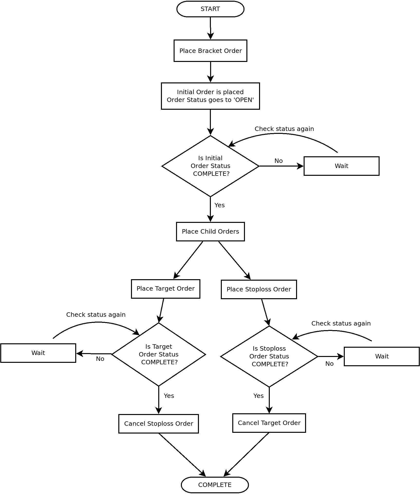
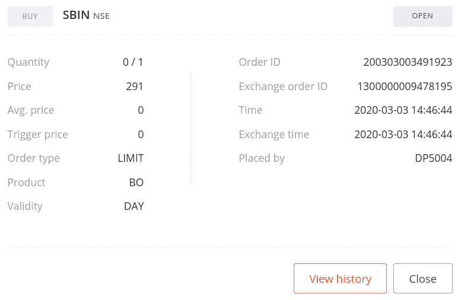
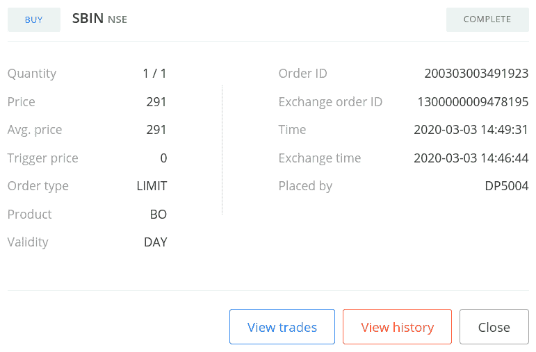
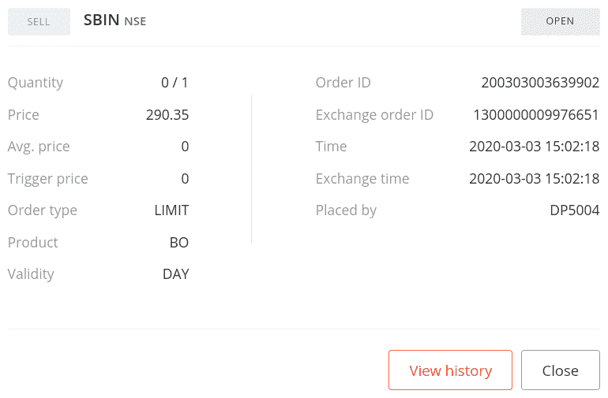
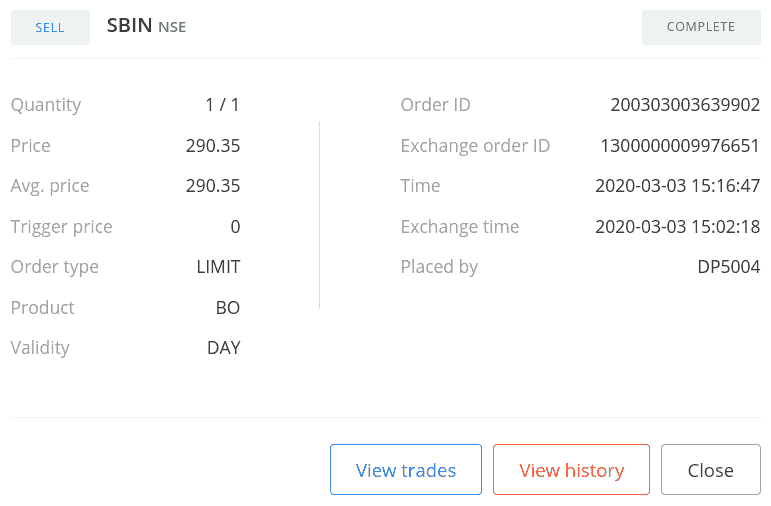
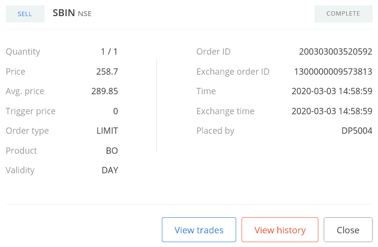
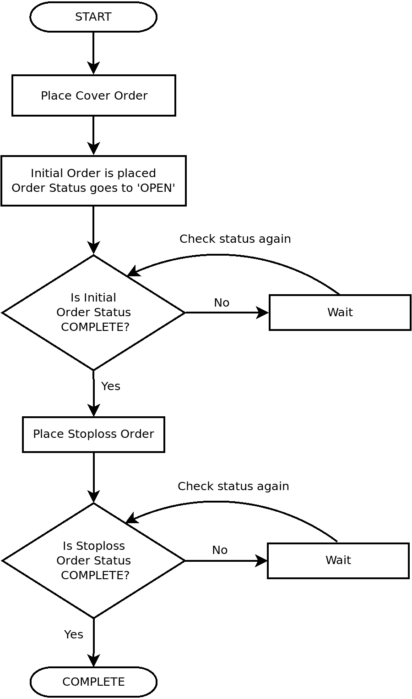
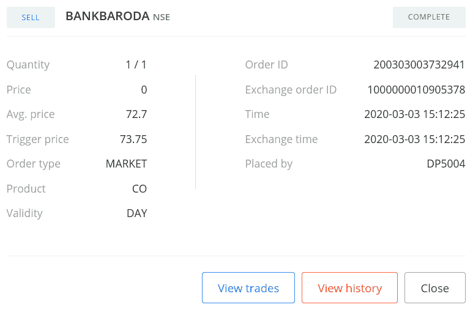
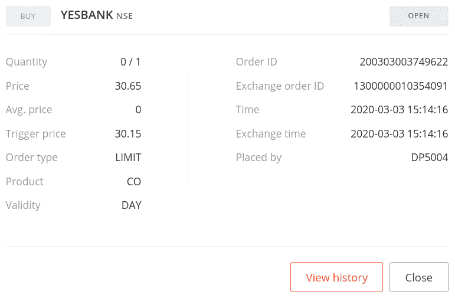
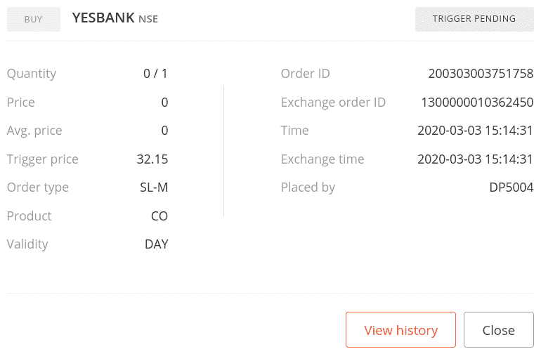

# 在交易所下支架和覆盖订单

本章介绍了可以通过代理 API 在交易所下单的各种类型的套期保值和保单。菜谱包括用于下 12 种订单并查询其状态、取消未完成订单和退出已完成订单的代码。这些食谱将是你的算法交易策略的基础部分。了解所有类型的订单，并知道根据给定的要求下哪一个订单，对于建立成功的交易策略至关重要。

每个订单有四个属性，它们共同完整地定义了订单:

*   订单交易类型
*   订单类型
*   指令码
*   订单品种

为了下订单，应该准确地知道所有四个属性。要了解更多关于这些属性的信息，请参考[介绍第六章](06.html)、*在交易所进行常规下单*。

本章中的配方为每种订单类型提供了详细的流程图。交易所的每一笔订单在其生命周期内都会经历不同的状态。要了解更多关于本章使用的经纪人所支持的订单状态，请参考[第六章](06.html)的介绍，*在交易所发出常规订单*。

在本章中，我们将介绍以下配方:

*   下达限价委托单
*   下达支架止损限价订单
*   设置带有尾随止损点的托架限价单
*   设置带有尾随止损点的托架止损点-限价单
*   发出空头市场订单
*   下限价单

请确保您在交易时段尝试了所有这些食谱，并且您的经纪账户中有足够的余额。如果这些食谱是在市场时间之外尝试的，或者余额不足，你的订单将被经纪人拒绝。这意味着订单永远不会到达交易所，你也不会得到预期的回应。

# 技术要求

要成功执行本章中的配方，您需要具备以下条件:

*   Python 3.7+版本
*   Python 包:`pyalgotrading` ( `$ pip install pyalgotrading`)

本章最新的 Jupyter 笔记本可以在 GitHub 上找到，网址为[https://GitHub . com/packt publishing/Python-algorithm-Trading-Cookbook/tree/master/chapter 07](https://github.com/PacktPublishing/Python-Algorithmic-Trading-Cookbook/tree/master/Chapter07)。

设置与代理的连接所需的第一件事是获取 API 密钥。代理将为每个客户提供唯一的密钥，通常是一对`api-key`和`api-secret`密钥。这些 API 密钥是收费的，通常是按月订阅的。在开始之前，你需要从经纪人网站获得你的`api-key`和`api-secret`副本。更多细节可以参考*附录一*。

下面的步骤将帮助您建立与 Zerodha 的代理连接，本章中的所有菜谱都将使用它。在尝试任何食谱之前，请确保您遵循了以下步骤:

1.  导入必要的模块:

```
>>> from pyalgotrading.broker.broker_connection_zerodha import BrokerConnectionZerodha
>>> from pyalgotrading.constants import *
```

所有的`pyalgotrading`常量现在都可以在 Python 名称空间中使用了。

2.  从代理获取`api_key`和`api_secret`密钥。这些是您独有的，经纪人将使用它们来识别您的 Demat 帐户:

```
>>> api_key = "<your-api-key>"
>>> api_secret = "<your-api-secret>"
>>> broker_connection = BrokerConnectionZerodha(api_key, 
                                                api_secret)
```

我们得到以下输出:

```
Installing package kiteconnect via pip. This may take a while...
Please login to this link to generate your request token: https://kite.trade/connect/login?api_key=<your-api-key>&v=3
```

如果您是第一次运行此程序，并且没有安装`kiteconnect`，则`pyalgotrading`会自动为您安装。第二步的最终输出将是一个链接。点击链接并使用您的 Zerodha 凭据登录。如果认证成功，您将在浏览器的地址栏中看到类似于`https://127.0.0.1/?request_token=<alphanumeric-token>&action=login&status=success`的链接。

我们有以下例子:

```
https://127.0.0.1/?request_token=H06I6Ydv95y23D2Dp7NbigFjKweGwRP7&action=login&status=success
```

3.  复制字母数字标记并粘贴到`request_token`:

```
>>> request_token = "<your-request-token>"
>>> broker_connection.set_access_token(request_token)
```

`broker_connection`实例现在已经准备好执行 API 调用。

`pyalgotrading`包支持多个代理，并使用相同的方法为每个代理提供一个连接对象类。它在一个统一的接口后面抽象了代理 API，所以用户不需要担心底层的代理 API 调用，并且可以原样使用本章中的所有配方。只有建立代理连接的过程会因代理而异。如果您没有使用 Zerodha 作为您的代理，您可以参考`pyalgotrading`文档来设置代理连接。对于 Zerodha 用户来说，前面提到的步骤就足够了。

# 下达限价委托单

支架订单是复杂的订单，旨在帮助在交易变得有利时获利，或在交易变得不利时限制损失，具有预定义的值。支架订单实质上是三个常规订单的组合，即初始订单、目标订单和止损订单，它们共同帮助实现指定的利润或限制损失。除了常规订单参数之外，括号订单还带有其他参数— `target`、`stoploss`和`trailing stoploss`(可选)。三个常规订单描述如下:

*   **初始订单**:该订单等同于普通限价订单或普通止损限价订单。一旦成交，它将保持在`'OPEN'`状态，直到市场价格达到其触发价格值。一旦市场越过触发价格值，该订单从`'OPEN'`状态转移到`'COMPLETE'`状态，目标订单和止损订单被发出，这将在下面描述。
*   **目标订单**:该订单相当于普通限价订单，其触发价格为指定的目标价值，交易类型与初始订单相反。对于买入初始订单，目标订单的价格高于初始订单。对于卖出初始订单，反之亦然。数量与最初的订单相符。因此，如果该订单执行，它将退出初始订单创建的仓位。

*   **止损单**:该订单相当于普通的止损限价单，其触发价格为指定的`stoploss`值，交易类型与初始订单相反。对于买入初始订单，止损订单的价格低于初始订单。对于卖出初始订单，反之亦然。数量与最初的订单相符。因此，如果该订单执行，它将退出初始订单创建的仓位。如果指定了`trailing stoploss`参数，则每次初始订单价格向目标订单价格方向移动时，止损单都会向初始订单价格方向修改，修改的点数与`trailing stoploss`的值相同。这有助于在初始订单的价格运动方向发生变化的情况下进一步减少损失。

由于目标订单和止损订单位于初始订单的相对两侧，它们在初始订单周围形成一个*括号*，因此该订单被称为**括号订单**。此外，由于目标订单和止损订单位于相反的两侧，因此在给定时间内，只有其中一个订单会被执行(这意味着其状态会从`'OPEN'`变为`'COMPLETE'`),当执行时，订单(止损订单或目标订单)会被自动取消。目标订单和止损订单也统称为初始订单的**子订单**，后者称为前者的**母订单**。

除非有经纪人的支持，否则挂单通常是指当天交易。如果初始订单或子订单在交易时段结束时没有完成，它们将被经纪人自动取消或退出。

以下流程图解释了**支架订单**的工作原理:



以下是对支架限制订单的状态机图的参考:

*   **初始指令**:参考上一章*发出常规限价指令*配方的状态机图。
*   **目标订单**:参考上一章*发出常规限价订单*配方的状态机图。
*   **止损单**:参考上一章*发出常规止损限价单*配方的状态机图。

当买入委托单必须低于市价或卖出委托单必须高于市价时，您可以使用限价委托单。

本配方演示了下述限价委托单并查询其状态:

*   `BUY`、`BRACKET`、`INTRADAY`、`LIMIT`顺序(无尾随止损点)
*   `SELL`、`BRACKET`、`INTRADAY`、`LIMIT`顺序(无尾随止损点)

## 做好准备

确保`pyalgotrading`包中的`broker_connection`对象和常量在 Python 名称空间中可用。参照本章*技术要求*一节设置该对象。

## 怎么做…

我们为此配方执行以下步骤:

1.  获取金融工具并将其分配给`instrument`:

```
>>> instrument = broker_connection.get_instrument('NSE', 'SBIN')
```

2.  去拿 LTP。下`BUY`、`BRACKET`、`INTRADAY`、`LIMIT`订单，显示订单 ID:

```
>>> ltp = broker_connection.get_ltp(instrument)
>>> order1_id = broker_connection.place_order(
                    instrument=instrument,
                    order_transaction_type= \
                        BrokerOrderTransactionTypeConstants.BUY,
                    order_type=BrokerOrderTypeConstants.BRACKET,
                    order_code=BrokerOrderCodeConstants.INTRADAY,
                    order_variety= \
                        BrokerOrderVarietyConstants.LIMIT,
                    quantity=1,
                    price=ltp-1,
                    stoploss=2,
                    target=2)
>>> order1_id
```

我们得到以下输出(您的输出可能不同):

```
'2003030003491923'
```

3.  获取并显示订单状态:

```
>>> broker_connection.get_order_status(order1_id)
```

我们得到以下输出:

```
'OPEN'
```

如果您使用您的凭据登录到代理站点并转到订单部分，您可以找到您的订单详细信息，如以下屏幕截图所示(某些数据可能因您而异):



4.  一段时间后再次获取并显示订单状态:

```
>>> broker_connection.get_order_status(order1_id)
```

我们得到以下输出:

```
'COMPLETE'
```

如果您使用您的凭据登录到代理站点并转到订单部分，您可以找到您的订单详细信息，如以下屏幕截图所示(某些数据可能因您而异):



5.  去拿 LTP。下`SELL`、`BRACKET`、`INTRADAY`、`LIMIT`订单，显示订单 ID:

```
>>> ltp = broker_connection.get_ltp(instrument)
>>> order2_id = broker_connection.place_order(
                    instrument=instrument,
                    order_transaction_type= \
                        BrokerOrderTransactionTypeConstants.SELL,
                    order_type=BrokerOrderTypeConstants.BRACKET,
                    order_code=BrokerOrderCodeConstants.INTRADAY,
                    order_variety= \
                        BrokerOrderVarietyConstants.LIMIT,
                    quantity=1,
                    price=ltp+1,
                    stoploss=2,
                    target=2)
>>> order2_id
```

我们得到以下输出(您的输出可能不同):

```
'200303003639902'
```

6.  获取并显示订单状态:

```
>>> broker_connection.get_order_status(order2_id)
```

我们得到以下输出:

```
'OPEN'
```

如果您使用您的凭据登录到代理站点并转到订单部分，您可以找到您的订单详细信息，如以下屏幕截图所示(某些数据可能因您而异):



7.  一段时间后再次获取并显示订单状态:

```
>>> broker_connection.get_order_status(order2_id)
```

我们得到以下输出:

```
'COMPLETE'
```

如果您使用您的凭据登录到代理站点并转到订单部分，您可以找到您的订单详细信息，如以下屏幕截图所示(某些数据可能因您而异):



## 它是如何工作的…

在*步骤 1* 中，您使用`BrokerConnectionZerodha`类的`get_instrument()`方法获取一个乐器，并将其分配给一个新属性`instrument`。这个对象是`Instrument`类的一个实例。调用`get_instrument`所需的两个参数是交易所(`'NSE'`)和交易符号(`'SBI'`)。

在*步骤 2* 中，您使用`BrokerConnectionZerodha`类的`get_ltp()`方法获取仪器的 LTP，并将其分配给一个新属性`ltp`。`instrument`对象在这里作为参数传递。接下来，您使用`broker_connection`对象的`place_order()`方法在交易所下一个`BUY`、`BRACKET`、`INTRADAY`、`LIMIT`订单。`place_order()`方法是特定于经纪人的下单 API 的包装器。它具有以下属性:

*   `instrument`:这是必须下单的金融工具，应该是`Instrument`类的一个实例。我们经过`instrument`这里。
*   `order_transaction_type`:这是订单交易类型，应该是`BrokerOrderTransactionTypeConstants`类型的枚举。我们经过`BrokerOrderTransactionTypeConstants.BUY`这里。

*   `order_type`:这是订单类型，应该是`BrokerOrderTypeConstants`类型的枚举。我们经过`BrokerOrderTypeConstants.BRACKET`这里。
*   `order_code`:这是订单代码，应该是`BrokerOrderCodeConstants`类型的枚举。我们经过`BrokerOrderCodeConstants.INTRADAY`这里。
*   `order_variety`:这是订单种类，应该是`BrokerOrderVarietyConstants`类型的枚举。我们经过`BrokerOrderVarietyConstants.LIMIT`这里。
*   `quantity`:这是给定工具的交易股数，应为正整数。我们在这里通过`1`。
*   `price`:这是应该下单的限价。我们这里通过`ltp-1`，表示单价低于`ltp`的`1`。
*   `stoploss`:这是与初始订单价格的差价，止损单应在该价格下单。它应该是正的`int`或`float`值。我们在这里经过`2`。
*   `target`:这是与初始订单价格的差价，目标订单应在此价格下单。它应该是正的`int`或`float`值。我们在这里经过`2`。

(传递给`place_order()`方法的属性是与代理无关的常量，早些时候从`pyalgotrading.constants`模块导入。)

在*步骤 2* 中下订单时，您从代理那里获得一个订单 ID，您将它分配给一个新属性`order1_id`。`order1_id`对象是一个字符串。如果订单由于某种原因没有成功，您可能无法获得订单 ID。注意到价格参数被传递了一个值`ltp-1`。这意味着订单低于市价，这是下达限价单的必要条件。`stoploss`参数被指定为`2`。这意味着止损单将以低于初始订单执行价格两个价格单位的价格下单。类似地，`target`参数被指定为`2`。这意味着目标订单的价格将比初始订单的执行价格高出两个价格单位。

在*步骤 3* 中，您使用`broker_connection`对象的`get_order_status()`方法获取已下订单的状态。您将`order1_id`作为参数传递给`get_order_status()`方法。您得到的订单状态为`'OPEN'`，一个字符串。您还可以使用`order1_id`在以后的任何时间点获取所下订单的状态。

在*步骤 4* 中，您再次获取订单状态，如果订单完成，您将获得订单状态`'COMPLETE'`。在此之后，目标和止损订单立即以前面提到的价格下单。目标订单作为常规限价订单执行。止损单作为常规止损限价单执行。当其中一个订单被执行并到达`'COMPLETE'`状态时，另一个订单被代理自动取消，因此它移动到`'CANCELLED'`状态。回想一下，目标订单和止损订单都在初始订单的两侧，因此目标订单和止损订单不能同时执行。

您也可以登录经纪网站，查看订单部分，确认订单是否成功。您应该会看到类似于*步骤 3* 和*步骤 4* 的输出中显示的截图的数据。

在*步骤 3* 中，如果看到状态为`'COMPLETE'`而不是`'OPEN'`；这可能是由于高波动性。如果你想让订单停留在`'OPEN'`状态一段时间，试着把订单放在离市场价格更远的地方。

以下是关于执行初始订单、目标订单和止损订单的更多详细信息的参考资料:

*   **初始订单**:参考上一章的*常规限价订单*配方。
*   **目标订单**:参考上一章的*常规限价订单*配方。
*   **止损单**:参考上一章*下达常规止损限价单*配方。

该配方中的其他步骤遵循相同的模式，即针对不同的属性组合下订单并获取其状态:

*   *步骤 5* 、 *6、*和 *7* :按`SELL`、`BRACKET`、`INTRADAY`、`LIMIT`的顺序

## 还有更多…

您可以通过退出一个子订单来退出支架订单。您退出的子订单以市价执行，并进入`COMPLETE`状态。另一个孩子移动到`CANCELLED`状态。

例如，让我们考虑如果你退出止损单的情况。在这种情况下，目标订单将被取消，并转换到`CANCELLED`状态。止损单将按市价执行，并转换到`COMPLETE`状态。如果您使用您的凭证登录到 broker 站点并转到 orders 部分，您可以找到子订单的详细信息，如下面的屏幕截图所示。某些数据可能因您而异。

以下是在退出支架订单之前，在*步骤 2* 中发出的初始订单的目标订单:


以下是退出括号订单后的目标订单:


该屏幕截图显示了在退出之前，在*步骤 2* 中发出的初始订单的止损单:


以下屏幕截图显示了退出后的止损单:



# 下达支架止损限价订单

支架订单是复杂的订单，旨在帮助在交易变得有利时获利，或在交易变得不利时限制损失，具有预定义的值。支架订单实质上是三个常规订单的组合——初始订单、目标订单和止损订单，它们一起帮助实现指定的利润或限制损失。除了常规订单参数之外，括号订单还带有其他参数— `target`、`stoploss`和`trailing stoploss`(可选)。

请参考*下单限价委托*配方的介绍，以深入了解限价委托的工作方式。如果您希望以高于市场价格的价格下单买入，或者以低于市场价格的价格下单卖出，您可以使用限价止损单。

本配方演示了以下支架止损限价订单的下单和状态查询:

*   `BUY`、`BRACKET`、`INTRADAY`、`STOPLOSS_LIMIT`顺序(无尾随止损点)
*   `SELL`、`BRACKET`、`INTRADAY`、`STOPLOSS_LIMIT`顺序(无尾随止损点)

以下是支架止损-限制订单的状态机图参考:

*   **初始指令**:参考上一章*下达常规止损限价指令*配方的状态机图。
*   **目标订单**:参考上一章*发出常规限价订单*配方的状态机图。
*   **止损单**:参考上一章*发出常规止损限价单*配方的状态机图。

## 做好准备

确保`pyalgotrading`包中的`broker_connection`对象和常量在 Python 名称空间中可用。参照本章*技术要求*一节设置该对象。

## 怎么做…

我们为此配方执行以下步骤:

1.  获取金融工具并将其分配给`instrument`:

```
>>> instrument = broker_connection.get_instrument('NSE', 
                                                  'INDUSINDBK')
```

2.  去拿 LTP。下`BUY`、`BRACKET`、`INTRADAY`、`STOPLOSS_LIMIT`订单，显示订单 ID:

```
>>> ltp = broker_connection.get_ltp(instrument.segment)
>>> order1_id = broker_connection.place_order(
                    instrument=instrument,
                    order_transaction_type=\
                        BrokerOrderTransactionTypeConstants.BUY,
                    order_type=BrokerOrderTypeConstants.BRACKET,
                    order_code=BrokerOrderCodeConstants.INTRADAY,
                    order_variety= \
                        BrokerOrderVarietyConstants.STOPLOSS_LIMIT,
                    quantity=1,
                    price=ltp+1,
                    trigger_price=ltp+1,
                    stoploss=2,
                    target=2)
>>> order1_id
```

我们得到以下输出(您的输出可能不同):

```
'200226003619998'
```

3.  获取并显示订单状态:

```
>>> broker_connection.get_order_status(order1_id)
```

我们得到以下输出:

```
'TRIGGER PENDING'
```

4.  一段时间后再次获取并显示订单状态:

```
>>> broker_connection.get_order_status(order1_id)
```

我们得到以下输出:

```
'COMPLETE'
```

5.  去拿 LTP。下`SELL`、`BRACKET`、`INTRADAY`、`STOPLOSS_LIMIT`订单，显示订单 ID:

```
>>> ltp = broker_connection.get_ltp(instrument)
>>> order2_id = broker_connection.place_order(
                    instrument=instrument,
                    order_transaction_type= \
                        BrokerOrderTransactionTypeConstants.SELL,
                    order_type=BrokerOrderTypeConstants.BRACKET,
                    order_code=BrokerOrderCodeConstants.INTRADAY,
                    order_variety= \
                        BrokerOrderVarietyConstants.STOPLOSS_LIMIT,
                    quantity=1,
                    price=ltp-1,
                    trigger_price=ltp-1,
                    stoploss=2,
                    target=2)
>>> order2_id
```

我们得到以下输出(您的输出可能不同):

```
'200226003620002'
```

6.  获取并显示订单状态:

```
>>> broker_connection.get_order_status(order2_id)
```

我们得到以下输出:

```
'TRIGGER PENDING'
```

7.  一段时间后再次获取并显示订单状态:

```
>>> broker_connection.get_order_status(order2_id)
```

我们得到以下输出:

```
'COMPLETE'
```

## 它是如何工作的…

在*步骤 1* 中，您使用`BrokerConnectionZerodha`类的`get_instrument()`方法获取一个乐器，并将其分配给一个新属性`instrument`。这个对象是`Instrument`类的一个实例。调用`get_instrument`所需的两个参数是交易所(`'NSE'`)和交易符号(`'INDUSINDBK'`)。

在*步骤 2* 中，您使用`BrokerConnectionZerodha`类的`get_ltp()`方法获取仪器的 LTP，并将其分配给一个新属性`ltp`。`instrument`对象在这里作为参数传递。接下来，您使用`broker_connection`对象的`place_order()`方法在交易所下一个`BUY`、`BRACKET`、`INTRADAY`、`STOPLOSS_LIMIT`订单。`place_order()`方法是特定于经纪人的下单 API 的包装器。它具有以下属性:

*   `instrument`:这是必须下单的金融工具，应该是`Instrument`类的一个实例。我们经过`instrument`这里。
*   `order_transaction_type`:这是订单交易类型，应该是`BrokerOrderTransactionTypeConstants`类型的枚举。我们经过`BrokerOrderTransactionTypeConstants.BUY`这里。
*   `order_type`:这是订单类型，应该是`BrokerOrderTypeConstants`类型的枚举。我们经过`BrokerOrderTypeConstants.BRACKET`这里。
*   `order_code`:这是订单代码，应该是`BrokerOrderCodeConstants`类型的枚举。我们经过`BrokerOrderCodeConstants.INTRADAY`这里。
*   `order_variety`:这是订单种类，应该是`BrokerOrderVarietyConstants`类型的枚举。我们经过`BrokerOrderVarietyConstants.STOPLOSS_LIMIT`这里。
*   `quantity`:这是给定工具的交易股数，应为正整数。我们在这里通过`1`。
*   `price`:这是应该下单的限价。我们这里通过`ltp+1`，表示单价在`ltp`以上的`1`。
*   这是下单的触发价格。我们这里通过`ltp+1`，表示单价在`ltp`以上的`1`。
*   `stoploss`:这是与初始订单价格的差价，止损单应在该价格下单。它应该是正的`int`或`float`值。我们在这里经过`2`。
*   `target`:这是与初始订单价格的差价，目标订单应在此价格下单。它应该是正的`int`或`float`值。我们在这里经过`2`。

(传递给`place_order()`方法的属性是与代理无关的常量，早些时候从`pyalgotrading.constants`模块导入。)

在*步骤 2* 中下订单时，您从代理那里获得一个订单 ID，您将它分配给一个新属性`order1_id`。`order1_id`对象是一个字符串。如果订单由于某种原因没有成功，您可能无法获得订单 ID。观察到`price`和`trigger_price`参数被传递了一个值`ltp+1`。这意味着订单高于市价，这是下达止损限价订单的必要条件。stoploss 参数指定为`2`。这意味着止损单将以低于初始订单执行价格 2 个价格单位的价格下单。同样，目标参数被指定为`2`。这意味着目标订单的价格将比初始订单的执行价格高出 2 个价格单位。

在*步骤 3* 中，您使用`broker_connection`对象的`get_order_status()`方法获取已下订单的状态。您将`order1_id`作为参数传递给`get_order_status()`方法。您得到的订单状态为`'TRIGGER PENDING'`，一个字符串。您还可以使用`order1_id`在以后的任何时间点获取所下订单的状态。在*步骤 4* 中，您再次获取订单状态，如果订单完成，您将获得订单状态`'COMPLETE'`。在此之后，目标和止损订单立即以前面提到的价格下单。目标订单作为常规限价订单执行。止损单作为常规止损限价单执行。当其中一个订单被执行并到达`'COMPLETE'`状态时，另一个订单被代理自动取消，因此它移动到`'CANCELLED'`状态。回想一下，目标订单和止损订单都在初始订单的两侧，因此目标订单和止损订单不能同时执行。

在*步骤 3* 中，如果您看到状态为`'COMPLETE'`而不是`'TRIGGER PENDING'`，这可能是由于高波动性。如果你想让订单停留在`'OPEN'`状态一段时间，试着把订单放在离市场价格更远的地方。

以下是对初始订单、目标订单和止损订单执行的更多详细信息的参考:

*   **初始订单**:参考上一章*下达常规止损限价订单*配方。
*   **目标订单**:参考上一章的*常规限价订单*配方。
*   **止损单**:参考上一章*下达常规止损限价单*配方。

您可以通过登录经纪网站并查看订单部分来验证您的订单是否成功。您应该会看到类似于在交易所配方中*设置支架限价单中显示的截图的数据。*

该配方中的其他步骤遵循相同的模式，即下订单并获取不同属性组合的状态:

*   *步骤 5* 、 *6、*和 *7* :按`SELL`、`BRACKET`、`INTRADAY`、`STOPLOSS_LIMIT`的顺序

# 设置带有尾随止损点的托架限价单

支架订单是复杂的订单，旨在帮助在交易变得有利时获利，或在交易变得不利时限制损失，具有预定义的值。支架订单实质上是三个常规订单的组合——初始订单、目标订单和止损订单，它们一起帮助实现指定的利润或限制损失。除了常规订单参数之外，括号订单还带有其他参数— `target`、`stoploss`和`trailing stoploss`(可选)。

请参考*下单限价委托*配方的介绍，以深入了解限价委托的工作方式。

如果您希望以低于市价的价格下单买入，或者以高于市价的价格下单卖出，您可以使用限价单。跟踪止损点功能通过在初始订单价格的方向上修改止损点订单的价格，修改的点数与`trailing stoploss`的值相同。每当初始订单价格向目标订单价格方向移动时，就会发生这种情况。这有助于在初始订单的价格运动方向发生变化的情况下进一步减少损失。

本配方演示了以下带尾随止损点的托架限价单的下单和状态查询:

*   带尾随止损点的`BUY`、`BRACKET`、`INTRADAY`、`LIMIT`顺序
*   带尾随止损点的`SELL`、`BRACKET`、`INTRADAY`、`LIMIT`顺序

以下是对支架限制订单的状态机图的参考:

*   **初始指令**:参考上一章*发出常规限价指令*配方的状态机图。
*   **目标订单**:参考上一章*发出常规限价订单*配方的状态机图。
*   **止损单**:参考上一章*发出常规止损限价单*配方的状态机图。

## 做好准备

确保`pyalgotrading`包中的`broker_connection`对象和常量在 Python 名称空间中可用。参照本章*技术要求*一节设置该对象。

## 怎么做…

我们为此配方执行以下步骤:

1.  获取金融工具并将其分配给`instrument`:

```
>>> instrument = broker_connection.get_instrument('NSE', 'FEDERALBNK')
```

2.  去拿 LTP。下`BUY`、`BRACKET`、`INTRADAY`、`LIMIT`订单，显示订单 ID:

```
>>> ltp = broker_connection.get_ltp(instrument)
>>> order1_id = broker_connection.place_order(
                    instrument=instrument,
                    order_transaction_type= \
                        BrokerOrderTransactionTypeConstants.BUY,
                    order_type=BrokerOrderTypeConstants.BRACKET,
                    order_code=BrokerOrderCodeConstants.INTRADAY,
                    order_variety= \
                        BrokerOrderVarietyConstants.LIMIT,
                    quantity=1,
                    price=ltp-1,
                    trigger_price=ltp-1,
                    stoploss=2,
                    target=2,
                    trailing_stoploss=1)
>>> order1_id
```

我们得到以下输出(您的输出可能不同):

```
'200226003620004'
```

3.  获取并显示订单状态:

```
>>> broker_connection.get_order_status(order1_id)
```

我们得到以下输出:

```
'OPEN'
```

4.  一段时间后再次获取并显示订单状态:

```
>>> broker_connection.get_order_status(order1_id)
```

我们得到以下输出:

```
'COMPLETE'
```

5.  去拿 LTP。下`SELL`、`BRACKET`、`INTRADAY`、`LIMIT`订单，显示订单 ID:

```
>>> ltp = broker_connection.get_ltp(instrument)
>>> order2_id = broker_connection.place_order(
                    instrument=instrument,
                    order_transaction_type= \
                        BrokerOrderTransactionTypeConstants.SELL,
                    order_type=BrokerOrderTypeConstants.BRACKET,
                    order_code=BrokerOrderCodeConstants.INTRADAY,
                    order_variety= \
                        BrokerOrderVarietyConstants.LIMIT,
                    quantity=1,
                    price=ltp+1,
                    trigger_price=ltp+1,
                    stoploss=2,
                    target=2,
                    trailing_stoploss=1)
>>> order1_id
```

我们得到以下输出(您的输出可能不同):

```
'200226003620009'
```

6.  获取并显示订单状态:

```
>>> broker_connection.get_order_status(order2_id)
```

我们得到以下输出:

```
'OPEN'
```

7.  一段时间后再次获取并显示订单状态:

```
>>> broker_connection.get_order_status(order2_id)
```

我们得到以下输出:

```
'COMPLETE'
```

## 它是如何工作的...

在*步骤 1* 中，您使用`BrokerConnectionZerodha`类的`get_instrument()`方法获取一个乐器，并将其分配给一个新属性`instrument`。这个对象是`Instrument`类的一个实例。调用`get_instrument`所需的两个参数是交易所(`'NSE'`)和交易符号(`'FEDERALBNK'`)。

在*步骤 2* 中，您使用`BrokerConnectionZerodha`类的`get_ltp()`方法获取仪器的 LTP，并将其分配给一个新属性`ltp`。`instrument`对象在这里作为参数传递。接下来，您使用`broker_connection`对象的`place_order()`方法在交易所下一个`BUY`、`BRACKET`、`INTRADAY`、`LIMIT`订单。`place_order()`方法是特定于经纪人的下单 API 的包装器。它具有以下属性:

*   `instrument`:这是必须下单的金融工具，应该是`Instrument`类的一个实例。我们经过`instrument`这里。
*   `order_transaction_type`:这是订单交易类型，应该是`BrokerOrderTransactionTypeConstants`类型的枚举。我们经过`BrokerOrderTransactionTypeConstants.BUY`这里。
*   `order_type`:这是订单类型，应该是`BrokerOrderTypeConstants`类型的枚举。我们经过`BrokerOrderTypeConstants.BRACKET`这里。
*   `order_code`:这是订单代码，应该是`BrokerOrderCodeConstants`类型的枚举。我们经过`BrokerOrderCodeConstants.INTRADAY`这里。

*   `order_variety`:这是订单种类，应该是`BrokerOrderVarietyConstants`类型的枚举。我们经过`BrokerOrderVarietyConstants.LIMIT`这里。
*   `quantity`:这是给定工具的交易股数，应为正整数。我们在这里通过`1`。
*   `price`:这是应该下单的限价。我们这里通过`ltp-1`，表示单价低于`ltp`的`1`。
*   `stoploss`:这是与初始订单价格的差价，止损单应在该价格下单。它应该是正的`int`或`float`值。我们在这里经过`2`。
*   `target`:这是与初始订单价格的差价，目标订单应在此价格下单。它应该是正的`int`或`float`值。我们在这里经过`2`。
*   `trailing_stoploss`:这是每次市价向目标订单方向移动时止损订单应修改的价格差。我们在这里通过`1`。

(传递给`place_order()`方法的属性是与代理无关的常量，早些时候从`pyalgotrading.constants`模块导入。)

在*步骤 2* 中下订单时，您从代理那里获得一个订单 ID，您将它分配给一个新属性`order1_id`。`order1_id`对象是一个字符串。如果订单由于某种原因没有成功，您可能无法获得订单 ID。注意到`price`参数被传递了一个值`ltp-1`。这意味着订单低于市价，这是下达限价单的必要条件。`stoploss`参数指定为`2`。这意味着止损单将以比初始订单的执行价格低两个价格单位的价格下单。同样，目标参数被指定为`2`。这意味着目标订单的价格将比初始订单的执行价格高出两个价格单位。最后将`trailing_stoploss`参数指定为`1`。这意味着，在下单止损单后，止损单将被修改，并以比前一个价格高一个单位的价格下单，每次市场价格从初始订单的价格增加一个单位的倍数。

例如，假设在下订单时，该工具的市场价格为 100，那么目标订单和止损订单将分别为 102 和 98。假设市场价格达到 101，比 100 高一个单位，那么止损单将被修改并置于 99，这也比其先前的价格高一个单位。这样做，你的最大损失从 2 降到了 1。

在*步骤 3* 中，您使用`broker_connection`对象的`get_order_status()`方法获取已下订单的状态。您将`order1_id`作为参数传递给`get_order_status()`方法。您得到的订单状态为`'OPEN'`，一个字符串。您还可以使用`order1_id`在任何稍后的时间点获取所下订单的状态。在*步骤 4* 中，您再次获取订单状态，如果订单完成，您将获得订单状态`'COMPLETE'`。在此之后，目标和止损订单立即以前面提到的价格下单。目标订单作为常规限价订单执行。止损单作为常规止损限价单执行。当其中一个订单被执行并到达`COMPLETE`状态时，另一个订单被代理自动取消，因此它移动到`CANCELLED`状态。回想一下，目标订单和止损订单都在初始订单的两侧，因此目标订单和止损订单不能同时执行。如前所述，止损单可以修改一个价格单位。

在*步骤 3* 中，如果您看到状态为``COMPLETE``而不是``OPEN``，这可能是由于高波动性。如果你想让订单停留在``OPEN``状态一段时间，试着把订单放在离市场价格更远的地方。

以下是关于执行初始订单、目标订单和止损订单的更多详细信息的参考资料:

*   **初始订单**:参考上一章的*常规限价订单*配方。
*   **目标订单**:参考上一章的*常规限价订单*配方。
*   **止损单**:参考上一章*下达常规止损限价单*配方。

您可以通过登录经纪网站并查看订单部分来验证您的订单是否成功。您应该会看到类似于在交易所配方中*设置支架限价单中显示的截图的数据。*

该配方中的其他步骤遵循相同的模式，即下订单并获取不同属性组合的状态:

*   *第 5 步*、 *6* 、 *7* :带拖尾止损的`SELL`、`BRACKET`、`INTRADAY`、`LIMIT`顺序

# 设置带尾随止损点的托架止损点-限价单

支架订单是复杂的订单，旨在帮助在交易变得有利时获利，或在交易变得不利时限制损失，具有预定义的值。支架订单实质上是三个常规订单的组合——初始订单、目标订单和止损订单，它们一起帮助实现指定的利润或限制损失。除了常规订单参数之外，括号订单还带有其他参数— `target`、`stoploss`和`trailing stoploss`(可选)。

请参考*下单限价委托*配方的介绍，以深入了解限价委托的工作方式。

如果您希望以高于市场价格的价格下单买入，或者以低于市场价格的价格下单卖出，您可以使用限价止损单。每当初始订单价格向目标订单价格的方向移动时，跟踪止损点通过在初始订单价格的方向上修改其价格，修改的点数与`trailing stoploss`的值一样多。这有助于进一步减少损失，以防初始订单的价格变动方向发生变化。

本配方演示了以下带尾随止损点的括号止损限价单的下单以及对其状态的查询:

*   带尾随止损点的`BUY`、`BRACKET`、`INTRADAY`、`STOPLOSS_LIMIT`顺序
*   带尾随止损点的`SELL`、`BRACKET`、`INTRADAY`、`STOPLOSS_LIMIT`顺序

以下是支架止损-限制订单的状态机图参考:

*   **初始指令**:参考上一章*下达常规止损限价指令*配方的状态机图。
*   **目标订单**:参考上一章*发出常规限价订单*配方的状态机图。
*   **止损单**:参考上一章*发出常规止损限价单*配方的状态机图。

## 做好准备

确保`pyalgotrading`包中的`broker_connection`对象和常量在 Python 名称空间中可用。参照本章*技术要求*一节设置该对象。

## 怎么做…

我们为此配方执行以下步骤:

1.  获取金融工具并将其分配给`instrument`:

```
>>> instrument = broker_connection.get_instrument('NSE', 'RBLBANK')
```

2.  去拿 LTP。下`BUY`、`BRACKET`、`INTRADAY`、`STOPLOSS_LIMIT`订单，显示订单 ID:

```
>>> ltp = broker_connection.get_ltp(instrument)
>>> order1_id = broker_connection.place_order(
                    instrument=instrument,
                    order_transaction_type= \
                        BrokerOrderTransactionTypeConstants.BUY,
                    order_type=BrokerOrderTypeConstants.BRACKET,
                    order_code=BrokerOrderCodeConstants.INTRADAY,
                    order_variety= \
                        BrokerOrderVarietyConstants.STOPLOSS_LIMIT,
                    quantity=1,
                    price=ltp+1,
                    trigger_price=ltp+1,
                    stoploss=2,
                    target=2,
                    trailing_stoploss=1)
>>> order1_id
```

我们得到以下输出(您的输出可能不同):

```
'200226003620011'
```

3.  获取并显示订单状态:

```
>>> broker_connection.get_order_status(order1_id)
```

我们得到以下输出:

```
'TRIGGER PENDING'
```

4.  一段时间后再次获取并显示订单状态:

```
>>> broker_connection.get_order_status(order1_id)
```

我们得到以下输出:

```
'COMPLETE'
```

5.  去拿 LTP。下`SELL`、`BRACKET`、`INTRADAY`、`STOPLOSS_LIMIT`订单，显示订单 ID:

```
>>> ltp = broker_connection.get_ltp(instrument)
>>> order2_id = broker_connection.place_order(
                    instrument=instrument,
                    order_transaction_type= \
                        BrokerOrderTransactionTypeConstants.SELL,
                    order_type=BrokerOrderTypeConstants.BRACKET,
                    order_code=BrokerOrderCodeConstants.INTRADAY,
                    order_variety= \
                        BrokerOrderVarietyConstants.STOPLOSS_LIMIT,
                    quantity=1,
                    price=ltp-1,
                    trigger_price=ltp-1,
                    stoploss=2,
                    target=2,
                    trailing_stoploss=1)
>>> order2_id
```

我们得到以下输出(您的输出可能不同):

```
'200226003620023'
```

6.  获取并显示订单状态:

```
>>> broker_connection.get_order_status(order2_id)
```

我们得到以下输出:

```
'TRIGGER PENDING'
```

7.  一段时间后再次获取并显示订单状态:

```
>>> broker_connection.get_order_status(order2_id)
```

我们得到以下输出:

```
'COMPLETE'
```

## 它是如何工作的...

在*步骤 1* 中，您使用`BrokerConnectionZerodha`类的`get_instrument()`方法获取一个乐器，并将其分配给一个新属性`instrument`。这个对象是`Instrument`类的一个实例。调用`get_instrument`所需的两个参数是交易所(`'NSE'`)和交易符号(`'RBLBANK'`)。

在*步骤 2* 中，您使用`BrokerConnectionZerodha`类的`get_ltp()`方法获取仪器的 LTP，并将其分配给一个新属性`ltp`。`instrument`对象在这里作为参数传递。接下来，您使用`broker_connection`对象的`place_order()`方法在交易所下一个`BUY`、`REGULAR`、`INTRADAY`、`STOPLOSS_LIMIT`订单。`place_order()`方法是特定于经纪人的下单 API 的包装器。它具有以下属性:

*   `instrument`:这是必须下单的金融工具，应该是`Instrument`类的一个实例。我们经过`instrument`这里。
*   `order_transaction_type`:这是订单交易类型，应该是`BrokerOrderTransactionTypeConstants`类型的枚举。我们经过`BrokerOrderTransactionTypeConstants.BUY`这里。
*   `order_type`:这是订单类型，应该是`BrokerOrderTypeConstants`类型的枚举。我们经过`BrokerOrderTypeConstants.BRACKET`这里。
*   `order_code`:这是订单代码，应该是`BrokerOrderCodeConstants`类型的枚举。我们经过`BrokerOrderCodeConstants.INTRADAY`这里。
*   `order_variety:`这是订单种类，应该是类型为`BrokerOrderVarietyConstants`的枚举。我们经过`BrokerOrderVarietyConstants.STOPLOSS_LIMIT`这里。
*   `quantity`:这是给定工具的交易股数，应为正整数。我们在这里通过`1`。
*   `price`:这是应该下单的限价。我们这里通过`ltp+1`，表示单价在`ltp`以上的`1`。

*   这是下单的触发价格。我们这里通过`ltp+1`，表示单价比`ltp`高 1。
*   `stoploss`:这是与初始订单价格的差价，止损单应在该价格下单。它应该是正的`int`或`float`值。我们在这里经过`2`。
*   `target`:这是与初始订单价格的差价，目标订单应在此价格下单。它应该是正的`int`或`float`值。我们在这里经过`2`。
*   `trailing_stoploss`:这是每次市价向目标订单方向移动时止损订单应修改的价格差。我们在这里通过`1`。

(传递给`place_order()`方法的属性是与代理无关的常量，早些时候从`pyalgotrading.constants`模块导入。)

在*步骤 2* 中下订单时，您从代理那里获得一个订单 ID，您将它分配给一个新属性`order1_id`。`order1_id`对象是一个字符串。如果订单由于某种原因没有成功，您可能无法获得订单 ID。观察到`price`和`trigger_price`参数被传递了一个值`ltp+1`。这意味着订单高于市价，这是下达止损限价订单的必要条件。`stoploss`参数指定为`2`。这意味着止损单将以比初始订单的执行价格低两个价格单位的价格下单。类似地，`target`参数被指定为`2`。这意味着目标订单的价格将比初始订单的执行价格高出两个价格单位。最后将`trailing_stoploss`参数指定为`1`。这意味着，在下单止损单后，止损单将被修改，并以比前一个价格高一个单位的价格下单，每次市场价格从初始订单的价格增加一个单位的倍数。

例如，假设在下订单时，该工具的市场价格为 100，那么目标订单和止损订单将分别为 102 和 98。假设市场价格达到 101，比 100 高一个单位，那么止损单将被修改并置于 99，这也比其先前的价格高一个单位。这样做，你的最大损失从 2 降到了 1。

在*步骤 3* 中，您使用`broker_connection`对象的`get_order_status()`方法获取已下订单的状态。您将`order1_id`作为参数传递给`get_order_status()`方法。您得到的订单状态为`'TRIGGER PENDING'`，一个字符串。您还可以使用`order1_id`在以后的任何时间点获取所下订单的状态。在*步骤 4* 中，您再次获取订单状态，如果订单完成，您将获得订单状态`'COMPLETE'`。在此之后，目标和止损订单立即以前面提到的价格下单。目标订单作为常规限价订单执行。止损单作为常规止损限价单执行。当其中一个订单被执行并到达`'COMPLETE'`状态时，另一个订单被代理自动取消，因此它移动到`'CANCELLED'`状态。回想一下，目标订单和止损订单都在初始订单的两侧，因此目标订单和止损订单不能同时执行。如前所述，止损单可以修改一个价格单位。

在*步骤 3* 中，如果您看到状态为`'COMPLETE'`而不是`'TRIGGER PENDING'`，这可能是由于高波动性。如果你想让订单停留在`'TRIGGER PENDING'`状态一段时间，试着把订单放在离市场价格更远的地方。

以下是关于执行目标订单和止损订单的更多详细信息的参考:

*   **初始订单**:参考上一章*下达常规止损限价订单*配方。
*   **目标订单**:参考上一章的*常规限价订单*配方。
*   **止损单**:参考上一章*下达常规止损限价单*配方章节。

您可以通过登录经纪网站并查看订单部分来验证您的订单是否成功。您应该会看到类似于在交易所配方中*设置支架限价单中显示的截图的数据。*

该配方中的其他步骤遵循相同的模式，即下订单并获取不同属性组合的状态:

*   *步骤 5* 、 *6* 、 *7* :顺序为`SELL`、`BRACKET`、`INTRADAY`、`STOPLOSS_LIMIT`

# 发出空头市场订单

套单是复杂的订单，旨在帮助在交易不利时将损失限制在预定值内。覆盖订单实质上是两个常规订单的组合，即初始订单和止损订单:

*   **初始订单**:该订单可等同于普通市价订单或普通限价订单，具体取决于您下的是平仓订单还是限价订单。一旦订单进入`'COMPLETE'`状态，止损单就会被发出，这将在下面描述。
*   **止损单**:该订单相当于普通止损市价单(上一章*下单普通止损市价单*配方)，指定的`trigger price`值为其触发价格，交易类型与初始订单相反。对于买入初始订单，止损订单的价格低于初始订单。对于卖出初始订单，反之亦然。数量与最初的订单相符。因此，如果该订单执行，它将退出初始订单创建的仓位。

由于止损单是为了弥补初始订单造成的意外损失，因此该订单被称为**补仓单**。通常，经纪人不允许取消止损单。它只能通过完成退出。

除非有经纪人的支持，保单通常是指当天交易。如果初始订单或止损订单在交易时段结束时没有完成，它们将被经纪人自动取消或退出。

以下流程图总结了上述要点，并解释了封面订单的工作方式:



当必须以市价下单时，您可以使用市价单。

本配方演示了如何下达以下覆盖市场订单并查询其状态:

*   `BUY`、`COVER`、`INTRADAY`、`MARKET`的顺序
*   `SELL`、`COVER`、`INTRADAY`、`MARKET`的顺序

以下是对覆盖市场订单的状态机图的引用:

*   **初始订单** r:参考上一章*发出常规市价订单*配方的状态机图。
*   **止损单订单** r:参考上一章*发出常规止损单-市价单*配方的状态机图。

## 做好准备

确保`pyalgotrading`包中的`broker_connection`对象和常量在 Python 名称空间中可用。参照本章*技术要求*一节设置该对象。

## 怎么做…

我们为此配方执行以下步骤:

1.  获取金融工具并将其分配给`instrument`:

```
>>> instrument = broker_connection.get_instrument('NSE', 
                                                  'BANKBARODA')
```

2.  去拿 LTP。下`BUY`、`COVER`、`INTRADAY`、`MARKET`订单，显示订单 ID:

```
>>> ltp = broker_connection.get_ltp(instrument)
>>> order1_id = broker_connection.place_order(
                    instrument=instrument,
                    order_transaction_type=\
                        BrokerOrderTransactionTypeConstants.BUY,
                    order_type=BrokerOrderTypeConstants.COVER,
                    order_code=BrokerOrderCodeConstants.INTRADAY,
                    order_variety= \
                        BrokerOrderVarietyConstants.MARKET,
                    quantity=1,
                    trigger_price=ltp-1)
>>> order1_id
```

我们得到以下输出(您的输出可能不同):

```
'200303003717532'
```

3.  获取并显示订单状态:

```
>>> broker_connection.get_order_status(order1_id)
```

我们得到以下输出:

```
'COMPLETE'
```

如果您使用您的凭据登录到经纪人网站并转到订单部分，您可以找到您的订单详细信息，如以下屏幕截图所示(某些数据可能因您而异):

*   以下屏幕截图显示了初始订单:


*   下面的屏幕截图显示了止损订单:


4.  去拿 LTP。下`SELL`、`COVER`、`INTRADAY`、`MARKET`订单，显示订单 ID:

```
>>> ltp = broker_connection.get_ltp(instrument)
>>> order2_id = broker_connection.place_order(
                    instrument=instrument,
                    order_transaction_type= \
                        BrokerOrderTransactionTypeConstants.SELL,
                    order_type=BrokerOrderTypeConstants.COVER,
                    order_code=BrokerOrderCodeConstants.INTRADAY,
                    order_variety= \
                        BrokerOrderVarietyConstants.MARKET,
                    quantity=1,
                    trigger_price=ltp+1)
>>> order2_id
```

我们得到以下输出(您的输出可能不同):

```
'200303003732941'
```

5.  获取并显示订单状态:

```
>>> broker_connection.get_order_status(order2_id)
```

我们得到以下输出:

```
'TRIGGER PENDING'
```

如果您使用您的凭据登录到经纪人网站并转到订单部分，您可以找到您的订单详细信息，如以下屏幕截图所示(某些数据可能因您而异):

*   以下屏幕截图显示了初始订单:



*   下面的屏幕截图显示了止损订单:


## 它是如何工作的...

在*步骤 1* 中，您使用`BrokerConnectionZerodha`类的`get_instrument()`方法获取一个乐器，并将其分配给一个新属性`instrument`。这个对象是`Instrument`类的一个实例。调用`get_instrument`所需的两个参数是交易所(`'NSE'`)和交易符号(`'BANKBARODA'`)。

在*步骤 2* 中，您使用`BrokerConnectionZerodha`类的`get_ltp()`方法获取仪器的 LTP，并将其分配给一个新属性`ltp`。`instrument`对象在这里作为参数传递。接下来，您使用`broker_connection`对象的`place_order()`方法在交易所下一个`BUY`、`COVER`、`INTRADAY`、`MARKET`订单。`place_order()`方法是特定于经纪人的下单 API 的包装器。它具有以下属性:

*   `instrument`:这是必须下单的金融工具，应该是`Instrument`类的一个实例。我们经过`instrument`这里。
*   `order_transaction_type`:这是订单交易类型，应该是`BrokerOrderTransactionTypeConstants`类型的枚举。我们经过`BrokerOrderTransactionTypeConstants.BUY`这里。
*   `order_type`:这是订单类型，应该是`BrokerOrderTypeConstants`类型的枚举。我们经过`BrokerOrderTypeConstants.COVER`这里。
*   `order_code`:这是订单代码，应该是`BrokerOrderCodeConstants`类型的枚举。我们经过`BrokerOrderCodeConstants.INTRADAY`这里。
*   `order_variety`:这是订单种类，应该是`BrokerOrderVarietyConstants`类型的枚举。我们经过`BrokerOrderVarietyConstants.MARKET`这里。
*   `quantity`:这是给定工具的交易股数，应为正整数。我们在这里通过`1`。
*   `trigger_price`:这是止损单的触发价格。我们这里通过`ltp-1`，表示比`ltp`低一个单价。

(传递给`place_order()`方法的属性是与代理无关的常量，早些时候从`pyalgotrading.constants`模块导入。)

在*步骤 2* 下订单时，您从经纪人那里获得一个订单 ID，您将它分配给一个新属性`order1_id`。`order1_id`对象是一个字符串。如果订单由于某种原因没有成功，您可能无法获得订单 ID。注意到`trigger_price`参数被传递了一个值`ltp-1`。这意味着止损单低于市价，这是下达卖出止损单的必要条件。

在*步骤 3* 中，您使用`broker_connection`对象的`get_order_status()`方法获取已下订单的状态。您将`order1_id`作为参数传递给`get_order_status()`方法。您得到的订单状态为`'COMPLETE'`，一个字符串。在此之后，止损单会立即以前面提到的价格发出。该订单随后作为常规止损单执行。

如果止损单在任何时间点被执行，这将意味着你的交易已经遭受了损失，但它保护你避免了更多的损失。止损单转换到`'COMPLETE'`状态，由覆盖单创建的头寸退出。您也可以登录经纪网站，查看订单部分，确认订单是否成功。您应该会看到类似于*步骤 3* 的输出中显示的屏幕截图的数据。

以下是对止损单执行的更多详细信息的参考:

*   **初始订单**:参考上一章的*常规下单*配方。
*   **止损单**:参考上一章的*常规止损单-市价单*配方。

该配方中的其他步骤遵循相同的模式，即下订单并获取不同属性组合的状态:

*   *第四步*和*第五步*:顺序为`SELL`、`COVER`、`INTRADAY`、`MARKET`

# 下限价单

套单是复杂的订单，旨在帮助在交易不利时将损失限制在预定值内。保证金订单本质上是两个常规订单的组合——初始订单和止损订单，它们共同作用，在交易不利的情况下帮助限制损失。

请参考*下达空头市价订单*配方的介绍，以深入了解空头订单的工作方式。如果您想以低于市价的价格下单买入或以高于市价的价格下单卖出，您可以使用限价单。本配方演示了下述限价单并查询其状态:

*   `BUY`、`COVER`、`INTRADAY`、`LIMIT`的顺序
*   `SELL`、`COVER`、`INTRADAY`、`LIMIT`的顺序

以下是对覆盖限制订单的状态机图的引用:

*   **初始指令**:参考上一章*发出常规限价指令*配方的状态机图。
*   **止损单**:参考上一章*下达常规止损单-市价单*配方的状态机图。

## 做好准备

确保`pyalgotrading`包中的`broker_connection`对象和常量在 Python 名称空间中可用。参照本章*技术要求*一节设置该对象。

## 怎么做…

我们为此配方执行以下步骤:

1.  获取金融工具并将其分配给`instrument`:

```
>>> instrument = broker_connection.get_instrument('NSE', 'YESBANK')
```

2.  去拿 LTP。下`BUY`、`COVER`、`INTRADAY`、`LIMIT`订单，显示订单 ID:

```
>>> ltp = broker_connection.get_ltp(instrument)
>>> order1_id = broker_connection.place_order(
                    instrument=instrument,
                    order_transaction_type= \
                        BrokerOrderTransactionTypeConstants.BUY,
                    order_type=BrokerOrderTypeConstants.COVER,
                    order_code=BrokerOrderCodeConstants.INTRADAY,
                    order_variety= \
                        BrokerOrderVarietyConstants.LIMIT,
                    quantity=1,
                    price=ltp-0.5,
                    trigger_price=ltp-1)
>>> order1_id
```

我们得到以下输出:

```
'200303003749622’
```

3.  获取并显示订单状态:

```
>>> broker_connection.get_order_status(order1_id)
```

我们得到以下输出:

```
'OPEN'
```

如果您使用您的凭据登录到经纪人网站并转到订单部分，您可以找到您的订单详细信息，如以下屏幕截图所示(某些数据可能因您而异):

*   以下屏幕截图显示了初始订单:



*   下面的屏幕截图显示了止损订单:


4.  一段时间后再次获取并显示订单状态:

```
>>> broker_connection.get_order_status(order1_id)
```

我们得到以下输出:

```
'COMPLETE'
```

5.  去拿 LTP。下`SELL`、`COVER`、`INTRADAY`、`LIMIT`订单，显示订单 ID:

```
>>> ltp = broker_connection.get_ltp(instrument)
>>> order2_id = broker_connection.place_order(
                    instrument=instrument,
                    order_transaction_type=\
                        BrokerOrderTransactionTypeConstants.SELL,
                    order_type=BrokerOrderTypeConstants.COVER,
                    order_code=BrokerOrderCodeConstants.INTRADAY,
                    order_variety= \
                        BrokerOrderVarietyConstants.LIMIT,
                    quantity=1,
                    price=ltp+0.5,
                    trigger_price=ltp+1)
>>> order2_id
```

我们得到以下输出(您的输出可能不同):

```
'200303003751757'
```

6.  获取并显示订单状态:

```
>>> broker_connection.get_order_status(order2_id)
```

我们得到以下输出:

```
'OPEN'
```

如果您使用您的凭据登录到经纪人网站并转到订单部分，您可以找到您的订单详细信息，如以下屏幕截图所示(某些数据可能因您而异):

*   以下屏幕截图显示了初始订单:


*   下面的屏幕截图显示了止损订单:



7.  获取并显示订单状态:

```
>>> broker_connection.get_order_status(order2_id)
```

我们得到以下输出:

```
'COMPLETE'
```

## 它是如何工作的...

在*步骤 1* 中，您使用`BrokerConnectionZerodha`类的`get_instrument()`方法获取一个乐器，并将其分配给一个新属性`instrument`。这个对象是`Instrument`类的一个实例。调用`get_instrument`所需的两个参数是交易所(`'NSE'`)和交易符号(`'YESBANK'`)。

在*步骤 2* 中，您使用`BrokerConnectionZerodha`类的`get_ltp()`方法获取仪器的 LTP，并将其分配给一个新属性`ltp`。`instrument`对象在这里作为参数传递。接下来，您使用`broker_connection`对象的`place_order()`方法在交易所下一个`BUY`、`COVER`、`INTRADAY`、`LIMIT`订单。`place_order()`方法是特定于经纪人的下单 API 的包装器。它具有以下属性:

*   `instrument`:这是必须下单的金融工具，应该是`Instrument`类的一个实例。我们经过`instrument`这里。
*   `order_transaction_type`:这是订单交易类型，应该是`BrokerOrderTransactionTypeConstants`类型的枚举。我们经过`BrokerOrderTransactionTypeConstants.BUY`这里。
*   `order_type`:这是订单类型，应该是`BrokerOrderTypeConstants`类型的枚举。我们经过`BrokerOrderTypeConstants.COVER`这里。
*   `order_code`:这是订单代码，应该是类型为`BrokerOrderCodeConstants.`的枚举，我们在这里传递`BrokerOrderCodeConstants.INTRADAY`。
*   `order_variety`:这是订单种类，应该是`BrokerOrderVarietyConstants`类型的枚举。我们经过`BrokerOrderVarietyConstants.LIMIT`这里。
*   `quantity`:这是给定工具的交易股数，应为正整数。我们在这里通过`1`。
*   这是第一笔订单的限价。我们在这里通过`ltp-0.5`，这意味着价格比`ltp`低 0.5 个单位。
*   `trigger_price`:这是止损单的触发价格。我们这里通过`ltp-1`，表示比`ltp`低一个单价。

(传递给`place_order()`方法的属性是与代理无关的常量，早些时候从`pyalgotrading.constants`模块导入。)

在*步骤 2* 中下订单时，您从代理那里获得一个订单 ID，您将它分配给一个新属性`order1_id`。`order1_id`对象是一个字符串。如果订单由于某种原因没有成功，您可能无法获得订单 ID。注意到`price`参数被传递了一个值`ltp-0.5`。这意味着初始订单低于市价，这是下达限价单的必要条件。同样，观察到`trigger_price`参数被传递了一个值`ltp-1`。这意味着止损单低于`price`(这将是下达止损单时的市场价格)，这是下达卖出止损单的必要条件。

在*步骤 3* 中，您使用`broker_connection`对象的`get_order_status()`方法获取已下订单的状态。您将`order1_id`作为参数传递给`get_order_status()`方法。您得到的订单状态为`'OPEN'`，一个字符串。您还可以使用`order1_id`在以后的任何时间点获取所下订单的状态。在*步骤 4* 中，您再次获取订单状态，如果订单完成，您将获得订单状态`'COMPLETE'`。在此之后，止损单会立即以前面提到的价格发出。该订单随后作为常规止损单执行。

如果止损单在任何时间点被执行，这将意味着你的交易已经遭受了损失，但它保护你避免了更多的损失。止损单转换到`'COMPLETE'`状态，由覆盖单创建的头寸退出。您也可以登录经纪网站，查看订单部分，确认订单是否成功。您应该会看到类似于*步骤 3* 的输出中显示的屏幕截图的数据。

以下是对初始订单和止损订单执行的更多详细信息的参考:

*   **初始订单**:参考上一章的*常规限价订单*配方。
*   **止损单**:参考上一章的*常规止损单-市价单*配方。

该配方中的其他步骤遵循相同的模式，即下订单并获取不同属性组合的状态:

*   *第四步*和*第五步*:顺序为`SELL`、`COVER`、`INTRADAY`、`LIMIT`