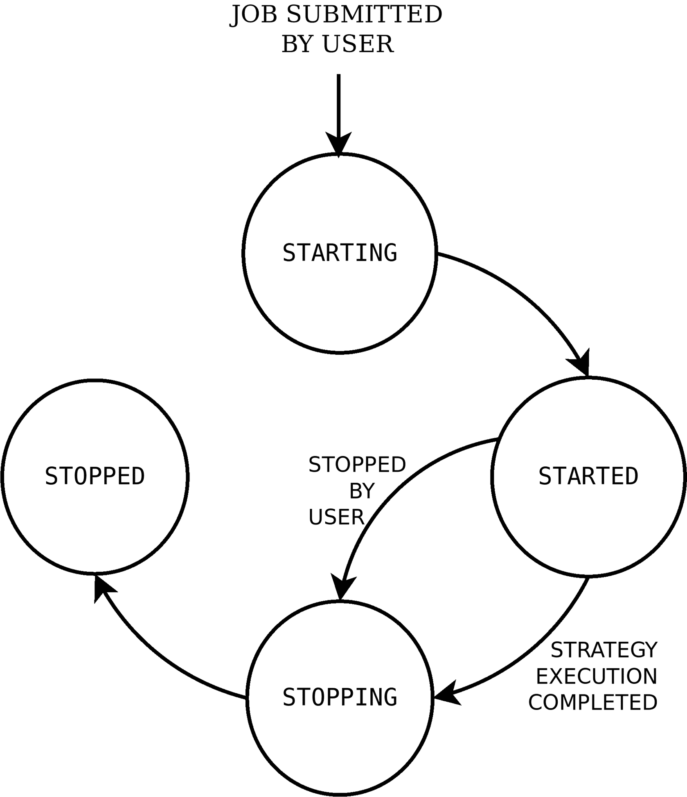
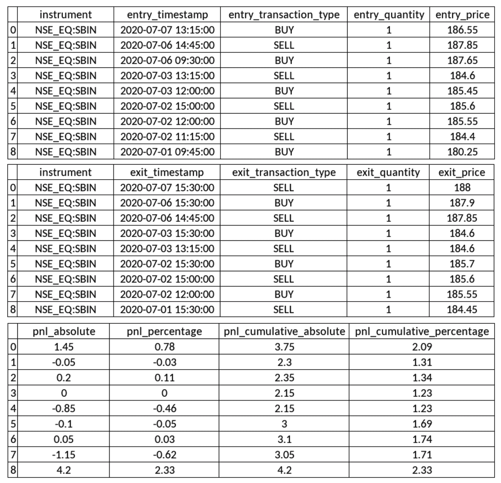

# 算法交易-回溯测试

在建立了算法交易策略后，正如我们在上一章所做的，第一步是在给定的时间内对给定的策略配置进行回溯测试。

回溯测试是一种评估交易策略性能的方法，通过虚拟执行过去的数据并分析其风险和回报指标。这里不用真钱。典型的回溯测试指标包括**损益** ( **P & L** )、最大提款、总交易数、盈利交易、亏损交易、多头交易和空头交易、每笔盈利和亏损交易的平均利润等等。直到这些指标满足必要的要求，整个过程应该重复进行，并对策略参数和/或策略实施进行增量更改。

如果一个策略在过去的数据中表现良好，那么它也可能在当前的数据中表现良好。类似地，如果一个策略在过去的数据中表现不佳，那么在实时数据中也可能表现不佳。这是回溯测试的基本前提。您可以不断更改策略配置或实现，直到回溯测试产生预期的结果。

回溯测试也有助于在我们将策略用于实际资金之前验证策略行为。这意味着它有助于确保该策略在过去的各种营销场景中表现出预期效果。

对于回溯测试，需要策略配置。它由多个参数组成，其中一些参数如下:

*   **开始和结束时间戳**:应该运行回溯测试的持续时间。
*   **金融工具**:应进行回溯测试的一个或多个金融工具。
*   **蜡烛间隔**:许多可能的蜡烛间隔之一；例如，1 分钟、15 分钟、1 小时或 1 天。

*   **策略特定参数**:策略中定义的自定义参数值。
*   **策略模式**:日内或交割之一。日内策略冲掉日内订单，在一天结束时平仓。交货策略冲压交货订单。这些不会在一天结束时结算，并结转到下一个交易日。

需要回溯测试引擎来对给定的策略执行回溯测试。在本章中，你将使用 algo bulls([https://algobulls.com](https://algobulls.com))提供的回溯测试引擎，这是一个算法交易平台，通过其开发者选项提供服务。它提供了一个名为`pyalgotrading`([https://github.com/algobulls/pyalgotrading](https://github.com/algobulls/pyalgotrading))的 Python 包来提供这些服务。

你在[第八章](08.html)、*算法交易策略——分步编码*中编码了两种算法交易策略。回想一下，策略描述如下:

*   **均线-常规单策略**:该策略基于技术指标均线和常规单。([第八章](08.html)、*算法交易策略前六个菜谱——分步编码*。)
*   **MACD 套单策略**:该策略基于技术指标 MACD 和套单。([第八章](08.html)、*算法交易策略剩余六个菜谱——分步编码*。)

这些策略也可以作为名为`pyalgostrategypool`的 Python 包的一部分获得。您可以使用 pip 使用`$ pip install pyalgostrategypool`命令安装它。你也可以在 GitHub(【https://github.com/algobulls/pyalgostrategypool】)上查看。

在上一章中，你将这两种策略上传到了你的 AlgoBulls 账户。在本章中，你将从你的 AlgoBulls 账户中取出这些策略，并对它们进行回溯测试。在回溯测试之后，您将收集策略执行日志和各种报告，即 P&L 报告、统计报告和订单历史。这些日志和报告有助于验证策略的表现，并为下一阶段做准备，也就是纸上交易，然后我们才开始真正的交易。通过使用`pyalgotrading`，您可以确保专注于通过回溯测试来开发和验证策略，而不用担心策略执行所需的生态系统。

本章包括上述策略的分步方法，从设置与 AlgoBulls 平台的连接、获取策略、运行回测作业，到获取执行日志和各种类型的报告。

在本章中，我们将介绍以下配方:

*   EMA-常规订单策略-获取策略
*   EMA-常规订单策略-对策略进行回溯测试
*   EMA——常规订单策略——实时获取回溯测试日志
*   EMA-常规订单策略-获取回溯测试报告-P&L 表
*   EMA-常规订单策略-提取回溯测试报告-统计表
*   EMA-常规订单策略-获取回溯测试报告-订单历史
*   MACD-括号-订单策略-获取策略
*   MACD-括号-订单策略-对策略进行回溯测试
*   MACD 括号顺序策略——实时获取回溯测试日志
*   MACD-括号-顺序策略-获取回溯测试报告-P&L 表
*   MACD-括号-顺序策略-获取回溯测试报告-统计表
*   MACD-支架-订单策略-获取回溯测试报告-订单历史

我们开始吧！

# 技术要求

要成功执行本章中的配方，您需要具备以下条件:

*   Python 3.7+版本
*   Python 包:
*   `pyalgotrading` ( `$ pip install pyalgotrading`)

本章最新的 Jupyter 笔记本可以在 GitHub 上找到，网址为[https://GitHub . com/packt publishing/Python-algorithm-Trading-Cookbook/tree/master/chapter 09](https://github.com/PacktPublishing/Python-Algorithmic-Trading-Cookbook/tree/master/Chapter09)。

# EMA-常规订单策略-获取策略

在这个菜谱中，您将从您在 AlgoBulls 平台上的帐户中获取`StrategyEMARegularOrder`策略类，该策略类是您在 AlgoBulls 交易平台上通过*EMA-常规订单策略-上传[第 8 章](08.html)、*算法交易策略-逐步编码*中的策略*菜谱时上传的。该方法首先建立到 AlgoBulls 平台的连接，查询您帐户中所有可用的策略，并获取所需策略类的详细信息，`StrategyEMARegularOrder`。

确保你已经阅读了前一章的前六个食谱，对我们将要使用的策略类有了一个完整的了解；也就是`StrategyEMARegularOrder`。

## 怎么做…

我们为此配方执行以下步骤:

1.  导入必要的模块:

```
>>> from pyalgotrading.algobulls import AlgoBullsConnection
```

2.  创建新的 AlgoBulls 连接对象:

```
>>> algobulls_connection = AlgoBullsConnection()
```

3.  获取授权 URL:

```
>>> algobulls_connection.get_authorization_url()
```

我们得到了以下输出:

```
Please login to this URL with your AlgoBulls credentials and get your developer access token: https://app.algobulls.com/user/login
'https://app.algobulls.com/user/login'
```

4.  使用您的 AlgoBulls 凭证登录到前面的链接，获取您的令牌，并在此处设置它(更多详细信息，请参见*附录 II* ):

```
>>> algobulls_connection.set_access_token('
                    80b7a69b168c5b3f15d56688841a8f2da5e2ab2c')
```

5.  获取并显示到目前为止您已经创建并上传的所有策略:

```
>>> all_strategies = algobulls_connection.get_all_strategies()
>>> all_strategies
```

我们得到了以下输出。你的输出可能会有所不同(确保你遵循了[第八章](08.html)、*算法交易策略*、*——一步一步编码*，以获得类似的输出):


6.  获取并显示第一个策略的策略代码:

```
>>> strategy_code1 = all_strategies.iloc[0]['strategyCode']
>>> strategy_code1
```

我们得到了以下输出(您的输出可能有所不同):

```
'49287246f9704bbcbad76ade9e2091d9'
```

7.  在回溯测试您的策略之前，您可以检查您的策略以确保您有正确的策略:

```
>>> strategy_details1 = \
        algobulls_connection.get_strategy_details(strategy_code1)
>>> print(strategy_details1)
```

我们得到了以下输出:

```
class StrategyEMARegularOrder(StrategyBase):

    def __init__(self, *args, **kwargs):
        super().__init__(*args, **kwargs)

        self.timeperiod1 = self.strategy_parameters['timeperiod1']
        self.timeperiod2 = self.strategy_parameters['timeperiod2']

        self.main_order = None

    def initialize(self):
        self.main_order = {}

    @staticmethod
    def name():
        return 'EMA Regular Order Strategy'
    ….
    def strategy_exit_position(self, candle, instrument, 
                                sideband_info):
        if sideband_info['action'] == 'EXIT':
            self.main_order[instrument].exit_position()
            self.main_order[instrument] = None
            return True

        return False
```

这里没有显示完整的输出。请访问以下链接阅读完整输出:[https://github . com/algo bulls/pyalgostrategypool/blob/master/pyalgostrategypool/strategy _ EMA _ regular _ order . py](https://github.com/algobulls/pyalgostrategypool/blob/master/pyalgostrategypool/strategy_ema_regular_order.py)。

## 它是如何工作的…

在*步骤 1* 中，您导入必要的模块。在*步骤 2* 中，创建了一个`AlgoBullsConnection`类的实例，命名为`algobulls_connection`。在*步骤 3* 中，您使用`algobulls_connection`对象的`get_authorization_url()`方法获得授权 URL。这将打印授权 URL。您应通过网络浏览器访问此 URL，登录 AlgoBulls 平台并获取您的开发者访问令牌。(你可以在*附录二*中找到更多关于从 AlgoBulls 平台获取开发者访问令牌的细节和截图。)您复制访问令牌，并使用`algobulls_connection`的`set_access_token()`方法在*步骤 4* 中设置它。如果令牌被接受，则与 AlgoBulls 平台成功建立连接。

在*步骤 5* 中，你获取所有你已经创建并上传到 AlgoBulls 平台的策略。您对这一步使用了`get_all_strategies()`方法，并将其赋给一个新变量`all_strategies`。这个变量是一个拥有`strategyCode`和`strategyName`列的`pandas.DataFrame`对象。此表包含您之前上传的策略代码和策略名称的信息。如果你按照 E*MA-常规订单策略-上传 AlgoBulls 交易平台[第八章](08.html)、*算法交易策略-逐步编码*的*策略，你会发现一个叫做**EMA-常规订单策略**的策略。在*步骤 6* 中，您将策略的策略代码**EMA-常规订单策略**分配给一个名为`strategy_code1`的新变量。该步骤的输出中显示了策略代码。该策略代码对于 AlgoBulls 平台上的每个策略都是唯一的。

最后，在*第 7 步*中，你确保`strategy_code1`引用的策略确实是你之前上传的策略(在*EMA-常规订单策略-上传策略到 AlgoBulls 交易平台*第 8 章、*算法交易策略-逐步编码*)。您使用`algobulls_connection`对象的`get_strategy_details()`方法来检查策略。该方法将策略代码作为参数。你在这里过`strategy_code1`。该方法以字符串形式返回整个类代码。你将它赋给一个新变量`strategy_details1`，并显示它。

如果您想更改`strategy_code1`引用的类别代码，如*第 7 步*所示，请参考*EMA-常规订单策略-在 AlgoBulls 交易平台上传策略*菜谱中的*还有…* 部分，在[第 8 章](08.html)、*算法交易策略-逐步编码*。

# EMA-常规订单策略-对策略进行回溯测试

在这个菜谱中，你将对**均线常规下单策略**进行回溯测试。你必须在之前的食谱中从 AlgoBulls 平台的账户中获取该策略。您将利用`pyalgotrading`为这个食谱提供的回溯测试功能，该功能反过来在 AlgoBulls 平台上提交一个回溯测试作业。

提交后，回溯测试将由 AlgoBulls 回溯测试引擎运行。您可以随时查询状态，以找到回溯测试作业的状态。作业按给定顺序经历以下状态:

*   `STARTING`(中间状态)
*   `STARTED`(稳定状态)
*   `STOPPING`(中间状态)
*   `STOPPED`(稳定状态)

提交作业时，它从中间状态`STARTING`开始。在这种状态下，AlgoBulls 回溯测试引擎获取策略并准备好执行环境，这可能需要几分钟时间。一旦完成，作业就进入`STARTED`状态。策略回溯测试发生在这个阶段。在这里，只要回溯测试完成，它就会一直存在。一旦完成，作业就转移到一个中间状态，即`STOPPING`。在这种状态下，AlgoBulls 回溯测试引擎会清理分配给该作业的资源，这通常不到一分钟。最后，作业移动到`STOPPED`状态。

如果您已经提交了策略回溯测试作业，则在第一个作业完成之前，您不能提交同一策略的另一个作业。这意味着您必须等待第一个作业进入`STOPPED`状态。如果第一个作业是长时间运行的，并且您想立即停止它，您可以通过`pyalgotrading`提交停止作业请求。在提交请求之前，您需要确保作业处于`STARTED`状态。

以下状态机图展示了 AlgoBulls 平台上回溯测试作业在其生命周期内的各种状态和转换:



提交回溯测试作业后，您可以实时获取策略执行的日志和报告。日志和报告有助于验证策略的性能并调试任何潜在的问题。

确保你已经阅读了前一章的前六个食谱，对我们将要使用的策略类有了一个完整的了解；也就是`StrategyEMARegularORder`。

## 做好准备

确保`algobulls_connection`和`strategy_code1`对象在 Python 名称空间中可用。参考之前的配方设置`algobulls_connection`和`strategy_code1`对象。

## 怎么做…

我们为此配方执行以下步骤:

1.  导入必要的模块:

```
>>> from datetime import datetime as dt
>>> from pyalgotrading.constants import *
```

2.  使用交易符号作为关键字搜索工具。将返回的对象分配给`instruments`:

```
>>> instruments = algobulls_connection.search_instrument('SBIN')
>>> instruments
```

我们得到以下输出(您的输出可能不同):

```
[{'id': 7, 'value': 'NSE:SBIN'}]
```

3.  从`instruments`获取选择仪器的`value`:

```
>>> instrument = instruments[0]['value']
>>> instrument
```

我们得到以下输出:

```
'NSE:SBIN'
```

4.  为`strategy_code1`提交回溯测试作业:

```
>>> algobulls_connection.backtest(strategy_code=strategy_code1, 
        start_timestamp=dt(year=2020, month=7, day=1, hour=9, 
                            minute=15), 
        end_timestamp=dt(year=2020, month=7, day=7, hour=15, 
                            minute=30),
        instrument=instrument, 
        lots=1,
        strategy_parameters={
            'timeperiod1': 5,
            'timeperiod2': 12
        }, 
        candle_interval=CandleInterval.MINUTES_15)
```

我们得到以下输出:

```
Setting Strategy Config... Success.
Submitting BACKTESTING job... Success.
```

5.  检查已提交作业的状态回测作业:

```
>>> algobulls_connection.get_backtesting_job_status(strategy_code1)
```

我们得到以下输出:

```
{'data': 'STARTING'}
```

6.  一段时间后，再次检查提交作业的状态:

```
>>> algobulls_connection.get_backtesting_job_status(strategy_code1)
```

我们得到以下输出:

```
{'data': 'STARTED'}
```

## 它是如何工作的…

在*步骤 1* 中，从`datetime`模块导入`datetime`类，从`pyalgotrading.constants`模块导入所有常量。在*步骤 2* 中，使用`algobulls_connection`对象的`search_instrument()`方法，获取想要对**EMA-常规订单策略**的策略进行回溯测试的仪器。`search_instrument()`方法接受一个搜索字符串作为参数，它应该是您感兴趣的工具的部分或完整的交易符号。你在这里通过`'SBIN'`。该函数返回与搜索字符串匹配的乐器的详细信息列表。可能有多种工具在其交易符号中包含搜索字符串。在*步骤 3* 中，您获取第一个匹配仪器的值，并将其赋给一个新变量`instrument`。

在*步骤 4* 中，您使用`algobulls_connection()`对象的`backtest()`方法提交一个回溯测试作业。它采用以下参数:

*   `strategy_code`:需要进行回测的策略的策略代码。这应该是一个字符串。你在这里过`strategy_code1`。
*   `start_timestamp`:应该开始回溯测试的过去的时间戳。这应该是一个`datetime.datetime`对象。在这里，传递一个值为 2020 年 7 月 1 日 9:15 小时的对象-`dt(year=2020, month=7, day=1, hour=9, minute=15)`。关于创建`datetime`对象的详细信息，请参考[第一章](01.html)、*处理和操作日期、时间和时序数据*中的*创建日期时间对象*配方。

*   `end_timestamp`:应该进行回溯测试的过去的时间戳。这个对象应该在`start_timestamp`保存的时间戳值之前保存一个时间戳值。这应该是一个`datetime.datetime`的实例。在这里，传递一个值为 2020 年 7 月 7 日 15:30 hours-`dt(year=2020, month=7, day=7, hour=15, minute=30)`的对象。
*   `instrument`:应进行回溯测试的金融工具。将为该仪器获取历史数据。这应该是一个字符串。你在这里过`instrument`。
*   `lots`:应进行回测的批次数量。这应该是一个整数。数量由策略计算为金融工具的*手数* × *手数*。(参见上一章中的*EMA-常规订单策略-编码策略 _ 输入 _ 位置方法*)。你在这里过`1`。
*   `strategy_parameters`:策略期望的参数名称和值。这应该是一个字典，用`parameter-name`和`parameter-value`作为键值对。您在这里传递以下参数:
*   `timeperiod1: 5`
*   `timeperiod2: 12`

(回想一下，EMA 常规订单策略的参数是在它的`__init__()`方法中定义的，如前一章的第一个配方所示)。

*   `candle_interval`:提取历史数据进行回溯测试的蜡烛间隔。这应该是一个`CandleInterval`类型的枚举。你在这里通过`CandleInterval.MINUTES_15`。(`CandleInterval`枚举为蜡烛间隔提供了各种枚举，其中一些是`MINUTE_1`、`MINUTES_3`、`MINUTES_5`、`MINUTES_10`、`MINUTES_15`、`MINUTES_30`、`HOUR`和`DAY`。)

如果作业提交成功，您将看到由`backtest()`功能打印的`Success`消息。

提交作业后，需要一段时间才能开始。开始后，可能需要一些时间来完成，这取决于策略的复杂性和使用`start_timestamp`和`end_timestamp`参数指定的回溯测试的持续时间。几天的回溯测试可能在几秒钟内完成，而几个月的回溯测试可能需要几分钟。

在*步骤 5* 中，您使用`algobulls_connection`对象的`get_backtesting_job_status()`方法获取作业状态。你通过`strategy_code1`作为这里的论据。这个方法返回一个具有单个键值对的字典——数据*和作业*状态。如果您在放置工单后立即查询状态，您将得到`'STARTING'`作为状态。在*步骤 6* 中，您在一段时间后再次查询状态，如果作业已经开始，您将得到`'STARTED'`作为状态。**

成功的提交意味着回溯测试策略所需的最少输入已经以要求的格式通过。但是，这并不能确保策略运行时不会出错。在回溯测试期间，策略的执行仍然可能出错。为了调试执行问题，您需要获取输出日志，这在 *MACD 括号顺序策略——实时获取回测日志*中有所解释。错误的可能原因可能是策略类 Python 代码中的错误，或者是传递给`backtest()`函数的不完整的`strategy_parameters`字典。

## 还有更多…

如果一个任务运行了很长时间，你想在它完成之前停止它，你可以使用`algobulls_connection`对象的`stop_backtesting_job()`方法。该方法接受策略代码作为参数。你在这里通过`strategy_code1`。该方法向 AlgoBulls 回溯测试引擎提交一个停止请求。如果请求被接受，您将在这里看到一条`Success`消息:

```
>>> algobulls_connection.stop_backtesting_job(strategy_code1)
 Stopping BACKTESTING job... Success.
```

如果您在提交停止请求后查询状态，您将得到状态为`'STOPPING``:

```
>>> algobulls_connection.get_backtesting_job_status(strategy_code1)
{'data': 'STOPPING'} 
```

如果您在一段时间后再次查询状态，并且如果作业已经停止，您将获得状态为`'STOPPED'`:

```
>>> algobulls_connection.get_backtesting_job_status(strategy_code1)
{'data': 'STOPPED'}
```

# EMA——常规订单策略——实时获取回溯测试日志

在 AlgoBulls 平台上提交回测作业后，AlgoBulls 回测引擎开始执行策略。在执行过程中，AlgoBulls 回溯测试引擎发生的每个事件和做出的每个决定都以文本日志的形式记录了准确的时间戳。记录活动的例子包括给定的策略配置、每隔一段时间产生的新蜡烛线、你的策略进行的交易、这些交易产生的头寸的进出、等待新蜡烛线等等。这些日志是验证策略行为和调试在开发策略时经常遇到的行为或性能问题的精华。

在这个菜谱中，您将获取策略的回溯测试日志。一旦您提交的回溯测试作业达到`'STARTED'`状态，日志就开始出现(关于回溯测试作业状态的更多信息，请参考前面的方法)。AlgoBulls 平台允许您实时获取日志，即使回溯测试工作仍在进行。您可以深入了解策略的执行，而不必等待回溯测试作业完成，这在作业长时间运行时很有帮助。`pyalgotrading`包提供了一个简单的方法，可以用来获取给定策略的执行日志。

确保你已经阅读了前一章的前六个食谱，对我们将要使用的策略类有了一个完整的了解；也就是`StrategyEMARegularOrder`。

## 做好准备

确保`algobulls_connection`和`strategy_code1`对象在 Python 名称空间中可用。参考本章第一个配方来设置`algobulls_connection`和`strategy_code1`对象。

## 怎么做…

我们为此配方执行以下步骤:

1.  获取`strategy_code1`的回溯测试执行日志:

```
>>> logs = algobulls_connection.get_backtesting_logs(
                                                strategy_code1)
>>> print(logs)
```

我们得到以下输出(您的输出可能不同):

```
[2020-07-30 17:25:18] Logs not available yet. Please retry in sometime.
```

2.  一段时间后，再次获取`strategy_code1`的回溯测试执行日志:

```
>>> logs = algobulls_connection.get_backtesting_logs(
                                                strategy_code1)
>>> print(logs)
```

我们得到以下输出(您的输出可能不同):

```
...
########################################
 INITIALIZING ALGOBULLS CORE (v3.2.0 SECURE MODE)... 
########################################
[2020-07-30 11:56:29] Welcome ALGOBULLS VIRTUAL USER!
[2020-07-30 11:56:29] Reading strategy…
...
 [BT] [2020-07-01 09:15:00] [INFO] [tls] STARTING ALGOBULLS CORE...
...
[BT] [2020-07-01 09:45:00] [CRITICAL] [order] [PLACING NEW ORDER] [2020-07-01 09:45:00] [2333198611b744aeb287300d371c8eb5] [BUY] [NSE:SBIN] [QTY:1] [QTY PENDING: 1] [ENTRY PRICE: 180.25] [PRICE:None] [TRIGGER PRICE:None] [ORDER_TYPE_REGULAR] [ORDER_CODE_INTRADAY] [ORDER_VARIETY_MARKET] [ORDER_POSITION_ENTER]
...
 [BT] [2020-07-07 15:30:00] [INFO] [clock] Candle generation has been stopped...
[BT] [2020-07-07 15:30:00] [INFO] [tls] Received event END OF MARKET. Stopping Trading Core Engine…
[BT] [2020-07-07 15:30:00] [INFO] [tls] Exiting all open positions with order code: ORDER_CODE_INTRADAY (if any)...
[BT] [2020-07-07 15:30:00] [CRITICAL] [tls] [User: ALGOBULLS VIRTUAL USER] Trading session completed
 ...
```

这里没有显示完整的输出。请访问以下链接阅读完整输出:[https://github . com/algo bulls/pyalgostrategypool/blob/master/pyalgostrategypool/sample/back testing/strategy _ EMA _ regular _ order/logs . txt](https://github.com/algobulls/pyalgostrategypool/blob/master/pyalgostrategypool/sample/backtesting/strategy_ema_regular_order/logs.txt)。

## 它是如何工作的…

在*步骤 1* 中，使用`algobulls_connection`对象的`get_backtesting_logs()`方法实时获取策略回测日志。该方法接受策略代码作为参数。你在这里通过`strategy_code1`。返回的数据是一个字符串。如果您在提交作业后立即尝试这个步骤，您会得到一个字符串，表示日志还没有准备好(`[2020-07-30 17:27:25] Logs not available yet. Please retry in sometime.`)。如果回溯测试作业处于`'STARTING'`状态，就会发生这种情况。

在*步骤 2* 中，你在一段时间后再次获取日志。如果作业脱离了`'STARTING'`状态，您将开始获取策略执行日志。每次调用`get_backtesting_logs()`函数时，您都会获得完整的回溯测试日志。

## 还有更多...

一旦回溯测试作业进入`'STOPPED'`状态，就不会生成新的日志。在为同一策略提交下一个回溯测试作业之前，您可以随时获取完整的日志。如果提交了一个新的回溯测试作业(对于相同的策略)，这些日志将不再可以通过`get_backtesting_logs()`方法访问。如果您想在以后引用它，可以将获取的日志保存到一个文件中。

# EMA-常规订单策略-获取回溯测试报告-损益表

在 AlgoBulls 平台上提交回测作业后，AlgoBulls 回测引擎开始执行策略。在执行过程中，除了日志，AlgoBulls 回溯测试引擎还会实时生成一个 P&L 表。这张表包含了策略中每一笔交易的信息。它还包含了挂单和止损单、交易 P&L 和累计 P&L 之间映射的详细信息，按时间顺序排列，最新的订单排在最前面。该表通过单个和累计的 P&L 数，让我们深入了解整体战略的绩效。进出顺序映射也有助于验证策略行为。

在这个菜谱中，您将为您的策略获取 P&L 表报告。在您提交回溯测试工作后，一旦您的策略在第一笔交易中打卡，该报告就可用。AlgoBulls 平台允许您实时获取 P&L 表，即使回溯测试工作仍在进行。您可以深入了解策略性能，而不必等待回溯测试作业完成，这在作业长时间运行时非常有用。`pyalgotrading`包提供了一个简单的方法，用于获取给定策略的 P & L 表。

确保你已经阅读了前一章的前六个食谱，对我们将要使用的策略类有了一个完整的了解；也就是`StrategyEMARegularOrder`。

## 做好准备

确保`algobulls_connection`和`strategy_code1`对象在 Python 名称空间中可用。参考本章第一个配方来设置`algobulls_connection`和`strategy_code1`对象。

## 怎么做…

获取`strategy_code1`的回溯测试 P&L 报告:

```
>>> algobulls_connection.get_backtesting_report_pnl_table(strategy_code1)
```

我们得到了以下输出。您的输出可能会有所不同(注意，为了便于表示，下面的输出被分成了多个表。您将在 Jupyter 笔记本中看到一张宽大的桌子):



## 它是如何工作的…

在这个方法中，您使用`algobulls_connection`对象的`get_backtesting_report_pnl_table()`方法来实时获取回溯测试 P & L 表。该方法接受策略代码作为参数。你在这里通过`strategy_code1`。返回的数据是一个多列的`pandas.DataFrame`对象，描述如下:

*   `instrument`:进入交易的金融工具。
*   `entry_timestamp`:挂单的时间戳。(注意，在进入`'COMPLETE'`状态之前，它可能会保持在`'OPEN'`状态一段时间。该状态转换的时间可使用订单历史表找到，如本章第六个配方中所述。)
*   `entry_transaction_type`:挂单交易类型`BUY`或`SELL`。
*   `entry_quantity`:挂单数量。

*   `entry_price`:挂单执行并进入`'COMPLETE'`状态的价格。
*   `exit_timestamp`:止损单发出的时间。(注意，在进入`'COMPLETE'`状态之前，它可能会保持在`'OPEN'`状态一段时间。)
*   `exit_transaction_type`:挂单交易类型`BUY`或`SELL`。
*   `exit_quantity`:退出订单数量。
*   `exit_price`:挂单执行并进入`'COMPLETE'`状态的价格。
*   `pnl_absolute`:挂单执行价格和挂单执行价格之间的差额。数学上，这是(*出场价格* - *进场价格*)**出场数量*对于多头交易，(*进场价格* - *出场价格*)**出场数量*。正值意味着交易是盈利交易。负值意味着交易是亏本交易。
*   `pnl_percentage`:相对于进场价格的盈亏百分比。数学上这就是*pnl _ absolute*/*entry _ price*/*exit _ quantity*×*100*。
*   `pnl_cumulative_absolute`:累计损益。从数学上讲，这是以前交易的所有`pnl_absolute`值的总和。这个数字让我们可以直接了解相对于模拟时间的策略性能。
*   `pnl_cumulative_percentage`:累计盈亏相对于进场价格的百分比。数学上这就是*pnl _ 累计* / *进场 _ 价格* / *出场数量* × *100* 。

## 还有更多...

一旦回溯测试作业移动到`'STOPPED'`状态，P & L 表报告将不再更新。在提交同一策略的下一个回溯测试作业之前，您可以随时获取完整的 P & L 报告。如果一个新的回溯测试任务被提交(对于相同的策略)，这个报告将不再能够通过`get_backtesting_report_pnl_table()`方法访问。如果您想在以后引用它，您可以将获取的报告保存为一个`.csv`文件。

# EMA-常规订单策略-提取回溯测试报告-统计表

在 AlgoBulls 平台上提交回测作业后，AlgoBulls 回测引擎开始执行策略。在执行过程中，除了日志和 P&L 表，AlgoBulls 回溯测试引擎还从 P&L 表中实时生成摘要。该摘要是一个统计表，包含各种统计数字，如`Net P&L`(绝对值和百分比)、`Max Drawdown`(绝对值和百分比)、总交易数、盈利交易数、亏损交易数、多头交易数和空头交易数、最大收益和最小收益(或最大亏损)以及每笔盈利和亏损交易的平均利润。此表提供了总体策略性能的即时概览。

在这个菜谱中，您将为您的策略获取统计表报告。在您提交回溯测试工作后，一旦您的策略在第一笔交易中打卡，该报告就可用。AlgoBulls 平台允许您实时获取统计表，即使回溯测试工作仍在进行。您可以深入了解策略性能，而不必等待回溯测试作业完成，这在作业长时间运行时非常有用。`pyalgotrading`包提供了一个简单的方法，用于获取给定策略的统计表。

确保你已经阅读了前一章的前六个食谱，对我们将要使用的策略类有了一个完整的了解；也就是`StrategyEMARegularOrder`。

## 做好准备

确保`algobulls_connection`和`strategy_code1`对象在 Python 名称空间中可用。参考本章第一个配方来设置`algobulls_connection`和`strategy_code1`对象。

## 怎么做…

获取`strategy_code1`的回溯测试统计报告:

```
>>> algobulls_connection.get_backtesting_report_statistics(strategy_code1)
```

我们得到了以下输出(您的输出可能有所不同):


## 它是如何工作的…

在这个方法中，您使用`algobulls_connection`对象的`get_backtesting_report_statistics()`方法来实时获取回溯测试统计表。该方法接受策略代码作为参数。你在这里通过`strategy_code1`。返回的数据是一个有两列—`highlight_type`和`highlight_value`—多行的`pandas.DataFrame`对象。这些行描述如下:

*   `Net PnL`:累计回测 P & L，这也是 P & L 表中第一个条目的`pnl_cumulative_absolute`值。
*   `Net PnL %`:累计回测 P & L 百分比。这也是 P & L 表中第一个条目的`pnl_cumulative_percentage`值。

*   `Max Drawdown`:P&L 表`pnl_cumulative`栏中的最小值。这表示您的策略在执行过程中遇到的最大损失。
*   `Max Drawdown %`:数学上这是*(最大提现)* / *(对应进场 _ 价格)/出场 _ 数量* × *100* 。
*   `Number of Trades`:盘中总交易(进场和出场算一个)。
*   `Number of Wins`:交易 P & L 为非负的交易计数。
*   `Number of Losses`:交易 P & L 为负的交易计数。
*   `Number of Long Trades`:进场交易类型为`'BUY'`的交易笔数。
*   `Number of Short Trades`:进场交易类型为`'SELL'`的交易笔数。
*   `Max Gain`:所有交易中 P & L 值最大的交易的 P & L。
*   `Min Gain`:所有交易中 P & L 值最小的交易的 P & L。
*   `Avg. Profit per winning trade`:数学上这是*(成功交易的总 P&L)*/*(成功交易的计数)*。
*   `Avg. Profit per losing trade`:数学上这是*(亏损交易的总 P&L)*/*(亏损交易数)*。

## 还有更多...

如果在回溯测试作业仍在运行时获取统计表，上述数字将是基于到那时为止完成的交易的中间数字。随着更多的交易被打入，数字可能会改变，直到回溯测试工作完成。

一旦回溯测试作业移动到`'STOPPED'`状态，统计表将不再改变。在为同一策略提交下一个回溯测试作业之前，您可以随时获取完整的统计表。如果一个新的回溯测试任务被提交(对于相同的策略)，这个表将不再可以通过`get_backtesting_report_statistics()`方法访问。如果您想在以后引用它，您可以将提取的报告表保存到一个`.csv`文件中。

# EMA-常规订单策略-获取回溯测试报告-订单历史

在 AlgoBulls 平台上提交回测作业后，AlgoBulls 回测引擎开始执行策略。在执行过程中，除了日志之外，AlgoBulls 回溯测试引擎的 P&L 表和统计表还会实时生成订单历史日志。该日志包含每个订单的状态转换，以及每个订单状态的时间戳和附加信息(如果有)。订单历史记录对于理解交易从`'OPEN'`状态到`'COMPLETE'`或`'CANCELLED'`状态需要多长时间至关重要。例如，`MARKET`订单将立即从`'OPEN'`转到`'COMPLETE'`，但`LIMIT`订单可能需要一段时间，根据市场情况，从`'OPEN'`转到`'COMPLETE'`——它们甚至可能转到`'CANCELLED'`。所有这些信息都可以在订单历史日志中找到。(有关订单状态转换的更多信息，请参考第 6 章、*中的[状态机图，将常规订单提交给交易所](06.html)*。)

在这个菜谱中，您将获取您的策略的订单历史日志。在您提交回溯测试作业后，一旦您的策略执行了第一笔交易，就可以使用该日志。AlgoBulls 平台允许您实时获取订单历史记录，即使回溯测试工作仍在进行。这有助于我们获得订单最终状态的详细信息，而不必等待回溯测试工作完成。`pyalgotrading`包提供了一个简单的方法，我们可以用它来获取给定策略的订单历史日志。

确保你已经阅读了前一章的前六个食谱，对我们将要使用的策略类有了一个完整的了解；也就是`StrategyEMARegularOrder`。

## 做好准备

确保`algobulls_connection`和`strategy_code1`对象在 Python 名称空间中可用。参考本章第一个配方来设置`algobulls_connection`和`strategy_code1`对象。

## 怎么做…

获取`strategy_code1`的回溯测试订单历史报告:

```
>>> order_history = \
        algobulls_connection.get_backtesting_report_order_history(
                                                          strategy_code1)
>>> print(order_history)
```

我们得到了以下输出(您的输出可能有所不同):

```
+-------------+---------------------+----------------------------------+------+
| INST        | TIME                | ID                               | TT   |
|-------------+---------------------+----------------------------------+------|
| NSE_EQ:SBIN | 2020-07-01 09:45:00 | 2333198611b744aeb287300d371c8eb5 | BUY  |
+-------------+---------------------+----------------------------------+------+
+----+---------------------+------------------------+-------+
|    | TIME                | STATE                  | MSG   |
|----+---------------------+------------------------+-------|
|  0 | 2020-07-01 09:45:00 | PUT ORDER REQ RECEIVED |       |
|  1 | 2020-07-01 09:45:00 | VALIDATION PENDING     |       |
|  2 | 2020-07-01 09:45:00 | OPEN PENDING           |       |
|  3 | 2020-07-01 09:45:00 | OPEN                   |       |
|  4 | 2020-07-01 09:45:00 | COMPLETE               |       |
+----+---------------------+------------------------+-------+
+-------------+---------------------+----------------------------------+------+
| INST        | TIME                | ID                               | TT   |
|-------------+---------------------+----------------------------------+------|
| NSE_EQ:SBIN | 2020-07-01 15:30:00 | 67f39f41885b476295e7e959b0470d49 | SELL |
+-------------+---------------------+----------------------------------+------+
+----+---------------------+------------------------+-------+
|    | TIME                | STATE                  | MSG   |
|----+---------------------+------------------------+-------|
|  0 | 2020-07-01 15:30:00 | PUT ORDER REQ RECEIVED |       |
|  1 | 2020-07-01 15:30:00 | VALIDATION PENDING     |       |
|  2 | 2020-07-01 15:30:00 | OPEN PENDING           |       |
|  3 | 2020-07-01 15:30:00 | OPEN                   |       |
|  4 | 2020-07-01 15:30:00 | COMPLETE               |       |
+----+---------------------+------------------------+-------+
...
```

这里没有显示完整的输出。请访问此链接阅读完整输出:[https://github . com/algobulls/pyalgostrategypool/blob/master/pyalgostrategypool/sample/back testing/strategy _ EMA _ regular _ order/OMS _ order _ history . log](https://github.com/algobulls/pyalgostrategypool/blob/master/pyalgostrategypool/sample/backtesting/strategy_ema_regular_order/oms_order_history.log)。

## 它是如何工作的…

在这个菜谱中，您使用`algobulls_connection`对象的`get_backtesting_report_order_history()`方法来实时获取订单历史日志。该方法接受策略代码作为参数。你在这里通过`strategy_code1`。返回数据是一个字符串，描述如下:

对于每个订单，日志包含以下信息:

*   订单的描述性表格，包含以下提到的列:
*   `INST`:订单金融工具
*   `TIME`:下单的时间
*   `ID`:订单的唯一标识
*   `TT`:订单交易类型(`BUY`或`SELL`)

此表的示例如下所示:

```
+-------------+---------------------+----------------------------------+------+
| INST        | TIME                | ID                               | TT   |
|-------------+---------------------+----------------------------------+------|
| NSE_EQ:SBIN | 2020-07-01 09:45:00 | 2333198611b744aeb287300d371c8eb5 | BUY  |
+-------------+---------------------+----------------------------------+------+
```

这些信息将帮助您在策略执行日志中找到这个确切的顺序。

*   订单状态转换表，包含以下各列:
*   `TIME`:订单进入`'STATE'`列所代表状态的时间戳。
*   `STATE`:订单在`'TIME'`栏中提到的时间戳进入此`'STATE'`。
*   `MSG`:来自**订单管理系统** ( **OMS** )的针对任何意外状态转换的附加消息。例如，进入`REJECTED`状态的订单有一条来自 OMS 的消息，说明其被拒绝的原因。这一栏通常是空的。

此表的示例如下所示:

```
+----+---------------------+------------------------+-------+
|    | TIME                | STATE                  | MSG   |
|----+---------------------+------------------------+-------|
|  0 | 2020-07-01 09:45:00 | PUT ORDER REQ RECEIVED |       |
|  1 | 2020-07-01 09:45:00 | VALIDATION PENDING     |       |
|  2 | 2020-07-01 09:45:00 | OPEN PENDING           |       |
|  3 | 2020-07-01 09:45:00 | OPEN                   |       |
|  4 | 2020-07-01 09:45:00 | COMPLETE               |       |
+----+---------------------+------------------------+-------+
```

从这个表中，您可以看到，在上午 9:45 下订单后，它立即转换到`'COMPLETE'`状态。这是意料之中的，因为该订单是正常的市场订单。

## 还有更多...

一旦回溯测试作业进入`'STOPPED'`状态，就不会生成新的订单历史日志。在为同一策略提交下一个回溯测试作业之前，您可以随时获取完整的订单历史日志。如果提交了一个新的回溯测试作业(对于相同的策略)，这些日志将不再可以通过`get_backtesting_report_order_history()`方法访问。如果您想在以后引用它们，可以将获取的日志保存到一个文件中。

# MACD-括号-订单策略-获取策略

在这个菜谱中，你将从你在 AlgoBulls 平台上的账户中获取`StrategyMACDBracketOrder`策略类，这是你在浏览上一章的最后一个菜谱时上传的。该方法首先建立到 AlgoBulls 平台的连接，查询您帐户中所有可用的策略，并获取所需策略类的详细信息，`StrategyMACDBracketOrder`。

确保你已经阅读了前一章的最后六个食谱，对我们将要使用的策略类有了一个完整的了解；也就是`StrategyMACDBracketOrder`。

## 怎么做…

我们为此配方执行以下步骤:

1.  导入必要的模块:

```
>>> from pyalgotrading.algobulls import AlgoBullsConnection
```

2.  创建新的 AlgoBulls 连接对象:

```
>>> algobulls_connection = AlgoBullsConnection()
```

3.  获取授权 URL:

```
>>> algobulls_connection.get_authorization_url()
```

我们得到以下输出:

```
Please login to this URL with your AlgoBulls credentials and get your developer access token: https://app.algobulls.com/user/login
'https://app.algobulls.com/user/login'
```

4.  使用您的 AlgoBulls 凭证登录到前面的链接，获取您的令牌，并在此处设置它(更多详细信息，请参见*附录 II* ):

```
>>> algobulls_connection.set_access_token('
                    80b7a69b168c5b3f15d56688841a8f2da5e2ab2c')
```

5.  获取并显示到目前为止您已经创建并上传的所有策略:

```
>>> all_strategies = algobulls_connection.get_all_strategies()
>>> all_strategies
```

我们得到以下输出。您的输出可能会有所不同(确保您遵循了上一章中的方法，以获得类似的输出):


6.  获取并显示第二个策略的策略代码，**MACD-括号-订单策略**:

```
>>> strategy_code2 = all_strategies.iloc[1]['strategyCode']
>>> strategy_code2
```

我们得到以下输出(您的输出可能不同):

```
'49287246f9704bbcbad76ade9e2091d9'
```

7.  在回溯测试您的策略之前，您可以检查您的策略以确保您有正确的策略:

```
>>> strategy_details2 = \
        algobulls_connection.get_strategy_details(strategy_code2)
>>> print(strategy_details2)
```

我们得到以下输出:

```
class StrategyMACDBracketOrder(StrategyBase):

    def __init__(self, *args, **kwargs):
        super().__init__(*args, **kwargs)

        self.fastMA_period = \
            self.strategy_parameters['fastma_period']
        self.slowMA_period = \
            self.strategy_parameters['slowma_period']
        self.signal_period = \
            self.strategy_parameters['signal_period']
        self.stoploss = \
            self.strategy_parameters['stoploss_trigger']
        self.target = self.strategy_parameters['target_trigger']
        self.trailing_stoploss = \
            self.strategy_parameters['trailing_stoploss_trigger']

        self.main_order = None

    def initialize(self):
        self.main_order = {}

    @staticmethod
    def name():
        return 'MACD Bracket Order Strategy'
    ….
    def strategy_exit_position(self, candle, instrument, 
                               sideband_info):
        if sideband_info['action'] == 'EXIT':
            self.main_order[instrument].exit_position()
            self.main_order[instrument] = None
            return True

        return False
```

这里没有显示完整的输出。请访问以下链接阅读完整输出:[https://github . com/algo bulls/pyalgostrategypool/blob/master/pyalgostrategypool/strategy _ MACD _ bracket _ order . py](https://github.com/algobulls/pyalgostrategypool/blob/master/pyalgostrategypool/strategy_macd_bracket_order.py)。

## 它是如何工作的…

您在*步骤 1* 中导入必要的模块。在*步骤 2* 中，您创建了一个`AlgoBullsConnection`类的实例，名为`algobulls_connection`。在*步骤 3* 中，您使用`algobulls_connection`对象的`get_authorization_url()`方法获得授权 URL。这将打印授权 URL。您应通过网络浏览器访问此 URL，登录 AlgoBulls 平台并获取您的开发者访问令牌。(你可以在*附录二*中找到更多关于从 AlgoBulls 平台获取开发者访问令牌的细节和截图。)您复制访问令牌，并使用`algobulls_connection`的`set_access_token()`方法在*步骤 4* 中设置它。如果令牌被接受，则与 AlgoBulls 平台成功建立连接。

在*步骤 5* 中，你获取到目前为止你在 AlgoBulls 平台上创建并上传的所有策略。您在这个步骤中使用了`get_all_strategies()`方法，并将其赋给一个新变量`all_strategies`。这个变量是一个带有`strategyCode`和`strategyName`列的`pandas.DataFrame`对象。此表包含有关您之前上传的策略代码和策略名称的信息。如果你遵循*MACD——套单策略——从[第八章](08.html)、*算法交易策略——逐步编码*上传策略到 AlgoBulls 交易平台*上，你会发现一个叫做**MACD——常规订单策略**的策略。在*步骤 6* 中，您将策略**MACD-常规订单策略**的策略代码分配给一个名为`strategy_code2`的新变量。该步骤的输出中显示了策略代码。该策略代码对于 AlgoBulls 平台上的每个策略都是唯一的。

最后，在*步骤 7* 中，您确保`strategy_code2`引用的策略确实是您之前上传的策略(在前一章的最后一个配方中)。您使用`algobulls_connection`对象的`get_strategy_details()`方法来检查策略。该方法将策略代码作为参数。你在这里过`strategy_code2`。该方法以字符串形式返回整个类代码。你将它赋给一个新变量`strategy_details2`，并显示它。

如果您想更改`strategy_code2`所指的类别代码，如*第 7 步*所示，请参考[第 8 章](08.html)、*算法交易策略-逐步编码*中最后一个配方的*…*部分。

# MACD-括号-订单策略-对策略进行回溯测试

在这个菜谱中，您将对 **MACD 括号订单策略**执行回溯测试。在本章的前一个食谱中，你必须从你在 AlgoBulls 平台上的账户中获取这个策略。您将利用`pyalgotrading`为这个食谱提供的回溯测试功能，该功能反过来在 AlgoBulls 平台上提交一个回溯测试作业。

提交后，回溯测试将由 AlgoBulls 回溯测试引擎运行。您可以随时查询状态，以了解回溯测试作业的状态。作业按给定顺序经历以下状态:

*   `STARTING`(中间状态)
*   `STARTED`(稳定状态)

*   `STOPPING`(中间状态)
*   `STOPPED`(稳定状态)

提交作业时，它从中间状态`'STARTING'`开始。在这种状态下，AlgoBulls 回溯测试引擎获取策略并准备好执行环境，这可能需要几分钟时间。一旦完成，作业就进入`'STARTED'`状态。策略回溯测试发生在这个阶段。在这里，只要回溯测试完成，它就会一直存在。一旦完成，作业就转移到一个中间状态，即`'STOPPING'`。在这种状态下，AlgoBulls 回溯测试引擎会清理分配给该作业的资源，这通常不到一分钟。最后，作业移动到`'STOPPED'`状态。

如果您已经提交了策略的回溯测试作业，则在第一个作业完成之前，您不能提交同一策略的另一个作业。这意味着您必须等待第一个作业进入`'STOPPED'`状态。如果第一个作业是长时间运行的，并且您想立即停止它，您可以通过`pyalgotrading`提交停止作业请求。在提交请求之前，您需要确保作业处于`'STARTED'`状态。

提交回溯测试作业后，您可以实时获取策略执行的日志和报告。日志和报告有助于验证策略的性能并调试任何潜在的问题。

你可以参考本章的第二个方法来查看回溯测试作业的状态机图。它演示了在 AlgoBulls 平台上回溯测试作业在其生命周期中的各种状态和转换。

确保你已经阅读了前一章的最后六个食谱，对我们将要使用的策略类有了一个完整的了解；也就是`StrategyMACDBracketOrder`。

## 做好准备

确保`algobulls_connection`和`strategy_code2`对象在 Python 名称空间中可用。参考本章前面的制作方法来设置`algobulls_connection`和`strategy_code2`对象。

## 怎么做…

我们为此配方执行以下步骤:

1.  导入必要的模块:

```
>>> from datetime import datetime as dt
>>> from pyalgotrading.constants import *
```

2.  使用交易符号作为关键字搜索工具。将返回的对象分配给`instruments`:

```
>>> instrument = algobulls_connection.search_instrument(
                                                'TATASTEEL')
>>> instrument
```

我们得到以下输出(您的输出可能不同):

```
[{'id': 1, 'value': 'NSE:TATASTEEL'}]
```

3.  从`instruments`获取选择仪器的`value`:

```
>>> instrument = instrument[0]['value']
>>> instrument
```

我们得到以下输出:

```
'NSE:TATASTEEL'
```

4.  为`strategy_code2`提交回溯测试作业:

```
>>> algobulls_connection.backtest(
        strategy_code=strategy_code2, 
        start_timestamp=dt(year=2020, month=7, day=1, hour=9, 
                            minute=15),
        end_timestamp=dt(year=2020, month=7, day=7, hour=15, 
                            minute=30),
        instrument=instrument,
        lots=1,
        strategy_parameters={
            'fastma_period': 26, 
            'slowma_period': 6, 
            'signal_period': 9,
            'target_trigger': 0.01, 
            'stoploss_trigger': 0.01, 
            'trailing_stoploss_trigger': 1
        },
        candle_interval=CandleInterval.MINUTES_15)
```

我们得到以下输出:

```
Setting Strategy Config... Success.
Submitting BACKTESTING job... Success.
```

5.  检查提交的回溯测试作业的状态:

```
>>> algobulls_connection.get_backtesting_job_status(strategy_code2)
{'data': 'STARTING'}
```

6.  一段时间后，再次检查提交的回溯测试作业的状态:

```
>>> algobulls_connection.get_backtesting_job_status(strategy_code2)
{'data': 'STARTED'}
```

## 它是如何工作的…

在*步骤 1* 中，从`datetime`模块导入`datetime`类，从`pyalgotrading.constants`模块导入所有需要的常量。在*步骤 2* 中，使用`algobulls_connection`对象的`search_instrument()`方法，获取您想要回测策略的仪器，即 **MACD 括号顺序策略**。`search_instrument()`方法接受一个搜索字符串作为参数，它应该是您感兴趣的工具的部分或完整的交易符号。你在这里通过`'TATASTEEL'`。该函数返回与搜索字符串匹配的乐器的详细信息列表。可能有多种工具的交易符号中包含搜索字符串。在*步骤 3* 中，您获取第一个匹配仪器的值，并将其赋给一个新变量`instrument`。

在*步骤 4* 中，您使用`algobulls_connection()`对象的`backtest()`方法提交一个回溯测试作业。它采用以下参数:

*   `strategy_code`:需要进行回测的策略的策略代码。这应该是一个字符串。你在这里过`strategy_code2`。
*   `start_timestamp`:应该开始回溯测试的过去的时间戳。这应该是一个`datetime.datetime`对象。在这里，传递一个值为 2020 年 7 月 1 日 9:15 小时的对象-`dt(year=2020, month=7, day=1, hour=9, minute=15)`。关于创建`datetime`对象的详细内容，请参考[第一章](01.html)、*处理和操作日期、时间和时序数据*的第一个配方。

*   `end_timestamp`:应该执行回溯测试的过去时间戳。这个对象应该在由`start_timestamp`保存的`timestamp`值之前保存一个时间戳值。这应该是一个`datetime.datetime`实例。在这里，您传递一个包含值 2020 年 7 月 7 日 15:30 hours - `dt(year=2020, month=7, day=7, hour=15, minute=30)`的对象。
*   `instrument`:应进行回溯测试的金融工具。将获取该仪器的历史数据。这应该是一个字符串。你在这里过`instrument`。
*   `lots`:应进行回测的批次数量。这应该是一个整数。数量由策略计算为金融工具的*手数* × *手数*。(参见[第八章](08.html)、*算法交易策略-逐步编码*中的*MACD-套单策略-编码策略 _ 选择 _ 工具 _ 进场方法*。)你在这里过`1`。
*   `strategy_parameters`:策略期望的参数名称和值。这应该是一个字典，用`parameter-name`和`parameter-value`作为键值对。您在这里传递以下参数:
*   `fastma_period: 26`
*   `slowma_period: 6`
*   `signal_period: 9`
*   `target_trigger: 0.01`
*   `stoploss_trigger: 0.01`
*   `trailing_stoploss_trigger: 1`

(回想一下，在前一章的第一个配方中，MACD 括号顺序策略的参数是在它的`__init__()`方法中定义的)。

*   `candle_interval`:提取历史数据进行回溯测试的蜡烛间隔。这应该是一个`CandleInterval`类型的枚举。你在这里通过`CandleInterval.MINUTES_15`。(`CandleInterval`枚举为蜡烛间隔提供了各种枚举，其中一些是`MINUTE_1`、`MINUTES_3`、`MINUTES_5`、`MINUTES_10`、`MINUTES_15`、`MINUTES_30`、`HOUR`和`DAY`。)

如果作业提交成功，您将看到由`backtest()`功能打印的`Success`消息。

提交作业后，需要一段时间才能开始。开始后，可能需要一些时间来完成，这取决于策略的复杂性和使用`start_timestamp`和`end_timestamp`参数指定的回溯测试的持续时间。几天的回溯测试可能在几秒钟内完成，而几个月的回溯测试可能需要几分钟。

在*步骤 5* 中，您使用`algobulls_connection`对象的`get_backtesting_job_status()`方法获取作业状态。你通过`strategy_code2`作为这里的论据。该方法返回一个只有一个键值对的字典，即数据和作业状态。如果您在放置工单后立即查询状态，您将得到`'STARTING'`作为状态。在*步骤 6* 中，您在一段时间后再次查询状态，如果作业开始，您将获得状态`'STARTED'`。

成功的提交意味着回溯测试策略所需的最少输入已经以要求的格式通过。但是，这并不能确保策略运行时不会出错。在回溯测试期间，策略的执行仍然可能出错。为了调试执行问题，您需要获取输出日志，这将在下一个菜谱中解释。错误的可能原因可能是策略类的 Python 代码中的错误，或者传递给`backtest()`函数的`strategy_parameters`字典不完整。

## 还有更多…

如果一个任务运行了很长时间，你想在它完成之前停止它，你可以使用`algobulls_connection`对象的`stop_backtesting_job()`方法。该方法接受策略代码作为参数。你在这里通过`strategy_code2`。该方法向 AlgoBulls 回溯测试引擎提交一个停止请求。如果请求被接受，您将在这里看到一条`Success`消息:

```
>>> algobulls_connection.stop_backtesting_job(strategy_code2)
 Stopping BACKTESTING job... Success.
```

如果您在提交停止请求后查询状态，您将获得状态`'STOPPING``:

```
>>> algobulls_connection.get_backtesting_job_status(strategy_code2)
{'data': 'STOPPING'}
```

如果您在一段时间后再次查询状态，并且作业已经停止，您将获得状态`'STOPPED'`:

```
>>> algobulls_connection.get_backtesting_job_status(strategy_code2)
{'data': 'STOPPED'} 
```

# MACD 括号顺序策略——实时获取回溯测试日志

在 AlgoBulls 平台上提交回测作业后，AlgoBulls 回测引擎开始执行策略。在执行过程中，AlgoBulls 回溯测试引擎会以文本日志的形式记录每一个发生的事件和做出的决策。记录活动的例子包括给定的策略配置、每隔一定时间生成的新蜡烛线、你的策略打卡的交易、这些交易创建的头寸的进出、等待新蜡烛线等等。这些日志对于验证策略的行为和调试在开发策略时经常遇到的行为或性能问题是必不可少的。

在这个菜谱中，您将为您的策略获取回溯测试日志。一旦您提交的回溯测试作业达到`'STARTED'`状态，日志就开始出现。AlgoBulls 平台允许您实时获取日志，即使回溯测试工作仍在进行。您可以深入了解策略执行情况，而不必等待回溯测试作业完成，这在作业长时间运行时非常有用。`pyalgotrading`包提供了一个简单的方法来获取给定策略的执行日志。

确保你已经阅读了前一章的最后六个食谱，对我们将要使用的策略类有了一个完整的了解；也就是`StrategyMACDBracketOrder`。

## 做好准备

确保`algobulls_connection`和`strategy_code2`对象在 Python 名称空间中可用。参照本章的*MACD-括号-订单策略-取策略*配方设置`algobulls_connection`和`strategy_code2`对象。

## 怎么做…

我们为此配方执行以下步骤:

1.  获取`strategy_code2`的回溯测试执行日志:

```
>>> logs = algobulls_connection.get_backtesting_logs(
                                              strategy_code2)
>>> print(logs)
```

我们得到以下输出(您的输出可能不同):

```
[2020-07-30 17:27:25] Logs not available yet. Please retry in sometime.
```

2.  一段时间后，再次获取`strategy_code2`的回溯测试执行日志:

```
>>> logs = algobulls_connection.get_backtesting_logs(
                                               strategy_code2)
>>> print(logs)
```

我们得到以下输出(您的输出可能不同):

```
...
########################################
 INITIALIZING ALGOBULLS CORE (v3.2.0 SECURE MODE)... 
########################################
...
[BT] [2020-07-01 09:15:00] [INFO] [tls] STARTING ALGOBULLS CORE...
...
[BT] [2020-07-01 12:30:00] [CRITICAL] [order] [PLACING NEW ORDER] [2020-07-01 12:30:00] [1cbefcf395c344c88a228a1b01c32ef6] [BUY] [NSE:TATASTEEL] [QTY:1] [QTY PENDING: 1] [ENTRY PRICE: 322.6] [PRICE:322.6] [TRIGGER PRICE:None] [ORDER_TYPE_BRACKET] [ORDER_CODE_INTRADAY] [ORDER_VARIETY_LIMIT] [ORDER_POSITION_ENTER] [STOPLOSS TRIGGER:319.374] [TARGET TRIGGER:325.826] [TRAILING STOPLOSS TRIGGER:322.6]
...
[BT] [2020-07-07 15:30:00] [INFO] [clock] Candle generation has been stopped...
[BT] [2020-07-07 15:30:00] [INFO] [tls] Received event END OF MARKET. Stopping Trading Core Engine...
[BT] [2020-07-07 15:30:00] [CRITICAL] [tls] [User: ALGOBULLS VIRTUAL USER] Trading session completed
...
```

这里没有显示完整的输出。请访问以下链接阅读完整输出:[https://github . com/algo bulls/pyalgostrategypool/blob/master/pyalgostrategypool/sample/back testing/strategy _ MACD _ bracket _ order/logs . txt](https://github.com/algobulls/pyalgostrategypool/blob/master/pyalgostrategypool/sample/backtesting/strategy_macd_bracket_order/logs.txt)。

## 它是如何工作的…

在*步骤 1* 中，使用`algobulls_connection`对象的`get_backtesting_logs()`方法实时获取策略回测日志。该方法接受策略代码作为参数。你在这里通过`strategy_code2`。返回的数据是一个字符串。如果您在提交作业后立即尝试这个步骤，您将得到一个字符串，表明日志还没有准备好(`[2020-07-30 17:27:25] Logs not available yet. Please retry in sometime.`)。如果回溯测试作业处于`'STARTING'`状态，就会发生这种情况。

在*步骤 2* 中，你在一段时间后再次获取日志。如果作业脱离了`'STARTING'`状态，您将开始获取策略执行日志。每次调用`get_backtesting_logs()`函数时，您都会获得完整的回溯测试日志。

## 还有更多...

一旦回溯测试作业进入`'STOPPED'`状态，就不会生成新的日志。在为同一策略提交下一个回溯测试作业之前，您可以随时获取完整的日志。如果提交了一个新的回溯测试作业(对于相同的策略)，这些日志将不再可以通过`get_backtesting_logs()`方法访问。如果您想在以后引用它，可以将获取的日志保存到一个文件中。

# MACD-括号-订单策略-获取回溯测试报告-损益表

在 AlgoBulls 平台上提交回测作业后，AlgoBulls 回测引擎开始执行策略。在执行过程中，除了日志，AlgoBulls 回溯测试引擎还会实时生成一个 P&L 表。这张表保存了策略中每笔交易的信息。它还包含了挂单和止损单、交易 P&L 和累计 P&L 之间映射的详细信息，按时间顺序排列，最新的订单排在最前面。

这张表让我们借助单个和累计的 P&L 数据，深入了解该战略的整体表现。进出顺序映射也有助于验证策略的行为。

在这个菜谱中，您将为您的策略获取 P&L 表报告。在您提交回溯测试工作后，一旦您的策略在第一笔交易中打卡，该报告就可用。AlgoBulls 平台允许您实时获取 P&L 表，即使回溯测试工作仍在进行。您可以深入了解策略的性能，而不必等待回溯测试作业完成，这在作业长时间运行时很有帮助。`pyalgotrading`包提供了一个简单的方法，您可以使用它来获取给定策略的 P & L 表。

确保你已经阅读了前一章的最后六个食谱，对我们将要使用的策略类有了一个完整的了解；也就是`StrategyMACDBracketOrder`。

## 做好准备

确保`algobulls_connection`和`strategy_code2`对象在 Python 名称空间中可用。参照本章的*MACD-括号-订单策略-取策略*配方设置`algobulls_connection`和`strategy_code2`对象。

## 怎么做…

获取`strategy_code2`的回溯测试 P&L 报告:

```
>>> algobulls_connection.get_backtesting_report_pnl_table(strategy_code2)
```

我们得到了以下输出。您的输出可能会有所不同(注意，为了便于表示，下面的输出被分成了多个表。您将在 Jupyter 笔记本中看到一张宽大的桌子):


## 它是如何工作的…

在这个方法中，您使用`algobulls_connection`对象的`get_backtesting_report_pnl_table()`方法来实时获取回溯测试 P & L 表。该方法接受策略代码作为参数。你在这里通过`strategy_code2`。返回的数据是一个多列的`pandas.DataFrame`对象，描述如下:

*   `instrument`:进入交易的金融工具。
*   `entry_timestamp`:挂单的时间戳。(注意，在进入`'COMPLETE'`状态之前，它可能会在`'OPEN'`状态保持一段时间。此状态转换的时间可使用订单历史表找到，如本章最后一个配方中所述。)

*   `entry_transaction_type`:挂单交易类型`BUY`或`SELL`。
*   `entry_quantity`:挂单数量。
*   `entry_price`:挂单执行并进入`'COMPLETE'`状态的价格。
*   `exit_timestamp`:止损单发出的时间。(注意，在进入`'COMPLETE'`状态之前，它可能会保持在`'OPEN'`状态一段时间。)
*   `exit_transaction_type`:挂单交易类型`BUY`或`SELL`。
*   `exit_quantity`:退出订单数量。
*   `exit_price`:挂单执行并进入`'COMPLETE'`状态的价格。
*   `pnl_absolute`:挂单执行价格和挂单执行价格之间的差额。数学上，这可以表示为:对于多头交易，(*出场价格* - *进场价格*)**出场数量*；对于空头交易，(*进场价格* - *出场价格*)**出场数量*。正值意味着交易是盈利交易。负值意味着交易是亏本交易。
*   `pnl_percentage`:相对于进场价格的盈亏百分比。数学上这就是 *pnl_absolute* / *进场 _ 价格/出场 _ 数量* × *100* 。
*   `pnl_cumulative_absolute`:累计损益。从数学上讲，这是以前交易的所有`pnl_absolute`值的总和。这个数字让我们可以直接了解策略的性能与模拟时间的关系。
*   `pnl_cumulative_percentage`:累计损益相对于进场价格的百分比。数学上这就是*pnl _ 累计* / *进场 _ 价格* / *出场 _ 数量* × *100* 。

## 还有更多...

一旦回溯测试作业进入`'STOPPED'`状态，P & L 表报告将不再更新。在提交同一策略的下一个回溯测试作业之前，您可以随时获取完整的 P & L 报告。如果一个新的回溯测试任务被提交(对于相同的策略)，这个报告将不再能够通过`get_backtesting_report_pnl_table()`方法访问。如果您想在以后引用它，您可以将获取的报告保存为一个`.csv`文件。

# MACD-括号-顺序策略-获取回溯测试报告-统计表

在 AlgoBulls 平台上提交回测作业后，AlgoBulls 回测引擎开始执行策略。在执行过程中，除了日志和 P&L 表，AlgoBulls 回溯测试引擎还从 P&L 表中实时生成摘要。该摘要是一个统计表，包含各种统计数字，如`Net P&L`(绝对值和百分比)、`Max Drawdown`(绝对值和百分比)、总交易数、盈利交易数、亏损交易数、多头交易数和空头交易数、最大收益和最小收益(或最大亏损)以及每笔盈利和亏损交易的平均利润。该表为我们提供了该战略总体绩效的即时概览。

在这个菜谱中，您将为您的策略获取统计表报告。在您提交回溯测试工作后，一旦您的策略在第一笔交易中打卡，该报告就可用。AlgoBulls 平台允许您实时获取统计表，即使回溯测试工作仍在进行。您可以深入了解策略性能，而不必等待回溯测试作业完成，这在作业长时间运行时非常有用。`pyalgotrading`包提供了一个简单的方法，我们可以用它来获取给定策略的统计表。

确保你已经阅读了前一章的最后六个食谱，对我们将要使用的策略类有了一个完整的了解；也就是`StrategyMACDBracketOrder`。

## 做好准备

确保`algobulls_connection`和`strategy_code2`对象在 Python 名称空间中可用。参照本章的*MACD-括号-订单策略-取策略*配方设置`algobulls_connection`和`strategy_code2`对象。

## 怎么做…

获取`strategy_code2`的回溯测试统计报告:

```
>>> algobulls_connection.get_backtesting_report_statistics(strategy_code2)
```

我们得到以下输出(您的输出可能不同):


## 它是如何工作的…

在这个方法中，您使用`algobulls_connection`对象的`get_backtesting_report_statistics()`方法来实时获取回溯测试统计表。该方法接受策略代码作为参数。你在这里通过`strategy_code2`。返回的数据是一个有两列—`Highlight`和`Value`—多行的`pandas.DataFrame`对象。这些行描述如下:

*   `Net PnL`:累计回测 P & L，这也是 P & L 表中第一个条目的`pnl_cumulative_absolute`值。
*   `Net PnL %`:累计回测 P & L 百分比。这也是 P & L 表中第一个条目的`pnl_cumulative_percentage`值。

*   `Max Drawdown`:P&L 表`pnl_cumulative`栏中的最小值。这表示您的策略在执行过程中遇到的最大损失。
*   `Max Drawdown %`:数学上这是*(最大提现)* / *(对应进场 _ 价格)/出场 _ 数量* × *100* 。
*   `Number of Trades`:盘中总交易(进场和出场算一个)。
*   `Number of Wins`:交易 P & L 为非负的交易计数。
*   `Number of Losses`:交易 P & L 为负的交易计数。
*   `Number of Long Trades`:进场交易类型为`'BUY'`的交易笔数。
*   `Number of Short Trades`:进场交易类型为`'SELL'`的交易笔数。
*   `Max Gain`:所有交易中 P & L 值最大的交易的 P & L。
*   `Min Gain`:所有交易中 P & L 值最小的交易的 P & L。
*   `Avg. Profit per winning trade`:数学上这是*(成功交易的总 P&L)*/*(成功交易的计数)*。
*   `Avg. Profit per losing trade`:数学上这是*(亏损交易的总 P&L)*/*(亏损交易数)*。

## 还有更多...

如果在回溯测试作业仍在运行时获取统计表，则上述数字将是基于到那时为止已经完成的交易的中间数字。随着更多的交易被打入，数字可能会改变，直到回溯测试工作完成。

一旦回溯测试作业移动到`'STOPPED'`状态，统计表将不再改变。在为同一策略提交下一个回溯测试作业之前，您可以随时获取完整的统计表。如果一个新的回溯测试任务被提交(对于相同的策略)，这个表将不再可以通过`get_backtesting_report_statistics()`方法访问。如果您想在以后引用它，您可以将获取的报告保存为一个`.csv`文件。

# MACD-支架-订单策略-获取回溯测试报告-订单历史

在 AlgoBulls 平台上提交回测作业后，AlgoBulls 回测引擎开始执行策略。在执行过程中，除了日志、P&L 表和统计表，AlgoBulls 回溯测试引擎还会实时生成订单历史日志。该日志包含每个订单的状态转换，以及每个订单状态的时间戳和附加信息(如果有)。订单历史记录对于理解交易从`'OPEN'`状态到`'COMPLETE'`或`'CANCELLED'`状态需要多长时间至关重要。例如，`MARKET`订单将立即从`'OPEN'`转到`'COMPLETE'`，但`LIMIT`订单可能需要一段时间，根据市场情况，从`'OPEN'`转到`'COMPLETE'`——它们甚至可能得到`'CANCELLED'`。所有这些信息都可以在订单历史日志中找到。(有关订单状态转换的更多信息，请参考第 6 章、*中的[状态机图，将常规订单提交给交易所](06.html)*。)

在这个菜谱中，您将获取您的策略的订单历史日志。在您提交回溯测试作业后，您的策略在第一笔交易中打卡时，该日志就可用。AlgoBulls 平台允许您实时获取订单历史记录，即使回溯测试工作仍在进行。这有助于我们获得处于最终状态的订单的详细信息，而不必等待回溯测试工作完成。`pyalgotrading`包提供了一个简单的方法，我们可以用它来获取给定策略的订单历史日志。

确保你已经浏览了前一章的最后一个食谱，对我们将要使用的策略类有了一个完整的了解；也就是`StrategyMACDBracketOrder`。

## 做好准备

确保`algobulls_connection`和`strategy_code2`对象在 Python 名称空间中可用。参照本章的*MACD-括号-订单策略-取策略*配方设置`algobulls_connection`和`strategy_code2`对象。

## 怎么做…

获取`strategy_code2`的回溯测试订单历史报告:

```
>>> order_history = algobulls_connection.get_backtesting_report_order_history(strategy_code2)
>>> print(order_history)
```

我们得到以下输出(您的输出可能不同):

```
...
+------------------+---------------------+----------------------------------+------+
| INST             | TIME                | ID                               | TT   |
|------------------+---------------------+----------------------------------+------|
| NSE_EQ:TATASTEEL | 2020-07-03 10:00:00 | 03436b72ad8a47a8b29bb727876b0b95 | BUY  |
+------------------+---------------------+----------------------------------+------+
+----+---------------------+------------------------+-------+
|    | TIME                | STATE                  | MSG   |
|----+---------------------+------------------------+-------|
|  0 | 2020-07-03 10:00:00 | PUT ORDER REQ RECEIVED |       |
|  1 | 2020-07-03 10:00:00 | VALIDATION PENDING     |       |
|  2 | 2020-07-03 10:00:00 | OPEN PENDING           |       |
|  3 | 2020-07-03 10:00:00 | TRIGGER PENDING        |       |
|  4 | 2020-07-03 12:30:00 | OPEN                   |       |
|  5 | 2020-07-03 12:30:00 | COMPLETE               |       |
+----+---------------------+------------------------+-------+
+------------------+---------------------+----------------------------------+------+
| INST             | TIME                | ID                               | TT   |
|------------------+---------------------+----------------------------------+------|
| NSE_EQ:TATASTEEL | 2020-07-03 10:00:00 | 62458cf47d5f4a12b6c31c490451fdb0 | BUY  |
+------------------+---------------------+----------------------------------+-----
+
+----+---------------------+------------------------+-------+
|    | TIME                | STATE                  | MSG   |
|----+---------------------+------------------------+-------|
|  0 | 2020-07-03 10:00:00 | PUT ORDER REQ RECEIVED |       |
|  1 | 2020-07-03 10:00:00 | VALIDATION PENDING     |       |
|  2 | 2020-07-03 10:00:00 | OPEN PENDING           |       |
|  3 | 2020-07-03 10:00:00 | OPEN                   |       |
|  4 | 2020-07-03 12:30:00 | CANCEL PENDING         |       |
|  5 | 2020-07-03 12:30:00 | CANCELLED              |       |
+----+---------------------+------------------------+-------+
...
```

这里没有显示完整的输出。请访问以下链接阅读完整输出:[https://github . com/algo bulls/pyalgostrategypool/blob/master/pyalgostrategypool/sample/back testing/strategy _ MACD _ bracket _ order/OMS _ order _ history . log](https://github.com/algobulls/pyalgostrategypool/blob/master/pyalgostrategypool/sample/backtesting/strategy_macd_bracket_order/oms_order_history.log)。

## 它是如何工作的…

在这个菜谱中，您使用`algobulls_connection`对象的`get_backtesting_report_order_history()`方法来实时获取订单历史日志。该方法接受策略代码作为参数。你在这里通过`strategy_code2`。返回数据是一个字符串，描述如下:

对于每个订单，日志包含以下信息:

*   订单的描述性表格，包含以下提到的列:
*   `INST`:订单金融工具
*   `TIME`:下单的时间
*   `ID`:订单的唯一标识
*   `TT`:订单交易类型(`BUY`或`SELL`)

该表的示例如下所示:

```
+------------------+---------------------+----------------------------------+------+
| INST             | TIME                | ID                               | TT   |
|------------------+---------------------+----------------------------------+------|
| NSE_EQ:TATASTEEL | 2020-07-03 10:00:00 | 03436b72ad8a47a8b29bb727876b0b95 | BUY  |
+------------------+---------------------+----------------------------------+------+
```

这些信息将帮助您在策略执行日志中找到这个确切的顺序。

*   订单状态转换表，包含以下各列:
*   `TIME`:订单进入`'STATE'`列所代表状态的时间戳。
*   `STATE`:订单在`'TIME'`栏中提到的时间戳进入此`'STATE'`栏。
*   `MSG`:来自 OMS 的针对任何意外状态转换的附加消息；例如，进入`REJECTED`状态的订单有一条来自 OMS 的消息，说明其被拒绝的原因。这一栏通常是空的。

该表的示例如下所示:

```
+----+---------------------+------------------------+-------+
|    | TIME                | STATE                  | MSG   |
|----+---------------------+------------------------+-------|
|  0 | 2020-07-03 10:00:00 | PUT ORDER REQ RECEIVED |       |
|  1 | 2020-07-03 10:00:00 | VALIDATION PENDING     |       |
|  2 | 2020-07-03 10:00:00 | OPEN PENDING           |       |
|  3 | 2020-07-03 10:00:00 | TRIGGER PENDING        |       |
|  4 | 2020-07-03 12:30:00 | OPEN                   |       |
|  5 | 2020-07-03 12:30:00 | COMPLETE               |       |
+----+---------------------+------------------------+-------+
```

从这个表中，您可以看到在上午 10:00 下订单时，它转换到`'OPEN PENDING'`状态。在转换到`'COMPLETE'`状态之前，它在那里停留 2.5 小时。这是意料之中的，因为该订单是一个支架限价订单。

## 还有更多...

一旦回溯测试作业进入`'STOPPED'`状态，就不会生成新的订单历史日志。在为同一策略提交下一个回溯测试作业之前，您可以随时获取完整的订单历史日志。如果提交了一个新的回溯测试作业(对于相同的策略)，这些日志将不再可以通过`get_backtesting_report_order_history()`方法访问。如果您想在以后引用它们，可以将获取的日志保存到一个文件中。