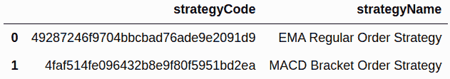
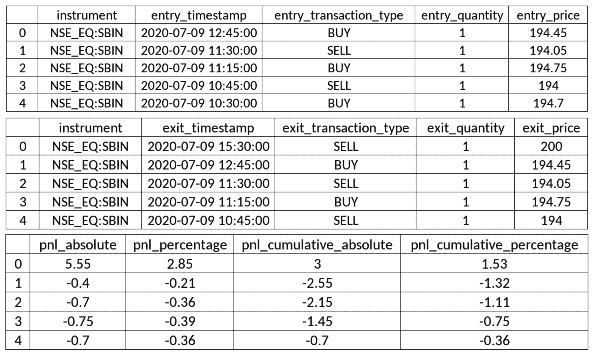
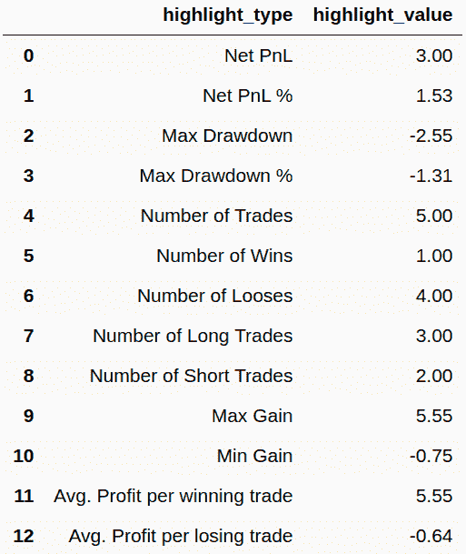
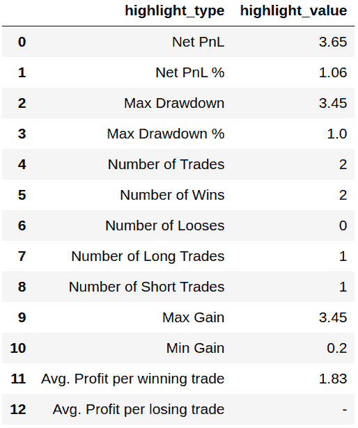

# 算法交易-票据交易

在[第八章](08.html)、*算法交易策略——一步一步编码*建立算法交易策略，并在前一章成功回测得到满意结果后，下一步就是在实盘中进行纸上交易策略。

**纸上交易**是在实时交易时段执行交易策略的方法，只需实时记录来自策略执行的交易。这些交易不是通过经纪人用真钱进行的。早些时候，这种交易记录是在纸上完成的，因此得名**纸交易**。这些虚拟交易可用于分析风险和回报指标。典型的纸面交易指标包括**盈亏** ( **P & L** )、最大亏损、总交易数、盈利交易、亏损交易、多头交易和空头交易、每笔盈利和亏损交易的平均利润等等。纸上交易应至少进行几个交易日，直到这些指标满足必要的要求，整个过程应重复进行，包括更新策略参数和/或策略实施，然后进行回溯测试和纸上交易。

纸上交易背后的基本思想是，交易策略可以在现实市场中执行，以一种几乎类似于真实交易的方式，但没有真钱的风险。纸面交易有助于确保过去的市场情景仍然有效，回溯测试就是针对这些情景进行的。如果过去的市场情景在当前不占优势，即使回溯测试结果是有利可图的，纸面交易结果也可能是相反的。这表明，在真钱上执行策略之前，策略参数和/或策略实施需要更多的工作。

对于票据交易，需要策略配置。它由多个参数组成，其中一些参数如下:

*   **开始和结束时间**:当日应进行票据交易的持续时间。
*   **金融工具**:应进行票据交易的一种或多种金融工具。
*   **蜡烛间隔**:各种可能的蜡烛间隔之一——例如`1 minute`、`15 minutes`、`hour`或`day`。
*   **策略特定参数**:策略中定义的自定义参数值。
*   **策略模式**:日内或交割。日内策略冲掉日内订单，在一天结束时平仓。交割策略对交割订单进行打孔，这些订单不会在一天结束时结算，而是结转到下一个交易日。

需要票据交易引擎来根据给定的策略执行票据交易。在这一章中，你将使用 algo bulls([https://algobulls.com](https://algobulls.com))提供的票据交易引擎，这是一个算法交易平台，通过其**开发者选项**提供服务。它提供了一个名为`pyalgotrading`([https://github.com/algobulls/pyalgotrading](https://github.com/algobulls/pyalgotrading))的 Python 包来使用这些服务。

你已经在[第八章](08.html)、*算法交易策略——分步编码*中编码了两种算法交易策略。回想一下，策略描述如下:

*   **均线-常规单策略**:基于技术指标均线和常规单的策略。([第八章](08.html)、*算法交易策略前六个菜谱——分步编码*。)
*   **MACD 套单策略**:基于 MACD 和套单技术指标的策略。([第八章](08.html)、*算法交易策略的后六个菜谱——分步编码*。)

这些策略也可以作为 Python 包的一部分获得，`pyalgostrategypool`。可以用`pip`安装，如下:`$ pip install pyalgostrategypool`。你也可以在 GitHub([https://github.com/algobulls/pyalgostrategypool](https://github.com/algobulls/pyalgostrategypool))上查看它们。

由于您已经遵循了[第 8 章](08.html)、*算法交易策略——逐步编码*，您已经将这两个策略上传到您的 AlgoBulls 账户。在这一章中，你将从你的 AlgoBulls 账户中取出这些策略，并用它们进行纸上交易。在纸上交易之后，你会得到策略执行日志和各种报告——即损益报告、统计报告和订单历史。这些日志和报告有助于验证策略性能，并为实际交易做准备。通过使用`pyalgotrading`，你可以确保专注于通过纸面交易来开发和验证策略，而不用担心策略执行所需的生态系统。

本章包括前面提到的两种策略的分步方法，从设置与 AlgoBulls 平台的连接、获取策略、运行纸面交易作业到获取执行日志和获取各种类型的报告。

在本章中，您将学习以下食谱:

*   EMA-常规订单策略-获取策略
*   EMA-常规订单策略-票据交易策略
*   EMA——常规订单策略——实时获取纸质交易日志
*   EMA-常规订单策略-获取纸质交易报告-P&L 表
*   EMA-常规订单策略-获取纸质交易报告-统计表
*   EMA-常规订单策略-获取纸质交易报告-订单历史
*   MACD-括号-订单策略-获取策略
*   MACD-括号-订单策略-票据交易策略
*   MACD 套期保值交易策略——实时获取纸面交易日志
*   MACD-括号-订单策略-获取纸质交易报告-P&L 表
*   MACD-括号-订单策略-获取纸质交易报告-统计表
*   MACD-支架-订单策略-获取纸质交易报告-订单历史

纸上交易只有在实时交易时段才有意义，不像回溯测试可以在任何时候进行。请确保您在现场市场时间尝试本章的食谱。

# 技术要求

要成功执行本章中的配方，您需要具备以下条件:

*   Python 3.7+版本
*   Python 包:
*   `pyalgotrading` ( `$ pip install pyalgotrading`)

本章最新的 Jupyter 笔记本可以在 GitHub 上找到，网址为[https://GitHub . com/packt publishing/Python-algorithm-Trading-Cookbook/tree/master/chapter 10](https://github.com/PacktPublishing/Python-Algorithmic-Trading-Cookbook/tree/master/Chapter10)。

# EMA-常规订单策略-获取策略

在本菜谱中，您将从您在 AlgoBulls 平台上的账户中获取策略类`StrategyEMARegularOrder`，该策略类是您在通过*EMA-常规订单策略-将策略上传到 AlgoBulls 交易平台*菜谱中的[第 8 章](08.html)、*算法交易策略-逐步编码*时上传的。这个菜谱首先建立一个到 AlgoBulls 平台的连接，查询你的账户中所有可用的策略，并获取所需策略类的详细信息，`StrategyEMARegularOrder`。

确保你已经看完了 [第八章](08.html)、*算法交易策略——一步一步编码*、的前六个菜谱，对所用的策略类、`StrategyEMARegularOrder`有一个完整的了解。

## 怎么做…

我们为此配方执行以下步骤:

1.  导入必要的模块:

```
>>> from pyalgotrading.algobulls import AlgoBullsConnection
```

2.  创建新的 AlgoBulls 连接对象:

```
>>> algobulls_connection = AlgoBullsConnection()
```

3.  获取授权 URL:

```
>>> algobulls_connection.get_authorization_url()
```

我们得到以下输出:

```
Please login to this URL with your AlgoBulls credentials and get your developer access token: https://app.algobulls.com/user/login
'https://app.algobulls.com/user/login'
```

4.  使用您的 AlgoBulls 凭证登录到前面的链接，获取您的令牌，并在此处进行设置(更多详细信息，请参见*附录 II* ):

```
>>> algobulls_connection.set_access_token(
                    '80b7a69b168c5b3f15d56688841a8f2da5e2ab2c')
```

5.  获取并显示到目前为止您已创建并上传的所有策略:

```
>>> all_strategies = algobulls_connection.get_all_strategies()
>>> all_strategies
```

我们得到以下输出。你的输出可能会有所不同(确保你遵循了[第 8 章](08.html)、*算法交易策略——一步一步编码*中的食谱，以获得类似的输出):



6.  获取并显示第一个策略的策略代码:

```
>>> strategy_code1 = all_strategies.iloc[0]['strategyCode']
>>> strategy_code1
```

我们得到以下输出(您的输出可能不同):

```
'49287246f9704bbcbad76ade9e2091d9'
```

7.  在纸上交易你的策略之前，你可以检查它以确保你有正确的策略:

```
>>> strategy_details1 = \
        algobulls_connection.get_strategy_details(strategy_code1)
>>> print(strategy_details1)
```

我们得到以下输出:

```
class StrategyEMARegularOrder(StrategyBase):

    def __init__(self, *args, **kwargs):
        super().__init__(*args, **kwargs)

        self.timeperiod1 = self.strategy_parameters['timeperiod1']
        self.timeperiod2 = self.strategy_parameters['timeperiod2']

        self.main_order = None

    def initialize(self):
        self.main_order = {}

    @staticmethod
    def name():
        return 'EMA Regular Order Strategy'
    ….
    def strategy_exit_position(self, candle, instrument, 
                               sideband_info):
        if sideband_info['action'] == 'EXIT':
            self.main_order[instrument].exit_position()
            self.main_order[instrument] = None
            return True

        return False
```

这里没有显示完整的输出。请访问以下链接阅读完整输出:[https://github . com/algo bulls/pyalgostrategypool/blob/master/pyalgostrategypool/strategy _ EMA _ regular _ order . py](https://github.com/algobulls/pyalgostrategypool/blob/master/pyalgostrategypool/strategy_ema_regular_order.py)

## 它是如何工作的…

您在*步骤 1* 中导入必要的模块。在*步骤 2* 中，创建了一个`AlgoBullsConnection`类的实例，命名为`algobulls_connection`。在*步骤 3* 中，您使用`algobulls_connection`对象的`get_authorization_url()`方法获得授权 URL。这将打印授权 URL。您应通过网络浏览器访问此 URL，登录 AlgoBulls 平台并获取您的开发者访问令牌。(您可以在*附录二*中找到更多关于从 AlgoBulls 平台获取开发人员访问令牌的详细截图。)您复制访问令牌，并使用`algobulls_connection`的`set_access_token()`方法在*步骤 4* 中设置它。如果令牌被接受，则与 AlgoBulls 平台成功建立连接。

在*步骤 5* 中，你获取所有你已经创建并上传到 AlgoBulls 平台的策略。您对这一步使用了`get_all_strategies()`方法，并将其赋给一个新变量`all_strategies`。这个变量是一个带有`strategyCode`和`strategyName`列的`pandas.DataFrame`对象。此表包含您之前上传的策略代码和策略名称的信息。如果你已经按照*EMA-常规订单策略-在 AlgoBulls 交易平台上传策略*食谱从[第八章](08.html)、*算法交易策略-一步一步编码*，你会发现一个名为`EMA-Regular-Order strategy`的策略。在*步骤 6* 中，您将`EMA-Regular-Order strategy`策略的策略代码分配给一个新变量`strategy_code1`。该步骤的输出中显示了策略代码。该策略代码对于 AlgoBulls 平台上的每个策略都是唯一的。

最后，在*第 7 步*中，你确保`strategy_code1`引用的策略确实是你之前上传的策略(在*EMA-常规订单策略-上传策略到 AlgoBulls 交易平台*配方中[第 8 章](08.html)、*算法交易策略-逐步编码*)。您使用`algobulls_connection`对象的`get_strategy_details()`方法来检查策略。该方法将策略代码作为参数。你在这里过`strategy_code1`。该方法以字符串形式返回整个类代码。你将它赋给一个新变量`strategy_details1`，并显示它。

如果您想更改`strategy_code1`所指的类别代码，如*第 7 步*所示，请参考*EMA-常规下单策略-在 AlgoBulls 交易平台上传策略*的*部分[第 8 章](08.html)、*算法交易策略-分步编码*。*

# EMA-常规订单策略-票据交易策略

在这个食谱中，你将根据`EMA-Regular-Order`策略进行纸上交易。你一定是在之前的食谱中从 AlgoBulls 平台上的账户中获取了这个策略。您将利用`pyalgotrading`为这个菜谱提供的纸上交易功能，该功能反过来在 AlgoBulls 平台上提交一个纸上交易任务。

一旦提交，纸交易将由 AlgoBulls 纸交易引擎运行。您可以随时查询状态，以了解纸张交易作业的状态。作业按以下给定顺序经历以下状态:

*   `'STARTING'`(中间状态)
*   `'STARTED'`(稳定状态)
*   `'STOPPING'`(中间状态)
*   `'STOPPED'`(稳定状态)

提交作业时，它从中间状态`'STARTING'`开始。在这种状态下，AlgoBulls 票据交易引擎将获取策略并准备好执行环境，这可能需要几分钟时间。一旦完成，作业就进入`'STARTED'`状态。纸上交易策略就发生在这个阶段。在这里，只要票据交易完成，它就会一直存在。一旦完成，作业就转移到一个中间状态，即`'STOPPING'`。在这种状态下，AlgoBulls 纸交易引擎清理为此作业分配的资源，通常不到一分钟。最后，作业移动到`'STOPPED'`状态。

如果您已经提交了策略纸交易作业，在第一个作业完成之前，您不能提交同一策略的另一个作业。这意味着您必须等待第一个作业进入`'STOPPED'`状态。如果第一个作业是长时间运行的，并且您想立即停止它，您可以通过`pyalgotrading`提交停止作业请求。在提交请求之前，您需要确保作业处于`'STARTED'`状态。

下面的状态机图展示了在 AlgoBulls 平台上，一个票据交易作业在其生命周期中的各种状态和转换:


在提交一个纸上交易任务后，您可以获取实时策略执行的日志和报告。日志和报告有助于验证策略性能和调试任何潜在问题。

确保你已经看完了 [第八章](08.html)、*算法交易策略——一步一步编码*的前六个菜谱，对所用的策略类、`StrategyEMARegularORder`有一个完整的了解。

## 做好准备

确保`algobulls_connection`和`strategy_code1`对象在 Python 名称空间中可用。参考本章第一个配方来设置`algobulls_connection`和`strategy_code1`对象。

## 怎么做…

我们为此配方执行以下步骤:

1.  导入必要的模块:

```
>>> from datetime import time
>>> from pyalgotrading.constants import *
```

2.  使用交易符号作为关键字搜索工具。将返回的对象分配给`instruments`:

```
>>> instruments = algobulls_connection.search_instrument('SBIN')
>>> instruments
```

我们得到以下输出(您的输出可能不同):

```
[{'id': 7, 'value': 'NSE:SBIN'}]
```

3.  从`instruments`获取选择仪器的`value`:

```
>>> instrument = instruments[0]['value']
>>> instrument
```

我们得到以下输出:

```
'NSE:SBIN'
```

4.  提交`strategy_code1`的票据交易作业:

```
>>> algobulls_connection.papertrade(strategy_code=strategy_code1, 
        start_time=time(hour=9, minute=15), 
        end_time=time(hour=15, minute=30),
        instrument=instrument, 
        lots=1,
        strategy_parameters={
            'timeperiod1': 5,
            'timeperiod2': 12
        }, 
        candle_interval=CandleInterval.MINUTES_15)
```

我们得到以下输出:

```
Setting Strategy Config... Success.
Submitting PAPERTRADING job... Success.
```

5.  检查提交的纸张交易作业的状态:

```
>>> algobulls_connection.get_papertrading_job_status(
                                                strategy_code1)
```

我们得到以下输出:

```
{'data': 'STARTING'}
```

6.  一段时间后，再次检查已提交作业的状态:

```
>>> algobulls_connection.get_papertrading_job_status(
                                                strategy_code1)
```

我们得到以下输出:

```
{'data': 'STARTED'}
```

## 它是如何工作的…

在*步骤 1* 中，从`datetime`模块导入`time`类，从`pyalgotrading.constants`模块导入所有常量。在*步骤 2* 中，使用`algobulls_connection`对象的`search_instrument()`方法，获取您想要进行策略交易的工具`EMA-Regular-Order strategy`。`search_instrument()`方法接受一个搜索字符串作为参数，它应该是您感兴趣的工具的部分或完整的交易符号。你在这里通过`'SBIN'`。该函数返回与搜索字符串匹配的乐器的详细信息列表。可能有多种工具在其交易符号中包含搜索字符串。在*步骤 3* 中，您获取第一个匹配仪器的值，并将其赋给一个新变量`instrument`。

在*的第 4 步*中，您使用`algobulls_connection()`对象的`papertrade()`方法提交一个纸交易作业。它采用以下参数:

*   `strategy_code`:需要进行票据交易的策略的策略代码。这应该是一个字符串。你在这里过`strategy_code1`。
*   `start_time`:今天应该开始进行票据交易的时间。应该是一个`datetime.time`对象。在这里，您传递一个值为 9 小时 15 分的对象-`time(hour=9, minute=15)`。关于创建一个`time`对象的详细信息，请参考本书的第一个配方。

*   `end_time`:今天到应该进行票据交易的时间。该对象应该保存一个比`start_time`保存的值早的时间值。应该是一个`datetime.time`的实例。在这里，您传递一个值为 15 小时 30 分的对象。
*   `instrument`:应进行票据交易的金融工具。将获取该仪器的历史数据。应该是字符串。你在这里过`instrument`。
*   `lots`:应进行票据交易的手数。这应该是一个整数。数量由策略计算为金融工具的*手数* × *手数*。你在这里过`1`。
*   `strategy_parameters`:策略期望的参数名称和值。这应该是一个字典，用`parameter-name`和`parameter-value`作为键值对。您在这里传递以下参数:
*   `timeperiod1: 5`
*   `timeperiod2: 12`

(回想 EMA-常规订单策略的参数已经在其`__init__()`方法中定义，如[第八章](08.html)、*算法交易策略-逐步编码*的第一个配方所示)。

*   `candle_interval`:取纸交易历史数据的蜡烛间隔。这应该是一个类型为`CandleInterval`的枚举。你在这里通过`CandleInterval.MINUTES_15`。(`CandleInterval`枚举为蜡烛间隔提供了各种枚举，其中一些是`MINUTE_1`、`MINUTES_3`、`MINUTES_5`、`MINUTES_10`、`MINUTES_15`、`MINUTES_30`、`HOUR`和`DAY`。)

如果作业提交成功，您将看到由`papertrade()`功能打印的`Success`消息。

提交作业后，需要一段时间才能开始。开始后，可能需要一些时间来完成，这取决于使用`start_time`和`end_time`参数指定的票据交易的持续时间。通常，票据交易在整个交易日都在运行，这意味着这项工作将运行 6-8 个小时。

在*步骤 5* 中，您使用`algobulls_connection`对象的`get_papertrading_job_status()`方法获取作业状态。你通过`strategy_code1`作为这里的论据。这个方法返回一个字典，其中有一个键值对、数据*和作业*状态。如果您在放置工单后立即查询状态，您将得到`'STARTING'`作为状态。在*步骤 6* 中，您在一段时间后再次查询状态，如果作业已经开始，您得到的状态为`'STARTED'`。**

成功提交意味着交易策略文件所需的最少输入已经以要求的格式通过。但是，它不能确保策略运行时不会出错。在票据交易过程中，策略执行仍可能出错。为了调试执行问题，您需要获取输出日志，这将在下一个菜谱中解释。错误的可能原因可能是策略类 Python 代码中的错误或者传递给`papertrade()`函数的`strategy_parameters`字典不完整。

## 还有更多…

如果一个任务运行了很长时间，你想在它完成之前停止它，你可以使用`algobulls_connection`对象的`stop_papertrading_job()`方法。该方法接受策略代码作为参数。你在这里通过`strategy_code1`。该方法向 AlgoBulls 票据交易引擎提交一个停止请求。如果请求被接受，您会在这里看到一条`Success`消息:

```
>>> algobulls_connection.stop_papertrading_job(strategy_code1)
 Stopping PAPERTRADING job... Success.
```

如果您在提交停止请求后查询状态，您将获得状态为`'STOPPING'`:

```
>>> algobulls_connection.get_papertrading_job_status(strategy_code1)
{'data': 'STOPPING'}
```

如果您在一段时间后再次查询状态，并且如果作业已经停止，您将获得状态为`'STOPPED'`:

```
>>> algobulls_connection.get_papertrading_job_status(strategy_code1)
{'data': 'STOPPED'} 
```

# EMA——常规订单策略——实时获取纸质交易日志

在 AlgoBulls 平台上提交一个纸交易任务后，AlgoBulls 纸交易引擎开始执行策略。在执行过程中，AlgoBulls 票据交易引擎发生的每一个事件和做出的每一个决定都以文本日志的形式记录了准确的时间戳。记录活动的一些例子包括给定的策略配置、每隔一段时间产生的新蜡烛线、被你的策略穿孔的交易、这些交易产生的头寸的进出、等待新蜡烛线等等。这些日志是验证策略行为和调试在开发策略时经常遇到的行为或性能问题的精华。

在这个食谱中，你将为你的策略获取交易日志。一旦您提交的纸交易作业达到`'STARTED'`状态，日志就开始出现(请参考前面的方法，了解纸交易作业状态的更多信息)。AlgoBulls 平台允许您实时获取日志，即使在交易工作仍在进行的时候。你可以洞察策略的执行，而不必等待纸上交易工作完成。这是有帮助的，因为纸交易工作通常是长期运行的。`pyalgotrading`包提供了一个简单的方法来获取给定策略的执行日志。

确保你已经看完了[第八章](08.html)、*算法交易策略——一步一步编码*的前六个菜谱，对所用的策略类`StrategyEMARegularOrder`有一个完整的了解。

## 做好准备

确保`algobulls_connection`和`strategy_code1`对象在 Python 名称空间中可用。参考本章第一个配方来设置`algobulls_connection`和`strategy_code1`对象。

## 怎么做…

我们为此配方执行以下步骤:

1.  获取`strategy_code1`的纸面交易执行日志:

```
>>> logs = algobulls_connection.get_papertrading_logs(
                                              strategy_code1)
>>> print(logs)
```

我们得到以下输出(您的输出可能不同):

```
[2020-07-09 09:12:18] Logs not available yet. Please retry in sometime.
```

2.  过一段时间后再次获取`strategy_code1`的纸面交易执行日志:

```
>>> logs = algobulls_connection.get_papertrading_logs(
                                               strategy_code1)
>>> print(logs)
```

我们得到以下输出(您的输出可能不同):

```
...
########################################
 INITIALIZING ALGOBULLS CORE (v3.2.0 SECURE MODE)... 
########################################
[2020-07-09 09:12:31] Welcome ALGOBULLS VIRTUAL USER!
[2020-07-09 09:12:31] Reading strategy…
…
[PT] [2020-07-09 09:15:00] [INFO] [tls] STARTING ALGOBULLS CORE…
...
[PT] [2020-07-09 10:30:00] [CRITICAL] [order] [PLACING NEW ORDER] [2020-07-09 10:30:00] [96c24ca4b3e448f381fc5c2bc52f7a29] [BUY] [NSE:SBIN] [QTY:1] [QTY PENDING: 1] [ENTRY PRICE: 194.7] [PRICE:None] [TRIGGER PRICE:None] [ORDER_TYPE_REGULAR] [ORDER_CODE_INTRADAY] [ORDER_VARIETY_MARKET] [ORDER_POSITION_ENTER]
…
[PT] [2020-07-09 15:30:00] [INFO] [clock] Candle generation has been stopped...
[PT] [2020-07-09 15:30:00] [INFO] [tls] Received event END OF MARKET. Stopping Trading Core Engine...
[PT] [2020-07-09 15:30:00] [INFO] [tls] Exiting all open positions with order code: ORDER_CODE_INTRADAY (if any)...
[PT] [2020-07-09 15:30:00] [CRITICAL] [tls] [User: ALGOBULLS VIRTUAL USER] Trading session completed
...
```

这里没有显示完整的输出。请访问以下链接阅读完整输出:[https://github . com/algo bulls/pyalgostrategypool/blob/master/pyalgostrategypool/sample/paper trading/strategy _ EMA _ regular _ order/logs . txt](https://github.com/algobulls/pyalgostrategypool/blob/master/pyalgostrategypool/sample/papertrading/strategy_ema_regular_order/logs.txt)

## 它是如何工作的…

在*步骤 1* 中，您使用`algobulls_connection`对象的`get_papertrading_logs()`方法实时获取策略纸交易日志。该方法接受策略代码作为参数。你在这里通过`strategy_code1`。返回的数据是一个字符串。如果您在提交作业后立即尝试这一步，您会得到一个字符串，表示日志还没有准备好(`[2020-07-09 09:14:18] Logs not available yet. Please retry in sometime.`)。如果票据交易作业处于`'STARTING'`状态，就会发生这种情况。

在*步骤 2* 中，你在一段时间后再次获取日志。如果作业脱离了`'STARTING'`状态，您将开始获取策略执行日志。每次调用`get_papertrading_logs()`函数时，您都会获得完整的纸交易日志。

## 还有更多...

一旦纸交易作业移动到`'STOPPED'`状态，就不会生成新的日志。您可以在提交同一策略的下一笔交易之前的任何时候获取完整的日志。如果提交了一个新的纸面交易作业(对于相同的策略)，这些日志将不再可以通过`get_papertrading_logs()`方法访问。如果您想在以后引用它，可以将获取的日志保存到一个文件中。

# EMA-常规订单策略-获取纸质交易报告-损益表

在 AlgoBulls 平台上提交一个纸交易任务后，AlgoBulls 纸交易引擎开始执行策略。在执行过程中，除了日志，AlgoBulls 票据交易引擎还会实时生成 P&L 表。这个表保存了策略中每笔交易的信息。它还详细描述了挂单和止损单以及交易 P&L 和累计 P&L 之间的映射关系，按时间顺序排列，最新的订单排在最前面。该表借助单个和累积的 P&L 数，提供了对整体策略绩效的深入了解。进出顺序映射也有助于验证策略行为。

在这个菜谱中，您将为您的策略获取 P&L 表报告。在你提交一份书面交易工作后，一旦你的策略打出第一笔交易，你就可以得到这份报告。AlgoBulls 平台允许您实时获取 P&L 表，即使在票据交易工作仍在进行的时候。你可以洞察策略的表现，而不必等待纸上交易工作完成。这是有帮助的，因为纸交易工作通常是长期运行的。`pyalgotrading`包提供了一个简单的方法来获取给定策略的 P & L 表。

确保你已经看完了[第八章](08.html)、*算法交易策略——一步一步编码*的前六个菜谱，对所用的策略类`StrategyEMARegularOrder`有一个完整的了解。

## 做好准备

确保`algobulls_connection`和`strategy_code1`对象在 Python 名称空间中可用。参考本章第一个配方来设置`algobulls_connection`和`strategy_code1`对象。

## 怎么做…

获取`strategy_code1`的纸质交易 P&L 报告:

```
>>> algobulls_connection.get_papertrading_report_pnl_table(strategy_code1)
```

我们得到以下输出。您的输出可能会有所不同(注意，为了便于表示，下面的输出被分成了多个表。您将在 Jupyter 笔记本中看到一张宽大的桌子):



## 它是如何工作的…

在这个方法中，您使用`algobulls_connection`对象的`get_papertrading_report_pnl_table()`方法来实时获取票据交易 P & L 表。该方法接受策略代码作为参数。你在这里通过`strategy_code1`。返回的数据是一个多列的`pandas.DataFrame`对象，描述如下:

*   `instrument`:已进行交易的金融工具。
*   `entry_timestamp`:挂单的时间戳。(注意，在进入`'COMPLETE'`状态之前，它可能会保持在`'OPEN'`状态一段时间。这种状态转换的时间可以使用订单历史表找到，在本章的第六个配方中有解释。)

*   `entry_transaction_type`:挂单交易类型`BUY`或`SELL`。
*   `entry_quantity`:挂单数量。

*   `entry_price`:挂单执行并进入`'COMPLETE'`状态的价格。
*   `exit_timestamp`:止损单发出的时间。(注意，在进入`'COMPLETE'`状态之前，它可能会在`'OPEN'`状态保持一段时间。)

*   `exit_transaction_type`:挂单交易类型(可以是`BUY`也可以是`SELL`)。
*   `exit_quantity`:退出订单数量。
*   `exit_price`:挂单执行并进入`'COMPLETE'`状态的价格。
*   `pnl_absolute`:挂单执行价格和挂单执行价格之间的差额。数学上，这是(*出场价格* - *进场价格* )* *出场数量*做多交易的(*进场价格* - *出场价格* )* *出场数量*。正值意味着交易是盈利交易。负值意味着交易是亏本交易。
*   `pnl_percentage`:相对于进场价格的盈亏百分比。数学上，这就是*pnl _ absolute*/*entry _ price*/*exit _ quantity*x*100*。
*   `pnl_cumulative_absolute`:累计损益。从数学上讲，这是以前交易的所有`pnl_absolute`值的总和。这个数字给出了对模拟时间的策略性能的直接洞察。
*   `pnl_cumulative_percentage`:累计盈亏相对于进场价格的百分比。数学上这就是*pnl _ 累计* / *进场 _ 价格* / *出场 _ 数量* x *100* 。

## 还有更多...

一旦票据交易作业进入`'STOPPED'`状态，P & L 表报告将不再更新。你可以在提交同一策略的下一个交易任务之前的任何时候获取完整的损益报告。如果提交了新的纸面交易作业(针对同一策略)，则该报告将无法再通过`get_papertrading_report_pnl_table()`方法访问。如果您想在以后引用它，您可以将获取的报告保存到一个`.csv`文件中。

# EMA-常规订单策略-获取纸质交易报告-统计表

在 AlgoBulls 平台上提交一个纸交易任务后，AlgoBulls 纸交易引擎开始执行策略。在执行过程中，除了日志和 P&L 表，AlgoBulls 纸交易引擎还实时从 P&L 表生成摘要。这个摘要是一个统计表，包含各种统计数字，如`Net P&L`(绝对值和百分比)、`Max Drawdown`(绝对值和百分比)、总交易数、盈利交易数、亏损交易数、多头交易数和空头交易数、最大收益和最小收益(或最大亏损)以及每笔盈利和亏损交易的平均利润。此表提供了总体策略绩效的即时概览。

在这个菜谱中，您将为您的策略获取统计表报告。在你提交一份书面交易工作后，一旦你的策略打出第一笔交易，你就可以得到这份报告。AlgoBulls 平台允许您实时获取统计表，即使在票据交易工作仍在进行的时候。你可以洞察策略的表现，而不必等待纸上交易工作完成。这是有帮助的，因为纸交易工作通常是长期运行的。`pyalgotrading`包提供了一个简单的方法来获取给定策略的统计表。

确保你已经看完了 [第八章](08.html)、*算法交易策略——一步一步编码*的前六个菜谱，对所使用的策略类、`StrategyEMARegularOrder`有一个完整的了解。

## 做好准备

确保`algobulls_connection`和`strategy_code1`对象在 Python 名称空间中可用。参考本章第一个配方来设置`algobulls_connection`和`strategy_code1`对象。

## 怎么做…

获取`strategy_code1`的纸质交易统计报表:

```
>>> algobulls_connection.get_papertrading_report_statistics(strategy_code1)
```

我们得到以下输出(您的输出可能不同):



## 它是如何工作的…

在这个方法中，您使用`algobulls_connection`对象的`get_papertrading_report_statistics()`方法来实时获取纸面交易统计表。该方法接受策略代码作为参数。你在这里通过`strategy_code1`。返回的数据是一个具有两列`highlight_type`和`highlight_value`以及多行的`pandas.DataFrame`对象。这些行描述如下:

*   `Net PnL`:累计的纸交易 P & L，这也是 P & L 表中第一条分录的`pnl_cumulative_absolute`值。
*   `Net PnL %`:累计票据交易 P & L 的百分比。这也是 P & L 表中第一个条目的`pnl_cumulative_percentage`值。
*   `Max Drawdown`:P&L 表`pnl_cumulative`栏中的最小值。这表示您的策略在执行过程中遇到的最大损失。

*   `Max Drawdown %`:数学上这是*(最大提现)* / *(对应进场 _ 价格* / *出场 _ 数量* x *100* 。
*   `Number of Trades`:盘中总交易(进场和出场算一个)。
*   `Number of Wins`:交易 P & L 为非负的交易计数。
*   `Number of Losses`:交易 P & L 为负的交易计数。
*   `Number of Long Trades`:进场交易类型为`'BUY'`的交易笔数。
*   `Number of Short Trades`:进场交易类型为`'SELL'`的交易笔数。
*   `Max Gain`:所有交易中 P & L 值最大的交易的 P & L。
*   `Min Gain`:所有交易中 P & L 值最小的交易的 P & L。
*   `Avg. Profit per winning trade`:数学上这是*(成功交易的总 P&L)*/*(成功交易的计数)*。
*   `Avg. Profit per losing trade`:数学上这是*(亏损交易的总 P&L)*/*(亏损交易数)*。

## 还有更多...

如果在纸张交易作业仍在运行时获取统计表，前面提到的数字将是基于当时完成的交易的中间数字。随着更多的交易被打孔，数字可能会改变，直到纸上交易工作完成。

一旦纸交易工作移动到`'STOPPED'`状态，统计表将不再改变。您可以在提交同一策略的下一笔交易之前的任何时候获取完整的统计表。如果提交了一个新的纸交易任务(对于相同的策略)，这个表将不再可以通过`get_papertrading_report_statistics()`方法访问。如果您想在以后的某个时间点引用它，您可以将获取的报告表保存到一个`.csv`文件中。

# EMA-常规订单策略-获取纸质交易报告-订单历史

在 AlgoBulls 平台上提交一个纸交易任务后，AlgoBulls 纸交易引擎开始执行策略。在执行过程中，除了日志、P&L 表和统计表，AlgoBulls 票据交易引擎还实时生成订单历史日志。该日志包含每个订单的状态转换，以及每个订单状态的时间戳和附加信息(如果有)。订单历史记录对于理解一笔交易从`'OPEN'`到`'COMPLETE'`或`'CANCELLED`状态需要多长时间至关重要。例如，`MARKET`订单将立即从`'OPEN'`变为`'COMPLETE'`状态，但是`LIMIT`订单可能需要一段时间，根据市场情况，从`'OPEN'`变为`'COMPLETE'`状态，或者它们甚至可能到达`'CANCELLED'`。所有这些信息都可以在订单历史日志中找到。(有关订单状态转换的更多信息，请参考第 6 章、*在交易所*下单中的[状态机图。)](06.html)

在这个菜谱中，您将获取您的策略的订单历史日志。在你提交了一份书面的交易工作后，你的策略在第一次交易时就可以使用这个日志了。AlgoBulls 平台允许您实时获取订单历史记录，即使在票据交易工作仍在进行的时候。这有助于我们获得最终状态中订单的详细信息，而不必等待纸面交易作业完成。`pyalgotrading`包提供了一个简单的方法来获取给定策略的订单历史日志。

确保你已经看完了 [第八章](08.html)、*算法交易策略——一步一步编码*的前六个菜谱，对所使用的策略类`StrategyEMARegularOrder`有一个完整的了解。

## 做好准备

确保`algobulls_connection`和`strategy_code1`对象在 Python 名称空间中可用。参考本章第一个配方来设置`algobulls_connection`和`strategy_code1`对象。

## 怎么做…

获取`strategy_code1`的纸质交易订单历史报告:

```
>>> order_history = \
        algobulls_connection.get_papertrading_report_order_history(
                                                           strategy_code1)
```

我们得到以下输出。您的输出可能有所不同:

```
+-------------+---------------------+----------------------------------+------+
| INST        | TIME                | ID                               | TT   |
|-------------+---------------------+----------------------------------+------|
| NSE_EQ:SBIN | 2020-07-09 10:30:00 | 96c24ca4b3e448f381fc5c2bc52f7a29 | BUY  |
+-------------+---------------------+----------------------------------+------+
+----+---------------------+------------------------+-------+
|    | TIME                | STATE                  | MSG   |
|----+---------------------+------------------------+-------|
|  0 | 2020-07-09 10:30:00 | PUT ORDER REQ RECEIVED |       |
|  1 | 2020-07-09 10:30:00 | VALIDATION PENDING     |       |
|  2 | 2020-07-09 10:30:00 | OPEN PENDING           |       |
|  3 | 2020-07-09 10:30:00 | OPEN                   |       |
|  4 | 2020-07-09 10:30:00 | COMPLETE               |       |
+----+---------------------+------------------------+-------+
+-------------+---------------------+----------------------------------+------+
| INST        | TIME                | ID                               | TT   |
|-------------+---------------------+----------------------------------+------|
| NSE_EQ:SBIN | 2020-07-09 10:45:00 | 3bbd433edd004630b122de07873864d7 | SELL |
+-------------+---------------------+----------------------------------+------+
+----+---------------------+------------------------+-------+
|    | TIME                | STATE                  | MSG   |
|----+---------------------+------------------------+-------|
|  0 | 2020-07-09 10:45:00 | PUT ORDER REQ RECEIVED |       |
|  1 | 2020-07-09 10:45:00 | VALIDATION PENDING     |       |
|  2 | 2020-07-09 10:45:00 | OPEN PENDING           |       |
|  3 | 2020-07-09 10:45:00 | OPEN                   |       |
|  4 | 2020-07-09 10:45:00 | COMPLETE               |       |
+----+---------------------+------------------------+-------+
...
```

这里没有显示完整的输出。请访问以下链接阅读完整输出:[https://github . com/algo bulls/pyalgostrategypool/blob/master/pyalgostrategypool/sample/paper trading/strategy _ EMA _ regular _ order/OMS _ order _ history . log](https://github.com/algobulls/pyalgostrategypool/blob/master/pyalgostrategypool/sample/papertrading/strategy_ema_regular_order/oms_order_history.log)

## 它是如何工作的…

在这个菜谱中，您使用`algobulls_connection`对象的`get_papertrading_report_order_history()`方法来实时获取订单历史日志。该方法接受策略代码作为参数。你在这里通过`strategy_code1`。返回数据是一个字符串，描述如下:

对于每个订单，日志都包含以下信息:

*   订单上的描述性表格，包含以下各列:
*   `INST`:订单的金融工具
*   `TIME`:下单的时间
*   `ID`:订单的唯一标识
*   `TT`:订单交易类型(`BUY`或`SELL`)

该表的示例如下所示:

```
+-------------+---------------------+----------------------------------+------+
| INST        | TIME                | ID                               | TT   |
|-------------+---------------------+----------------------------------+------|
| NSE_EQ:SBIN | 2020-07-09 10:30:00 | 96c24ca4b3e448f381fc5c2bc52f7a29 | BUY  |
+-------------+---------------------+----------------------------------+------+
```

这些信息将帮助您在策略执行日志中找到这个确切的顺序。

*   订单状态转换表，包含以下各列:
*   `TIME`:订单处于`'STATE'`栏表示的状态的时间。

*   `STATE`:订单在`'TIME'`栏提到的时间进入该状态。

*   `MSG`:来自 OMS 的任何意外状态转换的附加消息。例如，进入`REJECTED`状态的订单有一条来自 OMS 的消息，说明其被拒绝的原因。这一栏通常是空的。

该表的示例如下所示:

```
+----+---------------------+------------------------+-------+
|    | TIME                | STATE                  | MSG   |
|----+---------------------+------------------------+-------|
|  0 | 2020-07-09 10:30:00 | PUT ORDER REQ RECEIVED |       |
|  1 | 2020-07-09 10:30:00 | VALIDATION PENDING     |       |
|  2 | 2020-07-09 10:30:00 | OPEN PENDING           |       |
|  3 | 2020-07-09 10:30:00 | OPEN                   |       |
|  4 | 2020-07-09 10:30:00 | COMPLETE               |       |
+----+---------------------+------------------------+-------+
```

从这个表中，您可以看到在上午 10:30 下订单后，它立即转换到`'COMPLETE'`状态。这是意料之中的，因为该订单是正常的市场订单。(参考第六章[第一个配方，*在交易所*下常规订单，了解更多常规市场订单的详细信息。)](06.html)

## 还有更多...

一旦纸交易作业进入`'STOPPED'`状态，就不会生成新的订单历史记录。您可以在提交同一策略的下一笔交易之前的任何时候获取完整的订单历史记录。如果提交了一个新的纸面交易作业(对于相同的策略)，这些日志将不再可以通过`get_papertrading_report_order_history()`方法访问。如果您想在以后引用它，可以将获取的日志保存到一个文件中。

# MACD-括号-订单策略-获取策略

在这个菜谱中，您将从您在 AlgoBulls 平台上的帐户中获取策略类`StrategyMACDBracketOrder`，您必须在浏览[第 8 章](https://cdp.packtpub.com/python_algorithmic_trading_cookbook/wp-admin/post.php?post=32&action=edit#post_30)、*算法交易策略-逐步编码*的最后一个菜谱时上传该策略类。该方法首先建立与 AlgoBulls 平台的连接，查询您帐户中所有可用的策略，并获取所需策略类别的详细信息，`StrategyMACDBracketOrder`。

确保你已经看完了[第八章](https://cdp.packtpub.com/python_algorithmic_trading_cookbook/wp-admin/post.php?post=32&action=edit#post_30)、*算法交易策略——一步一步编码*的最后六个菜谱，对使用的策略类`StrategyMACDBracketOrder`有一个完整的了解。

## 怎么做…

我们为此配方执行以下步骤:

1.  导入必要的模块:

```
>>> from pyalgotrading.algobulls import AlgoBullsConnection
```

2.  创建新的 AlgoBulls 连接对象:

```
>>> algobulls_connection = AlgoBullsConnection()
```

3.  获取授权 URL:

```
>>> algobulls_connection.get_authorization_url()
```

我们得到以下输出:

```
Please login to this URL with your AlgoBulls credentials and get your developer access token: https://app.algobulls.com/user/login
'https://app.algobulls.com/user/login'
```

4.  使用您的 AlgoBulls 凭证登录到前面的链接，获取您的令牌，并在此处进行设置(更多详细信息，请参见*附录 II* ):

```
>>> algobulls_connection.set_access_token(
                    '80b7a69b168c5b3f15d56688841a8f2da5e2ab2c')
```

5.  获取并显示到目前为止您已创建并上传的所有策略:

```
>>> all_strategies = algobulls_connection.get_all_strategies()
>>> all_strategies
```

我们得到以下输出。你的输出可能会有所不同(确保你遵循了[第 8 章](https://cdp.packtpub.com/python_algorithmic_trading_cookbook/wp-admin/post.php?post=32&action=edit#post_30)、*算法交易策略——一步一步编码*中的食谱，以获得类似的输出):


6.  获取并显示第二个策略的策略代码，即 MACD 括号订单策略:

```
>>> strategy_code2 = all_strategies.iloc[1]['strategyCode']
>>> strategy_code2
```

我们得到以下输出(您的输出可能不同):

```
'49287246f9704bbcbad76ade9e2091d9'
```

7.  在纸上交易你的策略之前，你可以检查你的策略，以确保你有正确的策略:

```
>>> strategy_details2 = \
        algobulls_connection.get_strategy_details(strategy_code2)
>>> print(strategy_details2)
```

我们得到以下输出:

```
class StrategyMACDBracketOrder(StrategyBase):

    def __init__(self, *args, **kwargs):
        super().__init__(*args, **kwargs)

        self.fastMA_period = \
            self.strategy_parameters['fastma_period']
        self.slowMA_period = \
            self.strategy_parameters['slowma_period']
        self.signal_period = \
            self.strategy_parameters['signal_period']
        self.stoploss = \
            self.strategy_parameters['stoploss_trigger']
        self.target = self.strategy_parameters['target_trigger']
        self.trailing_stoploss = \
            self.strategy_parameters['trailing_stoploss_trigger']

        self.main_order = None

    def initialize(self):
        self.main_order = {}

    @staticmethod
    def name():
        return 'MACD Bracket Order Strategy'
    ….
    def strategy_exit_position(self, candle, instrument, 
                               sideband_info):
        if sideband_info['action'] == 'EXIT':
            self.main_order[instrument].exit_position()
            self.main_order[instrument] = None
            return True

        return False
```

这里没有显示完整的输出。请访问以下链接阅读完整输出:[https://github . com/algo bulls/pyalgostrategypool/blob/master/pyalgostrategypool/strategy _ MACD _ bracket _ order . py](https://github.com/algobulls/pyalgostrategypool/blob/master/pyalgostrategypool/strategy_macd_bracket_order.py)

## 它是如何工作的…

您在*步骤 1* 中导入必要的模块。在*步骤 2* 中，您创建了一个`AlgoBullsConnection`类的实例，名为`algobulls_connection`。在*步骤 3* 中，您使用`algobulls_connection`对象的`get_authorization_url()`方法获得授权 URL。这将打印授权 URL。您应通过网络浏览器访问此 URL，登录 AlgoBulls 平台并获取您的开发者访问令牌。(您可以在*附录二*的截图中找到更多关于从 AlgoBulls 平台获取开发者访问令牌的详细信息。)您复制访问令牌，并使用`algobulls_connection`的`set_access_token()`方法在*步骤 4* 中设置它。如果令牌被接受，则与 AlgoBulls 平台成功建立连接。

在*步骤 5* 中，你获取所有你已经创建并上传到 AlgoBulls 平台的策略。您对这一步使用了`get_all_strategies()`方法，并将其赋给一个新变量`all_strategies`。这个变量是一个带有`strategyCode`和`strategyName`列的`pandas.DataFrame`对象。此表包含您之前上传的策略代码和策略名称的信息。如果你已经遵循了*MACD-套期保值-订单策略——在 AlgoBulls 交易平台上传策略*从[第八章](08.html)、*算法交易策略——一步一步编码*，你会发现一个名为`MACD-Regular-Order strategy`的策略。在*步骤 6* 中，您将`MACD-Regular-Order strategy`策略的策略代码分配给一个新变量`strategy_code2`。该步骤的输出中显示了策略代码。该策略代码对于 AlgoBulls 平台上的每个策略都是唯一的。

最后，在*第 7 步*中，你确保`strategy_code2`引用的策略确实是你之前上传的策略(在[第 8 章](08.html)、*算法交易策略——分步编码*的最后一个菜谱中)。您使用`algobulls_connection`对象的`get_strategy_details()`方法来检查策略。该方法将策略代码作为参数。你在这里过`strategy_code2`。该方法以字符串形式返回整个类代码。你将它赋给一个新变量`strategy_details2`，并显示它。

如果您想更改`strategy_code2`所指的类别代码，如*第 7 步*所示，请参考[第 8 章](08.html)、*算法交易策略——逐步编码*中最后一个配方的*…*部分。

# MACD-括号-订单策略-票据交易策略

在这个食谱中，你将根据`MACD-Bracket-Order strategy`策略进行纸上交易。在本章的前一个食谱中，你必须从 AlgoBulls 平台的账户中获取这个策略。您将利用`pyalgotrading`为这个菜谱提供的纸上交易功能，该功能反过来在 AlgoBulls 平台上提交一个纸上交易任务。

一旦提交，纸交易将由 AlgoBulls 纸交易引擎运行。您可以随时查询状态，以了解纸张交易作业的状态。作业按以下给定顺序经历以下状态:

*   `'STARTING'`(中间状态)
*   `'STARTED'`(稳定状态)

*   `'STOPPING'`(中间状态)
*   `'STOPPED'`(稳定状态)

提交作业时，它从中间状态`'STARTING'`开始。在这种状态下，AlgoBulls 票据交易引擎将获取策略并准备好执行环境，这可能需要几分钟时间。一旦完成，作业就进入`'STARTED'`状态。纸上交易策略就发生在这个阶段。在这里，只要票据交易完成，它就会一直存在。一旦完成，作业就转移到一个中间状态，即`'STOPPING'`。在这种状态下，AlgoBulls 纸交易引擎清理为此作业分配的资源，通常不到一分钟。最后，作业移动到`'STOPPED'`状态。

如果您已经提交了一个策略的纸交易作业，在第一个作业完成之前，您不能提交同一策略的另一个作业。这意味着您必须等待第一个作业进入`'STOPPED'`状态。如果第一个作业是长时间运行的，并且您想立即停止它，您可以通过`pyalgotrading`提交停止作业请求。在提交请求之前，您需要确保作业处于`'STARTED'`状态。

在提交一个纸上交易任务后，您可以获取实时策略执行的日志和报告。日志和报告有助于验证策略性能和调试任何潜在问题。

你可以参考本章的第二个配方来得到一个纸交易作业的状态机图。它在 AlgoBulls 平台上演示了一个纸交易作业在其生命周期中的各种状态和转换。

确保你已经看完了 [第八章](08.html)、*算法交易策略——一步一步编码*的最后六个菜谱，对所使用的策略类`StrategyMACDBracketOrder`有一个完整的了解。

## 做好准备

确保`algobulls_connection`和`strategy_code2`对象在 Python 名称空间中可用。参照本章的*MACD-括号-订单策略-取策略*配方设置`algobulls_connection`和`strategy_code2`对象。

## 怎么做…

我们为此配方执行以下步骤:

1.  导入必要的模块:

```
>>> from datetime import time
>>> from pyalgotrading.constants import *
```

2.  使用交易符号作为关键字搜索工具。将返回的对象分配给`instruments`:

```
>>> instrument = algobulls_connection.search_instrument(
                                                    'TATASTEEL')
>>> instrument
```

我们得到以下输出(您的输出可能不同):

```
[{'id': 1, 'value': 'NSE:TATASTEEL'}]
```

3.  从`instruments`获取选择仪器的`value`:

```
>>> instrument = instrument[0]['value']
>>> instrument
```

我们得到以下输出:

```
'NSE:TATASTEEL'
```

4.  提交`strategy_code2`的票据交易作业:

```
>>> algobulls_connection.papertrade(
        strategy_code=strategy_code2, 
        start_time=time(hour=9, minute=15),
        end_time=time(hour=15, minute=30),
        instrument=instrument,
        lots=1,
        strategy_parameters={
            'fastma_period': 26, 
            'slowma_period': 6, 
            'signal_period': 9,
            'target_trigger': 0.01, 
            'stoploss_trigger': 0.01, 
            'trailing_stoploss_trigger': 1
        },
        candle_interval=CandleInterval.MINUTES_15)
```

我们得到以下输出:

```
Setting Strategy Config... Success.
Submitting PAPERTRADING job... Success.
```

5.  检查提交的纸张交易作业的状态:

```
>>> algobulls_connection.get_papertrading_job_status(
                                                strategy_code2)
{'data': 'STARTING'}
```

6.  一段时间后，再次检查提交的纸张交易作业的状态:

```
>>> algobulls_connection.get_papertrading_job_status(
                                                strategy_code2)
{'data': 'STARTED'} 
```

## 它是如何工作的…

在*步骤 1* 中，从`datetime`模块导入`time`类，从`pyalgotrading.constants`模块导入所有常量。在*步骤 2* 中，使用`algobulls_connection`对象的`search_instrument()`方法，获取您想要进行策略交易的工具`MACD-Bracket-Order strategy`。`search_instrument()`方法接受一个搜索字符串作为参数，它应该是您感兴趣的工具的部分或完整的交易符号。你在这里通过`'TATASTEEL'`。该函数返回与搜索字符串匹配的乐器的详细信息列表。可能有多种工具在其交易符号中包含搜索字符串。在*步骤 3* 中，您获取第一个匹配仪器的值，并将其赋给一个新变量`instrument`。

在*的第 4 步*中，您使用`algobulls_connection()`对象的`papertrade()`方法提交一个纸交易作业。它采用以下参数:

*   `strategy_code`:需要进行票据交易的策略的策略代码。应该是字符串。你在这里过`strategy_code2`。
*   `start_time`:今天应该开始进行票据交易的时间。应该是一个`datetime.time`对象。在这里，您传递一个值为 9 小时 15 分的对象-`time(hour=9, minute=15)`。关于创建一个`time`对象的详细信息，请参考本书的第一个配方。

*   `end_time`:今天到应该进行票据交易的时间。该对象应该保存一个比`start_time`保存的值早的时间值。应该是一个`datetime.time`的实例。在这里，您传递一个值为 15:30 hours-`time(hour=15, minute=30)`的对象。
*   `instrument`:应进行票据交易的金融工具。将获取该仪器的历史数据。应该是字符串。你在这里过`instrument`。
*   `lots`:应进行票据交易的手数。应为整数。数量由策略计算为金融工具的*手数* × *手数*。你在这里过`1`。
*   `strategy_parameters`:策略期望的参数名称和值。应该是一个字典，用`parameter-name`和`parameter-value`作为键值对。您在这里传递以下参数:
*   `fastma_period: 26`
*   `slowma_period: 6`
*   `signal_period: 9`

*   `target_trigger: 0.01`
*   `stoploss_trigger: 0.01`
*   `trailing_stoploss_trigger: 1`

(回想一下，MACD 套单策略的参数已经在它的`__init__()`方法中定义过了，如[第八章](08.html)、*算法交易策略-逐步编码*的第一个配方所示)。

*   `candle_interval`:取纸交易历史数据的蜡烛间隔。应该是类型为`CandleInterval`的枚举。你在这里通过`CandleInterval.MINUTES_15`。(`CandleInterval`枚举为蜡烛间隔提供了各种枚举，其中一些是`MINUTE_1`、`MINUTES_3`、`MINUTES_5`、`MINUTES_10`、`MINUTES_15`、`MINUTES_30`、`HOUR`和`DAY`。)

如果作业提交成功，您将看到由`papertrade()`功能打印的`Success`消息。

提交作业后，需要一段时间才能开始。开始后，可能需要一些时间来完成，这取决于使用`start_time`和`end_time`参数指定的票据交易的持续时间。通常，票据交易在整个交易日都在运行，这意味着这项工作将运行 6-8 个小时。

在*步骤 5* 中，您使用`algobulls_connection`对象的`get_papertrading_job_status()`方法获取作业状态。你通过`strategy_code2`作为这里的论据。这个方法返回一个字典，其中有一个键值对、数据*和作业*状态。如果您在放置工单后立即查询状态，您将得到`'STARTING'`作为状态。在*步骤 6* 中，您在一段时间后再次查询状态，如果作业已经开始，您得到的状态为`'STARTED'`。**

成功提交意味着交易策略文件所需的最少输入已经以要求的格式通过。但是，它不能确保策略运行时不会出错。在票据交易过程中，策略执行仍可能出错。为了调试执行问题，您需要获取输出日志，这将在下一个菜谱中解释。错误的可能原因可能是策略类 Python 代码中的错误或者传递给`papertrade()`函数的`strategy_parameters`字典不完整。

## 还有更多…

如果一个任务运行了很长时间，你想在它完成之前停止它，你可以使用`algobulls_connection`对象的`stop_papertrading_job()`方法。该方法接受策略代码作为参数。你在这里通过`strategy_code2`。该方法向 AlgoBulls 票据交易引擎提交一个停止请求。如果请求被接受，您会在这里看到一条`Success`消息:

```
>>> algobulls_connection.stop_papertrading_job(strategy_code2)
 Stopping PAPERTRADING job... Success.
```

如果您在提交停止请求后查询状态，您将获得状态为`'STOPPING'`:

```
>>> algobulls_connection.get_papertrading_job_status(strategy_code2)
{'data': 'STOPPING'}
```

如果您在一段时间后再次查询状态，并且如果作业已经停止，您将获得状态为`'STOPPED'`:

```
>>> algobulls_connection.get_papertrading_job_status(strategy_code2)
{'data': 'STOPPED'} 
```

# MACD 套期保值交易策略——实时获取纸面交易日志

在 AlgoBulls 平台上提交一个纸交易任务后，AlgoBulls 纸交易引擎开始执行策略。在执行过程中，AlgoBulls 票据交易引擎发生的每一个事件和做出的每一个决定都以文本日志的形式记录了准确的时间戳。记录活动的例子包括给定的策略配置、每隔一段时间产生的新蜡烛线、你的策略进行的交易、这些交易产生的头寸的进出、等待新蜡烛线等等。这些日志是验证策略行为和调试在开发策略时经常遇到的行为或性能问题的精华。

在这个食谱中，你将为你的策略获取交易日志。一旦您提交的纸交易作业达到`'STARTED'`状态，日志就开始出现(有关纸交易作业状态的更多信息，请参考前面的方法)。AlgoBulls 平台允许您实时获取日志，即使在交易工作仍在进行的时候。您可以深入了解策略执行情况，而不必等待纸面交易作业完成，这在作业长时间运行时很有帮助。`pyalgotrading`包提供了一个简单的方法来获取给定策略的执行日志。

确保你已经看完了[第八章](08.html)、*算法交易策略——一步一步编码*的最后六个菜谱，对使用的策略类`StrategyMACDBracketOrder`有一个完整的了解。

## 做好准备

确保`algobulls_connection`和`strategy_code2`对象在 Python 名称空间中可用。参照本章的*MACD-括号-订单策略-取策略*配方设置`algobulls_connection`和`strategy_code2`对象。

## 怎么做…

我们为此配方执行以下步骤:

1.  获取`strategy_code2`的纸面交易执行日志:

```
>>> logs = algobulls_connection.get_papertrading_logs(
                                                strategy_code2)
>>> print(logs)
```

我们得到以下输出(您的输出可能不同):

```
[2020-07-09 09:14:12] Logs not available yet. Please retry in sometime.
```

2.  过一段时间后再次获取`strategy_code2`的纸面交易执行日志:

```
>>> logs = algobulls_connection.get_papertrading_logs(
                                                strategy_code2)
>>> print(logs)
```

我们得到以下输出(您的输出可能不同):

```
...
########################################
 INITIALIZING ALGOBULLS CORE (v3.2.0)... 
########################################
…
[PT] [2020-07-09 09:15:00] [INFO] [tls] STARTING ALGOBULLS CORE…
…
[PT] [2020-07-09 09:45:00] [CRITICAL] [order] [PLACING NEW ORDER] [2020-07-09 09:45:00] [a310755e3d8b4a1ab4667882bf25751d] [BUY] [NSE:TATASTEEL] [QTY:1] [QTY PENDING: 1] [ENTRY PRICE: 345.0] [PRICE:345.0] [TRIGGER PRICE:None] [ORDER_TYPE_BRACKET] [ORDER_CODE_INTRADAY] [ORDER_VARIETY_LIMIT] [ORDER_POSITION_ENTER] [STOPLOSS TRIGGER:341.55] [TARGET TRIGGER:348.45] [TRAILING STOPLOSS TRIGGER:345.0]
...
[PT] [2020-07-09 15:30:00] [INFO] [clock] Candle generation has been stopped...
[PT] [2020-07-09 15:30:00] [INFO] [tls] Received event END OF MARKET. Stopping Trading Core Engine...
[PT] [2020-07-09 15:30:00] [INFO] [tls] Exiting all open positions with order code: ORDER_CODE_INTRADAY (if any)...
[PT] [2020-07-09 15:30:00] [CRITICAL] [tls] [User: ALGOBULLS VIRTUAL USER] Trading session completed
…
```

这里没有显示完整的输出。请访问以下链接阅读完整输出:[https://github . com/algo bulls/pyalgostrategypool/blob/master/pyalgostrategypool/sample/paper trading/strategy _ MACD _ bracket _ order/logs . txt](https://github.com/algobulls/pyalgostrategypool/blob/master/pyalgostrategypool/sample/papertrading/strategy_macd_bracket_order/logs.txt)

## 它是如何工作的…

在*步骤 1* 中，您使用`algobulls_connection`对象的`get_papertrading_logs()`方法实时获取策略纸交易日志。该方法接受策略代码作为参数。你在这里通过`strategy_code2`。返回的数据是一个字符串。如果您在提交作业后立即尝试这一步，您会得到一个字符串，表示日志还没有准备好(`[2020-07-09 09:14:12] Logs not available yet. Please retry in sometime.`)。如果票据交易作业处于`'STARTING'`状态，就会发生这种情况。

在*步骤 2* 中，你在一段时间后再次获取日志。如果作业脱离了`'STARTING'`状态，您将开始获取策略执行日志。每次调用`get_papertrading_logs()`函数时，您都会获得完整的纸交易日志。

## 还有更多...

一旦纸交易作业移动到`'STOPPED'`状态，就不会生成新的日志。您可以在提交同一策略的下一笔交易之前的任何时候获取完整的日志。如果提交了一个新的纸面交易作业(对于相同的策略)，这些日志将不再可以通过`get_papertrading_logs()`方法访问。如果您想在以后引用它，可以将获取的日志保存到一个文件中。

# MACD-支架-订单策略-获取纸质交易报告-损益表

在 AlgoBulls 平台上提交一个纸交易任务后，AlgoBulls 纸交易引擎开始执行策略。在执行过程中，除了日志，AlgoBulls 票据交易引擎还会实时生成 P&L 表。这个表保存了策略中每笔交易的信息。它还详细描述了挂单和止损单以及交易 P&L 和累计 P&L 之间的映射关系，按时间顺序排列，最新的订单排在最前面。该表借助单个和累积的 P&L 数，提供了对整体策略绩效的深入了解。进出顺序映射也有助于验证策略行为。

在这个菜谱中，您将为您的策略获取 P&L 表报告。在你提交一份书面交易工作后，一旦你的策略打出第一笔交易，你就可以得到这份报告。AlgoBulls 平台允许您实时获取 P&L 表，即使在票据交易工作仍在进行的时候。你可以洞察策略的表现，而不必等待纸上交易工作完成。这是有帮助的，因为纸交易工作通常是长期运行的。`pyalgotrading`包提供了一个简单的方法来获取给定策略的 P & L 表。

确保你已经看完了[第八章](08.html)、*算法交易策略——一步一步编码*的最后六个菜谱，对使用的策略类`StrategyMACDBracketOrder`有一个完整的了解。

## 做好准备

确保`algobulls_connection`和`strategy_code2`对象在 Python 名称空间中可用。参照本章的*MACD-括号-订单策略-取策略*配方设置`algobulls_connection`和`strategy_code2`对象。

## 怎么做…

获取`strategy_code2`的纸质交易 P&L 报告:

```
>>> algobulls_connection.get_papertrading_report_pnl_table(strategy_code2)
```

我们得到以下输出。您的输出可能会有所不同(注意，为了便于表示，下面的输出被分成了多个表。您将在 Jupyter 笔记本中看到一张宽大的桌子):


## 它是如何工作的…

在这个方法中，您使用`algobulls_connection`对象的`get_papertrading_report_pnl_table()`方法来实时获取票据交易 P & L 表。该方法接受策略代码作为参数。你在这里通过`strategy_code2`。返回的数据是一个多列的`pandas.DataFrame`对象，描述如下:

*   `instrument`:进入交易的金融工具。
*   `entry_timestamp`:挂单的时间戳。(注意，在进入`'COMPLETE'`状态之前，它可能会保持在`'OPEN'`状态一段时间。这种状态转换的时间可以使用订单历史表找到，在本章的*EMA-常规订单策略-获取纸质交易报告-订单历史*配方中有解释。)
*   `entry_transaction_type`:挂单交易类型`BUY`或`SELL`。
*   `entry_quantity`:挂单数量。
*   `entry_price`:挂单执行并进入`'COMPLETE'`状态的价格。
*   `exit_timestamp`:止损单发出的时间。(注意，在进入`'COMPLETE'`状态之前，它可能会保持在`'OPEN'`状态一段时间。)
*   `exit_transaction_type`:挂单交易类型(可以是`BUY`也可以是`SELL`)。
*   `exit_quantity`:退出订单数量。
*   `exit_price`:挂单执行并进入`'COMPLETE'`状态的价格。
*   `pnl_absolute`:挂单执行价格和挂单执行价格之间的差额。数学上，这是(*出场价格* - *进场价格* )* *出场数量*做多交易的(*进场价格* - *出场价格* )* *出场数量*。正值意味着交易是盈利交易。负值意味着交易是亏本交易。
*   `pnl_percentage`:相对于进场价格的盈亏百分比。数学上，这就是*pnl _ absolute*/*entry _ price*/*exit _ quantity*x*100*。

*   `pnl_cumulative_absolute`:累计损益。从数学上讲，这是以前交易的所有`pnl_absolute`值的总和。这个数字给出了对模拟时间的策略性能的直接洞察。
*   `pnl_cumulative_percentage`:累计盈亏相对于进场价格的百分比。数学上这就是*pnl _ 累计* / *进场 _ 价格* / *出场 _ 数量* x *100* 。

## 还有更多...

一旦票据交易作业进入`'STOPPED'`状态，P & L 表报告将不再更新。你可以在提交同一策略的下一个交易任务之前的任何时候获取完整的损益报告。如果提交了新的纸面交易作业(针对同一策略)，则该报告将无法再通过`get_papertrading_report_pnl_table()`方法访问。如果您想在以后引用它，您可以将获取的报告保存到一个`.csv`文件中。

# MACD-括号-订单策略-获取纸质交易报告-统计表

在 AlgoBulls 平台上提交一个纸交易任务后，AlgoBulls 纸交易引擎开始执行策略。在执行过程中，除了日志和 P&L 表，AlgoBulls 纸交易引擎还实时从 P&L 表生成摘要。这个摘要是一个统计表，包含各种统计数字，如`Net P&L`(绝对值和百分比)、`Max Drawdown`(绝对值和百分比)、总交易数、盈利交易数、亏损交易数、多头交易数和空头交易数、最大收益和最小收益(或最大亏损)以及每笔盈利和亏损交易的平均利润。此表提供了总体策略绩效的即时概览。

在这个菜谱中，您将为您的策略获取统计表报告。在你提交一份书面交易工作后，一旦你的策略打出第一笔交易，你就可以得到这份报告。AlgoBulls 平台允许您实时获取统计表，即使在票据交易工作仍在进行的时候。你可以洞察策略的表现，而不必等待纸上交易工作完成。这是有帮助的，因为纸交易工作通常是长期运行的。`pyalgotrading`包提供了一个简单的方法来获取给定策略的统计表。

确保你已经看完了[第八章](08.html)、*算法交易策略——一步一步编码*的最后六个菜谱，对使用的策略类`StrategyMACDBracketOrder`有一个完整的了解。

## 做好准备

确保`algobulls_connection`和`strategy_code2`对象在 Python 名称空间中可用。参照本章的*MACD-括号-订单策略-取策略*配方设置`algobulls_connection`和`strategy_code2`对象。

## 怎么做…

获取`strategy_code2`的纸质交易统计报表:

```
>>> algobulls_connection.get_papertrading_report_statistics(strategy_code2)
```

我们得到以下输出(您的输出可能不同):



## 它是如何工作的…

在这个方法中，您使用`algobulls_connection`对象的`get_papertradig_report_statistics()`方法来实时获取纸面交易统计表。该方法接受策略代码作为参数。你在这里通过`strategy_code2`。返回的数据是一个具有两列`highlight_type`和`highlight_value`以及多行的`pandas.DataFrame`对象。这些行描述如下:

*   `Net PnL`:累计的纸交易 P & L，这也是 P & L 表中第一条分录的`pnl_cumulative_absolute`值。
*   `Net PnL %`:累计票据交易 P & L 的百分比。这也是 P & L 表中第一个条目的`pnl_cumulative_percentage`值。
*   `Max Drawdown`:P&L 表`pnl_cumulative`栏中的最小值。这表示您的策略在执行过程中遇到的最大损失。
*   `Max Drawdown %`:数学上这是*(最大提现)* / *(对应* *进场 _ 价格)/出场 _ 数量* × *100* 。

*   `Number of Trades`:盘中总交易(进场和出场算一个)。
*   `Number of Wins`:交易 P & L 为非负的交易计数。
*   `Number of Losses`:交易 P & L 为负的交易计数。
*   `Number of Long Trades`:进场交易类型为`'BUY'`的交易笔数。
*   `Number of Short Trades`:进场交易类型为`'SELL'`的交易笔数。
*   `Max Gain`:所有交易中 P & L 值最大的交易的 P & L。
*   `Min Gain`:所有交易中 P & L 值最小的交易的 P & L。
*   `Avg. Profit per winning trade`:数学上这是*(成功交易的总 P&L)*/*(成功交易的计数)*。
*   `Avg. Profit per losing trade`:数学上这是*(亏损交易的总 P&L)*/*(亏损交易数)*。

## 还有更多...

如果在纸面交易作业仍在运行时获取统计表，前面提到的数字将是基于当时完成的交易的中间数字。随着更多的交易被打孔，数字可能会改变，直到纸上交易工作完成。

一旦纸交易工作移动到`'STOPPED'`状态，统计表将不再改变。您可以在提交同一策略的下一笔交易之前的任何时候获取完整的统计表。如果提交了一个新的纸交易任务(对于相同的策略)，这个表将不再可以通过`get_papertrading_report_statistics()`方法访问。如果您想在以后引用它，您可以将获取的报告保存到一个`.csv`文件中。

# MACD-支架-订单策略-获取纸质交易报告-订单历史

在 AlgoBulls 平台上提交一个纸交易任务后，AlgoBulls 纸交易引擎开始执行策略。在执行过程中，除了日志、P&L 表和统计表，AlgoBulls 票据交易引擎还实时生成订单历史日志。该日志包含每个订单的状态转换，以及每个订单状态的时间戳和附加信息(如果有)。订单历史记录对于理解交易从`'OPEN'`到`'COMPLETE'`或`'CANCELLED'`状态需要多长时间至关重要。例如，`MARKET`订单将立即从`'OPEN'`状态变为`'COMPLETE'`状态，但是`LIMIT`订单可能需要一段时间，根据市场情况，从`'OPEN'`状态变为`'COMPLETE'`状态，或者它们甚至可能到达`'CANCELLED'`状态。所有这些信息都可以在订单历史日志中找到。(有关订单状态转换的更多信息，请参考第 6 章、*中的[状态机图，将常规订单提交给交易所](06.html)*。)

在这个菜谱中，您将获取您的策略的订单历史日志。在你提交了一份书面的交易工作后，你的策略在第一次交易时就可以使用这个日志了。AlgoBulls 平台允许您实时获取订单历史记录，即使在票据交易工作仍在进行的时候。这有助于我们获得最终状态中订单的详细信息，而不必等待纸面交易作业完成。`pyalgotrading`包提供了一个简单的方法来获取给定策略的订单历史日志。

确保你已经看完了[第八章](08.html)、*算法交易策略——一步一步编码*的最后六个菜谱，对使用的策略类`StrategyMACDBracketOrder`有一个完整的了解。

## 做好准备

确保`algobulls_connection`和`strategy_code2`对象在 Python 名称空间中可用。参照本章的*MACD-括号-订单策略-取策略*配方设置`algobulls_connection`和`strategy_code2`对象。

## 怎么做…

获取`strategy_code2`的纸质交易订单历史报告:

```
>>> order_history = \
        algobulls_connection.get_papertrading_report_order_history(
                                                         strategy_code2)
>>> print(order_history)
```

我们得到以下输出(您的输出可能不同):

```
…
+------------------+---------------------+----------------------------------+------+
| INST             | TIME                | ID                               | TT   |
|------------------+---------------------+----------------------------------+------|
| NSE_EQ:TATASTEEL | 2020-07-09 10:00:00 | 56970bffe8be4650a71857bc4472e6c8 | SELL |
+------------------+---------------------+----------------------------------+------+
+----+---------------------+------------------------+-------+
|    | TIME                | STATE                  | MSG   |
|----+---------------------+------------------------+-------|
|  0 | 2020-07-09 10:00:00 | PUT ORDER REQ RECEIVED |       |
|  1 | 2020-07-09 10:00:00 | VALIDATION PENDING     |       |
|  2 | 2020-07-09 10:00:00 | OPEN PENDING           |       |
|  3 | 2020-07-09 10:00:00 | OPEN                   |       |
|  4 | 2020-07-09 10:15:00 | COMPLETE               |       |
+----+---------------------+------------------------+-------+
+------------------+---------------------+----------------------------------+------+
| INST             | TIME                | ID                               | TT   |
|------------------+---------------------+----------------------------------+------|
| NSE_EQ:TATASTEEL | 2020-07-09 10:00:00 | 0a06e41aac0744adb45bb4d3d2e19728 | SELL |
+------------------+---------------------+----------------------------------+------+
+----+---------------------+------------------------+-------+
|    | TIME                | STATE                  | MSG   |
|----+---------------------+------------------------+-------|
|  0 | 2020-07-09 10:00:00 | PUT ORDER REQ RECEIVED |       |
|  1 | 2020-07-09 10:00:00 | VALIDATION PENDING     |       |
|  2 | 2020-07-09 10:00:00 | OPEN PENDING           |       |
|  3 | 2020-07-09 10:00:00 | TRIGGER PENDING        |       |
|  4 | 2020-07-09 10:15:00 | CANCEL PENDING         |       |
|  5 | 2020-07-09 10:15:00 | CANCELLED              |       |
+----+---------------------+------------------------+-------+
...
```

这里没有显示完整的输出。请访问以下链接阅读完整输出:[https://github . com/algo bulls/pyalgostrategypool/blob/master/pyalgostrategypool/sample/paper trading/strategy _ MACD _ bracket _ order/OMS _ order _ history . log](https://github.com/algobulls/pyalgostrategypool/blob/master/pyalgostrategypool/sample/papertrading/strategy_macd_bracket_order/oms_order_history.log)

## 它是如何工作的…

在这个菜谱中，您使用`algobulls_connection`对象的`get_papertrading_report_order_history()`方法来实时获取订单历史日志。该方法接受策略代码作为参数。你在这里通过`strategy_code2`。返回数据是一个字符串，描述如下:

对于每个订单，日志都包含以下信息:

*   订单上的描述性表格，包含以下提到的列:
*   `INST`:订单的金融工具
*   `TIME`:下单的时间
*   `ID`:订单的唯一标识
*   `TT`:订单交易类型(`BUY`或`SELL`)

该表的示例如下所示:

```
+------------------+---------------------+----------------------------------+------+
| INST             | TIME                | ID                               | TT   |
|------------------+---------------------+----------------------------------+------|
| NSE_EQ:TATASTEEL | 2020-07-09 10:00:00 | 0a06e41aac0744adb45bb4d3d2e19728 | SELL |
+------------------+---------------------+----------------------------------+------+
```

这些信息将帮助您在策略执行日志中找到这个确切的顺序。

*   订单状态转换表，包含以下提到的列:
*   `TIME`:订单进入`STATE`列所代表状态的时间戳。
*   `STATE`:订单在`TIME`栏提到的时间戳进入此状态。
*   `MSG`:来自 OMS 的针对任何意外状态转换的附加消息。例如，进入`REJECTED`状态的订单有一条来自 OMS 的消息，说明其被拒绝的原因。这一栏通常是空的。

该表的示例如下所示:

```
+----+---------------------+------------------------+-------+
|    | TIME                | STATE                  | MSG   |
|----+---------------------+------------------------+-------|
|  0 | 2020-07-09 10:00:00 | PUT ORDER REQ RECEIVED |       |
|  1 | 2020-07-09 10:00:00 | VALIDATION PENDING     |       |
|  2 | 2020-07-09 10:00:00 | OPEN PENDING           |       |
|  3 | 2020-07-09 10:00:00 | TRIGGER PENDING        |       |
|  4 | 2020-07-09 10:15:00 | CANCEL PENDING         |       |
|  5 | 2020-07-09 10:15:00 | CANCELLED              |       |
+----+---------------------+------------------------+-------+
```

从这个表中，您可以看到在上午 10:00 下订单时，它转换到`TRIGGER PENDING`状态。在转换到`CANCELLED`状态之前，它会停留 15 分钟。这是意料之中的，因为该订单是一个支架限价订单。

## 还有更多...

一旦纸交易作业进入`STOPPED`状态，就不会生成新的订单历史记录。您可以在提交同一策略的下一笔交易之前的任何时候获取完整的订单历史记录。如果提交了一个新的纸面交易作业(对于相同的策略)，这些日志将不再可以通过`get_papertrading_report_order_history()`方法访问。如果您想在以后引用它，可以将获取的日志保存到一个文件中。