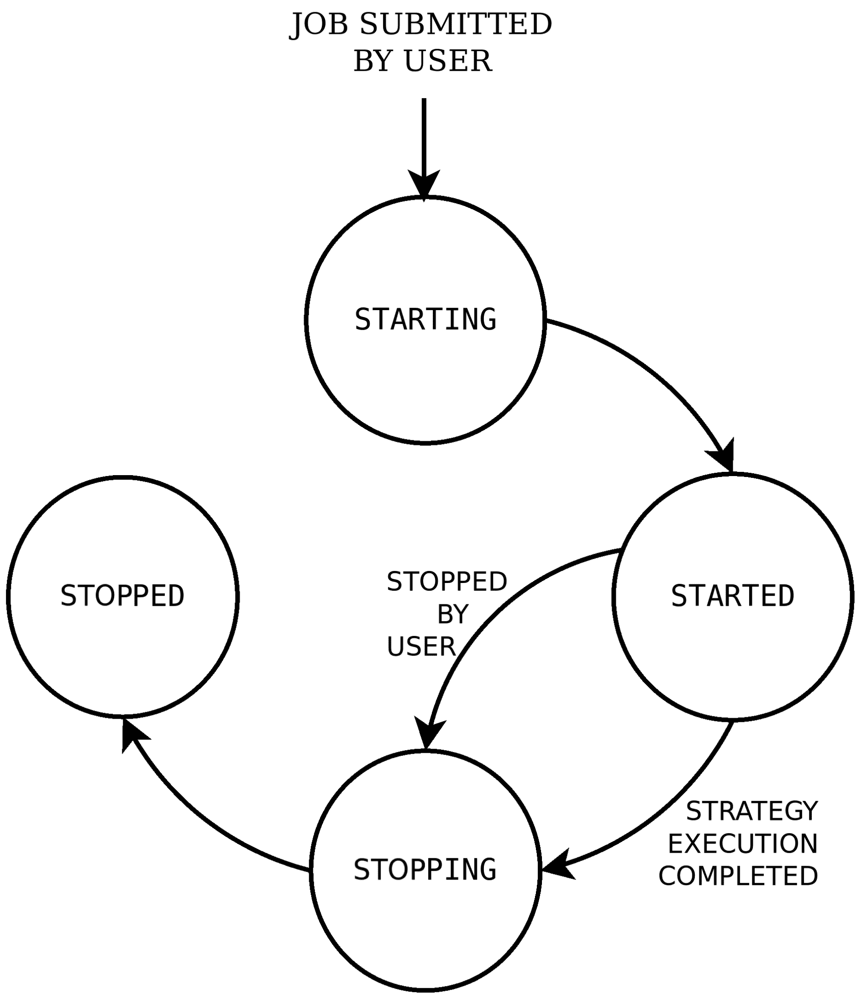
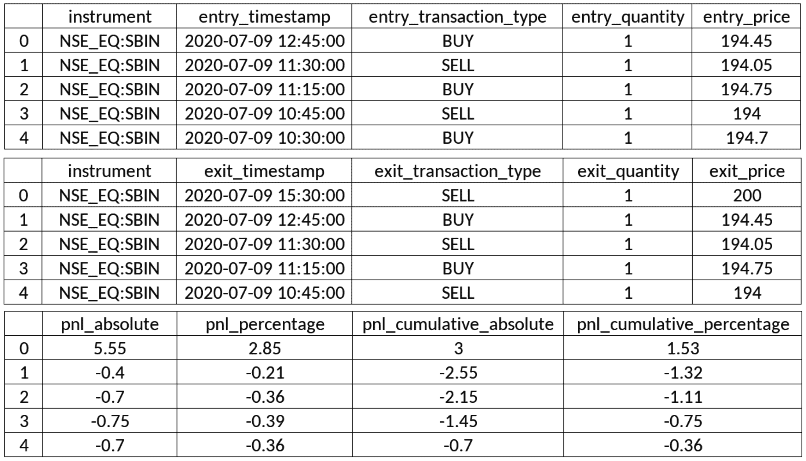
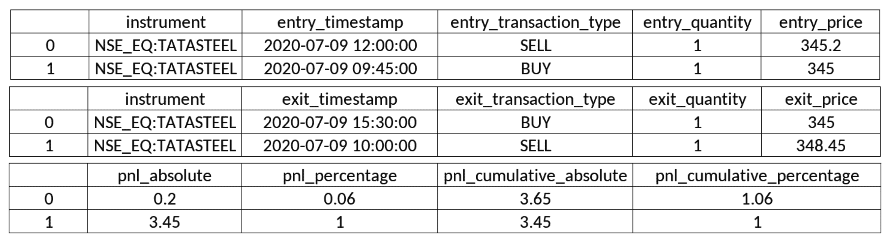
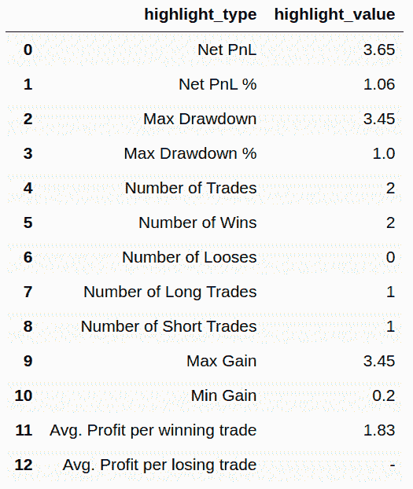

# 算法交易-真实交易

现在，我们已经建立了各种算法交易策略，并成功地对它们进行了回测，获得了令人满意的结果，并在实际市场中进行了纸上交易，现在终于到了真正交易的时候了。

真实交易是指我们用真实的钱在实时交易时段执行交易策略。如果你的策略在回溯测试和纸上交易中表现良好，你可以用真钱期待类似的结果。请注意，你的策略在真实市场中的表现可能不尽如人意，尽管你给出了很好的回溯测试和纸上交易结果。有利可图的回溯测试和纸面交易结果是有利可图的真实交易体验的先决条件，但不足以保证每个交易时段都有利可图。

对于真实交易，需要策略配置。它由多个参数组成，其中一些参数如下:

*   **开始和结束时间**:当日应进行票据交易的持续时间。
*   **金融工具**:应进行票据交易的一种或多种金融工具。
*   **蜡烛间隔**:各种可能的蜡烛间隔之一；例如，`1 minute`、`15 minutes`、`hour`或`day`。
*   **策略特定参数**:策略中定义的自定义参数值。
*   **策略模式**:日内或交割之一。日内策略冲掉日内订单，在一天结束时平仓。交割策略对交割订单进行打孔，这些订单不会在一天结束时结算，而是结转到下一个交易日。

需要一个真实的交易引擎来执行给定策略的真实交易。在这一章中，你将使用 algo bulls([https://algobulls.com](https://algobulls.com))提供的真实交易引擎，这是一个算法交易平台，通过其开发者选项提供服务。它提供了一个名为`pyalgotrading`([https://github.com/algobulls/pyalgotrading](https://github.com/algobulls/pyalgotrading))的 Python 包来提供这些服务。

你在[第八章](08.html)、*算法交易策略——分步编码*中编码了两种算法交易策略。回想一下，策略描述如下:

*   **均线-常规单策略**:基于技术指标均线和常规单的策略。([第七章](07.html)、*前六个配方在交易所下单*)
*   **MACD 套单策略**:基于技术指标 MACD 和套单的策略。([第七章](07.html)、*剩余六个配方在交易所下单*)

这些策略也可以作为 Python 包的一部分获得，`pyalgostrategypool`。您可以使用 pip 和`$ pip install pyalgostrategypool`命令来安装它。你也可以在 GitHub(【https://github.com/algobulls/pyalgostrategypool】)上查看。

当遵循[第八章](08.html)、*算法交易策略——一步一步编码*时，你将这两个策略上传到你的 AlgoBulls 账户。在这一章中，你将从你的 AlgoBulls 账户中取出这些策略，并用它们进行真实交易。真正的交易是完全自动化的，在交易过程中不需要你的参与。在实际交易中，你会收集策略执行日志和各种报告——即损益报告和统计报告。通过使用`pyalgotrading`，你确保你专注于开发和执行真正的交易策略，而不用担心策略执行所需的生态系统。

本章包括前面提到的策略的一步一步的方法，从建立到 AlgoBulls 平台的连接、获取策略、运行真实的交易任务到获取执行日志和获取各种类型的报告。

在本章中，您将学习以下食谱:

*   EMA-常规订单策略-获取策略
*   EMA-常规订单策略-真实交易策略
*   EMA——常规订单策略——实时获取真实交易日志
*   EMA-常规订单策略-获取真实交易报告-P&L 表
*   EMA-常规订单策略-获取真实交易报告-统计表

*   MACD-括号-订单策略-获取策略
*   MACD-支架-订单策略-真实交易策略
*   MACD 套单策略——实时获取真实的交易日志
*   MACD-括号-订单策略-获取真实的交易报告-P&L 表
*   MACD-括号-订单策略-获取真实交易报告-统计表

真正的交易只有在实时交易时间进行才有意义，不像回溯测试可以在任何时候进行。请确保您在现场市场时间尝试本章的食谱。

# 技术要求

要成功执行本章中的配方，您需要具备以下条件:

*   Python 3.7+版本
*   Python 包:
*   `pyalgotrading` ( `$ pip install pyalgotrading`)

确保您已经在[https://algobulls.com](https://algobulls.com)上添加并绑定了您的经纪详情。详见*附录二*。对于这一章，你可以使用 AlgoBulls 平台支持的任何代理。

本章最新的 Jupyter 笔记本可以在 GitHub 上找到，网址为[https://GitHub . com/packt publishing/Python-algorithm-Trading-Cookbook/tree/master/chapter 11](https://github.com/PacktPublishing/Python-Algorithmic-Trading-Cookbook/tree/master/Chapter11)。

# EMA–常规订单策略–获取策略

在这个菜谱中，你将从你在 AlgoBulls 平台上的账户中获取`StrategyEMARegularOrder`策略类。这个方法首先建立一个到 AlgoBulls 平台的连接，查询你的帐户中所有可用的策略，并获取所需策略类的详细信息；也就是`StrategyEMARegularOrder`。

确保你已经看完了第八章、*算法交易策略的前六个配方——一步一步地编码*，对我们将要使用的策略类有一个完整的了解；也就是`StrategyEMARegularOrder`。

## 怎么做…

我们为此配方执行以下步骤:

1.  导入必要的模块:

```
>>> from pyalgotrading.algobulls import AlgoBullsConnection
```

2.  创建新的 AlgoBulls 连接对象:

```
>>> algobulls_connection = AlgoBullsConnection()
```

3.  获取授权 URL:

```
>>> algobulls_connection.get_authorization_url()
```

我们得到以下输出:

```
Please login to this URL with your AlgoBulls credentials and get your developer access token: https://app.algobulls.com/user/login
'https://app.algobulls.com/user/login'
```

4.  使用您的 AlgoBulls 凭证登录到前面的链接，获取您的令牌，并在此处设置它(更多详细信息，请参见*附录 II* ):

```
>>> algobulls_connection.set_access_token(
                    '80b7a69b168c5b3f15d56688841a8f2da5e2ab2c')
```

5.  获取并显示到目前为止您已经创建并上传的所有策略:

```
>>> all_strategies = algobulls_connection.get_all_strategies()
>>> all_strategies
```

我们得到以下输出。你的输出可能会有所不同(确保你遵循了[第 8 章](08.html)、*算法交易策略——一步一步编码*中的食谱，以获得类似的输出):


6.  获取并显示第一个策略的策略代码:

```
>>> strategy_code1 = all_strategies.iloc[0]['strategyCode']
>>> strategy_code1
```

我们得到以下输出(您的输出可能不同):

```
'49287246f9704bbcbad76ade9e2091d9'
```

7.  在真正交易你的策略之前，你可以检查你的策略以确保你有正确的策略:

```
>>> strategy_details1 = \
         algobulls_connection.get_strategy_details(strategy_code1)
>>> print(strategy_details1)
```

我们得到了以下输出:

```
class StrategyEMARegularOrder(StrategyBase):

    def __init__(self, *args, **kwargs):
        super().__init__(*args, **kwargs)

        self.timeperiod1 = self.strategy_parameters['timeperiod1']
        self.timeperiod2 = self.strategy_parameters['timeperiod2']

        self.main_order = None

    def initialize(self):
        self.main_order = {}

    @staticmethod
    def name():
        return 'EMA Regular Order Strategy'
    ....
    def strategy_exit_position(self, candle, instrument, 
                               sideband_info):
        if sideband_info['action'] == 'EXIT':
            self.main_order[instrument].exit_position()
            self.main_order[instrument] = None
            return True

        return False
```

这里没有显示完整的输出。请访问以下链接阅读完整输出，网址为[https://github . com/algo bulls/pyalgostrategypool/blob/master/pyalgostrategypool/strategy _ EMA _ regular _ order . py](https://github.com/algobulls/pyalgostrategypool/blob/master/pyalgostrategypool/strategy_ema_regular_order.py)。

## 它是如何工作的…

您在*步骤 1* 中导入必要的模块。在*步骤 2* 中，创建了一个`AlgoBullsConnection`类的实例，命名为`algobulls_connection`。在*步骤 3* 中，您使用`algobulls_connection`对象的`get_authorization_url()`方法获得授权 URL。这将打印授权 URL。您应通过网络浏览器访问此 URL，登录 AlgoBulls 平台并获取您的开发者访问令牌。(你可以在*附录二*中找到更多关于从 AlgoBulls 平台获取开发者访问令牌的细节和截图。)您复制访问令牌，并使用`algobulls_connection`的`set_access_token()`方法在*步骤 4* 中设置它。如果令牌被接受，则与 AlgoBulls 平台成功建立连接。

在*步骤 5* 中，你获取到目前为止你在 AlgoBulls 平台上创建并上传的所有策略。您对这一步使用了`get_all_strategies()`方法，并将其赋给一个新变量`all_strategies`。这个变量是一个带有`strategyCode`和`strategyName`列的`pandas.DataFrame`对象。此表包含您之前上传的策略代码和策略名称的信息。如果你按照*EMA——常规下单策略——在 AlgoBulls 交易平台上上传策略[第八章](08.html)、*算法交易策略——一步一步编码*的*食谱，你会发现一个叫做 **EMA 常规下单策略**的策略。在*步骤 6* 中，您将策略的策略代码 **EMA 常规订单策略**分配给一个新变量`strategy_code1`。该步骤的输出中显示了策略代码。该策略代码对于 AlgoBulls 平台上的每个策略都是唯一的。

最后，在*步骤 7* 中，你要确保`strategy_code1`引用的策略确实是你之前上传的策略(在*EMA-常规订单策略-上传策略到 AlgoBulls 交易平台*配方中[第 8 章](08.html)，*算法交易策略-逐步编码*)。您使用`algobulls_connection`对象的`get_strategy_details()`方法来检查策略。该方法将策略代码作为参数。你在这里过`strategy_code1`。该方法以字符串形式返回整个类代码。你将它赋给一个新变量`strategy_details1`，并显示它。

如果您想更改`strategy_code1`所指的类别代码，如*第 7 步*所示，请参考*EMA-常规订单策略-在 AlgoBulls 交易平台上传策略*章节的*更多…* 部分[第 8 章](08.html)、*算法交易策略-逐步编码*。

# EMA–常规订单策略–真实交易策略

在这个菜谱中，你将在**均线常规订单策略**上进行真实交易。在本章的前一个食谱中，你必须从 AlgoBulls 平台的账户中获取这个策略。您将利用`pyalgotrading`为这个菜谱提供的真实交易功能，该功能反过来会在 AlgoBulls 平台上提交一个真实的交易任务。

一旦提交，真实交易将由 AlgoBulls 真实交易引擎运行。您可以随时查询其状态，以了解真实交易作业的状态。作业按给定顺序经历以下状态:

*   `STARTING`(中间状态)
*   `STARTED`(稳定状态)
*   `STOPPING`(中间状态)
*   `STOPPED`(稳定状态)

提交作业时，它从中间状态`STARTING`开始。在这种状态下，AlgoBulls 实时交易引擎获取策略并准备好执行环境，这可能需要几分钟时间。一旦完成，作业就进入`STARTED`状态。真正的交易策略就是在这个阶段实施的。在这里，只要真正的交易完成，它就会一直存在。一旦完成，作业就转移到一个中间状态，即`STOPPING`。在这种状态下，AlgoBulls real trading 引擎会清理已分配给该作业的资源，通常不到一分钟。最后，作业移动到`STOPPED`状态。

如果您已经提交了策略真实交易作业，则在第一个作业完成之前，您不能提交同一策略的另一个作业。这意味着您必须等待第一个作业进入`STOPPED`状态。如果第一个作业是长时间运行的，并且您想立即停止它，您可以通过`pyalgotrading`提交停止作业请求。在提交请求之前，您需要确保作业处于`STARTED`状态。

以下状态机图展示了 AlgoBulls 平台上一个真实交易作业在其生命周期中的各种状态和转换:



在提交一个真实的交易任务后，您可以实时获取策略执行的日志和报告。日志和报告有助于验证策略的性能并调试任何潜在的问题。

确保你已经看完了 [第八章](08.html)、*算法交易策略的前六个配方——一步一步编码*，对我们将要使用的策略类有一个完整的了解；也就是`StrategyEMARegularORder`。

## 做好准备

确保`algobulls_connection`和`strategy_code1`对象在 Python 名称空间中可用。参考前面的配方设置`algobulls_connection`和`strategy_code1`对象。

## 怎么做…

我们为此配方执行以下步骤:

1.  导入必要的模块:

```
>>> from datetime import time
>>> from pyalgotrading.constants import *
```

2.  使用交易符号作为关键字搜索工具。将返回的对象分配给`instruments`:

```
>>> instruments = algobulls_connection.search_instrument('SBIN')
>>> instruments
```

我们得到了以下输出(您的输出可能有所不同):

```
[{'id': 7, 'value': 'NSE:SBIN'}]
```

3.  从`instruments`获取选择仪器的`value`:

```
>>> instrument = instruments[0]['value']
>>> instrument
```

我们得到了以下输出:

```
'NSE:SBIN'
```

4.  为`strategy_code1`提交真实交易作业:

```
>>> algobulls_connection.realtrade(
        strategy_code=strategy_code1, 
        start_time=time(hour=9, minute=15), 
        end_time=time(hour=15, minute=30),
        instrument=instrument, 
        lots=1,
        strategy_parameters={
            'timeperiod1': 5,
            'timeperiod2': 12
        }, 
        candle_interval=CandleInterval.MINUTES_15)
```

我们得到了以下输出:

```
Setting Strategy Config... Success.
Submitting REALTRADING job... Success.
```

5.  检查提交的真实交易作业的状态:

```
>>> algobulls_connection.get_realtrading_job_status(strategy_code1)
```

我们得到了以下输出:

```
{'data': 'STARTING'}
```

6.  一段时间后，再次检查已提交作业的状态:

```
>>> algobulls_connection.get_realtrading_job_status(strategy_code1)
```

我们得到了以下输出:

```
{'data': 'STARTED'}
```

## 它是如何工作的…

在*步骤 1* 中，从`datetime`模块导入`time`类，从`pyalgotrading.constants`模块导入所有常量。在*步骤 2* 中，您使用`algobulls_connection`对象的`search_instrument()`方法，获取您想要实际交易策略的工具**EMA-常规订单策略**。`search_instrument()`方法接受一个搜索字符串作为参数，它应该是您感兴趣的工具的部分或完整的交易符号。你在这里通过`'SBIN'`。此函数返回一个列表，其中包含与搜索字符串匹配的乐器的详细信息。可能有多种工具的交易符号中包含搜索字符串。在*步骤 3* 中，您获取第一个匹配仪器的值，并将其赋给一个新变量`instrument`。

在*步骤 4* 中，您使用`algobulls_connection()`对象的`realtrade()`方法提交一个真实的交易任务。它采用以下参数:

*   `strategy_code`:需要进行真实交易的策略的策略代码。这应该是一个字符串。你在这里过`strategy_code1`。
*   今天应该开始真正交易的时间。这应该是一个`datetime.time`对象。在这里，您传递一个保存 9:15 小时的值的对象—`time(hour=9, minute=15)`。关于创建一个`time`对象的详细信息，请参考本书的第一个配方。
*   `end_time`:今天应该进行真实交易的时间。该对象应该保存一个比`start_time`保存的值早的时间值。这应该是一个`datetime.time`的实例。在这里，您传递一个值为 15:30 hours-`time(hour=15, minute=30)`的对象。

*   `instrument`:应该进行真实交易的金融工具。将获取该仪器的历史数据。这应该是一个字符串。你在这里过`instrument`。
*   `lots`:应进行真实交易的手数。这应该是一个整数。数量由策略计算为金融工具的*手数* × *手数*。你在这里过`1`。
*   `strategy_parameters`:策略期望的参数名称和值。这应该是一个字典，用`parameter-name`和`parameter-value`作为键值对。您在这里传递以下参数:
*   `timeperiod1: 5`
*   `timeperiod2: 12`

(回想一下，EMA-常规订单策略的参数已经在它的`__init__()`方法中定义了，如第八章[、*算法交易策略-逐步编码*的第一个配方所示)。](08.html)

*   `candle_interval`:真实交易提取历史数据的蜡烛线间隔。这应该是一个`CandleInterval`类型的枚举。你在这里通过`CandleInterval.MINUTES_15`。(`CandleInterval`枚举为蜡烛间隔提供了各种枚举，其中一些是`MINUTE_1`、`MINUTES_3`、`MINUTES_5`、`MINUTES_10`、`MINUTES_15`、`MINUTES_30`、`HOUR`和`DAY`。)

如果作业提交成功，您将看到由`realtrade()`功能打印的`Success`消息。

提交作业后，需要一段时间才能开始。开始后，可能需要一些时间来完成，这取决于实际交易的持续时间，如使用`start_time`和`end_time`参数所指定的。通常，真正的交易会在整个交易日运行，这意味着作业将运行 6-8 个小时。

在*步骤 5* 中，您使用`algobulls_connection`对象的`get_realtrading_job_status()`方法获取作业的状态。你通过`strategy_code1`作为这里的论据。这个方法返回一个具有单个键值对的字典——数据*和作业*状态。如果您在放置工单后立即查询状态，您将得到`'STARTING'`作为状态。在*步骤 6* 中，您在一段时间后再次查询状态，如果作业开始，您将获得状态`'STARTED'`。**

成功的提交意味着实际交易策略所需的最小输入已经以要求的格式通过。但是，这并不能确保策略运行时不会出错。在实际交易中，策略的执行仍可能出错。为了调试执行问题，您需要获取输出日志，这将在下一个菜谱中解释。错误的可能原因可能是策略类的 Python 代码中的错误，或者是不完整的`strategy_parameters`字典被传递给了`realtrade()`函数。

## 还有更多…

如果一个任务运行了很长时间，你想在它完成之前停止它，你可以使用`algobulls_connection`对象的`stop_realtrading_job()`方法。该方法接受策略代码作为参数。你在这里通过`strategy_code1`。该方法向 AlgoBulls 真实交易引擎提交停止请求。如果请求被接受，您将在这里看到一条`Success`消息:

```
>>> algobulls_connection.stop_realtrading_job(strategy_code1)
 Stopping REALTRADING job... Success.
```

如果您在提交停止请求后查询状态，您将得到`'STOPPING'`作为状态:

```
>>> algobulls_connection.get_realtrading_job_status(strategy_code1)
{'data': 'STOPPING'}
```

如果您在一段时间后再次查询状态，并且如果作业已经停止，您将得到`'STOPPED'`作为状态:

```
>>> algobulls_connection.get_realtrading_job_status(strategy_code1)
{'data': 'STOPPED'} 
```

# EMA–常规订单策略–实时获取真实交易日志

在 AlgoBulls 平台上提交真实交易任务后，AlgoBulls 真实交易引擎开始执行策略。在执行过程中，AlgoBulls real trading engine 以文本日志的形式记录了发生的每一个事件和做出的每一个决定。

记录活动的例子包括给定的策略配置、每隔一段时间产生的新蜡烛线、你的策略进行的交易、这些交易产生的头寸的进出、等待新蜡烛线等等。在验证策略和调试开发策略时经常遇到的行为或性能问题时，这些日志是必不可少的。

在这个食谱中，你将为你的策略获取真实的交易日志。一旦您提交的真实交易作业达到`'STARTED'`状态，日志就开始出现(参考前面的方法，了解真实交易作业状态的更多信息)。AlgoBulls 平台允许您实时获取日志，即使实际的交易工作仍在进行。你可以洞察策略的执行，而不必等待真正的交易工作完成。这很有帮助，因为真正的交易工作通常是长时间运行的。`pyalgotrading`包提供了一个简单的方法，我们可以用它来获取给定策略的执行日志。

确保你已经看完了第八章、*算法交易策略的前六个配方——一步一步地编码*，对我们将要使用的策略类有一个完整的了解；也就是`StrategyEMARegularOrder`。

## 做好准备

确保`algobulls_connection`和`strategy_code1`对象在 Python 名称空间中可用。参考本章第一个配方来设置`algobulls_connection`和`strategy_code1`对象。

## 怎么做…

执行以下步骤来完成此配方:

1.  获取`strategy_code1`的真实交易执行日志:

```
>>> logs = algobulls_connection.get_realtrading_logs(
                                                strategy_code1)
>>> print(logs)
```

我们得到了以下输出(您的输出可能有所不同):

```
[2020-07-09 09:12:25] Logs not available yet. Please retry in sometime.
```

2.  过一段时间后再次获取`strategy_code1`的真实交易执行日志；

```
>>> logs = algobulls_connection.get_realtrading_logs(
                                                strategy_code1)
>>> print(logs)
```

我们得到了以下输出(您的输出可能有所不同):

```
…
########################################
 INITIALIZING ALGOBULLS CORE (v3.2.0)... 
########################################
[2020-07-09 09:13:05] Welcome PUSHPAK MAHAVIR DAGADE!
[2020-07-09 09:13:05] Reading strategy...
[2020-07-09 09:13:05] STARTING ALGOBULLS CORE...
...
[2020-07-09 10:30:00] [CRITICAL] [order] [PLACING NEW ORDER] [2020-07-09 10:30:00] [2b079bc873f64f53a33f91b6ceec707b] [BUY] [NSE:SBIN] [QTY:1] [QTY PENDING: 1] [ENTRY PRICE: 194.7] [PRICE:None] [TRIGGER PRICE:None] [ORDER_TYPE_REGULAR] [ORDER_CODE_INTRADAY] [ORDER_VARIETY_MARKET] [ORDER_POSITION_ENTER]
...
[2020-07-09 15:30:00] [INFO] [clock] Candle generation has been stopped...
[2020-07-09 15:30:00] [INFO] [tls] Received event END OF MARKET. Stopping Trading Core Engine...
[2020-07-09 15:30:00] [INFO] [tls] Exiting all open positions with order code: ORDER_CODE_INTRADAY (if any)...
[2020-07-09 15:30:00] [CRITICAL] [tls] [User: PUSHPAK MAHAVIR DAGADE] Trading session completed
...
```

这里没有显示完整的输出。请访问以下链接阅读完整输出:[https://github . com/algo bulls/pyalgostrategypool/blob/master/pyalgostrategypool/sample/real trading/strategy _ EMA _ regular _ order/logs . txt](https://github.com/algobulls/pyalgostrategypool/blob/master/pyalgostrategypool/sample/realtrading/strategy_ema_regular_order/logs.txt)。

## 它是如何工作的…

在*步骤 1* 中，使用`algobulls_connection`对象的`get_realtrading_logs()`方法实时获取策略真实交易日志。该方法接受策略代码作为参数。你在这里通过`strategy_code1`。返回的数据是一个字符串。如果您在提交作业后立即尝试这个步骤，您会得到一个字符串，表示日志还没有准备好(`[2020-07-09 09:12:25] Logs not available yet. Please retry in sometime.`)。如果真正的交易工作在`'STARTING'`州，就会发生这种情况。

在*步骤 2* 中，你在一段时间后再次获取日志。如果作业脱离了`'STARTING'`状态，您将开始获取策略执行日志。每次调用`get_realtrading_logs()`函数，都会得到所有真实的交易日志。

## 还有更多...

一旦真实的交易作业进入`'STOPPED'`状态，就不会生成新的日志。您可以在提交同一策略的下一个实际交易任务之前的任何时候获取完整的日志。如果一个新的真实交易任务被提交(对于相同的策略)，这些日志将不再可以通过`get_realtrading_logs()`方法访问。如果您想在以后引用它们，可以将获取的日志保存到一个文件中。

# EMA–常规–订单策略–获取真实交易报告–损益表

在 AlgoBulls 平台上提交真实交易任务后，AlgoBulls 真实交易引擎开始执行策略。在执行过程中，除了日志，AlgoBulls 实时交易引擎还会实时生成 P&L 表。这个表保存了策略中每笔交易的信息。它还包含了挂单和止损单、交易 P&L 和累计 P&L 之间映射的详细信息，按时间顺序排列，最新的订单排在最前面。这张表让我们借助单个和累计的 P&L 数，深入了解该策略的整体表现。进出顺序映射也有助于验证策略的行为。

在这个菜谱中，您将为您的策略获取 P&L 表报告。在您提交真实的交易工作后，您的策略在第一笔交易中打卡后，该报告即可使用。AlgoBulls 平台允许您实时获取 P&L 表，即使实际交易仍在进行。你可以洞察策略的表现，而不必等待真正的交易工作完成。这很有帮助，因为真正的交易工作通常是长时间运行的。`pyalgotrading`包提供了一个简单的方法，我们可以用它来获取给定策略的 P & L 表。

确保你已经看完了 [第八章](08.html)、*算法交易策略的前六个配方——一步一步编码*，对我们将要使用的策略类有一个完整的了解；也就是`StrategyEMARegularOrder`。

## 做好准备

确保`algobulls_connection`和`strategy_code1`对象在 Python 名称空间中可用。参考本章第一个配方来设置`algobulls_connection`和`strategy_code1`对象。

## 怎么做…

获取`strategy_code1`的真实交易 P&L 报告:

```
>>> algobulls_connection.get_realtrading_report_pnl_table(strategy_code1)
```

我们得到以下输出。您的输出可能会有所不同(注意，为了便于表示，下面的输出被分成了多个表。您将在 Jupyter 笔记本中看到一张宽大的桌子):



## 它是如何工作的…

在这个方法中，您使用`algobulls_connection`对象的`get_realtrading_report_pnl_table()`方法来实时获取真实的交易 P & L 表。该方法接受策略代码作为参数。你在这里通过`strategy_code1`。返回的数据是一个多列的`pandas.DataFrame`对象，描述如下:

*   `instrument`:进入交易的金融工具。
*   `entry_timestamp`:挂单的时间戳。(注意，在进入`'COMPLETE'`状态之前，它可能会保持在`'OPEN'`状态一段时间。)
*   `entry_transaction_type`:挂单交易类型`BUY`或`SELL`。
*   `entry_quantity`:挂单数量。
*   `entry_price`:挂单执行并进入`'COMPLETE'`状态的价格。

*   `exit_timestamp`:止损单发出的时间。(注意，在进入`'COMPLETE'`状态之前，它可能会保持在`'OPEN'`状态一段时间。)
*   `exit_transaction_type`:挂单交易类型`BUY`或`SELL`。
*   `exit_quantity`:退出订单数量。
*   `exit_price`:挂单执行并进入`'COMPLETE'`状态的价格。

*   `pnl_absolute`:挂单执行价格和挂单执行价格之间的差额。数学上，这是(*出场价格* - *进场价格* )* *出场数量*做多交易的(*进场价格* - *出场价格* )* *出场数量*。正值意味着交易是盈利交易。负值意味着交易是亏本交易。
*   `pnl_percentage`:相对于进场价格的盈亏百分比。数学上，这就是*pnl _ absolute*/*entry _ price*/*exit _ quantity*x*100*。
*   `pnl_cumulative_absolute`:累计损益。从数学上讲，这是以前交易的所有`pnl_absolute`值的总和。这个数字让我们可以直接了解策略的性能与模拟时间的关系。
*   `pnl_cumulative_percentage`:累计损益相对于进场价格的百分比。数学上这就是*pnl _ 累计* / *进场 _ 价格/出场 _ 数量* × *100* 。

## 还有更多...

一旦真实的交易作业进入`'STOPPED'`状态，P & L 表报告将不再更新。你可以在提交同一策略的下一个真实交易任务之前的任何时候获取完整的损益报告。如果一个新的真实交易任务被提交(对于相同的策略)，这个报告将不再可以通过`get_realtrading_report_pnl_table()`方法访问。如果您想在以后引用它，您可以将获取的报告保存到一个`.csv`文件中。

# EMA–常规–订单策略–获取真实交易报告–统计表

在 AlgoBulls 平台上提交真实交易任务后，AlgoBulls 真实交易引擎开始执行策略。在执行过程中，除了日志和 P&L 表，AlgoBulls 实时交易引擎还从 P&L 表中实时生成摘要。这份摘要是一个统计表，包含各种统计数字，如`Net P&L`(绝对值和百分比)`Max Drawdown`(绝对值和百分比)，总交易数，盈利交易数，亏损交易数，多头交易数和空头交易数，最大收益和最小收益(或最大亏损)，以及每笔盈利和亏损交易的平均利润。此表简要概述了该策略的总体绩效。

在这个菜谱中，您将为您的策略获取统计表报告。在您提交真实的交易工作后，您的策略在第一笔交易中打卡后，该报告即可使用。AlgoBulls 平台允许您实时获取统计表，即使实际交易工作仍在进行。你可以洞察策略的表现，而不必等待真正的交易工作完成。这很有帮助，因为真正的交易工作通常是长时间运行的。`pyalgotrading`包提供了一个简单的方法，我们可以用它来获取给定策略的统计表。

确保你已经看完了 [第八章](08.html)、*算法交易策略的前六个配方——一步一步编码*，对我们将要使用的策略类有一个完整的了解；也就是`StrategyEMARegularOrder`。

## 做好准备

确保`algobulls_connection`和`strategy_code1`对象在 Python 名称空间中可用。参考本章第一个配方来设置`algobulls_connection`和`strategy_code1`对象。

## 怎么做…

获取`strategy_code1`的真实交易统计报告:

```
>>> algobulls_connection.get_realtrading_report_statistics(strategy_code1)
```

我们得到了以下输出(您的输出可能有所不同):


## 它是如何工作的…

在这个方法中，您使用`algobulls_connection`对象的`get_realtrading_report_statistics()`方法来实时获取真实的交易统计表。该方法接受策略代码作为参数。你在这里通过`strategy_code1`。返回的数据是一个有两列—`highlight_type`和`highlight_value`—多行的`pandas.DataFrame`对象。这些行描述如下:

*   `Net PnL`:累计真实交易 P & L，这也是 P & L 表中第一个条目的`pnl_cumulative_absolute`值。
*   `Net PnL %`:累计真实交易 P & L 百分比。这也是 P & L 表中第一个条目的`pnl_cumulative_percentage`值。
*   `Max Drawdown`:P&L 表`pnl_cumulative`栏中的最小值。这表示您的策略在执行过程中遇到的最大损失。

*   `Max Drawdown %`:数学上这是*(最大提现)* / *(对应进场 _ 价格)/出场 _ 数量* × *100* 。
*   `Number of Trades`:盘中总交易(进场和出场算一个)。
*   `Number of Wins`:交易 P & L 为非负的交易计数。
*   `Number of Losses`:交易 P & L 为负的交易计数。
*   `Number of Long Trades`:进场交易类型为`'BUY'`的交易笔数。
*   `Number of Short Trades`:进场交易类型为`'SELL'`的交易笔数。
*   `Max Gain`:所有交易中 P & L 值最大的交易的 P & L。
*   `Min Gain`:所有交易中 P & L 值最小的交易的 P & L。
*   `Avg. Profit per winning trade`:数学上这是*(成功交易的总 P&L)*/*(成功交易的计数)*。
*   `Avg. Profit per losing trade`:数学上这是*(亏损交易的总 P&L)*/*(亏损交易数)*。

## 还有更多...

如果在实际交易作业仍在运行时获取统计表，上述数字将是基于到那时为止完成的交易的中间数字。随着更多的交易被录入，数字可能会改变，直到真正的交易工作完成。

一旦真实的交易工作移动到`'STOPPED'`状态，统计表将不再改变。您可以在提交同一策略的下一个真实交易作业之前的任何时候获取完整的统计表。如果一个新的真实交易任务被提交(对于相同的策略)，这个表将不再可以通过`get_realtrading_report_statistics()`方法访问。如果您想在以后引用它，您可以将提取的报告表保存到一个`.csv`文件中。

# MACD–括号–订单策略–获取策略

在这个菜谱中，您将从您在 AlgoBulls 平台上的帐户中获取`StrategyMACDBracketOrder`策略类，您必须在浏览[第 8 章](08.html)、*算法交易策略-逐步编码*中的最后一个菜谱时上传该策略类。这个方法首先建立一个到 AlgoBulls 平台的连接，查询你的帐户中所有可用的策略，并获取所需策略类的详细信息；也就是`StrategyMACDBracketOrder`。

确保你已经看完了 [第八章](08.html)、*算法交易策略的最后六个菜谱——逐步编码*，对我们将要使用的策略类有一个完整的了解；也就是`StrategyMACDBracketOrder`。

## 怎么做…

执行以下步骤来完成此配方:

1.  导入必要的模块:

```
>>> from pyalgotrading.algobulls import AlgoBullsConnection
```

2.  创建新的 AlgoBulls 连接对象:

```
>>> algobulls_connection = AlgoBullsConnection()
```

3.  获取授权 URL:

```
>>> algobulls_connection.get_authorization_url()
```

我们得到了以下输出:

```
Please login to this URL with your AlgoBulls credentials and get your developer access token: https://app.algobulls.com/user/login
'https://app.algobulls.com/user/login'
```

4.  使用您的 AlgoBulls 凭证登录到前面的链接，获取您的令牌，并在此处设置它(更多详细信息，请参见*附录 II* ):

```
>>> algobulls_connection.set_access_token('
                        80b7a69b168c5b3f15d56688841a8f2da5e2ab2c')
```

5.  获取并显示到目前为止您已经创建并上传的所有策略:

```
>>> all_strategies = algobulls_connection.get_all_strategies()
>>> all_strategies
```

我们得到了以下输出。你的输出可能会有所不同(确保你遵循了第八章、*算法交易策略——一步一步编码*中的食谱，以获得相似的输出):


6.  获取并显示第二策略的策略代码；也就是说，MACD 括号顺序策略:

```
>>> strategy_code2 = all_strategies.iloc[1]['strategyCode']
>>> strategy_code2
```

我们得到了以下输出(您的输出可能有所不同):

```
'49287246f9704bbcbad76ade9e2091d9'
```

7.  在真正交易你的策略之前，你可以检查你的策略以确保你有正确的策略:

```
>>> strategy_details2 = \
        algobulls_connection.get_strategy_details(strategy_code2)
>>> print(strategy_details2)
```

我们得到了以下输出:

```
class StrategyMACDBracketOrder(StrategyBase):

    def __init__(self, *args, **kwargs):
        super().__init__(*args, **kwargs)

        self.fastMA_period = \
            self.strategy_parameters['fastma_period']
        self.slowMA_period = \
            self.strategy_parameters['slowma_period']
        self.signal_period = \
            self.strategy_parameters['signal_period']
        self.stoploss = \
            self.strategy_parameters['stoploss_trigger']
        self.target = self.strategy_parameters['target_trigger']
        self.trailing_stoploss = \
            self.strategy_parameters['trailing_stoploss_trigger']

        self.main_order = None

    def initialize(self):
        self.main_order = {}

    @staticmethod
    def name():
        return 'MACD Bracket Order Strategy'
    ....
    def strategy_exit_position(self, candle, instrument, \
                               sideband_info):
        if sideband_info['action'] == 'EXIT':
            self.main_order[instrument].exit_position()
            self.main_order[instrument] = None
            return True

        return False
```

这里没有显示完整的输出。请访问以下链接阅读完整输出:[https://github . com/algo bulls/pyalgostrategypool/blob/master/pyalgostrategypool/strategy _ MACD _ bracket _ order . py](https://github.com/algobulls/pyalgostrategypool/blob/master/pyalgostrategypool/strategy_macd_bracket_order.py)。

## 它是如何工作的…

您在*步骤 1* 中导入必要的模块。在*步骤 2* 中，您创建了一个`AlgoBullsConnection`类的实例，名为`algobulls_connection`。在*步骤 3* 中，您使用`algobulls_connection`对象的`get_authorization_url()`方法获得授权 URL。这将打印授权 URL。您应通过网络浏览器访问此 URL，登录 AlgoBulls 平台并获取您的开发者访问令牌。(你可以在*附录二*中找到更多关于从 AlgoBulls 平台获取开发者访问令牌的细节和截图。)您复制访问令牌，并使用`algobulls_connection`的`set_access_token()`方法在*步骤 4* 中设置它。如果令牌被接受，则与 AlgoBulls 平台成功建立连接。

在*步骤 5* 中，你获取到目前为止你在 AlgoBulls 平台上创建并上传的所有策略。您对这一步使用了`get_all_strategies()`方法，并将其赋给一个新变量`all_strategies`。这个变量是一个带有`strategyCode`和`strategyName`列的`pandas.DataFrame`对象。此表包含您之前上传的策略代码和策略名称的信息。

如果你遵循 *MACD 套单策略——在 AlgoBulls 交易平台上传该策略[第八章](08.html)、*算法交易策略——一步一步编码*，你会发现一个策略叫做**MACD——常规订单策略**。在*步骤 6* 中，您将 MACD 常规订单策略的策略代码分配给一个名为`strategy_code2`的新变量。该步骤的输出中显示了策略代码。该策略代码对于 AlgoBulls 平台上的每个策略都是唯一的。*

最后，在*第 7 步*中，你要确保`strategy_code2`引用的策略确实是你之前上传的策略(在[第 8 章](08.html)、*算法交易策略——一步一步编码*)。您使用`algobulls_connection`对象的`get_strategy_details()`方法来检查策略。该方法将策略代码作为参数。你在这里过`strategy_code2`。该方法以字符串形式返回整个类代码。你将它赋给一个新变量`strategy_details2`，并显示它。

如果您想更改`strategy_code2`所指的类别代码，如*第 7 步*所示，请参考[第 8 章](08.html)、*算法交易策略-逐步编码*中最后一个配方的*还有……*部分。

# MACD–括号–订单策略–真实交易策略

在这个菜谱中，你将根据 MACD 套期保值订单策略进行真实交易。在本章的前一个食谱中，你必须从 AlgoBulls 平台的账户中获取这个策略。您将利用`pyalgotrading`为这个菜谱提供的真实交易功能，该功能反过来会在 AlgoBulls 平台上提交一个真实的交易任务。

一旦提交，真实交易将由 AlgoBulls 真实交易引擎运行。可以随时查询状态，了解真实交易作业的状态。作业按给定顺序经历以下状态:

*   `STARTING`(中间状态)
*   `STARTED`(稳定状态)
*   `STOPPING`(中间状态)
*   `STOPPED`(稳定状态)

提交作业时，它从中间状态`'STARTING'`开始。在这种状态下，AlgoBulls 实时交易引擎获取策略并准备好执行环境，这可能需要几分钟时间。一旦完成，作业就进入`'STARTED'`状态。策略真实交易发生在这个阶段。在这里，只要真正的交易完成，它就会一直存在。一旦完成，作业就转移到一个中间状态，即`'STOPPING'`。在这种状态下，AlgoBulls real trading 引擎会清理为此作业分配的资源，通常不到一分钟。最后，作业移动到`'STOPPED'`状态。

如果您已经提交了策略的真实交易作业，则在第一个作业完成之前，您不能提交同一策略的另一个作业。这意味着您必须等待第一个作业进入`'STOPPED'`状态。如果第一个作业是长时间运行的，并且您想立即停止它，您可以通过`pyalgotrading`提交停止作业请求。在提交请求之前，您需要确保作业处于`'STARTED'`状态。

在提交一个真实的交易任务后，您可以实时获取策略执行的日志和报告。这些日志和报告有助于验证策略的性能并调试任何潜在的问题。

你可以参考这一章的第二个配方来得到一个真实交易工作的状态机图。它在 AlgoBulls 平台上演示了真实交易工作在其生命周期中的各种状态和转换。

确保你已经阅读了 [第八章](08.html)、*算法交易策略的最后六个配方——一步一步地编码*，对我们将要使用的策略类有一个完整的了解；也就是`StrategyMACDBracketOrder`。

## 做好准备

确保`algobulls_connection`和`strategy_code2`对象在 Python 名称空间中可用。参考本章前面的制作方法来设置`algobulls_connection`和`strategy_code2`对象。

## 怎么做…

执行以下步骤来完成此配方:

1.  导入必要的模块:

```
>>> from datetime import time
>>> from pyalgotrading.constants import *
```

2.  搜索工具并使用其交易符号作为关键字。将返回的对象分配给`instruments`:

```
>>> instrument = algobulls_connection.search_instrument('
                                                    TATASTEEL')
>>> instrument
```

我们得到了以下输出(您的输出可能有所不同):

```
[{'id': 1, 'value': 'NSE:TATASTEEL'}]
```

3.  从`instruments`获取选择仪器的`value`:

```
>>> instrument = instrument[0]['value']
>>> instrument
```

我们得到了以下输出:

```
'NSE:TATASTEEL'
```

4.  为`strategy_code2`提交真实交易作业:

```
>>> algobulls_connection.realtrade(
        strategy_code=strategy_code2,     
        start_time=time(hour=9, minute=15),
        end_time=time(hour=15, minute=30),
        instrument=instrument,
        lots=1,
        strategy_parameters={
            'fastma_period': 26, 
            'slowma_period': 6, 
            'signal_period': 9,
            'target_trigger': 0.01, 
            'stoploss_trigger': 0.01, 
            'trailing_stoploss_trigger': 1
        },
        candle_interval=CandleInterval.MINUTES_15)
```

我们得到了以下输出:

```
Setting Strategy Config... Success.
Submitting REALTRADING job... Success.
```

5.  检查提交的真实交易作业的状态:

```
>>> algobulls_connection.get_realtrading_job_status(strategy_code2)
{'data': 'STARTING'} 
```

6.  一段时间后，再次检查提交的真实交易作业的状态:

```
>>> algobulls_connection.get_realtrading_job_status(strategy_code2)
{'data': 'STARTED'}
```

## 它是如何工作的…

在*步骤 1* 中，从`datetime`模块导入`time`类，从`pyalgotrading.constants`模块导入所有常量。在*步骤 2* 中，使用`algobulls_connection`对象的`search_instrument()`方法，获取您想要实际交易策略的工具，即 **MACD 括号顺序策略**。`search_instrument()`方法接受一个搜索字符串作为参数，它应该是您感兴趣的工具的部分或完整的交易符号。你在这里通过`'TATASTEEL'`。该函数返回与搜索字符串匹配的乐器的详细信息列表。可能有多种工具在其交易符号中包含搜索字符串。在*步骤 3* 中，您获取第一个匹配仪器的值，并将其赋给一个新变量`instrument`。

在*步骤 4* 中，您使用`algobulls_connection()`对象的`realtrade()`方法提交一个真实的交易任务。它采用以下参数:

*   `strategy_code`:需要进行真实交易的策略的策略代码。这应该是一个字符串。你在这里过`strategy_code2`。
*   今天应该开始真正交易的时间。这应该是一个`datetime.time`对象。在这里，您传递一个值为 9:15 小时的对象—`time(hour=9, minute=15)`。关于创建一个`datetime`对象的详细信息，请参考本书的第一个配方。
*   `end_time`:今天应该进行真实交易的时间。该对象应该保存一个比`start_time`保存的值早的时间值。这应该是一个`datetime.time`的实例。在这里，您传递一个值为 15:30 hours-`time(hour=15, minute=30)`的对象。
*   `instrument`:应进行真实交易的金融工具。将获取该仪器的历史数据。这应该是一个字符串。你在这里过`instrument`。
*   `lots`:应进行真实交易的手数。这应该是一个整数。数量由策略计算为金融工具的*手数* × *手数*。你在这里过`1`。

*   `strategy_parameters`:策略期望的参数名称和值。这应该是一个字典，用`parameter-name`和`parameter-value`作为键值对。您在这里传递以下参数:
*   `fastma_period: 26`
*   `slowma_period: 6`
*   `signal_period: 9`
*   `target_trigger: 0.01`
*   `stoploss_trigger: 0.01`
*   `trailing_stoploss_trigger: 1`

(回想一下，MACD 套单策略的参数已经在其`__init__()`方法中定义，如第八章[、*算法交易策略-逐步编码*的第一个配方所示)。](08.html)

*   `candle_interval`:真实交易取历史数据的蜡烛间隔。这应该是一个`CandleInterval`类型的枚举。你在这里通过`CandleInterval.MINUTES_15`。(`CandleInterval`枚举为蜡烛间隔提供了各种枚举，其中一些是`MINUTE_1`、`MINUTES_3`、`MINUTES_5`、`MINUTES_10`、`MINUTES_15`、`MINUTES_30`、`HOUR`和`DAY`。)

如果作业提交成功，您将看到由`realtrade()`功能打印的`Success`消息。

提交作业后，需要一段时间才能开始。开始后，可能需要一些时间来完成，这取决于使用`start_time`和`end_time`参数指定的实际交易的持续时间。通常，真正的交易会在整个交易日运行，这意味着作业将运行 6-8 个小时。

在*步骤 5* 中，您使用`algobulls_connection`对象的`get_realtrading_job_status()`方法获取作业的状态。你通过`strategy_code2`作为这里的论据。这个方法返回一个具有单个键值对的字典——数据*和作业*状态。如果您在放置工单后立即查询状态，您将得到`'STARTING'`作为状态。在*步骤 6* 中，您在一段时间后再次查询状态，如果作业已经开始，您将获得状态`'STARTED'`。**

成功的提交意味着实际交易策略所需的最小输入已经以要求的格式通过。但是，这并不能确保策略运行时不会出错。在实际交易中，策略的执行仍可能出错。为了调试执行问题，您需要获取输出日志，这将在下一个菜谱中解释。错误的可能原因可能是策略类的 Python 代码中的错误，或者是不完整的`strategy_parameters`字典被传递给了`realtrade()`函数。

## 还有更多…

如果一个任务运行了很长时间，你想在它完成之前停止它，你可以使用`algobulls_connection`对象的`stop_realtrading_job()`方法。该方法接受策略代码作为参数。你在这里通过`strategy_code2`。该方法向 AlgoBulls 真实交易引擎提交停止请求。如果请求被接受，您将在这里看到一条`Success`消息:

```
>>> algobulls_connection.stop_realtrading_job(strategy_code2)
 Stopping REALTRADING job... Success.
```

如果您在提交停止请求后查询状态，您将得到`'STOPPING'`作为状态:

```
>>> algobulls_connection.get_realtrading_job_status(strategy_code2)
{'data': 'STOPPING'}
```

如果您在一段时间后再次查询状态，并且如果作业已经停止，您将得到`'STOPPED'`作为状态:

```
>>> algobulls_connection.get_realtrading_job_status(strategy_code2)
{'data': 'STOPPED'}
```

# MACD–括号–订单策略–实时获取真实的交易日志

在 AlgoBulls 平台上提交真实交易任务后，AlgoBulls 真实交易引擎开始执行策略。在执行过程中，AlgoBulls real trading engine 以文本日志的形式记录了发生的每一个事件和做出的每一个决定。

记录活动的例子包括给定的策略配置、每隔一定时间生成的新蜡烛线、你的策略打卡的交易、这些交易创建的头寸的进出、等待新蜡烛线等等。这些日志是验证策略和调试在开发策略时经常遇到的行为或性能问题的精华。

在这个食谱中，你将为你的策略获取真实的交易日志。一旦您提交的真实交易作业达到`'STARTED'`状态，日志就开始出现(参考前面的方法，了解真实交易作业状态的更多信息)。AlgoBulls 平台允许您实时获取日志，即使实际的交易工作仍在进行。你可以洞察策略的执行，而不必等待真正的交易工作完成。这很有帮助，因为真正的交易工作通常是长时间运行的。`pyalgotrading`包提供了一个简单的方法，我们可以用它来获取给定策略的执行日志。

确保你已经看完了第八章、*算法交易策略的最后六个食谱——一步一步地编码*，对我们将要使用的策略类有一个完整的了解；也就是`StrategyMACDBracketOrder`。

## 做好准备

确保`algobulls_connection`和`strategy_code2`对象在 Python 名称空间中可用。参照本章的*MACD-括号-订单策略-取策略*配方设置`algobulls_connection`和`strategy_code2`对象。

## 怎么做…

执行以下步骤来完成此配方:

1.  获取`strategy_code2`的真实交易执行日志:

```
>>> logs = algobulls_connection.get_realtrading_logs(
                                                strategy_code2)
>>> print(logs)
```

我们得到了以下输出(您的输出可能有所不同):

```
[2020-07-09 09:13:45] Logs not available yet. Please retry in sometime.
```

2.  过一段时间后再次获取`strategy_code2`的真实交易执行日志；

```
>>> logs = algobulls_connection.get_realtrading_logs(
                                                strategy_code2)
>>> print(logs)
```

我们得到了以下输出(您的输出可能有所不同):

```
...
########################################
 INITIALIZING ALGOBULLS CORE (v3.2.0)... 
########################################
[2020-07-09 09:14:09] Welcome PUSHPAK MAHAVIR DAGADE!
[2020-07-09 09:14:09] Reading strategy...
[2020-07-09 09:14:09] STARTING ALGOBULLS CORE...
...
[2020-07-09 09:45:00] [CRITICAL] [order] [PLACING NEW ORDER] [2020-07-09 09:45:00][577e6b4cb646463282ae98ec1c0e6c25] [BUY] [NSE:TATASTEEL] [QTY:1] [QTY PENDING: 1] [ENTRY PRICE: 345.0] [PRICE:345.0] [TRIGGER PRICE:None] [ORDER_TYPE_BRACKET] [ORDER_CODE_INTRADAY] [ORDER_VARIETY_LIMIT] [ORDER_POSITION_ENTER] [STOPLOSS TRIGGER:341.55] [TARGET TRIGGER:348.45] [TRAILING STOPLOSS TRIGGER:345.0]
...
[2020-07-09 15:30:00] [INFO] [clock] Candle generation has been stopped...
[2020-07-09 15:30:00] [INFO] [tls] Received event END OF MARKET. Stopping Trading Core Engine...
[2020-07-09 15:30:00] [INFO] [tls] Exiting all open positions with order code: ORDER_CODE_INTRADAY (if any)...
[2020-07-09 15:30:00] [CRITICAL] [tls] [User: PUSHPAK MAHAVIR DAGADE] Trading session completed
...
```

这里没有显示完整的输出。请访问以下链接阅读完整输出:[https://github . com/algo bulls/pyalgostrategypool/blob/master/pyalgostrategypool/sample/real trading/strategy _ MACD _ bracket _ order/logs . txt](https://github.com/algobulls/pyalgostrategypool/blob/master/pyalgostrategypool/sample/realtrading/strategy_macd_bracket_order/logs.txt)。

## 它是如何工作的…

在*步骤 1* 中，使用`algobulls_connection`对象的`get_realtrading_logs()`方法实时获取策略真实交易日志。该方法接受策略代码作为参数。你在这里通过`strategy_code2`。返回的数据是一个字符串。如果您在提交作业后立即尝试这个步骤，您会得到一个字符串，表示日志还没有准备好(`[2020-07-09 09:13:45] Logs not available yet. Please retry in sometime.`)。)如果真正的交易工作在`'STARTING'`州，就会发生这种情况。

在*步骤 2* 中，你在一段时间后再次获取日志。如果作业脱离了`'STARTING'`状态，您将开始获取策略执行日志。每次调用`get_realtrading_logs()`函数，都会得到所有真实的交易日志。

## 还有更多...

一旦真实的交易作业进入`'STOPPED'`状态，就不会生成新的日志。您可以在提交同一策略的下一个实际交易任务之前的任何时候获取完整的日志。如果一个新的真实交易任务被提交(对于相同的策略)，这些日志将不再可以通过`get_realtrading_logs()`方法访问。如果您想在以后引用它们，可以将获取的日志保存到一个文件中。

# MACD–括号–订单策略–获取真实交易报告–损益表

在 AlgoBulls 平台上提交真实交易任务后，AlgoBulls 真实交易引擎开始执行策略。在执行过程中，除了日志，AlgoBulls 实时交易引擎还会实时生成 P&L 表。这个表保存了策略中每笔交易的信息。它还包含了挂单和止损单、交易 P&L 和累计 P&L 之间映射的详细信息，按时间顺序排列，最新的订单排在最前面。这张表让我们借助单个和累计的 P&L 数，深入了解该策略的整体表现。进出顺序映射也有助于验证策略的行为。

在这个菜谱中，您将为您的策略获取 P&L 表报告。在您提交真实的交易工作后，您的策略在第一笔交易中打卡后，该报告即可使用。AlgoBulls 平台允许您实时获取 P&L 表，即使实际交易仍在进行。你可以洞察策略的表现，而不必等待真正的交易工作完成。这很有帮助，因为真正的交易工作通常是长时间运行的。`pyalgotrading`包提供了一个简单的方法，我们可以用它来获取给定策略的 P & L 表。

确保你已经看完了第八章、*算法交易策略的最后六个食谱——一步一步地编码*，对我们将要使用的策略类有一个完整的了解；也就是`StrategyMACDBracketOrder`。

## 做好准备

确保`algobulls_connection`和`strategy_code2`对象在 Python 名称空间中可用。参照本章的*MACD-括号-订单策略-取策略*配方设置`algobulls_connection`和`strategy_code2`对象。

## 怎么做…

获取`strategy_code2`的真实交易 P&L 报告:

```
>>> algobulls_connection.get_realtrading_report_pnl_table(strategy_code2)
```

我们得到了以下输出。您的输出可能会有所不同(注意，为了便于表示，下面的输出被分成了多个表。您将在 Jupyter 笔记本中看到一张宽大的桌子):



## 它是如何工作的…

在这个方法中，您使用`algobulls_connection`对象的`get_realtrading_report_pnl_table()`方法来实时获取真实的交易 P & L 表。该方法接受策略代码作为参数。你在这里通过`strategy_code2`。返回的数据是一个多列的`pandas.DataFrame`对象，描述如下:

*   `instrument`:已进行交易的金融工具。
*   `entry_timestamp`:挂单的时间戳。(注意，在进入`'COMPLETE'`状态之前，它可能会保持在`'OPEN'`状态一段时间。)
*   `entry_transaction_type`:挂单交易类型`BUY`或`SELL`。
*   `entry_quantity`:挂单数量。
*   `entry_price`:挂单执行并进入`'COMPLETE'`状态的价格。
*   `exit_timestamp`:止损单发出的时间。(注意，在进入`'COMPLETE'`状态之前，它可能会保持在`'OPEN'`状态一段时间。)
*   `exit_transaction_type`:挂单交易类型`BUY`或`SELL`。
*   `exit_quantity`:退出订单数量。
*   `exit_price`:挂单执行并进入`'COMPLETE'`状态的价格。
*   `pnl_absolute`:挂单执行价格和挂单执行价格之间的差额。数学上，这是(*出场价格* - *进场价格* )* *出场数量*做多交易的(*进场价格* - *出场价格* )* *出场数量*。正值意味着交易是盈利交易。负值意味着交易是亏本交易。
*   `pnl_percentage`:相对于进场价格的盈亏百分比。数学上，这就是*pnl _ absolute*/*entry _ price*/*exit _ quantity*x*100*。
*   `pnl_cumulative_absolute`:累计损益。从数学上讲，这是以前交易的所有`pnl_absolute`值的总和。这个数字让我们可以直接了解策略的性能与模拟时间的关系。
*   `pnl_cumulative_percentage`:累计损益相对于进场价格的百分比。数学上这就是*pnl _ 累计* / *进场 _ 价格* / *出场 _ 数量* x *100* 。

## 还有更多...

一旦真实的交易作业进入`'STOPPED'`状态，P & L 表报告将不再更新。你可以在提交同一策略的下一个真实交易任务之前的任何时候获取完整的损益报告。如果一个新的真实交易任务被提交(对于相同的策略)，这个报告将不再可以通过`get_realtrading_report_pnl_table()`方法访问。如果您想在以后引用它，您可以将获取的报告保存到一个`.csv`文件中。

# MACD–括号–订单策略–获取真实交易报告–统计表

在 AlgoBulls 平台上提交真实交易任务后，AlgoBulls 真实交易引擎开始执行策略。在执行过程中，除了日志和 P&L 表，AlgoBulls 实时交易引擎还从 P&L 表中实时生成摘要。这个摘要是一个统计表，包含各种统计数字，如`Net P&L`(绝对值和百分比)`Max Drawdown`(绝对值和百分比)，总交易数，盈利交易数，亏损交易数，多头交易数和空头交易数，最大收益和最小收益(或最大亏损)，以及每笔盈利和亏损交易的平均利润。该表为我们提供了该策略总体绩效的即时概览。

在这个菜谱中，您将为您的策略获取统计表报告。在您提交真实的交易工作后，您的策略在第一笔交易中打卡后，该报告即可使用。AlgoBulls 平台允许您实时获取统计表，即使实际交易工作仍在进行。你可以洞察策略的表现，而不必等待真正的交易工作完成。这很有帮助，因为真正的交易工作通常是长时间运行的。`pyalgotrading`包提供了一个简单的方法，我们可以用它来获取给定策略的统计表。

确保你已经看完了第八章、*算法交易策略的最后六个食谱——一步一步地编码*，对我们将要使用的策略类有一个完整的了解；也就是`StrategyMACDBracketOrder`。

## 做好准备

确保`algobulls_connection`和`strategy_code2`对象在 Python 名称空间中可用。参照本章的*MACD-括号-订单策略-取策略*配方设置`algobulls_connection`和`strategy_code2`对象。

## 怎么做…

获取`strategy_code2`的真实交易统计报告:

```
>>> algobulls_connection.get_realtrading_report_statistics(strategy_code2)
```

我们得到了以下输出(您的输出可能有所不同):



## 它是如何工作的…

在这个方法中，您使用`algobulls_connection`对象的`get_realtrading_report_statistics()`方法来实时获取真实的交易统计表。该方法接受策略代码作为参数。你在这里通过`strategy_code2`。返回的数据是一个有两列—`highlight_type`和`highlight_value`—多行的`pandas.DataFrame`对象。这些行描述如下:

*   `Net PnL`:累计真实交易 P & L，这也是 P & L 表中第一个条目的`pnl_cumulative_absolute`值。
*   `Net PnL %`:累计真实交易 P & L 百分比。这也是 P & L 表中第一个条目的`pnl_cumulative_percentage`值。
*   `Max Drawdown`:P&L 表`pnl_cumulative`栏中的最小值。这表示您的策略在执行过程中遇到的最大损失。
*   `Max Drawdown %`:数学上这是*(最大提现)* / *(对应进场 _ 价格)* / *出场 _ 数量* x 100。
*   `Number of Trades`:盘中总交易(进场和出场算一个)。
*   `Number of Wins`:交易 P & L 为非负的交易计数。
*   `Number of Losses`:交易 P & L 为负的交易计数。
*   `Number of Long Trades`:进场交易类型为`'BUY'`的交易笔数。
*   `Number of Short Trades`:进场交易类型为`'SELL'`的交易笔数。
*   `Max Gain`:所有交易中 P & L 值最大的交易的 P & L。
*   `Min Gain`:所有交易中 P & L 值最小的交易的 P & L。
*   `Avg. Profit per winning trade`:数学上这是*(成功交易的总 P&L)*/*(成功交易的计数)*。
*   `Avg. Profit per losing trade`:数学上这是*(亏损交易的总 P&L)*/*(亏损交易数)*。

## 还有更多...

如果在实际交易作业仍在运行时获取统计表，上述数字将是基于到那时为止完成的交易的中间数字。随着更多的交易被录入，数字可能会改变，直到真正的交易工作完成。

一旦真实的交易工作移动到`'STOPPED'`状态，统计表将不再改变。您可以在提交同一策略的下一个真实交易作业之前的任何时候获取完整的统计表。如果一个新的真实交易任务被提交(对于相同的策略)，这个表将不再可以通过`get_realtrading_report_statistics()`方法访问。如果您想在以后引用它，您可以将获取的报告保存到一个`.csv`文件中。