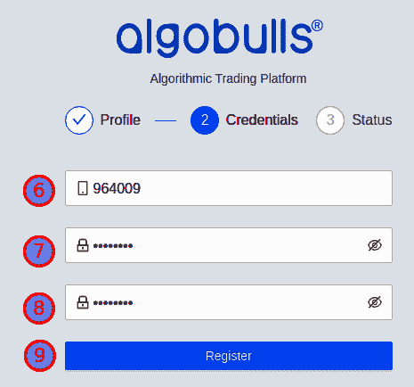
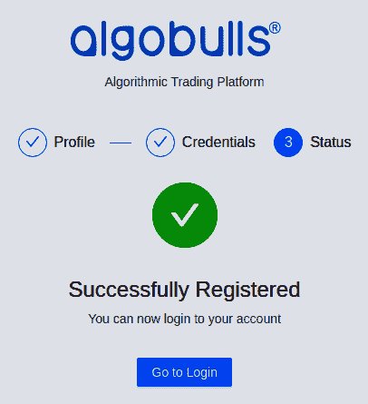
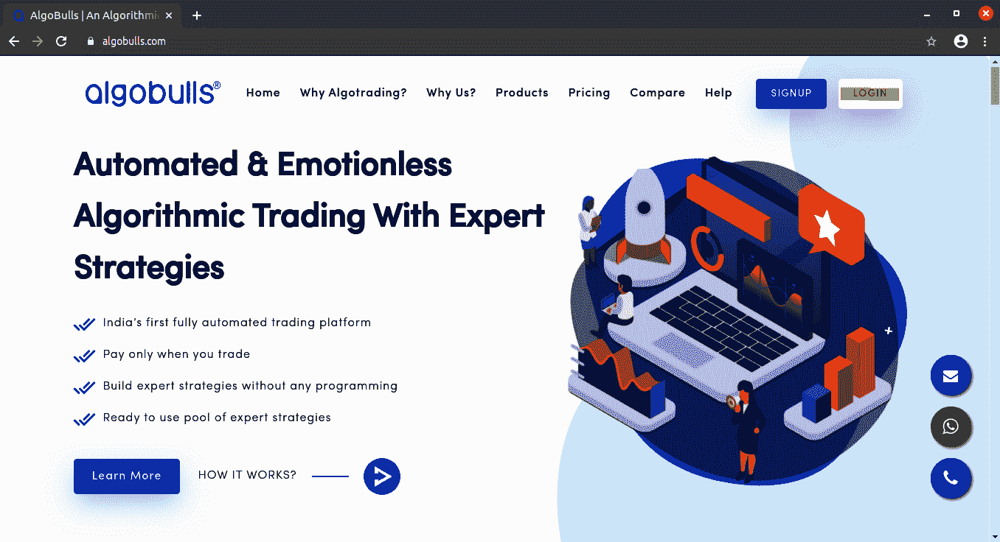
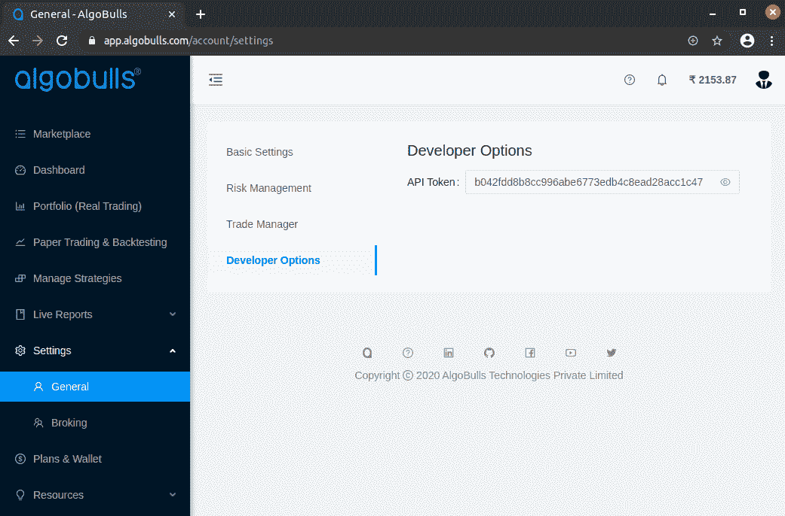

# 十三、附录二：设置您的 AlgoBulls 账户

本附录将帮助您建立自己的 algo bulls([https://algobulls.com](https://algobulls.com))账户。

本附录解释了以下部分:

*   在 AlgoBulls 平台上注册
*   登录 AlgoBulls 网站
*   获取您的 AlgoBulls 开发者选项令牌
*   为真实交易设置您的经纪账户

## 在 AlgoBulls 平台上注册

进入官方网站[https://algobulls.com](https://algobulls.com)，点击注册，即可在 AlgoBulls 平台注册，如下图所示:

您可以通过九个步骤在网站上注册，如下所示:

1.  输入您的姓名。
2.  输入您的电子邮件 ID。
3.  输入您的电话号码。确保该电话号码可用于接收**一次性密码** ( **OTP** )。
4.  点击“我不是机器人”复选框。
5.  单击 Get OTP 按钮，如下图所示:

6.  等到你在手机上收到动态口令。收到密码后，请输入密码。
7.  输入您的密码。
8.  确认您的密码。
9.  单击“注册”按钮，如下图所示:

您现在已经在网站上注册了。单击“转到登录”按钮登录到该站点，如下图所示:

## 登录 AlgoBulls 网站

进入官方网站[https://algobulls.com](https://algobulls.com)，点击登录，即可登录 AlgoBulls 平台，如下图所示:

您可以分三步登录网站，如下所示:

1.  输入您的注册电话号码。
2.  输入您的密码。
3.  单击登录按钮，如下图所示:

## 获取您的 AlgoBulls 开发者选项令牌

登录后，您可以通过从侧边栏导航到开发者选项页面来获取开发者选项令牌—设置|常规|开发者选项| API 令牌。您可以点击查看按钮(右边的眼睛图标)查看并复制**应用编程接口** ( **API** )令牌，如下图所示:

例如，前面截图中显示的 API 令牌是`b042fdd8b8cc996abe6773edb4c8ead28acc1c47`。

## 设置您的 AlgoBulls 账户

您需要执行以下操作，以利用 AlgoBulls 平台的算法交易服务:

*   **订阅计划**:服务——回溯测试、纸上交易和真实交易——是收费的。在享受这些服务之前，你需要先订阅一份计划。有一些免费计划可以在有限的时间内使用这些服务。你可以订阅这些计划来测试本章中的所有食谱。之后，您可以订阅付费计划，按月使用这些服务。
*   对于真实交易([第十一章](11.html)、*算法交易-真实交易*，您需要额外设置以下内容:
*   风险管理设置:这些设置帮助你在处理真钱时限制你的损失。
*   **添加经纪人**:您需要将您的经纪账户与 AlgoBulls 连接。你可以选择任何一个 AlgoBulls 支持的经纪人。

您可以在[https://help.algobulls.com/developers/](https://help.algobulls.com/developers/)通过截图找到设置这些细节的分步信息。任何额外的设置说明，可能会出现的时间，将可在该链接。如有其他要求，您也可以联系 developers@algobulls.com。